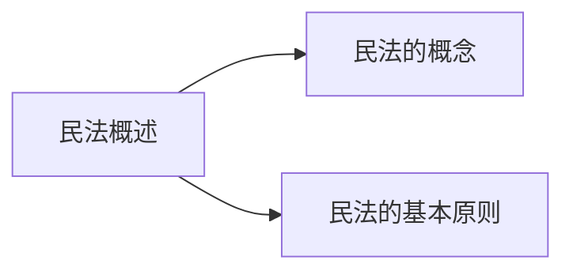
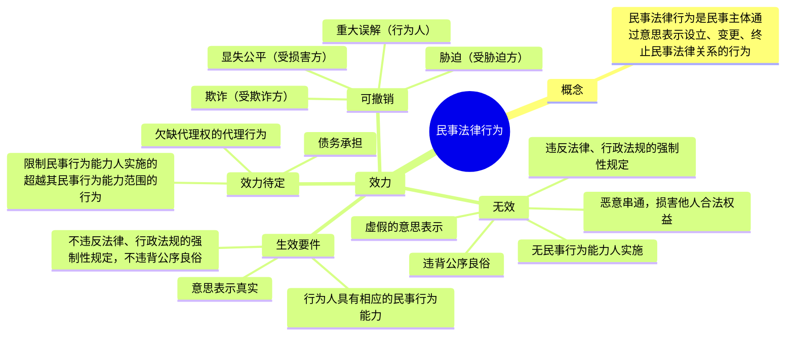
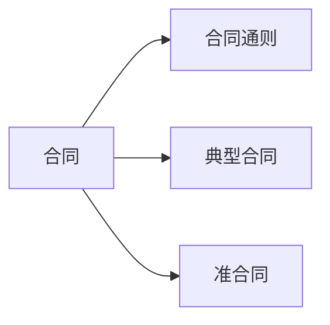

# 第一篇 法律知识

## 第一章 法理学

​	法理学这门学科主要涉及的是法学的基础理论。很多考生在接触法理学之初，往往会觉得法理学非常抽象，做题一做就错，究其原因无外乎基础概念没有掌握扎实。因此，学习法理学时，一定要掌握基础的概念，同时要注意把握概念之间的逻辑关系。

### 第一节 法的概述

**考情分析**

在公共基础知识的考试中，本节内容的考查概率适中，考点主要集中在法的概念、法的作用、法与道德等，考生须在理解的基础上对上述考点做到准确把握。

**本节框架**

```
 法的概述
  ├─ 法的概念
  ├─ 法的特征
  ├─ 法的作用
  ├─ 法的分类
  ├─ 法的要素
  ├─ 法律关系
  ├─ 法的效力范围
  └─法与社会
```

**知识内容**

#### 一、法的概念
法是指由国家制定、认可并由国家强制力保障实施的，反映由特定物质生活条件

关于法的概念，常见命题角度如下：
(1) 法的形成方式包括哪些？
法的形成包括两种方式：国家机关的制定和认可。
(2) 国家强制力是法实施的唯一保障吗？
不是。国家强制力是法实施的最后保障。
(3) 法为什么是由物质生活条件决定的？
法属于上层建筑的一种，上层建筑由经济基础决定，所以法最终是由物质生活条件决定的。
(4) 我国的统治阶级是谁？
在我国，统治阶级是人民。
(5) 法的主要内容是什么？
法以权利和义务为主要内容。
(6) 法是否调整思想？
不调整。法是行为规范体系。

决定的统治阶级意志，以权利义务为基础，以确认、保护和发展统治阶级所期望的社会关系和社会秩序为目的的行为规范体系。

#### 二、法的特征

法的六大特征：规范性、国家意志性、普遍性、强制性、程序性、可诉性。具体含义如下：
(1) 规范性指的是法是调整人们行为的一种社会规范，可以针对不特定的主体反复适用。例如，《刑法》提供了一种行为的模式，让人们知道什么是可以做的，什么是不可以做的。
(2) 国家意志性指的是法是由国家制定或者认可的，体现国家的意志，因此，法具有统一性和权威性。
(3) 普遍性指的是法在国家主权管辖范围内具有普遍适用的效力和特性，法律面前一律平等。


(4) 强制性指的是法以国家强制力为后盾，以国家强制力作为保证法实施的力量。
(5) 程序的基本含义是指按照规则而进行的活动或过程。法的创制、执行、适用、监督等都是严格按照一定的明确的程序来进行的。因此，法是强调程序、规定程序和实行程序的规范体系。
(6) 法的可诉性包括两个方面的含义：①可争讼性，即任何人均可以将法律作为起诉和辩护的根据。②可裁判性（可适用性），即合格的法庭可以将法作为司法裁判的直接依据。例如，甲欠乙钱不还，乙可以选择依据法律提起诉讼，而法院可以依据法律作出判决。

#### 三、法的作用
**（一）法的规范作用**

法的规范作用可以分为指引作用、评价作用、预测作用、强制作用、教育作用。
具体区分方式如下：
(1) 指引作用指的是法对个体行为的引导作用。例如，甲通过研读《刑法》法条，发现故意杀人属于犯罪行为，于是放弃了杀人的念头，这体现了法的指引作用。
(2) 评价作用指的是法作为尺度和标准对他人的行为的评判作用。例如，甲有盗窃的行为，乙根据《刑法》可以判断甲的行为不合法，这体现了法的评价作用。
(3) 预测作用指的是凭借法律的存在，可以预先估计到人们相互之间会如何行为。例如，甲醉酒后驾驶机动车，甲可以根据《刑法》预测国家机关会对其进行处罚，这体现了法的预测作用。
(4) 强制作用指的是法对违法犯罪者的行为的作用。例如，甲因抢劫被法院判处有期徒刑5年，这体现了法的强制作用。
(5) 教育作用指的是通过法的实施，使法律对一般人的行为产生影响。这种作用具体表现为示范作用和警示作用。例如，乙听说甲因抢劫被判处有期徒刑5年的案例后，不敢去抢劫了，这体现了法的教育作用。

**（二）法的社会作用**

法的社会作用是指法维护特定人群的社会关系和社会秩序。在阶级对立的社会中，法的社会作用大体上分为两大方面：一方面是阶级统治的职能，即政治职能；另一方面是执行社会公共事务的职能，即社会职能，如维护社会治安等。


#### 四、法的分类

法的分类标准如下：

（1）按法的效力等级、基本内容和制定程序不同，可以将法分为根本法和普通法。根本法指的是宪法，宪法之外的其他法律都称为普通法。

（2）按法的适用范围不同，可以将法分为一般法和特别法。一般法指的是针对一般人、一般时间，在全国普遍适用的法；特别法指的是生效范围较为狭窄的法，针对特定人、特定地区、特定时间内适用的法。例如，行政处罚法是一般法，治安管理处罚法则是特别法。

（3）按法的创制和表现形式不同，可以将法分为成文法和不成文法。成文法指的是由一定国家机关依立法程序创制，以条文形式表现出来，并正式公布施行的法，又称为“制定法”；不成文法指的是由国家认可，而赋予法律效力的习惯、惯例、判例、法理等。例如，我国的宪法、刑法都属于成文法，习惯法属于不成文法。

（4）按法规定的内容不同，可以将法分为实体法和程序法。实体法指的是从事实关系上规定权利和义务的法律，包括宪法、民法、刑法等；程序法指的是为保证实体法所规定的权利义务关系的实现而制定的诉讼程序和非诉讼程序的法律，如民事诉讼法、刑事诉讼法、行政诉讼法等。

（5）按法的制定和实施主体不同，可以将法分为国内法和国际法。国内法指的是由一定主权国家制定或认可并适用于本国主权所及范围的法。国际法指的是由参与国际关系的国家和其他主体通过协议制定或认可的，并适用于国家和其他主体之间的法。


#### 五、法的要素

**（一）概念**

法律是由法律规范组成的，法律规范被区分为法律规则和法律原则。


**名师解读**

> 考生应把握法律规则和法律原则的区别。
>
> （1）法律规则是指以一定的逻辑结构形式具体规定人们的法律权利、法律义务以及相应的法律后果的一种法律规范。判断标准：法律规则——明确具体。例如，《宪法》第三十五条规定：“中华人民共和国公民有言论、出版、集会、结社、游行、示威的自由。”
>
> (2) 法律原则是指为法律规则提供某种基础或本源的综合性的、指导性的原理或价值准则的一种法律规范。判断标准：法律原则——抽象模糊。例如，《宪法》第三十三条第二款规定：“中华人民共和国公民在法律面前一律平等。”

**（二）法律规则的分类**

(1) 按照规则的内容规定不同，法律规则可以分为授权性规则和义务性规则。授权性规则是指规定人们有权作出一定行为或不作出一定行为的规则。例如，《宪法》第三十五条规定：“中华人民共和国公民有言论、出版、集会、结社、游行、示威的自由。”义务性规则是指在内容上规定人们的法律义务，即有关人们应当作出或不作出某种行为的规则。例如，《宪法》第三十九条规定：“中华人民共和国公民的住宅不受侵犯。禁止非法搜查或者非法侵入公民的住宅。”

(2) 按照规则内容的确定性程度不同，法律规则可以分为确定性规则、委任性规则和准用性规则。所谓确定性规则，是指内容已明确肯定，无须再援引或参照其他规则来确定其内容的法律规则。例如，《刑法》第一百零二条第一款规定：“勾结外国，危害中华人民共和国的主权、领土完整和安全的，处无期徒刑或者十年以上有期徒刑。”所谓委任性规则，是指内容尚未确定，而只规定某种概括性指示，由相应国家机关通过相应途径或程序加以确定的法律规则。例如，《计量法》第三十二条规定：“中国人民解放军和国防科技工业系统计量工作的监督管理办法，由国务院、中央军事委员会依据本法另行制定。”此规定即属委任性规则。所谓准用性规则，是指内容本身没有规定人们具体的行为模式，而是可以援引或参照其他相应内容规定的规则。例如，《商业银行法》第十七条第一款规定：“商业银行的组织形式、组织机构适用《中华人民共和国公司法》的规定。”此规定即属准用性规则。

(3) 按照规则对人们行为规定和限定的范围或程度不同，法律规则可以分为强行性规则和任意性规则。所谓强行性规则，是指内容规定具有强制性质，不允许人们随便加以更改的法律规则。例如，《宪法》第四十九条第四款规定：“禁止破坏婚姻自由，禁止虐待老人、妇女和儿童。”所谓任意性规则，是指规定在一定范围内，允许人们自行选择或协商确定为与不为、为的方式以及法律关系中的权利义务内容的法律规则。例如，《民法典》第三十一条第一款规定：“对监护人的确定有争议的，由被监护人住所地的居民委员会、村民委员会或者民政部门指定监护人，有关当事人对指定不服的，”


#### 六、法律关系
**(一)法律关系三要素**

法律关系是在法律规范调整社会关系的过程中所形成的人们之间的权利和义务关系。法律关系由三要素组成，分别是主体、内容和客体。

**1. 法律关系主体**

法律关系主体指的是法律关系的参加者。具体包括：
(1) 自然人。自然人既包括中国公民，也包括居住在中国境内或在境内活动的外国公民和无国籍人。
(2) 机构和组织。这主要包括三类：一是各种国家机关；二是各种企事业组织和在中国领域内设立的中外合资经营企业、中外合作经营企业和外资企业；三是各政党和社会团体。
(3) 国家。在特殊情况下，国家可以作为一个整体成为法律关系的主体。例如，国家作为主权者，可以成为外贸关系中的债权人或者债务人。

**2. 法律关系的内容**

法律关系的内容就是法律关系主体之间的法律权利和法律义务。

法律权利是指国家通过法律规定对法律关系主体可以自主决定作出某种行为的许可和保障手段。例如，财产权。

法律义务是指国家通过法律规定对法律关系主体必须作出一定行为或不得作出一定行为的约束，与权利相对应。例如，纳税的义务。

**3. 法律关系客体**

法律关系客体是指法律关系主体之间权利和义务所指向的对象。法律关系客体包括以下几类：
(1) 物。例如，手机、电脑。
(2) 人身。人身是由各个生理器官组成的有机整体。
(3) 智力成果。又称精神产品，指的是人通过某种物体或大脑记载下来并加以流传的思维成果。例如，电影作品。
(4) 行为结果。例如，甲委托装修队为其装修房屋，在这一法律关系中，客体是装修的行为。

**（二）法律关系的形成、变更和消灭**

法律关系处于不断地生成、变更和消灭的运动过程。它的形成、变更、消灭，需要一定的条件。其中最主要的条件有二：一是法律规范，二是法律事实。

**名师解读**

> 1. 法律规范与法律事实的区分
>
>    (1) 法律规范。
>    法律规范是法律关系形成、变更和消灭的法律依据，没有一定的法律规范就不会有相应的法律关系。例如，《民法典》属于法律规范。
>
>    (2) 法律事实。
>    法律事实是指法律规范所规定的、能够引起法律关系产生、变更和消灭的客观情况或现象。法律事实是法律关系形成、变更和消灭必须具备的前提条件，它是法律规范与法律关系联系的中介。例如，签订合同这一行为属于法律事实。
>
> 2. 法律事实的分类
>
>    依据是否以人们的意志为转移作为标准，可以将法律事实大体上分为两类，即法律事件和法律行为。法律事件不以人的意志为转移，如人的生老病死、社会革命和战争、自然灾害。法律行为以人的意志为转移，如签订合同、登记结婚。

---

#### 七、法的效力范围
法的效力，即法的约束力，是指人们应当按照法律规定的行为模式来行为，必须予以服从的一种法律之力。根据学界主流观点，法的效力范围包括法对人的效力范围、空间效力范围和时间效力范围。

**☆名师解读**

> 关于法的效力范围，考生需掌握我国法的效力范围所采取的标准。
> (1) 法对人的效力是指法对谁有效力，适用于哪些人。我国采用的标准是以属地主义为主，与属人主义、保护主义相结合。
> (2) 法的空间效力是指法在哪些地域有效力，适用于哪些地区。一般来说，一国法律适用于该国主权范围所及的全部领域，包括领陆、领水及其底土和领空。根据有关国际条约的规定，一国的法律也可以适用于本国驻外使领馆、在外船舶及航空器。
> （3）法的时间效力，是指法何时生效、何时失效以及法对其生效以前的事件和行为有无溯及力。①法的生效时间主要有三种：自法律公布之日起生效、由该法律规定具体生效时间、规定法律公布后符合一定条件时生效。②法的失效一般分为明示的废止和默示的废止。③法的溯及力也被称为法溯及既往的效力，是指法对其生效以前的事件和行为具有约束力。关于法的溯及力的问题，现代法治社会实行的是法不溯及既往的原则。

#### 八、法与社会

**（一）法与经济**

经济基础对法有决定作用；法对经济基础具有反作用。

**（二）法与政治**

法与政治同属于上层建筑，法在多大程度上离不开政治，政治便在多大程度上离不开法。在法与政治的关系中，政治具有主导作用。

**（三）法与道德**

社会主义社会为法与道德的有机结合提供了广泛的社会基础。一方面，社会主义法追求良法之治，法律中已包含了道德的标准，它对社会主义道德具有积极的促进和保障作用。另一方面，社会主义道德又代表了最大多数人、人类历史上最先进的道德，它为社会主义法的制定提供价值引导并促进法的实施。

**名师解读**
关于法与社会，考生需重点掌握法律与道德的区别。具体区别如下：

| 区分标准 | 法律 | 道德 |
| :--- | :--- | :--- |
| 生成方式不同 | 国家制定或认可 | 自发演进生成 |
| 表现形式不同 | 一般为规范性法律文件 | 存在于内心、舆论或语言中 |
| 调整范围不同 | 调整范围较小 | 调整范围较大 |
| 评价标准不同 | 标准明确 | 标准模糊 |
| 强制方式不同 | 依靠国家强制力 | 依靠舆论和自觉 |


#### 考点清单
1. 考点1——法的概念中掌握六个关键词：法由国家制定或认可，法由国家强制力保障实施，法由物质生活条件决定，法反映统治阶级的意志，法的主要内容是权利和义务，法是一种行为规范体系。
2. 考点2——法的特征包括：规范性、国家意志性、普遍性、强制性、程序性、可诉性。
3. 考点3——法的规范作用包括：指引作用、评价作用、预测作用、强制作用、教育作用。
4. 考点4——法律规则和法律原则的区分标准：法律规则明确具体、法律原则抽象模糊。
5. 考点5——法律关系的三要素是主体、内容、客体。
6. 考点6——法律关系的形成、变更和消灭需要两个前提：法律规范和法律事实。
7. 考点7——根据主流观点，法的效力范围包括法对人的效力、空间效力和时间效力。
8. 考点8——法对人的效力，我国采取的原则是以属地主义为主，与属人主义和保护主义相结合。
9. 考点9——我国实行的是法不溯及既往原则。
10. 考点10——经济基础决定法，政治主导法。

#### 真题再现
1.（单选）法律是体现（ ）的意志，由国家制定并由国家强制力保证实施的规范体系。
A. 社会共同体
B. 统治阶级
C. 全体公民
D. 立法机关

【答案】B

【解析】本题考查法理学常识。
法是指由国家制定、认可并由国家强制力保障实施的，反映由特定物质生活条件决定的统治阶级意志，以权利义务为基础，以确认、保护和发展统治阶级所期望的社会关系和社会秩序为目的的行为规范体系。故B项正确，A、C、D三项错误。

故正确答案为B。
2.（单选）《中华人民共和国行政复议法》第四十三条规定：“本法自1999年10月1日起施行。1990年12月24日国务院发布、1994年10月9日国务院修订发布的《行政复议条例》同时废止。”对于这条规定，下列说法正确的是（　　）。
A. 体现了法对人的效力
B. 体现了法的时间效力
C. 体现了法的空间效力
D. 体现了法的时间和空间效力
【答案】B
【解析】本题考查法理学常识。
A项错误，法对人的效力是指法律对谁有效，适用于哪些人。该条规定并未体现法对人的效力。
B项正确，法的时间效力是指法律何时生效、何时失效以及法律对其生效以前的事件和行为是否具有溯及力。该条规定了《行政复议法》的生效时间和《行政复议条例》的废止时间，体现了法的时间效力。
C、D两项错误，法的空间效力是指法律在哪些地域有效力，适用于哪些地区。该条规定并未体现法的空间效力。
故正确答案为B。
3.（单选）下列属于法律行为的是（　　）。
A. 地震
B. 洪水
C. 张三家的羊跑进李四家的羊圈
D. 王五与赵六签订买卖合同
【答案】D
【解析】本题考查法理学。
法律行为是指能够发生法律效力的人们的意志行为，即根据当事人的个人意愿形成的一种有意识的活动，它是在社会生活中引起法律关系产生、变更和消灭的最经常的事实。在题目中，A、B、C三项都不以人的意志为转移。
故正确答案为D。
4.（单选）根据国家有关法律规定，本科学历才有资格参加国家司法考试。小王想参加国家司法考试，法学专业专科毕业后又继续读本科。这体现了法的（　　）。
A. 指引作用
B. 教育作用
C. 评价作用
D. 强制作用
【答案】A


 【解析】本题考查法理学。
A 项正确，指引作用是指法律对个体行为的引导作用，即指引作用的对象是每个人自己的行为。小王根据本科学历才有资格参加国家司法考试的法律规定，调整自己的行为，法学专业专科毕业后又继续读本科，这体现了法律对个体行为的指引作用。
B 项错误，教育作用是对一般人的行为的作用，包括正面教育和反面教育。
C 项错误，评价作用是法作为尺度和标准对他人的行为的评判作用。
D 项错误，强制作用是法对违法犯罪者的行为的作用。
故正确答案为 A。

---
5.（判断）按照法律规定的内容、法律地位和制定的程序不同，法律可以划分为根本法和普通法。其中，根本法又称宪法。( )

【答案】正确

【解析】本题考查法理学。
按照法律规定的内容、法律地位和制定程序的不同，可以将法分为根本法和普通法。根本法是指在一国的法律体系中具有最高法律效力和居于核心地位的、规定国家根本制度和公民基本权利和义务的、制定与修改程序更为严格的宪法。普通法是根本法之外的其他法律，普通法不得和根本法相抵触。
故表述正确。

---

#### 本节导图
**法的概述**
- **法的概念**
  - 国家制定或认可、国家强制力保障、物质决定
  - 反映统治阶级意志、权利义务、行为规范
- **法的特征**
  - 规范性、国家意志性、普遍性、强制性、程序性、可诉性
- **法的作用**
  - 规范作用
    - 指引本人
    - 评价他人
    - 预测相互
    - 强制违法犯罪者
    - 教育一般人
  - 社会作用
    - 维护统治、执行公共事务
- **法的分类**
  - 按法的效力等级、基本内容和制定程序不同：根本法和普通法
  - 按法的适用范围不同：一般法和特别法
  - 按法的创制和表现形式不同：成文法和不成文法
  - 按法规定的内容不同：实体法和程序法
  - 按法的制定和实施主体不同：国内法和国际法
  
- **法的要素**
  -法律原则：抽象模糊
  -法律规则：明确具体


---

**拓展阅读**

法理学被界定为法律的智慧，学习法理学这一学科，一方面，可以让我们树立法律观念、了解法律知识、确立法治信仰；另一方面，可以培养我们的法律思维，运用法理学去分析具体问题。就法律思维而言，法治思维是考生必须要具备的。下面我们来了解一下法治的基本内涵：
（1）法治意味着法律在社会生活中有最高权威。在法治国家，法律就是国王。法治要求一切国家机关、各政党、武装力量、各社会团体、各企事业单位和全体公民都必须在宪法和法律的范围内活动，不允许任何人、任何组织凌驾于法律之上。
（2）法治意味着良法之治。法律是治国之重器，良法是善治之前提，恶法或者劣法绝不可能实现法治，只会带来伤害和导致混乱。英国思想家霍布斯说：“良法就是为人民的利益所需而又清晰明确的法律。”


（3）法治意味着人权应得到尊重和保障。人权是人之为人所应拥有的基本权利，人因为拥有人权才成为人，人因为享有了人权才获得了人的尊严。
（4）法治意味着国家权力必须依法行使。权力是一把双刃剑，运行良好，可以为公众带来福祉；运行失范，则会给社会带来灾难。在现代社会，约束权力主要依靠法律制度。

### 第二节 法的运行

**考情分析**
在公共基础知识的考试中，本节内容的考查概率适中，考点主要集中在立法、执法、司法、法律责任等，考生须在理解的基础上对上述考点做到准确把握。

**本节框架**
```
法的运行
├─ 立法
│  ├─ 法律规范的效力等级
│  │  ├─ 立法权
│  │  ├─ 立法的效力
│  │  └─ 立法裁决
│  ├─ 法的渊源
│  │  ├─ 正式渊源
│  │  └─ 非正式渊源
│  └─ 法律部门与法律体系
├─ 法的实施
│  ├─ 执法
│  ├─ 司法
│  └─ 守法
├─ 法律解释
│  ├─ 正式解释
│  └─ 非正式解释
└─ 法律责任
   ├─ 产生的原因
   ├─ 构成要件
   └─ 分类
```

**知识内容**
#### 一、立法
立法是指法定的国家机关，依照法定的职权和程序制定、修改和废止法律和规范


性法律文件的活动，是掌握国家政权的阶级把自己的意志上升为国家意志的活动。

**（一）法律规范的效力等级**

**1. 立法权**

1. 全国人大及其常委会有权制定法律。  
2. 国务院有权制定行政法规。  
3. 省级人大及其常委会，设区的市、自治州的人大及其常委会有权制定地方性法规。  
4. 国务院组成部门、直属机构有权制定部门规章。  
5. 省级人民政府，设区的市、自治州的人民政府有权制定地方政府规章。  
6. 自治区、自治州、自治县的人大有权制定自治条例和单行条例。  


**名师解读**

1. **法律**。  
   法律是指由全国人大及其常委会制定、修改、补充、废止的规范性法律文件。  
   例如，全国人大制定的《民法典》，属于法律。  
   制定主体：全国人大及其常委会。  

2. **行政法规**。  
   行政法规是指由我国最高行政机关（即国务院）依照法定的权限和程序制定的规范性法律文件，是国家行政机关体系中效力最高的规范性文件。例如，国务院制定的《政府信息公开条例》，属于行政法规。  
   制定主体：国务院。  

3. **地方性法规**。  
   地方性法规是指法定的地方国家权力机关，依照法定的权限，在不同宪法、法律和行政法规相抵触的前提下，制定和颁布的在本行政区域范围内实施的规范性文件。例如，上海市十五届人大二次会议表决通过《上海市生活垃圾管理条例》，属于地方性法规。  
   制定主体：省、自治区、直辖市的人民代表大会及其常务委员会，设区的市的人民代表大会及其常务委员会，自治州的人民代表大会及其常务委员会。  

4. **部门规章**。  
   国务院各部、委员会、中国人民银行、审计署和具有行政管理职能的直属机


构，可以根据法律和国务院的行政法规、决定、命令，在本部门的权限范围内，制定规章。例如，公安部制定的《机动车登记规定》，属于部门规章。
制定主体：国务院各部委。

**（5）地方政府规章**
省、自治区、直辖市的人民政府，设区的市的人民政府和自治州的人民政府，可以制定规章。例如，北京市人民政府制定的《北京市储备粮管理办法》，属于地方政府规章。
制定主体：省、自治区、直辖市的人民政府，设区的市的人民政府，自治州的人民政府。

**（6）自治法规**
自治法规是民族区域自治地方，即自治区、自治州、自治县的人民代表大会制定的法律文件，包括自治条例和单行条例。例如，延边朝鲜族自治州人大制定的《延边朝鲜族自治州自治条例》，属于自治条例。
制定主体：自治区、自治州、自治县的人大。

---

**2. 立法的效力**
（1）宪法 > 法律 > 行政法规 > 地方性法规。
（2）宪法 > 法律 > 行政法规 > 部门规章。
（3）本级地方性法规 > 本级地方政府规章。
（4）省级地方性法规 > 设区的市的地方性法规。
（5）省级地方政府规章 > 设区的市的地方政府规章。

**名师解读**
关于立法的效力比较，考生无须死记硬背，掌握判断方法即可：同级人大 > 同级政府；上级 > 下级。具体而言：
（1）宪法效力最高。
（2）法律效力次之。
（3）行政法规效力再次之。
（4）地方性法规与部门规章之间具有同等效力，对同一事项的规定不一致，不能确定如何适用时，由国务院提出意见，国务院认为应当适用地方性法规的，


应当决定在该地方适用地方性法规的规定；认为应当适用部门规章的，应当提请全国人民代表大会常务委员会裁决。

（5）部门规章之间、部门规章与地方政府规章之间具有同等效力，在各自的权限范围内施行。省、自治区的人民政府制定的规章的效力高于本行政区域内的设区的市、自治州的人民政府制定的规章。

部门规章之间、部门规章与地方政府规章之间对同一事项的规定不一致时，由国务院裁决。

（6）自治条例和单行条例依法对法律、行政法规、地方性法规作变通规定的，在本自治地方适用自治条例和单行条例的规定。

**（二）法的渊源**

法的渊源是指特定法律共同体所承认的具有法的约束力或具有法律说服力并能够作为法律人的法律决定之大前提的规范或准则来源的那些资料，如制定法、判例、习惯、法理等。

**☆ 名师解读**

关于法的渊源，考生需重点掌握法律渊源的分类。

（1）正式渊源：具有明文规定的法律效力并且直接作为法律人的法律决定的大前提的规范来源的那些资料。当代中国法的渊源主要为以宪法为核心的各种制定法，包括宪法、法律、法规、规章、自治条例和单行条例、国际条约、国际惯例等。

（2）非正式渊源：不具有明文规定的法律效力，但具有法律说服力并能够构成法律人的法律决定的大前提的准则来源的那些资料。当代中国法的非正式渊源主要包括习惯、判例、政策等。

**（三）法律部门与法律体系**

**1. 法律部门**

法律部门也称部门法，是根据一定标准和原则对一国现行的全部法律规范所划定的调整同一类社会关系的法律规范的总称。

**2. 法律体系**

法律体系也称部门法体系，是指一国的全部现行法律规范，按照一定的标准和原


则，划分为不同的法律部门而形成的内部和谐一致、有机联系的整体。

**名师解读**
**(1) 法律部门的划分标准是什么？**
通常按照法律所调整的社会关系的性质和种类不同来划分法律部门，这是划分法律部门的主要标准。例如，行政处罚法、行政许可法、行政强制法等调整的是同一类社会关系，可以将其划分到行政法部门中。
**(2) 我国的法律体系是什么？**
当代中国的法律体系，是以宪法为核心的中国特色社会主义法律体系。主要由 7 个法律部门构成，分别是：宪法及宪法相关法、民商法、行政法、经济法、社会法、刑法、诉讼与非诉讼程序法。

#### 二、法的实施
以实施法律的主体和法的内容为标准，法的实施方式主要包括法的执行、法的适用、法的遵守。

(1) **执法**，又称法的执行，是指国家行政机关及其公职人员依法行使管理职权、履行职责、实施法律的活动。其特点有：①执法活动具有国家权威性和国家强制性；②执法的主体具有特定性；③执法内容具有广泛性；④执法具有主动性和单方面性。例如，交警对闯红灯的司机开罚单，属于执法。

(2) **司法**，又称法的适用，是指国家司法机关（人民法院、人民检察院）根据法定职权和法定程序，具体应用法律处理案件的专门活动。其特点有：①司法是由特定的国家机关及其公职人员，按照法定职权实施法律的专门活动，具有国家权威性；②司法是司法机关以国家强制力为后盾实施法律的活动，具有国家强制性；③司法是司法机关依照法定程序、运用法律处理案件的活动，具有严格的程序性及合法性；④司法必须有表明法的适用结果的法律文书，如判决书等。例如，人民检察院批准逮捕，属于司法。

(3) **守法**，又称法的遵守，是指公民、社会组织和国家机关以法律为自己的行为准则，依照法律行使权利、履行义务的活动。其特点有：①守法的主体：所有人都是守法的主体，所有组织都有义务守法。在当今中国，党政领导干部带头守法、模范守法，是树立法治意识的关键。②守法的范围：既要遵守宪法和法律，也要遵守与宪法<unclear>。


和法律相符合的行政法规、地方性法规、行政规章等。③守法的内容：行使法律权利和履行法律义务。

#### 三、法律解释

法律解释是指一定的人、组织以及国家机关在法律实施或适用过程中对表达法律的语言文字的意义进行揭示、说明和选择的活动。

根据法律解释主体与解释结果效力的不同，法律解释可以分为正式解释和非正式解释。正式解释通常分为立法解释、司法解释和行政解释。非正式解释通常分为学理解释、任意解释。

**（一）正式解释**
（1）立法解释是指全国人大常委会的解释。全国人大常委会享有解释宪法与法律的权力。这里所谓的“法律”是指狭义的法律。全国人大常委会的法律解释同法律具有同等效力。国务院、中央军事委员会、最高人民法院、最高人民检察院和全国人民代表大会各专门委员会以及省、自治区、直辖市的人民代表大会常务委员会可以向全国人民代表大会常务委员会提出法律解释要求。
（2）司法解释是指最高司法机关对司法机关在法律适用过程中具体法律应用问题进行的解释。司法解释分为审判解释与检察解释。所谓审判解释，是指最高人民法院有权对人民法院在审判过程中的具体法律应用问题进行解释。所谓检察解释，是指最高人民检察院有权对人民检察院在检察工作中的具体法律应用问题进行解释。
（3）行政解释是指国务院及其主管部门对有关法律与法规进行的解释。它包括两个方面：一方面，国务院及其主管部门有权对不属于审判和检察工作中的其他具体法律应用问题进行解释；另一方面，国务院及其主管部门有权对其在行使职权时对自己所制定的法规进行解释。

**（二）非正式解释**
（1）学理解释是指由学者或其他个人及组织对法律规定所作出的学术性和常识性的解释。
（2）任意解释是指司法活动中的当事人、代理人或者公民个人在日常生活中对法律所作的理解与解释。


#### 四、法律责任

法律责任是指行为人由于违法行为、违约行为或者法律规定而应承受的某种不利的法律后果。

根据违法行为所违反的法律的性质，可以把法律责任分为民事责任、行政责任、刑事责任、违宪责任。

**名师解读**
**1.法律责任产生的原因**
（1）违法行为。例如，张三杀人的行为违反《刑法》，被法院判处有期徒刑10年。这是因违法行为产生的法律责任。
（2）违约行为。例如，张三和李四签订买卖合同，张三违反合同的约定而承担违约责任。这是因违约行为产生的法律责任。
（3）法律规定。例如，张三饲养的狗咬伤李四，张三要承担赔偿责任。这是因为法律规定而承担的法律责任。

**2.法律责任的分类**
（1）民事责任。民事责任是指由于违反民事法律、违约或者由于民法规定所应承担的一种法律责任。
（2）行政责任。行政责任是指因违反行政法规定或因行政法规定而应承担的法律责任。包括行政处分和行政处罚。
（3）刑事责任。刑事责任是指行为人因其犯罪行为所必须承受的，由司法机关代表国家所确定的否定性法律后果。
（4）违宪责任。违宪责任是指由于有关国家机关制定的某种法律和法规、规章，或有关国家机关、社会组织或公民从事了与宪法规定相抵触的活动而产生的法律责任。

#### 考点清单
考点1——掌握立法权限。例如，行政法规的制定主体是国务院，自治条例和单行条例的制定主体是自治地方的人民代表大会。


考点 2——立法效力比较的方法：同级人大 > 同级政府；上级 > 下级。

考点 3——立法裁决的方法：地方性法规与部门规章之间对同一事项的规定不一致，不能确定如何适用时，由国务院提出意见；部门规章之间、部门规章与地方政府规章之间对同一事项的规定不一致时，由国务院裁决。

考点 4——当代中国法的渊源主要为以宪法为核心的各种制定法，包括宪法、法律、法规、规章、自治条例和单行条例、国际条约、国际惯例等。

考点 5——当代中国的法律体系，是以宪法为核心的中国特色社会主义法律体系。

考点 6——全国人大常委会有权作出立法解释，最高人民法院和最高人民检察院有权作出司法解释。

考点 7——法律责任的产生原因有三个，分别是违法行为、违约行为和法律规定。

考点 8——法律责任可以分为四类，分别是民事责任、行政责任、刑事责任、违宪责任。

#### 真题再现
1.（单选）下列不属于我国正式法律渊源的是（　　）。
A. 乡规民约
B. 行政法规
C. 地方性法规
D. 宪法

**【答案】A**
【解析】 本题考查法理学。
当代中国法的正式渊源主要是以宪法为核心的各种制定法，包括宪法、法律、法规、规章、自治条例和单行条例、国际条约、国际惯例等。乡规民约不是我国正式法律渊源。
本题为选非题，故正确答案为 A。
2.（单选）下列哪种行为属于司法活动？（　　）
A. 法官张某对邻居间的口角进行劝解，使其和好如初
B. 警察李某劝说其犯罪的弟弟去公安机关自首
C. 检察机关根据林某的举报对村内相关人员进行侦查
D. 法官王某怀疑自己妻子有外遇而决定自行访查

**【答案】C**


【解析】本题考查法律常识。

司法，又称法的适用，是指国家司法机关根据法定职权和程序，具体应用法律处理案件的专门活动。司法有如下特点：（1）司法是由特定的国家机关及其公职人员按照法定职权实施法律的专门活动；（2）司法具有国家强制性；（3）司法是司法机关依照法定程序处理案件的活动；（4）司法必须有表明法的适用的结果的法律文书。
A项错误，法官张某劝解邻居属于个人行为，没有利用法定职权，也不是依照法定程序进行的。
B项错误，警察李某的行为属于个人行为，没有利用自身职权，未经法定程序。
C项正确，检察机关的侦查活动是国家的司法机关依据法定职权和程序来处理案件的专门活动。
D项错误，法官王某自行访查属于个人行为，不代表国家意志。
故正确答案为C。
3.（单选）根据宪法和法律，下列哪一选项不正确？（    ）
A. 宪法具有最高的法律效力，一切规范性文件都不得与宪法相抵触
B. 法律的效力高于行政法规、地方性法规、规章
C. 行政法规的效力高于地方性法规、规章
D. 部门规章的效力高于地方性法规
【答案】D
【解析】本题考查法律常识。
A项正确，《立法法》第八十七条规定：“宪法具有最高的法律效力，一切法律、行政法规、地方性法规、自治条例和单行条例、规章都不得同宪法相抵触。”
B项正确，《立法法》第八十八条第一款规定：“法律的效力高于行政法规、地方性法规、规章。”
C项正确，《立法法》第八十八条第二款规定：“行政法规的效力高于地方性法规、规章。”
D项错误，《立法法》第九十五条第一款第二项规定：“地方性法规与部门规章之间对同一事项的规定不一致，不能确定如何适用时，由国务院提出意见，国务院认为应当适用地方性法规的，应当决定在该地方适用地方法规的规定；认为应当适用部门规章的，应当提请全国人民代表大会常务委员会裁决。”部门规章和地方性法规效力没有高低之分。


本题为选非题，故正确答案为 D。
4.（单选）一个国家全部的法律部门所构成的有机联系的整体是（　　）。
A. 立法体系　　　　　　　　B. 法律体系
C. 法学体系　　　　　　　　D. 法系
【答案】B
【解析】本题考查法理学概述。
A 项错误，立法体系是指规范性法律文件的体系。
B 项正确，法律体系是指一国的全部现行法律规范，按照一定的标准和原则划分成不同的法律部门而形成的内部和谐一致、有机联系的整体。
C 项错误，法学体系是由法学分支学科构成的具有内在有机联系的统一整体。
D 项错误，一般认为，在内容上和形式上具有某些共同特征，形成一种传统或派系的各国法律，就属于同一个法系。
故正确答案为 B。
5.（单选）下列选项中不是行政立法机关的是（　　）。
A. 国家商务部　　　　　　　B. 国家税务总局
C. 深圳市人民政府　　　　　D. 山西省人民政府办公厅
【答案】D
【解析】本题考查法理学常识。
行政立法主体是指依法取得行政立法权，可以制定行政法规或行政规章的国家行政机关。我国行政立法主体主要包括国务院，国务院各部委及直属机构，省、自治区、直辖市和设区的市、自治州的人民政府。
A 项正确，国家商务部隶属国务院，是国务院组成部门，是行政立法机关。
B 项正确，国家税务总局是国务院直属机构，是行政立法机关。
C 项正确，深圳市人民政府是设区的市的人民政府，是行政立法机关。
D 项错误，山西省人民政府是行政立法主体，但是其办公厅不是行政立法主体。
本题为选非题，故正确答案为 D。
6.（单选）按照我国现行宪法规定，有权制定和发布行政法规的国家机关是（　　）。
A. 全国人大常委会　　　　　B. 全国人大


C. 国务院各部委           D. 国务院

【答案】D

【解析】本题考查法律常识。
A项错误，《宪法》第六十七条规定：“全国人民代表大会常务委员会行使下列职权：（一）解释宪法，监督宪法的实施；（二）制定和修改除应当由全国人民代表大会制定的法律以外的其他法律；……”
B项错误，《宪法》第六十二条规定：“全国人民代表大会行使下列职权：（一）修改宪法；（二）监督宪法的实施；（三）制定和修改刑事、民事、国家机构的和其他的基本法律；……”
C项错误，《宪法》第九十条第二款规定：“各部、各委员会根据法律和国务院的行政法规、决定、命令，在本部门的权限内，发布命令、指示和规章。”
D项正确，《宪法》第八十九条规定：“国务院行使下列职权：（一）根据宪法和法律，规定行政措施，制定行政法规，发布决定和命令；……”
故正确答案为D。

---

**法的运行 —— 立法**
- **法律规范的效力等级**
  - **立法权**
    - 全国人大及其常委会：法律
    - 国务院：行政法规
    - 省级、设区的市、自治州人大及其常委会：地方性法规
    - 国务院部门、直属机构：部门规章
    - 省级、设区的市、自治州政府：地方政府规章
    - 自治地方人大：自治条例和单行条例
  - **立法的效力**
    - 上级 > 下级
    - 同级人大 > 同级政府
  - **立法裁决**
    - 地方性法规和部门规章不一致 &nbsp; 国务院提意见
    - 地方政府规章和部门规章不一致 &nbsp; 国务院裁决
- **法的渊源**
  - 正式渊源：以宪法为核心的制定法、国际条约、国际惯例等
  - 非正式渊源：判例、习惯、政策等
- **法律部门与法律体系**
  - 法律部门：调整同一类社会关系
  - 法律体系：有机整体，以宪法为核心的中国特色社会主义法律体系


**法的运行**

**法的实施**
*   **执法**
    *   主体：行政机关
    *   内容：全面管理
*   **司法**
    *   主体：司法机关
    *   内容：处理案件
*   **守法**
    *   主体：所有人
    *   内容：行使权利、履行义务

**法律解释**
*   **正式解释**
    *   立法解释 —— 全国人大常委会
    *   司法解释 —— 最高法、最高检
    *   行政解释 —— 国务院及其主管部门
*   **非正式解释**
    *   学理解释
    *   任意解释

**法律责任**
*   **产生的原因**：违法、违约、法律规定
*   **构成要件**：主体、违法或违约行为、损害事实、主观过错、因果关系
*   **分类**：民事责任、行政责任、刑事责任、违宪责任

---

**拓展阅读**
前文讲到了法的实施的主要方式为法的执行、法的适用、法的遵守。除此之外，还有一种法的实施方式——法律监督。广义的法律监督，是指由所有国家机关、各政党、各社会组织、媒体舆论和公民对各种法律活动的合法性所进行的监督。法理学中，法律监督可以分为两种体系：(1) 国家法律监督体系。国家机关的监督包括国家权力机关、行政机关、监察机关和司法机关的监督。(2) 社会法律监督体系。社会监督具体分为中国共产党的监督、人民政协的监督、各民主党派的监督、人民团体和社会组织的监督、媒体舆论的监督等。


## 第二章 宪法

很多人在接触宪法之初，都会觉得宪法非常高大上，似乎有些“不接地气”。其实，宪法和每个人的生活息息相关，如房子能不能拆、土地能不能征、应不应纳税等问题，都是宪法说了算。宪法捍卫着每一个公民的尊严，其核心价值在于保障公民的基本权利。因此，考生在学习宪法时，应将理论联系实际，克服畏难心理。  


### 第一节 宪法概述

**考情分析**

在公共基础知识的考试中，本节内容的考查概率适中，考点主要集中在宪法的概念、宪法的基本原则、宪法的历史等，考生须在理解的基础上对上述考点做到准确把握。  


**本节框架**
```
宪法概述  
├─宪法的概念和特征  
│  ├─ 概念：根本制度、根本任务、根本法  
│  └─ 特征  
│     ├─ 宪法是国家的根本法  
│     ├─ 宪法是公民权利的保障书  
│     └─ 宪法是民主事实法律化的基本形式  
├─ 宪法的分类
│  ├─ 成文宪法与不成文宪法  
│  ├─ 刚性宪法与柔性宪法  
│  ├─ 钦定宪法、民定宪法与协定宪法  
│  └─ 社会主义类型的宪法与资本主义类型的宪法  
├─ 宪法的基本原则  
│  ├─ 人民主权原则  
│  ├─ 基本人权原则  
│  ├─ 权力制约原则  
│  └─ 法治原则  
├─ 宪法的渊源与结构 
│  ├─ 渊源：宪法典、宪法性法律、宪法惯例、国际条约  
│  └─ 结构  
│     ├─ 序言  
│     └─ 正文  
└─ **宪法的历史**：《共同纲领》、54宪法、75宪法、78宪法、82宪法  
```


**知识内容**
#### 一、宪法的概念和特征
**（一）宪法的概念**
宪法是规定国家的根本制度和根本任务，集中体现各种政治力量对比关系、保障公民基本权利的国家根本法。

**☆ 名师解读**
（1）国家的根本制度是什么？
社会主义制度是中华人民共和国的根本制度。

（2）国家的根本任务是什么？
国家的根本任务是沿着中国特色社会主义道路，集中力量进行社会主义现代化建设。

（3）宪法作为根本法体现在哪些方面？
①在内容上，宪法规定一个国家最根本、最重要的问题。
②在法律效力上，宪法具有最高法律效力。宪法的法律效力高于普通法律，在国家法律体系中处于最高的法律地位。全国各族人民、一切国家机关和武装力量、各政党和各社会团体、各企业事业组织，都必须以宪法为根本的活动准则。
③在制定和修改的程序上，宪法比其他法律更加严格。

**（二）宪法的特征**
（1）宪法是国家的根本法。
（2）宪法是公民权利的保障书。
（3）宪法是民主事实法律化的基本形式。

**☆ 名师解读**
（1）为什么宪法是公民权利的保障书？
从宪法与国家的关系来看，宪法最重要、最核心的价值是保障公民的基本权利。在此意义上，宪法是公民权利的保障书。


（2）什么是民主事实法律化？
无产阶级民主事实是社会主义宪法产生的前提条件，而社会主义宪法则是无产阶级民主事实的法律化。

#### 二、宪法的分类
**（一）传统的宪法分类**
（1）成文宪法与不成文宪法。成文宪法与不成文宪法是英国学者 J. 蒲莱士 1884 年提出的宪法分类，标准为宪法是否具有统一的法典形式。成文宪法是具有统一法典形式的宪法，不成文宪法则不具有统一法典的形式。我国的宪法属于成文宪法。
（2）刚性宪法与柔性宪法。刚性宪法与柔性宪法也是英国学者 J. 蒲莱士最早提出来的，区分标准为宪法有无严格的制定、修改机关和程序。刚性宪法是指制定、修改的机关和程序不同于一般法律的宪法，柔性宪法是指制定、修改的机关和程序与一般法律相同的宪法。我国的宪法属于刚性宪法。
（3）钦定宪法、民定宪法与协定宪法。这是以制定宪法的机关为标准对宪法所作的分类。钦定宪法是指由君主或以君主的名义制定和颁布的宪法。民定宪法是指由民意机关或者由全民公决制定的宪法。协定宪法是指由君主与国民或者国民的代表机关协商制定的宪法。我国的宪法属于民定宪法。

**（二）马克思主义宪法学的分类**
马克思主义宪法学以国家的类型和宪法的阶级本质为标准，把宪法分为资本主义类型的宪法与社会主义类型的宪法。我国宪法属于社会主义类型的宪法。

#### 三、宪法的基本原则
**（一）人民主权原则**
人民主权原则是指国家中绝大多数人拥有国家的最高权力，一切权力属于人民。
**（二）基本人权原则**
人权是指作为一个人所应该享有的权利。从《共同纲领》开始，我国历部宪法都规定公民的基本权利和义务，特别是 2004 年将“国家尊重和保障人权”写入宪法后，基本人权原则成为国家的基本价值观。


**(三)权力制约原则**
权力制约原则是指国家权力的各部分之间相互监督、彼此牵制，从而保障公民权利的原则。在资本主义国家宪法中，权力制约原则主要表现为分权制衡原则。在社会主义国家宪法中则主要表现为监督原则。

**(四)法治原则**
法治思想的核心在于依法治理国家，法律面前人人平等，反对任何组织和个人享有法律之外的特权。我国《宪法》第五条第一款规定：“中华人民共和国实行依法治国，建设社会主义法治国家”。

#### 四、宪法的渊源与结构

**(一)宪法的渊源**
宪法的渊源是指宪法的表现形式。我国宪法的渊源包括宪法典、宪法性法律、宪法惯例、国际条约。
1. 宪法典是绝大多数国家采用的形式，是指将一国最根本、最重要的问题由统一的法律文本加以明确规定而形成的成文宪法。宪法典属于我国宪法的渊源，我国的宪法典是《中华人民共和国宪法》。
2. 宪法性法律是从部门法意义上按法律规定的内容、调整的社会关系进行分类所得出的结论。宪法性法律属于我国宪法的渊源，例如《选举法》《国务院组织法》《反分裂国家法》等均属于宪法性法律。
3. 宪法惯例是指宪法条文无明确规定，但在实际政治生活中已经存在，并为国家机关、政党及公众所普遍遵循，且与宪法有同等效力的习惯或传统。宪法惯例属于我国宪法的渊源。
4. 国际条约是指国际法主体之间就权利和义务关系缔结的一种书面协议。国际条约一旦为各国所接受，就应该具有普遍的约束力。国际条约属于我国宪法的渊源。

注意：宪法判例目前不是我国的宪法渊源。宪法判例是指宪法条文无明确规定，而由司法机关在审判实践中逐渐形成并具有实质性宪法效力的判例。美国、英国等国多采用宪法判例的形式。

**(二)宪法的结构**
宪法的结构是指宪法内容的组织和排列形式。我国宪法的结构包括序言和正文两部分。


**（1）序言**
宪法序言是写在宪法条文前面的陈述性表述，以表达本国宪法发展的历史、国家的基本政策和发展方向等。宪法序言是宪法精神和内容的高度概括。

**（2）正文**
我国现行宪法正文的排列顺序是：总纲，公民的基本权利和义务，国家机构，国旗、国歌、国徽、首都。

> 注意：我国现行宪法没有规定附则。

#### 五、宪法的历史

新中国先后颁布了一个宪法性文件和四部宪法，即《中国人民政治协商会议共同纲领》、1954年宪法、1975年宪法、1978年宪法、1982年宪法。

**名师解读**
新中国宪法的产生和发展历程如下：
1. 1949年，中国共产党领导中国人民推翻了帝国主义、封建主义和官僚资本主义的统治，建立了中华人民共和国。为了巩固人民革命的胜利成果，确立国家最根本、最重要的问题，1949年9月召开了具有广泛代表性的中国人民政治协商会议，制定了起临时宪法作用的《中国人民政治协商会议共同纲领》。
2. 1954年9月20日，第一届全国人民代表大会第一次会议制定通过了新中国第一部社会主义类型的宪法——1954年宪法。
3. 我国于1975年、1978年和1982年对1954年宪法进行了全面修改，并有多次部分修改。
4. 1982年12月4日，第五届全国人民代表大会第五次会议通过了新中国第四部宪法，即现行宪法。
5. 1982年宪法是在改革开放初期颁布的，随着改革开放的不断发展变化，其中有些规定已经不能适应时代发展的客观要求。为此，全国人民代表大会分别于1988年、1993年、1999年、2004年和2018年通过共52条修正案。

**◎考点清单**
考点1——宪法作为根本法体现在内容根本、效力最高、制修严格。
考点2——我国宪法属于成文宪法、刚性宪法、民定宪法、社会主义类型的宪法。


考点3——我国宪法的基本原则包括人民主权原则、基本人权原则、权力制约原则、法治原则。注意，我国宪法的基本原则不包括三权分立、权力分立和制衡。
考点4——我国宪法的渊源包括宪法典、宪法性法律、宪法惯例、国际条约，不包括宪法判例。
考点5——我国宪法的结构包括序言和正文。正文的排列顺序为：总纲，公民的基本权利和义务，国家机构，国旗、国歌、国徽、首都。
考点6——中华人民共和国的第一部宪法为1954年宪法，现行宪法为1982年宪法。

#### 真题再现
1.（单选）宪法的基本原则是指人们在制定和实施宪法的过程中必须遵循的最基本的准则。下面对我国宪法的基本原则表述正确的是（ ）。
A. 人民主权原则、基本人权原则、法治原则和权力制约原则
B. 人民主权原则、罪刑法定原则、法治原则和权力制约原则
C. 基本人权原则、依法解释原则、法治原则和经济中立原则
D. 基本人权原则、罪刑法定原则、法治原则和经济中立原则

【答案】A
【解析】本题考查宪法。
我国宪法的基本原则包括人民主权原则、基本人权原则、法治原则和权力制约原则，不包括罪刑法定原则、依法解释原则与经济中立原则。
故正确答案为A。
2.（单选）我国现行宪法是（ ）。
A. 1954年宪法
B. 1975年宪法
C. 1978年宪法
D. 1982年宪法

【答案】D
【解析】本题考查宪法。
我国现行宪法是1982年12月4日第五届全国人民代表大会第五次会议通过，1982年12月4日全国人民代表大会公告公布施行的。
故正确答案为D。
3.（单选） 下列关于宪法的阐述，正确的是 (　　)。

A. 宪法与普通法律具有同等的法律权威和相同的法律效力

B. 宪法是国家的根本法，是公民权利的保障书

C. 资产阶级宪法不体现民主，社会主义宪法体现社会主义民主

D. 由于宪法不直接作为司法裁判依据，因此它对社会正义的实现无能为力

【答案】B

【解析】本题考查宪法常识。

A项错误，根据《宪法》序言的规定，宪法以法律的形式确认了中国各族人民奋斗的成果，规定了国家的根本制度和根本任务，是国家的根本法，具有最高的法律效力。

B项正确，《宪法》是国家的根本大法，并且从宪法与国家的关系看，作为国家根本法的最重要、最核心的价值是保障公民的基本权利，在此意义上，宪法是公民权利的保障书。

C项错误，宪法是民主制度的法律化。资产阶级宪法体现资产阶级民主，社会主义宪法体现社会主义民主。

D项错误，宪法不是法院审理案件的直接依据，但宪法在社会发展的过程中可以保护和增进公民的自由和民主权利，最终实现社会的公平正义。故题干中“它对社会正义的实现无能为力”的说法错误。

故正确答案为B。

#### 本节导图

宪法概述
├── 宪法的概念和特征
│   ├── 概念
│   │   ├── 国家的根本制度：社会主义制度
│   │   └── 国家的根本任务：集中力量进行社会主义现代化建设
│   └── 特征
│       ├── 根本法：内容根本、效力最高、制修严格
│       ├── 宪法是国家的根本法
│       ├── 宪法是公民权利的保障书
│       └── 宪法是民主事实法律化的基本形式
└── 宪法的分类
    ├── 成文宪法与不成文宪法：我国宪法属于成文宪法
    ├── 刚性宪法与柔性宪法：我国宪法属于刚性宪法
    ├── 钦定宪法、民定宪法与协定宪法：我国宪法属于民定宪法
    └── 社会主义类型的宪法与资本主义类型的宪法：我国宪法属于社会主义类型的宪法


**宪法概述**

*   **宪法的基本原则**
    *   人民主权原则 国家的一切权力属于人民
    *   基本人权原则 2004年“国家尊重和保障人权”写入宪法
    *   权力制约原则 主要体现为监督
    *   法治原则 依法治国，建设社会主义法治国家
*   **宪法的渊源与结构**
    *   渊源 宪法典、宪法性法律、宪法惯例、国际条约
    *   结构
        *   序言
        *   正文
*   **宪法的历史**
    *   《共同纲领》 宪法性文件
    *   1954年宪法 新中国第一部宪法
    *   1982年宪法 现行宪法

---

**✧ 拓展阅读**

宪法基本原则中，有哪些和宪法修正案相关的知识点呢？

(1) 1999年修正案，将“中华人民共和国实行依法治国，建设社会主义法治国家”写入宪法。

(2) 2004年修正案，将“国家尊重和保障人权”写入宪法。

(3) 2018年修正案，将“健全社会主义法制”修改为“健全社会主义法治”。

---

### 第二节 国家的基本制度

**✧ 考情分析**

在公共基础知识的考试中，本节内容的考查概率适中，考点主要集中在政体、国体、政党制度、选举制度、民族区域自治制度等，考生须在理解的基础上对上述考点做到准确把握。


**本节框架**
```
- 国家的基本制度
  - 人民民主专政制度
  - 人民代表大会制度
  - 国家结构形式
  - 基本经济制度
  - 选举制度
  - 特别行政区制度
  - 民族区域自治制度
  - 基层群众自治制度
```
---

**知识内容**
#### 一、人民民主专政制度
**（一）人民民主专政的内涵**
人民民主专政是指中国共产党和中华人民共和国始终代表最广大人民的根本利益，可以使用专制的方法来对待敌对势力以维持人民民主政权。中国共产党领导的人民民主政权在人民内部实行民主，逐步扩大社会主义民主，发展社会主义民主政治；对境内外敌对势力和犯罪分子实行专政。

---

**名师解读**

> （1）人民民主专政制度是我国的国体。国体，即国家性质，是指国家的阶级本质，反映社会各阶级在国家中所处的地位。
> （2）《宪法》第一条第一款规定：“中华人民共和国是工人阶级领导的、以工农联盟为基础的人民民主专政的社会主义国家。”这一条不但从国家性质的角度表明了我国是社会主义国家，而且从国家政权的政治属性和阶级本质层面确定了我国是人民民主专政的国家。


**（二）我国人民民主专政的主要特色**

人民民主专政是立足于中国社会实际，对马克思列宁主义关于无产阶级专政理论的发展，有其中国特色。其中，中国共产党领导的多党合作和政治协商制度、爱国统一战线是我国人民民主专政的主要特色。  

**名师解读**

> （1）中国共产党领导的多党合作和政治协商制度是确保人民民主专政有效实施和实现的政治制度，在根本上区别于西方的两党制和多党制。在这一制度体系中，中国共产党是社会主义事业的领导核心，是执政党；各民主党派是接受中国共产党领导的、同中国共产党通力合作、共同致力于社会主义事业的亲密友党，是参政党。坚持中国共产党的领导，坚持四项基本原则，是中国共产党同各民主党派合作的政治基础；长期共存、互相监督、肝胆相照、荣辱与共是中国共产党同各民主党派合作的基本方针。中国共产党对各民主党派的领导是政治领导，即政治原则、政治方向和重大方针政策的领导。同时，各民主党派有在宪法规定范围内的政治自由、组织独立和法律地位平等的权利。  
>
> （2）我国新时期的爱国统一战线是由中国共产党领导的，有各民主党派和各人民团体参加的，包括全体社会主义劳动者、社会主义事业的建设者、拥护社会主义的爱国者、拥护祖国统一和致力于中华民族伟大复兴的爱国者的广泛的政治联盟。 
>
> 爱国统一战线的组织形式是中国人民政治协商会议，简称“政协”。政协不是国家机关，但是它同我国国家权力机关的活动有着极为密切的联系。比如全国人大召开会议的时候，中国人民政治协商会议全国委员会的委员列席，听取政府工作报告或参加对某项问题的讨论。政协也不同于一般的人民团体，它是在我国政治体制中具有重要地位和影响的政治性组织，是在我国政治生活中发展社会主义民主和实现各党派之间互相监督的重要形式。  


#### 二、人民代表大会制度

我国的政权组织形式是人民代表大会制度。人民代表大会制度是指拥有国家权力的人民根据民主集中制原则，通过民主选举组成全国人民代表大会和地方各级人民代表大会，并以人民代表大会为基础，建立全部国家机构，对人民负责，受人民监督，以实现人民当家作主的政治制度。


#### 三、国家结构形式

国家结构形式是指特定国家的统治阶级根据一定原则采取的调整国家整体与部分、中央与地方相互关系的形式。我国实行单一制的国家结构形式。

**名师解读**

单一制国家结构形式存在如下特点：①从法律制度上看，单一制国家只有一部宪法，有关国家权力的配置和国家机关的设置及相互关系，均由该宪法予以规定；②从政权组织形式上看，除有个别特别地方外，中央和地方均采用相同的政府体制，即一般只有一套政府体制；③在权力配置上，地方权力来源于中央的授予，国家权力的重心在中央；④在国际关系中，只有一个国际法主体，地方一般不能作为国际法的主体参与国际关系；⑤公民具有统一的国籍；⑥地方作为国家的行政区域单位，不具有独立性，没有从国家分离出去的权力。

#### 四、基本经济制度

根据《宪法》第六条第二款的规定，国家在社会主义初级阶段，坚持公有制为主体、多种所有制经济共同发展的基本经济制度。社会主义公有制是我国经济制度的基础，非公有制经济是社会主义市场经济的重要组成部分。

**名师解读**

> (1) 我国社会主义经济制度的基础是生产资料的社会主义公有制，即全民所有制和劳动群众集体所有制。全民所有制经济即国有经济，是指由代表人民利益...的国家占有生产资料的一种所有制形式。集体所有制经济是指生产资料归集体经济组织内的劳动者共同所有的一种所有制形式。例如，农村中的生产、供销、信用、消费等各种形式的合作经济，均属于社会主义劳动群众集体所有制经济。
>
> （2）由于土地等自然资源是国有经济赖以发展的物质基础，因此，我国宪法规定，矿藏、水流、森林、山岭、草原、荒地、滩涂等自然资源，都属于国家所有，即全民所有；由法律规定属于集体所有的森林和山岭、草原、荒地、滩涂除外。城市的土地属于国家所有。农村和城市郊区的土地，除由法律规定属于国家所有的以外，属于集体所有；宅基地和自留地、自留山，也属于集体所有。

#### 五、选举制度

选举制度是一国统治阶级通过法律规定的关于选举国家代议机关代表的原则、程序与方法等各项制度的总称。我国选举制度的基本原则有：选举权的普遍性原则；选举权的平等原则；直接选举和间接选举并用原则；秘密投票原则。

**（一）选举权的普遍性原则**

选举权的普遍性是就享有选举权的主体范围而言的，是指一国公民中能够享有选举权的广泛程度。在我国享有选举权的基本条件是：（1）具有中国国籍，是中华人民共和国公民；（2）年满18周岁；（3）依法享有政治权利。精神病患者不能行使选举权利的，经选举委员会确认，不列入选民名单。

**（二）选举权的平等原则**

选举权的平等性是指每个选民在每次选举中只能在一个选区享有一个投票权，不承认也不允许任何选民因民族、种族、职业、财产状况、家庭出身、居住期限的不同而在选举中享有特权，更不允许非法限制或者歧视任何选民对选举权的行使。我国选举权的平等性既着眼于机会平等，也重视实质平等。比如，2010年《选举法》作出修改，规定实行城乡按相同人口比例选举人大代表，并保证各地区、各民族、各方面都有适当数量的代表。

**（三）直接选举和间接选举并用原则**

不设区的市、市辖区、县、自治县、乡、民族乡、镇的人民代表大会代表，由选民直接选举（即直接选举），选出的代表受选民监督，对选民负责；全国人民代表大会代表，省、自治区、直辖市、设区的市、自治州的人民代表大会代表，由下一级人


民代表大会选举（即间接选举），选出的代表受原选举单位监督，对原选举单位负责。
即县乡两级直接选，省市全国间接选。

**（四）秘密投票原则**
秘密投票亦称无记名投票，它与记名投票或以起立、举手、鼓掌等公开表示自己意愿的方法相对立，是指选民不署自己的姓名、亲自书写选票并投入密封票箱的一种投票方法。选民如果是文盲或者因残疾不能写选票的，可以委托他信任的人代写，这不违反秘密投票原则。

#### 六、特别行政区制度

| 类别 | 内容 |
| :--- | :--- |
| **概念** | 特别行政区是指在我国版图内，根据我国宪法和基本法的规定而设立的，具有特殊的法律地位，实行特别的政治、经济制度的行政区域 |
| **特点** | 特别行政区享有高度自治权<br>特别行政区保持原有资本主义制度和生活方式 50 年不变<br>特别行政区的行政机关和立法机关由该地区永久性居民依照基本法的有关规定组成<br>特别行政区原有的法律基本不变 |
| **中央与特别行政区的关系** | **全国人民代表大会**<br>(1) 有权决定特别行政区的设立及其制度<br>(2) 享有制定并修改特别行政区基本法的专属权<br><br>**全国人大常委会**<br>(1) 享有对特别行政区基本法的解释权<br>(2) 享有对特别行政区立法的备案审查权<br>(3) 享有特别行政区进入紧急状态的决定权<br><br>**国务院**<br>(1) 负责管理与特别行政区有关的外交事务<br>(2) 负责管理特别行政区的防务<br>(3) 任命特别行政区行政长官及其他主要行政官员 |

**名师解读**
(1) 特别行政区享有的高度自治权包括哪些？
行政管理权、立法权、独立的司法权和终审权、自行处理有关对外事务的权力。
(2) “永久性居民”指的是什么？
“永久性居民”是指在特别行政区享有居留权和有资格依照特别行政区法律取得载明其居留权和永久性居民身份证的居民。


（3）全国人大常委会的备案审查权指的是什么？
特别行政区的立法机关制定的法律须报全国人大常委会备案。备案不影响该法律的生效。全国人大常委会在征询其所属的特别行政区基本法委员会后，如认为特别行政区立法机关制定的法律不符合基本法关于中央管理的事务及中央和特别行政区的关系的条款，可将有关法律发回，但不作修改。经全国人大常委会发回的法律立即失效。该法律的失效，除特别行政区的法律另有规定外，无溯及力。

（4）特别行政区行政长官的产生条件有哪些？
**特别行政区行政长官是特别行政区的首长**，代表特别行政区，根据基本法的规定，对中央人民政府和特别行政区负责。特别行政区行政长官由**年满40周岁**，在**香港通常居住连续满20年**并在**外国无居留权**的香港特别行政区永久性居民中的中国公民，或在**澳门通常居住连续满20年**的澳门特别行政区永久性居民中的中国公民担任。可见，除“年满40周岁”“连续居住满20年”“永久性居民中的中国公民”三个条件外，香港特别行政区基本法比澳门特别行政区基本法中的行政长官任职条件多一项“在外国无居留权”。关于特别行政区行政长官的产生办法，基本法规定，在当地通过选举或协商产生，由中央人民政府任命。

#### 七、民族区域自治制度

民族区域自治制度是指在国家的统一领导下，以少数民族聚居区为基础，建立相应的自治地方，设立自治机关，行使自治权，使实行区域自治的民族的人民自主地管理本民族地方性事务的制度。

**名师解读**

> （1）民族自治地方包括哪些？
> 民族自治地方包括自治区、自治州和自治县。民族乡不是民族自治地方。
>
> （2）民族自治地方的自治机关指的是哪些？
> 民族自治地方的自治机关是自治区、自治州和自治县的人民代表大会和人民政府。
>
> （3）自治地方的官员有什么要求？
> 根据《宪法》的规定，自治区、自治州、自治县的人民代表大会常务委员会中应当有实行区域自治的民族的公民担任主任或副主任。自治区主席、自治州州长、


自治县县长由实行区域自治的民族的公民担任。
（4）民族自治地方的自治权包括哪些？
①制定自治条例和单行条例。自治地方的人民代表大会有权制定自治条例和单行条例。自治条例是结合当地民族政治、经济和文化特点制定的有关管理自治地方事务的综合性法规。其内容涉及民族区域自治的基本组织原则、机构设置、自治机关的职权、活动原则、工作制度等重要问题。单行条例是根据当地民族的特点，针对某一方面的具体问题而制定的法规。
②根据当地民族的实际情况，贯彻执行国家的法律和政策。如果上级国家机关的决议、决定、命令和指示，有不适合民族自治地方实际情况的，自治机关可以报经该上级国家机关批准，变通执行或者停止执行；该上级国家机关应当在收到报告之日起60日内给予答复。
③自主地管理地方财政、经济、教育、科学、文化、卫生、体育事业。
④组织维护社会治安的公安部队。民族自治地方的自治机关依照国家军事制度和当地的实际需要，经国务院批准，可以组织本地方维护社会治安的公安部队。
⑤使用本民族的语言文字。民族自治地方的自治机关在执行职务的时候，依照本民族自治地方自治条例的规定，使用当地通用的一种或者几种语言文字。

#### 八、基层群众自治制度

根据《宪法》规定，城市和农村按居民居住地区设立的居民委员会或者村民委员会是基层群众性自治组织。居民委员会、村民委员会的主任、副主任和委员由居民（村民）选举。基层政权与它们的关系是指导关系。
**（一）村民委员会成员产生方式**
村民委员会成员由村民直接选举产生，不是由政府指定、委派的，也不是由村民代表选举产生的。村民委员会成员具体产生的流程如下：
（1）村民委员会的选举，由村民选举委员会主持。
（2）村民委员会选举前，应当对下列人员进行登记，列入参加选举的村民名单：
①户籍在本村并且在本村居住的村民；
②户籍在本村，不在本村居住，本人表示参加选举的村民；
③户籍不在本村，在本村居住1年以上，本人申请参加选举，并且经村民会议或者村民代表会议同意参加选举的公民。
注意：已在户籍所在村或者居住村登


记参加选举的村民，不得再参加其他地方村民委员会的选举。

（3）双过半制：选举村民委员会，有登记参加选举的村民过半数投票，选举有效；候选人获得参加投票的村民过半数的选票，始得当选。

**（二）居民委员会成员产生方式**
居民委员会主任、副主任和委员，由本居住地区全体有选举权的居民或者由每户派代表选举产生；根据居民意见，也可以由每个居民小组选举代表2～3人选举产生。

**（三）任期**
居（村）民委员会每届任期5年。届满应当及时举行换届选举。居（村）民委员会成员可以连选连任。

---

#### 考点清单
考点1——我国的政体、政权组织形式、根本政治制度是人民代表大会制度。

考点2——我国的国体、国家性质是人民民主专政制度。

考点3——坚持中国共产党的领导，坚持四项基本原则，是中国共产党同各民主党派合作的政治基础；长期共存、互相监督、肝胆相照、荣辱与共是中国共产党同各民主党派合作的基本方针。

考点4——土地的权属：城市的土地属于国家所有，农村和城市郊区的土地，除由法律规定属于国家所有的以外，属于集体所有；宅基地和自留地、自留山，也属于集体所有。

考点5——在我国享有选举权的基本条件：
（1）具有中国国籍，是中华人民共和国公民；
（2）年满18周岁；
（3）依法享有政治权利。

考点6——选举的方式：我国实行直接选举和间接选举相结合的方式，县乡两级直接选、省市全国间接选。

考点7——民族自治地方包括自治区、自治州、自治县。
民族自治地方的自治机关包括自治地方的人大和人民政府。
自治地方的官员要求：自治区、自治州、自治县的人大常委会中应当有实行区域自治的民族的公民担任主任或副主任。自治区主席、自治州州长、自治县县长由实行区域自治的民族的公民担任。

考点8——村委会、居委会的性质是基层群众性自治组织。


#### 真题再现
1.（单选）下列选项中关于我国政体的判断，正确的是（　　）。
A. 人民民主专政的社会主义国家
B. 承认民族区域自治的单一制国家
C. 具有中国特色的“一国两制”制度
D. 以民主集中制为原则的人民代表大会制度

【答案】D

【解析】本题考查宪法。
A项错误，《宪法》第一条第一款规定：“中华人民共和国是工人阶级领导的、以工农联盟为基础的人民民主专政的社会主义国家。”人民民主专政的社会主义国家是我国的国体。
B项错误，单一制是我国的国家结构形式，并非我国的政体。
C项错误，“一国两制”是我国一项长期不变的基本国策，并非我国的政体。
D项正确，《宪法》第二条第一款、第二款规定：“中华人民共和国的一切权力属于人民。人民行使国家权力的机关是全国人民代表大会和地方各级人民代表大会。”第三条第一款规定：“中华人民共和国的国家机构实行民主集中制的原则。”以民主集中制为原则的人民代表大会制度是我国的政体。
故正确答案为D。
2.（单选）中国共产党的领导是多党合作的首要前提和根本保证，这种领导主要是（　　）。
A. 政治领导
B. 组织领导
C. 思想领导
D. 机构领导

【答案】A

【解析】本题考查宪法。
A项正确，多党合作的首要前提和根本保证是坚持中国共产党领导。中国共产党对民主党派的领导是政治领导，即政治原则、政治方向和重大方针政策的领导。
B项错误，组织领导即充分发挥各级党组织的战斗堡垒作用，以广大党员的先锋模范作用，来带动和影响人民群众，从组织上保证党的纲领和路线，国家的宪法、法律付诸实施；培养、选拔、考核和监督干部，并向国家机关推荐德才兼备的干部，以成功地推进中国特色社会主义事业的发展。与本题没有关联。


C项错误，思想领导即用马列主义、毛泽东思想、邓小平理论、“三个代表”重要思想、科学发展观、习近平新时代中国特色社会主义思想教育党员和人民群众，不断提高他们的思想觉悟，使其懂得党的纲领和路线，懂得国家的法律和政策，并自觉地贯彻执行。与本题没有关联。

D项错误，没有机构领导的说法。

故正确答案为 A。
3.（单选）《中华人民共和国城市居民委员会组织法》规定，居民委员会是（　　）。
A. 基层政权机构　　　　　B. 基层综合治理机构
C. 基层群众性自治组织　　D. 基层派出机构

【答案】C
【解析】本题考查宪法。
《城市居民委员会组织法》第二条第一款规定：“居民委员会是居民自我管理、自我教育、自我服务的基层群众性自治组织。”A、B、D三项错误，居民委员会和村民委员会都属于基层群众性自治组织。

故正确答案为 C。
4.（单选）宪法规定，我国享有选举权和被选举权的人是（　　）。
A. 全体公民
B. 全体人民
C. 18周岁以上的公民
D. 年满18周岁未被依法剥夺政治权利的公民

【答案】D
【解析】本题考查宪法。
《宪法》第三十四条规定：“中华人民共和国年满十八周岁的公民，不分民族、种族、性别、职业、家庭出身、宗教信仰、教育程度、财产状况、居住期限，都有选举权和被选举权；但是依照法律被剥夺政治权利的人除外。”因此，在我国享有选举权的基本条件包括：（1）年满18周岁；（2）具有中华人民共和国国籍；（3）享有政治权利。

故正确答案为 D。
5.（单选）W集团赞助的H勘探队，在李家村后山勘探出了钨矿，请问钨矿归属于


谁？（  ）
A. 国家
B. 李家村
C. W集团
D. H勘探队

【答案】 A

【解析】 本题考查宪法。
《宪法》第九条第一款规定：“矿藏、水流、森林、山岭、草原、荒地、滩涂等自然资源，都属于国家所有，即全民所有；由法律规定属于集体所有的森林和山岭、草原、荒地、滩涂除外。”题干中的钨矿属于矿藏，属于国家所有。
故正确答案为A。

---

**国家的基本制度（本节导图）
1. 人民民主专政制度
   - 地位：国体、国家性质
   - 特色1：多党合作和政治协商制度
     - 地位：中国共产党是执政党；各民主党派是参政党
     - 政治基础：坚持中国共产党的领导、坚持四项基本原则
     - 基本方针：长期共存、互相监督、肝胆相照、荣辱与共
     - 领导方式：政治领导
   - 特色2：爱国统一战线
     - 2018年新增群体：致力于中华民族伟大复兴的爱国者
     - 组织形式：政协
2. 人民代表大会制度
   - 政权组织形式、政体、根本政治制度
3. 国家结构形式
   - 单一制
4. 基本经济制度
   - 公有制（主体）
     - 自然资源归属
       - 城市土地、矿藏、水流：专属国家
       - 宅基地、自留山、自留地：专属集体
       - 森、山、草、荒、滩：既可以归国家，也可以归集体
     - 土地归属
       - 城市土地：专属国家
       - 农村和城市郊区的土地：原则归集体，例外归国家
   - 非公有制：个体经济、私营经济、三资企业
5. 选举制度
   - 基本原则
     - 普遍性原则：中国公民、年满18周岁、未被剥夺政治权利
     - 平等原则
     - 直接选举与间接选举并用原则
       - 县乡两级直接选
       - 省市全国间接选
     - 秘密投票原则


**国家的基本制度**

**特别行政区制度**
**特点**
*   特别行政区享有高度自治权
*   特别行政区保持原有资本主义制度和生活方式50年不变
*   特别行政区的行政机关和立法机关由该地区永久性居民依照基本法的有关规定组成
*   特别行政区原有的法律基本不变

**中央与特别行政区的关系**
*   **全国人大**
    *   有权决定特别行政区的设立及其制度
    *   享有制定并修改特别行政区基本法的专属权
*   **全国人大常委会**
    *   享有对特别行政区基本法的解释权
    *   享有对特别行政区立法的备案审查权
    *   享有特别行政区进入紧急状态的决定权
*   **国务院**
    *   负责管理与特别行政区有关的外交事务
    *   负责管理特别行政区的防务
    *   任命特别行政区行政长官及其他主要行政官员

**民族区域自治制度**
*   **自治地方**：自治区、自治州、自治县
*   **自治机关**：人大和政府
*   **官员要求**
    *   人大常委会：主任或副主任其中之一是当地
    *   政府：行政一把手必须是当地
*   **自治权**
    *   制定自治条例和单行条例
    *   变通执行权
    *   管理财政、经济、科教文卫体
    *   经批准可组织公安部队
    *   使用本民族语言文字

**基层群众自治制度**
*   居委会、村委会是基层群众性自治组织
*   基层政权与居委会、村委会是指导关系
*   居委会、村委会每届任期5年

---
**拓展阅读**

前文讲到了选举制度的基本原则，那么在实际选举过程中有哪些需要注意的流程性事项呢？

（1）选举机构。在实行直接选举的地方，设立选举委员会主持本级人大代表的选举。间接选举由本级人大常委会主持。

（2）选民登记。选民登记按选区进行，经登记确认的选民资格长期有效。

（3）投票选举。在选民直接选举人民代表大会代表时，选区全体选民的过半数参加投票，选举有效。代表候选人获得参加投票的选民过半数的选票时，始得当选。县级以上的地方各级人民代表大会在选举上一级人民代表大会代表时，代表候选人获得全体代表过半数的选票时，始得当选。


### 第三节 公民的基本权利和义务

---

**考情分析**
在公共基础知识的考试中，本节内容的考查概率适中，考点主要集中在政治权利和自由、人身权、社会经济和文化教育方面的权利等，考生须在理解的基础上对上述考点做到准确把握。

**本节框架**
- 公民的基本权利和义务
  - 基本权利
    - 平等权
    - 政治权利和自由
    - 监督权和获得赔偿权
    - 宗教信仰自由
    - 人身权
    - 社会经济权利
    - 文化教育权利
    - 特定人的权利
  - 基本义务
    - 服兵役、纳税等

**知识内容**
#### 一、我国公民的基本权利
**(一) 平等权**
平等权是指公民依法平等地享有权利，不受任何不合理的差别对待，要求国家法律给予权利同等保护。

平等权的基本内容可以从以下三个角度理解：
(1) 法律面前一律平等。这一规定的含义有三:一是公民不分民族、种族、性别、职业、家庭出身、宗教信仰、教育程度、财产状况、居住期限，都一律平等地享有宪法和法律规定的权利，也都平等地履行宪法和法律规定的义务；二是任何人的法律权利受到平等保护，对违法行为一律依法予以追究，绝不允许任何违法犯罪分子逍遥法外；三是在法律面前，不允许任何公民享有法律以外的特权，任何人不得强制公民承担法律以外的义务，不得使公民受到法律规定以外的处罚。


**(2) 禁止差别对待**
公民在法律面前人人平等，社会身份、职业、出身等原因不应成为任何受到不平等待遇的理由。

**(3) 允许合理差别**
宪法并不禁止一切差别，宪法禁止的是不合理的差别，合理的差别是允许存在的，不能只着眼于形式上的绝对平等。例如，人大代表享有言论免责权，这一权利是代表基于其代表资格而享有的，这里代表与其他公民相比所享有的优待是合理的差别。

---

**(二) 政治权利和自由**
政治权利和自由是公民依法享有的参加国家政治生活的权利和自由。包括公民参与国家、社会组织与管理活动的选举权和被选举权，以及公民在国家政治生活中依法发表意见，表达意愿的言论、出版、集会、结社、游行、示威的自由。

**名师解读**
(1) 选举权是指选民依法选举代议机关代表的权利；被选举权则指选民依法被选举为代议机关代表的权利。选举权和被选举权是我国人民参与国家管理，实现当家作主的具体表现，也是人民行使国家权力的基本形式。
(2) 政治自由是指公民表达自己政治意愿的自由。言论自由指的是公民有权通过各种语言形式，针对国家政治和社会中的各种问题表达其思想和见解的自由。出版自由是指公民可以通过公开出版物的形式，自由地表达自己对国家事务、经济和文化事业、社会事务的见解和看法。结社自由是指有着共同意愿或利益的公民，为了一定宗旨而依法定程序组成具有持续性的社会团体的自由。集会、游行、示威自由是言论自由的延伸和具体化，是公民表达其意愿的不同形式。

---

**(三) 监督权和获得赔偿权**
**1. 监督权**
监督权是指宪法赋予公民监督国家机关及其工作人员活动的权利，其内容包括批评、建议权，控告、检举权和申诉权。
(1) 批评、建议权。中华人民共和国公民对于任何国家机关和国家工作人员，有提出批评和建议的权利。批评权是指公民有对国家机关和国家工作人员工作中的缺点和错误提出批评意见的权利。建议权是指公民有对国家机关和国家工作人员的工作提出合理化建议的权利。


(2) 控告、检举权。控告权是指公民对任何国家机关和国家工作人员的违法失职行为，有向有关机关进行揭发和指控的权利。检举权是指公民对于违法失职的国家机关和国家工作人员，有向有关机关揭发事实、请求依法处理的权利。

(3) 申诉权。申诉权是指公民的合法权益因行政机关或司法机关作出错误的、违法的决定或裁判，或者因国家工作人员的违法失职行为而受到侵害时，有向有关机关申述理由，要求重新处理的权利。

2. 获得赔偿权
获得赔偿权是指公民的合法权益因国家机关或者国家工作人员违法行使职权而受到侵害的，公民有要求国家赔偿的权利。

**（四）宗教信仰自由**
宗教信仰自由是指公民依据内心的信念，自愿地信仰宗教的自由。

**☆ 名师解读**
(1) 宗教信仰自由的含义包括：公民有信教或者不信教的自由，有信仰这种宗教或者那种宗教的自由，有信仰同宗教中的这个教派或那个教派的自由，有过过去不信教而现在信教或者过去信教而现在不信教的自由。
(2) 宗教信仰自由的相关规定：任何国家机关、社会团体和个人不得强制公民信仰宗教或者不信仰宗教，不得歧视信仰宗教的公民和不信仰宗教的公民。国家保护正常的宗教活动。任何人不得利用宗教进行破坏社会秩序、损害公民身体健康、妨碍国家教育制度的活动。宗教团体和宗教事务不受外国势力的支配。即宗教团体必须坚持自主、自办、自传的“三自”原则。

**（五）人身权**
人身自由包括狭义和广义两方面。狭义的人身自由主要指公民的身体不受非法侵犯，广义的人身自由还包括与狭义人身自由相关联的生命权、人格尊严、住宅不受侵犯、通信自由和通信秘密等与公民个人生活有关的权利和自由。

**☆ 名师解读**
(1) 生命权。生命权是享有生命的权利，体现着人类的尊严与基本价值。我国宪法虽然没有明确规定生命权条款，但在价值上是充分尊重和保障生命权的。
(2) 人身自由。人身自由是指公民的身体不受非法侵犯，即不受非法限制、


搜查、拘留和逮捕。但是人身自由与其他自由一样并不是绝对的。必要时，国家可以依法采取搜查、拘留、逮捕等措施，限制甚至剥夺特定公民的人身自由。例如，我国《宪法》规定，任何公民，非经人民检察院批准或者决定或者人民法院决定，并由公安机关执行，不受逮捕。

（3）人格尊严不受侵犯。人格尊严不受侵犯是指公民作为平等的人的资格和权利应该受到国家的承认和尊重，包括与公民人身存在密切联系的名誉、姓名、肖像等不容侵犯的权利。

（4）住宅不受侵犯。住宅不受侵犯是指任何机关、团体的工作人员或者其他个人，未经法律许可或未经户主等居住者的同意，不得随意进入、搜查或查封公民的住宅。公安机关、检察机关为了收集犯罪证据、查获犯罪嫌疑人，需要对有关人员的身体、物品、住宅及其他地方进行搜查时，必须严格依照法律规定的程序进行。

（5）通信自由和通信秘密受法律保护。除因国家安全或者追查刑事犯罪的需要，由公安机关（国家安全机关）或者检察机关依照法律规定的程序对通信进行检查外，任何组织或者个人不得以任何理由侵犯公民的通信自由和通信秘密。

**（六）社会经济权利**

社会经济权利是指公民根据宪法规定享有的具有物质经济利益的权利，是公民实现基本权利的物质保障。具体包括财产权、劳动权、劳动者休息的权利、获得物质帮助的权利。

（1）财产权是指公民对其合法财产享有的不受非法侵犯的所有权。《宪法》第十三条规定：“公民的合法的私有财产不受侵犯。国家依照法律规定保护公民的私有财产权和继承权。国家为了公共利益的需要，可以依照法律规定对公民的私有财产实行征收或者征用并给予补偿。”

（2）劳动权是指有劳动能力的公民有从事劳动并取得相应报酬的权利。劳动既是公民的基本权利，也是公民的基本义务。由于劳动是人们生存的基础，也是社会得以生存、维系和发展的条件，因此国家不但应当保护公民劳动的权利，而且应当积极创造条件，为公民享有这一权利提供保障。

（3）中华人民共和国劳动者有休息的权利；国家发展劳动者休息和休养的设施，规定职工的工作时间和休假制度。


（4）中华人民共和国公民在年老、疾病或者丧失劳动能力的情况下有从国家和社会获得物质帮助的权利。

**（七）文化教育权利**
文化教育权利是指公民根据宪法的规定，在教育和文化领域享有的权利和自由。具体包括受教育权，进行科学研究、文学艺术创作和其他文化活动的自由。

> 名师解读
> （1）受教育既是公民的基本权利，也是公民的基本义务。
> （2）《宪法》第四十七条规定：“中华人民共和国公民有进行科学研究、文学艺术创作和其他文化活动的自由。国家对于从事教育、科学、技术、文学、艺术和其他文化事业的公民的有益于人民的创造性工作，给以鼓励和帮助。”

**（八）特定人的权利**
我国《宪法》保护特定的主体，具体体现在：
（1）保障妇女的权利。
中华人民共和国妇女在政治的、经济的、文化的、社会的和家庭的生活等各方面享有同男子平等的权利。国家保护妇女的权利和利益，实行男女同工同酬，培养和选拔妇女干部。
（2）保障退休人员和烈军属的权利。
国家依照法律规定实行企业事业组织的职工和国家机关工作人员的退休制度。退休人员的生活受到国家和社会的保障。国家和社会保障残废军人的生活，抚恤烈士家属，优待军人家属。
（3）保护婚姻、家庭、母亲、儿童和老人。
婚姻、家庭、母亲和儿童受国家的保护。禁止破坏婚姻自由，禁止虐待老人、妇女和儿童。
（4）关怀青少年和儿童的成长。
国家培养青年、少年、儿童在品德、智力、体质等方面全面发展。
（5）保护华侨、归侨和侨眷的正当权利。
中华人民共和国保护华侨的正当的权利和利益，保护归侨和侨眷的合法的权利和利益。


#### 二、我国公民的基本义务

(1) 维护国家统一和各民族团结。
(2) 遵守宪法和法律，保守国家秘密，爱护公共财产，遵守劳动纪律，遵守公共秩序，尊重社会公德。
(3) 维护祖国的安全、荣誉和利益。
(4) 保卫祖国、抵抗侵略是中华人民共和国每一个公民的神圣职责。依照法律服兵役和参加民兵组织是中华人民共和国公民的光荣义务。
(5) 依法纳税。
(6) 其他方面的基本义务。例如：劳动的义务、受教育的义务、夫妻双方实行计划生育的义务、父母抚养教育未成年子女的义务、成年子女赡养扶助父母的义务。

**名师解读**
公民的基本义务考频较低，考生在学习时对各项义务做简单了解即可。考试时有题目会考查“父母有抚养教育未成年子女的义务”“成年子女有赡养扶助父母的义务”这两项的细节。这两项义务中的“子女”均有特殊要求，一个是“未成年子女”，一个是“成年子女”，不能简单地表述为“子女”。

#### 考点清单
考点1——政治权利和自由包括选举权和被选举权，以及言论、出版、集会、结社、游行、示威的自由。
考点2——监督权包括批评、建议权，控告、检举权，申诉权。
考点3——宗教信仰自由不包括公开传教自由。
考点4——人身权包括生命权、人身自由、人格尊严不受侵犯、住宅不受侵犯、通信自由与通信秘密受法律保护。
考点5——劳动和受教育，既是公民的基本权利，也是公民的基本义务。
考点6——休息权的主体是劳动者。
考点7——获得物质帮助权的条件是年老、疾病或丧失劳动能力。


#### 真题再现
1.（单选）根据我国《宪法》规定，下列选项中，既是公民的基本权利，又是公民的基本义务的是（    ）。
    A. 服兵役          B. 检举
    C. 劳动            D. 赡养老人

    **【答案】C**
    【解析】 本题考查宪法。
    A项错误，服兵役是公民的基本义务。《宪法》第五十五条规定：“保卫祖国、抵抗侵略是中华人民共和国每一个公民的神圣职责。依照法律服兵役和参加民兵组织是中华人民共和国公民的光荣义务。”
    B项错误，检举是公民的基本权利。《宪法》第四十一条第一款规定：“中华人民共和国公民对于任何国家机关和国家工作人员，有提出批评和建议的权利；对于任何国家机关和国家工作人员的违法失职行为，有向有关国家机关提出申诉、控告或者检举的权利，但是不得捏造或者歪曲事实进行诬告陷害。”
    C项正确，劳动既是公民的基本权利，又是公民的基本义务。《宪法》第四十二条第一款规定：“中华人民共和国公民有劳动的权利和义务。”
    D项错误，赡养老人是公民的基本义务。《宪法》第四十九条规定：“婚姻、家庭、母亲和儿童受国家的保护。夫妻双方有实行计划生育的义务。父母有抚养教育未成年子女的义务，成年子女有赡养扶助父母的义务。禁止破坏婚姻自由，禁止虐待老人、妇女和儿童。”
    故正确答案为 C。
2.（单选）根据我国《宪法》规定，下列哪项权利属于公民的基本权利中的政治权利和自由？（    ）
    A. 平等权          B. 言论自由
    C. 宗教信仰自由    D. 批评、建议和检举权

    **【答案】B**
    【解析】 本题考查宪法。
    政治权利和自由是指公民依法享有的参加国家政治生活方面的权利和自由。具体包


括两大方面：第一，选举权和被选举权；第二，言论、出版、集会、结社、游行、示威的自由。

故正确答案为 B。
3.（单选） 根据宪法规定，下列说法不正确的是（ ）。
A. 中华人民共和国公民有宗教信仰自由
B. 各种宗教活动均受法律保护
C. 任何国家机关、社会团体和个人不得歧视信仰宗教的公民或者不信仰宗教的公民
D. 任何国家机关、社会团体和个人不得强制公民信仰宗教或者不信仰宗教

【答案】B

【解析】本题考查宪法。

A项正确，《宪法》第三十六条第一款规定：“中华人民共和国公民有宗教信仰自由。”

B项错误，《宪法》第三十六条第三款规定：“国家保护正常的宗教活动。任何人不得利用宗教进行破坏社会秩序、损害公民身体健康、妨碍国家教育制度的活动。”选项表述过于绝对。

C、D两项正确，《宪法》第三十六条第二款规定：“任何国家机关、社会团体和个人不得强制公民信仰宗教或者不信仰宗教，不得歧视信仰宗教的公民和不信仰宗教的公民。”

本题为选非题，故正确答案为 B。
4.（单选） 住宅不受侵犯属于我国公民的（ ）。
A. 政治自由权利        B. 人身自由权利
C. 文化教育权利        D. 物质帮助权利

【答案】B

【解析】本题考查宪法。

我国《宪法》规定的人身自由包括：(1) 人身自由不受侵犯；(2) 人格尊严不受侵犯；(3) 住宅不受侵犯；(4) 通信自由和通信秘密受法律保护。

故正确答案为 B。
5.（单选）《宪法》规定的公民义务不包括（ ）。
A. 依法服兵役          B. 献血
C. 劳动                D. 依法纳税


【答案】B
【解析】本题考查宪法。
A项正确，《宪法》第五十五条规定：“保卫祖国、抵抗侵略是中华人民共和国每一个公民的神圣职责。依照法律服兵役和参加民兵组织是中华人民共和国公民的光荣义务。”
B项错误，《宪法》并未规定公民有献血的义务。《献血法》第二条规定：“国家实行无偿献血制度。国家提倡十八周岁至五十五周岁的健康公民自愿献血。”自愿原则说明献血并非强制性的、必须履行的义务。
C项正确，《宪法》第四十二条第一款规定：“中华人民共和国公民有劳动的权利和义务。”
D项正确，《宪法》第五十六条规定：“中华人民共和国公民有依照法律纳税的义务。”
本题为选非题，故正确答案为B。

#### 本节导图
**公民的基本权利和义务**
**基本权利**
- **平等权**：公民不受任何不合理的差别对待
- **政治权利和自由**
  - 选举权和被选举权
  - 言论、出版、集会、结社、游行和示威的自由
- **监督权和获得赔偿权**
  - 监督权
    - 批评、建议权
    - 控告、检举权
    - 申诉权
  - 获得赔偿权：国家赔偿
- **宗教信仰自由**：没有公开传教自由
- **人身权**
  - 生命权
  - 人身自由
  - 人格尊严权
  - 住宅权
  - 通信自由和通信秘密
    - 两原因：追查刑事犯罪、国家安全
    - 两机关：公安（国安）、检察院
- **社会经济权利**
  - 财产权：合法私有财产受保护、征收征用要补偿
  - 劳动权：劳动既是权利又是义务
  - 休息权：劳动者
  - 获得物质帮助权：年老、疾病、丧失劳动能力的公民


公共基础知识（上册）

公民的基本权利和义务
- 基本权利
    - 文化教育权利
        - 受教育：既是权利又是义务
        - 文化权利和自由：科学研究、文学艺术创作及其他文化自由
    - 特定人的权利
        - 妇女
        - 退休人员和烈军属
        - 婚姻、家庭、母亲、儿童、老人
        - 青少年和儿童
        - 华侨、归侨、侨眷
- 基本义务
    - 服兵役、纳税等

**拓展阅读**

公民基本权利的主体主要是公民。公民是指具有一国国籍的自然人。《宪法》第三十三条第一款规定：“凡具有中华人民共和国国籍的人都是中华人民共和国公民。”在我国宪法文本中同时出现公民和人民两个概念。“公民”和“人民”的主要区别是什么呢？

第一，性质不同。公民是与外国人（包括无国籍人）相对应的法律概念，人民则是与敌人相对应的政治概念。

第二，范围不同。公民的范围比人民的范围更加广泛，公民中除包括人民外，还包括敌对分子。

第三，后果不同。公民中的人民享有宪法和法律规定的一切公民权利并履行全部义务；公民中的敌对分子则不能享有全部公民权利，也不能履行公民的特定义务。

此外，公民表达的一般是个体概念，而人民表达的往往是团体概念。

### 第四节 国家机构

**考情分析**

在公共基础知识的考试中，本节内容的考查概率较高，考点主要集中在全国人大、全国人大常委会、国务院等国家机关的性质与职权，考生须在理解的基础上对上述考点做到准确把握。


**本节框架**

*   **国家机构**
    *   国家机构的组织和活动原则
    *   全国人民代表大会
    *   全国人民代表大会常务委员会
    *   国家主席
    *   国务院
    *   中央军事委员会
    *   监察委员会
    *   人民法院和人民检察院

**知识内容**

#### 一、国家机构的组织和活动原则

**（一）民主集中制原则**
民主集中制是一种民主和集中相结合的制度，是指在民主基础上的集中和集中指导下的民主的结合。从民主的角度说，发扬民主的过程是由多数人决定问题的过程；从集中的角度说，实行集中的过程也是汇集多数人意见的过程。民主和集中虽然运用方式和程序有所不同，但它们的实质都是服从多数人的意见。民主集中制是国家机构的根本组织原则。

**（二）社会主义法治原则**
国家机构贯彻社会主义法治原则，就是指国家机构在组织和活动中必须依法办事，不以领导人的个人意志为转移，也不能以政策代替法律。

**（三）责任制原则**
责任制原则要求国家机关及其工作人员无论是行使职权，还是履行职务，都必须对其产生的后果负责。集体负责制是指全体人员集体讨论，并且按照少数服从多数的原则作出决定，集体承担责任的一种体制。各级人大及其常委会、监察委员会、人民法院和人民检察院等实行集体负责制。个人负责制是指由首长个人决定问题并承担相应责任的一种体制。


应责任的领导体制。国务院及其部委、地方各级政府和中央军委等实行个人负责制。
**（四）为人民服务原则**
为人民服务原则指的是一切国家机关和国家工作人员必须依靠人民的支持，经常保持同人民的密切联系，倾听人民的意见和建议，接受人民的监督，努力为人民服务。
**（五）精简和效率原则**
精简和效率原则强调的是一切国家机关实行精简的原则，实行工作人员的培训和考核制度，不断提高工作质量和工作效率，反对官僚主义。

#### 二、全国人民代表大会
**（一）全国人大的基本知识**
1. 性质和地位
全国人民代表大会是我国最高国家权力机关和最高国家立法机关。
2. 组成和任期
全国人民代表大会由省、自治区、直辖市、特别行政区和军队选出的代表组成。各少数民族都应当有适当名额的代表。全国人民代表大会每届任期5年。
3. 会议制度
全国人民代表大会会议每年举行一次，由全国人民代表大会常务委员会召集。

> **名师解读**
> （1）在国家机关组织体系中，全国人大居于最高地位。全国人大权力的行使和掌握，对国家的发展和稳定，对公民权利的保障和社会生活具有深远的影响，至关重要，在国家各项权力中是重中之重。
> （2）全国人大代表是由依据地域制和职业制选出的代表组成的。全国人大代表的任期为5年，是由我国国情决定的。我国是一个大国，每进行一次选举需要进行细致的组织工作。如果任期过短，势必要经常选举，耗费很多精力。每届全国人大的工作很多，任期过短不便于各项工作的开展。同时，国家行政机关、监察机关、审判机关、检察机关的任期同全国人大是相同的，随全国人大的换届而换届，因此全国人大任期的确定要考虑整个国家机关工作的稳定性和连续性。另外，我国国民经济和社会发展中长期计划是五年计划和十年规划，任期5年便于中长期规划的制定和组织实施。


（3）全国人大每年举行一次会议，由全国人大常委会召集，但是如果全国人大常委会认为必要，或者有1/5以上的全国人大代表提议，可以临时召集全国人民代表大会会议。全国人大举行会议的时候，选举主席团主持会议。

**（二）全国人大的主要职权**
职权是宪法和法律赋予国家机关所承担的一定的工作职责，以及为了保证其履行职责而授予它的相应的权力。它是权力和责任的统一体，既不同于义务，也不同于权利。全国人大作为国家的最高权力机关，行使国家所有权力中最重要的权力。

**1. 修改宪法，监督宪法实施**
宪法是国家的根本大法，规定国家的根本制度，是国家的总章程，在国家政治生活中起着重要作用。因此，修改宪法应当由代表全体人民利益的机构来行使。宪法的修改，由全国人大常委会或者1/5以上的全国人大代表提议，并由全国人大以全体代表的2/3以上的多数通过。监督宪法实施是全国人大的重要职权，宪法的生命和权威在于实施，由作为最高权力机关的全国人大监督宪法实施，有利于保证宪法的贯彻执行，并对违反宪法的行为追究违宪责任。

**2. 制定和修改基本法律**
基本法律是依据宪法由全国人大制定的法律，包括刑法、刑事诉讼法、民法、民事诉讼法、选举法、民族区域自治法、特别行政区基本法等。由于这些法律涉及整个国家生活，关系到全国各民族人民的根本利益，因此必须由全国人大来行使这些法律的制定权和修改权。

**3. 选举、决定和罢免国家机关的重要组成人员**
全国人大有权选举全国人大常委会委员长、副委员长、秘书长和委员，选举中华人民共和国主席、副主席，中央军事委员会主席，国家监察委员会主任，最高人民法院院长，最高人民检察院检察长；有权根据国家主席的提名决定国务院总理的人选，根据国务院总理的提名决定国务院副总理、国务委员、各部部长、各委员会主任、审计长和秘书长的人选；根据中央军事委员会主席的提名决定中央军事委员会副主席和委员的人选。对于上述人员，全国人大有权依照法定程序予以罢免。按照法律规定，罢免案必须由全国人大主席团或者3个以上的代表团或者1/10以上的代表提出，由主席团提请大会审议，并经全体代表的过半数同意，才能通过。


**4. 决定国家重大问题**
全国人大有权审查和批准国民经济和社会发展计划以及计划执行情况的报告；审查和批准国家的预算和预算执行情况的报告；改变或者撤销全国人大常委会关于预算、决算的不适当的决议；批准省、自治区和直辖市的建置；决定特别行政区的设立及其制度；决定战争与和平问题等。

**5. 最高监督权**
全国人大有权监督由其产生的国家机关的工作。全国人大常委会、国务院、最高人民法院和最高人民检察院必须对全国人大负责并报告工作。中央军事委员会、国家监察委员会须对全国人大负责。全国人大有权改变或者撤销其常委会不适当的决定。必要时，可以组成特定问题调查委员会，以便对国家生活中的重大问题进行监督。

**（三）人大代表的权利**
1. **言论免责权**
宪法和有关法律规定人大代表在人大会议上的各种发言和表决不受追究，也就是说人大代表在人大会议上的言论和表决在法律上是“豁免”的，任何人、在任何地方不应质问和追究人大代表的发言和表决。

2. **人身受特别保护权**
人身受特别保护权指的是县级及以上人大代表，非经人大会议主席团（开会）或者常委会（闭会）许可，不受逮捕或刑事审判。如果是现行犯被拘留，执行拘留的机关应当立即向该级人民代表大会主席团或者人民代表大会常务委员会报告。人大代表作为公民中的一员，和其他公民一样，享有宪法和法律赋予的人身自由。但人大代表又不同于一般的公民，是国家权力机关的组成人员，为了保障人大代表能够有充分的自由履行职责，防止打击报复，其人身权利保护又多了一道程序，即对其逮捕或者刑事审判，需经人大主席团或者常委会许可。

3. **出席全国人大会议，参加审议各项议案、报告和其他议题，发表意见**
人大代表受人民委托，按期出席人大会议，并对提交给大会审议的议案进行讨论，发表意见，参与表决。参加决定国家生活中的重大问题。

4. **提出议案权、质询权、罢免权等**
在全国人民代表大会会议期间，1个代表团或者30名以上的全国人大代表联名，有权提出议案，有权书面提出对国务院及其部委、国家监察委员会、最高人民法院、


最高人民检察院的质询案。3个代表团或者1/10以上的全国人大代表联名，有权提出罢免。  

5. 提出对各方面工作的建议、批评和意见  
全国人民代表大会代表有权对主席团提名的全国人民代表大会常务委员会组成人员的人选，中华人民共和国主席、副主席的人选，中央军事委员会主席的人选，国家监察委员会主任的人选，最高人民法院院长和最高人民检察院检察长的人选，全国人民代表大会各专门委员会的人选提出意见。全国人民代表大会代表有权对全国人民代表大会主席团的人选提出意见。  

6. 参加各项选举和表决  
全国人民代表大会代表参加决定国务院组成人员、中央军事委员会副主席和委员的人选，参加表决通过全国人民代表大会各专门委员会组成人员的人选。  

7. 信息、物质等各项保障权  
全国人民代表大会常务委员会、国务院和最高人民法院、最高人民检察院应当及时向全国人民代表大会代表通报工作情况，提供信息资料，保障代表的知情权。全国人民代表大会代表在出席全国人民代表大会会议和执行其他属于代表职务的时候，享有国家根据实际需要给予适当的补贴和物质便利的权利。  

8. 其他权利  


#### 三、全国人民代表大会常务委员会
**（一）全国人大常委会的基本知识  **

1. 性质和地位  
全国人民代表大会常务委员会是全国人民代表大会的常设机关，是最高国家权力机关的组成部分，是在全国人民代表大会闭会期间行使国家最高权力的机关，也是行使国家立法权的机关。  

2. 组成  
全国人民代表大会常务委员会由下列人员组成：委员长，副委员长若干人，秘书长和委员若干人。全国人民代表大会常务委员会的组成人员不得担任国家行政机关、监察机关、审判机关和检察机关的职务。  

3. 任期  
全国人民代表大会常务委员会每届任期同全国人民代表大会每届任期相同，它行使职权到下届全国人民代表大会第一次会议开始时为止。委员长、副委员长连续任职不得超过两届。


**名师解读**

关于全国人大常委会的任职限制问题。  
为了确保全国人大常委会组成人员集中精力开展常委会的工作，切实地履行监督职责，避免角色冲突等，常委会组成人员不得兼任国家行政机关、监察机关、审判机关和检察机关的职务。担任上述机关职务的，应当辞去常委会组成人员的职务。  


**（二）全国人大常委会的主要职权**

1. **解释宪法，监督宪法的实施**  
宪法和其他普通法律一样，为了正确理解、准确执行，必要时需要作出具有法律效力的解释，即对宪法条文的含义、内容和界限进行说明。但宪法是根本法，对它的解释权只能由特定的有权威的国家机关来行使。而解释宪法与监督宪法的实施又有着密切的联系。根据《宪法》的规定，全国人大及其常委会都有权监督宪法的实施。  

2. **根据宪法规定的范围行使立法权**  
全国人大常委会有权制定除由全国人大制定的基本法律以外的其他法律，并且在全国人大闭会期间，对全国人大制定的基本法律有权进行部分修改和补充，但是不得同该法律的基本原则相抵触。  

3. **解释法律**  
全国人大常委会所解释的法律，并不限于它自己所制定的法律，也包括由全国人大制定的法律。全国人大常委会解释法律，指的是对于那些本身需要进一步明确界限或作补充规定的法律条文的解释。  

4. **审查和监督规范性文件**  
为维护社会主义法制统一，全国人大常委会有权撤销同宪法、法律相抵触的行政法规、决定和命令；有权撤销同宪法、法律和行政法规相抵触的地方性法规和决议；有权撤销省、自治区、直辖市人大常委会批准的违背宪法和立法法关于立法权限规定的自治条例和单行条例。为加强对司法解释活动的监督，全国人大常委会还可对最高人民法院、最高人民检察院作出的属于审判、检察工作中具体应用法律的解释进行监督。  

5. **预算管理权**  
全国人大常委会监督中央和地方预算的执行。在全国人大闭会期间，全国人大常委会有权审查和批准中央决算，有权审查和批准国民经济和社会发展计划以及国家预算在执行过程中所必须作的部分调整方案，国务院需向全国人大常委会报告本年度上  


（页码62已忽略）


一阶段国民经济和社会发展计划、预算的执行情况。

6. 监督国家机关的工作  
国务院、中央军事委员会、国家监察委员会、最高人民法院和最高人民检察院都由全国人大产生，根据宪法的规定，分别行使国家的各项权力。因此，它们都必须向全国人大负责并接受它的监督。但是，监督这些机关是一项经常性的日常工作，因此，宪法规定，在全国人大闭会期间，由全国人大常委会行使监督权。

7. 决定、任免国家机关组成人员  
在全国人大闭会期间，全国人大常委会有权根据国务院总理的提名，决定部长、委员会主任、审计长、秘书长的人选；根据中央军事委员会主席的提名，决定中央军事委员会其他组成人员的人选；根据国家监察委员会主任的提请，任免国家监察委员会副主任、委员；根据最高人民法院院长的提请，任免最高人民法院副院长、审判员、审判委员会委员和军事法院院长；根据最高人民检察院检察长的提请，任免最高人民检察院副检察长、检察员、检察委员会委员、军事检察院检察长，并且批准省、自治区、直辖市的人民检察院检察长的任免。

8. 国家中生活其他重要事项的决定权  
全国人大常委会有权决定批准或废除同外国缔结的条约和重要协定；决定驻外全权代表的任免；规定军人和外交人员的衔级制度和其他专门衔级制度；规定和决定授予国家的勋章和荣誉称号；决定特赦；在全国人大闭会期间，如果遇到国家遭受武装侵犯或者必须履行国际间共同防止侵略的条约的情况，有权决定宣布战争状态；决定全国总动员和局部动员；决定全国或者个别省、自治区和直辖市进入紧急状态。

**拓展阅读**
知识拓展：决定特赦是全国人大常委会的职权。特赦是赦免的一种形式。一般来说，大赦既赦其刑也赦其罪，特赦只赦其刑不赦其罪。我国现行宪法并无“大赦”，只规定了“特赦”。

#### 四、国家主席
**（一）国家主席的基本知识**
1. 性质和地位  
中华人民共和国主席是中华人民共和国的国家元首，也是中华人民共和国国家机


构之一。

**2. 产生和任期**
国家主席、副主席由全国人大选举产生。有选举权和被选举权的年满45周岁的中华人民共和国公民可以被选为国家主席、副主席。国家主席、副主席的每届任期同全国人大每届任期相同。

**（二）国家主席的职权**
（1）中华人民共和国主席根据全国人民代表大会的决定和全国人民代表大会常务委员会的决定，公布法律，任免国务院总理、副总理、国务委员、各部部长、各委员会主任、审计长、秘书长，授予国家的勋章和荣誉称号，发布特赦令，宣布进入紧急状态，宣布战争状态，发布动员令。

（2）中华人民共和国主席代表中华人民共和国，进行国事活动，接受外国使节；根据全国人民代表大会常务委员会的决定，派遣和召回驻外全权代表，批准和废除同外国缔结的条约和重要协定。

---

**名师解读**
（1）国家主席在国家政治生活中具有十分重要的地位和作用，是一种非常重要的职务。因此，国家主席、副主席必须由全国人大选举产生。

（2）国家主席是十分重要的职务，以国家最高代表的身份，在国家内外事务中以国家的名义进行活动。在国际事务中，国家主席以国家象征的身份代表国家的尊严和地位。这样重要的职务，担任者不仅需要在政治上、经验上、阅历上丰富和成熟，还必须在国内外享有较高的声誉和威望，只有到了一定年龄的人才可能具备这种条件。因此，宪法特别对担任国家主席的年龄条件作了规定。这就是说，只有年满45周岁，享有选举权和被选举权的公民，才有可能被提名为国家主席、副主席候选人。

（3）我国的国家主席职务属于虚位，没有独立的决定权，只是在全国人大或者全国人大常委会对国家事务作出决定后，予以宣布或执行，实际上是履行特定的法律程序，使国家事务的处理更加完备。国家主席的公布、任免和发布行为，都只起一个宣告或宣布作用，而这种宣告或宣布是必须履行的，国家主席不能拒绝。


#### 五、国务院
**（一）国务院的基本知识**
**1. 性质和地位**
中华人民共和国国务院，即中央人民政府，是我国最高国家权力机关的执行机关，是最高国家行政机关。
**2. 组成和任期**
国务院由下列人员组成：总理，副总理若干人，国务委员若干人，各部部长，各委员会主任，审计长，秘书长。总理、副总理、国务委员连续任职不得超过两届。国务院实行总理负责制。
**3. 会议制度**
总理、副总理、国务委员、秘书长组成国务院常务会议。总理召集和主持国务院常务会议和国务院全体会议。

---

**名师解读**
（1）国务院的性质。国务院的性质体现在以下三个方面：第一，国务院是我国的中央人民政府，它同地方各级人民政府一起，组成我国整个国家行政系统。中央政府是指在全国范围内总揽国家政务和负责国家行政管理责任的机关。第二，国务院是最高国家权力机关的执行机关。所谓执行机关是相对权力机关、司法机关、监察机关而言的。行政权，即执行法律和立法机关通过的决议和决定。第三，国务院是最高国家行政机关。在我国从中央到地方的行政组织体系中，国务院居于最高地位，统一领导地方各级行政机关。这种统一领导体现在：一是国务院制定颁布的决定和命令，地方各级行政机关都要执行，不得违背；二是国务院对于地方各级行政机关都享有监督权，有权撤销或者改变地方各级国家行政机关的不适当的决定和命令。

（2）国务院的组成人员。国务院作为最高行政机关，由总理、副总理、国务委员、各部部长、各委员会主任、审计长、秘书长组成。

总理是国务院的行政首长，全面领导和主持国务院的工作，对国务院的工作承担责任。

副总理是总理的副手，协助总理开展工作。


国务委员是 1982 年《宪法》增设的，其目的是减少副总理人数，并使国务院常务会议成为国务院的领导核心，方便讨论决定问题。国务委员相当于副总理级，受总理委托，负责某些方面的工作或者专项任务，并且可以代表国务院进行外事活动。

部长是各部的行政首长，独立主持国务院某一方面的行政工作。

委员会主任是各委员会的行政首长，主持该委员会的工作。对于综合性的事务，通常设立委员会进行管理。

审计长是审计署的行政首长，领导和主持审计署的工作。

秘书长在总理领导下，负责处理国务院的日常工作。设副秘书长若干人，协助秘书长工作。国务院设立办公厅，由秘书长领导。

中国人民银行在国务院中的地位，宪法没有规定。实际上，它一直被列入国务院的组成序列，中国人民银行行长属于国务院的组成人员。

（3）会议制度。国务院的会议分为国务院全体会议和国务院常务会议。国务院全体会议由国务院全体成员组成。国务院常务会议由总理、副总理、国务委员、秘书长组成。

**（二）国务院的主要职权**

**1. 行政法规的制定和发布权**

国务院有权根据宪法和法律制定有关行政机关的活动准则、行政权限以及行政工作制度和各种行政管理制度等方面的规范性文件。国务院制定的行政法规的法律效力低于宪法和法律，其内容不能与宪法和法律相抵触，否则无效。

**2. 行政措施的规定权**

国务院在行政管理中认为需要的时候，或者为了执行法律和执行最高国家权力机关的决议，有权采取各种具体办法和实施手段。

**3. 提出议案权**

国务院是具体管理和组织我国社会主义经济建设和社会生活的最高行政机关。为了完成宪法和最高国家权力机关规定的各项任务，国务院必须提出有关的法律草案以及国民经济和社会发展计划，报告计划的执行情况，报告国家的预算和预算的执行情况，等等。


**4. 对所属部、委和地方各级行政机关的领导权及监督权**
国务院有权对地方各级国家行政机关发布指示、规定任务，进行行政领导和监督；有权改变或撤销地方各级行政机关不适当的决定和命令；有权确定其所属各部、各委员会等中央国家行政机关的工作内容、工作制度、工作任务和所担负的职能与责任；有权改变或撤销各部、各委员会发布的不适当的命令、指示和规章。国务院所属各部委和地方各级行政机关必须接受国务院的统一领导和监督。

**5. 对国防、民政、文教、经济等各项工作的领导权和管理权；对外事务的管理权**
国务院根据国家宏观计划的安排，通过组织设置民政部、公安部、司法部等，管理和领导国家民政、公安、司法行政等各项工作；通过国家计划的宏观调控手段和其他经济手段，组织、指导和监督国有企业、集体经济和其他各种经济组织，依法进行生产和经营活动；国务院领导和管理民族事务，保障少数民族的平等权利和民族自治地方的自治权利；保护华侨的正当权利和利益；管理国家的对外事务等。

**6. 行政人员的任免、奖惩权**
国务院有权依照宪法和有关法律，任免国家行政机关的领导人员，奖励先进的工作人员，惩罚违反法纪、造成一定后果的工作人员。

**7. 批准省、自治区、直辖市的区域划分，批准自治州、县、自治县、市的建置和区域划分**

**8. 决定省、自治区、直辖市的范围内部分地区进入紧急状态**

---

#### 六、中央军事委员会

**1. 性质**
中华人民共和国中央军事委员会领导全国武装力量。

**2. 组成和领导体制**
中央军事委员会由下列人员组成：主席，副主席若干人，委员若干人。中央军事委员会实行主席负责制。中央军事委员会主席对全国人民代表大会和全国人民代表大会常务委员会负责。

**3. 任期**
中央军事委员会每届任期同全国人民代表大会每届任期相同，即5年。


#### 七、监察委员会

**1. 性质**
中华人民共和国各级监察委员会是国家的监察机关。

**2. 机构设置**
中华人民共和国设立国家监察委员会和地方各级监察委员会。中华人民共和国国家监察委员会是最高监察机关。国家监察委员会领导地方各级监察委员会的工作，上级监察委员会领导下级监察委员会的工作。

国家监察委员会对全国人民代表大会和全国人民代表大会常务委员会负责。地方各级监察委员会对产生它的国家权力机关和上一级监察委员会负责。

**3. 组成和任期**
监察委员会由主任，副主任若干人，委员若干人组成。监察委员会主任每届任期同本级人民代表大会每届任期相同。国家监察委员会主任连续任职不得超过两届。监察委员会的组织和职权由法律规定。

**4. 职权行使**
监察委员会依照法律规定独立行使监察权，不受行政机关、社会团体和个人的干涉。监察机关办理职务违法和职务犯罪案件，应当与审判机关、检察机关、执法部门互相配合，互相制约。

**5. 职责**
监察委员会职责包括监督、调查、处置。

---

**（星标） 名师解读**

（1）性质：各级监察委员会是行使国家监察职能的专责机关。根据党中央关于深化国家监察体制改革的部署，监察机关与党的纪律检查机关合署办公。纪委是党内监督的专责机关，将监察委员会定位为行使国家监察职能的“专责机关”与纪委的定位相匹配。监察委员会作为行使国家监察职能的专责机关，与党的纪律检查机关合署办公，从而实现党对国家监察工作的领导，是实现党和国家自我监督的政治机关，不是行政机关、司法机关。

（2）机构设置：国家监察委员会是最高国家监察机关，地方设省级监察委员会、市（地）级监察委员会、县级监察委员会，乡镇不设监察委员会。

（3）监察委员会上下级之间是领导关系。监察工作牵涉各方面的利益，地方


**监察委员会相关规范**
各级监察委员会在查办案件或办理其他监察事项过程中，可能会遇到来自某些方面的阻力和地方保护主义的干扰，因此规定上级监察委员会领导下级监察委员会的工作，一方面，有利于加强对下级监察委员会履行监察职责情况的监督，上级监察委员会可以通过检查工作、受理复核申请等方式，对发现的问题予以纠正，监督下级监察委员会严格依法办事，公正履职；另一方面，当下级监察委员会遇到阻力时，上级监察委员会可以支持其依法行使职权，帮助其排除各种干扰。

（4）国家监察委员会由全国人民代表大会产生，地方各级监察委员会由本级人民代表大会产生。由人民代表大会产生监察机关，监察机关对人大负责、受人大监督，贯彻了人民代表大会这一根本政治制度，体现了人民当家作主的要求，有利于强化人大作为国家权力机关的监督职能，拓宽人民监督权力的途径，更好地体现党的领导、人民当家作主和依法治国有机统一。

（5）监察委员会的职责。
①**监督**：对公职人员开展廉政教育，对其依法履职、秉公用权、廉洁从政从业以及道德操守情况进行监督检查。
②**调查**：对涉嫌贪污贿赂、滥用职权、玩忽职守、权力寻租、利益输送、徇私舞弊以及浪费国家资财等职务违法和职务犯罪进行调查。
③**处置**：对违法的公职人员依法作出政务处分决定；对履行职责不力、失职失责的领导人员进行问责；对涉嫌职务犯罪的，将调查结果移送人民检察院依法审查、提起公诉；向监察对象所在单位提出监察建议。

---

#### 八、人民法院和人民检察院

**（一）人民法院**
1. 性质
中华人民共和国人民法院是国家的审判机关。
2. 组织体系
全国设立最高人民法院、地方各级人民法院和专门人民法院；地方各级人民法院分为高级人民法院、中级人民法院、基层人民法院。


**名师解读**
如何理解人民法院的上下级关系？
在我国，人民法院体系内部上级与下级的关系是监督与被监督的关系。最高人民法院对地方各级人民法院和专门人民法院的审判工作，上级人民法院对下级人民法院的审判工作进行监督。为什么说人民法院上下级之间是监督关系而不是领导关系呢？因为人民法院审判工作的特点和规律是，它在处理案件时扮演的是居中裁断、冷静客观、不偏不倚、超脱当事人双方利益的角色，处理案件的过程是深入思考、独立作出判断的过程，处理案件所依据的都是条文既定、内容明确的法律，这些特点和规律决定了下级人民法院的审判工作不需要依靠上级人民法院的直接领导和指挥。相反，如果有上级人民法院的领导和指挥，就会使下级人民法院的审判工作具有行政首长负责制的特点，就会不可避免地导致下级人民法院服从上级人民法院的领导和权威超过服从法律的规定和权威，进而不可避免地损害法律的统一实施。

**（二）人民检察院**
**1. 性质**
中华人民共和国人民检察院是国家的法律监督机关。
**2. 组织体系**
全国设立最高人民检察院、地方各级人民检察院和专门人民检察院。地方各级人民检察院分为省、自治区、直辖市人民检察院，省、自治区、直辖市人民检察院分院，自治州和设区的市人民检察院，县、不设区的市、自治县和市辖区人民检察院。

**名师解读**
（1）如何理解人民检察院的性质？
从当前人民检察院的法律监督实践来看，人民检察院的法律监督主要是对国家机关、国家机关工作人员是否违反刑法实行监督，对在刑事诉讼中公安机关、人民法院和监狱等机关的活动是否合法实行监督，以及对人民法院的民事审判和行政审判活动的事后监督。
（2）如何理解人民检察院的上下级关系？
人民检察院的上下级关系是领导与被领导的关系，这一点有别于人民法院上


下级之间的监督与被监督关系。人民检察院上下级之间的这一领导体制，有利于强化上级检察机关对下级检察机关的业务领导和干部的考核管理，加强法律监督职能，维护国家法治的统一。

#### 考点清单

考点1——关于责任制原则，我国是如何规定的？
在我国，各级人大及其常委会、监察委员会、人民法院和人民检察院等实行集体负责制。国务院及其部委、各级地方政府和中央军委等实行个人负责制。

考点2——全国人大的性质是什么？
全国人大是我国最高国家权力机关和最高国家立法机关。

考点3——全国人大每年举行一次会议，由谁召集？
全国人大每年举行一次会议，由全国人大常委会召集。

考点4——谁有权修改宪法？谁有权解释宪法？谁有权监督宪法实施？
在我国，全国人大有权修改宪法，全国人大常委会有权解释宪法，全国人大及其常委会有权监督宪法实施。

考点5——全国人大选举产生的职位包括哪些？
全国人大选举产生的职位包括：全国人大常委会组成人员、国家主席、国家副主席、中央军委主席、最高人民法院院长、最高人民检察院检察长、国家监察委员会主任。

考点6——关于改撤问题。
（1）全国人大有权改变或者撤销全国人大常委会不适当的决定。
（2）全国人大常委会有权撤销国务院制定的同宪法、法律相抵触的行政法规、决定和命令；撤销省、自治区、直辖市国家权力机关制定的同宪法、法律和行政法规相抵触的地方性法规和决议。
（3）国务院有权改变或者撤销各部、各委员会发布的不适当的命令、指示和规章；改变或者撤销地方各级国家行政机关的不适当的决定和命令。

考点7——关于建置和区域划分问题。
（1）全国人大有权批准省、自治区和直辖市的建置；有权决定特别行政区的设立及其制度。


（2）国务院有权批准省、自治区、直辖市的区域划分，批准自治州、县、自治县、市的建置和区域划分。
（3）省、直辖市的人民政府有权决定乡、民族乡、镇的建置和区域划分。
考点8——全国人民代表大会常务委员会的组成人员不得担任国家行政机关、监察机关、审判机关和检察机关的职务。
考点9——常考的全国人大常委会的职权：全国人大常委会有权决定全国总动员或者局部动员，决定特赦、规定和决定授予国家的勋章和荣誉称号、决定全国或者个别省、自治区、直辖市进入紧急状态。
考点10——审判机关上下级是监督关系；监察机关、行政机关、检察机关上下级是领导关系。
考点11——监察委员会职责包括三项，分别是监督、调查、处置。
考点12——监察委员会依照法律规定独立行使监察权，不受行政机关、社会团体和个人的干涉。

#### 真题再现
1.（单选）中华人民共和国的一切权力属于人民。人民行使国家权力的机关是（　　）。
A. 全国人民代表大会和地方各级人民代表大会
B. 中央人民政府和地方各级人民法院
C. 最高人民法院和地方各级人民法院
D. 最高人民检察院和地方各级人民检察院
【答案】A
【解析】本题考查宪法。
《宪法》第二条第二款规定：“人民行使国家权力的机关是全国人民代表大会和地方各级人民代表大会。”
故正确答案为A。
2.（多选）我国国务院各部部长的产生方式是（　　）。
A. 根据总理提名，由全国人大决定
B. 根据总理提名，由全国人大常委会决定
C. 根据国家主席提名，由全国人大决定


D. 根据国家主席提名，由全国人大常委会决定

【答案】AB

【解析】本题考查宪法。
《宪法》第六十二条规定：“全国人民代表大会行使下列职权：……（五）根据中华人民共和国主席的提名，决定国务院总理的人选；根据国务院总理的提名，决定国务院副总理、国务委员、各部部长、各委员会主任、审计长、秘书长的人选；……”
《宪法》第六十七条规定：“全国人民代表大会常务委员会行使下列职权：……（九）在全国人民代表大会闭会期间，根据国务院总理的提名，决定部长、委员会主任、审计长、秘书长的人选；……”
故正确答案为AB。

---
3.（单选）违宪行为是最高的违法行为，涉及违宪问题时，应该由 (　　) 来判定是否违宪。
A. 全国人民代表大会及其常委会
B. 人民检察院
C. 人民法院
D. 宪法法院

【答案】A

【解析】本题考查法律常识。
A项正确，现行《宪法》规定，全国人大和全国人大常委会均有权监督宪法实施。
B项错误，《宪法》第一百三十四条规定：“中华人民共和国人民检察院是国家的法律监督机关。”法律监督机关没有判定违宪的职责。
C项错误，《宪法》第一百二十八条规定：“中华人民共和国人民法院是国家的审判机关。”
D项错误，在我国，不存在“宪法法院”这一机构。
故正确答案为A。

---
4.（单选）可以行使国家元首职权，对外代表国家的是 (　　)。
A. 全国人民代表大会常务委员会
B. 国家主席


C. 国务院
D. 国务院总理
【答案】B
【解析】本题考查宪法。
在我国，国家主席行使国家元首的职权，对内对外代表国家。
故正确答案为 B。
5.（单选）中华人民共和国各级监察委员会是国家的（）。
A. 监察机关
B. 检察机关
C. 法律监督机关
D. 侦查机关
【答案】A
【解析】本题考查宪法。
A项正确，《宪法》第一百二十三条规定：“中华人民共和国各级监察委员会是国家的监察机关”。
B、C两项错误，《宪法》第一百三十四条规定：“中华人民共和国人民检察院是国家的法律监督机关。”
D项错误，侦查机关指在刑事诉讼活动中，依法享有侦查权并对犯罪案件进行侦查的专门机关。监察委员会不属于侦查机关。
故正确答案为A。


**国家机构**

**组织和活动原则**
1. **根本组织原则**：民主集中制
2. 社会主义法治原则
3. 责任制原则
   - 集体负责制：法、检、人、监
   - 个人负责制：政府、军委
4. 为人民服务原则
5. 精简和效率原则

---

**全国人大**
**基本知识**
- **性质和地位**：最高权力机关和最高立法机关
- **组成和任期**
  - 组成方式：地域制+职业制
  - 任期：每届任期5年
- **会议制度**
  1. 每年举行1次会议，全国人大常委会召集
  2. 临时会议：全国人大常委会或1/5以上全国人大代表提议
  3. 主席团主持会议

**职权**
1. 修改宪法，监督宪法实施
2. 制定和修改基本法律
3. **人事权**
   - 选举
     - 选举国家主席、国家副主席、中央军委主席
     - 选举最高人民法院院长、最高人民检察院检察长、国家监察委主任
     - 选举全国人大常委会组成人员
   - 决定
     - 根据国家主席提名，决定国务院总理
     - 根据国务院总理提名，决定国务院其他组成人员
     - 根据中央军委主席提名，决定中央军委其他组成人员
4. **决定国家重大问题**
   - 审查和批准计划、国家预算
   - 批准省级建置以及特别行政区的设立及其制度
   - 决定战争与和平
5. **最高监督权**：改撤全国人大常委会不适当的决定

**人大代表的权利**
- 言论免责权
- 人身受特别保护权
- 出席全国人大会议，参加审议各项议案、报告和其他议题，发表意见
- 提出议案权、质询权、罢免权等
- 提出建议、批评和意见
- 参加各项选举和表决
- 信息、物质等各项保障权


**国家机构**
**全国人大常委会**
**基本知识**
- **性质**：全国人大的常设机关，闭会期间行使最高国家权力，行使国家立法权
- **组成**：
  1. 委员长，副委员长若干人，秘书长，委员若干人
  2. 不得担任国家行政、监察、审判和检察机关的职务
- **任期**：
  1. 每届任期5年
  2. 全国人大常委会委员长、副委员长连续任职不得超过两届

**职权**
1. 解释宪法，监督宪法的实施
2. 制定非基本法律
3. 解释法律
4. 审查和监督规范性文件
5. 预算管理权
6. 监督国家机关的工作
7. 决定、任免国家机关组成人员
8. 国家生活中其他重要事项的决定权
   - 决定条约和重要协定的批准和废除
   - 决定驻外全权代表的任免
   - 规定军人和外交人员的衔级制度
   - 规定和决定授予国家的勋章和荣誉称号
   - 决定特赦
   - 遭遇侵略决定宣布战争状态
   - 决定动员
   - 决定全国或个别省级地区进入紧急状态

---

**国家主席**
**基本知识**
- **性质**：国家主席是国家机构之一
- **条件**：有选举权和被选举权、年满45周岁、中国公民
- **任期**：每届5年，无限制

**职权**
礼节性职权

---

**国务院**
**基本知识**
- **性质**：中央人民政府、最高国家权力机关的执行机关、最高国家行政机关
- **组成和任期**：
  1. 组成：总理，副总理若干人，国务委员若干人，各部部长，各委员会主任，审计长，秘书长
  2. 总理、副总理、国务委员连续任职不得超过两届
  3. 总理负责制
- **会议制度**
  - **全体会议**：国务院全体成员组成国务院全体会议
  - **常务会议**：总理、副总理、国务委员、秘书长组成国务院常务会议

**职权**
1. 行政法规的制定和发布权
2. 行政措施的规定权
3. 提出议案权
4. 对所属部、委和地方各级行政机关的领导权及监督权
5. 对国防、民政、文教、经济等各项工作的领导权和管理权；对外事务的管理权
6. 行政人员的任免、奖惩权
7. 批准省市县的区域划分，批准市县的建置
8. 决定省级范围内部分地区进入紧急状态


**国家机构**

**中央军委**
- 性质：中央军事委员会领导全国武装力量
- 组成和领导体制：
  - 主席，副主席若干人，委员若干人
  - 主席负责制
- 任期：每届5年，无限制

**监察委**
- 性质：监察机关
- 上下级关系：领导关系
- 负责：
  - 国家监察委对全国人大及其常委会负责
  - 地方各级监察委对产生它的国家权力机关和上一级监察委负责
- 任期：国家监察委主任连续任职不得超过两届
- 职权行使：
  - 独立行使监察权，不受行政机关、社会团体和个人的干涉
  - 应当与审判机关、检察机关、执法部门互相配合，互相制约
- 职责：监督、调查、处置

**司法机关**
- 法院：
  - 审判机关
  - 监督关系
- 检察院：
  - 法律监督机关
  - 领导关系

---

### 第五节 2018年宪法修正案要点

**考情分析**
在公共基础知识的考试中，本节内容的考查概率适中，考点主要集中在2018年宪法修正案修改的要点，考生需对2018年新修改的内容做到准确把握。


**本节框架**

2018年宪法修正案要点
- 确立科学发展观和习近平新时代中国特色社会主义思想的指导地位
- 增加“贯彻新发展理念”的要求
- 完善中国特色社会主义事业总体布局和第二个百年奋斗目标的内容
- 完善依法治国和宪法实施举措
- 充实完善我国革命和建设发展历程的内容
- 充实完善爱国统一战线
- 充实完善民族关系的内容
- 充实和平外交政策方面的内容
- 充实坚持和加强中国共产党全面领导的内容
- 增加倡导社会主义核心价值观的内容
- 增加设区的市制定地方性法规的规定
- 调整全国人大专门委员会的有关规定
- 修改国家主席任期限制
- 增加和调整有关监察委员会的规定

**知识内容**

#### 一、确立科学发展观和习近平新时代中国特色社会主义思想的指导地位

新表述：中国各族人民将继续在中国共产党领导下，在马克思列宁主义、毛泽东思想、邓小平理论、“三个代表”重要思想、科学发展观、习近平新时代中国特色社会主义思想指引下，坚持人民民主专政，坚持社会主义道路，坚持改革开放


**名师解读**

为什么 2018 年将科学发展观和习近平新时代中国特色社会主义思想写入宪法？

科学发展观是党的十六大以来以胡锦涛同志为主要代表的中国共产党人推进马克思主义中国化的重大成果，党的十八大党章修正案已经将其确立为党的指导思想。

习近平新时代中国特色社会主义思想是马克思主义中国化最新成果，是党和人民实践经验和集体智慧的结晶，是中国特色社会主义理论体系的重要组成部分，是全党全国人民为实现中华民族伟大复兴而奋斗的行动指南，是党的十八大以来党和国家事业取得历史性成就、发生历史性变革的根本理论指引，其政治意义、理论意义、实践意义已被实践充分证明，在全党全国人民中已经形成高度共识。党的十九大党章修正案已经将其确立为党的指导思想。

在宪法中把科学发展观、习近平新时代中国特色社会主义思想同马克思列宁主义、毛泽东思想、邓小平理论、“三个代表”重要思想写在一起，确立其在国家政治和社会生活中的指导地位，反映了全国各族人民的共同意愿，体现了党的主张和人民意志的统一，明确了全党全国人民为实现中华民族伟大复兴而奋斗的共同思想基础，具有重大的现实意义和深远的历史意义。

#### 二、增加“贯彻新发展理念”的要求

新表述：不断完善社会主义的各项制度，发展社会主义市场经济，发展社会主义民主，健全社会主义法治，贯彻新发展理念，自力更生，艰苦奋斗，逐步实现工业、农业、国防和科学技术的现代化。

**名师解读**

什么是新发展理念？

创新、协调、绿色、开放、共享的新发展理念是党的十八大以来以习近平同志为核心的党中央推动我国经济发展实践的理论结晶，是习近平新时代中国特色社会主义经济思想的主要内容，必须长期坚持、不断丰富发展。2018 年把“新发展理念”写入宪法，有利于从宪法上确认这一重要理论成果，更好地发挥其在决胜全面建成小康社会，开启全面建设社会主义现代化国家新征程中对我国经济发展的重要指导作用。


#### 三、完善中国特色社会主义事业总体布局和第二个百年奋斗目标的内容

（1）新表述：推动物质文明、政治文明、精神文明、社会文明、生态文明协调发展，把我国建设成为富强民主文明和谐美丽的社会主义现代化强国，实现中华民族伟大复兴。

（2）国务院职权中增加“生态文明建设”：领导和管理经济工作和城乡建设、生态文明建设。

**名师解读**

（1）为什么2018年将社会文明、生态文明写入宪法？  
从物质文明、政治文明和精神文明协调发展到物质文明、政治文明、精神文明、社会文明、生态文明协调发展，是我们党对社会主义建设规律认识的深化，是对中国特色社会主义事业总体布局的丰富和完善。

（2）为什么2018年将第二个百年奋斗目标写入宪法？  
把我国建设成为富强民主文明和谐美丽的社会主义现代化强国，实现中华民族伟大复兴，是党的十九大确立的奋斗目标。做这样的修改，在表述上与党的十九大报告相一致，有利于引领全党全国人民把握规律、科学布局，在新时代不断开创党和国家事业发展新局面，齐心协力为实现“两个一百年”奋斗目标、实现中华民族伟大复兴的中国梦而不懈奋斗。


#### 四、完善依法治国和宪法实施举措

（1）将“健全社会主义法制”修改为“健全社会主义法治”。

（2）增加宪法宣誓规定：国家工作人员就职时应当依照法律规定公开进行宪法宣誓。

**名师解读**

（1）为什么2018年将“健全社会主义法制”修改为“健全社会主义法治”？  
从健全社会主义法制到健全社会主义法治，是我们党依法治国理念和方式的新飞跃。做这样的修改，有利于推进全面依法治国，建设中国特色社会主义法治体系，加快实现国家治理体系和治理能力现代化，为党和国家事业发展提供根本性、全局性、稳定性、长期性的制度保障。

（2）宪法宣誓制度的意义。  
宪法宣誓制度在宪法中确认下来，有利于促使国家工作人员树立宪法意识、


恪守宪法原则、弘扬宪法精神、履行宪法使命，也有利于彰显宪法权威，激励和教育国家工作人员忠于宪法、遵守宪法、维护宪法，加强宪法实施。关于宪法宣誓制度，请考生掌握下列考点：  

①**宪法宣誓的主体**：各级人民代表大会及县级以上各级人民代表大会常务委员会选举或者决定任命的国家工作人员，以及各级人民政府、监察委员会、人民法院、人民检察院任命的国家工作人员，在就职时应当公开进行宪法宣誓。  

②**宪法宣誓的誓词**：  
我宣誓：忠于中华人民共和国宪法，维护宪法权威，履行法定职责，忠于祖国、忠于人民，恪尽职守、廉洁奉公，接受人民监督，为建设富强民主文明和谐美丽的社会主义现代化强国努力奋斗！  

③**宣誓方式**：宣誓仪式根据情况，可以采取单独宣誓或者集体宣誓的形式。单独宣誓时，宣誓人应当左手抚按《宪法》，右手举拳，诵读誓词。集体宣誓时，由一人领誓，领誓人左手抚按《宪法》，右手举拳，领诵誓词；其他宣誓人整齐排列，右手举拳，跟诵誓词。  

④**场所要求**：宣誓场所应当庄重、严肃，悬挂中华人民共和国国旗或者国徽。宣誓仪式应当奏唱中华人民共和国国歌。  


#### 五、充实完善我国革命和建设发展历程的内容

（1）宪法序言第十自然段中“在长期的革命和建设过程中”修改为“在长期的革命、建设、改革过程中”。  

（2）宪法序言第十二自然段中“中国革命和建设的成就是同世界人民的支持分不开的”修改为“中国革命、建设、改革的成就是同世界人民的支持分不开的”。  


**名师解读**
为什么2018年在革命和建设发展历程加入了“改革”这一新表述？  
这一修改将党和人民团结奋斗的光辉历程表述得更加完整。  


#### 六、充实完善爱国统一战线

新表述：在长期的革命、建设、改革过程中，已经结成由中国共产党领导的，有（注：图片中此处内容因页面截断，保留原文呈现）


各民主党派和各人民团体参加的，包括全体社会主义劳动者、社会主义事业的建设者、拥护社会主义的爱国者、拥护祖国统一和致力于中华民族伟大复兴的爱国者的广泛的爱国统一战线，这个统一战线将继续巩固和发展。

**名师解读**
为什么2018年将致力于中华民族伟大复兴的爱国者写入宪法？

在爱国统一战线中增加“致力于中华民族伟大复兴的爱国者”的原因是，实现中华民族伟大复兴的中国梦已经成为团结海内外中华儿女的最大公约数。实现中国梦，需要凝聚各方面力量共同奋斗。只有把全体社会主义劳动者、社会主义事业的建设者、拥护社会主义的爱国者、拥护祖国统一和致力于中华民族伟大复兴的爱国者都团结起来、凝聚起来，实现中国梦才能获得强大持久广泛的力量支持。

#### 七、充实完善民族关系的内容

新表述：平等团结互助和谐的社会主义民族关系已经确立，并将继续加强。

**名师解读**
为什么2018年将民族关系修改为平等团结互助和谐？

民族关系的修改主要是因为巩固和发展平等团结互助和谐的社会主义民族关系，是党的十八大以来以习近平同志为核心的党中央反复强调的一个重要思想。
做这样的修改，有利于铸牢中华民族共同体意识，加强各民族交往交流交融，促进各民族和睦相处、和衷共济、和谐发展。

#### 八、充实和平外交政策方面的内容

新表述：中国坚持独立自主的对外政策，坚持互相尊重主权和领土完整、互不侵犯、互不干涉内政、平等互利、和平共处的五项原则，坚持和平发展道路，坚持互利共赢开放战略，发展同各国的外交关系和经济、文化交流，推动构建人类命运共同体。


**⭐ 名师解读**
为什么 2018 年宪法修正案对外交政策进行了新的修改？
外交政策方面的修改，有利于正确把握国际形势的深刻变化，顺应和平、发展、合作、共赢的时代潮流，统筹国内国际两个大局、统筹发展安全两件大事，为我国发展拓展广阔的空间、营造良好的外部环境，为维护世界和平、促进共同发展做出更大贡献。

---

#### 九、充实坚持和加强中国共产党全面领导的内容
增加规定：中国共产党领导是中国特色社会主义最本质的特征。

**⭐ 名师解读**
为什么 2018 年将“中国共产党领导是中国特色社会主义最本质的特征”写入宪法？
做出上述修改的原因在于，中国共产党是执政党，是国家的最高政治领导力量。中国共产党领导是中国特色社会主义最本质的特征，是中国特色社会主义制度的最大优势。宪法从社会主义制度的本质属性角度对坚持和加强党的全面领导进行规定，有利于在全体人民中强化党的领导意识，有效把党的领导落实到国家工作全过程和各方面，确保党和国家事业始终沿着正确方向前进。

---

#### 十、增加倡导社会主义核心价值观的内容
新表述：国家倡导社会主义核心价值观。

**⭐ 名师解读**
社会主义核心价值观的基本内容是：富强、民主、文明、和谐，自由、平等、公正、法治，爱国、敬业、诚信、友善。
社会主义核心价值观是当代中国精神的集中体现，凝结着全体人民共同的价值追求。做这样的修改，贯彻了党的十九大精神，有利于在全社会树立和践行社会主义核心价值观，巩固全党全国各族人民团结奋斗的共同思想道德基础。


#### 十一、增加设区的市制定地方性法规的规定

新表述：设区的市的人民代表大会和它们的常务委员会，在不同宪法、法律、行政法规和本省、自治区的地方性法规相抵触的前提下，可以依照法律规定制定地方性法规，报本省、自治区人民代表大会常务委员会批准后施行。


#### 十二、调整全国人大专门委员会的有关规定

新表述：全国人民代表大会设立民族委员会、宪法和法律委员会、财政经济委员会、教育科学文化卫生委员会、外事委员会、华侨委员会和其他需要设立的专门委员会。

**名师解读**

为什么2018年将“法律委员会”更名为“宪法和法律委员会”？  

为弘扬宪法精神，增强宪法意识，维护宪法权威，加强宪法实施和监督，推进合宪性审查工作，将全国人大“法律委员会”更名为全国人大“宪法和法律委员会”。这一举措对于推进我国的合宪性审查工作，保证我国宪法监督制度的实效性，无疑具有极其重大的意义。


#### 十三、修改国家主席任期限制

删除了“连续任职不得超过两届”的规定。新表述：中华人民共和国主席、副主席每届任期同全国人民代表大会每届任期相同。

**名师解读**

《宪法》中规定连续任职不得超过两届的职位有哪些？  

《宪法》中规定连续任职不得超过两届的职位包括8类：国务院总理、国务院副总理、国务院委员、全国人大常委会委员长、全国人大常委会副委员长、国家监察委员会主任、最高人民法院院长、最高人民检察院检察长。


#### 十四、增加和调整有关监察委员会的规定

**名师解读**

监察委员会的有关规定，反映了党的十八大以来深化国家监察体制改革的成果，贯彻了党的十九大关于健全党和国家监督体系的部署，也反映了设立国家监（注：此处因图片截断，原文未完整显示）  


设立国家监察委员会和地方各级监察委员会后，全国人民代表大会及其常务委员会和地方各级人民代表大会及其常务委员会、国务院和地方各级人民政府职权的新变化以及工作的新要求。

#### 考点清单

**考点 1**——2018年宪法修正案确立了科学发展观、习近平新时代中国特色社会主义思想在国家政治和社会生活中的指导地位。
**考点 2**——新发展理念：创新、协调、绿色、开放、共享。
**考点 3**——宪法宣誓的方式：宣誓仪式根据情况，可以采取单独宣誓或者集体宣誓的形式。
**考点 4**——爱国统一战线中新增加的群体：致力于中华民族伟大复兴的爱国者。
**考点 5**——民族关系的新表述：平等团结互助和谐的社会主义民族关系。
**考点 6**——中国共产党领导是中国特色社会主义最本质的特征。
**考点 7**——宪法和法律委员会是全国人民代表大会设立的专门委员会。

#### 真题再现
1.（单选）在宪法中增设国家机构监察委员会是在（ ）。
   A. 1988年宪法修正案
   B. 1994年宪法修正案
   C. 1999年宪法修正案
   D. 2018年宪法修正案

   【答案】D
   【解析】本题考查宪法。
   根据2018年3月11日全国人大通过的《宪法修正案》第五十二条规定：“宪法第三章‘国家机构’中增加一节，作为第七节‘监察委员会’；增加五条，分别作为第一百二十三条至第一百二十七条……”
   故正确答案为D。
2.（单选）2018年全国人民代表大会对宪法进行了修改，下列属于这次修改内容的是（ ）。
   A. 国家尊重和保障人权


**（题目1相关选项及解析）
B. 中华人民共和国实行依法治国，建设社会主义法治国家  
C. 国家工作人员就职时应当依照法律规定公开进行宪法宣誓  
D. 中国共产党领导的多党合作和政治协商制度将长期存在和发展  

【答案】C  

【解析】本题考查宪法。  

我国于1988年、1993年、1999年、2004年和2018年五次公布了《宪法修正案》，对《宪法》进行修改，修改内容涉及序言、总纲、公民的基本权利、国家机构、国歌等内容。2018年3月11日，第十三届全国人民代表大会第一次会议经投票表决，通过了《宪法修正案》。  

A项错误，2004年《宪法修正案》第二十四条规定：“宪法第三十三条增加一款，作为第三款：‘国家尊重和保障人权。’第三款相应地改为第四款。”  

B项错误，1999年《宪法修正案》第十三条规定：“宪法第五条增加一款，作为第一款，规定：‘中华人民共和国实行依法治国，建设社会主义法治国家。’”  

C项正确，2018年《宪法修正案》第四十条规定：“宪法第二十七条增加一款，作为第三款：‘国家工作人员就职时应当依照法律规定公开进行宪法宣誓。’”  

D项错误，1993年《宪法修正案》第四条规定：“宪法序言第十自然段末尾增加：‘中国共产党领导的多党合作和政治协商制度将长期存在和发展。’”  

故正确答案为C。  
3.（单选） 中国特色社会主义最本质的特征是（）。A. 中国共产党的领导  
B. 社会主义公有制  
C. 人民当家作主  
D. 按劳分配  

【答案】A  

【解析】本题考查宪法。  

《宪法》第一条规定：“中华人民共和国是工人阶级领导的、以工农联盟为基础的人民民主专政的社会主义国家。社会主义制度是中华人民共和国的根本制度。中国共产党领导是中国特色社会主义最本质的特征。禁止任何组织或者个人破坏社会主义制度。”  

故正确答案为A。  
4.（多选） 我国社会主义新型民族关系是（）。

（注：第4题选项未在图片中显示，仅呈现题目结构）


A. 平等  
B. 团结  
C. 互助  
D. 和谐  

【答案】ABCD  

【解析】本题考查宪法。2018年宪法修正案将我国社会主义新型民族关系修改为：平等、团结、互助、和谐。故正确答案为ABCD。
5.（判断） 2018年宪法修正案确立了科学发展观、习近平新时代中国特色社会主义思想在国家政治和社会生活中的指导地位。（ ）  

【答案】正确  

【解析】本题考查宪法。2018年宪法修正案在序言中增加了“在……科学发展观、习近平新时代中国特色社会主义思想指引下……健全社会主义法治，贯彻新发展理念……推动物质文明、政治文明、精神文明、社会文明、生态文明协调发展，把我国建设成为富强民主文明和谐美丽的社会主义现代化强国，实现中华民族伟大复兴”。故表述正确。
6.（判断） 国家工作人员就职时应当依照法律规定公开进行宪法宣誓。（ ）  

【答案】正确  

【解析】本题考查宪法。《宪法》第二十七条第三款规定：“国家工作人员就职时应当依照法律规定公开进行宪法宣誓。”故表述正确。


#### 本节导图

**2018年宪法修正案要点**
- 科习思想新发展，党的领导最本质
- 社会生态和谐美，建设强国要复兴
- 设区市有立法权，宪法宣誓法治全
- 革命建设来改革，爱国战线来复兴
- 民族关系更和谐，和平互利共同体
- 正副主席无限制，核心价值要倡导
- 宪法法律委员会，监察机关入宪法

---

**拓展阅读**
我国现行宪法为1982年宪法，迄今为止，1982年宪法共经历了五次修正，分别是1988年修正案、1993年修正案、1999年修正案、2004年修正案、2018年修正案。前文讲述了2018年宪法修正案的要点，宪法前四次修正案中又有哪些值得关注的考点呢？

**1. 1988年宪法修正案的内容**
(1) 在宪法第十一条增加规定：“国家允许私营经济在法律规定的范围内存在和发展。私营经济是社会主义公有制经济的补充。国家保护私营经济的合法的权利和利益，对私营经济实行引导、监督和管理。”
(2) 将宪法第十条第四款修改为：“任何组织或个人不得侵占、买卖或者以其他形式非法转让土地。土地的使用权可以依照法律的规定转让。”

**2. 1993年宪法修正案的内容**
(1) 把“我国正处于社会主义初级阶段”“建设有中国特色社会主义”“坚持改革开放”写入宪法，使党的基本路线在宪法中得到集中、完整的表述。
(2) 增加规定“中国共产党领导的多党合作和政治协商制度将长期存在和发展”。
(3) 将社会主义市场经济确定为国家基本经济制度，并对相关内容做了修改。
(4) 把家庭联产承包责任制作为农村集体经济组织的基本形式确定下来。
(5) 把县级人民代表大会的任期由3年改为5年


**3. 1999年宪法修正案的内容**
(1) 把“我国将长期处于社会主义初级阶段”“沿着建设有中国特色社会主义的道路”“邓小平理论”“发展社会主义市场经济”写进序言。
(2) 规定“中华人民共和国实行依法治国，建设社会主义法治国家”。
(3) 规定“国家在社会主义初级阶段，坚持公有制为主体、多种所有制经济共同发展的基本经济制度，坚持按劳分配为主体、多种分配方式并存的分配制度”。
(4) 规定“农村集体经济组织实行家庭承包经营为基础、统分结合的双层经营体制”。
(5) 将国家对个体经济和私营经济的基本政策合并修改为“在法律规定范围内的个体经济、私营经济等非公有制经济，是社会主义市场经济的重要组成部分”，“国家保护个体经济、私营经济的合法的权利和利益。国家对个体经济、私营经济实行引导、监督和管理”。
(6) 将镇压“反革命的活动”修改为镇压“危害国家安全的犯罪活动”。

**4. 2004年宪法修正案的内容**
(1) 序言第七自然段中增加“三个代表”重要思想。
(2) 序言关于爱国统一战线的组成中增加“社会主义事业的建设者”。
(3) 将国家的土地征用制度修改为“国家为了公共利益的需要，可以依照法律规定对土地实行征收或者征用并给予补偿”。
(4) 将国家对非公有制经济的规定修改为“国家保护个体经济、私营经济等非公有制经济的合法的权利和利益。国家鼓励、支持和引导非公有制经济的发展，并对非公有制经济依法实行监督和管理”。
(5) 将国家对公民私人财产的规定修改为“公民的合法的私有财产不受侵犯”，“国家依照法律规定保护公民的私有财产权和继承权”，“国家为了公共利益的需要，可以依照法律规定对公民的私有财产实行征收或者征用并给予补偿”。
(6) 增加规定“国家建立健全同经济发展水平相适应的社会保障制度”。
(7) 增加规定“国家尊重和保障人权”。
(8) 将全国人大代表的产生方式修改为“全国人民代表大会由省、自治区、直辖市、特别行政区和军队选出的代表组成。各少数民族都应当有适当名额的代表”。
(9) 将全国人大常委会、国务院对戒严的决定权修改为对紧急状态的决定权。


相应地，国家主席对戒严的宣布权也修改为对紧急状态的宣布权。
(10) 在《宪法》第八十一条国家主席职权中，增加“进行国事活动”的规定。
(11) 将乡镇人民代表大会的任期由3年改为5年。
(12) 增加关于国歌的规定，将《义勇军进行曲》作为国歌。


## 第三章 行政法

很多考生觉得行政法是一部晦涩难懂，甚至高深莫测的部门法，有些抽象，有些遥远，还有些神秘。这主要是由于行政法内容繁复，体系庞杂，尚无统一法典，而且行政管理的专业性强，离我们的日常生活比较遥远。但就公共基础知识的考试而言，其实很少涉及公安、税务、土地、环保和卫生等具体领域，往往考查的是一些共性的原则或制度。所以，大家要放下心中的顾虑，以考点为中心进行学习。

### 第一节 行政法概述

**考情分析**

在公共基础知识的考试中，本节内容的考查概率适中。在这一节中，考生要系统掌握行政法的概念、基本原则、行政主体与行政行为等知识点，它们即便不会直接出现在试题中，也是学习行政法具体内容的前提和基础。尤其是基本原则，是本节中最重要的内容，考生要给予充分的复习。

**本节框架**

行政法概述
*   行政法的概念
*   行政法的基本原则
*   行政主体与行政行为

**知识内容**

**一、行政法的概念**

行政法是关于行政的法律制度，是我国法律体系中的一个部门法。行政法是人们按照它所调整的社会关系，对规定在各类法律文件中的<unclear>法律规范进行划分的结果，是


调整由于行政活动而发生的行政关系的法律规范的总和。

**名师解读**
行政法的调整对象是行政关系。行政关系是国家行政机关实现其行政职能的社会形式，是国家行政机关在实施国家行政管理过程中发生的社会关系的总称。
与民法调整平等主体之间的法律关系不同，行政法调整的是不平等主体之间的法律关系，行政关系与行政权力密切相关，以命令和服从为特征。

#### 二、行政法的基本原则
行政法的基本原则是指反映行政法本质和具体制度规则内在联系的共同性规则。
它是对行政法规范的精神实质的概括，体现了行政法的价值和目的。行政法的基本原则是指导和规制行政法的立法、行政执法以及指导或规范行政行为的实施和行政争议处理的基础性规范。这里将行政法的基本原则概括为：合法行政原则、合理行政原则、程序正当原则、高效便民原则、诚实守信原则和权责统一原则。

**名师解读**
关于行政法几项基本原则，其具体含义如下。
（1）合法行政原则，包括对现行法律的遵守和依照法律授权活动。其中对现行法律的遵守，强调的是行政机关实施行政管理，应当依照法律、法规、规章的规定进行，不得与现行有效的法律规定相抵触。依照法律授权活动，指的是行政机关应当依照法律的授权进行活动，不得法外设定权力，比如法律没有授予税务机关拘留权，其就不得作出行政拘留的决定；再比如，交警应严格按照交通法规对违法者进行罚款。
（2）合理行政原则，是指行政决定应当具有理性，即行政决定应当具有一个有正常理智的普通人所能达到的合理与适当，并且能够符合科学公理和社会公德。
合理行政原则包括比例原则，比例原则强调行政机关实施行政行为，必须在多种方案中进行选择，要选取对行政相对人权益损害最小的方案来实施。
（3）程序正当原则，包括行政公开、公众参与和回避。其中行政公开指的是为了保障公民的知情权，除涉及国家秘密和依法受到保护的商业秘密、个人隐私的以外，行政机关实施行政管理应当公开。公众参与指的是行政机关作出重要的


规定或者决定时，应当听取公众意见。比如《行政处罚法》规定，行政机关及其执法人员在作出行政处罚决定之前，应当听取当事人的陈述、申辩。回避是指行政机关工作人员履行职责，与行政管理相对人存在利害关系时，应当回避。

（4）高效便民原则，包括行政效率和便利当事人原则。行政效率主要强调行政机关应当遵守法定时限，禁止超过法定时限或者不合理延迟。便利当事人原则指的是要减轻当事人的程序负担。

（5）诚实守信原则，包括行政信息真实和保护公民信赖利益原则。行政信息真实原则，即行政机关公布的信息应当全面、准确、真实；保护公民信赖利益原则，即非因法定事由并经法定程序，行政机关不得撤销、变更已经生效的行政决定。例如，某地政府公布的“三公消费”内容不真实，即违背诚实守信原则。

（6）权责统一原则，指的是法律在赋予行政机关权力的同时，实际上也赋予它义务和责任，行政机关不履行其法定职责或违法行使职权，均要承担相应的法律责任。

#### 三、行政主体与行政行为

**（一）行政主体**

行政主体是指享有国家行政权力，能以自己的名义从事行政管理活动并独立承担由此产生的法律责任的组织。它既包括行政机关，也包括法律、法规授权的组织。

行政机关，又称国家行政管理机关，是指依法设立的为完成行政职能并根据法律规定行使行政职权、对国家内政外交事务和社会事务进行组织管理的国家机关。

（1）一般行政机关是指与人民代表大会相对应的一级人民政府。

（2）专门行政机关是指政府中具体负责某项管理事务的职能部门。

（3）派出机关是由有权地方人民政府在一定行政区域内设立，代表设立机关管理该行政区域内各项行政事务的行政机构。

（4）派出机构是由有权地方人民政府的职能部门在一定行政区域内设立，代表该设立机构管理该行政区域内某一方面行政事务的行政机构。

被授权组织是指根据法律、法规的规定，可以以自己的名义从事行政管理活动、参加行政复议和行政诉讼并承担相应法律责任的非政府组织。


**名师解读**

**行政机关包括哪些？**

行政机关包括政府及职能部门、派出机关和派出机构。政府专指中央、省、市、县、乡一般权限的政府，职能部门则是政府中具体负责某项管理事务的部门，如公安局、教育局、税务局等。派出机关是由有权地方人民政府派出的行政机构，它主要包括三类：
*   第一类是行政公署，是由省、自治区人民政府设立的派出机关；
*   第二类是区公所，是由县、自治县的人民政府设立的派出机关；
*   第三类是街道办事处，是由市辖区、不设区的市人民政府设立的派出机关。

派出机构则不同，其是由有权地方人民政府的职能部门派出的，比如由公安局派出的派出所，由税务局派出的税务所等。

被授权组织常见的是国有事业单位和企业单位，例如，某高校为毕业生颁发学士学位证书，此时高校为被授权组织。

**(二) 行政行为**

行政行为是指行政主体行使行政职权，为实现行政管理的目标而实施的对相对人产生法律效果的行为。

**(三) 行政行为的效力**

行政行为的效力是指行政行为一经作出，就具有以国家强制力为保障的拘束力。每项行政行为的法律效力，视其行为所依据的法律规范、所针对的行政事项及行为的内容等方面的不同而不同，但一般来看，都具有以下效力。

1.  **行政行为的公定力**，是指行政行为一经作出，除非有重大、明显的违法情形，即具有被推定为合法而要求所有机关、组织或个人表示尊重的一种效力。
2.  **行政行为的确定力**，是指行政行为成立、生效后具有相对稳定性，非依法不得随意撤销和变更，故又称为不可变更力。
3.  **行政行为的拘束力**，是指行政行为成立、生效后对行政主体和行政相对人以及其他人所产生的约束力量，有关人员必须遵守和服从。
4.  **行政行为的执行力**，是指行政行为成立、生效后，对无故不履行义务的行政相对人，行政主体有权依法采取一定的手段，使行政行为的内容得以实现。


**[名师解读]**
**区分公定力和确定力：**
公定力强调行政行为一经作出，即具有“被推定为合法”的效力。比如被处罚人对行政机关作出的罚款500元的处罚决定不服，也要先缴纳罚款，再通过行政复议或行政诉讼等途径救济。而确定力强调行政行为成立、生效后具有相对稳定性，非依法不得随意撤销和变更，也就是“不可随意变更”。


**（四）行政行为的主要分类**
（1）抽象行政行为与具体行政行为——以行政行为的对象是否特定为标准。
（2）羁束行政行为与自由裁量行政行为——以行政行为受法律的约束程度为标准。
（3）依职权的行政行为与依申请的行政行为——以行政主体是否可以主动作出行政行为为标准。
（4）内部行政行为与外部行政行为——以行政行为的适用性和效力作用对象的范围为标准。


**[名师解读]**
**（1）抽象行政行为和具体行政行为的含义。**
抽象行政行为是指国家行政机关制定行政法规、规章和有普遍约束力的决定、命令等行政规则的行为。

具体行政行为是指国家行政机关依法就特定事项对特定的公民、法人和其他组织的权利义务作出的单方行政职权行为。比如张某散播谣言，被公安局作出拘留5日的处罚，此时处罚的行为针对张某这一特定的人，即为具体行政行为。

**（2）羁束行政行为和自由裁量行政行为的含义。**
羁束行政行为是指法律规范对其范围、条件、标准、形式、程序等作了较为详细、具体、明确规定的行政行为。例如，税务机关征收税款，只能根据法律、法规规定的征税范围、征税对象以及税种、税率征收，在这些方面，税务机关没有选择、裁量的余地。而自由裁量行政行为，是指法律规范仅对行为目的、行为范围等作出原则性规定，而将行为的具体条件、标准、方式等留给行政主体自行选择、决定的行政行为。


**（3）依职权的行政行为和依申请的行政行为的含义**
依职权的行政行为是指行政主体依据法律、法规授予的职权，无须行政相对人的请求而主动实施的行政行为，如公安机关对违反治安管理的行为的处罚等。而依申请的行政行为是指行政主体必须有行政相对人的申请才能实施的行政行为，如环保机关发放排污许可证等。

**（4）内部行政行为和外部行政行为的含义**
内部行政行为是对行政机关的内部管理，是对行政机关的组织、人员、工作、财务等进行的管理，比如对公务员的行政处分。外部行政行为是指行政机关对其他国家机关、企事业单位、社会团体、群众自治组织、公民等行政相对人所实施的行政行为，比如对有行政违法行为的行政相对人作出的行政处罚行为。

---

#### 考点清单
**考点1——如何区分民事关系和行政关系？**
关键看主体“是否平等”。

**考点2——合法行政原则的地位**
行政法的首要原则。

**考点3——合法行政的含义**
“法无授权即禁止”，也就是说行政机关应当依照法律授权活动。

**考点4——比例原则的含义**
可以理解为最小损害，即行政权的行使虽为达成行政目的所必需，但给公民造成的不利影响不能超过目的所要求的价值和范围，必须在侵害公民权利最小的范围内行使。

**考点5——保护公民信赖利益是否意味着行政机关已经作出的行政行为一律不能改变呢？**
不是！如果因国家利益、公共利益或者其他法定事由的需要，是可以撤销或者变更行政决定的，但是应当依照法定权限和程序进行，并对行政相对人因此受到的财产损失依法予以补偿。

**考点6——行政主体可以是自然人吗？**
不可以，行政主体只能是组织，比如甲乱停车接受的罚单，是交警以交警大队的名义作出的，而不是以交警个人的名义。


考点 7——行政法上的“官”是不是只包括行政机关呢？  
行政机关不等同于行政主体，它只是行政主体当中的一种。在行政法中，除了行政机关可以作出行政行为之外，法律、法规授权的组织也属于行政主体，比如高等院校。

考点 8——派出所和街道办事处的性质。  
派出所是派出机构，而街道办事处是派出机关。

考点 9——公定力和确定力的区分。  
公定力强调“推定合法”，确定力强调“不可随意变更”。

考点 10——如何区分抽象行政行为和具体行政行为？  
把握对象是否特定。

*** 易混易错**
**派出机关与派出机构的区分**

|          | 派出主体       | 种类                                 |
|----------|----------------|--------------------------------------|
| 派出机关 | 政府           | 行政公署、区公所、街道办事处         |
| 派出机构 | 政府的职能部门 | 派出所、工商所、税务所等             |

#### 真题再现
1.（单选）我国行政法的首要基本原则是（ ）。  
A. 行政合理原则  B. 行政合法原则  
C. 行政比例原则  D. 程序正当原则  

**【答案】B**  

【解析】 本题考查行政法。  
行政法的基本原则包含六个：合法行政原则、合理行政原则、程序正当原则、高效便民原则、诚实守信原则和权责统一原则。  
A项错误，合理行政原则的主要含义是行政决定应当具有理性，包含三个方面：第一，公平公正原则；第二，考虑相关因素原则；第三，比例原则。  
B项正确，合法行政原则是行政法的首要基本原则，包含两个方面：第一，行政机关必须遵守现行有效的法律；第二，行政机关应当依照法律授权活动。  
C项错误，行政比例原则指行政主体实施行政行为应兼顾行政目标的实现和相对人权益的保护，如为实现行政目标可能对相对人权益造成某种不利影响时，应将这种不利影响降低到最低限度。


影响限制在尽可能小的范围和限度内，使二者处于适度的比例，是合理行政原则的一种表现形式。
D项错误，程序正当原则是当代行政法的主要原则之一，包含公众参与原则、回避原则和行政公开原则。
故正确答案为 B。
2.（单选）程序正当原则是行政法的基本原则之一，下列选项中没有体现这一原则要求的是（    ）。
A. 某派出所鉴于小刘斗殴时刚满 15 周岁，依法不执行行政拘留处罚
B. 省人民政府在制定地方政府规章时，召开立法听证会听取公众意见
C. 县工商局工作人员马某在一次执法检查某超市时，因利害关系回避
D. 市公安局在处理一起治安处罚案件时，听取当事人李某的陈述申辩

【答案】A
【解析】本题考查行政法。
行政法中的程序正当原则，是当代行政法的主要原则之一，具体包括以下几个原则。第一，行政公开原则。除涉及国家秘密和依法受到保护的商业秘密、个人隐私的以外，行政机关实施行政管理应当公开，以实现公民的知情权。第二，公众参与原则。行政机关作出重要规定或者决定，应当听取公民、法人和其他组织的意见。特别是作出对公民、法人和其他组织不利的决定，要听取他们的陈述和申辩。第三，回避原则。行政机关工作人员履行职责，与行政管理相对人存在利害关系时，应当回避。
A项错误，依法不执行行政拘留处罚体现的是行政法中依法行政的基本原则，而不是程序正当原则。
B项正确，召开立法听证会听取公众意见体现了程序正当原则中的公众参与原则。
C项正确，工商局的工作人员因利害关系回避体现了程序正当原则中的回避原则。
D项正确，听取当事人的陈述申辩体现了程序正当原则中的公众参与原则。
本题为选非题，故正确答案为 A。
3.（单选）某区财政局为改善办公条件，拟在已有办公楼上加盖一层，并将该工程委托给某公司实施。在修建过程中，该区规划局以加盖楼层未经批准属违规建筑为由，责令区财政局限期内自行拆除。在本行政法律关系中，居于行政主体地位的是（    ）。
A. 规划局
B. 财政局


**题目与解析**

C. 建筑公司  
D. 规划局和财政局

【答案】A

【解析】本题考查行政法。

行政主体是指享有国家行政权力，能以自己的名义行使行政权，作出影响行政相对人权利义务的行政行为，并能独立承担由此产生的相应法律责任的组织。在我国，行政主体包括国家行政机关和法律、法规授权的组织。

本题中，规划局享有行政权力，以自己的名义行使行政权，作出了责令区财政局限期内自行拆除的行政决定。因此，在本题的行政法律关系中，规划局为行政主体，财政局为行政相对人，建筑公司不是本案行政法律关系的构成要素。

A项正确，规划局为行政主体。  
B项错误，财政局为行政相对人。  
C项错误，建筑公司不是本案行政法律关系的构成要素，故不是行政主体。  
D项错误，财政局不是本案的行政主体。

故正确答案为A。

---

#### 本节导图

**行政法概述**
- **行政法的概念**：行政关系“不平等”
- **行政法的基本原则**
    - 合法行政原则：法律优先、法律保留
    - 合理行政原则：公平公正对待、考虑相关因素、比例原则
    - 程序正当原则：行政公开、公众参与、回避
    - 高效便民原则
    - 诚实守信原则：信赖利益保护
    - 权责统一原则
- **行政主体与行政行为**
    - **行政主体**
        - 行政机关：政府及职能部门、政府派出机关、部门派出机构
        - 被授权组织
    - **行政行为**
        - 概念：行政主体+产生行政法律效果
        - 效力：公定力、确定力、拘束力、执行力
        - 分类：
            - 抽象行政行为、具体行政行为
            - 羁束行政行为、自由裁量行政行为
            - 依职权的行政行为、依申请的行政行为
            - 内部行政行为、外部行政行为


**拓展阅读**
在前文中讲到了行政行为的最为常考分类，以下分类也需要我们注意。
（1）行政行为以是否必须具备法定形式为标准，分为要式行政行为与非要式行政行为。要式行政行为是指必须具备一定的形式或必须按照法定的方式才能产生法律效力和后果的行为。比如，行政处罚必须以书面形式作出并加盖公章才能生效。
非要式行政行为是指不要求具备一定的形式或程序即可发生法律效力的行为。
（2）行政行为以行政主体与行政相对人形成的关系结构为标准，可分为行政立法行为、行政执法行为与行政司法行为。
行政立法行为是指有立法权的行政机关依照法定职权和法定程序制定的带有普遍约束力的规范性文件的行为，比如制定行政法规和制定行政规章的行为。
行政执法行为是指行政主体依法实施的直接影响行政相对人的权利义务的行政行为，或者对个人、组织的权利义务的行使和履行情况进行监督检查的行为，比如行政处罚、行政许可、行政强制、行政确认等。
行政司法行为是指行政主体作为行政争议双方之外的第三方，按照准司法程序处理特定的行政争议或民事争议案件并作出裁决的行为，比如行政裁决、行政复议等。

### 第二节 具体行政行为

**考情分析**
在公共基础知识的考试中，本节考查概率较高。本节主要涉及行政处罚、行政强制、行政征收、行政许可、行政给付等具体行政行为的种类、原则、程序等。其中的行政处罚、行政强制，是公共基础知识考试中的高频考点，需要各位考生全面把握相关知识。行政征收、行政给付等的基本概念也需要了解。


**本节框架**

具体行政行为
- 行政处罚
- 行政强制
- 行政许可
- 其他具体行政行为


**知识内容**

#### 一、行政处罚

**（一）行政处罚的概念**

行政处罚是指行政主体依照法定职权和程序对违反行政法规范，尚未构成犯罪的行政相对人给予行政制裁的具体行政行为。

**名师解读**

行政处罚是维护国家行政管理秩序的具体行政行为，不同于惩罚犯罪的刑罚。行政违法行为与犯罪都是危害社会的行为，但犯罪是极端反社会行为，刑罚是最严厉的国家制裁手段。行政违法行为所危害的是国家行政管理秩序，社会危害程度比犯罪低。例如，张三开车闯红灯，被交警部门罚款200元，属于行政处罚。


**（二）行政处罚的种类**

**1. 行政处罚的法定类型**

根据《行政处罚法》的规定，行政处罚的法定种类有：①警告；②罚款；③没收违法所得、没收非法财物；④责令停产停业；⑤暂扣或者吊销许可证、暂扣或者吊销执照；⑥行政拘留；⑦法律、行政法规规定的其他行政处罚。

**2. 行政处罚的学理分类**

根据行政处罚的内容不同，行政处罚可以分为声誉罚、财产罚、行为罚、人身罚。警告属于声誉罚；罚款，没收违法所得、没收非法财物属于财产罚；责令停产停业，暂扣或者吊销许可证、暂扣或者吊销执照属于行为罚；行政拘留属于人身罚。


**名师解读**

（1）声誉罚，也称精神罚或申诫罚，是行政机关向违法者发出警戒，申明其有违法行为，通过对其名誉、荣誉等施加影响，引起精神上的警惕，使其不再违法的处罚形式。声誉罚的主要表现形式为警告。警告一般适用于情节轻微或未造成实际危害后果的违法行为，是行政主体对违法者实施的一种书面形式的谴责和告诫。

（2）财产罚是指特定的行政机关或法定的其他组织强迫违法者缴纳一定数额的金钱或一定数量的物品，或者限制、剥夺其某种财产权的处罚。财产罚的主要表现形式为罚款，没收违法所得、没收非法财物。罚款就是行政主体强制违法相对方承担金钱给付义务的处罚形式，而没收是指行政主体实施的将违法行为人的部分或全部违法收入、物品或者其他非法占有的财物收归国家所有的处罚方式。

（3）行为罚是指限制和剥夺违法相对方某种行为能力或资格的处罚措施，有时也称为能力罚。行为罚的主要表现形式为责令停产停业，吊销、暂扣许可证或执照。责令停产停业就是限制违法相对方从事生产经营活动的处罚形式。吊销许可证或执照是禁止相对方从事某种特许权利或资格的处罚，比如吊销了驾照就没有了开车的资格。而暂扣许可证或执照的特点在于暂时中止持证人从事某种活动的资格，待其改正违法行为后或经过一定期限，再发还证件，恢复其资格，允许其重新享有该权利和资格。

（4）人身罚是指行政机关在短期内限制或剥夺公民人身自由的行政处罚。人身罚的主要表现形式为行政拘留。行政拘留，又称治安拘留，是对违反治安管理的人，依法在一定期限内限制其人身自由的一种处罚。

**（三）行政处罚的设定**

设定行政处罚，是国家有权机关创设行政处罚、赋予行政机关行政处罚职权的立法活动。《行政处罚法》根据我国的立法体制，对不同法律文件规定行政处罚的权限划分作出了规定。

（1）法律。全国人大和全国人大常委会制定的法律，可以设定各种行政处罚。限制人身自由的行政处罚，只能由法律设定。

（2）行政法规。国务院制定的行政法规，可以设定除限制人身自由以外的行政处罚。

（3）地方性法规。可以设定《行政处罚法》中所规定的大部分处罚类型，但限制


人身自由、吊销企业营业执照的处罚除外。
（4）规章。如果尚未制定法律、法规的，可以设定警告或者一定数量罚款的行政处罚。

**名师解读**
行政处罚的设定是指国家有权机关创设行政处罚事项的立法活动。设定解决的是从无到有的问题。例如，如果从来没有任何一个立法文件规定过要对骑电动车不戴头盔的行为进行处罚，某个文件首创了该种处罚，就是从无到有的设定。
法律可以设定《行政处罚法》中所规定的各种类型的处罚，而且我国《行政处罚法》明确规定了“限制人身自由的行政处罚，只能由法律设定”。行政法规也可以设定《行政处罚法》中所列明的各种处罚类型，但限制人身自由的处罚除外。地方性法规可以设定《行政处罚法》中所列明的大部分处罚种类，但限制人身自由的处罚以及吊销企业营业执照的处罚除外。规章可以设定的处罚种类只有警告与一定数量的罚款。

**（四）行政处罚的适用**
**1. 行政处罚的管辖**
管辖是关于行政机关处理行政处罚案件权限划分的制度。行政处罚由违法行为发生地的县级以上地方人民政府具有行政处罚权的行政机关管辖。法律、行政法规另有规定的除外。

**2. 裁量情节**
裁量情节是指行政处罚机关决定是否给予、给予轻或重等所依据的各种情况。
其中不予处罚的情节有：不满14周岁的人、精神病人在不能辨认或者不能控制自己行为时有违法行为的；违法行为轻微并及时纠正，没有造成危害后果的。
从轻或减轻处罚的情节有：已满14周岁不满18周岁的人有违法行为的；主动消除或者减轻违法行为危害后果的；受他人胁迫有违法行为的；配合行政机关查处违法行为有立功表现的等。


3. 追究时效
行政处罚追究时效，是指行政机关追究当事人违法责任并给予行政处罚的有效期限。原则上，行政违法行为在 2 年内未被发现的，不再给予行政处罚，但法律另有规定的除外。

4. 一事不再罚
对当事人的同一个违法行为，不得给予两次以上罚款的行政处罚。

**名师解读**
(1) 行政处罚的管辖包括两个角度，一个是级别管辖，另一个是地域管辖。
级别管辖上，行政处罚案件由县级以上地方人民政府具有行政处罚权的行政机关管辖。地域管辖上，行政处罚案件由违法行为发生地的有权行政机关管辖。
(2) 处罚时效，从违法行为发生之日起计算；但违法行为处于连续或者继续状态的，则从该行为终了之日起计算。
(3) 根据我国《行政处罚法》的规定，一事不再罚之“罚”仅仅限定为罚款。也就是说，只要是当事人的同一个违法行为，不管是触犯了一个法律规范还是触犯了多个法律规范，不管是同一个行政机关还是多个行政机关，罚款只能罚一次。
例如，刘某回国携带应申报物品而未向海关申报，海关认定刘某的行为构成走私，对其作出没收物品，并罚款 2000 元人民币的处罚，此处的“没收物品”和“罚款 2000 元”并不违反一事不再罚原则。

**（五）行政处罚的程序**
**1. 行政处罚的简易程序**
行政处罚的简易程序又称当场处罚程序，是一种简单易行且常见的行政处罚程序，是指在具备一定条件的情况下，由执法人员当场作出行政处罚决定，并且当场执行的步骤、方式、时限、形式等过程。
适用简易程序必须符合一定条件：违法事实确凿；有法定依据；较小数额罚款或警告的行政处罚。所谓较小数额罚款，是指对公民处以 50 元以下、对法人或者其他组织处以 1000 元以下罚款。


*名师解读*

行政机关适用简易程序作出处罚时，执法人员可以是一人，而且执法人员在当场查明事实后，无须报送行政机关的负责人，而是自己当场作出处罚决定。执法人员应当当场填写预定格式、编有号码，并由自己签名盖章的行政处罚决定书。行政处罚决定书应当场交付当事人，但事后执法人员须将该处罚决定报所属行政机关备案。

**2. 行政处罚的一般程序**

行政处罚的一般程序又称普通程序，是行政处罚中的基本程序，是指除法律特别规定应当适用简易程序和听证程序的以外，行政处罚通常所适用的程序。

(1) 调查。调查是查明当事人违法事实的过程，对此，法律规定了行政机关与当事人各自的权利和义务。其一，执法人员不得少于 2 人，并应向当事人或者有关人员出示证件表明身份。其二，行政机关应当告知当事人其作出行政处罚决定的事实、理由及依据，并告知当事人依法享有的权利；同时，行政机关必须充分听取当事人的陈述与申辩意见，对当事人提出的事实、理由和证据进行复核。行政机关不得因当事人的申辩而加重处罚。

(2) 决定。行政机关根据已经查明的违法事实，适用法律作出处罚决定。行政处罚的决定应当由行政机关的负责人作出，对于复杂、重大的处罚案件，还需要由行政机关的负责人集体讨论作出决定。

(3) 送达。行政机关决定给予行政处罚的，应当制作加盖本机关印章的行政处罚决定书，并向当事人送达。行政处罚决定书应当在宣告后当场交付当事人；当事人不在场的，应当在 7 日内送达。

*名师解读*

(1) 行政机关在决定行政处罚之前未告知当事人处罚的事实、理由、依据及当事人享有的权利的，该行政处罚不成立。同时，要赋予当事人陈述权和申辩权，允许当事人为自己的合法权益进行辩护，充分听取其意见，并且不得因当事人申辩而加重处罚。否则，该处罚不成立。

(2) 此处的“当场送达”指的是只要当事人在现场，均要在宣告处罚决定的内容后，当面将行政处罚决定书交付当事人。宣告后当面交付就是当场送达。也


就是说，能找到当事人本人就交给当事人本人，如果找不到当事人本人，那就只能通过邮寄、公告等方式送达。

**3. 行政处罚的听证程序**

**(1) 举行听证会的条件。**

第一，行政机关将要作出责令停产停业、吊销许可证或者执照、较大数额罚款等行政处罚决定。

第二，经当事人依法提出听证要求，由行政机关组织。

**(2) 听证会的进行程序。**

第一，听证的时间。由行政机关通知听证会举行的时间和地点；当事人要求听证的，应当在行政机关告知后3日内提出；行政机关应当在听证的7日前，通知当事人举行听证的时间、地点。

第二，听证的方式。听证公开举行，涉及国家秘密、商业秘密或者个人隐私的除外。

第三，听证的主持。听证由行政机关指定的非本案调查人员主持，当事人认为主持人与本案有直接利害关系的，有权申请其回避。

第四，听证笔录。听证应当制作笔录，笔录应当交当事人审核无误后签字或者盖章，听证笔录不作为行政处罚决定的唯一依据。

> **名师解读**
> 
> (1) 目前适用听证程序的主要限于这三种处罚，其他处罚即使比这三种还要严厉，也不适用听证，如行政拘留。较大数额的罚款是多少，《行政处罚法》中并无具体规定。且行政处罚的听证只有依申请听证，没有依职权听证，这是因为行政处罚往往波及的范围比较小，不会直接影响公共利益，所以行政机关只需要告知相关利害主体，再由他们申请即可。
> 
> (2) 基于程序原因的回避，指的是在听证前已经参与处罚案件调查的工作人员不能担任听证主持人，因为参与处罚案件调查的工作人员已经了解该案的初步事实，并很可能已经对此形成了某些固定看法，为了避免不公，不能由其担任听证主持人。


**（六）行政处罚的执行**
**1. 罚缴分离**
作出罚款决定的行政机关应当与收缴罚款的机构分离；除当场收缴罚款以外，作出行政处罚决定的行政机关及其执法人员不得自行收缴罚款；当事人应到指定的银行缴纳罚款。

**2. 当场收缴**
**（1）当场收缴的适用情形**
依照简易程序当场作出行政处罚决定，有下列情形之一的，执法人员可以当场收缴罚款：依法给予20元以下的罚款的；不当场收缴事后难以执行的。

在边远、水上、交通不便地区，行政机关及其执法人员依照简易程序或一般程序的规定作出罚款决定后，当事人向指定的银行缴纳罚款确有困难，经当事人提出，行政机关及其执法人员可以当场收缴罚款。

**（2）当场收缴的程序**
第一，行政机关及其执法人员当场收缴罚款的，必须向当事人出具省、自治区、直辖市财政部门统一制发的罚款收据；不出具财政部门统一制发的罚款收据的，当事人有权拒绝缴纳罚款。

第二，执法人员当场收缴的罚款，应当自收缴罚款之日起2日内，交至行政机关；在水上当场收缴的罚款，应当自抵岸之日起2日内交至行政机关；行政机关应当在2日内将罚款缴付指定的银行。

> 🌟名师解读
简易程序的特点是当场处罚和当场送达决定书，但罚款原则上是要交到银行的，而当场收缴的意思是执法人员可以当场收取罚款。在行政处罚方面，二者的数额规定也是不一样的，最容易混淆的就是50元和20元的规定。简易程序的适用条件是对公民处50元以下罚款或者警告，对法人或者其他组织处1000元以下罚款或者警告；而当场收缴的适用条件是20元以下的罚款。

#### 二、行政强制
行政强制，包括行政强制措施和行政强制执行。
**（一）概念**
行政强制措施是指行政机关在行政管理过程中，为制止违法行为、防止证据损


毁、避免危害发生、控制危险扩大等情形，依法对公民的人身自由实施暂时性限制，或者对公民、法人或者其他组织的财物实施暂时性控制的行为。

行政强制执行是指行政机关或者行政机关申请人民法院，对不履行行政决定的公民、法人或者其他组织，依法强制其履行义务的行为。

> 名师解读
> 通常认为，行政强制是指为了实施行政管理或达成行政管理目的，对公民、法人或者其他组织的人身、财产、行为等采取强制性措施的制度。行政强制是行政强制措施和行政强制执行两项制度的合称。行政强制措施的目的在于预防、制止或控制危害社会行为的发生或扩大；而行政强制执行的目的在于以强制的方式迫使当事人履行义务，或达到与履行义务相同的状态，即实现具体行政行为所确定的义务。

**（二）种类**
行政强制措施的种类: 限制公民人身自由；查封场所、设施或者财物；扣押财物；冻结存款、汇款；其他行政强制措施。

行政强制执行的方式: 加处罚款或者滞纳金；划拨存款、汇款；拍卖或者依法处理查封、扣押的场所、设施或者财物；排除妨碍、恢复原状；代履行；其他强制执行方式。

> 名师解读
> （1）行政强制措施。限制公民人身自由的强制措施指为制止违法行为、避免危害发生、控制危险扩大等情形，行政机关依法对公民的人身自由实施暂时性限制。例如，强制驱散游行示威者或强制隔离。查封是行政机关对公民、法人或者其他组织的场所或物品进行封存，不准转移和处理的措施，可以适用于财物，也可以适用于场所和设施，如在工厂出口处贴上封条。扣押指行政机关将公民、法人或者其他组织的财物移至另外场所加以扣留，不准被执行人占有、使用和处分的措施。冻结指限制金融资产流动的行政强制措施，如冻结存款和冻结汇款。
> （2）行政强制执行分为直接强制和间接强制。其中代履行和执行罚属于间接强制，其余的属于直接强制。代履行，是指当事人不履行法定义务或者行政决定确定的义务时，行政机关或者第三人代替当事人履行义务，并向当事人收取必要


费用的执行方式，比如王某乱砍树木，县林业局责令其补种树木，王某拒不补种，林业局可以代为补种，补种所需要的费用由王某支付。执行罚，包括加处罚款或者滞纳金，是指行政机关对不履行法定义务或者行政决定确定的金钱给付义务的当事人，课以新的金钱给付义务，迫使其履行义务的执行方式，比如，某公司拒不履行市场监督管理局罚款1万元的处罚决定，市场监督管理局可以对其每日加收300元的罚款。

#### 三、行政许可

**（一）概念**
行政许可是指在法律规范一般禁止的情况下，行政主体根据行政相对人的申请，经依法审查，通过颁发许可证或者执照等形式，依法作出准予特定的行政相对人从事特定活动的行政行为。

**（二）种类**
（1）普通许可：从事直接涉及公共利益或个人重大利益的特殊活动。
（2）特许：有限自然资源的开发利用、公共资源配置或特定行业的市场准入。
（3）认可：特定职业行业资格、资质的确定。
（4）核准：特定设备、设施、产品、物品检验、检测、检疫。
（5）登记：企业或其他组织的设立。

> **名师解读**
> 
> 行政许可意味着在行政机关许可前，当事人是不可以从事相应活动的，只有行政机关以许可的方式同意了，当事人才可以开展相应活动。例如，行政机关没有同意前，我们不能从事驾驶车辆的行为，但是在行政机关颁发驾照之后，我们就可以从事驾驶活动了。

#### 四、其他具体行政行为

行政征收是指行政机关或者法定授权的组织根据法律、法规的规定，向公民、法人或者其他组织无偿收取一定财物的行政行为。

行政确认是指行政主体依法对行政相对人的法律地位、法律关系或者有关法律事<unclear>


实进行甄别，给予确定、认可、证明并予以宣告的行政行为。

行政给付是指行政主体在特定情况下，依法向符合条件的申请人提供物质利益或赋予其与物质利益有关的权益的行政行为。

行政奖励是指行政主体依照法定条件和程序，对为国家和社会作出重大贡献的公民、法人或者其他组织，给予物质或者精神鼓励的行政行为。

行政裁决是指行政机关根据法律授权，对当事人之间发生的与行政管理活动密切相关的特定的民事纠纷的审查与裁决的行政行为。

> **名师解读**
> 行政确认是对业已存在的主体资格、法律事实与法律关系依法进行认定，赋予其法律效力并宣示该效力的行为。而行政许可意味着赋予了被许可人某种其本来并不拥有的权利，允许被许可人自由实施某种行为，是权利的“无中生有”。行政确认，比如户籍登记、婚姻登记等，并没有创设新的权利，在没有该确认行为前，当事人的权利其实还是存在的；又如学历认证，并没有赋予学生全新的权利，只是确认了一个客观事实。

#### 考点清单
考点1——行政处罚和行政强制的种类。

考点2——罚款和罚金有什么区别?
二者的区别在于性质不同。罚款属于行政处罚，罚金属于刑罚。如果行为人违反行政法规范，对其给予行政处罚时，可以适用罚款；如果行为人已经触犯刑法，此时可能适用罚金。

考点3——行政处罚中的没收不同于刑法中的没收财产。刑法中的没收财产是一种附加刑，是由法院没收犯罪分子个人所有财产的一部分或者全部。

考点4——违法所得和非法财物有什么区别?
违法所得是指行政违法行为人通过从事违法行为而获得的财产性利益；非法财物是指行政违法行为人为了实施违法行为而使用的资金或设备等财物

考点5——行政法规可以设定行政拘留吗?
限制人身自由的行政处罚，只能由法律设定。


**行政法相关考点与真题**

**考点部分**

**考点6——一事不再罚的含义**
《行政处罚法》规定的一事不再罚之“罚”仅仅限定为罚款。

**考点7——简易程序中的“50元以下”和“1000元以下”包括本数吗**
包括。如果对公民刚好处以50元罚款，对法人或者其他组织刚好处以1000元罚款，违法事实确凿并有法定依据，是能够适用简易程序的。

**考点8——行政处罚听证的适用情形**
责令停产停业、吊销许可证或者执照、较大数额罚款，不包括行政拘留。

**考点9——在边远、水上、交通不便地区，如果当事人未提出，是否能够当场收缴罚款**
不能，必须是当事人自己提出的，才适用当场收缴。

**考点10——行政强制措施和行政强制执行的种类**
**考点11——直接强制和间接强制的种类**
记住代履行和执行罚属于间接强制即可。

**考点12——行政许可的种类**
**考点13——行政许可的典型形式是什么**
行政许可的典型形式是许可证、执照。

---

***易混易错**
行政确认与行政许可的区别：
一般来说，前者是业已存在，而后者是许可之前不得为之。

---

#### 真题再现
1.（单选）根据《行政处罚法》的规定，对公民当场收缴罚款的数额为（ ）以下。
- A. 20元
- B. 50元
- C. 100元
- D. 200元

【答案】A
【解析】本题考查《行政处罚法》的相关规定。《行政处罚法》第四十七条规定：“依照本法第三十三条的规定当场作出行政处罚决定，有下列情形之一的，执法人员可以当场收缴罚款：(一)依法给予二十元以下的罚款的；(二)不当场收缴事后难以执行的。”据此可知，B、C、D三项错误，A项正确。


故正确答案为A。
2.（单选）某造纸企业因违法排污被举报，环保机关决定吊销企业排污许可证，并对阻挠行政执法的厂长处以拘留十日，对阻挠行政执法的企业员工处以警告。在环保机关作出决定前，上述处罚可以要求举行听证的是（ ）。A.对厂长的拘留          B.对企业员工的警告
C.吊销企业排污许可证    D.吊销企业排污许可证和对厂长的拘留

【答案】 C

【解析】 《行政处罚法》第四十二条第一款规定：“行政机关作出责令停产停业、吊销许可证或者执照、较大数额罚款等行政处罚决定之前，应当告知当事人有要求举行听证的权利；当事人要求听证的，行政机关应当组织听证……”
A项错误，对厂长的拘留不属于有权要求举行听证的范围。
B项错误，对企业员工的警告不属于有权要求举行听证的范围。
C项正确，吊销企业排污许可证属于有权要求举行听证的范围。
D项错误，吊销企业排污许可证属于有权要求举行听证的范围，但是对厂长的拘留不属于有权要求举行听证的范围。

故正确答案为C。
3.（单选）下列选项中，属于行政强制措施的是（ ）。A.罚金              B.扣押财物
C.划拨存款          D.代履行

【答案】 B

【解析】 本题主要考查法律常识——行政强制措施。行政强制措施是指行政机关在行政管理过程中，为制止违法行为、防止证据损毁、避免危害发生、控制危险扩大等情形，依法对公民的人身自由实施暂时性限制，或者对公民、法人或者其他组织的财物实施暂时性控制的行为。《行政强制法》第九条规定：“行政强制措施的种类：（一）限制公民人身自由；（二）查封场所、设施或者财物；（三）扣押财物；（四）冻结存款、汇款；（五）其他行政强制措施。”
A项错误，罚金属于刑罚，不属于行政强制措施。
B项正确，扣押财物属于行政强制措施。


C 项错误，划拨存款属于行政强制执行。
D 项错误，代履行属于行政强制执行。
故正确答案为 B。
4.（单选）根据我国《行政许可法》的规定，下列属于行政许可的是（    ）。
A. 工商行政部门为企业颁发营业执照
B. 房管局为申请人开具首套房证明
C. 公证处办理遗嘱公证
D. 专利权人许可他人使用其专利
【答案】A
【解析】行政许可是指在法律一般禁止的情况下，行政主体根据行政相对人的申请，经依法审查，通过颁发许可证、执照等形式，依法作出准予或不准予特定的行政相对人从事特定活动的行政行为。《行政许可法》第二条规定：“本法所称行政许可，是指行政机关根据公民、法人或者其他组织的申请，经依法审查，准予其从事特定活动的行为。”第三条第二款规定：“有关行政机关对其他机关或者对其直接管理的事业单位的人事、财务、外事等事项的审批，不适用本法。”
A 项正确，《行政许可法》第十二条规定：“下列事项可以设定行政许可：……（五）企业或者其他组织的设立等，需要确定主体资格的事项……”故工商行政部门为企业颁发营业执照属于行政许可。
B 项错误，房管局开具的证明不是赋予行政相对人某种法律资格或法律权利。
C 项错误，公证处是执行国家公证职能、自主开展业务、独立承担责任、按市场规律和自律机制运行的公益性、非营利性的事业法人。公证处不是行政机关。
D 项错误，专利权人不是行政机关，专利权人许可他人使用专利不属于行政许可。
故正确答案为 A。
5.（单选）国家征收教育附加费的行为属于（    ）。
A. 行政许可
B. 行政征收
C. 行政奖励
D. 行政处罚
【答案】B
【解析】教育附加费是对缴纳增值税、消费税、营业税的单位和个人征收的一种附<unclear>


加费。

A项错误，行政许可是指行政机关根据公民、法人或者其他组织的申请，经依法审查，准予其从事特定活动的行为。最常见的行政许可的形式为许可证和执照。与题干不符。

B项正确，行政征收是指行政机关或者法定授权的组织根据法律、法规的规定，向公民、法人或者其他组织无偿收取一定财物的行政行为。行政征收主要由税和费组成。教育附加费就是费的范围。

C项错误，行政奖励是指行政主体依照法定条件和程序，对为国家、人民和社会作出重大贡献的公民、法人或者其他组织，给予物质或精神奖励的行政行为。与题干不符。

D项错误，行政处罚是指行政主体依照法定职权和程序，对违反行政法规范，尚未构成犯罪的行政相对人给予行政制裁的具体行政行为。常见的如行政拘留、责令停产停业、罚款等。与题干不符。

故正确答案为B。

#### 本节导图

*   **具体行政行为**
    *   **行政处罚**
        *   **概述**
            *   违反行政法规范
            *   **种类**
                *   声誉罚：警告
                *   财产罚：罚款；没收违法所得、没收非法财物
                *   行为罚：责令停产停业；吊销、暂扣许可证或执照
                *   人身罚：行政拘留
        *   **设定**
            *   法律：所有
            *   行政法规：除行政拘留
            *   地方性法规：除行政拘留、吊销企业营业执照
            *   规章：罚款、警告
        *   **管辖**
            *   违法行为发生地
                *   行为地
                *   结果地
                *   途经地
        *   **适用**
            *   不予处罚：不满14周岁、精神病人、情节轻微没后果、超过2年
            *   从轻、减轻处罚：14~18周岁、主动消除或减轻、胁迫、立功
            *   一事不再罚：不得两次罚款


**具体行政行为**

**行政处罚**

**处罚程序**

**简易程序**
- 公民50元以下、法人1000元以下罚款或警告
- 一人执法 当场决定 当场送达

**一般程序**
- 立案
- 调查
  - 不得少于2人
  - 表明身份制度
- 决定
  - 决定前告知义务、充分听取意见
  - 负责人、集体讨论决定
  - 加盖公章的处罚决定书
- 送达
  - 当场送、7日内送

**听证程序**
- 责令停产停业、吊销许可证或执照、较大数额罚款
- 启动
  - 告知+3日内申请
- 程序
  - 7日前通知 可委托1~2人 除涉密外公开
  - 回避 决定参照笔录 当事人不负担费用

**执行**
- 原则
  - 罚缴分离原则
- 程序
  - 当场收缴罚款
    - 20元以下 事后难执行 交通不便且当事人提出
    - 出具罚款收据
    - 罚款上缴 执法人员—2日内行政机关—2日内银行

---

**行政强制**

**行政强制措施**
- 概念
  - 控制和预防
- 种类
  - 限制公民人身自由
  - 查封场所、设施或者财物
  - 扣押财物
  - 冻结存款、汇款
  - 其他行政强制措施

**行政强制执行**
- 概念
  - 不履行行政决定，强制履行
- 种类
  - 加处罚款或者滞纳金
  - 划拨存款、汇款
  - 拍卖或者依法处理查封、扣押的场所、设施或者财物
  - 排除妨碍、恢复原状
  - 代履行
  - 其他强制执行方式

**直接强制与间接强制**
- 间接
  - 代履行、执行罚
- 直接
  - 其他

---

**行政许可**
- 概念
  - 颁发许可证或者执照
- 种类
  - 普通许可、特许、认可、核准、登记


**具体行政行为**
- 具体行政行为  
  - 其他具体行政行为  
    - 行政征收：税、费  
    - 行政确认：与行政许可  
      - 许可：从无到有  
      - 确认：既有事实的加强  
    - 行政给付：救济金、抚恤金  
    - 行政奖励  
    - 行政裁决：特定的民事纠纷  


### 第三节 行政复议

**考情分析**
在公共基础知识的考试中，本节考查概率较高。本节的重点是行政复议的受案范围、行政复议机关的确定规则、行政复议程序等。本节的难点是行政复议机关的确定。同时，要注意区分行政复议和行政诉讼。  


**本节框架**
行政复议  
  - 行政复议的概念  
  - 行政复议的受案范围  
  - 复议机关的确定  
  - 行政复议的程序  


**知识内容**
**一、行政复议的概念**
行政复议是指公民、法人或者其他组织认为行政主体的具体行政行为侵犯其合法权益，依法向行政复议机关提出复查该具体行政行为的申请，行政复议机关依照法定程序对申请的具体行政行为进行合法性、适当性审查，并作出行政复议决定的一种法律制度。


**名师解读**

行政复议是一种借助上级行政机关的权威性和专业性，实现行政机关内部纠错和内部监督的准司法活动，其目的是通过上级行政机关对下级行政机关行政行为的裁判，为受到行政行为侵害的公民、法人和其他组织的合法权益提供法律救济。比如，县公安局对张某作出罚款500元的决定，张某不服处罚决定，向县政府申请行政复议。

#### 二、行政复议的受案范围

**(一) 可以申请行政复议的行为**

**1. 影响行政相对人权利的具体行政行为**

有下列情形之一的，公民、法人或者其他组织可以依照《行政复议法》申请行政复议：
① 对行政机关作出的警告、罚款、没收违法所得、没收非法财物、责令停产停业、暂扣或者吊销许可证、暂扣或者吊销执照、行政拘留等行政处罚决定不服的；
② 对行政机关作出的限制人身自由或者查封、扣押、冻结财产等行政强制措施决定不服的；
③ 对行政机关作出的有关许可证、执照、资质证、资格证等证书变更、中止、撤销的决定不服的；
④ 对行政机关作出的关于确认土地、矿藏、水流、森林、山岭、草原、荒地、滩涂、海域等自然资源的所有权或者使用权的决定不服的；
⑤ 认为行政机关侵犯合法的经营自主权的；
⑥ 认为行政机关变更或者废止农业承包合同，侵犯其合法权益的；
⑦ 认为行政机关违法集资、征收财物、摊派费用或者违法要求履行其他义务的；
⑧ 认为符合法定条件，申请行政机关颁发许可证、执照、资质证、资格证等证书，或者申请行政机关审批、登记有关事项，行政机关没有依法办理的；
⑨ 申请行政机关履行保护人身权利、财产权利、受教育权利的法定职责，行政机关没有依法履行的；
⑩ 申请行政机关依法发放抚恤金、社会保险金或者最低生活保障费，行政机关没有依法发放的；
⑪ 认为行政机关的其他具体行政行为侵犯其合法权益的。

**2. 附带审查部分抽象行政行为**

行政复议的申请人在提起对具体行政行为进行复议的同时，可以对该具体行政行为所依据的行政规定提出审查的请求。可以请求审查的行政规定是指国务院部门的规定，县级以上地方各级人民政府及其工作部门的规定，乡、镇人民政府的规定。


**（二）行政复议排除范围**
1. **单独的抽象行政行为**
行政复议的范围限于具体行政行为，相对人不得对抽象行政行为单独提起行政复议。

2. **行政机关的行政处分或者其他人事处理决定**
对这些决定引起的争议，按照法律、行政法规的规定提出申诉。

3. **行政机关对民事纠纷作出的调解或者其他处理**
行政调解是指行政机关劝导发生民事争议的当事人自愿达成协议的一种行政活动。行政调解针对的是发生了民事权益争议的当事人。行政调解为柔性行为，不具有强制力。

4. **不具有强制力的行政指导行为**
行政指导行为是指行政机关以倡导、示范、建议等方式，引导公民自愿配合而达到行政管理目的的行为。行政指导为柔性行为，不具有强制力。

5. **国家行为**
国家行为是指国务院、国防部、外交部等特定国家机关，根据宪法和法律的授权，以国家名义实施的高度政治性的行为。

6. **公安、国家安全等机关的刑事司法行为**
公安、国家安全等机关为了侦查犯罪的需要，在《刑事诉讼法》的明确授权范围之内，作出的讯问犯罪嫌疑人、刑事拘留、执行逮捕等行为，不得申请行政复议。

---

**名师解读**
行政复议范围，即行政复议机关的受案范围，是指公民、法人或者其他组织认为行政机关作出的具体行政行为侵犯其合法权益，向复议机关申请复议，复议机关依法受理的范围。行政复议排除范围为事业单位考试中的高频考点，考查形式为选择题、判断题，备考时需以记忆为主。易错点在于区分复议范围，比如，某拆迁办关于A小区搬迁的通知，属于具体行政行为，可以进行行政复议；王某被公安部门开除，属于内部行政行为，不可以进行行政复议。

---

#### 三、复议机关的确定
行政复议机关，即依法有权受理行政复议申请并作出行政复议决定的行政机关。
常考的复议机关确定规则，主要包括以下几点。


(1) 对地方各级人民政府的具体行政行为不服的，向上一级地方人民政府申请行政复议。

(2) 对县级以上地方各级人民政府工作部门的具体行政行为不服的，由申请人选择，可以向该部门的本级人民政府申请行政复议，也可以向上一级主管部门申请行政复议。

(3) 对海关、金融、税务、外汇管理等实行垂直领导的行政机关和国家安全机关的具体行政行为不服的，向上一级主管部门申请行政复议。

(4) 对国务院部门或者省、自治区、直辖市人民政府的具体行政行为不服的，向作出该具体行政行为的国务院部门或省、自治区、直辖市人民政府申请行政复议。对行政复议决定不服的，可以向人民法院提起行政诉讼；也可以向国务院申请裁决，国务院依照《行政复议法》的规定作出最终裁决。

(5) 县级以上的地方人民政府依法设立的派出机关作为被申请人时，由设立该派出机关的人民政府作为行政复议机关。

(6) 政府工作部门依法设立的派出机构作为被申请人时，设立该派出机构的部门或者该部门的本级地方人民政府作为行政复议机关。

(7) 法律、法规授权的组织作为被申请人时，由直接管理该组织的地方人民政府、地方人民政府工作部门或者国务院部门作为行政复议机关。

(8) 两个或者两个以上的行政机关作为共同被申请人时，由它们的共同上一级行政机关作为行政复议机关。

(9) 对被撤销的行政机关在撤销前所作出的具体行政行为不服的，向继续行使其职权的行政机关的上一级行政机关申请行政复议。

**⭐ 名师解读**

行政复议机关为事业单位考试中较重要的考点，考查形式为选择题、判断题。

备考时需以记忆为主，但不要死记硬背，可以用举例方式辅助记忆。例如：对省政府行为不服，找省政府自身进行行政复议；张三对 A 区政府设立的街道办作出的行政行为不服，应找 A 区政府进行行政复议；张三对乡镇派出所作出的处罚不服，可以找县公安局或县政府进行复议；县公安局和县城管局联合执法对李四进行处罚，李四不服，应向县公安局和县城管局的共同上一级县政府进行复议等。

注意一下，2018 年国务院机构改革将国税和地税机构合并，合并后税务机<unclear>


关是以国家税务总局为主，省、自治区、直辖市双重领导的管理体制。我们可以将其视同为国家垂直领导机关。2018年修正的《税务行政复议规则》第十六条第一款规定：“对各级税务局的具体行政行为不服的，向其上一级税务局申请行政复议。”比如，县税务局对潘某不予退税，潘某应当向市税务局申请复议。由此可知，其管理体制不影响我们确定复议机关。

#### 四、行政复议的程序

**（一）申请期限**
公民、法人或者其他组织认为具体行政行为侵犯其合法权益的，可以自知道该具体行政行为之日起60日内提出行政复议申请，但是法律规定的申请期限超过60日的除外。因不可抗力或者其他正当理由耽误法定申请期限的，申请期限自障碍消除之日起继续计算。

**（二）申请方式**
申请人申请行政复议，可以书面申请，也可以口头申请。口头申请的，行政复议机关应当当场记录申请人的基本情况，行政复议请求，申请行政复议的主要事实、理由和时间。

**（三）审理**
1. 书面复议的原则。
2. 不停止执行原则。
3. 被申请人承担举证责任原则。

**（四）复议决定**
**1. 期限**
复议决定应当在法定期限内作出。根据《行政复议法》的规定，行政复议机关应当自受理申请之日起60日内作出行政复议决定，但是法律规定的行政复议期限少于60日的除外。情况复杂，不能在规定期限内作出行政复议决定的，经行政复议机关的负责人批准，可以适当延长，并告知申请人和被申请人，但是延长期限最多不超过30日。

**2. 结果**
（1）维持决定。
（2）限期履行决定。


（3）决定撤销、变更或者确认该具体行政行为违法。
（4）责令被申请人在一定期限内重新作出具体行政行为。
行政复议机关责令被申请人重新作出具体行政行为的，被申请人不得以同一事实和理由作出与原具体行政行为相同或者基本相同的具体行政行为。
行政复议机关在申请人的行政复议请求范围内，不得作出对申请人更为不利的行政复议决定。

**名师解读**
行政复议的程序在事业单位考试中出题频率较低，考查形式为选择题，备考时需准确记忆复议期限，尤其是易混淆的时间节点。比如：张某对行政机关的处罚不满，要申请行政复议，可以自知道该具体行政行为之日起 60 日内提出行政复议申请。复议期限一般为 60 日，但是情况复杂时行政复议的期限最长可达 90 日。

**考点清单**
考点1——针对抽象行政行为和具体行政行为都能提起行政复议吗？
行政复议原则上针对的是具体行政行为，而对抽象行政行为是不可以单独提起行政复议的。但是根据法律规定，对于部分抽象行政行为，可以提出附带性审查要求。

考点2——哪些事项不能提起行政复议？
①不服行政机关作出的行政处分或者其他人事处理决定的。②不服行政机关对民事纠纷作出的调解或者其他处理的。③国家行为，如国防、外交等。④刑事侦查行为，如刑事拘留、逮捕等。⑤行政指导行为。

考点3——对海关、金融等国家机关的具体行政行为不服，可以以同级政府为复议机关吗？
不可以，垂直领导的机关只能找上一级主管部门申请行政复议。

考点4——法律、法规授权的组织不能称为被申请人？
错误，当法律、法规授权的组织取得法律、法规的授权而成了行政主体，进而成为复议被申请人时，由直接管理该组织的地方人民政府、地方人民政府工作部门或者国务院部门作为行政复议机关。

考点5——对国务院部门的具体行政行为不服时，向国务院申请行政复议？


错误，省部级单位属于自我复议，以原机关自己为复议机关。

**考点6——复议申请期限为多久？**
60日。

**考点7——申请人申请行政复议必须采用书面方式吗？**
错误，口头申请也可以。

**考点8——复议决定期限一般为多久？**
60日。

---

#### 真题再现
1.（多选）根据《行政复议法》的规定，下列情形中可以提起行政复议的有（ ）。
A. 周某对工商局作出责令停业的处罚不服
B. 吴某对交警部门作出吊销驾照的处罚不服
C. 郑某对县政府将其土地使用权确权给他人的行为不服
D. 王某对市政府制定的《××市关于农村养老保险实施细则》不服

【答案】ABC

【解析】A、B两项正确，对警告、罚款、没收违法所得、没收非法财物、责令停产停业、暂扣或吊销许可证和执照、行政拘留等行政处罚决定不服的，可以申请行政复议。
C项正确，对行政机关作出的关于确认土地、矿藏、水流、森林、山岭、草原、荒地、滩涂、海域等自然资源的所有权或者使用权的决定不服的，可以申请行政复议。
D项错误，抽象行政行为并不属于行政复议的受案范围。
故正确答案为ABC。
2.（单选）某市政府所属A行政机关作出行政处罚决定后被撤销，其职能由市政府所属B行政机关继续行使。受到行政处罚的公民不服，准备提起行政复议。此时他应以（ ）为行政复议机关。
A. A机关
B. B机关
C. 市政府
D. 省政府

【答案】C

【解析】《行政复议法》第十五条规定：“对本法第十二条、第十三条、第十四条规定以外的其他行政机关、组织的具体行政行为不服的，按照下列规定申请行政<unclear>


复议：……（五）对被撤销的行政机关在撤销前所作出的具体行政行为不服的，向继续行使其职权的行政机关的上一级行政机关申请行政复议。" 本题中，A行政机关被撤销，其职权由市政府所属B行政机关继续行使，因此，该公民应找继续行使其职权的B行政机关的上一级行政机关也就是市政府申请行政复议。

故正确答案为C。
3.（单选）关于我国的行政复议制度，下列说法正确的是（ ）。A.行政机关对本机关工作人员所作的行政处分决定可以申请行政复议
B.对乡镇人民政府制定的行政规定，行政相对人可以直接对该规定提起行政复议
C.针对行政机关侵犯企业经营自主权的行政行为，企业可以申请行政复议
D.行政复议机关作出行政复议决定的期限一般为6个月，但是法律规定行政复议期限少于6个月的，依照该法律规定

【答案】C

【解析】A项错误，《行政复议法》第八条第一款规定：“不服行政机关作出的行政处分或者其他人事处理决定的，依照有关法律、行政法规的规定提出申诉。”因此，A项表述错误。

B项错误，《行政复议法》第七条第一款规定：“公民、法人或者其他组织认为行政机关的具体行政行为所依据的下列规定不合法，在对具体行政行为申请行政复议时，可以一并向行政复议机关提出对该规定的审查申请：（一）国务院部门的规定；（二）县级以上地方各级人民政府及其工作部门的规定；（三）乡、镇人民政府的规定。”因此，不能直接提起行政复议，只能对具体行政行为申请行政复议时提出附带审查申请。

C项正确，《行政复议法》第六条规定：“有下列情形之一的，公民、法人或者其他组织可以依照本法申请行政复议：……（五）认为行政机关侵犯合法的经营自主权的；……”根据上述规定，针对行政机关侵犯企业经营自主权的行政行为，企业可以申请行政复议。

D项错误，《行政复议法》第三十一条第一款规定：“行政复议机关应当自受理申请之日起六十日内作出行政复议决定；但是法律规定的行政复议期限少于六十日的除外。情况复杂，不能在规定期限内作出行政复议决定的，经行政复议机关的负责人批准，可以适当延长，并告知申请人和被申请人；但是延长期限最多不超过三十日。”

故正确答案为C。


#### 本节导图
**行政复议**
1.  **行政复议的概念**
    - 具体行政行为+合法性、适当性
2.  **行政复议的受案范围**
    - 具体行政行为 排除
      - 国家行为
      - 刑事侦查行为
      - 内部行政行为
      - 行政调解行为
      - 行政指导行为
    - 部分抽象行政行为
      - 附带审查
      - 规定（除国务院规定）
3.  **复议机关的确定**
    - 政府部门：同级政府或上一级主管部门
    - 省级以下政府：上一级人民政府
    - 垂直领导机关：上一级主管部门
      - 海关、金融、税务、外汇管理、国家安全机关
    - 省部级单位：原机关自己
    - 政府派出机关：设立该派出机关的政府
    - 部门派出机构：该机构所在的主管部门或该主管部门的同级政府
    - 被授权组织：直接管理该组织的机关
    - 多个行政机关：其共同上一级机关
    - 被撤销的机关：继续行使其职权机关的上一级机关
4.  **行政复议的程序**
    - 申请和受理
      - 自知道具体行政行为之日起60日内
      - 书面、口头
    - 审理：书面复议、不停止执行、被申请人承担举证责任
    - 决定：自受理之日起60日内

---

**拓展阅读**
**行政复议和行政诉讼是什么关系？**

一般而言，行政相对人在寻求权利救济时，既可以行择行政复议程序，也可以选择行政诉讼程序，但也有例外规定。比如，《行政复议法》第三十条第一款规定：“公民、法人或者其他组织认为行政机关的具体行政行为侵犯其已经依法取得的土地、矿藏、水流、森林、山岭、草原、荒地、滩涂、海域等自然资源的所有权或者使用权的，应当先申请行政复议；对行政复议决定不服的，可以依法向人民法院提起行政诉讼。”该条规定了关于自然资源的确权性纠纷属于复议前置，也就是必须先经过复议程序，对复议决定不服的才能向法院提起诉讼。


### 第四节 行政诉讼

**考情分析**
行政诉讼是公共基础知识考试中非常重要的一部分内容，整体重点突出。根据以往的真题，诉讼的受案范围、管辖、被告的确定、程序等是考试中经常涉及的考点，而且相对来说难度较大，是考生需要重点复习并多加练习的部分。

**本节框架**
- 行政诉讼
  - 行政诉讼的概念
  - 行政诉讼的基本原则
  - 行政诉讼的基本制度
  - 行政诉讼的受案范围
  - 行政诉讼的管辖
  - 诉讼当事人
  - 行政诉讼证据
  - 行政诉讼程序

**知识内容**
#### 一、行政诉讼的概念
行政诉讼是法院应公民、法人和其他组织的请求，通过审查行政行为合法性的方式，解决特定范围内行政争议的活动。在我国，行政诉讼与刑事诉讼、民事诉讼并称为三大诉讼，是国家诉讼制度的基本形式之一。

> **名师解读**
> 行政诉讼是法院通过审判方式进行的一种司法活动。行政诉讼当事人的地位具有特殊性。一方面，行政诉讼的原告恒定为作为行政管理相对方的公民、法人和其他组织；另一方面，行政诉讼的被告恒定为作为行政主体的行政机关和法律、法规授权的组织。


#### 二、行政诉讼的基本原则

行政诉讼的基本原则是指《行政诉讼法》规定的，贯穿于行政诉讼的主要过程，对行政诉讼活动起支配作用的基本行为准则，对行政诉讼活动有拘束力。

**（一）依法受理、依法应诉原则**
人民法院应当保障公民、法人和其他组织的起诉权利，对应当受理的行政案件依法受理。行政机关及其工作人员不得干预、阻碍人民法院受理行政案件。被诉行政机关负责人应当出庭应诉。不能出庭的，应当委托行政机关相应的工作人员出庭。

**（二）人民法院依法独立行使审判权原则**
人民法院依法对行政案件独立行使审判权，不受行政机关、社会团体和个人的干涉。

**（三）以事实为根据，以法律为准绳原则**
人民法院审理行政案件，以事实为根据，以法律为准绳。

**（四）行政行为合法性审查原则**
人民法院审理行政案件，对行政行为是否合法进行审查。

**（五）当事人的法律地位平等原则**
当事人在行政诉讼中的法律地位平等。

**（六）各民族公民都有使用本民族语言文字进行行政诉讼的权利原则**
各民族公民都有用本民族语言、文字进行行政诉讼的权利。在少数民族聚居或者多民族共同居住的地区，人民法院应当用当地民族通用的语言、文字进行审理和发布法律文书。人民法院应当对不通晓当地民族通用的语言、文字的诉讼参与人提供翻译。

**（七）当事人有权辩论原则**
当事人在行政诉讼中有权进行辩论。

**（八）人民检察院实行法律监督原则**
人民检察院有权对行政诉讼实行法律监督。

---

**行政行为合法性审查原则的含义：**
人民法院以审查行政行为的合法性为原则。行政诉讼以合法性审查为原则的特点是由司法权和行政权的关系所决定的。行政权与司法权彼此独立，各有自己的活动领域。因而，司法权不得干预行政权，影响行政权的正常运作，更不能替


代行政权。这一点与行政复议不同，行政复议是全面审查，既审查合法性，又审查合理性。

#### 三、行政诉讼的基本制度

**(一)合议制原则**
人民法院审理行政案件，由审判员组成合议庭，或者由审判员、陪审员组成合议庭。合议庭的成员，应当是3人以上的单数。

**(二)回避原则**
当事人认为审判人员与本案有利害关系或者有其他关系可能影响公正审判，有权申请审判人员回避。审判人员认为自己与本案有利害关系或者有其他关系，应当申请回避。前述规定，适用于书记员、翻译人员、鉴定人、勘验人。

**(三)公开审判原则**
人民法院公开审理行政案件，但涉及国家秘密、个人隐私和法律另有规定的除外。涉及商业秘密的案件，当事人申请不公开审理的，可以不公开审理。

**(四)两审终审原则**
在行政诉讼中，两审终审原则是指行政案件经过两级人民法院的审理即告终结。

> **名师解读**
> 按照两审终审制度，当事人对第一审行政判决、裁定不服的，可以向上一级人民法院提起上诉，启动第二审程序。第二审人民法院的判决、裁定是终局判决、裁定，对此，当事人不得再提起上诉。另外，最高人民法院是国家最高审判机关，最高人民法院作出的一审判决、裁定，当事人不得上诉。

#### 四、行政诉讼的受案范围

**(一)应予受理的案件**
(1) 具体行政行为。人民法院受理公民、法人或者其他组织提起的下列诉讼：
①对行政拘留、暂扣或者吊销许可证和执照、责令停产停业、没收违法所得、没收非法财物、罚款、警告等行政处罚不服的；
②对限制人身自由或者对财产的查封、扣押、冻结等行政强制措施和行政强制执行不服的；
③申请行政许可，行政机关拒绝<unclear>


或者在法定期限内不予答复，或者对行政机关作出的有关行政许可的其他决定不服的；
④对行政机关作出的关于确认土地、矿藏、水流、森林、山岭、草原、荒地、滩涂、海域等自然资源的所有权或者使用权的决定不服的；⑤对征收、征用决定及其补偿决定不服的；⑥申请行政机关履行保护人身权、财产权等合法权益的法定职责，行政机关拒绝履行或者不予答复的；⑦认为行政机关侵犯其经营自主权或者农村土地承包经营权、农村土地经营权的；⑧认为行政机关滥用行政权力排除或者限制竞争的；⑨认为行政机关违法集资、摊派费用或者违法要求履行其他义务的；⑩认为行政机关没有依法支付抚恤金、最低生活保障待遇或者社会保险待遇的；⑪认为行政机关不依法履行、未按照约定履行或者违法变更、解除政府特许经营协议、土地房屋征收补偿协议等协议的；⑫认为行政机关侵犯其他人身权、财产权等合法权益的。除前述规定外，人民法院受理法律、法规规定可以提起诉讼的其他行政案件。

（2）部分抽象行政行为可附带性审查。

**（二）不予受理的案件**

（1）国防、外交等国家行为。

（2）行政法规、规章或者行政机关制定、发布的具有普遍约束力的决定、命令。

（3）行政机关对行政机关工作人员的奖惩、任免等决定。

（4）法律规定由行政机关最终裁决的行政行为。

（5）公安、国家安全等机关依照《刑事诉讼法》的明确授权实施的行为。

（6）行政机关的调解行为以及法律规定的仲裁行为。

（7）不具有强制力的行政指导行为。

（8）驳回当事人对行政行为提起申诉的重复处理行为。

（9）对公民、法人或者其他组织权利义务不产生实际影响的行为。

（10）行政机关作出的不产生外部法律效力的行为。

（11）行政机关为作出行政行为而实施的准备、论证、研究、层报、咨询等过程性行为。

（12）行政机关根据人民法院的生效裁判、协助执行通知书作出的执行行为，但行政机关扩大执行范围或者采取违法方式实施的除外。

（13）上级行政机关基于内部层级监督关系对下级行政机关作出的听取报告、执法检查、督促履责等行为。


（14）行政机关针对信访事项作出的登记、受理、交办、转送、复查、复核意见等行为。

**名师解读**
重复处理行为是指行政机关根据公民的申请或者申诉，对原有的生效行政行为作出的没有任何改变的二次决定。重复处理行为实质上是对原有已生效的行政行为的简单重复，并没有形成新的行政法律关系或者权利义务状态。所以，不属于行政诉讼受案范围。

过程性行政行为是指为最终作出权利义务安排而实施的准备、论证、研究、层报、咨询等程序性、阶段性行为。例如，行政机关开会讨论、征求意见，由于行政行为尚未作出，最终的法律关系没有形成，这些尚在酝酿中的行政行为，不具有最终性，不必然影响权利义务，一般不可诉。

行政协助执行行为是指行政机关根据法院的生效裁判、协助执行通知书作出的执行行为。

#### 五、行政诉讼的管辖
管辖是指关于不同级别和地方的人民法院之间受理第一审行政案件的权限分工。
一般认为，行政诉讼管辖划分为级别管辖与地域管辖。
**（一）级别管辖**
级别管辖解决的是不同审级法院之间管辖权的划分问题。
（1）基层人民法院管辖本辖区内的第一审行政案件。
（2）中级人民法院管辖下列第一审行政案件：
①对国务院部门或者县级以上地方人民政府所作的行政行为提起诉讼的案件；
②海关处理的案件；
③本辖区内重大、复杂的案件；
④其他法律规定由中级人民法院管辖的案件。
（3）高级人民法院管辖本辖区内重大、复杂的第一审行政案件。
（4）最高人民法院管辖全国范围内重大、复杂的第一审行政案件。


**名师解读**
级别管辖为事业单位考试中较重要的考点，考查形式为选择题，备考时考生需重点掌握中级人民法院的管辖范围。例如，张某对市政府作出的处罚决定不满意，要进行行政诉讼，需要去市中级人民法院起诉。中院管辖的案件中，“国务院部门”，即国务院组成部门，比如教育部、国家发展和改革委员会等；“政府”包括县级政府、市级政府和省级政府三类，不包括地方政府的职能部门，如市司法局、省卫生厅等，当市司法局为被告时，案件由基层人民法院管辖。

**（二）地域管辖**
地域管辖解决的是行政案件由哪个地区的法院受理的问题。

**1. 一般地域管辖**
一般地域管辖是指行政案件由最初作出行政行为的行政机关所在地的人民法院管辖。

经复议的案件，可以由最初作出行政行为的行政机关所在地人民法院管辖，也可以由复议机关所在地人民法院管辖。

**2. 特殊地域管辖**
（1）对限制人身自由的行政强制措施不服提起的诉讼，由被告所在地或原告所在地人民法院管辖。

（2）因不动产提起的行政诉讼，由不动产所在地人民法院管辖。

**名师解读**
一般情况下，地域管辖主要采取的是“原告就被告”的原则，“就”就是迁就，也就是由被告所在地的法院管辖。
备考时需考生准确认定原告所在地，包括原告户籍地、经常居住地和被限制人身自由地。例如，小明户籍地为 A，工作地为 B，经常居住地为 C，被限制人身自由地为 D，哪个地方法院有管辖权？A、C、D 三处法院都有管辖权，B 为工作地，此地法院无管辖权。
做题的时候可以按照先级别、后地域的顺序，先确定级别管辖，再确定地域管辖。而且对于级别管辖，关键要把中级人民法院管辖的案件记清楚，考题中往往不是中院管辖的案件，就是基层法院管辖的案件，高院管辖和最高院管辖的案


> 件很少考到。确定地域管辖的时候，可以先看有没有法律的特殊规定，比如是不是不动产案件，是否经过复议或是否限制人身自由等，如果都不是，那就是一般的“原告就被告”。

#### 六、诉讼当事人

**（一）行政诉讼的原告**
行政诉讼原告是指认为行政行为侵犯其合法权益，而依法向人民法院提起诉讼的公民、法人或者其他组织。
1. 有权提起诉讼的公民死亡，其近亲属可以以自己的名义提起诉讼。
2. 有权提起诉讼的法人或者其他组织终止，承受其权利的法人或者其他组织可以提起诉讼。

**（二）行政诉讼的被告**
1. 公民、法人或者其他组织直接向人民法院提起诉讼的，作出行政行为的行政机关是被告。
2. 经复议的案件：
   - ①维持决定：原行为机关和复议机关是共同被告。
   - ②改变决定：复议机关是被告。
   - ③未作出决定：起诉原行政行为的，原行为机关是被告；起诉复议机关不作为的，复议机关是被告。
3. 两个以上行政机关作出同一行政行为的，共同作出行政行为的行政机关是共同被告。
4. 行政机关委托的组织所作的行政行为，委托的行政机关是被告。
5. 行政机关被撤销或者职权变更的，继续行使其职权的行政机关是被告。

> **名师解读**
> 授权和委托关系中，被告是否一样？不一样。如果是法律、法规等授权的组织作出行政行为，一般以该被授权组织为被告。如果是受委托的组织作出行政行为，作出委托的机关为被告。例如，乡政府委托某村民委员会行使某项行政职权，该村民委员会按照委托的权限作出某一具体行政行为，行政相对人对此不服的，必须以该乡政府为被告提起诉讼。


#### 七、行政诉讼证据

**（一）证据种类**
根据《行政诉讼法》第三十三条的规定，证据包括：
1. 书证；
2. 物证；
3. 视听资料；
4. 电子数据；
5. 证人证言；
6. 当事人的陈述；
7. 鉴定意见；
8. 勘验笔录、现场笔录。

以上证据经法庭审查属实，才能作为认定案件事实的根据。

**（二）举证责任**
**1. 被告的举证责任（主要）
被告对作出的行政行为负有举证责任，应当在收到起诉状副本之日起15日内向人民法院提交作出行政行为的证据和所依据的规范性文件。被告不提供或者无正当理由逾期提供证据，视为没有相应证据。但是被诉行政行为涉及第三人合法权益，第三人提供证据的除外。

在诉讼过程中，被告及其诉讼代理人不得自行向原告、第三人和证人收集证据。

**2. 原告的举证责任**
原告可以提供证明行政行为违法的证据。原告提供的证据不成立的，不免除被告的举证责任。在起诉被告不履行法定职责的案件中，原告应当提供其向被告提出申请的证据。但有下列情形之一的除外：①被告应当依职权主动履行法定职责的；②原告因正当理由不能提供证据的。

在行政赔偿、补偿的案件中，原告应当对行政行为造成的损害提供证据。因被告的原因导致原告无法举证的，由被告承担举证责任。

**名师解读**
行政诉讼证据在事业单位考试中考查频率较低，考查形式为判断题、选择题，考生备考时了解即可。


书证和物证的区别：书证是以文字、符号、图案等形式记载的，能够表达人的思想和行为的，能够证明案件事实的物品；物证是指以其物质属性、外部特征、存在状况、空间方位等来证明案件事实的物品和痕迹。

证人证言和鉴定意见的区别：证人证言是指了解案件有关情况的非本案诉讼参加人关于案件事实的陈述。鉴定意见是指接受法院的指派或者聘请，或者当事人聘请的鉴定人运用自己的专业知识，根据案件事实材料，对需要鉴定的专门性问题进行分析、鉴别和判断之后得出的结论。

勘验笔录和现场笔录的区别：勘验笔录是指对物品、现场进行察看、检验后所作出的能够证明案件情况的记录；现场笔录是指行政机关工作人员在执行职务过程中对有关管理活动的现场情况所作出的书面记录。

行政诉讼与刑事诉讼、民事诉讼的举证方式是不同的，行政诉讼中由被告承担主要举证责任；刑事诉讼中由检察院承担举证责任；民事诉讼中“谁主张，谁举证”。

#### 八、行政诉讼程序

**（一）起诉**
公民、法人或者其他组织不服复议决定的，可以在收到复议决定书之日起 15 日内向人民法院提起诉讼。复议机关逾期不作决定的，申请人可以在复议期满之日起 15 日内向人民法院提起诉讼，法律另有规定的除外。

公民、法人或者其他组织直接向人民法院提起诉讼的，应当自知道或者应当知道作出行政行为之日起 6 个月内提出。法律另有规定的除外。

**（二）受理**
对当场不能判定是否符合起诉条件的，应当接收起诉状，出具注明收到日期的书面凭证，并在 7 日内决定是否立案。7 日内对是否


**（三）基本原则**
1.  ...
2.  **不停止执行原则**
3.  **不适用调解原则**
    人民法院审理行政案件，不适用调解。但是，行政赔偿、补偿以及行政机关行使法律、法规规定的自由裁量权的案件可以调解。

> **名师解读**
> 考生要注意，不停止执行原则不是说一律不停止执行，法律当中有例外规定。诉讼期间，有下列情形之一的，裁定停止执行：被告认为需要停止执行的；原告或者利害关系人申请停止执行，人民法院认为该行政行为的执行会造成难以弥补的损失，并且停止执行不损害国家利益、社会公共利益的；人民法院认为该行政行为的执行会给国家利益、社会公共利益造成重大损害的；法律、法规规定停止执行的。

**（四）审理程序**
1.  **一审**
    人民法院审理第一审行政案件，应当自立案之日起**6个月**内作出判决。
    人民法院对公开审理和不公开审理的案件，**一律公开宣告判决**。
    判决依据：依据法律、法规，参照规章。

2.  **二审**
    当事人不服人民法院第一审判决的，有权在判决书送达之日起**15日**内向上一级人民法院提起上诉。当事人不服人民法院第一审裁定的，有权在裁定书送达之日起**10日**内向上一级人民法院提起上诉。逾期不提起上诉的，人民法院的第一审判决或者裁定发生法律效力。

    人民法院审理上诉案件，应当对原审人民法院的判决、裁定和被诉行政行为进行全面审查。

    人民法院审理上诉案件，应当在收到上诉状之日起**3个月**内作出终审判决。有特殊情况需要延长的，由高级人民法院批准，高级人民法院审理上诉案件需要延长的，由最高人民法院批准。

    我国实行两审终审制，因此二审判决是生效判决，亦称终审判决，当事人对其不能提出上诉。


**3. 再审**
再审程序，是指法院发现已经发生法律效力的判决、裁定违反法律、法规规定，依法对案件再次进行审理的程序。根据启动方式的不同，可以分为当事人申请启动的再审、法院依职权启动的再审、检察院抗诉启动的再审。

**名师解读**
行政诉讼程序在事业单位考试中出题比较简单，备考时需准确记忆相关期限，尤其是易混淆的时间节点。比如：张某对行政机关的处罚不满，要提起行政诉讼，人民法院审理第一审行政案件，应当自立案之日起6个月内作出判决；人民法院审理上诉案件，应当在收到上诉状之日起3个月内作出终审判决。

---

#### 考点清单
- 考点1——行政诉讼可以是官告民吗？
  不可以，行政诉讼是民告官的诉讼。
- 考点2——合议制对合议庭成员人数有何要求？
  3人以上的单数，因为要少数服从多数。
- 考点3——涉及商业秘密的案件，什么情况下不公开审理？
  经当事人申请。
- 考点4——抽象行政行为怎么才能进入诉讼程序？
  与具体行政行为一起附带审查。
- 考点5——某县政府建议农民从事养猪业，农民因猪瘟遭受损失能否提起行政诉讼？
  不能，行政指导行为不具备强制力，不可诉。
- 考点6——起诉乡政府应该到什么级别的法院起诉？
  基层人民法院。
- 考点7——复议维持的案件，被告是谁？
  原机关和复议机关是共同被告。
- 考点8——互联网数据属于视听资料吗？
  不属于，其属于电子数据。


考点9——行政诉讼中原告不负举证责任？
被告负主要的举证责任，但是比如涉及行政赔偿、补偿的案件，原告应当对行政行为造成的损害提供证据。

考点10——直接提起行政诉讼的期限。
6个月内。

考点11——法院审理第一审行政案件的期限。
应当自立案之日起6个月内作出判决。

#### 真题再现
1.（单选）根据我国《行政诉讼法》的规定，行政诉讼举证责任的主要承担者是（ ）。
A.被告
B.律师
C.第三人
D.原告
【答案】A
【解析】《行政诉讼法》第三十四条第一款规定：“被告对作出的行政行为负有举证责任，应当提供作出该行政行为的证据和所依据的规范性文件。”
故正确答案为 A。
2.（单选）我国《行政诉讼法》规定，因不动产提起诉讼的管辖法院是（ ）。
A.原告所在地人民法院
B.不动产所在地人民法院
C.被告所在地人民法院
D.原告、被告的共同上级人民法院
【答案】B
【解析】《行政诉讼法》第二十条规定：“因不动产提起的行政诉讼，由不动产所在地人民法院管辖。”
故正确答案为 B。
3.（单选）甲省乙市的丙县人民政府，对位于丙县丁镇的造纸企业作出关闭取缔的行政决定，造纸企业欲通过行政诉讼来维权，应当向（ ）提起诉讼。
A.甲省高级人民法院
B.乙市中级人民法院
C.丙县人民法院
D.丁镇人民法庭
【答案】B


【解析】《行政诉讼法》第十五条规定："中级人民法院管辖下列第一审行政案件：
**（一）对国务院部门或者县级以上地方人民政府所作的行政行为提起诉讼的案件；（二）海关处理的案件；（三）本辖区内重大、复杂的案件；（四）其他法律规定由中级人民法院管辖的案件。"根据上述规定，对造纸企业作出关闭取缔的行政决定的是丙县人民政府，对县级以上地方人民政府所作的行政行为提起诉讼的案件，应由中级人民法院管辖。**

故正确答案为B。

---

#### 本节导图

**行政诉讼**

**行政诉讼的概念**
- 民告官

**行政诉讼的基本原则**
- 依法受理、依法应诉原则
- 人民法院依法独立行使审判权原则
- 以事实为根据，以法律为准绳原则
- 行政行为合法性审查原则
- 当事人的法律地位平等原则
- 使用本民族语言文字进行诉讼原则
- 当事人有权辩论原则
- 人民检察院实行法律监督原则

**行政诉讼的基本制度**
- **合议制原则**：由审判员组成或者由审判员、陪审员组成；3人以上的单数
- **回避原则**：审判人员、书记员、翻译人员、鉴定人、勘验人
- **公开审判原则**：国家秘密、个人隐私应当不公开；商业秘密申请后可不公开
- **两审终审原则**

**行政诉讼的受案范围（排除）
- 国防、外交等国家行为
- 行政法规、规章或者具有普遍约束力的决定、命令
- 内部行政行为
- 行政机关最终裁决的行政行为
- 依照《刑事诉讼法》授权实施的行为
- 调解、仲裁、不具有强制力的行政指导行为、没有实际影响的行为
- 驳回当事人对行政行为提出申诉的重复处理行为
- 不产生外部法律效力的行为
- 根据法院的生效裁判、协助执行通知书作出的行为
- 过程性行为
- 基于内部层级监督关系作出的行为
- 针对信访事项作出的受理、登记等行为


**行政诉讼**

**行政诉讼的管辖**
**级别管辖**
- 基层：普通一审
- 中级
  - 专业强：海关
  - 级别高：国务院部门、县级以上地方人民政府
  - 本辖区内重大、复杂
  - 其他
- 高级：本辖区内重大、复杂
- 最高：全国范围内重大、复杂

**地域管辖**
- 一般
  - 原告就被告
  - 经复议：原机关地+复议机关地
- 特殊
  - 不动产：不动产所在地
  - 限制人身自由：原告地+被告地

**诉讼当事人**
**原告**
- 有利害关系
- 公民死亡：近亲属以自己名义

**被告**
- 一般：作出行政行为的行政机关
- 经复议
  - 复议维持，共同告
  - 复议改变，单独告
  - 复议不作为，择一告
- 共同行为：共同被告
- 受委托的组织：委托的行政机关
- 被撤销的行政机关：继续行使其职权的行政机关

**行政诉讼证据**
**种类**
①书证；②物证；③视听资料；④电子数据；⑤证人证言；⑥当事人的陈述；⑦鉴定意见；⑧勘验笔录、现场笔录

**举证责任**
- 被告负主要举证责任：收到起诉状副本之日起15日内；诉讼过程中不得自行收集证据
- 例外：原告举证
  - 被告不作为：向被告提出申请的证据
  - 行政赔偿、补偿的案件：造成损害的证据


**行政诉讼程序**

*   **起诉**
    *   直接起诉 6个月内
    *   先复议后诉讼 15日内
*   **受理**
    *   7日内决定是否立案
    *   无法决定的先予立案
*   **审理**
    *   **审理原则**
        *   公开审理原则
        *   不停止执行原则
        *   不适用调解原则
    *   **审理程序**
        *   **一审**
            *   审理期限 6个月内
            *   一律公开宣告判决
            *   依据法律、法规，参照规章
        *   **二审**
            *   上诉期 判决15日内、裁定10日内
            *   全面审查
            *   审理期限 3个月内
        *   **两审终审制**
        *   **再审**
            *   当事人申请
            *   法院依职权启动
            *   检察院抗诉
*   **执行**
    *   规定期限内不履行的，期满之日起，对负责人按日处50元至100元的罚款

### 第五节 国家赔偿

**考情分析**

在公共基础知识的考试中，本节考查概率适中。行政赔偿与行政复议、行政诉讼一起构成行政救济的主要框架，但是相对来说，行政赔偿在考试中考查频率并不高，而且通常考查的主要是行政赔偿的范围和例外、行政赔偿义务机关的确定标准等，只需要稍加复习就能够掌握。

**本节框架**

*   **国家赔偿**
    *   概述
    *   司法赔偿
    *   行政赔偿
    *   赔偿方式


**知识内容**

#### 一、概述

国家赔偿是指国家机关及其工作人员因行使职权给公民、法人及其他组织的人身权或财产权造成损害，依法应给予的赔偿。国家赔偿由侵权的国家机关履行赔偿义务，包括司法赔偿和行政赔偿。

#### 二、司法赔偿

司法赔偿是指国家司法机关及其工作人员在行使司法职权过程中，违法侵犯公民、法人和其他组织的合法权益造成损害的，国家依法向受害人予以赔偿的制度。

> **名师解读**
>
> 司法赔偿的考查频率较低，考生在备考时了解即可。例如，赵作海案、聂树斌案等典型的冤假错案，当事人被无罪释放以后，可申请司法赔偿。

#### 三、行政赔偿

**（一）概念**

行政赔偿是指国家行政机关及其工作人员在行使行政职权时，违法侵犯公民、法人和其他组织的合法权益造成损害的，国家依法向受害人予以赔偿的制度。

**（二）赔偿范围**

1. 可以获得赔偿的情形

（1）人身权受到侵犯：行政机关及其工作人员在行使行政职权时有下列侵犯人身权情形之一的，受害人有取得赔偿的权利：①违法拘留或者违法采取限制公民人身自由的行政强制措施的；②非法拘禁或者以其他方法非法剥夺公民人身自由的；③以殴打、虐待等行为或者唆使、放纵他人以殴打、虐待等行为造成公民身体伤害或者死亡的；④违法使用武器、警械造成公民身体伤害或者死亡的；⑤造成公民身体伤害或者死亡的其他违法行为。

（2）财产权受到侵犯：行政机关及其工作人员在行使行政职权时有下列侵犯财产权情形之一的，受害人有取得赔偿的权利：①违法实施罚款、吊销许可证和执照、责令停产停业、没收财物等行政处罚的；②违法对财产采取查封、扣押、冻结等行政强<unclear>


制措施的；③违法征收、征用财产的；④造成财产损害的其他违法行为。

**2. 国家不承担赔偿责任的情形**
属于下列情形之一的，国家不承担赔偿责任：①行政机关工作人员与行使职权无关的个人行为；②因公民、法人和其他组织自己的行为致使损害发生的；③法律规定的其他情形。

> **☆ 名师解读**
>
> 行政赔偿为事业单位考试中较重要的考点，考查形式为选择题，备考时需重点掌握国家不承担赔偿责任的情形。例如，交警张某下班之后，开单位公车去接儿子放学的路上，把行人李某撞伤，张某造成损害不在履行职务期间，而且是由其个人行为造成损害，因此国家不承担赔偿责任。

**（三）赔偿义务机关**
（1）行政机关及其工作人员行使行政职权侵犯公民、法人和其他组织的合法权益造成损害的，该行政机关为赔偿义务机关。

（2）两个以上行政机关共同行使行政职权时侵犯公民、法人和其他组织的合法权益造成损害的，共同行使行政职权的行政机关为共同赔偿义务机关。

（3）法律、法规授权的组织在行使授予的行政权力时侵犯公民、法人和其他组织的合法权益造成损害的，被授权的组织为赔偿义务机关。

（4）受行政机关委托的组织或者个人在行使受委托的行政权力时侵犯公民、法人和其他组织的合法权益造成损害的，委托的行政机关为赔偿义务机关。

（5）赔偿义务机关被撤销的，继续行使其职权的行政机关为赔偿义务机关；没有继续行使其职权的行政机关的，撤销该赔偿义务机关的行政机关为赔偿义务机关。

（6）经复议机关复议的，最初造成侵权行为的行政机关为赔偿义务机关，但复议机关的复议决定加重损害的，复议机关对加重的部分履行赔偿义务。

> **☆ 名师解读**
>
> 行政机关工作人员侵权，行政机关赔偿之后可以进行追偿。赔偿义务机关赔偿损失后，应当责令有故意或重大过失的工作人员或者受委托的组织或者个人承担部分或者全部赔偿费用。对有故意或者重大过失的责任人员，有关机关应当依法给予处分；构成犯罪的，应当依法追究刑事责任。


#### 四、赔偿方式
国家赔偿以支付赔偿金为主要方式（原则）。
能够返还财产或者恢复原状的，予以返还财产或者恢复原状（例外）。
赔偿请求人要求国家赔偿的，赔偿义务机关、复议机关和人民法院不得向赔偿请求人收取任何费用。对赔偿请求人取得的赔偿金不予征税。

#### 考点清单
- 考点1——公民自残，国家是否赔偿？
  国家不承担赔偿责任。
- 考点2——受行政机关委托的组织侵权，赔偿义务机关是谁？
  委托的行政机关。
- 考点3——经过复议的案件，复议机关承担全部赔偿责任？
  错误，复议机关对加重的部分履行赔偿义务。

#### 真题再现
1.（单选）下列说法正确的是（）。
A. 国家赔偿的责任主体是国家机关及其工作人员，而不是国家
B. 国家机关及其工作人员的一切违法行为，国家都要承担赔偿责任
C. 国家赔偿是国家对国家机关及其工作人员的侵权行为承担的赔偿责任
D. 国家赔偿是国家机关及其工作人员因行使职权给公民、法人及其他组织的人身权或财产权造成损害，依法应给予的赔偿

【答案】D
【解析】A项错误，国家赔偿是国家的赔偿责任，责任主体是国家，而不是国家机关及其工作人员。
B项错误，国家赔偿是指国家对国家机关及其工作人员因行使职权造成的损害给予受害人赔偿的活动，而不是对“一切违法行为”国家都要承担赔偿责任。
C项错误，侵权行为的形式很多，只有与行使职权密切相关的侵权行为才能引发国家的赔偿责任。
故正确答案为D。
2.（单选）某市西区治安联防队行使该区公安分局委托的治安管理权。某日联防队员李某抓获有盗窃嫌疑的王某，因王某拒不说出自己的真实姓名，李某用木棍将其殴打致伤。王某向法院请求国家赔偿，应由（ ）承担国家赔偿义务。
A. 市公安局
B. 区治安联防队
C. 区公安分局
D. 李某
【答案】C
【解析】受行政机关委托的组织或者个人在行使受委托的行政权力时侵犯公民、法人或者其他组织的合法权益造成损害的，委托的行政机关为赔偿义务机关。题干是“某市西区治安联防队行使该区公安分局委托的治安管理权”，所以应由该区公安分局承担赔偿义务。
故正确答案为C。
3.（单选）行政机关工作人员侵犯公民、法人或者其他组织的合法权益造成损害的，应当由（ ）。
A. 行政机关工作人员赔偿
B. 行政机关工作人员所在行政机关赔偿
C. 行政机关工作人员或所在行政机关赔偿
D. 行政机关工作人员和所在行政机关赔偿
【答案】B
【解析】本题考查国家赔偿的相关知识。
《国家赔偿法》第七条第一款规定：“行政机关及其工作人员行使行政职权侵犯公民、法人和其他组织的合法权益造成损害的，该行政机关为赔偿义务机关。”A、C、D三项错误，不符合《国家赔偿法》的规定。
故正确答案为B。


#### 本节导图

**国家赔偿**
**概述**
**司法赔偿**
**行政赔偿**
**赔偿范围**
- **赔偿**：行使职权造成损害的
- **不予赔偿**：
  - 非职务行为
  - 自伤自残行为
  - 其他
  **赔偿义务机关**
- 机关侵害——机关赔偿
- 工作人员侵害——机关赔偿后，有追偿权
- A委托B——A来赔偿
- A授权B——B来赔偿
- 被撤销的——找继续行使职权的机关，没有的，找撤销决定机关
- 复议机关加重的——加重的部分复议机关赔偿
**赔偿方式**
- 主要方式为支付赔偿金
- 预期损失不赔偿


## 第四章 民法

很多考生做民法题都是依据生活常识“跟着感觉走”，例如6岁的小孩能不能自己独立地花一元钱买根雪糕？很多考生会觉得可以，因为数额很小。其实不然，我国《民法典》规定，不满8周岁的小孩为无民事行为能力人，不能自己独立作出民事法律行为。所以，考生在做题时一定要运用民法的相关理论解题，而不能依据生活常识想当然地得出答案。

### 第一节 民法概述

**考情分析**
本节内容相对比较简单，重要考点是民法的基本原则，需要了解哪些原则是民法的基本原则及其相关含义。

**本节框架**


**知识内容**
#### 一、民法的概念
民法是调整平等主体的自然人、法人和非法人组织之间人身关系和财产关系的法律规范体系的总称。


**名师解读**
（1）政府可以作为民事主体吗？
民法调整的是平等主体之间的关系。如果双方不平等（如管理关系），那么双方关系不属于民法调整的范围。在有些情况下，政府可以作为民事主体，如政府购进一批办公设备，此时政府和卖方是平等的关系，属于民法调整的范围。

（2）民法调整平等主体之间的什么关系？
人身关系和财产关系。

#### 二、民法的基本原则
1. 平等原则
2. 自愿原则
3. 公平原则
4. 诚实信用原则
5. 不得违反法律和公序良俗原则
6. 绿色原则

**名师解读**
（1）平等原则——民事主体在民事活动中的法律地位一律平等。
（2）自愿原则——民事主体从事民事活动，应当遵循自愿原则，按照自己的意思设立、变更、终止民事法律关系。
（3）公平原则——民事主体从事民事活动，应当遵循公平原则，合理确定各方的权利和义务。
（4）诚实信用原则——民事主体从事民事活动，应当遵循诚信原则，秉持诚实，恪守承诺。诚实信用原则被奉为民法的“帝王条款”。
（5）不得违反法律和公序良俗原则——民事主体从事民事活动，不得违反法律，不得违背公序良俗。公序良俗，即民事主体的行为应当遵守公共秩序，符合善良风俗。
（6）绿色原则——民事主体从事民事活动，应当有利于节约资源、保护生态环境。


#### 考点清单
- 考点1——民法调整的主体是平等主体。
- 考点2——民法调整的关系是人身关系和财产关系。
- 考点3——辨析哪些属于民法的基本原则。
- 考点4——题目给出一个案例，能分辨该案例体现民法的哪一项基本原则。
- 考点5——民法的“帝王条款”是诚实信用原则。

\* 易混易错
“等价有偿”原则在《民法通则》中有所规定，注意，《民法典》中没有这项原则。

#### 真题再现
1.（判断）诚信既是社会主义核心价值观的内容，也是我国民法的基本原则。（）
【答案】正确
【解析】社会主义核心价值观的内容有富强、民主、文明、和谐，自由、平等、公正、法治，爱国、敬业、诚信、友善。《民法典》第七条规定：“民事主体从事民事活动，应当遵循诚信原则，秉持诚实，恪守承诺。”因此，诚信既是社会主义核心价值观的内容，也是我国民法的基本原则。
故表述正确。
2.（单选）下列不属于我国民法基本原则的是（）。
A. 绿色原则
B. 自愿原则
C. 公序良俗原则
D. 高效便民原则
【答案】D
【解析】A项正确，《民法典》第九条规定：“民事主体从事民事活动，应当有利于节约资源、保护生态环境。”绿色原则属于我国民法基本原则。
B项正确，《民法典》第五条规定：“民事主体从事民事活动，应当遵循自愿原则，按照自己的意思设立、变更、终止民事法律关系。”
C项正确，《民法典》第八条规定：“民事主体从事民事活动，不得违反法律，不得违背公序良俗。”
D项错误，高效便民原则属于我国行政法的基本原则，行政机关实施行政管理，应<unclear>


当遵守法定时限，积极履行法定职责，提高办事效率，提供优质服务，方便公民、法人和其他组织。

本题为选非题，故正确答案为D。
3.（单选）我国《民法典》规定，民事主体从事民事活动，应当遵循（　　）原则。①自愿　②等价有偿　③公平　④诚信
A.①②③　　　　　B.②③④
C.①③④　　　　　D.①②③④
【答案】C
【解析】《民法典》第五条规定：“民事主体从事民事活动，应当遵循自愿原则，按照自己的意思设立、变更、终止民事法律关系。”第六条规定：“民事主体从事民事活动，应当遵循公平原则，合理确定各方的权利和义务。”第七条规定：“民事主体从事民事活动，应当遵循诚信原则，秉持诚实，恪守承诺。”等价有偿原则为《民法通则》中的规定，只适用于财产法，并不适用于人身法，《民法典》中没有这项原则。
故正确答案为C。

#### 本节导图
民法概述
├─民法的概念
│ ├─平等主体
│ └─人身关系和财产关系
└─民法的基本原则
├─平等原则
├─自愿原则
├─公平原则
├─诚实信用原则（帝王条款）
├─不得违反法律和公序良俗原则
└─绿色原则

**拓展阅读**
关于民法，有一句名言享誉世界，大家可以作为兴趣阅读，从中感受一下民法对于民事主体巨大的保护作用：
在民法慈母般的眼神中，每个人就是整个国家。——孟德斯鸠


### 第二节 民事法律关系的主体

**考情分析**
本节中，最常考的是民事权利能力、民事行为能力、监护人的顺序和法人的分类，考生对这几个考点要进行充分的复习。

**本节框架**
- 民事法律关系的主体
    - 自然人
    - 法人
    - 非法人组织

**知识内容**
#### 一、自然人

**(一) 民事权利能力**
自然人的民事权利能力，是指法律确认的自然人享有民事权利、承担民事义务的资格。
自然人从出生时起到死亡时止，具有民事权利能力，依法享有民事权利，承担民事义务。
自然人的出生时间和死亡时间，以出生证明、死亡证明记载的时间为准；没有出生证明、死亡证明的，以户籍登记或者其他有效身份登记记载的时间为准。有其他证据足以推翻以上记载时间的，以该证据证明的时间为准。

> **名师解读**
>
> 民事权利能力，强调的是“参与”民事活动的资格。那么谁拥有这个资格？
> 自然人从出生时起到死亡时止都有。
> 注意：遗腹子有继承权吗？
> 涉及遗产继承、接受赠与等胎儿利益保护的，胎儿视为具有民事权利能力。


但是胎儿娩出时为死体的，其民事权利能力自始不存在。即遗腹子有继承权，但出生时为死胎的没有。

**（二）民事行为能力**
自然人的民事行为能力，是指自然人能以自己的行为享有民事权利、承担民事义务的资格。根据自然人的年龄和精神状况，民法将自然人的民事行为能力分为三种。

**1. 完全民事行为能力人**
18周岁以上的自然人为完全民事行为能力人，可以独立实施民事法律行为。
16周岁以上的未成年人，以自己的劳动收入为主要生活来源的，视为完全民事行为能力人。

**2. 限制民事行为能力人**
8周岁以上的未成年人为限制民事行为能力人，实施民事法律行为由其法定代理人代理或者经其法定代理人同意、追认，但是可以独立实施纯获利益的民事法律行为或者与其年龄、智力相适应的民事法律行为。

不能完全辨认自己行为的成年人为限制民事行为能力人，实施民事法律行为由其法定代理人代理或者经其法定代理人同意、追认，但是可以独立实施纯获利益的民事法律行为或者与其智力、精神健康状况相适应的民事法律行为。

**3. 无民事行为能力人**
不满8周岁的未成年人和不能辨认自己行为的人为无民事行为能力人，由其法定代理人代理实施民事法律行为。

> **名师解读**
> 民事行为能力，强调的是“独立”实施民事法律行为的资格。例如买房这个行为，“小孩”和“精神病人”明显不能够独立完成，所以民法才根据年龄和精神状况，将民事行为能力分为三种。
>
> 关于“16周岁以上的未成年人，以自己的劳动收入为主要生活来源的，视为完全民事行为能力人”这一点，要注意此处必须是以“自己的劳动收入”为主要生活来源，如果是其他的收入，如“以继承的遗产为主要生活来源”，则不属于此处的情形。


关于“独立实施”的问题，现整理如下：
(1) 完全民事行为能力人，可以独立实施民事法律行为；
(2) 限制民事行为能力人，可以独立实施纯获利益的民事法律行为或者与其年龄、智力、精神健康状况相适应的民事法律行为；
(3) 无民事行为能力人，任何民事法律行为都不得独立实施（由其法定代理人代理）。

**(三) 监护**
1. 监护的概念
监护是对未成年人和成年无民事行为能力人或者限制民事行为能力人设定专人保护其利益，监督其行为，并且管理其财产的法律制度。

2. 监护人的范围
(1) 未成年子女。
父母是未成年子女的监护人。
未成年人的父母已经死亡或者没有监护能力的，由下列有监护能力的人按顺序担任监护人：
①祖父母、外祖父母；
②兄、姐；
③其他愿意担任监护人的个人或者组织，但是须经未成年人住所地的居民委员会、村民委员会或者民政部门同意。

(2) 无民事行为能力或者限制民事行为能力的成年人。
无民事行为能力或者限制民事行为能力的成年人，由下列有监护能力的人按顺序担任监护人：
①配偶；
②父母、子女；
③其他近亲属；
④其他愿意担任监护人的个人或者组织，但是须经被监护人住所地的居民委员会、村民委员会或者民政部门同意。


公共基础知识（上册）  

**名师解读**  
注意“监护人的范围”中，是有“顺序”要求的。  
另外，除了“其他愿意担任监护人的个人或者组织”这一类监护人之外，其他的监护人都具有监护的法定义务，不以其本人愿意为前提。  


**3. 监护人的职责**
(1) 代理被监护人实施民事法律行为，保护被监护人的人身权利、财产权利以及其他合法权益等。  
(2) 监护人应当按照最有利于被监护人的原则履行监护职责，监护人除为维护被监护人利益外，不得处分被监护人的财产。  
(3) 监护人对被监护人的侵权行为承担民事责任。  
(4) 监护人不履行监护职责或者侵害被监护人合法权益的，应当承担法律责任。  


**名师解读**  
关于“监护人除为维护被监护人利益外，不得处分被监护人的财产”这一点，举例如下：  
假设小明的爷爷临终前写下遗嘱，把遗产全都留给小明，那么这笔遗产就是小明的个人财产，父母是不得随意处分的。但若是为了维护小明的利益而处分，比如父母用这笔遗产给小明报了补习班，是可以的。  


**（四）宣告失踪**
**1. 概念**
宣告失踪是自然人下落不明达到法定期间，经利害关系人申请，由人民法院宣告为失踪人并为其设立财产代管人的法律制度。  

**2. 法律要件**
(1) 受宣告人失踪。即受宣告自然人离开住所或居所没有任何音讯，处于下落不明的状态。  
(2) 失踪达到法定期间，宣告失踪的法定期间为2年。即自然人下落不明满2年的，利害关系人可以向人民法院申请宣告该自然人为失踪人。  
(3) 经利害关系人申请。与失踪人有人身关系或财产关系的人为利害关系人。


(4)由人民法院宣告。法院收到利害关系人的宣告失踪申请后，先要发出寻找公告，期间为3个月。公告期满，失踪事实得到确认，法院应以判决方式宣告失踪。

> **名师解读**
> 注意：宣告失踪的程序不能自然启动，须经利害关系人申请程序才开始。

**3. 效力**
失踪人的财产由其配偶、成年子女、父母或者其他愿意担任财产代管人的人代管。代管有争议，没有前述规定的人，或者前述规定的人无代管能力的，由人民法院指定的人代管。

**4. 撤销**
失踪人重新出现，经本人或者利害关系人申请，人民法院应当撤销失踪宣告。失踪人有权要求财产代管人及时移交有关财产并报告财产代管情况。

**（五）宣告死亡**

**1. 概念**
宣告死亡是自然人下落不明达到法定期间，经利害关系人申请，由人民法院推定其死亡，宣告结束失踪人以生前住所地为中心的民事法律关系的制度。

**2. 法律要件**
(1)受宣告人失踪。与宣告失踪一样，须受宣告人离开住所或居所没有任何音讯，处于生死不明状态。

(2)失踪达到法定期间：普通期间为4年；意外事件为2年；因意外事件下落不明，经有关机关证明该自然人不可能生存的，申请宣告死亡不受2年时间的限制。

(3)经利害关系人申请。

(4)由人民法院宣告。法院受理宣告死亡申请后，先要发出寻找失踪人的公告，公告期为1年。因意外事件下落不明经有关机关证明该公民不可能生存的，寻找公告的公告期为3个月。公告期间届满，生死不明的事实得到确认后，由法院以判决方式宣告失踪人死亡。被宣告死亡的人，人民法院宣告死亡的判决作出之日视为其死亡的日期；因意外事件下落不明宣告死亡的，意外事件发生之日视为其死亡的日期。

**3. 效力**
从形式上说，宣告死亡与自然死亡有同等的法律效果。


**4. 撤销**

被宣告死亡的人重新出现，经本人或者利害关系人申请，人民法院应当撤销死亡宣告。

（1）人身关系方面的法律后果。

死亡宣告被撤销的，婚姻关系自撤销死亡宣告之日起自行恢复，但是其配偶再婚或者向婚姻登记机关书面声明不愿意恢复的除外。

被宣告死亡的人在被宣告死亡期间，其子女被他人依法收养的，在死亡宣告被撤销后，不得以未经本人同意为由主张收养关系无效。

（2）财产关系方面的法律后果。

被撤销死亡宣告的人有权请求依照《民法典》有关继承的规定取得其财产的民事主体返还财产。无法返还的，应当给予适当补偿。

> **☆ 名师解读**
> 
> （1）宣告失踪和宣告死亡的关系是什么？
> 
> 两者互不关联。宣告失踪不是宣告死亡的前置条件，即当事人失踪以后，利害关系人可以根据充足的要件，选择申请宣告失踪或者申请宣告死亡。
> 
> （2）两者同时被申请时怎么处理？
> 
> 对同一自然人，有的利害关系人申请宣告死亡，有的利害关系人申请宣告失踪，符合《民法典》规定的宣告死亡条件的，人民法院应当宣告死亡。

#### 二、法人

**（一）概念**

法人是具有民事权利能力和民事行为能力，依法独立享有民事权利和承担民事义务的组织。

**（二）分类**

（1）营利法人。以取得利润并分配给股东等出资人为目的成立的法人为营利法人。营利法人包括有限责任公司、股份有限公司和其他企业法人等。

（2）非营利法人。为公益目的或者其他非营利目的成立，不向出资人、设立人或者会员分配所取得利润的法人，为非营利法人。非营利法人包括事业单位、社会团体、


基金会、社会服务机构等。
（3）特别法人。机关法人、农村集体经济组织法人、城镇农村的合作经济组织法人、基层群众性自治组织法人为特别法人。

> **名师解读**
> **法人的民事权利能力和民事行为能力是如何规定的？**
> 法人的民事权利能力是法律赋予法人参加民事法律关系，取得民事权利、承担民事义务的资格。法人的民事权利能力始于成立，终于消灭。
> 法人的民事行为能力是法律赋予法人独立进行民事活动的能力。与自然人不同，法人的民事行为能力与民事权利能力是同时产生且同时消灭的，两者的始期与终期完全一致。

#### 三、非法人组织
**（一）概念**
非法人组织是不具有法人资格，但是能够依法以自己的名义从事民事活动的组织。

> **名师解读**
> 非法人组织不具有法人资格，不能独立承担民事责任。

**（二）分类**
非法人组织包括个人独资企业、合伙企业、不具有法人资格的专业服务机构等。

#### 考点清单
*   考点1——自然人民事权利能力的起止时间。
*   考点2——自然人的出生时间和死亡时间以什么为标准。
*   考点3——胎儿有没有民事权利能力。
*   考点4——自然人的民事行为能力有哪几类。
*   考点5——不同的民事行为能力，能够独立实施行为的范围。
*   考点6——监护人的顺序谁先谁后。
*   考点7——监护人能否处分被监护人的财产。


考点 8——宣告失踪的法律要件有哪些。
考点 9——宣告死亡的法律要件有哪些。
考点 10——撤销死亡宣告会发生什么法律后果。
考点 11——法人可以独立承担民事责任。
考点 12——法人的分类。
考点 13——非法人组织不能独立承担民事责任。

* **易混易错**
    法人、非法人组织谁能够独立承担民事责任。

#### 真题再现
1.（判断）自然人的民事行为能力都是平等的。（    ）
    **【答案】错误**
    【解析】 自然人的民事行为能力不平等，分为完全民事行为能力人、限制民事行为能力人和无民事行为能力人。
    故表述错误。
2.（判断）法人分为营利法人、非营利法人和特别法人。（    ）
    **【答案】正确**
    【解析】 《民法典》将法人分为营利法人、非营利法人和特别法人三类。《民法典》第七十六条规定：“以取得利润并分配给股东等出资人为目的成立的法人，为营利法人。营利法人包括有限责任公司、股份有限公司和其他企业法人等。”第八十七条规定：“为公益目的或者其他非营利目的成立，不向出资人、设立人或者会员分配所取得利润的法人，为非营利法人。非营利法人包括事业单位、社会团体、基金会、社会服务机构等。”第九十六条规定：“本节规定的机关法人、农村集体经济组织法人、城镇农村的合作经济组织法人、基层群众性自治组织法人，为特别法人。”
    故表述正确。
3.（单选）根据我国《民法典》的规定，自然人（    ），具有民事权利能力，依法享有民事权利，承担民事义务。
    A. 从出生时起到死亡时止
    B. 从年满10周岁起到死亡时止
3.（单选）
C. 从年满 16 周岁起到死亡时止  
D. 从年满 18 周岁起到死亡时止  

**【答案】A**  

【解析】《民法典》第十三条规定：“自然人从出生时起到死亡时止，具有民事权利能力，依法享有民事权利，承担民事义务。”  

故正确答案为 A。  
4.（单选）
小明智力过人，刚刚年满 15 岁的他，是今年本省的高考状元，有望被北京大学录取，小明属于（）。  
A. 完全民事行为能力人  
B. 限制民事行为能力人  
C. 无民事行为能力人  
D. 具备监护能力的人  

**【答案】B**  

【解析】  
- A 项错误，《民法典》第十八条规定：“成年人为完全民事行为能力人，可以独立实施民事法律行为。十六周岁以上的未成年人，以自己的劳动收入为主要生活来源的，视为完全民事行为能力人。”题干中小明 15 岁，不符合关于完全民事行为能力人的规定。  
- B 项正确，《民法典》第十九条规定：“八周岁以上的未成年人为限制民事行为能力人，实施民事法律行为由其法定代理人代理或者经其法定代理人同意、追认；但是，可以独立实施纯获利益的民事法律行为或者与其年龄、智力相适应的民事法律行为。”小明年满 15 岁，属于限制民事行为能力人。  
- C 项错误，《民法典》第二十条规定：“不满八周岁的未成年人为无民事行为能力人，由其法定代理人代理实施民事法律行为。”第二十一条第一款规定：“不能辨认自己行为的成年人为无民事行为能力人，由其法定代理人代理实施民事法律行为。”小明不属于以上两种情况，故非无民事行为能力人。  
- D 项错误，监护能力指作为监护人，承担监督和保护被监护人的人身及财产等合法权益的法律职责的行为能力。根据《民法典》关于监护的相关规定，未成年人不具备监护资格，无监护能力。小明未成年，不符合法律关于监护人能力的规定。  

故正确答案为 B。  
5.（单选）
根据我国《民法典》的有关规定，下列说法正确的是（）。  
A. 十六周岁以上的公民是成年人，具有完全民事行为能力，可以独立进行民事活动，


是完全民事行为能力人  
B. 十四周岁以上的未成年人，以自己的劳动收入为主要生活来源的，视为完全民事行为能力人  
C. 十周岁以上的未成年人为限制民事行为能力人，可以实施与其年龄、智力相适应的民事法律行为  
D. 不满八周岁的未成年人为无民事行为能力人，由其法定代理人代理实施民事法律行为  
【答案】D  
【解析】A项错误，《民法典》第十七条规定：“十八周岁以上的自然人为成年人。不满十八周岁的自然人为未成年人。”第十八条第一款规定：“成年人为完全民事行为能力人，可以独立实施民事法律行为。”是“十八周岁”而非“十六周岁”，故错误。  
B项错误，《民法典》第十八条第二款规定：“十六周岁以上的未成年人，以自己的劳动收入为主要生活来源的，视为完全民事行为能力人。”是“十六周岁”而非“十四周岁”，故错误。  
C项错误，《民法典》第十九条规定：“八周岁以上的未成年人为限制民事行为能力人，实施民事法律行为由其法定代理人代理或者经其法定代理人同意、追认，但是可以独立实施纯获利益的民事法律行为或者与其年龄、智力相适应的民事法律行为。”是“八周岁”而非“十周岁”，故错误。  
D项正确，《民法典》第二十条规定：“不满八周岁的未成年人为无民事行为能力人，由其法定代理人代理实施民事法律行为。”  
故正确答案为D。  
6.（多选）40岁的张某是无民事行为能力的精神病人，那么下列人员可以担任其监护人的有（    ）。  
A. 其妻子          B. 其母亲  
C. 其13周岁的女儿    D. 其兄长  
【答案】ABD  
【解析】《民法典》第二十八条规定：“无民事行为能力或者限制民事行为能力的成年人，由下列有监护能力的人按顺序担任监护人：(一) 配偶；(二) 父母、子女；(三) 其他近亲属；(四) 其他愿意担任监护人的个人或者组织，但是须经被监护人住所地的居民委员会、村民委员会或者民政部门同意。”


A 项正确，根据上述规定，配偶可以担任无民事行为能力的成年人的监护人。
B 项正确，根据上述规定，父母可以担任无民事行为能力的成年人的监护人。
C 项错误，根据上述规定，子女可以担任无民事行为能力的成年人的监护人，但张某女儿未成年，不具备监护能力，不能成为其监护人。
D 项正确，根据上述规定，近亲属可以担任无民事行为能力的成年人的监护人。
故正确答案为 ABD。
7.（单选）
对同一自然人，有的利害关系人申请宣告死亡，有的利害关系人申请宣告失踪，符合《民法典》规定的宣告死亡条件的，人民法院应当（　　）。
A. 宣告死亡
B. 先宣告失踪，再宣告死亡
C. 宣告失踪
D. 不予裁判

【答案】 A
【解析】 《民法典》第四十七条规定：“对同一自然人，有的利害关系人申请宣告死亡，有的利害关系人申请宣告失踪，符合本法规定的宣告死亡条件的，人民法院应当宣告死亡。”
故正确答案为 A。


**民事法律关系的主体**

**自然人**
**民事权利能力**
- 从出生时起到死亡时止
- 出生证明、死亡证明—户籍登记—其他证据足以推翻
- 胎儿视为具有民事权利能力，但死体自始不存在

**民事行为能力**
- **完全民事行为能力**
    - 18周岁以上
    - 16周岁以上不满18周岁，以自己的劳动收入为主要生活来源
- **限制民事行为能力**
    - 8周岁以上的未成年人
    - 不能完全辨认自己行为的成年人
- **无民事行为能力**
    - 不满8周岁的未成年人
    - 不能辨认自己行为的人

**监护**
**监护人的范围**
- **未成年子女**
    - 父母
    - 祖父母、外祖父母
    - 兄、姐
    - 其他愿意担任监护人的个人或者组织，但是须经未成年人住所地的居民委员会、村民委员会或者民政部门同意
- **无民事行为能力或者限制民事行为能力的成年人**
    - 配偶
    - 父母、子女
    - 其他近亲属
    - 其他愿意担任监护人的个人或者组织，但是须经被监护人住所地的居民委员会、村民委员会或者民政部门同意

**职责**
- 代理被监护人实施民事法律行为
- 监护人除为维护被监护人利益外，不得处分被监护人的财产
- 监护人对被监护人的侵权行为承担民事责任
- 监护人不履行职责或者侵害权益，应当承担法律责任

**宣告失踪**
- 法定期间 2年
- 效力 财产代管

**宣告死亡**
- 法定期间 4年；2年；不受限制
- 效力 婚姻、监护等身份关系终止，财产作为遗产被继承

**法人**
- 独立享有民事权利和承担民事义务
- **分类**
    - 营利法人：有限责任公司、股份有限公司和其他企业法人
    - 非营利法人：事业单位、社会团体、基金会、社会服务机构
    - 特别法人：机关法人、农村集体经济组织法人、城镇农村的合作经济组织法人、基层群众性自治组织法人

**非法人组织**
- 不能独立担责
- 包括个人独资企业、合伙企业、不具有法人资格的专业服务机构等


### 第三节 民事法律行为

**考情分析**
本节中，最常考的考点是民事法律行为效力的区分。

**本节框架**
- 民事法律行为
  - 民事法律行为的概念
  - 民事法律行为的效力
    - 有效
    - 无效
    - 可撤销
    - 效力待定

**知识内容**

#### **一、民事法律行为的概念**

民事法律行为是民事主体通过意思表示设立、变更、终止民事法律关系的行为。

#### **二、民事法律行为的效力**

**（一）生效要件**

民事法律行为的生效要件包括：
1. 行为人具有相应的民事行为能力。
2. 意思表示真实。
3. 不违反法律、行政法规的强制性规定，不违背公序良俗。

> **名师解读**  
> 民事法律行为必须同时具备上述三个生效要件，才是有效的民事法律行为。

**（二）无效的民事法律行为**

1. 无民事行为能力人实施的民事法律行为无效。
2. 行为人与相对人以虚假的意思表示实施的民事法律行为无效。


> **名师解读**
>
> 虚假的意思表示，又称虚假行为，是以虚假行为作表、以隐蔽之行为作里的复合行为。这一行为的特点是显露于表的意思表示是虚假的、不真实的，违反了意思表示须真实的生效要件，该表面行为无效。

（3）行为人与相对人恶意串通，损害他人合法权益的民事法律行为无效。
（4）违背公序良俗的民事法律行为无效。
（5）违反法律、行政法规的强制性规定的民事法律行为无效，但是该强制性规定不导致该民事法律行为无效的除外。

**（三）可撤销的民事法律行为**

（1）重大误解。
基于重大误解实施的民事法律行为，行为人有权请求人民法院或者仲裁机构予以撤销。

（2）欺诈。
一方以欺诈手段，使对方在违背真实意思的情况下实施的民事法律行为，受欺诈方有权请求人民法院或者仲裁机构予以撤销。

（3）胁迫。
一方或者第三人以胁迫手段，使对方在违背真实意思的情况下实施的民事法律行为，受胁迫方有权请求人民法院或者仲裁机构予以撤销。

（4）显失公平。
一方利用对方处于危困状态、缺乏判断能力等情形，致使民事法律行为成立时显失公平的，受损害方有权请求人民法院或者仲裁机构予以撤销。

**（四）效力待定的民事法律行为**

（1）欠缺代理权的代理行为。
行为人没有代理权、超越代理权或者代理权终止后，仍然实施代理行为，未经被代理人追认的，对被代理人不发生效力。

（2）限制民事行为能力人实施的超越其民事行为能力范围的行为。
限制民事行为能力人实施的纯获利益的民事法律行为或者与其年龄、智力、精神健康状况相适应的民事法律行为有效；实施的其他民事法律行为经法定代理人同意或者追认后有效。


(3) 债务承担

债务人将债务的全部或者部分转移给第三人的，应当经债权人同意。债务人或者第三人可以催告债权人在合理期限内予以同意，债权人未作表示的，视为不同意。

**考点清单**

*   考点1——民事法律行为的生效要件包括哪些。
*   考点2——能够精确区分无效、可撤销、效力待定的各种情形。
*   * 易混易错
    *   民事法律行为的各种效力情形要精准区分。

#### 真题再现
1.（单选） 王某16岁，系某中学高二学生，但长得像成年人。2017年9月1日，王某用10万元人民币在某奢侈品商店买得某品牌钻戒一枚，将其送给女朋友刘某作为16岁生日礼物。王某与奢侈品商店之间的钻戒买卖合同的效力为（ ）。
A. 效力待定
B. 有效
C. 可变更可撤销
D. 无效

**【答案】A**
【解析】《民法典》第一百四十五条第一款规定：“限制民事行为能力人实施的纯获利益的民事法律行为或者与其年龄、智力、精神健康状况相适应的民事法律行为有效；实施的其他民事法律行为经法定代理人同意或者追认后有效。”本题中，王某16岁，系高二学生，属于限制民事行为能力人，其用10万元人民币买品牌钻戒与其年龄、智力不符，需其法定代理人追认后才有效，其与奢侈品商店之间的钻戒买卖合同属于效力待定的合同。因此，B、C、D三项不符合题意。
故正确答案为A。
2.（单选） 下列民事行为无效的是（ ）。
A. 某商贸公司将国产葡萄酒谎称进口葡萄酒销售给甲
B. 甲的母亲生病急需用钱，乙趁机以低价购买了甲的汽车
C. 甲公司误以为乙公司有经营某项业务的能力，遂与其签订了合作协议
D. 甲为逃避债务，将自己名下所属房产假装卖给朋友乙，并签订了房屋转让合同


【答案】D
【解析】A项错误，《民法典》第一百四十八条规定：“一方以欺诈手段，使对方在违背真实意思的情况下实施的民事法律行为，受欺诈方有权请求人民法院或者仲裁机构予以撤销。”题干中，该商贸公司将国产葡萄酒谎称进口葡萄酒的行为属于欺诈行为，属于可撤销民事行为。

B项错误，《民法典》第一百五十一条规定：“一方利用对方处于危困状态、缺乏判断能力等情形，致使民事法律行为成立时显失公平的，受损害方有权请求人民法院或者仲裁机构予以撤销。”乙乘人之危，使双方买卖合同显失公平，属于可撤销民事行为。

C项错误，《民法典》第一百四十七条规定：“基于重大误解实施的民事法律行为，行为人有权请求人民法院或者仲裁机构予以撤销。”甲公司误以为乙公司有经营某项业务的能力是重大误解，属于可撤销民事行为。

D项正确，《民法典》第一百五十四条规定：“行为人与相对人恶意串通，损害他人合法权益的民事法律行为无效。”题干中，甲与乙的行为损害了他人的合法权益，故属于无效民事行为。

故正确答案为D。

---

#### 本节导图



### 第四节 代理

**考情分析**

本节中，最常考的考点是**代理的特征**、**无权代理**及**表见代理**。

**本节框架**

*   **代理**
    *   代理的概念
    *   代理的特征
    *   代理权的行使
    *   无权代理

**知识内容**

**一、代理的概念**

代理是指代理人于代理权限内，以本人（被代理人）的名义向第三人（相对人）为意思表示或受领意思表示，而该意思表示直接对本人生效的民事法律行为。

> **名师解读**
>
> 关于代理的概念，举例解释如下：
>
> 张三委托李四去和王五谈判，此时张三为本人（被代理人），李四为代理人，王五为第三人（相对人），谈判的结果直接对张三生效。

**二、代理的特征**

1.  代理人是以被代理人的名义在代理权限范围内进行民事活动。
2.  代理实施的行为必须是有法律效果的行为。
3.  代理人进行代理活动时独立地进行意思表示。
4.  代理行为所产生的法律效果直接由被代理人承担。


**三、代理权的行使**

**(一) 代理权的行使原则**
(1) 代理人应在代理权限范围内行使代理权，不得无权代理。
(2) 代理人应亲自行使代理权，不得任意转托他人代理。
(3) 代理人应积极行使代理权，尽勤勉和谨慎义务。

**(二) 滥用代理权的类型**
(1) 自己代理。
(2) 双方代理。
(3) 代理人与相对人恶意串通，损害被代理人合法权益。

> **关于滥用代理权，解释如下：**
>
> (1) 自己代理，是指代理人不得以被代理人的名义与自己实施民事法律行为，但是被代理人同意或者追认的除外。（即禁止代理人为了自己的利益而损害被代理人）
>
> (2) 双方代理，是指代理人不得以被代理人的名义与自己同时代理的其他人实施民事法律行为，但是被代理的双方同意或者追认的除外。（即禁止“两家通吃”）
>
> (3) 代理人与相对人恶意串通，损害被代理人合法权益。代理人和相对人恶意串通，损害被代理人合法权益的，代理人和相对人应当承担连带责任。（即禁止代理人与他人合谋坑害被代理人）

> **注意：代理行为所产生的法律责任，如签订合同后需要履行的义务，直接由被代理人承担，而不是代理人承担。**

**四、无权代理**

**(一) 概念**
无权代理，是指非基于代理权，而以本人名义实施的，旨在将效果归属于本人的代理。


**（二）狭义无权代理的类型  **
（1）未授权之无权代理。  
（2）越权之无权代理。  
（3）代理权消灭后之无权代理。  

> ☆名师解读  
> 注意：狭义无权代理的效力是待定的。  
> 行为人没有代理权、超越代理权或者代理权终止后，仍然实施代理行为，未经被代理人追认的，对被代理人不发生效力。  

**（三）表见代理  **
1. 概念  
表见代理是指虽无代理权但表面上有足以使人信为有代理权的表征而须由本人负授权之责的代理。  

> ☆名师解读  
> 表见代理从广义上看也是无权代理，但是为了保护善意第三人的信赖利益与交易的安全，法律强制被代理人承担其法律后果。  
> 例如：张三原是甲公司业务员，后辞职，但甲公司未收回张三手中的授权书，后张三拿着授权书以甲公司的名义与不知情的乙公司签订合同，此时构成表见代理，甲公司需要对该合同承担责任。  

2. 法律要件  
（1）以本人名义为民事法律行为。  
（2）行为人无代理权。  
（3）须有使相对人信其有代理权的表征。  

> ☆名师解读  
> “须有使相对人信其有代理权的表征”这一点是表见代理之所以发生有权代理效果的根本理由。所谓“信其有代理权”，是本人以作为或者不作为实施某种表示，使相对人根据这一表示足以相信行为人有代理权。例如，把印章交付行为人。


---

保管，或把盖有印章的空白合同交付行为人，行为人以本人名义与第三人订立合同时，第三人根据行为人握有本人印章的事实，即可信行为人有代理权。

（4）须相对人为善意。

**☆ 名师解读**
“须相对人为善意”是指相对人在与行为人为民事法律行为时，并不知其无代理权，且无从得知。如果相对人有过错，则不能适用表见代理。

**☆ 考点清单**
- 考点1——代理由谁承担责任。
- 考点2——代理的特征有哪些。
- 考点3——滥用代理权的情形包括哪些。
- 考点4——无权代理的效力。
- 考点5——表见代理的效力。

\* 易混易错
关于“代理”，各种情形的效力，要精准区分。

#### 真题再现
1.（判断）被代理人对无权代理行为追认后，该代理关系自始有效。（ ）
【答案】 正确
【解析】 《民法典》第一百七十一条第一款规定：“行为人没有代理权、超越代理权或者代理权终止后，仍然实施代理行为，未经被代理人追认的，对被代理人不发生效力。” 如若被代理人追认，则代理关系自始有效。
故表述正确。
2.（单选）代理关系的特征不包括（ ）。
A. 代理人有代理权，履行合法的代理行为
B. 代理人以被代理人的名义进行代理行为
C. 代理人和被代理人享有完全相同的民事行为能力


**（第2题后续内容）
D. 代理人的行为后果由被代理人承担  
【答案】C  
【解析】代理是指代理人在代理权限内，以被代理人的名义实施的、民事责任由被代理人承担的法律行为。其特征为：①代理人是以被代理人的名义在代理权限范围内进行民事活动；②代理实施的行为必须是有法律效果的行为；③代理人进行代理活动时独立地进行意思表示；④代理行为所产生的法律效果直接由被代理人承担。  
本题为选非题，故正确答案为 C。  
3.（单选）
李某是甲公司销售业务员，经常代表甲公司与其他公司签订合同。2018年9月，李某离职，在进行工作交接时，李某未将剩余盖章的空白合同交还公司。2018年12月，李某用甲公司的空白合同与乙公司签订合同，向乙公司购买价值50万元的货物，则合同（　　）。  

A. 效力待定，因为甲公司还没追认  
B. 有效，甲公司应该按照合同约定履行  
C. 无效，因为甲公司不知道该合同且未追认  
D. 无效，因为李某已离职，无权代表甲公司签订买卖合同  

【答案】B  
【解析】《民法典》第一百七十二条规定：“行为人没有代理权、超越代理权或者代理权终止后，仍然实施代理行为，相对人有理由相信行为人有代理权的，代理行为有效。”李某作为业务员，经常代表甲公司与其他公司签订合同，且用甲公司的空白合同与乙公司签订合同，使乙公司有理由相信李某有代理权，李某的行为属于表见代理，为保护善意第三人乙公司，该合同有效，甲公司应该按照合同约定履行。  
故正确答案为 B。


#### 本节导图

*   **代理**
    *   **概念**
        *   代理是指代理人于代理权限内，以本人（被代理人）的名义向第三人（相对人）为意思表示或受领意思表示，而该意思表示直接对本人生效的民事法律行为。
    *   **特征**
        *   代理人是以被代理人的名义在代理权限范围内进行民事活动
        *   代理实施的行为必须是有法律效果的行为
        *   代理人进行代理活动时独立地进行意思表示
        *   代理行为所产生的法律效果直接由被代理人承担
    *   **行使**
        *   **原则**
            *   不得无权代理
            *   不得任意转托他人代理
            *   尽勤勉和谨慎义务
        *   **滥用代理权**
            *   自己代理
            *   双方代理
            *   恶意串通，损害被代理人合法权益
    *   **无权代理**
        *   **狭义无权代理（效力待定）
            *   没有代理权
            *   超越代理权
            *   代理权终止
        *   **表见代理（有效）
            *   以本人名义
            *   行为人无代理权
            *   有使相对人信其有代理权的表征
            *   相对人为善意

### 第五节 诉讼时效

**考情分析**

本节中，最常考的考点是诉讼时效的期间和中止、中断的相关内容。

**本节框架**

*   **诉讼时效**
    *   诉讼时效概述
    *   诉讼时效的期间
    *   诉讼时效中止
    *   诉讼时效中断


**知识内容**

#### 一、诉讼时效概述
**(一) 诉讼时效的概念**
诉讼时效，是指民事权利受到侵害的权利人在法定的时效期间内不行使权利，当时效期间届满时，人民法院对权利人的权利不再进行保护的制度。

**名师解读**
超过了诉讼时效，消灭的是权利人的“胜诉权”，但“权利本身”及“请求权”并不消灭。以“欠钱不还”举例，若超过了诉讼时效，“欠钱”这个事实还是存在的，“起诉要求还钱”也是可以的，具体流程如下：
当事人超过诉讼时效后起诉的，人民法院应当受理。受理后，如另一方当事人提出诉讼时效抗辩且查明无中止、中断事由的，判决驳回其诉讼请求。如果另一方当事人未提出诉讼时效抗辩，则视为其自动放弃该权利，法院不得依照职权主动适用诉讼时效，不能因诉讼时效驳回其诉讼请求。

**(二) 不适用诉讼时效的请求权**
1. 请求停止侵害、排除妨碍、消除危险。
2. 不动产物权和登记的动产物权的权利人请求返还财产。
3. 请求支付抚养费、赡养费或者扶养费。
4. 依法不适用诉讼时效的其他请求权。

#### 二、诉讼时效的期间
**1. 一般诉讼时效期间**
3年，自权利人知道或者应当知道权利受到损害以及义务人之日起计算。
**2. 特殊诉讼时效期间**
(1) 因国际货物买卖合同和技术进出口合同争议提起诉讼或者申请仲裁的期限为4年，自当事人知道或者应当知道其权利受到侵害之日起计算。
(2) 人寿保险的被保险人或者受益人向保险人请求给付保险金的诉讼时效期间为5年，自其知道或者应当知道保险事故发生之日起计算。


**3.最长诉讼时效期间**
自权利受到损害之日起超过20年的，人民法院不予保护。

**名师解读**
诉讼时效及其具体内容必须由国家法律作出规定，当事人必须遵守，如果当事人之间订有关于诉讼时效期间的缩短、延长，以及预先放弃时效利益的协议，则这种协议无效。这是因为时效制度具有强制性，当事人必须遵守。

#### 三、诉讼时效中止

**（一）概念**
诉讼时效中止是指在诉讼时效期间的最后6个月内，因法定事由而使权利人不能行使请求权的，诉讼时效期间的计算暂时停止。

**（二）情形**
在诉讼时效期间的最后6个月内，因下列障碍，不能行使请求权的，诉讼时效中止：
（1）不可抗力；
（2）无民事行为能力人或者限制民事行为能力人没有法定代理人，或者法定代理人死亡、丧失民事行为能力、丧失代理权；
（3）继承开始后未确定继承人或者遗产管理人；
（4）权利人被义务人或者其他人控制；
（5）其他导致权利人不能行使请求权的障碍。

自中止时效的原因消除之日起满6个月，诉讼时效期间届满。

#### 四、诉讼时效中断

**（一）概念**
诉讼时效中断是指在诉讼时效期间内，因发生一定的法定事由，致使已经经过的时效期间统归无效，待时效中断的事由消除后，诉讼时效期间重新起算的制度。

**（二）情形**
有下列情形之一的，诉讼时效中断，从中断、有关程序终结时起，诉讼时效期间重新计算：
（1）权利人向义务人提出履行请求；


(2) 义务人同意履行义务；
(3) 权利人提起诉讼或者申请仲裁；
(4) 与提起诉讼或者申请仲裁具有同等效力的其他情形。

**名师解读**
诉讼时效的中止与中断容易混淆，二者区别如下：
(1) 发生诉讼时效中止的事由是由于当事人主观意志以外的情况，而发生诉讼时效中断的事由则取决于当事人的主观意志，即当事人行使权利或履行义务的意思表示或行为。
(2) 诉讼时效中止只能发生在诉讼时效期间的最后6个月内，而诉讼时效中断则可发生在时效进行的整个期间。
(3) 诉讼时效中止是时效完成的暂时性障碍，中止前已经过的时效期间仍然有效；而诉讼时效中断则是时效完成的根本性障碍，中断以前已进行的时效期间归于无效，中断以后重新起算。

#### 考点清单
考点1——诉讼时效消灭的是权利人的“胜诉权”。
考点2——哪些情形不适用诉讼时效。
考点3——诉讼时效的期间是多少年。
考点4——诉讼时效中止和中断的情形。
\* 易混易错
人民法院不得主动适用诉讼时效的规定。

#### 真题再现
1.（单选）根据我国法律关于诉讼时效的规定，因国际货物买卖合同和技术进出口合同争议提起诉讼或者申请仲裁的期限为（  ）。
A. 两年          B. 三年
C. 四年          D. 五年
【答案】C


【解析】

《民法典》第五百九十四条规定：“因国际货物买卖合同和技术进出口合同争议提起诉讼或者申请仲裁的期限为四年。”

故正确答案为 C。
2.（多选）诉讼时效中止，是因法定事由的存在使诉讼时效停止进行，待法定事由消除后继续执行的制度。下列可以引起诉讼时效中止的有（ ）。

A. 不可抗力  
B. 继承开始后未确定继承人或者遗产管理人  
C. 权利人向义务人提出履行请求  
D. 权利人提起诉讼或申请仲裁

【答案】AB

【解析】A、B两项正确，《民法典》第一百九十四条规定：“在诉讼时效期间的最后六个月内，因下列障碍，不能行使请求权的，诉讼时效中止：（一）不可抗力；（二）无民事行为能力人或者限制民事行为能力人没有法定代理人，或者法定代理人死亡、丧失民事行为能力、丧失代理权；（三）继承开始后未确定继承人或者遗产管理人；（四）权利人被义务人或者其他人控制；（五）其他导致权利人不能行使请求权的障碍。自中止时效的原因消除之日起满六个月，诉讼时效期间届满。”

C、D两项错误，《民法典》第一百九十五条规定：“有下列情形之一的，诉讼时效中断，从中断、有关程序终结时起，诉讼时效期间重新计算：（一）权利人向义务人提出履行请求；（二）义务人同意履行义务；（三）权利人提起诉讼或者申请仲裁；（四）与提起诉讼或者申请仲裁具有同等效力的其他情形。”C、D项属于引起诉讼时效中断的事由，排除。

故正确答案为 AB。
3.（单选）诉讼时效中止的法定事由应发生在诉讼时效期间的最后（ ）。

A. 1个月内  
B. 2个月内  
C. 3个月内  
D. 6个月内

【答案】D

【解析】《民法典》第一百九十四条第一款规定：“在诉讼时效期间的最后六个月内，因下列障碍，不能行使请求权的，诉讼时效中止：（一）不可抗力；（二）无民事行为能


力人或者限制民事行为能力人没有法定代理人，或者法定代理人死亡、丧失民事行为能力、丧失代理权；（三）继承开始后未确定继承人或者遗产管理人；（四）权利人被义务人或者其他人控制；（五）其他导致权利人不能行使请求权的障碍。”

故正确答案为D。

#### 本节导图
**诉讼时效**
- 诉讼时效概述
  - 概念：超过诉讼时效，消灭权利人的“胜诉权”
  - 不适用诉讼时效的请求权：
    - 请求停止侵害、排除妨碍、消除危险
    - 不动产物权和登记的动产物权的权利人请求返还财产
    - 请求支付抚养费、赡养费或者扶养费
    - 依法不适用诉讼时效的其他请求权
- 诉讼时效的期间
  - 一般：3年
  - 特殊：
    - 国际货物买卖、技术进出口：4年
    - 人寿保险：5年
  - 最长：20年
- 诉讼时效中止
  - 规则：最后6个月内，因法定事由时效计算暂时停止
  - 法定事由：
    - 不可抗力
    - 无民事行为能力人或者限制民事行为能力人没有法定代理人，或者法定代理人死亡、丧失民事行为能力、丧失代理权
    - 继承开始后未确定继承人或者遗产管理人
    - 权利人被义务人或者其他人控制
    - 其他导致权利人不能行使请求权的障碍
- 诉讼时效中断
  - 规则：因法定事由，已经经过的时效期间统归无效，中断事由消除后时效期间重新起算
  - 法定事由：
    - 权利人向义务人提出履行请求
    - 义务人同意履行义务
    - 权利人提起诉讼或者申请仲裁
    - 与提起诉讼或者申请仲裁具有同等效力的其他情形

**拓展阅读**
若诉讼时效期间届满后，义务人自愿履行义务，权利人仍有权受领。以“欠钱不还”为例，此时债务人能不能说“我不知道时效这回事，早知道过了时效这钱我就不还了，这钱我得要回来”？不可以！义务人不得以不知时效期间届满为由而要求返还，因为权利人的实体权利（即权利本身）不因时效届满而消灭。


### 第六节 物权

**考情分析**
物权是民事主体依法享有的重要财产权。物权法律制度调整因物的归属和利用产生的民事关系。《民法典》物权编的目的之一，就是切实保护权利人的物权。本节内容是民法中最常考的内容之一，考生需要对其中的重点内容进行全面的掌握。

**本节框架**
*   **物权**
    *   物权的概念
    *   所有权
    *   用益物权
    *   担保物权

**知识内容**

#### **一、物权的概念**

物权是权利人依法对特定的物享有直接支配和排他的权利，包括所有权、用益物权和担保物权。

#### **二、所有权**

**（一）所有权的概念**

所有权是物权种类中最重要的一种权利，它是指所有权人对自己的不动产或动产所依法享有的占有、使用、收益和处分的权利。

> **名师解读**
> 关于动产和不动产，具体含义如下：
> （1）动产，是指能够移动而不损害其经济用途和经济价值的物，如电视、冰箱。
> （2）不动产，是指不能移动或者如果移动就会改变性质、损害其价值的有形财产，如土地、建筑物。


**（二）所有权的内容**

所有权的内容包括占有、使用、收益和处分的权利。

> ☆名师解读
>
> 关于所有权的几项权能，解读如下：
>
> （1）占有，是指所有权人对标的物的实际掌握、控制，例如买了一部手机，每天把手机放在兜里，即为占有。
>
> （2）使用，是指按照物的性能和用途加以利用，以满足生产或生活需要，例如买了一套音响，用其欣赏音乐，即为使用。
>
> （3）收益，是指依法收取由原物产生出来的新增经济价值，例如买了一套房，将其出租，按月收取租金，即为收益。
>
> （4）处分，是指依法对标的物进行处置，从而决定其命运，例如买了一块名表，后将其卖掉，即为处分。
>
> 注意：所有权的核心是什么？——处分。因为“处分”这项权利决定了物品的最终命运。

**（三）所有权的变动方式**

**1. 不动产——登记**

不动产物权的设立、变更、转让和消灭，经依法登记，发生效力；未经登记，不发生效力，但法律另有规定的除外。

**2. 动产——交付**

动产物权的设立和转让，自交付时发生效力，但法律另有规定的除外。

> ☆名师解读
>
> 此处常考“一房二卖”问题：一个房子卖两次，第一次只签了合同，第二次办理了房屋过户登记手续。房屋所有权归谁？
>
> 房屋登记给谁，所有权就归谁。因为不动产物权自登记时发生转移。

**（四）专属于国家的财产**

法律规定属于国家所有的财产，属于国家所有即全民所有。

（1）矿藏、水流、海域属于国家所有。


(2) 无居民海岛属于国家所有，国务院代表国家行使无居民海岛所有权。
(3) 城市的土地，属于国家所有。法律规定属于国家所有的农村和城市郊区的土地，属于国家所有。
(4) 无线电频谱资源属于国家所有。
(5) 国防资产属于国家所有。

国有财产由国务院代表国家行使所有权。法律另有规定的，依照其规定。

> 🌟 名师解读
> 
> 其中，“无居民海岛属于国家所有，国务院代表国家行使无居民海岛所有权。”这一条是《民法典》创设的全新条款。从现有法律规定看，作为独立的地理单元，无居民海岛是一种特殊类型的土地。依据《海岛保护法》的规定，海岛是指四面环海水并在高潮时高于水面的自然形成的陆地区域，包括有居民海岛和无居民海岛。无居民海岛属于国家所有，国务院代表国家行使无居民海岛所有权。实行对无居民海岛的国家所有，有利于国家或者政府机关出于公共利益的需要对无居民海岛进行统一的规划和长远的建设和开发。

**(五) 业主的建筑物区分所有权**
1. 概述
业主对建筑物内的住宅、经营性用房等专有部分享有所有权，对专有部分以外的共有部分享有共有和共同管理的权利。
2. 业主共同决定事项
下列事项由业主共同决定：
(1) 制定和修改业主大会议事规则；
(2) 制定和修改管理规约；
(3) 选举业主委员会或者更换业主委员会成员；
(4) 选聘和解聘物业服务企业或者其他管理人；
(5) 使用建筑物及其附属设施的维修资金；
(6) 筹集建筑物及其附属设施的维修资金；
(7) 改建、重建建筑物及其附属设施；
(8) 改变共有部分的用途或者利用共有部分从事经营活动；


(9) 有关共有和共同管理权利的其他重大事项。  

业主共同决定事项，应当由专有部分面积占比三分之二以上的业主且人数占比三分之二以上的业主参与表决。决定前述第6项至第8项规定的事项，应当经参与表决专有部分面积四分之三以上的业主且参与表决人数四分之三以上的业主同意。决定前述其他事项，应当经参与表决专有部分面积过半数的业主且参与表决人数过半数的业主同意。  


**名师解读**
《民法典》的该项规定出现了几个不同的数字，特别需要大家注意：其中“三分之二”是对“参与表决”的要求；“四分之三”是对“前述第6项至第8项规定的事项”的要求；“过半数”是对“前述其他事项”（也就是第1项至第5项，及第9项）的要求。这些数字的适用情形一定要区分清楚。  

这些事项中最重要的是第5项，因为《民法典》这一条主要解决的就是使用维修资金门槛过高的问题。按照之前《物权法》的规定，使用维修资金，“应当经专有部分占建筑物总面积三分之二以上的业主且占总人数三分之二以上的业主同意”，这一规定门槛过高，造成生活中很多小区业主很难使用维修资金。《民法典》对此作了更改，根据《民法典》的规定，“使用建筑物及其附属设施的维修资金”（第5项），属于“决定前述其他事项”，“应当经参与表决专有部分面积过半数的业主且参与表决人数过半数的业主同意”，这样就大大降低了门槛。  


**（六）相邻关系**
不动产的相邻权利人应当按照有利生产、方便生活、团结互助、公平合理的原则，正确处理相邻关系。  


**名师解读**
相邻关系与地役权的重要区别之一是相邻关系的“必需”性，即不动产权利人必须借助相邻不动产才能对自己的不动产正常使用，因此，他有权要求相邻的不动产一方提供必要的便利，很多教科书把这种权利称为“相邻权”。例如，甲承包的土地不能直接通到公路，甲要到自己的土地上耕作或运输种子、化肥、农作物等必须要经过乙的承包地才能到达公路。按照相邻关系的规定，甲有权从乙


**(七) 共有**

共有是指两个或两个以上的权利主体对同一项财产共同享有所有权。包括两类：按份共有和共同共有。

**名师解读**
按份共有，是指共有人分别按照确定的份额对共有财产分享权利、分担义务。
例如，甲、乙、丙三个人各出1万元买了一辆农用运输车，则甲、乙、丙对这辆车各自享有1/3的权利，也各自分担1/3的义务。

共同共有，是指每个共有人对共有财产不分份额地享有共同的权利，承担共同的义务。共同共有一般是基于共同生活、共同劳动而产生，如夫妻共同共有、家庭共同共有等。

此处需要重点掌握“按份共有人有优先购买权”的问题。优先购买权是指特定人依照法律规定或合同约定，在出卖人出卖标的物于第三人时，享有的在同等条件下优先于第三人购买的权利。“按份共有人”拥有优先购买权。

例如: 甲和乙对一套房屋各有50%份额的所有权，甲想转让自己的份额，同等条件下，乙和第三人丙都想购买，请问房子应该卖给谁?
应该优先卖给乙，因为乙是“按份共有人”，拥有“优先购买权”。

**(八) 善意取得**

善意取得，是指无处分权人转让标的物给善意第三人时，善意第三人一般可取得标的物的所有权，所有权人不得请求善意第三人返还原物。

**名师解读**
“善意取得”比较难理解，此处详细解释。
根据我国民法的规定，善意取得须具备以下条件：
(1) 受让人受让该不动产或者动产时是善意的;
(2) 以合理的价格转让;
(3) 转让的不动产或者动产依照法律规定应当登记的已经登记，不需要登记<unclear>


的已经交付给受让人。

善意第三人在符合上述条件时即取得不动产或者动产的所有权，此时原所有权人无权请求善意第三人返还原物，而只能向无处分权人请求赔偿损失。

例如：甲、乙是紧邻的水果摊主，一日甲去厕所之时，丙来到甲的摊位前欲买3斤苹果，乙遂以市场价格将甲的苹果卖给丙，丙以为乙就是苹果摊主，付钱接过苹果后欲离去，此时甲刚好回来，请问此时苹果的所有权归谁？

本案例中，“丙以为乙就是苹果摊主”符合“受让人受让该不动产或者动产时是善意的”，“市场价格”符合“以合理的价格转让”，“付钱接过苹果”符合“转让的不动产或者动产依照法律规定应当登记的已经登记，不需要登记的已经交付给受让人”，故构成善意取得，此时善意第三人丙取得苹果的所有权。

#### 三、用益物权

**（一）用益物权的概念**
用益物权是指非所有权人对他人之物所享有的占有、使用、收益的排他性的权利。

**（二）用益物权的种类**
1. 土地承包经营权
土地承包经营权人依法对其承包经营的耕地、林地、草地等享有占有、使用和收益的权利，有权从事种植业、林业、畜牧业等农业生产。

《民法典》新增“三权分置”的规定，《民法典》第三百三十九条规定：“土地承包经营权人可以自主决定依法采取出租、入股或者其他方式向他人流转土地经营权。”

2. 建设用地使用权
建设用地使用权人依法对国家所有的土地享有占有、使用和收益的权利，有权利用该土地建造建筑物、构筑物及其附属设施。

对于“建设用地使用权的续期”，《民法典》第三百五十九条第一款规定：“住宅建设用地使用权期限届满的，自动续期。续期费用的缴纳或者减免，依照法律、行政法规的规定办理。”

3. 宅基地使用权
宅基地使用权人依法对集体所有的土地享有占有和使用的权利，有权依法利用该土地建造住宅及其附属设施。


**4. 地役权**
地役权人有权按照合同约定，利用他人的不动产，以提高自己的不动产的效益。

**5. 居住权**
居住权是指出于生活居住的需要、对他人所有之住宅为占有、使用的用益物权。

---

**名师解读**
（1）建设用地使用权的续期。
生活中常说的“产权只有70年”指的就是“住宅建设用地使用权”只有70年，期满之后该怎么办？《民法典》规定：自动续期。那么续期时如何交钱？哪些是交钱的情形？哪些是减免情形？《民法典》对此没有给出详细的规定，留出了一定的立法空间。

（2）三权分置。
“三权分置”之前在《农村土地承包法》中已有规定，现在正式写入《民法典》之中。“三权分置”即把农村土地所有权、承包权、经营权三者分开，如此规定是为了可以流转土地经营权。

例如：村民张三进城打工，此时张三的土地无人耕种，土地可能会荒芜，造成资源浪费。此时张三可以选择保留对土地的承包权，单独将经营权转给李四，这样操作对各方都有好处：对张三来说，承包权保留，将来张三不想打工了，依然可以回乡种地，因为土地依旧归张三承包；对李四来说，经营权归李四，在约定期限内李四有地可种；对于土地来说，有人耕种，防止土地闲置甚至荒芜。

（3）此处需要精确区分“地役权”与“相邻关系”。
相邻关系，是指两个或两个以上相互毗邻的不动产的所有人或使用人，在行使不动产的所有权或使用权时，因相邻各方应当给予便利和接受限制而发生的权利义务关系。

地役权和相邻关系主要有以下几个区别。
①两者的设立方式不同。相邻关系是法定的，而地役权通常是由当事人各方通过合同约定而设立的。
②两者提供便利的内容不同。地役权的设立是为了使所有权人的权利得到更好的行使，是一个比较高的标准。而相邻关系的规定是为了调和不同所有权人之间的权利，对他们各自的权利给予一定的限制，使得大家共同方便使用，这是为<unclear>


（了达到使用的最低标准。
③相邻关系通常都发生在相互毗邻的不动产之上，而地役权则不要求相互毗邻，甚至相隔很远的土地之间都可以通过协议来得到更有效的利用和经营。
④相邻关系的产生一般都是无偿的，而地役权的设立一般都是有偿的。

**（三）居住权**

**1. 概念**
居住权人有权按照合同约定，对他人的住宅享有占有、使用的用益物权，以满足生活居住的需要。

**2. 居住权合同**
设立居住权，当事人应当采用书面形式订立居住权合同。

**3. 居住权的设立、限制及消灭**
居住权无偿设立，但是当事人另有约定的除外。设立居住权的，应当向登记机构申请居住权登记。居住权自登记时设立。
居住权不得转让、继承。设立居住权的住宅不得出租，但是当事人另有约定的除外。
居住权期限届满或者居住权人死亡的，居住权消灭。居住权消灭的，应当及时办理注销登记。

**名师解读**
关于居住权，有如下要点：
（1）如何设立居住权：合同、遗嘱都可以。
（2）居住权的权能：占有、使用，另有约定的除外。
（3）居住权的定性：用益物权。
（4）居住权合同的形式要求：书面形式。
（5）居住权是否有偿：原则上无偿设立，但是当事人另有约定的除外。
（6）居住权是否需要登记：应当向登记机构申请居住权登记，居住权自登记时设立。
（7）居住权是否可以转让、继承：不得转让、继承，因为其具有专属性。
（8）居住权是否可以出租：原则上设立居住权的住宅不得出租，但是当事人另有约定的除外。这是因为原则上居住权的权能仅包括占有、使用。
（9）居住权何时消灭：居住权期限届满或者居住权人死亡。


#### 四、担保物权

**（一）担保物权的一般规定**

**1. 担保物权的概念**
担保物权，是指为了担保债务的履行，在债务人或者第三人的特定物或者权利上所设定的一种他物权，担保物权人在债务人不履行到期债务或者发生当事人约定的实现担保物权的情形，依法享有就担保财产优先受偿的权利，但是法律另有规定的除外。担保物权包括抵押权、质权、留置权。

**2. 设立担保物权的方式**
设立担保物权，应当依照民法典和其他法律的规定订立担保合同。担保合同包括抵押合同、质押合同和其他具有担保功能的合同。担保合同是主债权债务合同的从合同。主债权债务合同无效的，担保合同无效，但是法律另有规定的除外。

**3. 担保物权的消灭**
有下列情形之一的，担保物权消灭：
1. 主债权消灭；
2. 担保物权实现；
3. 债权人放弃担保物权；
4. 法律规定担保物权消灭的其他情形。

> **名师解读**
> 注意担保物权是“用东西担保债”，担保物权包括三种：抵押权、质权、留置权，需要与用益物权的种类区分开。
> 担保合同是从合同，原则上主债权债务合同无效，担保合同也无效，但是存在法律规定的例外情形，如“见单即付的保证合同”。该考点经常通过判断题考查。

**（二）担保物权的种类**

**1. 抵押权**

**（1）抵押权的概念**
为担保债务的履行，债务人或者第三人不转移财产的占有，将该财产抵押给债权人的，债务人不履行到期债务或者发生当事人约定的实现抵押权的情形，债权人有权


就该财产优先受偿。

（2）可以抵押的财产。
债务人或者第三人有权处分的下列财产可以抵押：
①建筑物和其他土地附着物；
②建设用地使用权；
③海域使用权；
④生产设备、原材料、半成品、产品；
⑤正在建造的建筑物、船舶、航空器；
⑥交通运输工具；
⑦法律、行政法规未禁止抵押的其他财产。

（3）不得抵押的财产。
①土地所有权；
②宅基地、自留地、自留山等集体所有土地的使用权，但是法律规定可以抵押的除外；
③学校、幼儿园、医疗机构等为公益目的成立的非营利法人的教育设施、医疗卫生设施和其他公益设施；
④所有权、使用权不明或者有争议的财产；
⑤依法被查封、扣押、监管的财产；
⑥法律、行政法规规定不得抵押的其他财产。

**名师解读**
注意：抵押权中的担保物是不转移占有的。生活中最常见的抵押是“按揭买房”，按揭买房时，银行帮买房的人付了全款，买房人和银行产生债权债务关系，此时房子抵押给银行，但没有转移占有，还是买房人自己住，这就是房产抵押。
另外，此处还需要重点掌握哪些财产可以抵押、哪些财产不得抵押。
特别注意土地。土地的所有权坚决不允许抵押，土地的使用权则要分情况：建设用地使用权可以抵押；集体所有的土地使用权原则上不得抵押，但法律规定可以抵押的除外；《民法典》删除了“耕地使用权不得抵押”这一规定。


**(4) 抵押财产的转让。**
抵押期间，抵押人可以转让抵押财产。当事人另有约定的，按照其约定。抵押财产转让的，抵押权不受影响。

抵押人转让抵押财产的，应当及时通知抵押权人。抵押权人能够证明抵押财产转让可能损害抵押权的，可以请求抵押人将转让所得的价款向抵押权人提前清偿债务或者提存。转让的价款超过债权数额的部分归抵押人所有，不足部分由债务人清偿。

**名师解读**
关于“抵押财产的转让”，之前《物权法》第一百九十一条规定：“抵押期间，抵押人经抵押权人同意转让抵押财产的，应当将转让所得的价款向抵押权人提前清偿债务或者提存。转让的价款超过债权数额的部分归抵押人所有，不足部分由债务人清偿。

抵押期间，抵押人未经抵押权人同意，不得转让抵押财产，但受让人代为清偿债务消灭抵押权的除外。”

即抵押期间转让抵押财产需“经抵押权人同意”，《民法典》将这一规定修改为“应当及时通知抵押权人”。

**(5) 抵押权的保全。**
抵押人的行为足以使抵押财产价值减少的，抵押权人有权请求抵押人停止其行为；抵押财产价值减少的，抵押权人有权请求恢复抵押财产的价值，或者提供与减少的价值相应的担保。抵押人不恢复抵押财产的价值，也不提供担保的，抵押权人有权请求债务人提前清偿债务。

**名师解读**
抵押权设立后，抵押权人并不实际占有抵押财产，抵押财产仍由抵押人占有、使用、收益和处分，因而最有可能损害抵押权的是抵押人。当抵押人的行为导致抵押财产价值减少时，有必要赋予抵押权人救济的权利，此种权利即抵押权保全权，包括抵押财产价值减少防止权、恢复抵押财产价值请求权、增加担保请求权以及提前清偿请求权四方面的内容。


**2. 质权**
质权是指为了担保债权的实现，债务人或者第三人将其动产或权利转移给债权人占有，当债务人不履行债务时，债权人有就其占有的财产优先受偿的权利。  


**名师解读**
注意：质权中的担保物是转移占有的，抵押权中的担保物是不转移占有的。  
质权分为动产质押和权利质押两种。  
动产质押最典型的是“典当”，例如，鹏某将电脑放在典当行借了3000元，约定1个月内还本付息后再将电脑赎回来，此时电脑转移占用，这就属于质押。  
权利质押常见的是“股权质押”，例如，电视剧《人民的名义》里面，大风厂的股权就是质押给了山水庄园。  


**3. 留置权**
留置权是指债权人按照合同约定占有债务人的财产，在债务人逾期不履行债务时，有留置该财产以迫使债务人履行债务，并在债务人仍不履行债务时就该财产优先受偿的权利。  


**名师解读**
例如：孙某在某洗衣店干洗了一套名贵西服，之后拒付洗衣费，洗衣店则可以行使留置权，将西服“扣下”，迫使孙某支付洗衣费。  

另外，关于抵押权、质权和留置权的区别，也是个高频考点，现用表格总结如下：  


|          | 抵押权       | 质权   | 留置权 |
|----------|--------------|--------|--------|
| 财产类型 | 动产/不动产/权利 | 动产/权利 | 动产   |
| 是否转移 | 否           | 是     | 是     |
| 权利类型 | 约定         | 约定   | 法定   |  


#### 考点清单
考点1——所有权的内容是什么。  
考点2——动产和不动产所有权的变动方式分别是什么。


公共基础知识（上册）

考点 3——“一房二卖”问题。
考点 4——按份共有人的优先购买权。
考点 5——善意取得的要件。
考点 6——用益物权的种类包括哪些。
考点 7——可以抵押和不得抵押的情形。
考点 8——抵押权、质权、留置权的区别。
考点 9——《民法典》新增内容，比如无居民海岛属于国家所有、居住权等。

* 易混易错
一定记住，物权只包括三大类：所有权、用益物权、担保物权。故当题目考查物权的种类时，只能选择上述三种权利，其他都是不可以选的。

#### 真题再现
1.（单选）王某采用银行按揭方式购买李某的一套二手房。5月3日王某与李某签订了房屋买卖合同，5月5日王某支付了首付款，5月15日双方到不动产登记中心办理了房屋过户登记，5月20日办理完毕房屋抵押登记，5月21日银行将贷款按照王某的要求作为王某支付的购房款支付给李某，5月22日李某将房屋移交给王某。根据我国法律规定，王某取得房屋所有权的时间是（    ）。
A. 5月3日
B. 5月15日
C. 5月21日
D. 5月22日
【答案】B
【解析】A项错误，5月3日是签订合同的时间，所有权不发生变动。
B项正确，《民法典》第二百一十四条规定：“不动产物权的设立、变更、转让和消灭，依照法律规定应当登记的，自记载于不动产登记簿时发生效力。”房屋属于不动产，题干中“5月15日双方到不动产登记中心办理了房屋过户登记”，故5月15日为物权变动时间，即王某取得房屋所有权的时间。
C项错误，5月21日是银行发放贷款的时间，不发生物权变动的效力。
D项错误，5月22日是房屋交付的时间，不发生物权变动的效力。
故正确答案为B。
2.（多选）适用善意取得应具备的条件包括（    ）。


A. 无权处分人处分他人财产时出于善意  
B. 受让人取得财产时出于善意  
C. 以合理的价格转让  
D. 转让的不动产或者动产依照法律规定应当登记的已经登记，不需要登记的已经交付给受让人  

【答案】BCD  

【解析】《民法典》第三百一十一条第一款规定：“无处分权人将不动产或者动产转让给受让人的，所有权人有权追回；除法律另有规定外，符合下列情形的，受让人取得该不动产或者动产的所有权：（一）受让人受让该不动产或者动产时是善意；（二）以合理的价格转让；（三）转让的不动产或者动产依照法律规定应当登记的已经登记，不需要登记的已经交付给受让人。”因此，并非无权处分人处分他人财产是善意的，而是受让人受让时善意，故A项错误，B、C、D三项正确。

故正确答案为BCD。
3.（单选）下列不属于用益物权的是（　）。  
A. 土地承包经营权  
B. 建设用地使用权  
C. 相邻权  
D. 地役权  

【答案】C  

【解析】用益物权是物权的一种，是指非所有人对他人之物所享有的占有、使用、收益的排他性的权利，包括土地承包经营权、建设用地使用权、宅基地使用权、地役权、居住权。

A项正确，土地承包经营权是公民集体对集体所有或国家所有由农民集体使用的耕地、林地、草地以及其他用于农业的土地的承包经营权。

B项正确，建设用地使用权是因建筑物或构筑物及其附属设施而使用国家所有的土地的权利。

C项错误，相邻权是指不动产的所有人或使用人在处理相邻关系时所享有的权利。相邻不动产的所有人或使用人在行使自己的所有权或使用权时，应该以不损害其他相邻人的合法权益为原则。相邻权不是用益物权。

D项正确，地役权是指为使用自己不动产的便利或提高其效益而按照合同约定利用他人不动产的权利。其一，地役权是按照当事人的约定设立的用益物权。其二，地役权是


公共基础知识（上册）

存在于他人不动产上的用益物权。其三，地役权是为了需役地的便利而设立的用益物权。
本题为选非题，故正确答案为 C。
4.（单选）赵某向王某借款 50 万，约定赵某将自己名下的一辆豪华轿车交给王某，当赵某不履行债务时，王某有权就该车辆优先受偿。题干表述的担保物权是指（  ）。

A. 抵押权     B. 留置权
C. 质权      D. 所有权

【答案】C

【解析】A 项错误，抵押权是指债权人对于债务人或者第三人提供担保的财产，在债务人未履行债务时，依法享有的就该财产优先受偿的权利。本题中，为保证债务的履行，将动产转移占有，不属于抵押权。

B 项错误，留置权是指当债务人逾期不履行债务时，合法占有债务人动产的债权人有权留置该动产，并享有对该动产的优先受偿权。

C 项正确，质权是指债权人与债务人或第三人以协商订立书面合同的方式，转移债务人或者第三人的动产或权利的占有，在债务人不履行债务时，债权人有权以该财产价款优先受偿。题干表述的即是质权。

D 项错误，所有权是所有人依法对自己财产所享有的占有、使用、收益和处分的权利。本题属于质权，不是所有权。

故正确答案为 C。
5.（单选）物权是指权利人依法对特定的物享有直接支配和排他的权利，包括所有权、用益物权和（  ）三大类。

A. 地役权     B. 质权
C. 担保物权    D. 留置权

【答案】C

【解析】A 项错误，地役权是指为使用自己不动产的便利或提高其效益而按照合同约定利用他人不动产的权利，地役权是按照当事人的约定设立的用益物权。

B、D 两项错误，质权是指债权人与债务人或第三人以协商订立书面合同的方式，移转债务人或者第三人的动产或权利的占有，在债务人不履行债务时，债权人有权以该财产价款优先受偿。留置权是指债权人按照合同的约定占有债务人的动产，债务人不按照合同约定的期限履行债务的，债权人有权依照法律规定留置财产，以该财产折价或者


**本节答案解析**
以拍卖、变卖该财产的价款优先受偿。这两项属于担保物权。

C项正确，物权包括所有权、用益物权和担保物权三大类。

故正确答案为C。

---

#### 本节导图
**物权**
**概念**
物权是权利人依法对特定的物享有直接支配和排他的权利，包括所有权、用益物权和担保物权

**所有权**
- 内容：占有、使用、收益、处分
- 变动方式
  - 不动产登记
  - 动产交付
- 专属于国家的财产
- 业主的建筑物区分所有权
- 相邻关系
- 共有
  - 按份共有（优先购买权）
  - 共同共有
- 善意取得
  - 受让人受让该不动产或者动产时是善意的
  - 以合理的价格转让
  - 转让的不动产或者动产依照法律规定应当登记的已经登记，不需要登记的已经交付给受让人

**用益物权**
- 土地承包经营权
- 建设用地使用权
- 宅基地使用权
- 地役权：注意区分“相邻关系”
- 居住权

**担保物权**
- 抵押权：不转移占有
- 质权
- 留置权

---

**拓展阅读**
在前文中讲到了“宅基地、自留地、自留山等集体所有的土地使用权”不得抵押，但法律规定可以抵押的除外，那除外的情形是什么呢？

集体所有的土地使用权中，荒山、荒沟、荒丘、荒滩等荒地的土地使用权可以抵押，其他的不得抵押。为什么“荒地”可以抵押呢？是为了鼓励开荒，可抵押意味着可以融资筹钱，这样就有更多的钱用来开荒，使资源得到更加充分的利用。


### 第七节 合同

**考情分析**
合同部分最常考的考点是合同的订立、违约责任中的定金制度、不当得利、无因管理相关的知识。

**本节框架**


**知识内容**
#### 一、合同通则
**(一) 合同概述**
(1) 合同是民事主体之间设立、变更、终止民事法律关系的协议。
(2) 婚姻、收养、监护等有关身份关系的协议，适用有关该身份关系的法律规定；没有规定的，可以根据其性质参照适用合同编规定。
(3) 依法成立的合同，仅对当事人具有法律约束力，但是法律另有规定的除外。

> **名师解读**
>
> 此处需要注意，合同具有相对性，依法成立的合同，原则上仅对当事人具有法律约束力。比如甲和乙订立合同，约定由甲找丙完成某项工作，如果丙没有完成，承担违约责任的为甲，因为原则上只对合同当事人具有法律约束力。

**(二) 合同的订立**
1. 合同形式
当事人订立合同，可以采用书面形式、口头形式或者其他形式。
2. 要约、承诺
当事人订立合同，可以采取要约、承诺方式或者其他方式。


**(1) 要约。**
要约是希望与他人订立合同的意思表示，该意思表示应当符合下列条件：
①内容具体确定；
②表明经受要约人承诺，要约人即受该意思表示约束。

**(2) 承诺。**
承诺是受要约人同意要约的意思表示。

> **名师解读**
>
> 此处需要区分要约与要约邀请：
>
> 要约邀请，是希望他人向自己发出要约的意思表示。拍卖公告、招标公告、招股说明书、债券募集办法、基金招募说明书、商业广告和宣传、寄送的价目表等为要约邀请。
>
> 商业广告和宣传的内容符合要约条件的，构成要约。

**3. 格式条款**
(1) 格式条款是当事人为了重复使用而预先拟定，并在订立合同时未与对方协商的条款。
(2) 采用格式条款订立合同的，提供格式条款的一方应当遵循公平原则确定当事人之间的权利和义务，并采取合理的方式提示对方注意免除或者减轻其责任等与对方有重大利害关系的条款，按照对方的要求，对该条款予以说明。提供格式条款的一方未履行提示或者说明义务，致使对方没有注意或者理解与其有重大利害关系的条款的，对方可以主张该条款不成为合同的内容。

**4. 缔约过失责任**
当事人在订立合同过程中有下列情形之一，造成对方损失的，应当承担赔偿责任：
(1) 假借订立合同，恶意进行磋商；
(2) 故意隐瞒与订立合同有关的重要事实或者提供虚假情况；
(3) 泄露、不正当地使用在订立合同过程中知悉的商业秘密或者信息；
(4) 有其他违背诚信原则的行为。


**名师解读**
（1）假借订立合同，恶意进行磋商。指根本没有与对方订立合同的目的，与对方进行谈判协商只是个借口，目的是损害对方或者第三人的利益。例如，甲知道乙有转让餐馆的意图，甲并不想购买该餐馆，但为了阻止乙将餐馆卖给竞争对手丙，假意与乙进行了长时间的谈判。当丙买了另一家餐馆后，甲中断了谈判，导致乙只能以比丙出价更低的价格将餐馆转让。
（2）故意隐瞒与订立合同有关的重要事实或者提供虚假情况。这也是合同订立过程中比较典型的违背诚信原则的行为。根据诚信原则的要求，当事人在订立合同过程中，对有关的重要事实和情况负有告知义务。当事人故意隐瞒重要事实和情况，造成对方损失的，应当承担缔约过失责任。
（3）其他违背诚信原则的行为。在合同订立过程中，当事人依照诚信原则进行谈判，有谈成的，有谈不成的，中途停止谈判也是正常的。但如果当事人违反了诚信原则要求的互相协助、照顾、保护、通知等义务，实施了违背诚信原则的行为，造成对方损失的，就要承担缔约过失责任。

**（三）债权与债务的转让**
（1）债权人可以将债权的全部或者部分转让给第三人，但是有下列情形之一的除外：
①根据债权性质不得转让；
②按照当事人约定不得转让；
③依照法律规定不得转让。

债权人转让债权，未通知债务人的，该转让对债务人不发生效力。
（2）债务人将债务的全部或者部分转移给第三人的，应当经债权人同意。

债务人或者第三人可以催告债权人在合理期限内予以同意，债权人未作表示的，视为不同意。

**名师解读**
根据债权性质不得转让的权利主要包括以下类型：（1）当事人基于信任关系订立的委托合同、赠与合同等产生的债权。例如，赠与合同的赠与人明确表示将赠与的钱用于某贫困地区希望小学的建设，受赠人如果将受赠的钱转给他人，用来建设别的项目，显然违反了赠与人订立合同的目的，损害了赠与人的合法权益。


**（四）合同的权利义务终止**
有下列情形之一的，债权债务终止：
（1）债务已经履行；
（2）债务相互抵销；
（3）债务人依法将标的物提存；
（4）债权人免除债务；
（5）债权债务同归于一人；
（6）法律规定或者当事人约定终止的其他情形。
合同解除的，该合同的权利义务关系终止。

**名师解读**
（1）提存，是指由于法律规定的原因，债务人无法向债权人交付合同标的物时，债务人将该标的物交给提存部门而消灭债务的制度。比如，债务人乙在合同约定的履行期限，准备向债权人甲交付货物，但却无法找到债权人，乙根据法律有关规定，将该货物交给提存部门，货物被提存后，债务即消灭。
（2）债权和债务同归于一人，是指由于某种事实的发生，使原本由一方当事人享有的债权，由另一方当事人负担的债务，统归于一方当事人，使得该当事人既是债权人，又是债务人。比如，甲公司与乙公司签订了房屋租赁合同，在乙公司尚未支付租金时，甲、乙两公司合并成立了一个新的公司，甲公司的债权和乙公司的债务都归属于新公司，原甲公司和乙公司之间的债权债务自然终止。

**（五）违约责任**
（1）当事人一方不履行合同义务或者履行合同义务不符合约定的，应当承担继续履行、采取补救措施或者赔偿损失等违约责任。
（2）当事人可以约定一方违约时应当根据违约情况向对方支付一定数额的违约金，也可以约定因违约产生的损失赔偿额的计算方法。
（3）当事人可以约定一方向对方给付定金作为债权的担保。定金合同自实际交付


**定金相关规则**
定金时成立。

定金的数额由当事人约定；但是，不得超过主合同标的额的20%，超过部分不产生定金的效力。

给付定金的一方不履行债务或者履行债务不符合约定，致使不能实现合同目的的，无权请求返还定金；收受定金的一方不履行债务或者履行债务不符合约定，致使不能实现合同目的的，应当双倍返还定金。

当事人既约定违约金，又约定定金的，一方违约时，对方可以选择适用违约金或者定金条款。

当事人一方因第三人的原因造成违约的，应当依法向对方承担违约责任。当事人一方和第三人之间的纠纷，依照法律规定或者按照约定处理。

**名师解读**
定金的数额由当事人约定。但是，在能够确定主合同标的额的前提下，约定的数额不得超过主合同标的额的20%。如果超过，则超过的部分不产生定金的效力，应当予以返还或者按照约定抵作价款，未超过的部分仍然产生定金效力。

例如，甲向乙订购钢材1000吨，总价值1000万元，甲交付定金的最高限额是总价款的20%，即200万元。如果当事人约定的定金数额少于200万元，则按照当事人的约定。如果当事人约定的定金数额为300万元，则只有其中的200万元能够产生定金效力，超过的100万元不能产生定金效力，甲可以要求乙返还或者按照约定抵作价款。

---

#### 二、典型合同
**（一）保证合同**
**1. 概述**
保证合同是为保障债权的实现，保证人和债权人约定，当债务人不履行到期债务或者发生当事人约定的情形时，保证人履行债务或者承担责任的合同。

**2. 保证的方式**
保证的方式包括一般保证和连带责任保证。

当事人在保证合同中对保证方式没有约定或者约定不明确的，按照一般保证承担<unclear>


**保证责任。**
**(1) 一般保证。**
当事人在保证合同中约定，债务人不能履行债务时，由保证人承担保证责任的，为一般保证。

一般保证的保证人在主合同纠纷未经审判或者仲裁，并就债务人财产依法强制执行仍不能履行债务前，有权拒绝向债权人承担保证责任，但是有下列情形之一的除外：
①债务人下落不明，且无财产可供执行；
②人民法院已经受理债务人破产案件；
③债权人有证据证明债务人的财产不足以履行全部债务或者丧失履行债务能力；
④保证人书面表示放弃本权利。

**(2) 连带责任保证。**
当事人在保证合同中约定保证人和债务人对债务承担连带责任的，为连带责任保证。

连带责任保证的债务人不履行到期债务或者发生当事人约定的情形时，债权人可以请求债务人履行债务，也可以请求保证人在其保证范围内承担保证责任。

**3. 保证期间**
债权人与保证人可以约定保证期间，但是约定的保证期间早于主债务履行期限或者与主债务履行期限同时届满的，视为没有约定；没有约定或者约定不明确的，保证期间为主债务履行期限届满之日起6个月。

---

**名师解读**
（1）关于“保证方式没有约定或者约定不明确”的情形，之前《担保法》第十九条规定：“当事人对保证方式没有约定或者约定不明确的，按照连带责任保证承担保证责任。”《民法典》将“按照连带责任保证承担保证责任”改为“按照一般保证承担保证责任”。

（2）一般保证与连带责任保证的区别：
一般保证的保证人在主合同纠纷未经审判或者仲裁，并就债务人财产依法强制执行仍不能履行债务前，对债权人可以拒绝承担保证责任。连带责任保证的债务人在主合同规定的债务履行期届满没有履行债务的，债权人可以要求债务人履行债务，也可以要求保证人在其保证范围内承担保证责任。


**（二）租赁合同**
**1. 概述**
租赁合同是出租人将租赁物交付承租人使用、收益，承租人支付租金的合同。

**2. 租赁期限**
租赁期限不得超过 20 年。超过 20 年的，超过部分无效。

租赁期限届满，当事人可以续订租赁合同；但是，约定的租赁期限自续订之日起不得超过 20 年。

**3. 租赁合同的形式**
租赁期限 6 个月以上的，应当采用书面形式。当事人未采用书面形式，无法确定租赁期限的，视为不定期租赁。

**4. 转租**
承租人经出租人同意，可以将租赁物转租给第三人。承租人转租的，承租人与出租人之间的租赁合同继续有效；第三人造成租赁物损失的，承租人应当赔偿损失。

承租人未经出租人同意转租的，出租人可以解除合同。

**5. 买卖不破租赁**
租赁物在承租人按照租赁合同占有期限内发生所有权变动的，不影响租赁合同的效力。

**6. 优先购买权**
出租人出卖租赁房屋的，应当在出卖之前的合理期限内通知承租人，承租人享有以同等条件优先购买的权利；但是，房屋按份共有人行使优先购买权或者出租人将房屋出卖给近亲属的除外。

出租人履行通知义务后，承租人在 15 日内未明确表示购买的，视为承租人放弃优先购买权。

**7. 优先承租权**
租赁期限届满，承租人继续使用租赁物，出租人没有提出异议的，原租赁合同继续有效，但是租赁期限为不定期。

租赁期限届满，房屋承租人享有以同等条件优先承租的权利。


**名师解读**
《民法典》增加了住房承租人“优先承租权”制度，租赁期限届满，房屋承租人享有以同等条件优先承租的权利。例如：甲是房主，将房屋租给房客乙，期满后，在同等条件下，即承租人乙和第三人丙出相同的房租，此时甲应将房屋继续租给乙，因为法律规定此时乙享有优先承租权。

**（三）保管合同**
**1. 概述**
保管合同是保管人保管寄存人交付的保管物，并返还该物的合同。
寄存人到保管人处从事购物、就餐、住宿等活动，将物品存放在指定场所的，视为保管，但是当事人另有约定或者另有交易习惯的除外。

**2. 合同成立**
保管合同自保管物交付时成立，但是当事人另有约定的除外。

**3. 赔偿责任**
保管期内，因保管人保管不善造成保管物毁损、灭失的，保管人应当承担赔偿责任。但是，无偿保管人证明自己没有故意或者重大过失的，不承担赔偿责任。

**4. 贵重物品声明义务**
寄存人寄存货币、有价证券或者其他贵重物品的，应当向保管人声明，由保管人验收或者封存；寄存人未声明的，该物品毁损、灭失后，保管人可以按照一般物品予以赔偿。

**名师解读**
关于“无偿保管的免责事由”，之前《合同法》第三百七十四条规定：“保管期间，因保管人保管不善造成保管物毁损、灭失的，保管人应当承担损害赔偿责任，但保管是无偿的，保管人证明自己没有重大过失的，不承担损害赔偿责任。”
《民法典》将“证明自己没有重大过失的，不承担损害赔偿责任”改为“证明自己没有故意或者重大过失的，不承担赔偿责任”，逻辑上更加完善。


#### 三、准合同

**（一）无因管理**
无因管理是指管理人没有法定的或者约定的义务，为避免他人利益受损失而管理他人事务的行为。

管理人可以请求受益人偿还因管理事务而支出的必要费用；管理人因管理事务受到损失的，可以请求受益人给予适当补偿。

> 名师解读
> 无因管理典型的就是好人好事，例如，甲见邻居乙的房屋失火，帮忙救火，甲管理乙的事务，是为了避免乙的利益受损失，且甲也没有救火的义务，此时成立无因管理。
> 此处还要注意“必要费用”的问题：无因管理过程中，涉及的“必要费用”该怎么办？
> 管理人有权请求受益人偿还由此支出的必要费用。

**（二）不当得利**
不当得利是指得利人没有法律根据而受利益，致使他人受损失的事实。受损失的人可以请求得利人返还取得的利益。

> 名师解读
> 例如，售货时多收货款，售货方取得了财产利益，顾客方有损失，顾客方的损失是售货方多收货款造成的，且多收货款的行为没有法律根据，此时成立不当得利。

#### 考点清单
- 考点1——要约与要约邀请的区分。
- 考点2——违约责任的承担方式。
- 考点3——承担缔约过失责任的情形。
- 考点4——无因管理的费用承担。


**考点5——不当得利的成立要件。**
\* 易混易错
对于要约和要约邀请，题目中给出不同的案例，要能精准判断属于哪一种。

#### 真题再现
1.（单选）下列不属于要约邀请的是（　）。
    A. 拍卖公告
    B. 招标公告
    C. 寄送的价目表
    D. 商品在商场柜台内标价展示
    【答案】D
    【解析】A、B、C三项正确，《民法典》第四百七十三条第一款规定：“要约邀请是希望他人向自己发出要约的表示。拍卖公告、招标公告、招股说明书、债券募集办法、基金招募说明书、商业广告和宣传、寄送的价目表等为要约邀请。”
    D项正确，《民法典》第四百七十三条第二款规定：“商业广告和宣传的内容符合要约条件的，构成要约。”商品在商场柜台内标价展示，符合要约条件，构成要约。
    故正确答案为D。
2.（单选）下列情形中，构成无因管理的是（　）。
    A. 李某到银行ATM机取款，他输入支取500的指令，结果ATM机吐出来5000元，取款记录显示为支取500元
    B. 张某出门上街未归，天将降暴雨，邻居王某为防止张某家晾晒在院坝里的粮食被雨淋湿甚至冲走，自己出工钱请人把张某家的粮食收回来
    C. 王某到酒店吃饭，结果因酒店的地板太滑而摔伤
    D. 肖某乘坐出租车回家途中，出租车司机违章驾驶发生交通事故导致肖某身体严重受伤
    【答案】B
    【解析】A项错误，《民法典》第一百二十二条规定：“因他人没有法律根据，取得不当利益，受损失的人有权请求其返还不当利益。”这是民法关于不当得利的规定，李某属于不当得利。
    B项正确，《民法典》第一百二十一条规定：“没有法定的或者约定的义务，为避免他人利益受损失而进行管理的人，有权请求受益人偿还由此支出的必要费用。”这是民法关于无因管理的规定，王某的行为属于无因管理。


**解析**
C项错误，《民法典》第一百二十条规定：“民事权益受到侵害的，被侵权人有权请求侵权人承担侵权责任”。王某在饭店摔倒，对酒店享有债权。

D项错误，《民法典》第一百二十条规定：“民事权益受到侵害的，被侵权人有权请求侵权人承担侵权责任”。肖某在乘坐出租车时受伤，对于出租车司机享有债权。

故正确答案为B。


#### 本节导图
- **合同**
  - **合同通则**
    - 合同的订立
      - 当事人订立合同，可以采取要约、承诺方式或者其他方式
      - 可以采用书面形式、口头形式或者其他形式
    - 格式条款
      - 提供格式条款的一方应当遵循公平原则
    - 缔约过失责任
      - 假借订立合同，恶意进行磋商
      - 故意隐瞒与订立合同有关的重要事实或者提供虚假情况
      - 泄露、不正当地使用商业秘密或者信息
    - 债权与债务的转让
      - 债权人转让债权，通知债务人
      - 债务人将债务的全部或者部分转移给第三人的，应当经债权人同意
    - 合同的权利义务终止
      - 债务已经履行
      - 债务相互抵销
      - 债务人依法将标的物提存
      - 债权人免除债务
      - 债权债务同归于一人
      - 法律规定或者当事人约定终止的其他情形
    - 违约责任
      - 继续履行、采取补救措施或者赔偿损失
      - 违约金
      - 定金
        - 定金合同自实际交付定金时成立
        - 定金的数额由当事人约定；但是，不得超过主合同标的额的20%，超过部分不产生定金的效力
  - **典型合同**
    - 保证合同
      - 保证的方式包括一般保证和连带责任保证
      - 当事人在保证合同中对保证方式没有约定或者约定不明确的，按照一般保证承担保证责任
    - 租赁合同
      - 租赁期限不得超过20年。超过20年的，超过部分无效
      - 租赁期限6个月以上的，应当采用书面形式
      - 买卖不破租赁
      - 优先购买权
      - 优先承租权
    - 保管合同
      - 保管合同自保管物交付时成立，但是当事人另有约定的除外


**合同—准合同**
*   **无因管理**
    *   没有法定的或者约定的义务，为避免他人利益受损失而管理他人事务的行为
    *   偿还因管理事务而支出的必要费用；管理人因管理事务受到损失的，可以请求受益人给予适当补偿
*   **不当得利**
    *   没有法律根据而受利益，致使他人受损失的事实。受损失的人可以请求得利人返还取得的利益
    *   返还利益

### 第八节 人格权

**考情分析**
在公共基础知识的考试中，本节内容的考查概率适中，考点主要集中在姓名权、肖像权、隐私权、名誉权、个人信息保护等，考生须在理解的基础上对上述考点做到准确把握。

**本节框架**
*   **一般规定**
*   **生命权、身体权和健康权**
    *   概述
    *   人体捐献
    *   禁止性骚扰
*   **姓名权和名称权**
    *   概述
    *   选取姓氏
    *   笔名艺名等的保护
*   **肖像权**
    *   概述
    *   侵犯肖像权的情形
    *   肖像权的合理使用
*   **名誉权和荣誉权**
    *   名誉权
    *   荣誉权
*   **隐私权和个人信息保护**
    *   隐私权
    *   个人信息保护


**知识内容**

#### 一、一般规定
人格权是民事主体享有的生命权、身体权、健康权、姓名权、名称权、肖像权、名誉权、荣誉权、隐私权等权利。人格权不得放弃、转让或者继承。

**名师解读**
人格权是由法律确认或赋予民事主体享有的具有人格属性、以人格利益为客体的人身权利。人格权具有专属性，只能为特定的权利人所享有，与权利主体不可分离，所以不得放弃、转让或者继承。但是，民事主体可以将自己的姓名、名称、肖像等许可他人使用。例如，张三可以许可他人使用自己的照片做商业广告。

#### 二、生命权、身体权和健康权

**（一）概述**
自然人享有生命权。自然人的生命安全和生命尊严受法律保护。
自然人享有身体权。自然人的身体完整和行动自由受法律保护。
自然人享有健康权。自然人的身心健康受法律保护。

**名师解读**
自然人的生命权、身体权和健康权在学理上统称为物质性人格权。物质性人格权是人格的载体，是其他人格权的基础，一旦丧失人格利益的物质基础，其他诸如姓名、肖像、名誉、隐私等都对权利主体没有任何意义，因此，就生命、健康、身体享有的权利是最为根本的人格权。生命权是自然人维持其生命存在，以保证其生命安全利益为基本内容的具体人格权，在人格权中的地位至高无上。
考试中经常考查生命权、身体权和健康权的区分，考生需注意：
（1）生命权是指以维护个人生命安全与生命尊严为内容的一项人格权。生命安全即防止他人对自己生命的非法侵害；生命尊严即维护自然人作为人这一生命主体所享有的生的尊严和死的尊严。
（2）身体权是指个人所享有的维护自身身体完整以及维持个人行动自由的权利。例如，强制抽取他人的血液，属于破坏他人身体完整的行为；将他人非法拘


禁则侵犯了他人的行动自由。

（3）健康权是指维护个人身体机能的正常运转以及心理的良好状态的权利。健康权与身体权存在一定的关联性，如强制抽取他人的血液并因此使他人感染相关疾病的，既构成对他人身体权的侵害，也构成对他人健康权的侵害。但健康权不同于身体权，对健康权的侵害客观上需要侵害他人生理或者心理的良好状态，而对身体权的侵害并需要此种损害后果。例如，行为人非法拘禁他人，构成对他人身体权的侵害，但并不构成对他人健康权的侵害。

**（二）人体捐献**
完全民事行为能力人有权依法自主决定无偿捐献其人体细胞、人体组织、人体器官、遗体。任何组织或者个人不得强迫、欺骗、利诱其捐献。完全民事行为能力人依据前述规定同意捐献的，应当采用书面形式，也可以订立遗嘱。
自然人生前未表示不同意捐献的，该自然人死亡后，其配偶、成年子女、父母可以共同决定捐献，决定捐献应当采用书面形式。
禁止以任何形式买卖人体细胞、人体组织、人体器官、遗体，否则买卖行为无效。

**名师解读**
人体捐献需要满足下列条件：
（1）捐献者须为完全民事行为能力人。该规则主要是为了保护未成年人。未成年人因其不具有完全行为能力，且身体正处于发育状态，允许未成年人捐赠器官可能影响其未来身心发展，因此法律将捐赠者限于完全民事行为能力人，是为了强化对未成年人的保护。
（2）人体捐献须为自愿捐献。我国立法规定无论是活体器官捐献还是遗体器官捐献均需当事人作出明确同意的意思表示。这是对器官捐献人的自由和尊严的维护以及对身体权的保护，也是意思自治原则在器官捐献领域的体现。遗体器官组织捐献中，主要是通过两种方式作出意思表示：一是捐献人生前明确作出同意捐献的意思表示；二是自然人生前未表示不同意捐献的，该自然人死亡后，其配偶、成年子女、父母可以共同决定捐献。
（3）捐献意思表示须以书面形式或者遗嘱形式作出。因器官捐献涉及自然人重大人格利益，为确保体现捐献人真实意思，法律规定决定无偿捐献其人体细胞、


**公共基础知识（上册）

人体组织、人体器官、遗体，须以书面形式或者遗嘱方式作出，配偶、成年子女、父母共同决定捐献的，亦需以书面方式作出。
（4）人体捐献须为无偿捐献。此处所说的无偿，是指不能通过捐献行为而获取一定的经济利益，否则将使捐献行为成为实质上的买卖行为。主要是强调两者之间不存在对价关系。自然人的生命、身体健康等人格利益是无价的，无法用金钱衡量。如果以金钱来衡量器官价值，将人体器官视为可以被等价交换的物，将违背器官捐献的伦理性和道德性，有违人格尊严这一基本价值，也有违公序良俗。

**（三）禁止性骚扰**
违背他人意愿，以言语、文字、图像、肢体行为等方式对他人实施性骚扰的，受害人有权依法请求行为人承担民事责任。
机关、企业、学校等单位应当采取合理的预防、受理投诉、调查处置等措施，防止和制止利用职权、从属关系等实施性骚扰。

**名师解读**
所谓性骚扰，是指以言语、文字、图像、肢体行为等方式，违背他人意愿而对其实施的以性为取向的有辱其尊严的性暗示、性暴力等行为。性骚扰行为可能侵害他人多种人格权益，如身体权、健康权等；同时，行为人实施性骚扰行为也侵害了受害人的人格尊严，构成对受害人一般人格权的侵害。
此处考生需要注意以下考点：
（1）性骚扰的方式不限于肢体行为，也包括言语、文字、图像等违背受害人意愿的性骚扰方式。
（2）机关、企业、学校等单位“应当”采取措施防止和制止性骚扰，而非“可以”。

#### 三、姓名权和名称权
**（一）概述**
1. 姓名权
自然人享有姓名权，有权依法决定、使用、变更或者许可他人使用自己的姓名，


但是不得违背公序良俗。

**☆ 名师解读**
姓名权的主要法律特征如下：
（1）主体限于自然人。姓名权作为一种标表型人格权，其主体限于自然人，其主要功能在于标识个人的身份。法人和非法人组织作为组织体，通过名称标识其身份，无法享有姓名权。
（2）客体是姓名。姓名由姓氏和名组成，因此，一个完整的姓名应当包含姓氏和名两部分内容。需要指出的是，我国《民法典》也通过姓名权的规则对笔名、艺名、网名、译名以及姓名的简称提供保护，但严格地说，笔名、艺名、网名、译名以及姓名的简称并不是由姓氏和名两部分内容组成的，并不属于姓名。
（3）内容包括姓名决定权、姓名使用权、姓名变更权、许可他人使用姓名的权利以及要求他人尊重自己姓名的权利。
（4）包含积极利用的权能。姓名权不仅具有消极防御的效力，即在遭受侵害后，权利人有权向行为人提出请求，而且也包含积极利用的权能，即权利人既可以自己使用其姓名，也可以许可他人使用其姓名。

**2. 名称权**
法人、非法人组织享有名称权，有权依法决定、使用、变更、转让或者许可他人使用自己的名称。

**☆ 名师解读**
名称权的主要法律特征如下：
（1）主体为法人和非法人组织。自然人通过姓名标识其身份，并不享有名称权。
（2）名称权应当通过法定程序取得。自然人自出生之时起即取得相关的人格权，其人格权的取得并不需要经过法定的程序。而法人、非法人组织取得名称权则需要通过法定的程序，需要经过有关机关的核准和审批才能取得名称权。除名称权的取得外，名称的变更、转让等也需要依据法律规定办理登记手续。
（3）名称权包括名称使用权、名称变更权、名称转让权和许可他人使用自己名称的权利。


**3. 侵犯姓名权或名称权的方式**
任何组织或者个人不得以干涉、盗用、假冒等方式侵害他人的姓名权或者名称权。

**⭐名师解读**
注意：侵犯姓名权或名称权的常见方式有三种：干涉、盗用、假冒。

---

**（二）选取姓氏**
自然人应当随父姓或者母姓，但是有下列情形之一的，可以在父姓和母姓之外选取姓氏：
1. 选取其他直系长辈血亲的姓氏；
2. 因由法定扶养人以外的人扶养而选取扶养人姓氏；
3. 有不违背公序良俗的其他正当理由。

少数民族自然人的姓氏可以遵从本民族的文化传统和风俗习惯。

**⭐名师解读**
姓氏体现着血缘传承、伦理秩序和文化传统，自然人选取姓氏涉及公序良俗。自然人原则上随父姓或者母姓在我国有着深厚伦理基础，社会普遍遵循，符合中华传统文化和伦理观念，符合绝大多数公民的意愿和实际做法，也是我国姓氏文化重要体现，应当得到良好传承。同时，随着社会生活的发展变化，考虑到社会实际情况，自然人有正当理由的也可以选取其他姓氏。此处考生应注意自然人可以在父姓和母姓之外选取姓氏的三种情形。

---

**（三）笔名、艺名等的保护**
具有一定社会知名度，被他人使用足以造成公众混淆的笔名、艺名、网名、译名、字号、姓名和名称的简称等，参照适用姓名权和名称权保护的有关规定。

**⭐名师解读**
严格地说，笔名、艺名、网名、译名、字号、姓名和名称的简称等并不属于姓名或者名称，但此类称谓的确可能导致民事主体身份的混淆，实践中也因此引发了许多纠纷。《民法典》之所以通过姓名权和名称权的规则对特定条件的笔名、艺名、简称等提供保护，是因为姓名和名称的主要功能是为了防止权利人与他人之间发生身份的混淆，故如果行为人擅自使用他人的笔名、艺名、简称等，造成身份混淆的，即应当可以通过姓名权、名称权的规则调整此类行为。


#### 四、肖像权

**（一）概述**
肖像是通过影像、雕塑、绘画等方式在一定载体上所反映的特定自然人可以被识别的外部形象。自然人享有肖像权，有权依法制作、使用、公开或者许可他人使用自己的肖像。

> **名师解读**
> 
> 肖像权主要具有如下特征：
> 1. 肖像权的主体限于自然人。肖像权以个人的肖像为客体，而肖像是个人外部形象的一种再现，因此，肖像权的主体限于自然人，法人和非法人组织在客观上无法享有肖像权。肖像权作为自然人专有的一种人格权，具有人身专属性，仅能由权利人个人享有，无法转让和抛弃，也无法继承。
> 2. 肖像权的客体为肖像。肖像是一个人的外在形象，是个人外在形象的一种复制，但并不限于个人的面部形象。作为肖像权客体的肖像应当具有可识别性，即可以从肖像中识别出特定的个人。
> 3. 肖像权的内容包括依法制作肖像的权利、依法使用肖像的权利、依法公开肖像的权利以及许可他人使用肖像的权利。

**（二）侵犯肖像权的情形**
任何组织或者个人不得以丑化、污损，或者利用信息技术手段伪造等方式侵害他人的肖像权。未经肖像权人同意，不得制作、使用、公开肖像权人的肖像，但是法律另有规定的除外。

未经肖像权人同意，肖像作品权利人不得以发表、复制、发行、出租、展览等方式使用或者公开肖像权人的肖像。

> **名师解读**
> 
> 本条规定与《民法通则》相比，一个明显的变化就是删除了“以营利为目的”的构成要件，这无疑彰显了肖像权作为人的基本权利属性，有利于加强对肖像权的保护。按照规定，只要是未经肖像权人同意的制作、使用、公开肖像权人肖像的行为，均属于侵权行为。


**（三）肖像权的合理使用**

合理实施下列行为的，可以不经肖像权人同意：
（1）为个人学习、艺术欣赏、课堂教学或者科学研究，在必要范围内使用肖像权人已经公开的肖像；
（2）为实施新闻报道，不可避免地制作、使用、公开肖像权人的肖像；
（3）为依法履行职责，国家机关在必要范围内制作、使用、公开肖像权人的肖像；
（4）为展示特定公共环境，不可避免地制作、使用、公开肖像权人的肖像；
（5）为维护公共利益或者肖像权人合法权益，制作、使用、公开肖像权人的肖像的其他行为。

> ⭐ 名师解读
> 任何权利都是有边界的，肖像权也不例外。肖像权作为自然人的个体权利，不可避免地会与社会公共利益或者他人的利益发生冲突，在特定的情况下，合理使用肖像可以不经肖像权人同意。考生须对上述情形进行记忆。

#### 五、名誉权和荣誉权

**（一）名誉权**
**1. 概述**
名誉是对民事主体的品德、声望、才能、信用等的社会评价。民事主体享有名誉权。任何组织或者个人不得以侮辱、诽谤等方式侵害他人的名誉权。

> ⭐ 名师解读
> 名誉权主要具有如下特征：
> （1）主体包括自然人、法人和非法人组织。关于名誉权的主体，《民法典》使用了“民事主体”这一表述，表明名誉权的主体并不限于自然人，法人、非法人组织也享有名誉权。也就是说，不论是自然人还是法人、非法人组织，均对其良好的社会评价享有名誉权。
> （2）客体为名誉。名誉是对民事主体的品德、声望、才能、信用等的社会评价。名誉是对民事主体的一种客观社会评价，而且是一种良好的社会评价。这意味着，如果行为人的行为没有导致他人的社会评价降低，则不构成对他人名誉权


的侵害。  
（3）具有人身专属性。也就是说，名誉权仅能由权利人本人享有，权利人无法转让或者抛弃其名誉权。同时，名誉权也不具有可继承性，即在自然人死亡或者法人、非法人组织终止后，其名誉权也消灭。  

**2. 侵害名誉权的抗辩事由**
行为人为公共利益实施新闻报道、舆论监督等行为，影响他人名誉的，不承担民事责任，但是有下列情形之一的除外：  
（1）捏造、歪曲事实；  
（2）对他人提供的严重失实内容未尽到合理核实义务；  
（3）使用侮辱性言辞等贬损他人名誉。  

**名师解读**  
从实践来看，名誉权的保护常常与其他利益的保护之间发生冲突，在冲突发生后，应当妥当进行利益平衡，而不能一概认定行为人的行为构成对他人名誉权的侵害。从《民法典》人格权编的规定来看，在行为人为公共利益实施新闻报道、舆论监督等行为的情形下，即便造成他人社会评价降低，也不构成对他人名誉权的侵害，这实际上是将实施新闻报道、舆论监督等行为作为侵害名誉权的抗辩事由。当然，即便是为了实施新闻报道、舆论监督等行为，但如果行为具有捏造、歪曲事实等情形，仍然构成对他人名誉权的侵害。  

**（二）荣誉权**
民事主体享有荣誉权。任何组织或者个人不得非法剥夺他人的荣誉称号，不得诋毁、贬损他人的荣誉。  

**名师解读**  
荣誉权主要具有如下特征：  
（1）主体包括自然人、法人和非法人组织。从《民法典》相关规定来看，荣誉权的主体为“民事主体”，表明荣誉权的主体并不限于自然人，也包括法人与非法人组织。也就是说，自然人、法人和非法人组织均可对其所获得的荣誉称号享有荣誉权。


(2) 客体为荣誉。所谓荣誉，是特定的国家机关或者社会组织对主体在某方面的成绩或者贡献所作出的一种评价，其通常体现为主体获得有关的荣誉称号。
(3) 具有人身专属性。荣誉权是权利人因所实施的相关行为而获得的一种积极的评价，其客观上无法与权利人相分离，而且权利人也无法将其所获得的荣誉转让给他人。同时，在权利人死亡后，其荣誉权也消灭，无法继承。

#### 六、隐私权和个人信息保护
**(一) 隐私权**
隐私是自然人的私人生活安宁和不愿为他人知晓的私密空间、私密活动、私密信息。自然人享有隐私权。任何组织或个人不得以刺探、侵扰、泄露、公开等方式侵害他人的隐私权。

> [名师解读]
> 隐私权主要具有如下特征：
> (1) 主体限于自然人。隐私权仅能由自然人享有，法人和非法人组织并不享有隐私权。虽然法人也对其商业秘密享有权利，但商业秘密是财产权的客体，而非人格权的客体，我国主要通过《反不正当竞争法》等法律规则对商业秘密提供保护而不是通过隐私权的相关规则对其给予保护。
> (2) 具有人身专属性。隐私权具有人身专属性，仅能由权利人本人享有，权利人无法转让其隐私权。权利人死亡后，其隐私权也消灭，不得成为继承的对象。
> (3) 内容包括私人生活安宁、私密空间、私密活动以及私密信息。

**(二) 个人信息保护**
个人信息是以电子或者其他方式记录的能够单独或者与其他信息结合识别特定自然人的各种信息，包括自然人的姓名、出生日期、身份证件号码、生物识别信息、住址、电话号码、电子邮箱、健康信息、行踪信息等。

> [名师解读]
> (1) 个人信息的范围十分宽泛，只要是能够识别出个人身份的信息，均可以纳入个人信息的范畴。个人信息主要具有如下特征：


①个人信息是一种重要的人格利益。关于个人信息究竟是人格权还是财产权，理论上存在一定的争议，但《民法典》在人格权编中对个人信息的保护规则作出规定，虽然没有使用“个人信息权”这一表述，但显然是将个人信息界定为一种人格利益。从个人信息中可以识别个人的身份，个人信息的保护与个人人格尊严的保护存在直接关联，因此，不宜将个人信息认定为财产权，而应将其界定为人格利益。  

②个人信息能够直接或者间接识别个人的身份。个人信息应当能够直接或者间接识别个人的身份，否则其可能属于纯粹的数据，而不再属于个人信息。  

③个人信息同时包含精神利益与财产价值。个人信息包含精神利益，保护个人信息的根本目的在于保护个人的人格尊严。侵害个人信息，如泄露个人信息、非法倒卖个人信息等，主要是使个人遭受精神痛苦。同时，个人信息也包含财产价值，尤其是在互联网、大数据时代，个人信息具有重要的经济利用价值，个人信息的利用也是大数据产业发展的重要基础。  

(2)个人信息的处理。  

处理个人信息的，应当遵循合法、正当、必要原则，不得过度处理，并符合下列条件：①征得该自然人或者其监护人同意，但是法律、行政法规另有规定的除外；②公开处理信息的规则；③明示处理信息的目的、方式和范围；④不违反法律、行政法规的规定和双方的约定。  

当然，经信息主体或者其监护人同意，或者利用信息主体已经自行公开的个人信息，或者为维护公共利益或者信息主体的利益而合理处理个人信息的，并不构成对他人个人信息的侵害，行为人也无须承担民事责任。  


#### 考点清单

考点1——人格权是民事主体享有的生命权、身体权、健康权、姓名权、名称权、肖像权、名誉权、荣誉权、隐私权等权利。  

考点2——人格权不得放弃、转让或者继承。  

考点3——自然人专有的人格权包括生命权、身体权、健康权、姓名权、肖像权、隐私权。


**考点内容**
考点4——法人和非法人组织专有的人格权是名称权。
考点5——自然人、法人、非法人组织均可以享有的人格权包括名誉权、荣誉权。
考点6——侵犯姓名权或名称权的常见方式有三种：干涉、盗用、假冒。
考点7——侵犯肖像权不要求以营利为目的。
考点8——处理个人信息的，应当遵循合法、正当、必要原则，不得过度处理。

#### 真题再现
1.（单选）公民所获得的“劳动模范”“优秀教师”“杰出青年”“岗位能手”等光荣称号属于公民的（ ）。
A. 荣誉权
B. 姓名权
C. 名誉权
D. 名称权

【答案】A

【解析】本题考查民法。
A项正确，荣誉权是指公民、法人所享有的，因自己的突出贡献或特殊劳动成果而获得的光荣称号或其他荣誉的权利。题干所说“劳动模范”“优秀教师”“杰出青年”“岗位能手”等光荣称号属于公民的荣誉权。
B项错误，姓名权是指公民依法享有的决定、使用、变更自己的姓名并要求他人尊重自己姓名的一种人格权利。
C项错误，所谓名誉权，是人们依法享有的对自己所获得的客观社会评价排除他人侵害的权利。
D项错误，名称权是指法人、非法人组织依法享有的决定、使用和变更自己名称的权利。

故正确答案为A。
2.（多选）人格权包括（ ）。
A. 生命权
B. 健康权
C. 名誉权
D. 荣誉权

【答案】ABCD

【解析】《民法典》第九百九十条第一款规定：“人格权是民事主体享有的生命权、身体权、健康权、姓名权、名称权、肖像权、名誉权、荣誉权、隐私权等权利。”


故正确答案为 ABCD。
3.（单选）
高某因在公司竞聘中落选而生怨恨，将人事主管赵某的照片发在朋友圈，并配文侮辱，称赵某为私利扰乱竞聘规则，以权谋利。经调查，高某所言与事实不符。高某的做法侵害了赵某的（ ）。
A. 隐私权与名誉权
B. 荣誉权与名誉权
C. 肖像权与姓名权
D. 肖像权与名誉权

【答案】D

【解析】本题考查民法。
- A项错误，《民法典》第一千零二十四条规定：“民事主体享有名誉权。任何组织或者个人不得以侮辱、诽谤等方式侵害他人的名誉权。名誉是对民事主体的品德、声望、才能、信用等的社会评价。”《民法典》第一千零三十二条规定：“自然人享有隐私权。任何组织或者个人不得以刺探、侵扰、泄露、公开等方式侵害他人的隐私权。隐私是自然人的私人生活安宁和不愿为他人知晓的私密空间、私密活动、私密信息。”高某并未将赵某的隐私对外泄露，因此未侵犯赵某隐私权。
- B项错误，荣誉权是民事主体享有的，因自己的突出贡献或特殊劳动成果而获得的光荣称号或其他荣誉的权利。题目中高某并未诋毁、贬低赵某的荣誉，因此未侵犯赵某荣誉权。
- C项错误，《民法典》第一千零一十四条规定：“任何组织或者个人不得以干涉、盗用、假冒等方式侵害他人的姓名权或者名称权。”高某未侵犯赵某的姓名权。
- D项正确，《民法典》第一千零一十九条第一款规定：“任何组织或者个人不得以丑化、污损，或者利用信息技术手段伪造等方式侵害他人的肖像权。未经肖像权人同意，不得制作、使用、公开肖像权人的肖像，但是法律另有规定的除外。”高某私自将赵某的照片发在朋友圈，侵犯了其肖像权，并配有不实的带有侮辱性的言论，侵犯了赵某的名誉权。

故正确答案为 D。


**人格权**

- **一般规定**
  - 人格权包括：生命权、身体权、健康权、姓名权、名称权、肖像权、名誉权、荣誉权、隐私权等。
  - 人格权不得放弃、转让或者继承。

- **生命权、身体权和健康权**
  - **概述**
    - **生命权**：自然人的生命安全和生命尊严受法律保护。
    - **身体权**：自然人的身体完整和行动自由受法律保护。
    - **健康权**：自然人的身心健康受法律保护。
  - **人体捐献**
    - 捐献者须为完全民事行为能力人。
    - 人体捐献须为自愿捐献。
    - 捐献意思表示须以书面形式或者遗嘱形式作出。
    - 人体捐献须为无偿捐献。
  - **禁止性骚扰**
    - **性骚扰概念**：违背他人意愿，以言语、文字、图像、肢体行为等方式对他人实施性骚扰。
    - **单位义务**：机关、企业、学校等单位应当采取合理的预防、受理投诉、调查处置等措施，防止和制止利用职权、从属关系等实施性骚扰。

- **姓名权和名称权**
  - **概述**
    - **姓名权**：自然人依法决定、使用、变更或者许可他人使用自己的姓名的权利。
    - **名称权**：法人、非法人组织依法决定、使用、变更、转让或者许可他人使用自己的名称的权利。
    - **主要侵权方式**：干涉、盗用、假冒。
  - **选取姓氏**
    - 应当随父姓或者母姓。
    - **例外情形**：
      - 选取其他直系长辈血亲的姓氏。
      - 因由法定扶养人以外的人扶养而选取扶养人姓氏。
      - 有不违背公序良俗的其他正当理由。
  - **笔名艺名等的保护**
    - 参照适用姓名权和名称权保护的有关规定。

- **肖像权**
  - **概述**
    - 自然人享有肖像权。
    - 肖像不限于个人的面部形象。
  - **侵犯肖像权的情形**
    - 以丑化、污损，或者利用信息技术手段伪造等方式侵害肖像权。
    - 未经肖像权人同意，制作、使用、公开肖像权人的肖像。
    - 未经肖像权人同意，肖像作品权利人以发表、复制、发行、出租、展览等方式使用或者公开肖像权人的肖像。
  - **肖像权的合理使用**
    - 为个人学习、艺术欣赏、课堂教学或者科学研究，在必要范围内使用肖像权人已经公开的肖像。
    - 为实施新闻报道，不可避免地制作、使用、公开肖像权人的肖像。
    - 为依法履行职责，国家机关在必要范围内制作、使用、公开肖像权人的肖像。
    - 为展示特定公共环境，不可避免地制作、使用、公开肖像权人的肖像。
    - 为维护公共利益或者肖像权人合法权益，制作、使用、公开肖像权人肖像的其他行为。


**人格权**
**名誉权和荣誉权**
**名誉权**
**特征**
- 主体包括自然人、法人和非法人组织
- 客体为名誉
- 具有人身专属性

**抗辩事由**
- 行为人为公共利益实施新闻报道、舆论监督等行为，影响他人名誉的，不承担民事责任
**除外情形**
- 捏造、歪曲事实
- 对他人提供的严重失实内容未尽到合理核实义务
- 使用侮辱性言辞等贬损他人名誉

**荣誉权**
**特征**
- 主体包括自然人、法人和非法人组织
- 客体为荣誉
- 具有人身专属性

**隐私权和个人信息保护**
**隐私权**
**特征**
- 主体限于自然人
- 具有人身专属性
- 内容包括私人生活安宁、私密空间、私密活动以及私密信息

**个人信息保护**
**特征**
- 个人信息是一种重要的人格利益
- 个人信息能够直接或者间接识别个人的身份
- 个人信息同时包含精神利益与财产价值

**个人信息的处理**
处理个人信息的，应当遵循合法、正当、必要原则，不得过度处理

---

### 第九节 婚姻家庭

**考情分析**
本编中，关于婚姻的规定非常重要，考生要重点掌握结婚的条件、婚姻的效力、婚姻财产关系以及离婚的相关规定。


**本节框架**
```
婚姻家庭
├─ 结婚的条件
│  ├─ 必备条件
│  └─ 禁止条件
├─ 无效婚姻和可撤销婚姻
│  ├─ 无效婚姻
│  └─ 可撤销婚姻
├─ 夫妻关系
│  ├─ 日常生活代理权
│  ├─ 约定财产制
│  └─ 法定财产制
├─ 离婚
│  ├─ 协议离婚
│  └─ 诉讼离婚
└─ 收养
   ├─ 被收养人的条件
   └─ 收养人的条件
```

---

**知识内容**
#### 一、结婚的条件
**（一）必备条件**
1. 男女双方完全自愿。
2. 达到法定婚龄，即男不得早于 22 周岁，女不得早于 20 周岁。
3. 符合一夫一妻制。

**（二）禁止条件**
直系血亲和三代以内旁系血亲。

**名师解读**
直系血亲，是指和自己有直接血缘关系的亲属，具有生与被生关系。包括生出自己的长辈（父母、祖父母、外祖父母以及更上的长辈）和自己生出来的晚辈（子女、孙子女、外孙子女以及更下的直接晚辈）。

三代以内旁系血亲，是指和己身同源于祖父母、外祖父母的各代旁系血亲。我国现行法律关于亲属关系远近的区分采用传统的世代计算法，即以己身为一代，从己身往上数，父母为二代，祖父母、外祖父母为三代，依此类推，据此，可将三代以内旁系血亲的范围列举如下：
①同源于父母的兄弟姐妹；


#### 二、无效婚姻和可撤销婚姻

**（一）无效婚姻**
无效婚姻是指不符合结婚的实质条件的男女两性结合，在法律上不具有合法效力的婚姻。包括：
（1）重婚的；
（2）有禁止结婚的亲属关系的；
（3）未到法定婚龄的。

**（二）可撤销婚姻**
可撤销婚姻是指因违背当事人的真实意思而成立的婚姻，或者已成立的婚姻缺乏结婚的某个要件，有撤销权的当事人可行使撤销权，使已经发生效力的婚姻归于无效。
（1）因胁迫结婚的，受胁迫的一方可以向人民法院请求撤销婚姻。
请求撤销婚姻的，应当自胁迫行为终止之日起1年内提出。被非法限制人身自由的当事人请求撤销婚姻的，应当自恢复人身自由之日起1年内提出。
（2）一方患有重大疾病的，应当在结婚登记前如实告知另一方；不如实告知的，另一方可以向人民法院请求撤销婚姻。
请求撤销婚姻的，应当自知道或者应当知道撤销事由之日起1年内提出。

> ☆ 名师解读
>
> （1）新旧法对比：
> ①之前《婚姻法》规定，婚姻无效的情形有四种：重婚的；有禁止结婚的亲属关系的；婚前患有医学上认为不应当结婚的疾病，婚后尚未治愈的；未到法定婚龄的。
> 《民法典》将“婚前患有医学上认为不应当结婚的疾病，婚后尚未治愈的”这一项删除。
> ②之前《婚姻法》规定，婚姻可撤销的情形只有一种：“受胁迫”。


《民法典》新增了一项“一方患有重大疾病的，应当在结婚登记前如实告知另一方；不如实告知的，另一方可以向人民法院请求撤销婚姻”。  
（2）民法典删除了“婚前患有医学上认为不应当结婚的疾病”的规定，一是因为医疗卫生水平提高，许多疾病已经能够治愈或有效抑制，二是因为婚姻自主，若婚姻双方对疾病明知并且自愿结婚共同生活的，仅因患有某类疾病即禁止其结婚，限制公民的婚姻自主权，并无合理充分的说服力。

#### 三、夫妻关系
**（一）日常生活代理权**
夫妻一方因家庭日常生活需要而实施的民事法律行为，对夫妻双方发生效力，但是夫妻一方与相对人另有约定的除外。  
夫妻之间对一方可以实施的民事法律行为范围的限制，不得对抗善意相对人。

> **名师解读**  
> “家庭日常生活需要”应当指夫妻共同生活及家庭共同生活中，必须发生的各种事项。其包括一般家庭日常所发生的事项，如购置食物、衣服、家具等生活用品，娱乐、保健、医疗以及子女教育、老人赡养、雇用家务服务人员、对亲友的馈赠等事项。  
> 例如：妻子出于孩子的教育考虑，给孩子报了英语补习班，需要5万元，妻子先付了2万元，签订了合同。事后此事被丈夫知道，丈夫不同意，不愿交纳剩余3万元。根据《民法典》，这是不可以的。因为给子女报补习班是日常生活需要，即便是妻子一方签订的合同，对夫妻双方也都发生效力，需要继续交纳剩余的3万元。

**（二）约定财产制**
男女双方可以约定婚姻关系存续期间所得的财产以及婚前财产归各自所有、共同所有或者部分各自所有、部分共同所有。约定应当采用书面形式。  
夫妻对婚姻关系存续期间所得的财产以及婚前财产的约定，对双方具有法律约束力。  
夫妻对婚姻关系存续期间所得的财产约定归各自所有，夫或者妻一方对外所负的债务，相对人知道该约定的，以夫或者妻一方的个人财产清偿。


**名师解读**

约定财产制，是指夫妻双方通过协商，对婚前、婚后取得的财产的归属、处分以及在婚姻关系解除后的财产分割达成协议的夫妻财产制度。

约定财产制优先于法定财产制，只有在没有约定或者约定不明确的情形下，才适用法定财产制。

约定的效力分为对内效力和对外效力。对内，该约定对夫妻双方都有效。对外，如果第三人知道该约定的，对第三人发生效力。比如，夫妻实行约定财产制，约定各自债务各自承担，夫妻一方向第三人借款，如果在借款时第三人知道其夫妻财产制约定的具体内容的，就以借款人一方的个人财产清偿；第三人不知道该约定的，该约定对第三人不产生效力，该债务应按照在夫妻共同财产制下的清偿原则进行偿还。

**（三）法定财产制**

1. **夫妻共同财产**

夫妻在婚姻关系存续期间所得的下列财产，为夫妻的共同财产，归夫妻共同所有：
    （1）工资、奖金、劳务报酬；
    （2）生产、经营、投资的收益；
    （3）知识产权的收益；
    （4）继承或者受赠的财产，但是遗嘱或者赠与合同中确定只归一方的财产除外；
    （5）其他应当归共同所有的财产。

**名师解读**

实践中，除了工资、奖金之外，还有很多人通过非固定工作获得报酬，如咨询费、讲课费、稿费等，此类财产属劳务报酬范围，不能被工资、奖金所涵盖，在双方无特别约定的情况下，均应为夫妻共同财产。

2. **夫妻个人财产**

（1）一方的婚前财产；
（2）一方因受到人身损害获得的赔偿或者补偿；
（3）遗嘱或者赠与合同中确定只归一方的财产；
（4）一方专用的生活用品；
（5）其他应当归一方的财产。


（4）一方专用的生活用品；
（5）其他应当归一方的财产。

**（四）夫妻共同债务**
夫妻双方共同签名或者夫妻一方事后追认等共同意思表示所负的债务，以及夫妻一方在婚姻关系存续期间以个人名义为家庭日常生活需要所负的债务，属于夫妻共同债务。

夫妻一方在婚姻关系存续期间以个人名义超出家庭日常生活需要所负的债务，不属于夫妻共同债务；但是，债权人能够证明该债务用于夫妻共同生活、共同生产经营或者基于夫妻双方共同意思表示的除外。

> **名师解读**
>
> 夫妻一方以个人名义超出家庭日常生活需要所负的债务，且债权人不能证明该债务用于夫妻共同生活、共同生产经营或者基于夫妻双方共同意思表示的，不属于共同债务。
>
> 例如：在婚姻关系存续期间，丈夫个人签字借钱在外包养“小三”，不算夫妻共同债务，因为这不是家庭日常生活需要所负的债务。这种债务的“苦果”，丈夫自己承受去吧，跟妻子没有关系！

**（五）请求分割共同财产**
婚姻关系存续期间，有下列情形之一的，夫妻一方可以向人民法院请求分割共同财产：
（1）一方有隐藏、转移、变卖、毁损、挥霍夫妻共同财产或者伪造夫妻共同债务等严重损害夫妻共同财产利益的行为；
（2）一方负有法定扶养义务的人患重大疾病需要医治，另一方不同意支付相关医疗费用。

> **名师解读**
>
> 婚姻存续期间分割财产的条件限于两种：
>
> （1）有严重损害夫妻共同财产利益的行为，如甲、乙是夫妻，甲故意将夫妻共同财产隐匿，不让乙知悉，甲的行为属于隐藏夫妻财产行为，如果严重损害夫妻共同财产利益，此时乙可以请求分割。


(2) 有重大疾病但另一方不同意支付医疗费用的。如甲、乙是夫妻，甲的母亲患重大疾病，急需治疗，但是乙不同意支付医疗费用，此时甲可以请求分割。

#### 四、离婚
**(一) 协议离婚**
夫妻双方自愿离婚的，应当签订书面离婚协议，并亲自到婚姻登记机关申请离婚登记。离婚协议应当载明双方自愿离婚的意思表示和对子女抚养、财产以及债务处理等事项协商一致的意见。

自婚姻登记机关收到离婚登记申请之日起 30 日内，任何一方不愿意离婚的，可以向婚姻登记机关撤回离婚登记申请。前述规定期限届满后 30 日内，双方应当亲自到婚姻登记机关申请发给离婚证；未申请的，视为撤回离婚登记申请。

> **名师解读**
> 为了防止“冲动离婚”，《民法典》规定了“离婚冷静期”。“冷静期”期满之后，30日内双方依然去申请离婚证，证明双方不是冲动，是经过深思熟虑的。

**(二) 诉讼离婚**
诉讼离婚是指夫妻双方就是否离婚或者财产的分割、债务的分担、子女的抚养等问题无法达成一致的意见，由一方向人民法院起诉，人民法院经过审理后，通过调解或判决解除婚姻关系的一种离婚制度。

(1) 人民法院审理离婚案件，应当进行调解；如果感情确已破裂，调解无效的，应当准予离婚。

有下列情形之一，调解无效的，应当准予离婚：
①重婚或者与他人同居；
②实施家庭暴力或者虐待、遗弃家庭成员；
③有赌博、吸毒等恶习屡教不改；
④因感情不和分居满二年；
⑤其他导致夫妻感情破裂的情形。


（2）一方被宣告失踪，另一方提起离婚诉讼的，应当准予离婚。
（3）经人民法院判决不准离婚后，双方又分居满1年，一方再次提起离婚诉讼的，应当准予离婚。

**☆名师解读**
在诉讼离婚中，有两项特别规定考查频率较高。
（1）现役军人的配偶要求离婚，应当征得军人同意，但是军人一方有重大过错的除外。该条款只在配偶一方为非军人时适用。
（2）女方在怀孕期间、分娩后1年内或终止妊娠后6个月内，男方不得提出离婚；但是，女方提出离婚或人民法院认为确有必要受理男方离婚请求的除外。

**（三）离婚后父母子女关系**
**1. 子女抚养**
父母与子女间的关系，不因父母离婚而消除。离婚后，子女无论由父或者母直接抚养，仍是父母双方的子女。离婚后，父母对于子女仍有抚养、教育、保护的权利和义务。

离婚后，不满2周岁的子女，以由母亲直接抚养为原则。已满2周岁的子女，父母双方对抚养问题协议不成的，由人民法院根据双方的具体情况，按照最有利于未成年子女的原则判决。子女已满8周岁的，应当尊重其真实意愿。

离婚后，子女由一方直接抚养的，另一方应当负担部分或者全部抚养费。负担费用的多少和期限的长短，由双方协议；协议不成的，由人民法院判决。

前述规定的协议或者判决，不妨碍子女在必要时向父母任何一方提出超过协议或者判决原定数额的合理要求。

**☆名师解读**
父母子女关系是基于子女出生形成的自然血亲关系，不会因父母婚姻关系的消灭而受到影响。因此，离婚后，子女不论是由父亲还是母亲抚养，仍是父母双方的子女。父母离婚后，子女不能与父母双方共同生活在一起，只是表明父母抚养子女的方式发生了改变，但父母抚养、教育、保护子女的权利义务仍然存在。


2. **探望权**

离婚后，不直接抚养子女的父或者母，有探望子女的权利，另一方有协助的义务。
行使探望权利的方式、时间由当事人协议；协议不成的，由人民法院判决。
父或者母探望子女，不利于子女身心健康的，由人民法院依法中止探望；中止的事由消失后，应当恢复探望。

> **名师解读**
> **中止探望：**
> (1) 申请主体。未成年子女、直接抚养子女的父或母及其他对未成年子女负担抚养教育义务的法定监护人，有权向人民法院提出中止探望权的请求。
> (2) 决定主体。除人民法院之外，其他任何机关、组织和个人均无权决定中止非直接抚养子女方的探望。要注意的是，人民法院不能主动作出中止或恢复探望的决定，必须经当事人申请，人民法院才能对是否中止或恢复探望作出决定。

**(四) 离婚财产分割**

离婚时，夫妻的共同财产由双方协议处理；协议不成的，由人民法院根据财产的具体情况，按照照顾子女、女方和无过错方权益的原则判决。对夫或者妻在家庭土地承包经营中享有的权益等，应当依法予以保护。
夫妻一方隐藏、转移、变卖、毁损、挥霍夫妻共同财产，或者伪造夫妻共同债务企图侵占另一方财产的，在离婚分割夫妻共同财产时，对该方可以少分或者不分。离婚后，另一方发现有上述行为的，可以向人民法院提起诉讼，请求再次分割夫妻共同财产。
夫妻一方因抚育子女、照料老年人、协助另一方工作等负担较多义务的，离婚时有权向另一方请求补偿，另一方应当给予补偿。具体办法由双方协议；协议不成的，由人民法院判决。
离婚时，夫妻共同债务应当共同偿还。共同财产不足清偿或者财产归各自所有的，由双方协议清偿；协议不成的，由人民法院判决。
离婚时，如果一方生活困难，有负担能力的另一方应当给予适当帮助。具体办法由双方协议；协议不成的，由人民法院判决。


**公共基础知识（上册）

**（五）损害赔偿**

有下列情形之一，导致离婚的，无过错方有权请求损害赔偿：
（1）重婚；
（2）与他人同居；
（3）实施家庭暴力；
（4）虐待、遗弃家庭成员；
（5）有其他重大过错。

> **名师解读**
> 离婚损害赔偿，是指因夫妻一方的重大过错致使婚姻关系破裂的，过错方应对无过错方的损失予以赔偿的法律制度。
> 离婚损害赔偿的适用，以夫妻中的一方对离婚存在过错为前提。要注意以下两点：一是离婚损害赔偿要求行为人主观上必须存在过错，行为人虽实施了损害行为，但主观上不存在过错的，不适用离婚损害赔偿；第二，夫妻双方中，只有无过错方享有离婚损害赔偿请求权，假如双方对离婚均存在过错，而对方提出离婚损害赔偿请求的，人民法院不予支持。

#### 五、收养

**（一）被收养人的条件**
下列未成年人，可以被收养：
（1）丧失父母的孤儿；
（2）查找不到生父母的未成年人；
（3）生父母有特殊困难无力抚养的子女。

**（二）收养人的条件**
收养人应当同时具备下列条件：
（1）无子女或者只有一名子女；
（2）有抚养、教育和保护被收养人的能力；
（3）未患有在医学上认为不应当收养子女的疾病；
（4）无不利于被收养人健康成长的违法犯罪记录；
（5）年满30周岁。


其中，无配偶者收养异性子女的，收养人与被收养人的年龄应当相差40周岁以上。

**名师解读**
之前《收养法》规定“不满十四周岁的未成年人可以被收养”，《民法典》将这一规定调整为“未成年人”，即把年龄调整到了“不满十八周岁”。
之前《收养法》规定“收养人应当同时具备下列条件：(一)无子女；(二)有抚养教育被收养人的能力；(三)未患有在医学上认为不应当收养子女的疾病；(四)年满三十周岁。”
《民法典》将“无子女”修改为“无子女或者只有一名子女”，这样就与“二孩”政策相匹配。其中，无子女的收养人可以收养两名子女；有子女的收养人只能收养一名子女。

#### 考点清单
- 考点1——结婚的法定婚龄是多少。
- 考点2——三代以内旁系血亲如何认定。
- 考点3——无效婚姻的情形包括哪些。
- 考点4——可撤销婚姻的情形包括哪些。
- 考点5——哪些财产是法定的夫妻一方的财产。
- 考点6——诉讼离婚的特别规定。
- 考点7——夫妻债务承担的问题。
- 考点8——离婚时无过错方有权请求损害赔偿的情形。

**易混易错**
无效婚姻与可撤销婚姻各自对应的情形，要精确区分。

#### 真题再现
1.（单选）下列选项中，不符合婚姻相关规定的是(    )。
A. 结婚年龄，男不得早于二十二周岁，女不得早于二十周岁
B. 直系血亲和三代以内的旁系血亲禁止结婚
C. 因胁迫结婚的，即使后来被胁迫人同意，其婚姻也是无效的


**（承接上一题选项）
D. 因感情不和分居满二年的，调解无效，应准予离婚

【答案】C

【解析】
A项正确，《民法典》第一千零四十七条规定：“结婚年龄，男不得早于二十二周岁，女不得早于二十周岁。”
B项正确，《民法典》第一千零四十八条规定：“直系血亲或者三代以内的旁系血亲禁止结婚。”
C项错误，《民法典》第一千零五十二条规定：“因胁迫结婚的，受胁迫的一方可以向人民法院请求撤销婚姻。请求撤销婚姻的，应当自胁迫行为终止之日起一年内提出。被非法限制人身自由的当事人请求撤销婚姻的，应当自恢复人身自由之日起一年内提出。”因胁迫结婚的，属于可撤销婚姻，而非无效婚姻。
D项正确，《民法典》第一千零七十九条第三款规定：“有下列情形之一，调解无效的，应当准予离婚：……（四）因感情不和分居满二年；……”
本题为选非题，故正确答案为C。
2.（单选）离婚时，原为夫妻共同生活所负的债务，应当（ ）。
A. 共同偿还
B. 按份偿还
C. 协议偿还
D. 谁借的谁还

【答案】A
【解析】《民法典》第一千零八十九条规定：“离婚时，夫妻共同债务应当共同偿还。共同财产不足清偿或者财产归各自所有的，由双方协议清偿；协议不成的，由人民法院判决。”
故正确答案为A。
3.（多选）下列属于夫妻共同财产的是（ ）。
A. 一方因身体受到伤害获得的残疾赔偿金
B. 一方因创作小说而获得的版权收入
C. 一方承包土地的收入
D. 双方的工资、奖金

【答案】BCD
【解析】《民法典》第一千零六十二条第一款规定：“夫妻在婚姻关系存续期间所得的<unclear>


**法律条文与题目解析**
> 下列财产，为夫妻的共同财产，归夫妻共同所有:（一）工资、奖金、劳务报酬；（二）生产、经营、投资的收益；（三）知识产权的收益；（四）继承或者受赠的财产，但是本法第一千零六十三条第三项规定的除外；（五）其他应当归共同所有的财产。”

B项正确，一方因创作小说而获得的版权收入属于上述第（三）种情形。
C项正确，一方承包土地的收入属于上述第（二）种情形。
D项正确，双方的工资、奖金属于上述第（一）种情形。
A项错误，《民法典》第一千零六十三条规定：“下列财产为夫妻一方的个人财产:……（二）一方因受到人身损害获得的赔偿或者补偿；……”一方因身体受到伤害获得的残疾赔偿金属于夫妻一方的财产。

故正确答案为BCD。

---

#### 本节导图
**婚姻家庭**
- **结婚的条件**
  - 必备条件
    - 男女双方完全自愿
    - 达到法定婚龄，男不得早于22周岁，女不得早于20周岁
    - 符合一夫一妻制
  - 禁止条件：直系血亲和三代以内旁系血亲
- **无效婚姻和可撤销婚姻**
  - 无效婚姻
    - 重婚
    - 有禁止结婚的亲属关系
    - 未到法定婚龄
  - 可撤销婚姻
    - 因胁迫结婚的，受胁迫的一方可以向人民法院请求撤销婚姻
    - 一方患有重大疾病的，应当在结婚登记前如实告知另一方；不如实告知的，另一方可以向人民法院请求撤销婚姻
- **夫妻关系**
  - 日常生活代理权
  - 约定财产制：书面形式
  - 法定财产制
    - 夫妻共同财产
    - 夫妻个人财产
- **离婚**
  - 协议离婚：书面离婚协议+登记
  - 诉讼离婚
    - 法院
    - 特别规定
      - 现役军人的配偶要求离婚，须征得军人同意，但军人一方有重大过错的除外
        该条款只在配偶一方为非军人时适用
      - 女方在怀孕期间、分娩后1年内或终止妊娠后6个月内，男方不得提出离婚
        女方提出离婚的，或人民法院认为确有必要受理男方离婚请求的，不在此限


**收养（婚姻家庭）

**被收养人的条件**
- 丧失父母的孤儿
- 查找生父母的未成年人
- 生父母有特殊困难无力抚养的子女


**收养人的条件**
- 无子女或者只有一名子女
- 有抚养、教育和保护被收养人的能力
- 未患有在医学上认为不应当收养子女的疾病
- 无不利于被收养人健康成长的违法犯罪记录
- 年满30周岁  


**拓展阅读**

**婚后由父母出资买房，房子归属？**
- 婚后由一方父母出资为子女购买的不动产，产权登记在出资人子女名下的，视为只对自己子女一方的赠与，该不动产应认定为夫妻一方的个人财产。
- 由双方父母出资购买的不动产，产权登记在一方子女名下的，该不动产可认定为双方按照各自父母的出资份额按份共有，但当事人另有约定的除外。


**夫妻一方婚前交首付，婚后夫妻共同还房贷，该如何处理？**
- 夫妻一方婚前签订不动产买卖合同，以个人财产支付首付款并在银行贷款，婚后用夫妻共同财产还贷，不动产登记于首付款支付方名下的，离婚时该不动产由双方协议处理。
- 依前述规定不能达成协议的，人民法院可以判决该不动产归产权登记一方，尚未归还的贷款为产权登记一方的个人债务。双方婚后共同还贷支付的款项及其相对应财产增值部分，离婚时由产权登记一方对另一方进行补偿。  


### 第十节 继承

**考情分析**
本节最常考的考点是法定继承和遗嘱继承。


**本节框架**

*   继承权的概念
*   继承权的取得和丧失
*   法定继承
*   遗嘱继承和遗赠
*   遗赠扶养协议
*   遗产的处理

---

**知识内容**

#### 一、继承权的概念

继承权是自然人依照法律规定或者被继承人遗嘱的指定，享有的承受被继承人遗产的民事权利。

#### 二、继承权的取得和丧失

**（一）继承权的取得**

自然人取得继承权的方式主要有两种：法律直接规定和合法有效的遗嘱指定。前者称为法定继承权的取得，后者称为遗嘱继承权的取得。

**（二）继承权的丧失**

继承人有下列行为之一的，丧失继承权：
（1）故意杀害被继承人；
（2）为争夺遗产而杀害其他继承人；
（3）遗弃被继承人，或者虐待被继承人情节严重；
（4）伪造、篡改、隐匿或者销毁遗嘱，情节严重；
（5）以欺诈、胁迫手段迫使或者妨碍被继承人设立、变更或者撤回遗嘱，情节严重。

继承人有前述第3项至第5项行为，确有悔改表现，被继承人表示宽恕或者事后


在遗嘱中将其列为继承人的，该继承人不丧失继承权。

> <mark>名师解读</mark>
> 《民法典》新增了“以欺诈、胁迫手段迫使或者妨碍被继承人设立、变更或者撤回遗嘱，情节严重”这一“丧失继承权”的情形。
> 《民法典》还新增了“宽恕制度”。也就是针对上述第3、4、5种情形，如果事后得到被继承人宽恕，是可以继承遗产的。例如：大儿子不养父亲，后良心发现，又对父亲尽孝，浪子回头金不换，若其得到了父亲的宽恕，此时虽然存在遗弃情形，也不丧失继承权。

#### 三、法定继承
**(一) 概念**
法定继承是指继承人的范围、继承顺序以及遗产份额的分配都由法律直接规定的一种继承方式。
**(二) 范围和继承顺序**
第一顺序法定继承人：配偶、子女、父母。丧偶儿媳对公、婆，丧偶女婿对岳父、岳母尽了主要赡养义务的，作为第一顺序继承人。
第二顺序法定继承人：兄弟姐妹、祖父母、外祖父母。
继承开始后，由第一顺序继承人继承，第二顺序继承人不继承。没有第一顺序继承人继承的，由第二顺序继承人继承。
**(三) 代位继承**
被继承人的子女先于被继承人死亡的，由被继承人的子女的直系晚辈血亲代位继承。
被继承人的兄弟姐妹先于被继承人死亡的，由被继承人的兄弟姐妹的子女代位继承。

> <mark>名师解读</mark>
> 比如，老甲、甲和小甲是祖孙三代，甲于2019年1月去世，随后老甲也在2020年1月去世。此时，老甲的财产本该由儿子甲继承，但由于甲已经死亡，所以财产由小甲继承。此为代位继承。


```markdown
**（四）法定继承遗产分配原则**
同一顺序继承人继承遗产的份额，一般应当均等。
对生活有特殊困难又缺乏劳动能力的继承人，分配遗产时应当予以照顾。
对被继承人尽了主要扶养义务或者与被继承人共同生活的继承人，分配遗产时，可以多分。
有扶养能力和有扶养条件的继承人，不尽扶养义务的，分配遗产时，应当不分或者少分。
继承人协商同意的，也可以不均等。

**名师解读**
一般情况下，同一顺序的各个法定继承人，在生活状况、劳动能力和对被继承人所尽的赡养义务等方面基本相同或相近时，所应继承的份额应当均等，即平均分配遗产，这是对同一顺序继承人继承权的平等保护。例如，被继承人有配偶、父、母、子女各一人，每一个继承人的继承份额应为被继承人遗产的四分之一。

---

#### 四、遗嘱继承和遗赠
**（一）概念**
遗嘱继承和遗赠是指按自然人生前所立遗嘱处分其遗产的一种继承方式。其中，将遗产处分给法定继承人范围内的人所有的，称为遗嘱继承；将遗产处分给国家、集体、或法定继承人以外的组织、个人所有，称为遗赠。

**名师解读**
要注意区分遗嘱继承和遗赠。
第一，受遗赠人和遗嘱继承人的范围不同。受遗赠人可以是法定继承人以外的组织和个人，也可以是国家和集体，但不能是法定继承人范围之内的人。遗嘱继承人则只能是法定继承人范围之内的人。
第二，受遗赠与遗嘱继承权的行使方式不同。受遗赠人接受遗赠的，应于法定期间内作出接受遗赠的明示的意思表示。受遗赠人应当在知道受遗赠后60日内，作出接受或者放弃受遗赠的表示；到期没有表示的，视为放弃受遗赠。而遗嘱继承人自继承开始至遗产处理前，未以书面形式明确表示放弃继承的，即视为接受继承。
```


**（二）形式**
1. **自书遗嘱**
自书遗嘱由遗嘱人亲笔书写，签名，注明年、月、日。

2. **代书遗嘱**
代书遗嘱应当有两个以上见证人在场见证，由其中一人代书，并由遗嘱人、代书人和其他见证人签名，注明年、月、日。

3. **打印遗嘱**
打印遗嘱应当有两个以上见证人在场见证。遗嘱人和见证人应当在遗嘱每一页签名，注明年、月、日。

4. **录音录像遗嘱**
以录音录像形式立的遗嘱，应当有两个以上见证人在场见证。遗嘱人和见证人应当在录音录像中记录其姓名或者肖像，以及年、月、日。

5. **口头遗嘱**
遗嘱人在危急情况下，可以立口头遗嘱。口头遗嘱应当有两个以上见证人在场见证。危急情况消除后，遗嘱人能够以书面或者录音录像形式立遗嘱的，所立的口头遗嘱无效。

6. **公证遗嘱**
公证遗嘱由遗嘱人经公证机构办理。


**⭐名师解读**
（1）关于遗嘱见证人，要注意，下列人员不能作为遗嘱见证人：
①无民事行为能力人、限制民事行为能力人以及其他不具有见证能力的人；
②继承人、受遗赠人；
③与继承人、受遗赠人有利害关系的人。

（2）打印遗嘱是《民法典》继承编新增加的遗嘱形式。所谓打印遗嘱，是指先用电脑将遗嘱内容书写完整，然后用打印机将书写好的遗嘱打印出来的遗嘱。根据这一规定，在用电脑书写遗嘱时，对使用何种字体、何种字号、何种办公软件等书写形式并无要求，也无禁止性规定，即如何书写全凭书写人的意愿。在打印时，用何种打印机、用何种纸张也在所不问，只要打印的是书写人书写的内容即可。


**(三) 撤回、变更遗嘱**
遗嘱人可以撤回、变更自己所立的遗嘱。
立遗嘱后，遗嘱人实施与遗嘱内容相反的民事法律行为的，视为对遗嘱相关内容的撤回。
立有数份遗嘱，内容相抵触的，以最后的遗嘱为准。

<blockquote>
⭐️ <strong>名师解读</strong>
<br>《民法典》删除了《继承法》中“公证遗嘱”效力优先的条款，也就意味着，不论立有什么形式的遗嘱，都以最后的遗嘱为准。
</blockquote>

**(四) 无效遗嘱**
1. 无民事行为能力人或者限制民事行为能力人所立的遗嘱无效。
2. 遗嘱必须表示遗嘱人的真实意思，受欺诈、胁迫所立的遗嘱无效。
3. 伪造的遗嘱无效。
4. 遗嘱被篡改的，篡改的内容无效。

<blockquote>
⭐️ <strong>名师解读</strong>
<br>注意：遗嘱被篡改的，只是“篡改的内容”无效，而不是全部无效。
</blockquote>

#### 五、遗赠扶养协议
遗赠扶养协议是公民与扶养人订立的，由遗赠人将自己的合法财产的一部分或全部在其死后转移给扶养人所有，而由扶养人承担遗赠人生养死葬义务的协议。

#### 六、遗产的处理
（1）夫妻在婚姻关系存续期间所得的共同所有的财产，除有约定的以外，分割遗产时，应当先将共同所有的财产的一半分出为配偶所有，其余的为被继承人的遗产。遗产在家庭共有财产之中的，遗产分割时，应当先分出他人的财产。
（2）继承开始后，按照法定继承办理；有遗嘱的，按照遗嘱继承或者遗赠办理；有遗赠扶养协议的，按照协议办理。
（3）遗产分割时，应当保留胎儿的继承份额。胎儿娩出时是死体的，其民事权利


能力自始不存在，保留的份额按照法定继承办理。

（4）遗产分割应当有利于生产和生活需要，不损害遗产的效用。不宜分割的遗产，可以采取折价、适当补偿或者共有等方法处理。

（5）继承人以所得遗产实际价值为限清偿被继承人依法应当缴纳的税款和债务。超过遗产实际价值部分，继承人自愿偿还的不在此限。

继承人放弃继承的，对被继承人依法应当缴纳的税款和债务可以不负清偿责任。

既有法定继承又有遗嘱继承、遗赠的，由法定继承人清偿被继承人依法应当缴纳的税款和债务；超过法定继承遗产实际价值部分，由遗嘱继承人和受遗赠人按比例以所得遗产清偿。

（6）无人继承又无人受遗赠的遗产，归国家所有，用于公益事业；死者生前是集体所有制组织成员的，归所在集体所有制组织所有。


#### 考点清单
- 考点1——继承权的丧失情形。  
- 考点2——法定继承的继承顺序。  
- 考点3——代位继承的适用情形。  
- 考点4——哪些人不能作为遗嘱见证人。  
- 考点5——有多份遗嘱时哪一份的效力优先。  
- 考点6——遗嘱继承与遗赠默示效力的不同。  
- 考点7——无效遗嘱的情形包括哪些。  
- 考点8——遗赠扶养协议效力最优先。  
- 考点9——继承遗产中的清偿债务问题。  
- 考点10——无人继承又无人受遗赠的遗产如何处理。  


\* 易混易错  
遗嘱继承与遗赠默示的效力，一个视为接受，一个视为放弃，要精确区分。  


#### 真题再现


```markdown
1.（单选）继承开始时效力最高的是（  ）。  
A. 法定继承  
B. 遗嘱继承  
C. 遗赠  
D. 遗赠扶养协议
【答案】D
【解析】《民法典》第一千一百二十三条规定：“继承开始后，按照法定继承办理；有遗嘱的，按照遗嘱继承或者遗赠办理；有遗赠扶养协议的，按照协议办理。”
故正确答案为 D。
2.（单选）依据我国法律规定，祖父母、外祖父母是孙子女、外孙子女的（  ）。
A. 第一顺序法定继承人          B. 第二顺序法定继承人
C. 第三顺序法定继承人          D. 代位继承人
【答案】B
【解析】《民法典》第一千一百二十七条规定：“遗产按照下列顺序继承：（一）第一顺序：配偶、子女、父母；（二）第二顺序：兄弟姐妹、祖父母、外祖父母。继承开始后，由第一顺序继承人继承，第二顺序继承人不继承；没有第一顺序继承人继承的，由第二顺序继承人继承。本编所称子女，包括婚生子女、非婚生子女、养子女和有扶养关系的继子女。本编所称父母，包括生父母、养父母和有扶养关系的继父母。本编所称兄弟姐妹，包括同父母的兄弟姐妹、同父异母或者同母异父的兄弟姐妹、养兄弟姐妹、有扶养关系的继兄弟姐妹。”
故正确答案为 B。
3.（单选）下列不属于遗嘱全部无效的是（  ）。
A. 限制行为能力人所立的遗嘱          B. 受欺骗所立的遗嘱
C. 伪造的遗嘱          D. 被篡改的遗嘱
【答案】D
【解析】《民法典》第一千一百四十三条规定：“无民事行为能力人或者限制民事行为能力人所立的遗嘱无效。遗嘱必须表示遗嘱人的真实意思，受欺诈、胁迫所立的遗嘱无效。伪造的遗嘱无效。遗嘱被篡改的，篡改的内容无效。”
A项正确，根据法条规定，限制行为能力人所立的遗嘱无效。
B项正确，根据法条规定，受胁迫、欺骗所立的遗嘱无效。
C项正确，根据法条规定，伪造的遗嘱无效。
D项错误，根据法条规定，遗嘱被篡改的，篡改的内容无效。遗嘱内容未被篡改的部分，依然有效。
本题为选非题，故正确答案为 D。
4.（单选） 下列不属于法定继承第一顺序的是 (    )。
A. 配偶
B. 子女
C. 父母
D. 兄弟姐妹
【答案】 D
【解析】《民法典》第一千一百二十七条第一、二款规定：“遗产按照下列顺序继承：
**(一) 第一顺序：配偶、子女、父母；(二) 第二顺序：兄弟姐妹、祖父母、外祖父母。继承开始后，由第一顺序继承人继承，第二顺序继承人不继承；没有第一顺序继承人继承的，由第二顺序继承人继承。”**
本题为选非题，故正确答案为 D。
```


**本节导图**

*   **继承**
    *   **继承权的概念**：继承权是自然人依照法律规定或者被继承人遗嘱的指定，享有的承受被继承人遗产的民事权利。
    *   **继承权的取得和丧失**
        *   **取得**：法律直接规定和合法有效的遗嘱指定。
        *   **丧失**：
            *   故意杀害被继承人
            *   为争夺遗产而杀害其他继承人
            *   遗弃被继承人，或者虐待被继承人情节严重
            *   伪造、篡改、隐匿或者销毁遗嘱，情节严重
            *   以欺诈、胁迫手段迫使或者妨碍被继承人设立、变更或者撤回遗嘱，情节严重
    *   **法定继承**
        *   **概念**：法律直接规定。
        *   **顺序**
            *   第一顺序：配偶、子女、父母
            *   第二顺序：兄弟姐妹、祖父母、外祖父母
        *   **代位继承**
            *   被继承人的子女先于被继承人死亡，由被继承人的子女的晚辈直系血亲代位继承。
            *   被继承人的兄弟姐妹先于被继承人死亡，由被继承人的兄弟姐妹的子女代位继承。
    *   **遗嘱继承和遗赠**
        *   **遗嘱**
            *   **概念**：自然人生前立遗嘱处分其财产。
            *   **方式**：自书遗嘱、代书遗嘱、打印遗嘱、录音录像遗嘱、口头遗嘱、公证遗嘱。
            *   **撤回、变更遗嘱**。
            *   **无效遗嘱**：无行为能力人或者限制行为能力人；受胁迫、欺骗；伪造；篡改的内容。
    *   **遗赠扶养协议**：公民与扶养人订立，合法财产转移，生养死葬。
    *   **遗产的处理**：1. 夫妻共同财产。2. 遗赠扶养协议，遗嘱，法定继承。3. 保留胎儿的继承份额。4. 有利于生产和生活需要。5. 税款和债务。6. 无人继承或遗赠。


### 第十一节 侵权责任

**◎ 考情分析**

在公共基础知识的考试中，本节内容的考查概率适中，考点主要集中在监护人责任、网络侵权责任、产品责任、高度危险责任、饲养动物致害责任等，考生须在理解的基础上对上述考点做到准确把握。

**◎ 本节框架**

*   **侵权责任**
    *   **侵权责任概述**
        *   侵权行为的概念
        *   侵权行为的构成要件
        *   免除和减轻责任事由
    *   **侵权责任承担**
        *   监护人责任
        *   用人者责任
        *   网络侵权责任
        *   产品责任
        *   环境污染责任和生态破坏责任
        *   高度危险责任
        *   饲养动物损害责任
        *   高空坠物损害责任

**◎ 知识内容**

#### 一、侵权责任概述

**(一) 侵权行为的概念和构成要件**

侵权行为是指民事主体侵害他人受保护的民事权益，依法应承担侵权责任的行为。一般侵权行为的构成要件包括：
(1) 违法行为；
(2) 损害事实；
(3) 因果关系；
(4) 主观过错。


**名师解读**
如何理解侵权行为的构成要件？  
（1）违法行为（加害行为），是指民事主体在其意志支配下所实施的侵害他人民事权益的行为。  
（2）损害，是指受害人所遭受的某种消极影响，包括财产损害和非财产损害，非财产损害又包括人身损害和精神损害。这种消极影响通常表现为财产的减少、利益的丧失、名誉的毁损、精神痛苦或者身体疼痛、知识产权损害等。  
（3）因果关系，是指侵权行为与损害结果之间引起与被引起的关系。  
（4）过错，是指侵权行为人主观上具备的可责难性，系对行为人通过其违法行为所表现出来的主观状态的法律评价。倘若行为人主观上不具备非难之可能性，就不存在将客观损害事实归责于行为人的基础。过错的本质是行为人在实施侵权行为时具有的一种应受非难的主观意志状态，但在判断标准上是主观和客观的辩证统一。  


**（二）免除和减轻责任事由**
（1）受害人过错。  
（2）受害人故意。  
（3）第三人过错。  
（4）自甘风险。  
（5）自助行为。  


**名师解读**
如何理解免除和减轻责任的事由？  
（1）受害人过错，又称混合过错或者过失相抵，是指当受害人对于损害的发生或者损害结果的扩大也具有过错时，依法减轻赔偿义务人的损害赔偿责任。根据《民法典》第一千一百七十三条的规定，被侵权人对同一损害的发生或者扩大有过错的，可以减轻侵权人的责任。  
（2）受害人故意，是指受害人明知自己的行为会对自身造成损害，而希望或者放任此种结果的发生。《民法典》第一千一百七十四条规定，损害是因受害人故意造成的，行为人不承担责任。需要注意的是，只有在受害人故意的行为是损害...  


（注：图片中“受害人故意”部分的后续内容因扫描范围限制未完整显示，以上为可见内容。）


发生的唯一原因之时，才能让行为人免责。

（3）第三人过错，是指当事人之外的第三人对被侵权人损害的发生或扩大具有过错。第三人过错包括故意和过失，并且这里的第三人与被告不存在任何隶属关系。例如，用人单位的工作人员在工作过程中造成他人损害，用人单位不能以其工作人员作为第三人，提出第三人过错的抗辩。用人单位应对工作人员造成的损害承担替代责任。

（4）自甘风险，是指受害人有意识地使自己置于他人所管领的一定危险之中，从而导致损害的情形。《民法典》第一千一百七十六第一款规定：“自愿参加具有一定风险的文体活动，因其他参加者的行为受到损害的，受害人不得请求其他参加者承担侵权责任；但是，其他参加者对损害的发生有故意或者重大过失的除外。”至此，我国确立了自甘风险免责制度。所谓文体活动，是指多人参与的文化活动和体育活动，具有大众性、竞赛性的特征，是我国社会中群众活动的一种典型形式。

（5）自助行为，是指特殊情况下，权利人为了保护自己的权利，对他人的财物采取扣留等措施的行为。《民法典》第一千一百七十七条第一款规定：“合法权益受到侵害，情况紧迫且不能及时获得国家机关保护，不立即采取措施将使其合法权益受到难以弥补的损害的，受害人可以在保护自己合法权益的必要范围内采取扣留侵权人的财物等合理措施；但是，应当立即请求有关国家机关处理。”如果受害人采取的措施不当造成他人损害的，应当承担侵权责任。

#### 二、侵权责任承担

**（一）监护人责任**

无民事行为能力人、限制民事行为能力人造成他人损害的，由监护人承担侵权责任。监护人尽到监护职责的，可以减轻其侵权责任。

有财产的无民事行为能力人、限制民事行为能力人造成他人损害的，从本人财产中支付赔偿费用；不足部分，由监护人赔偿。

无民事行为能力人、限制民事行为能力人造成他人损害，监护人将监护职责委托给他人的，监护人应当承担侵权责任；受托人有过错的，承担相应的责任。


监护人责任是一种替代责任。监护人责任中的侵权行为人和责任承担者并非同一人，行为人是被监护人，而最后承担行为不利后果的却是监护人，此时便产生了行为人和责任人的分离。若是监护人将被监护人委托给受托人看管，被监护人没有直接处于监护人的看管下，此时造成的损害，其责任依然由监护人承担。然而受托人存在过错的，受托人须承担相应责任，被监护人作为侵权行为人仍然无须承担责任。我国的监护人责任适用无过错责任，这里的无过错并非指被监护人的主观不存在过错，而是指监护人的主观状态并不影响监护人责任的成立。

**（二）用人者责任**
用人单位的工作人员因执行工作任务造成他人损害的，由用人单位承担侵权责任。用人单位承担侵权责任后，可以向有故意或者重大过失的工作人员追偿。

用人单位的责任构成和特点如下：
（1）用人单位责任是无过错责任。用人单位的工作人员因执行工作任务造成他人损害的，由用人单位承担侵权责任，这种责任属于替代责任，即由非行为人对行为人的侵权行为承担责任。
（2）用人单位责任以工作人员执行职务的行为构成侵权为前提。用人单位承担侵权责任有两个前提：一是侵权行为必须是工作人员执行工作任务的行为。只有在执行工作任务过程中造成损害的，才是职务侵权行为，用人单位才有必要为其造成的损害负责。二是工作人员执行职务的行为构成侵权。
（3）用人单位责任是单独责任。只要是用人单位的法定代表人或工作人员在经营活动范围内的一切行为，都应视为用人单位实施的行为，而不是他们个人的行为，因此产生的责任也应当由作为雇主的用人单位承担，而不是由他们个人负担。
（4）用人单位承担侵权责任后享有追偿权。用人单位承担侵权责任后能否向工作人员追偿，《侵权责任法》没有作出规定，《民法典》侵权责任编增加了用人单位追偿权的规定，即用人单位承担侵权责任后，可以向有故意或者重大过失的工作人员追偿。


**(三) 网络侵权责任**

网络用户、网络服务提供者利用网络侵害他人民事权益的，应当承担侵权责任。法律另有规定的，依照其规定。

网络用户利用网络服务实施侵权行为的，权利人有权通知网络服务提供者采取删除、屏蔽、断开链接等必要措施。通知应当包括构成侵权的初步证据及权利人的真实身份信息。

网络服务提供者接到通知后，应当及时将该通知转送相关网络用户，并根据构成侵权的初步证据和服务类型采取必要措施；未及时采取必要措施的，对损害的扩大部分与该网络用户承担连带责任。

网络服务提供者知道或者应当知道网络用户利用其网络服务侵害他人民事权益，未采取必要措施的，与该网络用户承担连带责任。

> **名师解读**
> 网络侵权责任是指网络用户、网络服务提供者利用网络侵害他人民事权益造成损害而承担的侵权责任。网络用户指使用互联网的任何民事主体，无论其是自然人、法人还是其他组织，都可以成为互联网的用户。网络服务提供者包括网络技术服务提供者和网络内容服务提供者。网络技术服务提供者主要是指提供接入、缓存、信息存储空间、搜索以及链接等服务类型的网络主体。网络内容服务提供者是指通过网络技术直接向网络用户提供各种信息服务的网络主体。

---

**(四) 产品责任**
**1. 概述**

因产品存在缺陷造成他人损害的，生产者应当承担侵权责任。

> **名师解读**
> (1) 什么是产品？
> 产品有两层含义：首先，产品需要经过加工和制作。初级的物品不能称之为产品，因为没有人的加工和制作，则没有人的因素介入到物品自身的属性当中，即使致人损害，也不可能成立侵权责任。其次，产品的用途为“用于销售”，“销售”的含义应当做广义的解释，即产品的用途不仅包括用于单纯的销售，还可以通过租赁、奖励等方式进入市场。


(2) 什么是产品缺陷？

产品的缺陷是指产品存在危及人身、他人财产安全的不合理的危险；产品有保障人体健康和人身、财产安全的国家标准、行业标准的，是指不符合该标准。

**2. 产品责任的责任主体**
因产品存在缺陷造成他人损害的，被侵权人可以向产品的生产者请求赔偿，也可以向产品的销售者请求赔偿。

产品缺陷由生产者造成的，销售者赔偿后，有权向生产者追偿。因销售者的过错使产品存在缺陷的，生产者赔偿后，有权向销售者追偿。

因运输者、仓储者等第三人的过错使产品存在缺陷，造成他人损害的，产品的生产者、销售者赔偿后，有权向第三人追偿。

**名师解读**
产品的生产者和销售者对消费者承担责任。依据《民法典》的规定，因产品存在缺陷造成他人损害的，生产者应当承担侵权责任。但是受害人并非只能向产品的生产者求偿，因为直接和消费者达成交易的是产品的销售者，于消费者而言，无论是查明生产者还是向其求偿都存在着很大的困难，因此根据《民法典》的规定，产品责任制度赋予受害者直接向销售者求偿的权利。生产者、销售者承担责任后，若能够证明产品缺陷是由其他主体的过错导致的，可以向过错主体追偿。

根据《民法典》第一千二百零四条的规定，因运输者、仓储者等第三人的过错使产品存在缺陷的，应先由产品的生产者或销售者向缺陷产品的受害人赔偿，生产者或销售者在实际赔偿之后方有权向缺陷产品运输者、仓储者等第三人追偿。

**3. 补救措施**
产品投入流通后发现存在缺陷的，生产者、销售者应当及时采取停止销售、警示、召回等补救措施；未及时采取补救措施或者补救措施不力造成损害扩大的，对扩大的损害也应当承担侵权责任。

依据前述规定采取召回措施的，生产者、销售者应当负担被侵权人因此支出的必要费用。


**☆ 名师解读**

本条规定明确了产品使用人要求生产者、销售者对缺陷产品采取停止销售、警示和召回等补救措施的请求权基础。产品投入流通后发现存在的“缺陷”，包括依照科技水平进步原来不能认为是缺陷现在构成缺陷的情形和依照当时科学水平就能认定为缺陷而由于过错没有发现的缺陷。本条规定在充分救济产品使用人的同时，也充分发挥了现代侵权法的预防功能（防止实际损害的扩大）。生产者对缺陷产品采取停止销售、警示和召回等补救措施的义务，即为产品跟踪观察义务。此时生产者、销售者要承担的赔偿责任并不是产品制造缺陷或设计缺陷所导致的损害，而是他们没有尽到相应的售后警示和召回等义务所导致的损失。

**(五) 环境污染和生态破坏责任**

**1. 概述**

因污染环境、破坏生态造成他人损害的，侵权人应当承担侵权责任。

因污染环境、破坏生态发生纠纷，行为人应当就法律规定的不承担责任或者减轻责任的情形及其行为与损害之间不存在因果关系承担举证责任。

**☆ 名师解读**

环境污染责任的构成要件：

(1) 污染者实施了污染环境的行为。这些行为包括大气污染、水污染、环境噪声污染、固体废物污染、海洋环境污染和放射性污染等公害行为。

(2) 受害人因污染环境或者生态破坏遭受损害。损害既包括人身伤亡，如造成他人身患癌症，也包括财产损失，如水稻因环境损害枯败而无法出售。这其中，财产损失包括直接损失和间接损失。

(3) 污染者的行为与受害人的损害之间具有因果关系。根据《民法典》第一千二百三十条的规定，环境污染责任实行的是因果关系推定，受害人无须证明污染行为与损害之间存在因果关系，污染者应当就其行为与损害之间不存在因果关系承担举证责任。因为损害环境的行为需要取证和检测，一般受害者没有技术也没有能力承担举证工作，将举证责任分配给侵权人，实际上避免了受害者的救济困难。


**2. 惩罚性赔偿**
侵权人违反法律规定故意污染环境、破坏生态造成严重后果的，被侵权人有权请求相应的惩罚性赔偿。

> **名师解读**  
> 《民法典》中增加环境污染和生态破坏的惩罚性赔偿系我国立法的一大创新，依照《民法典》第一千二百三十二条的规定，侵权人违反法律规定故意污染环境、破坏生态造成严重后果的，被侵权人有权请求相应的惩罚性赔偿。成立环境污染和生态破坏责任的惩罚性赔偿，需要以侵权行为人故意为要件。请求惩罚性赔偿的主体虽然仅被限定为“被侵权人”，但因破坏生态环境而造成了公共利益受损，国家机关依然能作为诉讼主体主张惩罚性赔偿。根据《民事诉讼法》第五十五条的规定，对污染环境等损害社会公共利益的行为，法律规定的机关和有关组织可以向人民法院提起诉讼。因此，人民检察院等机关是提起诉讼向侵权人主张惩罚性赔偿的诉讼主体。

---

**3. 第三人过错污染环境的赔偿责任**
因第三人的过错污染环境、破坏生态的，被侵权人可以向侵权人请求赔偿，也可以向第三人请求赔偿。侵权人赔偿后，有权向第三人追偿。

> **名师解读**  
> 依照《民法典》第一千二百二十九条的规定，实施污染环境的行为并造成他人损害的行为人承担侵权责任，这是我国对于环境污染责任主体的一般规定，即“谁污染，谁负责”。同时，依照《民法典》第一千二百三十三条的规定，因第三人的过错污染环境、破坏生态的，被侵权人可以向侵权人请求赔偿，也可以向第三人请求赔偿。侵权人赔偿后，有权向第三人追偿。所谓第三人，是指除侵权人和受害人以外的第三人。对于受害人而言，其可自由选择请求侵权人或第三人承担损害赔偿责任。

---

**4. 生态环境修复**
违反国家规定造成生态环境损害，生态环境能够修复的，国家规定的机关或者法律规定的组织有权请求侵权人在合理期限内承担修复责任。侵权人在期限内未修复的，


国家规定的机关或者法律规定的组织可以自行或者委托他人进行修复，所需费用由侵权人负担。

> **名师解读**
>
> 生态环境修复责任是指在生态环境遭到损害后，侵权行为人通过承担各种修复方式来使生态环境全部恢复或者部分恢复的一种新类型侵权责任。法律意义上的“生态破坏”需要从两个角度来进行判断：第一，损害的内容为生态环境的物理、化学、生物特性的不利改变或者提供生态系统服务能力的破坏或损伤。第二，损害可观察、可测量。

**(六)高度危险责任**

**1.概念**

从事高度危险作业造成他人损害的，应当承担侵权责任。

> **名师解读**
>
> 高度危险责任适用无过错责任。依照《民法典》第一千二百三十六条的规定，从事高度危险作业造成他人损害的，应当承担侵权责任。即只要因高度危险作业造成了损害，无论责任人有无过错，都应当赔偿损失。高度危险责任采用无过错责任，是因为：第一，高度危险活动大多为社会公共利益所需，如果受害人因为高度危险作业致害却得不到应有的赔偿，这对于受害人而言是不公平的。第二，高度危险责任的归责原则适用无过错责任，可以促使从事高度危险作业的民事主体履行工作义务，同时也能促进行业提高科技保障水平。也正因此，法律对高度危险责任规定了赔偿限额，但行为人有故意或者重大过失的除外。

**2.典型高度危险责任**

**(1)高度危险活动责任。**

从事高空、高压、地下挖掘活动或者使用高速轨道运输工具造成他人损害的，经营者应当承担侵权责任；但是，能够证明损害是因受害人故意或者不可抗力造成的，不承担责任。被侵权人对损害的发生有重大过失的，可以减轻经营者的责任。


> **名师解读**  
高度危险活动致害责任，是指从事高空、高压、地下挖掘活动或者使用高速轨道运输工具造成他人损害时，经营者应当承担的侵权责任。《民法典》列举了四种高度危险活动的情形，分别为：高空活动、高压活动、地下挖掘活动和使用高速轨道运输工具。

(2) 高度危险区域致害责任  
未经许可进入高度危险活动区域或者高度危险物存放区域受到损害，管理人能够证明已经采取足够安全措施并尽到充分警示义务的，可以减轻或者不承担责任。

> **名师解读**  
高度危险区域致害责任的构成要件如下：  
(1) 受害人未经许可进入高度危险活动区域或者高度危险物存放区域。高度危险活动区域是指因高度危险实现而波及的特定区域。高度危险物存放区域指的是存放高度危险物的特定区域。倘若有<unclear>未经许可擅自进入该区域，不仅对自身的人身财产安全构成严重威胁，也会危害到该区域的安全。  
(2) 管理人未采取足够安全措施、未尽到充分警示义务。《民法典》规定，管理人能够证明已经采取足够安全措施并尽到充分警示义务的，可以减轻或者不承担责任。如果管理人只是履行了警示义务而没有采取必要的安全措施，也成立高度危险区域致害责任。  
(3) 高度危险区域致害责任的承担。依照《民法典》的规定，未经许可进入高度危险活动区域或者高度危险物存放区域受到损害，管理人承担侵权责任。但是管理人能够证明已经采取足够安全措施并尽到充分警示义务的，可以减轻或者不承担责任。

**(七) 饲养动物损害责任  **
1. 饲养动物损害责任的一般责任  
饲养的动物造成他人损害的，动物饲养人或者管理人应当承担侵权责任；但是，能够证明损害是因被侵权人故意或者重大过失造成的，可以不承担或者减轻责任。


**2. 违反管理规定时的动物损害责任**

违反管理规定，未对动物采取安全措施造成他人损害的，动物饲养人或者管理人应当承担侵权责任；但是，能够证明损害是因被侵权人故意造成的，可以减轻责任。

> **☆ 名师解读**
> 
> 饲养动物损害责任原则上适用无过错责任。依照《民法典》第一千二百四十五条、第一千二百四十六条的规定，存在饲养的动物造成他人损害，或是违反管理规定、未对动物采取安全措施造成他人损害的情况时，动物饲养人或者管理人应当承担侵权责任。动物饲养人或者管理人能够证明损害是因被侵权人故意或者重大过失造成的，可以不承担或者减轻责任。或者未对动物采取安全措施造成他人损害的情况时，能够证明损害是因被侵权人故意造成的，可以减轻责任。

**3. 禁止饲养的危险动物损害责任**

禁止饲养的烈性犬等危险动物造成他人损害的，动物饲养人或者管理人应当承担侵权责任。

> **☆ 名师解读**
> 
> 禁止饲养的危险动物致害责任下，即便被侵权人对于损失的发生具有故意或者重大过失，也不能免除或减轻饲养人或者管理人责任。

**4. 动物园动物损害责任**

动物园的动物造成他人损害的，动物园应当承担侵权责任；但是，能够证明尽到管理职责的，不承担侵权责任。

因第三人的过错致使动物造成他人损害的，被侵权人可以向动物饲养人或者管理人请求赔偿，也可以向第三人请求赔偿。动物饲养人或者管理人赔偿后，有权向第三人追偿。

> **☆ 名师解读**
> 
> 近年来，由于游客不遵守游客准则或者动物园未尽到监管注意义务，动物园动物侵权事故频发。鉴于这些骇人的事实，动物园动物致人损害的规定极为重要，也有效地解决了事故发生后的一系列问题。动物园的动物致害责任的特点是由特殊类型的主体承担侵权责任，即责任主体是动物园。


**(八) 高空坠物损害责任**

禁止从建筑物中抛掷物品。从建筑物中抛掷物品或者从建筑物上坠落的物品造成他人损害的，由侵权人依法承担侵权责任；经调查难以确定具体侵权人的，除能够证明自己不是侵权人的外，由可能加害的建筑物使用人给予补偿。可能加害的建筑物使用人补偿后，有权向侵权人追偿。

物业服务企业等建筑物管理人应当采取必要的安全保障措施防止前述规定情形的发生；未采取必要的安全保障措施的，应当依法承担未履行安全保障义务的侵权责任。

**名师解读**

建筑物中抛掷物品或者建筑物上坠落的物品致人损害责任，是指因从建筑物中抛掷物品或者从建筑物上坠落的物品而造成他人损害，侵权人应当依法承担责任的侵权责任。在调查后无法确定具体侵权人的情况下，除能证明自己不是抛掷物品或者导致物品坠落的行为人之外，由可能造成损害的建筑物使用人对受害人给予补偿。建筑物中抛掷物品或者建筑物上坠落物品致害责任适用公平责任。

#### 考点清单

**考点1**——一般侵权行为的构成要件包括：违法行为；损害事实；因果关系；主观过错。

**考点2**——自愿参加具有一定风险的文体活动，因其他参加者的行为受到损害的，受害人不得请求其他参加者承担侵权责任；但是，其他参加者对损害的发生有故意或者重大过失的除外。

**考点3**——无民事行为能力人、限制民事行为能力人造成他人损害的，由监护人承担侵权责任。

**考点4**——用人单位的工作人员因执行工作任务造成他人损害的，由用人单位承担侵权责任。用人单位承担侵权责任后，可以向有故意或者重大过失的工作人员追偿。

**考点5**——因产品存在缺陷造成他人损害的，被侵权人可以向产品的生产者请求赔偿，也可以向产品的销售者请求赔偿。

**考点6**——因污染环境、破坏生态发生纠纷，行为人应当就法律规定的不承担责任或者减轻责任的情形及其行为与损害之间不存在因果关系承担举证责任。


考点7——侵权人违反法律规定故意污染环境、破坏生态造成严重后果的，被侵权人有权请求相应的惩罚性赔偿。  

考点8——饲养的动物造成他人损害的，动物饲养人或者管理人应当承担侵权责任；但是，能够证明损害是因被侵权人故意或者重大过失造成的，可以不承担或者减轻责任。  

考点9——禁止饲养的烈性犬等危险动物造成他人损害的，动物饲养人或者管理人应当承担侵权责任。  

考点10——从建筑物中抛掷物品或者从建筑物上坠落的物品造成他人损害的，由侵权人依法承担侵权责任；经调查难以确定具体侵权人的，除能够证明自己不是侵权人的外，由可能加害的建筑物使用人给予补偿。  


#### 真题再现
1.（单选）甲在某公园散步遛狗，突然小狗挣脱锁链将一旁正在晨练的乙咬伤，乙就医花费1200元。下列说法正确的是（　）。  

   A.乙应自行负担医药费  
   B.甲应负担乙全部医药费  
   C.某公园应负担乙的医药费  
   D.甲只需负担乙医药费的一半  

   【答案】B  

   【解析】本题考查民法。  

   《民法典》第一千二百四十五条规定：“饲养的动物造成他人损害的，动物饲养人或者管理人应当承担侵权责任；但是，能够证明损害是因被侵权人故意或者重大过失造成的，可以不承担或者减轻责任。”因此，甲作为动物的饲养人应当承担乙全部医药费。  

   故正确答案为B。  
2.（单选）某建筑工程队在某市街道进行道路维修，施工中没有设置道路维修警示标志，行人甲路过此处时，跌入施工挖掘的坑中受伤，对此应当承担法律责任的是（　）。  

   A.某建筑工程队  
   B.行人甲  
   C.某建筑工程队和行人甲  
   D.<unclear>


D. 某建筑工程队的上级管理部门

**【答案】A**

【解析】 本题考查民法。

《民法典》第一千二百五十八条规定：“在公共场所或者道路上挖掘、修缮安装地下设施等造成他人损害，施工人不能证明已经设置明显标志和采取安全措施的，应当承担侵权责任。”

故正确答案为 A。
3.（判断） 因产品存在缺陷造成损害的，被侵权人可以向产品的生产者请求赔偿，也可以向产品的销售者请求赔偿。( )

**【答案】正确**

【解析】 本题考查民法。

《民法典》第一千二百零三条第一款规定：“因产品存在缺陷造成他人损害的，被侵权人可以向产品的生产者请求赔偿，也可以向产品的销售者请求赔偿。”

故表述正确。


**侵权责任**

**侵权责任概述**
**侵权行为的概念**
民事主体侵害他人受保护的民事权益，依法应承担侵权责任的行为

**侵权行为的构成要件**
1. 违法行为
2. 损害事实
3. 因果关系
4. 主观过错

**免除和减轻责任事由**
- 受害人过错
- 受害人故意
- 第三人过错
- 自甘风险
- 自助行为

---

**侵权责任承担**
**监护人责任**
**责任主体**
- 无人、限人造成他人损害的，由监护人承担侵权责任
- 监护人尽到监护职责的，可以减轻其侵权责任

**赔偿责任**
- 有财产的无人、限人造成他人损害的，从本人财产中支付赔偿费用
- 不足部分，由监护人赔偿

**委托情形**
- 监护人将监护职责委托给他人的，监护人应当承担侵权责任
- 受托人有过错的，承担相应的责任

**用人者责任**
**构成要件**
1. 用人单位责任是无过错责任
2. 用人单位责任以工作人员执行职务的行为构成侵权为前提
3. 用人单位责任是单独责任
4. 用人单位承担侵权责任后享有追偿权

**网络侵权责任**
- 网络用户、网络服务提供者利用网络侵害他人民事权益的，应当承担侵权责任
- 网络用户利用网络服务实施侵权行为的，权利人有权通知网络服务提供者采取删除、屏蔽、断开链接等必要措施
- 网络服务提供者未及时采取必要措施的，对损害的扩大部分与该网络用户承担连带责任
- 网络服务提供者知道或者应当知道网络用户利用其网络服务侵害他人民事权益，未采取必要措施的，与该网络用户承担连带责任


**侵权责任**
**侵权责任承担**
**产品责任**
- 概念：因产品存在缺陷造成他人损害的，生产者应当承担侵权责任
- 责任主体：
  1. 被侵权人可以向产品的生产者请求赔偿，也可以向产品的销售者请求赔偿
  2. 由生产者造成的，销售者赔偿后，有权向生产者追偿
  3. 因销售者的过错使产品存在缺陷的，生产者赔偿后，有权向销售者追偿
  4. 因运输者、仓储者等第三人的过错使产品存在缺陷，造成他人损害的，产品的生产者、销售者赔偿后，有权向第三人追偿
- 补救措施：
  1. 产品投入流通后发现存在缺陷的，生产者、销售者应当及时采取停止销售、警示、召回等补救措施
  2. 未及时采取补救措施或者补救措施不力造成损害扩大的，对扩大的损害也应当承担侵权责任

**环境污染责任和生态破坏责任**
- 概念：因污染环境、破坏生态造成他人损害的，侵权人应当承担侵权责任
- 举证责任：因污染环境、破坏生态发生纠纷，行为人应当就法律规定的不承担责任或者减轻责任的情形及其行为与损害之间不存在因果关系承担举证责任
- 惩罚性赔偿：侵权人违反法律规定故意污染环境、破坏生态造成严重后果的，被侵权人有权请求相应的惩罚性赔偿
- 第三人过错污染环境的赔偿责任：因第三人的过错污染环境、破坏生态的，被侵权人可以向侵权人请求赔偿，也可以向第三人请求赔偿
- 生态环境修复：
  1. 国家规定的机关或者法律规定的组织有权请求侵权人在合理期限内承担修复责任
  2. 在期限内未修复的，国家规定的机关或者法律规定的组织可以自行或者委托他人进行修复，所需费用由侵权人负担

**高度危险责任**
- 高度危险活动责任：高空活动、高压活动、地下挖掘活动和使用高速轨道运输工具，经营者应当承担侵权责任
- 高度危险区域致害责任：
  - 受害人未经许可进入高度危险活动区域或者高度危险物存放区域
  - 管理人未采取足够安全措施、未尽到充分警示义务，管理人承担侵权责任
  - 管理人能够证明已经采取足够安全措施并尽到充分警示义务的，可以减轻或者不承担责任


**侵权责任**
**侵权责任承担**
**饲养动物损害责任**
- **一般情形**
  - 饲养的动物造成他人损害的，动物饲养人或者管理人应当承担侵权责任
  - 因被侵权人故意或者重大过失造成的，可以不承担或者减轻责任
- **违反管理规定**
  - 未对动物采取安全措施造成他人损害的，动物饲养人或者管理人应当承担侵权责任
  - 能够证明损害是因被侵权人故意造成的，可以减轻责任
- **禁止饲养的危险动物**
  - 禁止饲养的烈性犬等危险动物造成他人损害的，动物饲养人或者管理人应当承担侵权责任
- **动物园动物致害责任**
  - 动物园的动物造成他人损害的，动物园应当承担侵权责任
  - 能够证明尽到管理职责的，不承担侵权责任

**高空坠物损害责任**
- 禁止从建筑物中抛掷物品
- 从建筑物中抛掷物品或者从建筑物上坠落的物品造成他人损害的，由侵权人依法承担侵权责任
- 经调查难以确定具体侵权人的，除能够证明自己不是侵权人的外，由可能加害的建筑物使用人给予补偿


## 第五章 刑法

很多考生在学习《刑法》时，会按照自己的生活观念去推断做题，比如看到“吸毒驾驶机动车”时，会下意识觉得这是犯罪行为，构成危险驾驶罪。其实不然，《刑法》第一百三十三条规定了四种构成危险驾驶罪的情形，其中并不包括“吸毒驾驶机动车”。所以，考生在做题时一定要按照《刑法》规定，**罪刑法定**，而不能依据生活常识想当然地得出答案。

### 第一节 刑法概述

**考情分析**
在公共基础知识的考试中，本节内容考查概率适中，考点主要集中在刑法基本原则、属地管辖、属人管辖、保护管辖、普遍管辖以及刑法的溯及力，考生对这几项考点要进行充分的复习。

**本节框架**
```
刑法概述
├── 刑法的概念
│   └── 犯罪、刑罚
├── 刑法的基本原则
│   ├── 罪刑法定原则
│   ├── 平等适用刑法原则
│   └── 罪责刑相适应原则
└── 刑法的适用范围
    ├── 刑法的空间效力
    │   ├── 属地管辖权
    │   ├── 属人管辖权
    │   ├── 保护管辖权
    │   └── 普遍管辖权
    └── 刑法的时间效力
        └── 溯及力
```


**知识内容**

#### 一、刑法的概念
刑法是指以国家名义规定何种行为是犯罪和应给犯罪人以何种刑罚处罚，以有效对付犯罪和积极预防犯罪的法律。

**名师解读**
刑法是关于“罪”与“罚”的法律规范，研究的是何种行为属于犯罪，以及对犯罪分子施以何种处罚。

#### 二、刑法的基本原则
**（一）罪刑法定原则**
罪刑法定原则，即法无明文规定不为罪，法无明文规定不处罚。也就是法律没有明文规定为犯罪行为的，就不能定罪处罚，比如我国《刑法》中没有吸毒罪，那么就不能对吸毒者以吸毒罪定罪处罚。

**（二）平等适用刑法原则**
平等适用刑法原则，即刑法面前人人平等，是指刑法规范在根据其内容应当得到适用的所有场合，都予以严格适用。它包括两层含义：一是刑事司法公正，即定罪公正、量刑公正、行刑公正；二是不允许任何人有超越法律的特权。

**（三）罪责刑相适应原则**
罪责刑相适应原则，是指犯多重的罪，就应承担多重的刑事责任。也就是对犯罪规定的刑罚和对犯罪分子量刑时，应根据其所犯罪行的性质、情节和对社会的危害程度来决定，重罪重判，轻罪轻判。

#### 三、刑法的适用范围
刑法的适用范围，也称刑法的效力，是指刑法在什么空间、时间内具有适用效力。

**（一）刑法的空间效力**
刑法的空间效力是指刑法对地和对人的效力，它实际上要解决的是刑事管辖权的范围问题。


**1. 属地管辖权**
凡在中华人民共和国领域内犯罪的，除法律有特别规定的以外，都适用我国刑法。

**2. 属人管辖权**
（1）中华人民共和国公民在中华人民共和国领域外犯我国刑法规定之罪的，适用我国刑法，但是按我国刑法规定的最高刑为3年以下有期徒刑的，可以不予追究。
（2）中华人民共和国国家工作人员和军人在中华人民共和国领域外犯我国刑法规定之罪的，适用我国刑法。

**3. 保护管辖权**
外国人在中华人民共和国领域外对中华人民共和国国家或者公民犯罪，而按我国刑法规定的最低刑为3年以上有期徒刑的，可以适用我国刑法，但是按照犯罪地的法律不受处罚的除外。

**4. 普遍管辖权**
对于中华人民共和国缔结或者参加的国际条约所规定的罪行，中华人民共和国在所承担条约义务的范围内行使刑事管辖权的，适用我国刑法。

---

**☆ 名师解读**

**（1）属地管辖中的我国领域包括哪些？**
我国领域包括领陆、领水、领空、我国驻外大使馆和领事馆、我国船舶和航空器（不管其航行或停靠在何处，对我国船舶与航空器内发生的犯罪，都适用我国刑法）。

**（2）在我国领域内犯罪怎么认定？**
犯罪的行为或者结果有一项发生在中华人民共和国领域内的，就认为是在中华人民共和国领域内犯罪。例如，张三从国外邮寄一枚炸弹到我国，在我国领域内将一人炸死，虽然犯罪行为发生在国外，但是将人炸死的犯罪结果发生在我国，故也能认定为在我国领域内犯罪。

**（3）保护管辖的严格适用。**
适用保护管辖的前提是外国人在我国领域外对我国国家或者公民犯罪，且该外国人需要同时满足两个条件：①外国人所犯之罪按照我国刑法规定最低刑须为3年以上有期徒刑；②外国人所犯之罪按照犯罪地法律也应受刑罚处罚。此时可以依据保护管辖适用我国《刑法》。


（4）中华人民共和国缔结或者参加的国际条约所规定的罪行有哪些？
包括非法劫持航空器罪、海盗罪、贩毒罪等。

**（二）刑法的时间效力**
刑法的时间效力是指刑法的生效时间、失效时间以及对刑法生效前所发生的行为是否具有溯及力的问题。
（1）我国第一部《刑法》是1979年制定的，1997年进行了修订。现行《刑法》自1997年10月1日起施行。
（2）我国《刑法》关于溯及力的规定：中华人民共和国成立以后本法施行以前的行为，如果当时的法律不认为是犯罪的，适用当时的法律；如果当时的法律认为是犯罪的，依照本法总则第四章第八节的规定应当追诉的，按照当时的法律追究刑事责任，但是如果本法不认为是犯罪或者处刑较轻的，适用本法。本法施行以前，依照当时的法律已经作出的生效判决，继续有效。

> **名师解读**
> 我国《刑法》适用的溯及力问题：
> （1）适用前提：犯罪行为发生在新法施行以前，审判时间在新法施行之后。
> （2）刑法溯及力原则：从旧兼从轻。
> ①一般情形下，新法不溯及既往，即首先要考虑适用旧法（行为时的法律规定）。
> ②刑法溯及力适用的对象是未决犯，即案件尚未判决。对于已经判决的案件不适用溯及力原则。
> ③新旧法规定不同时，如果按照新法处刑较轻或不认为是犯罪，则适用新法。

#### 考点清单
考点1——考查刑法的基本原则。
粉笔提示：考试中经常会问，下列属于或者不属于刑法的基本原则的有哪些，注意，仅有上文规定的三项。


考点2——从旧兼从轻的问题。

思考：在考查刑法的溯及力时，犯罪行为发生在新法施行以前，审判时间在新法施行之后，新旧法对于犯罪行为的定罪量刑一样，此时适用新法还是旧法？

粉笔解惑：适用旧法。原因：原则上是适用旧法，当新旧法不一致且新法处刑较轻或者不认为是犯罪时，才适用新法。

考点3——考查刑法的空间效力。

粉笔提示：考试中经常出现的考法就是给出一个案例，问我国《刑法》可以依据哪个管辖权来管辖这个刑事案件。考生要将案件的关键信息和四个管辖权进行比对，符合哪个管辖权，就依照哪个管辖权去管辖。

#### 真题再现
1.（单选）M国公民乘坐S国飞机飞越R国领空时，殴打中国籍公民赵某致其重伤。对于M国公民对赵某的犯罪，适用我国《刑法》进行裁判的依据是（ ）。

A. 属地管辖原则
B. 属人管辖原则
C. 保护管辖原则
D. 普遍管辖原则

【答案】C

【解析】本题考查刑法的效力。

A项错误，《刑法》第六条第一款、第二款规定：“凡在中华人民共和国领域内犯罪的，除法律有特别规定的以外，都适用本法。凡在中华人民共和国船舶或者航空器内犯罪的，也适用本法。”本题中M国公民的犯罪行为发生在S国飞机上，因此不适用属地管辖原则。

B项错误，《刑法》第七条规定：“中华人民共和国公民在中华人民共和国领域外犯本法规定之罪的，适用本法，但是按本法规定的最高刑为三年以下有期徒刑的，可以不予追究。中华人民共和国国家工作人员和军人在中华人民共和国领域外犯本法规定之罪的，适用本法。”本题中M国公民不属于我国公民，因此不适用属人管辖原则。

C项正确，《刑法》第八条规定：“外国人在中华人民共和国领域外对中华人民共和国国家或者公民犯罪，而按本法规定的最低刑为三年以上有期徒刑的，可以适用本法，但是按照犯罪地的法律不受处罚的除外。”本题中M国公民在S国飞机上对我国公民进行殴打致其重伤，《刑法》第二百三十四条规定：“故意伤害他人身体的，处三年以下有


期徒刑、拘役或者管制。犯前款罪，致人重伤的，处三年以上十年以下有期徒刑；致人死亡或者以特别残忍手段致人重伤造成严重残疾的，处十年以上有期徒刑、无期徒刑或者死刑。本法另有规定的，依照规定。”可知，故意伤害致人重伤的最低刑为三年以上有期徒刑，所以适用保护管辖原则。

D 项错误，《刑法》第九条规定：“对于中华人民共和国缔结或者参加的国际条约所规定的罪行，中华人民共和国在所承担条约义务的范围内行使刑事管辖权的，适用本法。”本题没有体现该原则。

故正确答案为 C。
2.（单选）法律明文规定为犯罪行为的，依照法律定罪处罚；法律没有明文规定为犯罪行为的，（    ）。
    A. 不得定罪处罚    B. 依习惯定罪处罚
    C. 依法理定罪处罚    D. 依以往判例定罪处罚
【答案】A
【解析】本题考查法律常识，主要考查罪刑法定原则。
《刑法》第三条规定：“法律明文规定为犯罪行为的，依照法律定罪处刑；法律没有明文规定为犯罪行为的，不得定罪处刑。”
故正确答案为 A。
3.（多选）刑法的基本原则是指刑法本身所具有的，贯穿于刑法始终，必须得到普遍遵循的具有全局性、根本性的准则，主要包括（    ）。
    A. 罪刑法定原则    B. 疑罪从无原则
    C. 平等适用刑法原则    D. 罪责刑相适应原则
【答案】ACD
【解析】本题考查刑法的基本原则。
A 项正确，《刑法》第三条规定：“法律明文规定为犯罪行为的，依照法律定罪处刑；法律没有明文规定为犯罪行为的，不得定罪处刑。”该条即罪刑法定原则。
B 项错误，我国《刑法》尚未确定疑罪从无原则为刑法的基本原则。
C 项正确，《刑法》第四条规定：“对任何人犯罪，在适用法律上一律平等。不允许任何人有超越法律的特权。”该条即平等适用刑法原则。


D 项正确，《刑法》第五条规定：“刑罚的轻重，应当与犯罪分子所犯罪行和承担的刑事责任相适应。”该条即罪责刑相适应原则。

故正确答案为 ACD。

#### 本节导图

- **刑法概述**
    - **概念**：犯罪、刑罚
    - **基本原则**
        - 罪刑法定（=法无明文规定不为罪，法无明文规定不处罚）
        - 平等适用刑法（=人人平等）
        - 罪责刑相适应（=罪刑相适应=罪刑相当=罪刑均衡）
    - **适用范围**
        - **空间效力**
            - **属地管辖权**
                - 领域：领陆、领水、领空
                - 驻外使领馆、船舶、航空器
                - 犯罪地：犯罪行为地或犯罪结果地之一
            - **属人管辖权**
                - 普通公民犯最高刑3年以下：可以不追究
                - 国家工作人员、军人：一律追究
            - **保护管辖权**
                - 按照我国刑法最低刑3年以上
                - 按照犯罪地法律也应受刑罚处罚
            - **普遍管辖权**：例：海盗罪、非法劫持航空器罪
        - **时间效力（溯及力）
            - 何时涉及：犯罪在新法之前，判决在新法之后
            - 从旧兼从轻：原则上用旧法，除非新法判得更轻，用新法
            - 新法之前的有效判决，继续有效

**拓展阅读**

（1）在前文属地管辖表述中：“凡在中华人民共和国领域内犯罪的，除法律有特别规定的以外，都适用本法。”这里的“除法律有特别规定的以外”，主要指的是享有外交特权和豁免权的外国人的刑事责任，通过外交途径解决。

（2）在学习管辖权时，小伙伴们是不是经常有这样的疑问：如果每个国家都同时采取上述管辖权原则，必然会发生冲突。假如一个案件我国有管辖权，但是在国外已经宣判并执行了，那犯罪分子回到国内，我国《刑法》还会追究其责任吗？
粉笔解答：我国《刑法》采取的是消极承认外国判决的做法。具体而言，凡在我国领域外犯罪，依照我国《刑法》应当负刑事责任的，虽然经过外国审判，仍然可以依照我国《刑法》追究责任，但是在外国已经受过刑罚处罚的，可以免除或者减轻处罚。


### 第二节 犯罪和犯罪构成

**考情分析**
在公共基础知识的考试中，本节内容的考查概率较高，考点主要集中在完全刑事责任能力、相对无刑事责任能力、完全无刑事责任能力、减轻刑事责任能力、犯罪主观方面、犯罪客体和犯罪对象、犯罪客观方面，考生对这几个考点要给予充分的复习。

**本节框架**
```
犯罪和犯罪构成
├─ 犯罪的概念
│  └─ 犯罪特征
└─ 犯罪构成要件
   ├─ 犯罪主体
   │  ├─ 自然人
   │  └─ 单位
   ├─ 犯罪主观方面
   │  ├─ 犯罪故意
   │  └─ 犯罪过失
   ├─ 犯罪客体
   │  ├─ 概念：我国刑法所保护而为犯罪行为所侵犯的社会关系
   │  ├─ 犯罪客体的分类
   │  └─ 犯罪客体和犯罪对象的关系
   └─ 犯罪客观方面
      ├─ 危害行为
      ├─ 危害结果
      └─ 因果关系
```

**知识内容**
#### 一、犯罪的概念
犯罪是指具有严重的社会危害性、违反刑事法律规范、依法应当受刑罚处罚的行为。

**名师解读**
根据犯罪的概念，可知犯罪具有三大特征：社会危害性、刑事违法性、应受刑罚处罚性。
（1）社会危害性是犯罪的基本特征，是指犯罪对国家、集体和公民利益所造成的危害。犯罪的本质特征在于它危害了国家、集体和公民的利益。如果某种行为根本不可能对社会造成危害，刑法就没有必要对它进行惩罚。
（2）刑事违法性也称刑法的禁止性，即犯罪行为是违反刑法的行为，是刑法<unclear>


的禁止行为。

(3) 应受刑罚处罚性，即犯罪不仅是具有社会危害性、触犯刑事法律的行为，而且是应受刑罚处罚的行为。犯罪分子作出任何违法行为，都要承担相应的法律后果。

#### 二、犯罪构成要件

犯罪构成要件包括犯罪主体、犯罪主观方面、犯罪客体、犯罪客观方面。

> **☆ 名师解读**
> 犯罪构成是一个行为构成犯罪所必须具备的条件。根据我国通说的刑法理论，犯罪构成有四个方面的要件：犯罪主体、犯罪主观方面、犯罪客体、犯罪客观方面。犯罪的四个构成要件需要同时具备，缺一不可。

**(一) 犯罪主体**

犯罪主体是指实施危害社会的行为、依法应当负刑事责任的自然人和单位。

1. 自然人
(1) 完全刑事责任能力。
① 年满 16 周岁。
② 间歇性精神病人精神正常时。
③ 醉酒的人。

> **☆ 名师解读**
>
> (1) 年龄的计算方法：
> 年满 16 周岁是按周岁计算，不是指虚岁，应当以实足年龄为准，按照公历的年、月、日计算，从过生日的第二天起算。年满 16 周岁，是指过了 16 周岁生日，从第二天起，才年满 16 周岁。
>
> (2) 间歇性精神病人：
> 间歇性精神病人是指精神状态不稳定的人。这类人是否应承担刑事责任，具体看的是其实施行为时的状态。间歇性精神病人实施犯罪行为的时候，如果精神正常、具有责任能力，当然应对自己的行为承担责任；即使实施行为后精神不正...


常，也应承担责任。如果实施行为时精神不正常、无责任能力，该行为不成立犯罪；即使实施行为后精神恢复正常，也不应承担责任。例如：甲撞死一行人后逃逸，在被追赶时精神病发作，对甲应当追究刑事责任。

**（3）醉酒的人犯罪的刑事责任:**
醉酒的人犯罪，应当负刑事责任。例如：张三喝酒壮胆后将小明杀死，此时张三需要对小明的死亡负责。

**（2）完全无刑事责任能力。**
1. 不满14周岁的人。（已满12周岁不满14周岁的人，犯故意杀人、故意伤害罪，致人死亡或者以特别残忍手段致人重伤造成严重残疾，情节恶劣，经最高人民检察院核准追诉的，应当负刑事责任）
2. 精神病人。

> **名师解读**
精神病人在不能辨认或者不能控制自己行为的时候造成危害结果，经法定程序鉴定确认的，不负刑事责任，但是应当责令他的家属或者监护人严加看管和医疗；在必要的时候，由政府强制医疗。

**（3）相对无刑事责任能力。**
已满14周岁不满16周岁的人，犯故意杀人、故意伤害致人重伤或者死亡、强奸、抢劫、贩卖毒品、放火、爆炸、投放危险物质罪的，应当负刑事责任。

> **名师解读**
1. 这一规定中的八种犯罪行为，全部都是故意犯罪，没有过失犯罪。在这八种罪行中没有绑架，因此，已满14周岁不满16周岁的人实施绑架行为，不需要承担刑事责任，但如果在绑架过程中故意将人质杀害，此时需要对故意杀人行为承担刑事责任，以故意杀人罪定罪处罚。
2. 关于贩卖毒品：贩卖毒品原本是一个选择罪名，全称是走私、贩卖、运输、制造毒品罪，已满14周岁不满16周岁的人只对贩卖毒品行为承担刑事责任，对走私、制造、运输毒品的行为不承担刑事责任。
3. 因不满16周岁不予刑事处罚的，责令他的家长或者监护人加以管教；在必要的时候，依法进行专门矫治教育。


**（4）减轻刑事责任能力。**
依法应追究刑事责任的未成年人、已满75周岁的人、又聋又哑的人、盲人、尚未完全丧失辨认或者控制自己行为能力的精神病人，为减轻刑事责任能力人。

具体量刑如下：
1. 依法应追究刑事责任的未成年人犯罪，应当从轻或者减轻处罚。
2. 已满75周岁的人故意犯罪的，可以从轻或者减轻处罚；过失犯罪的，应当从轻或者减轻处罚。
3. 尚未完全丧失辨认或者控制自己行为能力的精神病人犯罪的，应当负刑事责任，但是可以从轻或者减轻处罚。
4. 又聋又哑的人或者盲人犯罪，可以从轻、减轻或者免除处罚。

---

**2. 单位**
单位犯罪，一般是指公司、企业、事业单位、机关、团体为本单位谋取非法利益或者以单位名义为本单位全体成员或者多数成员谋取非法利益，由单位的决策机构按照单位的决策程序决定，由直接责任人员具体实施的，且刑法明文有规定的犯罪。

单位犯罪的处罚：
1. 双罚制是原则。
既处罚单位，又处罚单位中直接负责的主管人员和其他直接责任人员等自然人。
2. 单罚制是例外。
只处罚单位中直接负责的主管人员和其他直接责任人员等自然人，不处罚单位。

> 对单位本身只能判处罚金，不能判处主刑或者没收财产、剥夺政治权利。

---

**（二）犯罪主观方面**
犯罪主观方面是指行为人对其所实施的危害社会的行为及其危害结果所持的故意或过失的心理态度。

**1. 犯罪故意**
根据《刑法》第十四条第一款的规定，犯罪故意是指明知自己的行为会发生危害社会的结果，并且希望或者放任这种结果发生的一种心理态度。据此，犯罪故意可以分为两种类型。


（1）直接故意。直接故意是指行为人明知自己的行为必然或者可能发生危害社会的结果，并且希望这种结果发生的心理态度。

（2）间接故意。间接故意是指行为人明知自己的行为可能发生危害社会的结果，并且放任这种结果发生的心理态度。

> 名师解读
> 
> 区分直接故意和间接故意：直接故意对结果的发生是积极追求，希望结果发生，而间接故意是纵容、放任结果的发生，既不积极追求，也不反对，而是听之任之，放任、无所谓的态度。

**2. 犯罪过失**
根据《刑法》第十五条第一款的规定，犯罪过失是指行为人应当预见自己的行为可能发生危害社会的结果，因为疏忽大意而没有预见，或者已经预见而轻信能够避免，以致发生这种结果的心理态度。据此，犯罪过失可以分为两种类型。

（1）疏忽大意的过失。疏忽大意的过失，是指行为人应当预见自己的行为可能发生危害社会的结果，因为疏忽大意而没有预见，以致发生这种结果的心理态度。

（2）过于自信的过失。过于自信的过失，是指行为人已经预见到自己的行为可能发生危害社会的结果，但轻信能够避免，以致发生这种结果的心理态度。

> 名师解读
> 
> （1）过失的人对法律规定是不注意的、不小心的，这种不小心有可能是因为疏忽大意，也有可能是因为过于自信，无论是疏忽大意的过失还是过于自信的过失，在意志因素上对结果的发生都是持反对的态度，是不想让这个结果发生的，这个结果的发生也是他们不能接受的，这就是过失和故意最大的不同。故意的人要么希望结果发生，要么放任结果发生，他们不反对结果发生。这就给我们做题提供了一个比较便捷的方法，区分是故意还是过失就看行为人对这个结果反对不反对，反对是过失，不反对是故意。
> 
> （2）疏忽大意的过失和过于自信的过失认识因素有所不同。疏忽大意的人因为不小心，没有预见到结果会发生，而过于自信的人已经注意到结果有可能会发生，但轻信结果能够避免。


**（三）犯罪客体**

1. 概念
犯罪客体是指我国刑法所保护而为犯罪行为所侵犯的社会关系。

> **名师解读**
>
> 我国刑法所保护的社会关系是指国家主权、领土完整和安全，人民民主专政的政权和社会主义制度，社会秩序和经济秩序，国有财产或者劳动群众集体所有的财产，公民私人所有的财产，公民的人身权利、民主权利和其他权利，等等。
> 比如故意杀人罪的犯罪客体是公民的人身权利。

2. 犯罪客体的分类
在刑法学中，通常把犯罪客体分为三种，即一般客体、同类客体、直接客体。
（1）犯罪的一般客体是指一切犯罪所共同侵犯的客体，即我国刑法所保护的整个社会关系。
（2）犯罪的同类客体是指某一类犯罪所共同侵犯的客体。我国《刑法》按照犯罪的同类客体把犯罪分为十类。比如把故意杀人罪、故意伤害罪、过失致人死亡罪等划分到刑法分则第四章“侵犯公民人身权利、民主权利罪”。
（3）犯罪的直接客体是指某一种犯罪所直接侵犯的具体的社会关系。比如故意伤害罪的直接客体是他人的健康权。

3. 犯罪客体和犯罪对象的关系
（1）犯罪对象是指侵害行为所指向的人或物，比如故意杀人罪中的“人”，盗窃罪中的“公私财物”就是犯罪对象。
（2）所有犯罪都有犯罪客体，但不是所有犯罪都有犯罪对象。

> **名师解读**
>
> 所有犯罪都有犯罪客体，但不是所有犯罪都有犯罪对象。即犯罪对象不是所有犯罪的构成要件，比如，偷越国（边）境、参加黑社会性质组织等罪就没有对象可言。而根据目前通说，犯罪客体则是一切犯罪的共同要件，任何犯罪都必须具备犯罪客体。


**(四) 犯罪客观方面**
犯罪客观方面是指刑法规定的构成犯罪在客观上必须具备的条件。它说明某种犯罪通过什么行为、在什么情况下对刑法所保护的社会关系造成了什么后果，包括危害行为，危害结果，行为的时间、地点与方法，刑法上的因果关系等。

**1. 危害行为**
危害行为是指犯罪构成的客观方面的行为，即由行为人的意识、意志支配的违反刑法规定的危害社会的行为。其基本形式有两种，即作为和不作为。
- (1) 作为：即积极的行为，是指以积极的身体举动实施刑法所禁止的行为。
- (2) 不作为：即消极的行为，是指行为人在能够履行自己应尽义务的情况下不履行该义务。即这件事行为人能够去做，也有义务去做，但其不去做而引起的犯罪。

> **名师解读**
> 不作为中应尽义务的来源主要有以下四类：
> (1) 法律、法规明文规定的义务。比如父母对未成年子女有抚养的义务。
> (2) 职务或者业务要求的义务。比如消防员有救火的义务。
> (3) 法律行为引起的义务。比如基于合同引起的义务。
> (4) 先行行为引起的义务。比如先行带幼儿出去玩，引起照看幼儿的义务。

**2. 危害结果**
危害结果是指危害行为作用于犯罪对象而对犯罪直接客体造成的法定的实际损害或现实的危险状态。例如，故意伤害罪的危害结果是致使他人的身体健康受到损害，妨害国境卫生检疫罪的危害结果是引起传染病的传播或造成传染病传播的严重危险。

**3. 因果关系**
因果关系是指犯罪客观方面中的危害行为同危害结果之间存在的引起与被引起的关系。比如张三拿刀砍死李四，此时张三砍人行为与李四死亡属于引起与被引起的关系，即因果关系。

#### 考点清单
考点 1——考查刑事责任年龄的细节规定。例如：已满 16 周岁从哪天起算？
从 16 周岁生日第二天起算。


**考点2——考查相对无刑事责任年龄的八种行为**
此时需要精准记忆八种行为。  
口诀：烧杀奸抢、伤贩爆投。烧对应放火，杀对应故意杀人，奸对应强奸，抢对应抢劫；伤对应故意伤害致人重伤或者死亡，贩对应贩卖毒品，爆对应爆炸，投对应投放危险物质。  


**考点3——考查减轻刑事责任能力**
例如：对于未满18周岁的未成年人犯罪，处罚时该怎样？  
应当从轻或者减轻处罚。  


**考点4——考查犯罪主观方面**
常见问法：该案件中犯罪人主观方面是什么？  
做题技巧：精准记忆犯罪主观方面的关键词，比如直接故意关键词为“明知 + 希望”。  

\* 易混易错  
犯罪客体是我国刑法所保护而为犯罪行为所侵犯的社会关系，是犯罪构成要件之一，任何犯罪都得具备。而犯罪对象是犯罪行为所作用的社会关系的主体或者物质表现，如故意杀人罪中的“人”，盗窃罪中的“公私财物”就是犯罪对象。  


#### 真题再现
1.（单选）我国《刑法》规定，具有刑事责任能力的自然人成为盗窃罪的主体须年满（ ）。  
A. 10周岁  
B. 14周岁  
C. 16周岁  
D. 18周岁  

【答案】C  

【解析】本题考查法律常识。  
《刑法》第十七条第一、二款规定了刑事责任年龄：“已满十六周岁的人犯罪，应当负刑事责任。已满十四周岁不满十六周岁的人，犯故意杀人、故意伤害致人重伤或者死亡、强奸、抢劫、贩卖毒品、放火、爆炸、投放危险物质罪的，应当负刑事责任。”盗窃罪不属于已满14周岁不满16周岁的人应当负刑事责任的八种情形之一，故具有刑事责任能力的自然人成为盗窃罪的主体须年满16周岁。  
故正确答案为C。  
2.（单选）我国刑法对完全刑事责任年龄的规定是年满（）周岁。  
A. 16  
B. 14


C. 15  D. 18
【答案】 A
【解析】 本题考查刑法相关知识。
《刑法》第十七条规定：“已满十六周岁的人犯罪，应当负刑事责任。已满十四周岁不满十六周岁的人，犯故意杀人、故意伤害致人重伤或者死亡、强奸、抢劫、贩卖毒品、放火、爆炸、投放危险物质罪的，应当负刑事责任。已满十二周岁不满十四周岁的人，犯故意杀人、故意伤害罪，致人死亡或者以特别残忍手段致人重伤造成严重残疾，情节恶劣，经最高人民检察院核准追诉的，应当负刑事责任。对依照前三款规定追究刑事责任的不满十八周岁的人，应当从轻或者减轻处罚。因不满十六周岁不予刑事处罚的，责令其父母或者其他监护人加以管教；在必要的时候，依法进行专门矫治教育。”
A项正确，已满16周岁的人犯罪，应当负刑事责任，16周岁为完全刑事责任年龄。
B、C两项错误，已满14周岁不满16周岁的人，犯故意杀人、故意伤害致人重伤或者死亡、强奸、抢劫、贩卖毒品、放火、爆炸、投放危险物质罪的，应当负刑事责任。
D项错误，已满16周岁的人犯罪，应当负刑事责任，而非18周岁。
故正确答案为A。

---
3.（单选）我国刑法规定，自然人成为犯罪主体，必须达到刑事责任年龄，具有刑事责任能力。根据我国刑法，下列关于刑事责任的说法，错误的是（）。
A. 17周岁的某甲盗窃他人财物2000元，因未满18周岁，所以某甲对其行为不负刑事责任
B. 15周岁的某乙与同寝室张某素有积怨，某日某乙向张某水杯中投放致命毒药，导致张某死亡，对于这一行为，某乙应负刑事责任
C. 某丙是间歇性精神病患者，在其精神正常时与旁人发生争执并将他人殴打成重伤，某丙对该行为应当承担刑事责任
D. 某丁外出与友人聚会并大量饮酒，聚会结束后驾车回家途中撞伤路人周某，导致周某重伤，某丁应对其行为承担刑事责任
【答案】 A
【解析】 本题考查刑法。
A项错误，《刑法》第十七条第一款规定：“已满十六周岁的人犯罪，应当负刑事责任。”某甲已经17周岁，犯罪后需要负刑事责任。


B项正确，《刑法》第十七条第二款规定：“已满十四周岁不满十六周岁的人，犯故意杀人、故意伤害致人重伤或者死亡、强奸、抢劫、贩卖毒品、放火、爆炸、投放危险物质罪的，应当负刑事责任。”15周岁的某乙故意杀害张某，应负刑事责任。
C项正确，《刑法》第十八条第二款规定：“间歇性的精神病人在精神正常的时候犯罪，应当负刑事责任。”某丙在精神正常时犯罪，应负刑事责任。
D项正确，《刑法》第十八条第四款规定：“醉酒的人犯罪，应当负刑事责任。”某丁醉酒状态下犯罪，应负刑事责任。
本题为选非题，故正确答案为A。
4.（单选）甲被丈夫乙家暴，对乙怀恨在心，想到丈夫和儿子丙每天中午都回家吃饭，甲为杀死乙遂往电饭锅里投毒，结果乙当天有事未回家，丙回家后吃了电饭锅里的饭中毒身亡。甲对丙死亡的心理态度属于（ ）。
A. 直接故意
B. 间接故意
C. 过于自信的过失
D. 疏忽大意的过失
【答案】B
【解析】本题考查刑法。
A项错误，直接故意是指行为人明知自己的行为必然或者可能发生危害社会的结果，并且希望这种结果发生的心理态度。题干中，甲希望的结果是毒死乙而非丙。
B项正确，间接故意是指行为人明知自己的行为可能发生危害社会的结果，并且放任这种结果发生的心理态度。题干中提到“儿子丙每天中午都回家吃饭”，甲显然知道投毒的饭可能造成丙死亡这一危害结果，且放任了这种结果的发生，为间接故意。
C、D两项错误，《刑法》第十五条第一款规定：“应当预见自己的行为可能发生危害社会的结果，因为疏忽大意而没有预见，或者已经预见而轻信能够避免，以致发生这种结果的，是过失犯罪。”
故正确答案为B。


#### 本节导图

*   **犯罪和犯罪构成**
    *   **犯罪的概念**
        *   特征：严重的社会危害性；违反刑事法律规范；依法应当受刑罚处罚
    *   **★犯罪构成要件**
        *   **主体**
            *   **★自然人**
                *   完全有：年满16周岁；间歇性正常时；醉酒的人
                *   完全无：不满14周岁（注意特殊情形）；精神病人
                *   相对无：已满14周岁不满16周岁；烧杀奸抢；伤贩爆投
                *   减轻：依法应追究刑事责任的未成年人；已满75周岁；残疾人；半迷糊
            *   **单位**：双罚；单罚
        *   **主观方面**
            *   **故意**
                *   直接故意：希望、追求
                *   间接故意：放任、无所谓
            *   **过失**
                *   疏忽大意：应当预见，由于疏忽大意而没有预见
                *   过于自信：已经预见而轻信能够避免，最终没能避免
        *   **客体**
            *   犯罪客体（抽象） vs 犯罪对象（具体）
        *   **客观方面**
            *   **危害行为**
                *   作为：积极的行为
                *   不作为：应为、能为、不为
            *   **危害结果**：实际损害、危险状态
            *   **因果关系**：引起与被引起

---

### 第三节 犯罪排除事由

**考情分析**

在公共基础知识的考试中，本节内容的考查概率适中，考点主要集中在正当防卫的概念、防卫过当的量刑以及紧急避险的认定和主体的限制等方面，考生在复习时需要注意对细节的掌握。

**本节框架**

*   **犯罪排除事由**
    *   **犯罪排除事由的概念**
    *   **正当防卫**
        *   概念
        *   构成要件
        *   防卫过当
        *   特殊正当防卫
    *   **紧急避险**
        *   概念
        *   构成要件
        *   避险过当


**知识内容**

#### 一、犯罪排除事由的概念

犯罪排除事由是指行为虽然在客观上造成了一定损害结果，表面上符合某些犯罪的客观要件，但实际上没有犯罪的社会危害性，并不符合犯罪构成，依法不成立犯罪的事由。

**名师解读**
在公共基础知识的考试中，犯罪排除事由主要集中在两点，即正当防卫和紧急避险。例如，正当防卫行为客观上给不法侵害人造成了一定损害，其行为表面上符合故意杀人罪、故意伤害罪的客观要件，但实质上没有犯罪的社会危害性，实际上也不符合故意杀人罪、故意伤害罪的犯罪构成，不仅不成立犯罪，而且是法律所鼓励的行为。

#### 二、正当防卫

**（一）概念**
为了使国家、公共利益、本人或者他人的人身、财产和其他权利免受正在进行的不法侵害，而采取的制止不法侵害的行为，对不法侵害人造成损害的，属于正当防卫，不负刑事责任。

**（二）构成要件**

**1. 防卫起因**
不法侵害是正当防卫的起因，没有不法侵害就谈不上正当防卫。比如张三拿刀追杀李四，此时李四面临不法侵害，即张三的追杀。

**名师解读**
需要注意的是，这里的不法侵害必须是现实存在的，不能是假想误会的。如果是张三假想李四会杀自己，将李四打死，此时不构成正当防卫。

**2. 防卫对象**
正当防卫是通过对不法侵害人造成一定损害的方法，使合法权利免受正在进行的


不法侵害的行为。比如张三杀李四，此时不法侵害人是张三，李四可以对张三实施防卫行为。但是如果李四对张三家人进行打击，则不构成正当防卫。

**3. 防卫意图**

正当防卫是公民和正在进行的不法侵害作斗争的行为。因此，防卫人主观上必然具有某种防卫意图，这就是构成正当防卫的主观条件。如果是双方的约架行为，则不构成正当防卫。

**4. 防卫时间**

必须是不法侵害正在进行时，才可以实施防卫行为。这就意味着，事前防卫或者事后防卫均不成立正当防卫。

<box>
**(1) 事前防卫：** 在不法侵害尚未发生的时候所采取的防卫行为。比如先下手为强的行为。

**(2) 事后防卫：**
①不法侵害行为已经结束。比如，张三昨天打的李四，李四今天不能实施防卫，因为不法侵害行为已经结束。
②不法侵害人已经放弃犯罪。比如，张三本来准备抢劫李四，但是看李四很穷，于是放弃抢劫，此时李四不能进行防卫。
③不法侵害人已经被制服或者已经丧失侵害能力。比如，张三拿刀砍李四，被石头绊倒摔晕了，此时李四不能进行防卫。
</box>

**5. 防卫限度**

正当防卫是有一定的限度的。如果明显超过必要限度造成重大损害，应当负刑事责任，但是应当减轻或者免除处罚。

<box>
注意，如果防卫过当行为构成犯罪，不定防卫过当罪，应依据刑法分则具体罪名定罪处罚。比如张三对盗窃行为进行防卫，将窃贼踢死了，此时防卫过当，依据刑法分则罪名处罚，如果构成故意杀人，定故意杀人罪；如果是过失致人死亡，定过失致人死亡罪。
</box>


**（三）特殊正当防卫**
鉴于严重危及人身安全的暴力犯罪的严重社会危害性，为了更好地保护公民的人身权利，《刑法》第二十条第三款规定了特殊正当防卫，即对正在进行行凶、杀人、抢劫、强奸、绑架以及其他严重危及人身安全的暴力犯罪，采取防卫行为，造成不法侵害人伤亡的，不属于防卫过当，不负刑事责任。

#### 三、紧急避险
**（一）概念**
为了使国家、公共利益、本人或者他人的人身、财产和其他权利免受正在发生的危险，不得已采取的紧急避险行为，造成损害的，不负刑事责任。

**（二）构成要件**
**1. 避险起因**
避险起因是指只有存在对国家、公共利益、本人或者他人的人身、财产和其他权利的危险，才能实行紧急避险。不存在一定的危险，也就无所谓避险可言。

**名师解读**
一般来说，造成危险的原因是以下这些：首先是人的行为，而且必须是危害社会的违法行为。对于合法行为，不能实行紧急避险。其次是自然界的力量，如火灾、洪水、狂风、大浪、山崩、地震等。最后是来自动物的侵袭，如牛马践踏、猛兽追扑等。

**2. 避险对象**
紧急避险是采取损害一种合法权益的方法保全另一种合法权益。因此，紧急避险所损害的客体是第三者的合法权益。

**名师解读**
避险对象和防卫对象对于区分紧急避险和正当防卫具有重大的意义。在行为人的不法侵害对国家、公共利益和其他合法权利造成危险的情况下，如果通过损害不法侵害人的利益的方法来保护合法权益，那就是正当防卫。如果通过损害第三者的合法权益的方法来保护合法权益，那就是紧急避险。损害的对象不同，是紧急避险与正当防卫的重要区别之一。


**3. 避险时间**
紧急避险的时间条件，是指正在发生的危险必须迫在眉睫，对国家、公共利益和其他合法权利已直接构成了威胁。对于尚未到来或已经过去的危险，都不能实行紧急避险，否则就是避险不适时。例如，海上大风已过，已经不存在对航行的威胁，船长这时命令把货物扔下海去，这就是避险不适时。船长对由此而造成的重大损害，应负刑事责任。

**4. 避险主体的限制**
紧急避险不适用于职务上、业务上负有特定责任的人。

> **名师解读**
> 避险之所以有主体限制，这是因为在发生紧急危险的情况下，负有特定责任的人应积极参加抢险救灾，履行其特定义务，而不允许他们以紧急避险为由临阵脱逃，玩忽职守。

**（三）避险过当的处罚**
紧急避险超过必要限度造成不应有的损害的，应当负刑事责任，但是应当减轻或者免除处罚。

> **名师解读**
> 对于如何权衡权益的大小，法律中并未明确规定。在司法实践中，有以下几点:一般情况下，人身权利大于财产权利。所以，不允许牺牲他人的生命以保全本人的财产，即使这种财产的价值再大。在财产权益中，应该用财产的价格进行比较，不容许为了保护一个较小的财产权益而牺牲另一个较大的财产权益。

#### 考点清单
考点1——考查正当防卫的构成要件，常见问法：下列哪一行为属于正当防卫？
做题技巧:把握正当防卫五个构成要件，即防卫起因:不法侵害。防卫对象:不法侵害人本身。防卫意图:意识到不法侵害并制止不法侵害。防卫时间:不法侵害正在进行。防卫限度。

考点2——考查防卫过当的细节。常见问法：在我国有防卫过当罪这个罪名。
错误。


考点3——考查紧急避险主体的限制。
紧急避险不适用于职务上、业务上负有特定责任的人。

考点4——考查紧急避险的认定。
紧急避险是两个合法利益的冲突，是“两害相权取其轻”的问题，即保大放小。

\* 易混易错

**正当防卫和紧急避险的区分**
|  | 正当防卫 | 紧急避险 |
| --- | --- | --- |
| 起因条件 | 他人的不法侵害 | 危险：人、动物、自然界 |
| 限制条件 | 无要求 | 不得已才能实施 |
| 对象条件 | 不法侵害人本人 | 无辜第三者 |
| 主体限制 | 无 | 不适用于职务上、业务上有特定责任的人 |

#### 真题再现
1.（单选）张某下班途中被一歹徒尾随，歹徒将其皮包抢去后，持刀逼住张某的喉部要其交出银行卡密码，张某不从。歹徒持刀便刺，张某情急中夺过匕首，将歹徒刺伤。张某（ ）。
A.构成故意伤害罪 　　　　 B.属于正当防卫
C.属于防卫过当 　　　　 D.应负刑事责任

【答案】B

【解析】本题考查刑法。

A项错误，根据《刑法》第二百三十四条第一款的规定，故意伤害罪是指故意伤害他人身体的行为，本罪在主观方面表现为故意，在客观方面表现为实施了非法损害他人身体的行为。本题中，歹徒的行为属于正在进行的严重危及人身安全的暴力犯罪，张某进行防卫属于正当防卫，而非构成故意伤害罪。

B项正确，《刑法》第二十条第一、三款规定：“为了使国家、公共利益、本人或者他人的人身、财产和其他权利免受正在进行的不法侵害，而采取的制止不法侵害的行为，对不法侵害人造成损害的，属于正当防卫，不负刑事责任。对正在进行行凶、杀人、抢劫、强奸、绑架以及其他严重危及人身安全的暴力犯罪，采取防卫行为，造成不法侵害人伤亡的，不属于防卫过当，不负刑事责任。”


C项错误，《刑法》第二十条第二款规定：“正当防卫明显超过必要限度造成重大损害的，应当负刑事责任，但是应当减轻或者免除处罚。”因此，防卫过当是指防卫行为明显超过必要限度造成重大损害的行为。

D项错误，本案中，张某在受到正在进行的不法侵害时，采取制止不法侵害的行为，对不法侵害人造成了损害，属于正当防卫，不需要负刑事责任。

故正确答案为B。

---
2.（单选）甲脾气暴躁，经常对两个儿子暴力相向。某日，甲喝酒后回家对大儿子乙破口大骂，并冲进厨房拿起菜刀，边骂边向乙砍去。此时，站在其身后的小儿子丙（已成年）拿起门后的木棍向甲的头部猛击一下，致甲当场死亡。丙的行为是（）。
A.故意杀人  B.紧急避险
C.防卫过当  D.正当防卫

【答案】D

【解析】本题考查刑法。
《刑法》第二十条第一、三款规定：“为了使国家、公共利益、本人或者他人的人身、财产和其他权利免受正在进行的不法侵害，而采取的制止不法侵害的行为，对不法侵害人造成损害的，属于正当防卫，不负刑事责任。对正在进行行凶、杀人、抢劫、强奸、绑架以及其他严重危及人身安全的暴力犯罪，采取防卫行为，造成不法侵害人伤亡的，不属于防卫过当，不负刑事责任。”题干中，丙通过损害不法侵害人（甲）的利益的方法来保护合法权益（乙），属于正当防卫。甲手持菜刀砍向乙，已经严重危及他人人身安全，此时丙的防卫行为造成不法侵害人伤亡的，不属于防卫过当，不负刑事责任。
故正确答案为D。

---
3.（单选）我国《刑法》规定，对正在进行行凶、杀人、抢劫、强奸、绑架以及其他严重危及人身安全的暴力犯罪，采取防卫行为，造成不法侵害人伤亡的，（）。
A.不属于防卫过当，不负刑事责任  B.不属于防卫过当，但要负刑事责任
C.属于防卫过当，但不负刑事责任  D.属于防卫过当，应负刑事责任

【答案】A

【解析】本题考查刑法。
《刑法》第二十条第三款规定：“对正在进行行凶、杀人、强奸、绑架以及其他<unclear>


他严重危及人身安全的暴力犯罪，采取防卫行为，造成不法侵害人伤亡的，不属于防卫过当，不负刑事责任。”由此可见，题干表述属于正当防卫，不属于防卫过当，不负刑事责任。

故正确答案为 A。
4.（单选）深夜，田某持刀对孙女士进行抢劫。孙女士被逼入死胡同，情急之中激烈反抗，拿砖头砸向田某，失手之下致田某死亡。孙女士的行为构成（）。A.故意杀人　　　　　　B.紧急避险
C.正当防卫　　　　　　D.防卫过当

【答案】C
【解析】本题考查刑法常识。
《刑法》第二十条规定：“为了使国家、公共利益、本人或者他人的人身、财产和其他权利免受正在进行的不法侵害，而采取的制止不法侵害的行为，对不法侵害人造成损害的，属于正当防卫，不负刑事责任。正当防卫明显超过必要限度造成重大损害的，应当负刑事责任，但是应当减轻或者免除处罚。对正在进行行凶、杀人、抢劫、强奸、绑架以及其他严重危及人身安全的暴力犯罪，采取防卫行为，造成不法侵害人伤亡的，不属于防卫过当，不负刑事责任。”本案中，田某持刀进行抢劫，严重威胁了孙女士的人身和财产安全，孙女士情急之下进行反抗，用砖头砸中田某致使其死亡，属于正当防卫中的特殊正当防卫，不负刑事责任。

故正确答案为C。
5.（单选）甲持刀追杀乙，乙在情急之下，将丙放在路边未锁的自行车骑走，在逃离过程中致使自行车损坏。乙的行为属于（）。A.紧急避险　　　　　　B.正当防卫
C.自救行为　　　　　　D.盗窃犯罪

【答案】A
【解析】A项正确，紧急避险是指法律所保护的权益遇到危险而不可能采用其他措施加以避免时，不得已而采用的损害另一个较小的权益以保护较大的权益免遭损害的行为。紧急避险行为不负刑事责任。乙被追杀，骑走他人自行车属于不得已的情形，且生命健康权大于财产权，所以乙的行为属于紧急避险。


B项错误，正当防卫是指为了使国家、公共利益、本人或者他人的人身、财产和其他权利免受正在进行的不法侵害，而采取的制止不法侵害的行为。乙并没有采取制止不法侵害的行为，也没有对不法侵害人造成损害，不属于正当防卫。

C项错误，自救行为是指权利受到违法行为侵害的人，在国家机关尚未依照法律程序采取措施之前，依靠自己的力量救济，实现自己权利的行为。乙的行为不符合相关要件。

D项错误，盗窃罪是指以非法占有为目的，窃取公私财物数额较大或者多次盗窃、入户盗窃、携带凶器盗窃、扒窃的行为。乙的行为不符合相关要件。

故正确答案为A。

#### 本节导图
- 犯罪排除事由
  - ★正当防卫
    - 概念要点
      - 他人 见义勇为
      - 正在进行 当场性（反例：事前、事后）
      - 不法侵害 现实存在
      - 制止 意图（反例：互相斗殴、防卫挑拨）
      - 不法侵害人 本人
    - 防卫过当
      - 超过必要限度
      - 无防卫过当罪
      - 应当减轻或者免除处罚
    - 特殊正当防卫
      - 人身+暴力
      - 行凶、杀人、抢劫、强奸、绑架等
  - 紧急避险
    - 概念要点
      - 遇到危险（人、动物、自然界）
      - 不得已
      - 保大放小
      - 不适用于职务上、业务上有特定责任的人
    - 避险过当
      - 应当减轻或者免除处罚

**拓展阅读**
防卫时间的例外情形：在不法侵害是财产性违法犯罪的情况下，不法侵害行为虽然已经既遂，但被害人在现场还来得及挽回损失的，应当认定不法侵害尚未结束，可以实行防卫。例如，甲抢劫出租车司机乙，用匕首刺乙一刀，强行抢走财物后下车逃跑。乙发动汽车追赶，在甲往前跑了50米处将其撞伤并夺回财物，乙成立正当防卫。


### 第四节 故意犯罪的形态

**考情分析**
在公共基础知识的考试中，本节内容的考查概率适中，考点主要集中在犯罪预备、犯罪未遂、犯罪中止，考生对这几个考点要给予充分的复习。

**本节框架**
- **故意犯罪的形态**
  - 犯罪既遂
  - 犯罪预备
    - 属性：准备阶段、意志以外
    - 处罚：可以比照既遂犯从轻、减轻或者免除处罚
  - 犯罪未遂
    - 处罚：可以比照既遂犯从轻或者减轻处罚
  - 犯罪中止
    - 处罚：没有造成损害的，应当免除处罚；造成损害的，应当减轻处罚

---

**知识内容**
#### 一、犯罪既遂
**（一）概念**
犯罪既遂是指犯罪人的行为齐备了刑法分则条文所规定的某种犯罪构成的全部要件。例如：张三要杀李四且将李四杀死，就完全实现了“故意杀人且已将人杀死”这一法定犯罪构成的全部要件，应判定张三故意杀人罪既遂。

> **名师解读**
> 通说认为，确认犯罪是否既遂，应以行为人的行为是否具备了刑法分则规定的某一犯罪的全部构成要件为标准，不能以犯罪目的是否达到或者以犯罪结果有无发生作为既遂的标准。

**（二）既遂犯的刑事责任**
对既遂犯，按照刑法分则条文规定的法定刑处罚。


**名师解读**
既遂犯直接按照刑法分则的条文处罚，不需要用总则的规定处罚。因为分则的基本犯罪构成本来就是对犯罪既遂的状态所作的规定，基本犯罪构成配置的法定刑是针对既遂配置的法定刑，所以直接用分则规定的法定刑处罚即可。

#### 二、犯罪预备
**（一）概念**
犯罪预备是指为了犯罪，准备工具，制造条件，但由于行为人意志以外的原因而未能着手实行犯罪的情形。

**名师解读**
（1）准备犯罪工具。
所谓犯罪工具，是指犯罪分子进行犯罪活动所用的一切器械物品，如枪弹、刀棒、毒药、绳索、爆炸物、交通工具、作案时戴的面罩、作案后清理现场用的化学药品等。

（2）为实施犯罪制造条件。
常考的“制造条件”的行为有以下几种：
①为实施犯罪事先调查犯罪场所、时机和被害人行踪；
②准备实施犯罪的手段，如练习爬楼入窗技术；
③排除实施犯罪的障碍；
④追踪被害人、守候被害人的到来或者进行其他接近被害人、接近犯罪对象物品的行为；
⑤出发前往犯罪场所或者诱骗被害人赶赴预定犯罪地点；
⑥勾引、集结共同犯罪人，进行犯罪预谋；
⑦拟订实施犯罪和犯罪后逃避侦查追踪的计划等。

**（二）预备犯的刑事责任**
对于预备犯，可以比照既遂犯从轻、减轻或者免除处罚

由于预备犯还没有着手实行犯罪，没有造成犯罪结果，其危害性通常小于既遂


**公共基础知识（上册）

犯。因此，在一般情况下，对预备犯可以比照既遂犯从轻、减轻或者免除处罚。

**（三）犯罪预备和犯意表示的区分**

| 犯罪预备 | 为了犯罪，准备工具，制造条件，但由于行为人意志以外的原因而未能着手实行犯罪 |
| :--- | :--- |
| **犯意表示** | 以口头、书面等方法，将真实的犯罪意图表现于外部的行为 |

#### 三、犯罪未遂

**（一）概念**

犯罪未遂是指已经着手实行犯罪，由于犯罪分子意志以外的原因而未得逞的情形。

**☆ 名师解读**

**1. 着手的认定**

一般来说，着手是实行行为的起点，换言之，开始实施刑法分则所规定的具体犯罪构成要件的行为时就是着手。例如，开始实施杀人行为时，就是故意杀人罪的着手；开始窃取公私财物时，就是盗窃罪的着手。

**2. 意志以外的原因**

主要包括两种情况：

（1）**客观上被迫停止犯罪**。例如，行为人正在实行犯罪时，被第三者发现而制止。

（2）**意外情况阻止了结果的发生**。例如，行为人将被害人打昏后拖入水中，以为被害人必死无疑，但适逢过路人将被害人救活。

**（二）未遂犯的刑事责任**

对于未遂犯，可以比照既遂犯从轻或者减轻处罚。

#### 四、犯罪中止

**（一）概念**

犯罪中止是指犯罪分子在实施犯罪过程中，自动放弃犯罪或者自动有效地防止犯罪结果发生的行为。


**名师解读**

**1. 时间性**
在犯罪过程中。所谓犯罪过程，就是从犯罪预备开始到犯罪既遂以前的全过程。  

（1）犯罪中止可以发生在预备阶段，也可以发生在实行阶段，这是中止和预备、未遂的重要区别。犯罪预备只能发生在预备阶段，未遂只能发生在实行阶段。  

（2）如果犯罪已经既遂，然后返还原物、赔偿损失的，不成立中止。  


**2. 有效性**
（1）成立中止，要求客观上放弃犯罪后，犯罪结果没有发生，或者采取阻止结果发生的实际行动后有效地阻止犯罪结果发生。  

（2）如果行为人虽有意放弃犯罪并采取了防止犯罪结果发生的措施，但未能有效阻止犯罪结果发生，则不成立中止。  

例如：张三投毒杀害其妻，其妻服毒后痛苦万分，张三见状心生怜悯，速将其妻送医院救治，其妻未死。张三的中止行为具有有效性，因此成立中止。假设张三虽将其妻送医院救治，但其妻抢救无效而死亡，则张三不成立犯罪中止，成立犯罪既遂。  


**（二）中止犯的刑事责任**
对于中止犯，没有造成损害的，应当免除处罚；造成损害的，应当减轻处罚。比如甲杀人时造成被害人轻伤后放弃杀人，成立故意杀人罪中止，应当减轻处罚。  


#### 考点清单

**考点1——考查犯罪未遂的细节问题。此时需要注意常考的“犯罪分子意志以外”的原因。**
答：犯罪分子自身能力不足、主观认识错误、被害人的反抗、第三者的出现、自然力的破坏、物质阻碍、时间地点的不利影响等。  


**考点2——考查犯罪预备、犯罪未遂、犯罪中止的处罚。**
答：对于预备犯，可以比照既遂犯从轻、减轻处罚或者免除处罚。对于未遂犯，可以比照既遂犯从轻或者减轻处罚。对于中止犯，没有造成损害的，应当免除处罚；造成损害的，应当减轻处罚。


**易混易错**
考查犯罪预备、犯罪未遂、犯罪中止的区分。
犯罪预备与犯罪未遂的区别在于是否已经着手实行犯罪。犯罪预备、犯罪未遂与犯罪中止的区别在于未发生犯罪结果是否由于行为人意志以外的原因。

#### 真题再现
1.（单选）中学生高某在校门附近的小巷内抢劫一路过女生的钱包，抢到后，突然发现该女生是自己的小学同学，于是立刻将钱包还给女生，称刚才的行为只是开玩笑。高某的行为构成（ ）。
A. 犯罪中止
B. 犯罪既遂
C. 犯罪未遂
D. 不构成犯罪
【答案】B
【解析】本题考查刑法常识。
A项错误，犯罪中止是指在犯罪过程中自动放弃犯罪或者自动有效地防止犯罪结果发生的行为。其中一个要素是没有造成犯罪结果。题干中高某已经将钱包抢到手，完成了抢劫过程，已造成犯罪结果。
B项正确，高某的抢劫行为已经完全符合抢劫罪的构成条件，构成既遂。至于高某送还钱包的行为，只作为酌定量刑情节来考虑。
C项错误，犯罪未遂是指已经着手实行犯罪，由于犯罪分子意志以外的原因而未得逞的情形。题干中高某已经抢到钱包，已经得逞，不属于未遂。
D项错误，高某的抢劫行为已经完全符合抢劫罪的构成条件，构成犯罪。《刑法》第二百六十三条规定：“以暴力、胁迫或者其他方法抢劫公私财物的，处三年以上十年以下有期徒刑，并处罚金；有下列情形之一的，处十年以上有期徒刑、无期徒刑或者死刑，并处罚金或者没收财产……”
故正确答案为B。
2.（单选）老陈为抢劫而购买了匕首等犯罪工具后，因发生车祸而未实施犯罪，其行为属于（ ）。
A. 犯罪预备
B. 犯罪中止
C. 犯罪未遂
D. 犯罪既遂


**知识点：犯罪未完成形态判断**
【答案】A
【解析】本题考查刑法。
A项正确，《刑法》第二十二条第一款规定：“为了犯罪，准备工具、制造条件的，是犯罪预备。”老陈已经购买了工具，但发生车祸，因为意志以外的原因停止犯罪，这属于犯罪预备。
B项错误，《刑法》第二十四条第一款规定：“在犯罪过程中，自动放弃犯罪或者自动有效地防止犯罪结果发生的，是犯罪中止。”老陈并非自动放弃犯罪，不成立犯罪中止。
C项错误，《刑法》第二十三条第一款规定：“已经着手实行犯罪，由于犯罪分子意志以外的原因而未得逞的，是犯罪未遂。”老陈准备了犯罪工具，尚未着手实施犯罪，不成立犯罪未遂。
D项错误，犯罪既遂是指实施终了的犯罪行为，行为人所实施的行为已经齐备了刑法分则对某一具体犯罪所规定的全部构成要件。老陈尚未着手实施犯罪，抢劫行为未完成，不成立犯罪既遂。
故正确答案为A。

---
3.（单选）
小张因催要赌债无果与小崔结仇。某日，小张从药店买来砒霜混在小崔近日服用的中药里。之后小张后悔，于次日到小崔家将事实告诉小崔，并将混入砒霜的中药丢弃。案例中小张的行为属于（  ）。
A. 犯罪未遂         B. 犯罪中止
C. 犯罪既遂         D. 犯罪预备

【答案】B
【解析】本题考查刑法。
A项错误，《刑法》第二十三条第一款规定：“已经着手实行犯罪，由于犯罪分子意志以外的原因而未得逞的，是犯罪未遂。”本题中，不是因为小张意志以外的原因而未得逞，故不构成犯罪未遂。
B项正确，《刑法》第二十四条第一款规定：“在犯罪过程中，自动放弃犯罪或者自动有效地防止犯罪结果发生的，是犯罪中止。”本题中，小张主动将事实告诉小崔，并将混入砒霜的中药丢弃，故构成犯罪中止。
C项错误，犯罪既遂是犯罪的完成形态，本题中并未发生小崔死亡的结果，故不构成犯罪既遂。


D项错误，《刑法》第二十二条第一款规定：“为了犯罪，准备工具、制造条件的，是犯罪预备。”本题中，小张已经着手实施犯罪行为，故不构成犯罪预备。
故正确答案为B。
4.（单选）公民甲是某单位的会计，为了盗窃本单位保险柜里的现金而设法配制了该柜的钥匙。后来甲在盗窃过程中因害怕被发现而将配制的钥匙丢弃，没有窃取现金。甲的行为属于(　　)。A. 犯罪预备　　　　　　B. 犯罪既遂
C. 犯罪中止　　　　　　D. 犯罪未遂

【答案】C

【解析】本题考查刑法常识。
A项错误，《刑法》第二十二条第一款规定：“为了犯罪，准备工具、制造条件的，是犯罪预备。”本题中，甲已开始着手实施犯罪行为，故不属于犯罪预备。
B项错误，犯罪既遂是指行为人所实施的行为已经齐备了刑法分则对某一具体犯罪所规定的全部构成要件。本题中，甲因害怕而丢弃钥匙，最终没有窃取现金，故不属于犯罪既遂。
C项正确，《刑法》第二十四条第一款规定：“在犯罪过程中，自动放弃犯罪或者自动有效地防止犯罪结果发生的，是犯罪中止。”本题中，甲在盗窃过程中因为害怕主动丢弃配制钥匙，从而放弃盗窃这一行为，符合犯罪中止的定义。
D项错误，《刑法》第二十三条第一款规定：“已经着手实行犯罪，由于犯罪分子意志以外的原因而未得逞的，是犯罪未遂。”本题中，甲不是因为意志以外的原因未得逞，而是主动放弃犯罪，故不属于犯罪未遂。

故正确答案为C。
5.（单选）刘某准备盗窃王某家的汽车，多次到王某家门外进行观察，打探王某家人的活动规律，一次刘某正在观望时因形迹可疑被王某发现而被告发，则刘某的行为属于(　　)。A. 犯罪预备　　　　　　B. 犯罪未遂
C. 犯罪中止　　　　　　D. 不构成犯罪

【答案】A

【解析】本题考查法律常识。
A项正确，犯罪预备是指为了犯罪，准备工具、制造条件，但由于犯罪分子意志以


外的原因而未能着手实行犯罪的情形。制造条件的行为包括为实施犯罪事先调查犯罪场所、时机和被害人行踪，刘某多次观察打探王某家人的活动规律，属于制造条件。故刘某的行为构成犯罪预备。

B 项错误，犯罪未遂是指犯罪分子已经着手实行犯罪，由于其意志以外的原因而未得逞。刘某正在观望，尚未实施盗窃行为，不构成犯罪未遂。

C 项错误，犯罪中止是指犯罪分子在实施犯罪过程中，自动放弃犯罪或者自动有效地防止犯罪结果发生的行为。刘某在观望过程中被他人发现并告发，不是自动放弃犯罪，不构成犯罪中止。

D 项错误，刘某的行为构成犯罪预备。《刑法》第二十二条第二款规定：“对于预备犯，可以比照既遂犯从轻、减轻处罚或者免除处罚。”

故正确答案为 A。

#### 本节导图

*   **故意犯罪的形态**
    *   **犯罪既遂**
    *   **犯罪预备**
        *   准备阶段、意志以外
        *   准备工具、制造条件
            *   踩点、蹲点
            *   买凶器、练技术
            *   出发在路上
        *   可以比照既遂犯从轻、减轻或者免除处罚
    *   **犯罪未遂**
        *   实行+意志以外
        *   可以比照既遂犯从轻或者减轻处罚
    *   **★犯罪中止**
        *   犯罪过程中+意志以内
        *   犯罪过程中，事后补救的（如返还）不成立中止
        *   有效性
        *   没有造成损害的，应当免除处罚；造成损害的，应当减轻处罚

**拓展阅读**

当行为人主客观不一致时怎么定性？即主观上以为有事物阻碍，不能完成犯罪，但客观上是可以进行的。比如行为人正在他人住宅内实施抢劫，忽然听到警车的声音，以为是警察来抓自己，便逃离现场，此时以主观为主也就是说，即使该车并不是警车或者虽然是警车但并不是来抓行为人的，但行为人认为自己客观上已经不可能继续实行犯罪，因此仍然属于意志以外的原因，成立抢劫未遂。


### 第五节 共同犯罪

**考情分析**
在公共基础知识的考试中，本节内容的考查概率较低，考点主要集中在共同犯罪的成立条件和共同犯罪的排除情形，考生需在理解的基础上进行把握。

**本节框架**
*   共同犯罪
    *   概念
    *   成立条件
    *   排除情形
    *   共犯人的分类
        *   主犯
        *   从犯
        *   胁从犯
        *   教唆犯

**知识内容**

#### 一、共同犯罪的概念
共同犯罪是指二人以上共同故意犯罪。

#### 二、共同犯罪的成立条件及排除情形

**(一) 成立条件**
(1) 必须二人以上。（主体）
(2) 必须有共同故意。（主观方面）
(3) 必须有共同行为。（客观方面）

> **名师解读**
> (1) 共同犯罪的主体必须是“二人以上”，即二人共同故意犯罪时便可成立共同犯罪。“二人”是最低要求，至于“以上”至多少人，则并无限制。


(2) 共犯人均具有犯罪故意。即共犯人不仅认识到自己有犯罪的故意，而且认识到其他人也有犯罪的故意。当共犯人都有犯罪的故意时，即使各自的故意内容并不完全相同，也无妨其相互协作，共同造成犯罪结果的发生。

(3) 没有共同行为，就没有共同犯罪。“共同行为”是指各个共犯人经过意思联络，相互协作，形成一个有机整体，共同指向犯罪结果。“共同行为”意味着各个共犯人的行为都是共同犯罪行为这一整体的组成部分。在发生了犯罪结果的情况下，各个共犯人的行为作为一个整体与犯罪结果之间具有因果关系，因而也可以肯定各个共犯人的行为与犯罪结果之间具有因果关系，因而均应对犯罪结果负责。

**(二) 排除情形**

**(1) 同时犯。**

> **名师解读**
>
> 同时犯是指没有共同实行犯罪的意思联络，而在同一时间、同一场所实施同一性质的犯罪行为，对此应作为单独犯罪分别论处。例如：甲、乙不约而同地意图杀害丙并同时向丙射击，甲没有命中，乙命中丙的要害部位致丙死亡。甲负故意杀人罪（未遂）的刑事责任，乙负故意杀人罪（既遂）的刑事责任。

**(2) 超出共同故意之外的犯罪。**

> **名师解读**
>
> 共犯人超出共同犯罪故意又犯其他罪的，对其他罪只能由实行该种犯罪行为的人单独负责，其他共犯人对此不负刑事责任。例如：甲、乙密谋共同盗窃，甲在门口望风，乙进入房间窃取财物时，发现屋主是自己的仇人，将其杀害。该杀人行为即属于实行过限行为，不作为共犯处理，应由实行行为人乙单独负刑事责任，即对甲以盗窃罪论处，对乙则以盗窃罪和故意杀人罪数罪并罚。

**(3) 利用他人不知情。**

> **名师解读**
>
> 行为人通过支配他人的行为，将他人自由的身体动作当作自己犯罪的工具使用时，成立间接正犯（间接实行犯），此时利用者和被利用者不成立共同犯罪，利<unclear>


> 用者为间接正犯。例如：甲托乙将一个手提箱带到广州，到广州后手提箱中被查出藏有毒品。如果乙确实不知情，那么乙不是甲运输毒品罪的共犯，因为乙是无<unclear>幸的被利用者，甲为间接正犯。

#### 三、共犯人的分类及其刑事责任

**（一）主犯及其处罚**
组织、领导犯罪集团进行犯罪活动或者在共同犯罪中起主要作用的，是主犯。

1. 主犯的种类
（1）犯罪集团中的首要分子。
（2）其他在共同犯罪中起主要作用的犯罪分子。

> **名师解读**
> “组织”主要是指为首纠集他人组成犯罪集团；“领导”就是策划、指挥；“策划”主要是指为犯罪集团的犯罪活动出谋划策，主持制订犯罪活动计划；“指挥”主要是指根据犯罪集团的计划，直接指使、安排集团成员的犯罪活动。

2. 处罚
对于组织、领导犯罪集团进行犯罪活动的首要分子，按照集团所犯的全部罪行处罚。

> **名师解读**
> 注意：有的罪行虽然首要分子没有参与，但只要是其领导的犯罪集团所犯的罪行，首要分子要负全责，不管其有没有直接参与。但不是对全体成员所犯的罪行负责，若有的成员超出犯罪集团的犯罪计划实施犯罪，则首要分子对犯罪集团成员自己的罪行不承担责任。如盗窃集团中有个成员在盗窃过程中杀人或者抢劫，首要分子对杀人或者抢劫行为不承担责任。

**（二）从犯及其处罚**
从犯是指在共同犯罪中起次要或者辅助作用的犯罪分子。
对于从犯，应当从轻、减轻或者免除处罚。


☆ 名师解读
从犯包括两种人：一是在共同犯罪中起次要作用的犯罪分子，即对共同犯罪的形成与共同犯罪行为的实施、完成起次于主犯作用的犯罪分子；二是在共同犯罪中起辅助作用的犯罪分子，即为共同犯罪提供有利条件的犯罪分子，通常是指帮助犯，起到一定帮助作用的人。

---

**（三）胁从犯及其处罚**
胁从犯是指被胁迫参加犯罪的人，即在他人威胁下不完全自愿地参加共同犯罪，并且在共同犯罪中起较小作用的人。对于胁从犯，应当按照他的犯罪情节减轻处罚或者免除处罚。

**☆ 名师解读**
注意:（1）如果行为人开始是因为被胁迫而参加共同犯罪，但后来发生变化，积极主动实施犯罪行为，在共同犯罪中起主要作用，则不宜认定为胁从犯。
（2）由于胁从犯是共犯人的一种，具有犯罪故意与犯罪行为，故行为人身体完全受强制、完全丧失意志自由时实施的某种行为，不成立胁从犯。

---

**（四）教唆犯及其处罚**
教唆犯是指以劝说、利诱、授意、怂恿、收买、威胁等方法，将自己的犯罪意图灌输给本来没有犯罪意图的人，致使其按教唆人的犯罪意图实施犯罪，教唆人即构成教唆犯。
1.  教唆他人犯罪的，应当按照他在共同犯罪中所起的作用处罚。
2.  教唆不满18周岁的人犯罪的，应当从重处罚。
3.  如果被教唆的人没有犯被教唆的罪，对于教唆犯，可以从轻或者减轻处罚。

**☆ 名师解读**
（1）教唆他人犯罪的，应当按照他在共同犯罪中所起的作用处罚，即在教唆犯与被教唆的人构成共同犯罪的情况下，以及被教唆的人虽然没有犯被教唆的罪，但在二人以上共同故意教唆他人犯罪因而构成共同犯罪的情况下，对于教唆犯应当按照他在共同犯罪中所起的主次作用来处罚。如果起主要作用，则按主犯处罚；<unclear>


如果起次要作用，则按从犯从轻、减轻或者免除处罚。
（2）教唆不满18周岁的人犯罪的，应当从重处罚。这是因为选择不满18周岁的人作为教唆对象，既说明行为人的主观恶性严重，又说明教唆行为本身的腐蚀性大，社会危害性严重，理应从重处罚。此外，保护青少年健康成长，也是上述规定的政策理由。
（3）如果被教唆的人没有犯被教唆的罪，对于教唆犯可以从轻或者减轻处罚。比如张三教唆李四去杀人，结果李四没杀到人，却将别人家的东西给偷了，此时对教唆犯张三就可以从轻或者减轻处罚。

#### 考点清单
考点1——直接考查共同犯罪的成立要件。比如问：共同犯罪至少几人？
答：2人。
考点2——间接考查。常见问法：下列情形是否属于共同犯罪？重点把握常见的共同犯罪的排除情形。

#### 真题再现
1.（单选）根据我国《刑法》规定，共同犯罪是指（    ）以上共同故意犯罪。
A.2人　　B.4人
C.6人　　D.8人
【答案】A
【解析】本题考查刑法常识。
《刑法》第二十五条第一款规定：“共同犯罪是指二人以上共同故意犯罪。”
故正确答案为A。
2.（判断）甲与乙商量晚上去弄点钱，由甲望风，乙入室盗窃。乙入室后发现只有女主人一人在家，遂直接抢劫了3000元，并造成了被害人的轻微伤害。甲、乙成立抢劫罪共犯。（    ）
【答案】错误
【解析】本题考查刑法。


**《刑法》第二十五条规定：**
“共同犯罪是指二人以上共同故意犯罪。二人以上共同过失犯罪，不以共同犯罪论处；应当负刑事责任的，按照他们所犯的罪分别处罚。”
共同犯罪的构成要件是：二人以上、有共同犯罪故意、有共同犯罪行为，三者必须同时具备。
甲、乙原本只是商量盗窃，乙临时起意抢劫，属于实行过限，甲没有抢劫的共同故意，因此不成立抢劫罪共犯。

故表述错误。

---
3.（单选）关于共同犯罪，下列判断正确的是（　　）。
A. 任何两人以上实施的犯罪
B. 共同犯罪人包括主犯、从犯、胁从犯、教唆犯
C. 两人中一方故意另一方过失，也可以构成共同犯罪
D. 单位犯罪涉及单位和负责人两方主体，故单位犯罪都是共同犯罪

【答案】B

【解析】根据我国《刑法》第二十五条第一款的规定，共同犯罪是指二人以上共同故意犯罪。
A项错误，共同犯罪的成立条件是：必须二人以上、必须有共同故意、必须有共同行为。因此“任何两人以上”说法错误。
B项正确，按照共犯人在共同犯罪中所起的作用大小及其分工，将共犯人分为主犯、从犯、胁从犯、教唆犯四种。
C项错误，共同犯罪的主观方面必须有共同的犯罪故意。一方故意、一方过失，不构成共同犯罪。
D项错误，单位犯罪的主体是单位，包括公司、企业、事业单位、机关和团体。单位犯罪涉及单位和负责人，是指单位犯罪一般实行双罚制，即对单位判处罚金，并对其直接负责的主管人员和其他直接责任人员判处刑罚。但单位犯罪的犯罪主体是单位一方，而非两方主体。

故正确答案为B。

---
4.（判断）对于犯罪集团的首要分子不必按照集团所犯的全部罪行处罚。（　　）

【答案】错误

【解析】本题考查共同犯罪的相关知识。


公共基础知识（上册）

《刑法》第二十六条第三款规定：“对组织、领导犯罪集团的首要分子，按照集团所犯的全部罪行处罚。”

故表述错误。
5.（判断）犯罪集团指五人以上为实施一种或几种犯罪而组织起来的共同犯罪组织，它是共同犯罪的特殊形式。（　　）

【答案】错误

【解析】本题考查法律常识，主要涉及犯罪集团的相关内容。

《刑法》第二十六条第二款规定：“三人以上为共同实施犯罪而组成的较为固定的犯罪组织，是犯罪集团。”

故表述错误。

---

#### 本节导图
- 共同犯罪
  - ★成立条件：2人以上（至少2人）；共同故意；共同行为
  - 排除情形
    - 同时犯
    - 超出共同故意之外的犯罪
    - 间接正犯（利用他人不知情）
  - 共犯人的分类
    - 主犯
      - 犯罪集团首要分子（犯罪集团至少3人；按照集团所犯全部罪行处罚）
      - 普通主犯
    - 从犯
      - 次要、辅助
      - 应当从轻、减轻或者免除处罚
      - 2主√　1主1从√　2从×
    - 胁从犯
      - 被胁迫参加且起较小作用
      - 应当减轻处罚或者免除处罚
    - 教唆犯：按照所起的作用处罚（主要：主犯；次要：从犯）

---

**名师解读**
共同犯罪的既遂标准：通说认为，只要有一个共犯人完成共同犯罪，所有共犯人均成立既遂。即一人既遂，全部既遂。


### 第六节 刑罚

**考情分析**
在公共基础知识的考试中，本节内容的考查概率较高，考点主要集中在管制、拘役、死刑、剥夺政治权利和驱逐出境等方面，这部分内容考查难度较低，易得分，考生对这几个考点要给予充分的复习。

**本节框架**
```
刑罚
├─ 主刑
│  ├─ 管制
│  ├─ 拘役
│  ├─ 有期徒刑
│  ├─ 无期徒刑
│  └─ 死刑
└─ 附加刑
   ├─ 罚金
   ├─ 剥夺政治权利
   ├─ 没收财产
   └─ 驱逐出境
```

**知识内容**
#### 一、主刑
主刑，是对犯罪分子独立适用的主要刑罚方法。主刑只能独立适用，不能附加适用；一个罪行只能适用一个主刑，不能同时适用两个或两个以上主刑。根据《刑法》第三十三条的规定，主刑包括管制、拘役、有期徒刑、无期徒刑、死刑5种。

> **名师解读**
> 死缓属于死刑的一种执行方式，不是独立的刑罚，不是主刑。

**1. 管制**
管制是指对犯罪分子不实行关押，依法实行社区矫正的刑罚方法。判处管制的罪犯仍然留在原工作单位或居住地工作或劳动，在劳动中应当同工同酬。管制的期限为


3 个月以上 2 年以下，数罪并罚时不得超过 3 年。管制的刑期，从判决执行之日起计算；判决执行以前先行羁押的，羁押 1 日折抵刑期 2 日。

> **☆ 名师解读**
> 社区矫正是指在司法行政机关社区矫正机构（司法所）和其他社会力量的监督、协助下，在法定期限内，矫正犯罪分子犯罪心理和不良行为，促进其顺利回归社会的开放性刑罚执行方式。管制犯应当定期向司法所报告其遵纪守法、接受监督管理、参加教育学习、社区服务和社会活动的情况。

**2. 拘役**
拘役是短期剥夺犯罪分子人身自由，就近实行劳动改造的刑罚方法。拘役由公安机关在就近的拘役所、看守所或者其他监管场所执行。在执行期间，每月可以回家 1 天至 2 天；参加劳动的，可以酌量发给报酬。拘役的期限为 1 个月以上 6 个月以下，数罪并罚时不得超过 1 年。拘役的刑期，从判决执行之日起计算；判决执行以前先行羁押的，羁押 1 日折抵刑期 1 日。

**3. 有期徒刑**
有期徒刑是在一定期限内剥夺犯罪分子的人身自由，实行强制劳动改造的刑罚方法。有期徒刑的期限为 6 个月以上 15 年以下。数罪并罚时，有期徒刑总和刑期不满 35 年的，最高不能超过 20 年；总和刑期在 35 年以上的，最高不能超过 25 年。

**4. 无期徒刑**
无期徒刑是剥夺犯罪分子终身自由，并强制劳动改造的刑罚方法。无期徒刑的刑期从判决宣判之日起计算，判决宣判前先行羁押的日期不能折抵刑期。无期徒刑减为有期徒刑后，执行有期徒刑，先行羁押的日期也不予折抵刑期。

> **☆ 名师解读**
> 无期徒刑是自由刑中最严厉的刑罚方法，故只能对非常严重的犯罪才能适用无期徒刑。由于对未成年人不得适用死刑，所以，未成年人犯罪只有罪行极其严重的，才可以适用无期徒刑。根据司法解释，对已满 14 周岁不满 16 周岁的犯罪分子，一般不判处无期徒刑。


**5. 死刑**

死刑是行刑者基于法律所赋予的权力，剥夺犯罪分子生命的刑罚方法。

**适用条件**
（1）适用条件的限制。只能适用于罪行极其严重的犯罪分子。

（2）适用对象的限制。犯罪的时候不满 18 周岁的人和审判的时候怀孕的妇女，不适用死刑；审判的时候已满 75 周岁的人，不适用死刑，但以特别残忍手段致人死亡的除外。

**名师解读**
（1）“不适用死刑”是指既不适用死刑立即执行，也不适用死缓。
（2）“犯罪的时候不满 18 周岁的人”，注意是犯罪时，不是审判时。如果犯罪时不满 18 周岁，审判时已满 18 周岁，不能适用死刑，以犯罪时为准。
（3）“审判的时候”不是仅指法院审判阶段，而是指从羁押到判决宣告前的整个诉讼期间；“怀孕”是指在羁押期间妇女曾处于怀孕状态。被告人在羁押期间流产的（无论是人工流产还是自然流产），应视为审判的时候怀孕的妇女，不能判处死刑；更不能为了判处死刑而强制怀孕的被告人做人工流产。
（4）对审判的时候已满 75 周岁的人，以特别残忍手段致人死亡的，可以适用死刑。这里的“以特别残忍手段致人死亡”通常是指以暴力方式实施的故意杀人、故意伤害致人死亡。过失致人死亡的，不属于以特别残忍手段致人死亡。

（3）死刑适用程序的限制。死刑除依法由最高人民法院判决的以外，都应当报请最高人民法院核准。死刑缓期执行的，可以由高级人民法院判决或者核准。

（4）执行制度的限制。对于应当被判处死刑的犯罪分子，不是必须立即执行的，可以判处死刑同时宣告缓期 2 年执行。判处死刑缓期执行的，在死刑缓期执行期间，如果没有故意犯罪，2 年期满以后，减为无期徒刑；如果确有重大立功表现，2 年期满以后，减为 25 年有期徒刑；如果故意犯罪，情节恶劣的，报请最高人民法院核准后执行死刑；对于故意犯罪未执行死刑的，死刑缓期执行的期间重新计算，并报最高人民法院备案。


☆ 名师解读  
死刑缓期执行期间，从判决确定之日（指判决生效之日，判决执行之日指罪犯送交执行机关）起计算。死刑缓期执行减为有期徒刑的刑期，从死刑缓期执行期满之日起计算。  


#### 二、附加刑

**（一）概念**
附加刑，是补充主刑适用的刑罚方法。附加刑既可以附加于主刑适用，又可以独立适用。在附加适用时，可以同时适用两个以上附加刑。在独立适用时，主要是针对较轻的罪行。根据《刑法》第三十四条、第三十五条的规定，附加刑有罚金、剥夺政治权利、没收财产和驱逐出境。  


**（二）罚金**
罚金是人民法院判处犯罪分子向国家缴纳一定数额金钱的刑罚方法。判处罚金，应当根据犯罪情节（如非法获利的数额大小、造成财产损失的大小等）决定数额。  

对未成年人犯罪应当从轻或者减轻判处罚金，但罚金的数额不能少于 500 元。  


☆ 名师解读  
罚金是刑的一种附加刑，在性质上与行政罚款不同，罚款一般是行政处罚。  


**（三）剥夺政治权利**
**1. 剥夺政治权利的概念**
剥夺政治权利是指剥夺犯罪人参加国家管理和政治活动权利的刑罚方法。  

剥夺政治权利是剥夺犯罪分子下列 4 项权利：  
（1）选举权和被选举权；  
（2）言论、出版、集会、结社、游行、示威自由的权利；  
（3）担任国家机关职务的权利；  
（4）担任国有公司、企业、事业单位和人民团体领导职务的权利。


**2. 剥夺政治权利的适用**

> **名师解读**  
> 注意：第（2）项剥夺言论、出版、集会、结社、游行、示威自由的权利，不剥夺文学创作的自由；第（3）项不能担任国家机关的职务，既包括领导职务，也包括一般职务；第（4）项不能担任国有公司、企业、事业单位和人民团体的领导职务，仅限于领导职务，不包括一般职务。

（1）对于危害国家安全的犯罪分子，应当附加剥夺政治权利。  
（2）对于被判处死刑、无期徒刑的犯罪分子，应当剥夺政治权利终身。  
（3）对于故意杀人、强奸、放火、爆炸、投毒、抢劫等严重破坏社会秩序的犯罪分子，可以附加剥夺政治权利。

> **名师解读**  
> 必须附加剥夺政治权利的犯罪分子有两类：一是主刑为死刑和无期徒刑的犯罪分子；二是危害国家安全的犯罪分子，比如犯间谍罪、分裂国家罪等。

**3. 剥夺政治权利的期限**

（1）判处管制附加剥夺政治权利的，剥夺政治权利的期限与管制的期限相等，同时执行。比如被判处管制6个月并附加剥夺政治权利，此时剥夺政治权利的期限与管制期限相等，为6个月。  
（2）对于被判处死刑、无期徒刑的犯罪分子，应当剥夺政治权利终身。在死刑缓期执行减为有期徒刑或者无期徒刑减为有期徒刑的时候，应当把附加剥夺政治权利的期限改为3年以上10年以下。  
（3）除上述以外，剥夺政治权利的期限，为1年以上5年以下。

**（四）没收财产**

没收财产是将犯罪分子个人合法所有财产的部分或者全部强制无偿地收归国有的刑罚方法。没收全部财产的，应当对犯罪分子个人及其扶养的家属保留必需的生活费用。


**名师解读**
没收财产指的是没收犯罪分子合法的财产，这样才具有刑罚的属性。而对于犯罪分子违法所得的一切财物，应当予以追缴或者责令退赔；对被害人的合法财产，应当及时返还。

**（五）驱逐出境**
驱逐出境是强迫犯罪的外国人离开中国国（边）境的刑罚方法。

#### 考点清单
- 考点 1——直接考查。给出具体的刑罚，问属于主刑还是附加刑，比如问：罚金属于什么刑罚？
  答：附加刑。
- 考点 2——间接考查。常见问法：剥夺政治权利的具体内容。此时要能够精准记忆。
* 易混易错

**管制和拘役的区分**
|  | 管制 | 拘役 |
| ---- | ---- | ---- |
| 剥夺人身自由 | 不关押 | 短期剥夺人身自由（探亲假） |
| 执行机关 | 社区矫正机构 | 公安机关 |
| 执行地点 | — | 拘役所、看守所等 |
| 劳动报酬 | 同工同酬 | 酌量发给报酬 |
| 执行期限 | 3—2—3 | 1—6—1 |

#### 真题再现
1.（单选）被剥夺政治权利的公民不再享有（　）。
A. 艺术创作的自由
B. 科学研究的自由
C. 出版著作的自由
D. 宗教信仰的自由
【答案】C
【解析】本题考查刑法。
2.（单选）根据我国刑法的规定，不属于附加刑的是（ ）。A. 驱逐出境 　　 B. 管制
C. 剥夺政治权利 　　 D. 没收财产
【答案】B
【解析】本题考查刑法知识。
《刑法》第三十二条规定：“刑罚分为主刑和附加刑。”《刑法》第三十三条规定：“主刑的种类如下：(一）管制；(二）拘役；(三）有期徒刑；(四）无期徒刑；(五）死刑。”《刑法》第三十四条规定：“附加刑的种类如下：(一）罚金；(二）剥夺政治权利；(三）没收财产。附加刑也可以独立适用。”《刑法》第三十五条规定：“对于犯罪的外国人，可以独立适用或者附加适用驱逐出境。”故A项驱逐出境、C项剥夺政治权利、D项没收财产均属于附加刑。B项管制属于主刑，不属于附加刑。
本题为选非题，故正确答案为B。
3.（多选）以下属于我国刑罚种类的是（ ）。A. 拘役 　　 B. 拘留
C. 罚金 　　 D. 罚款
【答案】AC
【解析】本题考查刑法。
《刑法》第三十二条规定：“刑罚分为主刑和附加刑。”《刑法》第三十三条规定：“主刑的种类如下：(一）管制；(二）拘役；(三）有期徒刑；(四）无期徒刑；(五）死刑。”《刑法》第三十四条规定：“附加刑的种类如下：(一）罚金；(二）剥夺政治权利；(三）没收财产。附加刑也可以独立适用。”《刑法》第三十五条规定：“对于犯罪的外国人，可以独立适用或者附加适用驱逐出境。”故A、C两项正确。
故正确答案为AC。
4.（多选）根据我国相关法律规定，“剥夺政治权利”不包括剥夺（）。A. 选举权和被选举权
B. 担任国家机关职务的权利
C. 结婚权
D. 继承权

【答案】 CD
【解析】 本题主要考查刑法。
A、B两项正确，《刑法》第五十四条规定：“剥夺政治权利是剥夺下列权利：（一）选举权和被选举权；（二）言论、出版、集会、结社、游行、示威自由的权利；（三）担任国家机关职务的权利；（四）担任国有公司、企业、事业单位和人民团体领导职务的权利。”
C、D两项错误，结婚权与继承权属于民事权利而不是政治权利。
本题为选非题，故正确答案为CD。

---
5.（单选）我国《刑法》规定，对于应当判处死刑的犯罪分子，如果不是必须立即执行的，可以判处死刑同时宣告缓期（）年执行。A. 1
B. 2
C. 3
D. 5

【答案】 B
【解析】 本题考查刑法。
《刑法》第四十八条第一款规定：“死刑只适用于罪行极其严重的犯罪分子。对于应当判处死刑的犯罪分子，如果不是必须立即执行的，可以判处死刑同时宣告缓期二年执行。”
故正确答案为B。


#### 本节导图
**刑罚**
**主刑**
- 管制：不关押；社区矫正
- 拘役：短期剥夺自由；公安机关执行
- 有期徒刑：一定期限内剥夺犯罪分子的人身自由
- 无期徒刑：剥夺犯罪分子终身自由
- ★ 死刑
  - 限制：
    - 犯罪时不满18周岁
    - 审判时怀孕：从羁押到执行期间怀过
    - 审判时已满75周岁，以特别残忍手段致人死亡除外
  - 核准：死刑立即执行：最高院。死缓：省高院
  - 死缓：
    - 没有故意犯罪，减为无期徒刑
    - 重大立功，减为25年有期徒刑
    - 故意犯罪：
      - 情节恶劣，报请最高人民法院核准后执行死刑
      - 故意犯罪未执行死刑的，死刑缓期执行的期间重新计算

**附加刑**
- 罚金：≠罚款
- ★ 剥夺政治权利
  - 权利：选举权和被选举权；六大自由；国家机关职务；其他领导职务
  - 适用：
    - 对于危害国家安全的犯罪分子，应当附加剥夺政治权利
    - 对于被判处死刑、无期徒刑的犯罪分子，应当剥夺政治权利终身
- 没收财产：≠没收非法财物
- 驱逐出境：外国人

---

**拓展阅读**
关于刑事法律规范追诉时效的期间。

犯罪经过下列期限不再追诉：
（1）法定最高刑为不满5年有期徒刑的，经过5年；
（2）法定最高刑为5年以上不满10年有期徒刑的，经过10年；
（3）法定最高刑为10年以上有期徒刑的，经过15年；
（4）法定最高刑为无期徒刑、死刑的，经过20年。如果20年以后认为必须追诉的，须报请最高人民检察院核准。


第七节 量刑

**考情分析**
在公共基础知识的考试中，本节内容的考查概率较低，考点主要集中在一般自首、特殊自首和减刑，考生对这几个知识点要给予充分的复习。  

**本节框架**
```
量刑
├── 累犯 → 一般累犯、特殊累犯
├── 自首 → 一般自首、特别自首
├── 立功 → 揭发他人犯罪；提供重要线索，侦破其他案件
└── 缓刑 → 对象、条件、特殊规定
         遵守规定、缓刑结果
```

**知识内容**
#### 一、累犯  
**（一）概念**
累犯是指因犯罪而受过一定的刑罚处罚，在刑罚执行完毕或者赦免以后，在法定期限内又犯一定之罪的罪犯。  

**（二）一般累犯**
一般累犯是指被判处有期徒刑以上刑罚的犯罪分子，刑罚执行完毕或者赦免以后，在 5 年内再犯应当判处有期徒刑以上刑罚之罪的犯罪分子。  

一般累犯的构成要件包括：  
（1）前后两罪都是故意犯罪；  
（2）前后两罪都应当是有期徒刑以上刑罚的犯罪；  
（3）后罪发生在前罪的刑罚执行完毕或赦免以后 5 年之内；  
（4）不满 18 周岁的人犯罪的，不成立累犯。


**名师解读**
（1）这里的“有期徒刑以上刑罚”，除了有期徒刑以外，还包括无期徒刑和死刑缓期2年执行。
（2）这里的“刑罚执行完毕”，是指刑罚到期应予释放之日。认定累犯，确定刑罚执行完毕以后“5年”以内的起始日期，应当从刑满释放之日起计算。主刑执行完毕以后5年内又犯罪的，即使附加刑还未执行完毕，也可以构成累犯。
（3）不满18周岁的人犯罪的，不成立累犯。这说明，累犯必须是前后两次犯罪都已满18周岁的人。因此，以下两种情形都不成立累犯：①行为人前后两次犯罪都不满18周岁的；②行为人第一次犯罪时未满18周岁，第二次犯罪时已满18周岁的。换言之，行为人的前后两罪中，只要犯其中一个罪时是不满18周岁的，就不成立累犯。

**（三）特殊累犯**
特殊累犯是指危害国家安全犯罪、恐怖活动犯罪、黑社会性质的组织犯罪的犯罪分子，在刑罚执行完毕或者赦免后，在任何时候再犯上述任一类罪的情形。

**名师解读**
（1）前罪和后罪必须均为特定犯罪。即前罪是危害国家安全犯罪、恐怖活动犯罪、黑社会性质的组织犯罪中的某一类犯罪，后罪也是这三类犯罪中的某一类犯罪。如果行为人实施的前后两罪都不属于危害国家安全犯罪、恐怖活动犯罪、黑社会性质的组织犯罪的范畴，或者其中之一不是这三类罪中的某一类罪，就不能构成特殊累犯。当然，这并不排除其构成一般累犯的可能。
（2）前罪被判处的刑罚和后罪应判处的刑罚的种类及其轻重不受限制。即使前后两罪或者其中一罪判处管制、拘役甚至单处附加刑，也不影响特殊累犯的构成。
（3）后罪可以发生在前罪刑罚执行完毕或者赦免后的任何时候，不受两罪相隔时间长短的限制。

**（四）对累犯的处罚**
对累犯应当从重处罚。
对累犯不适用缓刑，不得假释。


**名师解读**
(1) 对累犯“应当”从重处罚，而不是“可以”从重处罚。“可以”是选择性规范，即适用者可以选择从重，也可以不选择从重。“应当”从重则是命令性规范，法官没有灵活选择的余地，即凡是符合累犯条件而构成累犯的，审判人员就必须对犯罪人在法定刑的幅度内处以较重的刑罚，否则就有悖于罪责刑相适应的刑法原则。
(2) 虽然对累犯不适用缓刑，不得假释，但是符合一定条件，累犯是可以减刑的。

#### 二、自首与立功
**(一) 自首**
自首是指犯罪分子犯罪以后自动投案，如实供述自己罪行的行为，或者被采取强制措施的犯罪嫌疑人、被告人和正在服刑的罪犯，如实供述司法机关还未掌握的本人其他罪行的行为。
对于自首的犯罪分子，可以从轻或减轻处罚。其中，犯罪较轻的，可以免除处罚。

**(二) 立功**
立功是指犯罪分子揭发他人的犯罪行为，查证属实的，或者提供重要线索，从而得以侦破其他案件等的行为。
对于有立功表现的犯罪分子，可以从轻或者减轻处罚；有重大立功表现的，可以减轻或者免除处罚。

**名师解读**
被采取强制措施的犯罪嫌疑人、被告人和正在服刑的罪犯，如实供述司法机关还未掌握的本人其他罪行的行为称为准自首，又叫特别自首。此处的“本人其他罪行”指的是其他种类的罪行。

#### 三、缓刑
**(一) 概念**
缓刑是指对于被判处拘役、3年以下有期徒刑的犯罪人，根据其犯罪情节和悔罪


表现，如果暂缓执行刑罚没有再犯罪的危险，对所居住社区没有重大不良影响的，就规定一定的考验期，暂缓刑罚的执行；在考验期内，如果遵守一定条件，原判刑罚就不再执行的一项制度。简言之，缓刑是有条件地不执行所判决的刑罚。

**（二）对象**
被判处拘役、3年以下有期徒刑的犯罪分子。

> 名师解读：
> 3年以下有期徒刑包括3年。

**（三）条件**
(1) 犯罪情节较轻。
(2) 确有悔改表现。
(3) 无再犯可能性。
(4) 宣告缓刑对所居住社区没有重大不良影响。

> 名师解读：
> 能否缓刑，与犯罪分子触犯的罪名没有直接关系。例如：犯危害国家安全罪，故意杀人、爆炸、抢劫、强奸、绑架等暴力性犯罪，只要被判处3年以下有期徒刑或拘役，同时符合上述四个条件，也可以适用缓刑。

**（四）缓刑适用的特殊规定**
不满18周岁的人、怀孕的妇女和已满75周岁的人，符合条件，应当宣告缓刑。
对于累犯和犯罪集团的首要分子，不适用缓刑。

> 名师解读：
> 这里的“符合条件”是指符合上文的对象和条件。

**（五）被宣告缓刑的犯罪分子应当遵守的规定**
(1) 遵守法律、行政法规，服从监督。
(2) 按照考察机关的规定报告自己的活动情况。
(3) 遵守考察机关关于会客的规定。


（4）离开所居住的市、县或者迁居，应当报经考察机关批准。  

此外，被宣告缓刑的犯罪人，如果被判处附加刑的，附加刑仍须执行。这说明，缓刑的效力不及于附加刑。  


**（六）缓刑的结果**
（1）在缓刑考验期内，如果遵守一定条件，原判刑罚就不再执行，并予以公开宣告。  

（2）缓刑撤销：  
①在缓刑考验期内犯新罪或者发现漏罪；  
②在缓刑考验期内违反法律、行政法规或者国务院有关部门关于缓刑的监督管理规定，或者违反人民法院判决中的禁止令，情节严重的。  


**名师解读**
1. **成功的缓刑**  
如果在考验期内既没有发现漏罪，也未犯新罪，也没有严重违规行为，没有违反禁止令，那么缓刑考验期满，原判刑罚就不再执行，并公开宣告。  

2. **失败的缓刑**  
（1）失败的缓刑之一：“在缓刑考验期内犯新罪或者发现漏罪”，意味着漏罪必须在缓刑考验期内发现，如果是在缓刑考验期满后才发现漏罪，则不能撤销缓刑，只能对漏罪另行起诉、审判；新罪只要是在考验期内犯的即可，在考验期内犯新罪，但过了缓刑考验期才被发现，也应撤销缓刑，数罪并罚。  
（2）失败的缓刑之二：在缓刑考验期限内，违反法律、行政法规或者国务院有关部门关于缓刑的监督管理规定，或者违反人民法院判决中的禁止令，情节严重的，应当撤销缓刑，执行原判刑罚。  


#### 考点清单
- **考点1**——考查法律概念，比如累犯和自首的成立条件。常见问法：下列属于累犯的是哪个？此时在作答时需要细心，将题干的信息和累犯成立条件进行比对。如果能对应上，则构成累犯；对应不上，则不构成累犯。  

- **考点2**——考查缓刑的具体细节，比如问：对于被宣告缓刑的犯罪人，如果被判处附加刑的，附加刑是否需要执行？  
  答：附加刑仍须执行。


#### 真题再现
1.（单选）刑事犯罪中累犯应当从重处罚，下列选项中关于累犯的描述正确的是（ ）。
A. 累犯可以假释
B. 被假释的人在考验期内再犯新罪构成累犯
C. 一般累犯的构成只要求后罪主观条件是故意
D. 恐怖活动的犯罪分子刑罚执行完毕后再犯同性质犯罪，任何时间都构成累犯
【答案】D
【解析】本题考查刑法。
A项错误，《刑法》第八十一条第二款规定：“对累犯以及因故意杀人、强奸、抢劫、绑架、放火、爆炸、投放危险物质或者有组织的暴力性犯罪被判处十年以上有期徒刑、无期徒刑的犯罪分子，不得假释。”
B项错误，《刑法》第六十五条第二款规定：“前款规定的期限，对于被假释的犯罪分子，从假释期满之日起计算。”因此，被假释的人在考验期内再犯新罪不构成累犯。
C项错误，《刑法》第六十五条第一款规定：“被判处有期徒刑以上刑罚的犯罪分子，刑罚执行完毕或者赦免以后，在五年以内再犯应当判处有期徒刑以上刑罚之罪的，是累犯，应当从重处罚，但是过失犯罪和不满十八周岁的人犯罪的除外。”累犯要求前后两罪都是故意犯罪，过失犯罪不构成累犯。
D项正确，《刑法》第六十六条规定：“危害国家安全犯罪、恐怖活动犯罪、黑社会性质的组织犯罪的犯罪分子，在刑罚执行完毕或者赦免以后，在任何时候再犯上述任一类罪的，都以累犯论处。”
故正确答案为D。
2.（单选）对于判处拘役、（ ）年以下有期徒刑的犯罪分子，同时符合《刑法》规定条件的，可以宣告缓刑。
A. 一
B. 三
C. 五
D. 七
【答案】B
【解析】本题考查刑法常识。
《刑法》第七十二条第一款规定：“对于被判处拘役、三年以下有期徒刑的犯罪分子，
3.（单选）关于缓刑的表述，下列正确的是（ ）。
A. 对于被判处拘役、三年以下有期徒刑的犯罪分子可以判处缓刑
B. 被宣告缓刑的犯罪分子，可以不遵守考察机关关于会客的规定
C. 被宣告缓刑的犯罪分子，离开所居住的市、县或者迁居，不必报经考察机关批准
D. 对于累犯和犯罪集团的首要分子，不适用缓刑

【答案】D

【解析】本题考查刑罚的运用中关于缓刑的相关规定。
A项错误，《刑法》第七十二条第一款规定：“对于被判处拘役、三年以下有期徒刑的犯罪分子，同时符合下列条件的，可以宣告缓刑，对其中不满十八周岁的人、怀孕的妇女和已满七十五周岁的人，应当宣告缓刑：（一）犯罪情节较轻；（二）有悔罪表现；（三）没有再犯罪的危险；（四）宣告缓刑对所居住社区没有重大不良影响。” A项表述过于片面，不是被判处拘役、三年以下有期徒刑的犯罪分子都可以适用缓刑。
B、C两项错误，《刑法》第七十五条规定：“被宣告缓刑的犯罪分子，应当遵守下列规定：（一）遵守法律、行政法规，服从监督；（二）按照考察机关的规定报告自己的活动情况；（三）遵守考察机关关于会客的规定；（四）离开所居住的市、县或者迁居，应当报经考察机关批准。”
D项正确，《刑法》第七十四条规定：“对于累犯和犯罪集团的首要分子，不适用缓刑。”
故正确答案为D。


#### 本节导图
*   **量刑**
    *   **★累犯**
        *   一般累犯
            *   2故意、2有期、5年之内
            *   不满18周岁的人犯罪的，不成立累犯
        *   特殊累犯
            *   前后两罪均是危害国家安全犯罪、恐怖活动犯罪、黑社会性质的组织犯罪之一
    *   **★自首**
        *   一般自首：犯了A罪，自动投案、如实供述A罪
        *   特别自首：因为犯了A罪被抓，如实供述犯了B罪
        *   可以从轻或减轻处罚；犯罪较轻的，可以免除处罚
    *   **立功**
        *   揭发他人犯罪；提供重要线索，侦破其他案件
        *   可以从轻或者减轻处罚；有重大立功的，可以减轻或免除处罚
    *   **缓刑**
        *   对象：拘役、3年以下有期徒刑
        *   特殊规定
            *   不满18周岁；怀孕的；已满75周岁的符合条件应当缓刑
            *   累犯、犯罪集团的首要分子，不适用缓刑
            *   遵纪守法，原判刑罚不再执行
        *   缓刑结果
            *   不遵守相关规定，撤销缓刑，执行原判刑罚
            *   新罪/漏罪，撤销缓刑，数罪并罚

### 第八节 刑罚的执行

**考情分析**
在公共基础知识的考试中，本节内容的考查概率较高，考点主要集中在减刑的对象和限度、假释的对象和禁止等，这部分内容考查难度较低，易得分，考生对这几个<unclear>点要给予充分的复习。

**本节框架**
*   **刑罚的执行**
    *   **减刑**
        *   对象、条件
        *   限度
    *   **假释**
        *   对象、条件、限度
        *   禁止条件
        *   考验期
        *   结果


**知识内容**

#### 一、减刑

**(一) 概念**

减刑是指对于被判处管制、拘役、有期徒刑、无期徒刑的犯罪人，在刑罚执行期间，如果认真遵守监规，接受教育改造，确有悔改表现，或者有立功表现的，适当减轻原判刑罚的制度。

**(二) 对象**

只适用于被判处管制、拘役、有期徒刑、无期徒刑的犯罪分子。

> **名师解读**
> 死缓减为无期徒刑、25 年有期徒刑，附加刑的减轻（如罚金刑的酌情减少或者免除），缓刑考验期限的缩减，均不是这里的减刑，但死缓执行期满减为无期徒刑、25 年有期徒刑后，从无期徒刑、25 年有期徒刑往下减刑属于这里的减刑。

**(三) 条件**

(1) 认真遵守监规，接受教育改造，确有悔改表现的，或者有立功表现的，可以减刑。

(2) 有下列重大立功表现之一的，应当减刑：
① 阻止他人重大犯罪活动的；
② 检举监狱内外重大犯罪活动，经查证属实的；
③ 有发明创造或者重大技术革新的；
④ 在日常生产、生活中舍己救人的；
⑤ 在抗御自然灾害或者排除重大事故中，有突出表现的；
⑥ 对国家和社会有其他重大贡献的。

**(四) 限度**

减刑以后实际执行的刑期：

(1) 判处管制、拘役、有期徒刑的，不能少于原判刑期的 1/2。比如某人犯罪被判 10 年有期徒刑，表现良好，无论减刑多少次，实际服刑不能少于 5 年。

(2) 判处无期徒刑的，不能少于 13 年。比如某人被判无期徒刑，最少服刑 13 年才能释放，从无期徒刑判决生效之日起计算。


#### 二、假释

**（一）概念**
假释是指对于被判处有期徒刑、无期徒刑的部分犯罪人，在执行一定刑罚之后，确有悔改表现，不致再危害社会，附条件地予以提前释放的制度。

> **☆ 名师解读**
>
> 假释，即“虚假的释放”，是有条件的释放，设置一定的考验期，通过该罪犯的表现决定剩余刑罚是否收监执行。若表现良好，视为执行完毕；若表现不好，撤销假释，继续收监执行。

**（二）对象**
假释只适用于被判处有期徒刑、无期徒刑的犯罪人。

> **☆ 名师解读**
>
> 对被判处管制、拘役、死缓的，不适用假释。管制实行社区矫正，并没有剥夺犯罪人的人身自由，假释也实行社区矫正，所以管制犯不需要假释。被判处拘役的，虽然被剥夺了人身自由，但由于刑期较短，适用假释没有实际意义。死缓不能直接假释，只有将死缓减为无期徒刑或者有期徒刑后，符合条件的，才可以假释。

**（三）条件**
假释只适用于在刑罚执行期间，认真遵守监规，接受教育改造，确有悔改表现，提前释放后不致再危害社会的犯罪人。

**（四）限度**
被判处有期徒刑的犯罪人，执行原判刑期 $1/2$ 以上，被判处无期徒刑的犯罪人，实际执行 $13$ 年以上，才可以假释。

**（五）禁止条件**
对累犯以及因故意杀人、强奸、抢劫、绑架、放火、爆炸、投放危险物质或者有组织的暴力性犯罪被判处 $10$ 年以上有期徒刑、无期徒刑的犯罪分子，不得假释。

**（六）考验期**
有期徒刑以剩余刑期为考验期限；无期徒刑的考验期限为 $10$ 年。


**（七）被假释的犯罪人应当遵守的规定**
(1) 遵守法律、行政法规，服从监督。
(2) 按照监督机关的规定报告自己的活动情况。
(3) 遵守监督机关关于会客的规定。
(4) 离开所居住的市、县或者迁居，应当报经监督机关批准。

**（八）假释的撤销**
(1) 在假释考验期内犯新罪。
(2) 在假释考验期内发现判决宣告以前的漏罪。
(3) 在假释考验期内违反法律、行政法规或者国务院有关部门关于假释的监督管理规定。

---

**名师解读**
1. 成功的假释
如果在考验期内表现良好，既没有发现漏罪，又未犯新罪，也没有严重违规行为，考验期满，视为原判刑罚已经执行完毕。
2. 失败的假释：假释被撤销，包括以下三种情形。
(1) 发现漏罪：应当撤销假释，把前罪的刑和漏罪的刑按照“先并后减”的方法执行。假释出狱以前，原判刑罚已经执行一段时间，此时撤销假释，把漏罪的刑和前罪的刑合并之后，要把前罪已经执行的刑期减去，再执行剩余刑期。同样，漏罪必须在假释考验期内发现，若假释考验期满之后才发现，则必须对漏罪另行起诉，不可能再撤销假释。
(2) 又犯新罪：
①在考验期内犯新罪，撤销假释后，对前罪的刑罚和新罪的刑罚按照《刑法》第七十一条以“先减后并”的方法并罚。在假释出狱之前，原判刑罚已经执行过一段时间，必须把原判刑罚执行过的刑期减掉，再用原判的剩余刑期和新罪的剩余刑期合并。
②在考验期限内犯新罪，但在考验期满后才发现“新罪”，也应撤销假释，以上述方法数罪并罚。
(3) 严重违规：在假释考验期内，违反法律、法规或者监管规定，应当撤销假释，收监执行尚未执行完毕的刑罚。在这种情况下，不存在数罪并罚的问题。


#### 考点清单

考点1——直接考查。比如问：减刑的对象有哪些？
答：被判处管制、拘役、有期徒刑、无期徒刑的犯罪分子。

考点2——间接考查。给出一个案例，问是否能假释。比如问：张三因抢劫被判12年，能否假释？
答：不能。

#### 真题再现
1.（单选）张某因绑架罪被判处有期徒刑12年，入狱后，张某认真遵守监规，接受教育改造，确有悔改表现。根据《刑法》规定，对张某的处理是（　）。
A.可以减刑，但不能假释
B.既可以减刑，也可以假释
C.可以假释
D.既不能减刑，也不能假释

【答案】A
【解析】《刑法》第七十八条规定：“被判处管制、拘役、有期徒刑、无期徒刑的犯罪分子，在执行期间，如果认真遵守监规，接受教育改造，确有悔改表现的，或者有立功表现的，可以减刑……” 第八十一条第二款规定：“对累犯以及因故意杀人、强奸、抢劫、绑架、放火、爆炸、投放危险物质或者有组织的暴力性犯罪被判处十年以上有期徒刑、无期徒刑的犯罪分子，不得假释。” 因此，对张某可以减刑，但不能假释。
故正确答案为A。
2.（多选）依据《刑法》规定，对下列哪些罪犯不得假释？（　）
A.甲因盗窃罪被判15年有期徒刑
B.乙系累犯被从重判处5年有期徒刑
C.丙因受贿罪被判处无期徒刑
D.丁因抢劫罪被判处12年有期徒刑

【答案】BD
【解析】本题考查刑法。
《刑法》第八十一条第一、二款规定：“被判处有期徒刑的犯罪分子，执行原判刑期二分之一以上，被判处无期徒刑的犯罪分子，实际执行十三年以上，如果认真遵守监规，…


接受教育改造，确有悔改表现，没有再犯罪的危险的，可以假释。如果有特殊情况，经最高人民法院核准，可以不受上述执行刑期的限制。对累犯以及因故意杀人、强奸、抢劫、绑架、放火、爆炸、投放危险物质或者有组织的暴力性犯罪被判处十年以上有期徒刑、无期徒刑的犯罪分子，不得假释。  

A项错误，甲犯盗窃罪，不属于《刑法》第八十一条第二款中的犯罪类型，甲可以假释。  

B项正确，乙属于累犯，不能假释。  

C项错误，丙犯受贿罪，不属于《刑法》第八十一条第二款中的犯罪类型，丙可以假释。  

D项正确，丁犯抢劫罪且被判处的刑期大于10年，不能假释。  

故正确答案为BD。  
3.（多选）根据我国《刑法》的规定，对于累犯（ ）。  

A. 应当从重处罚  
B. 不得适用缓刑  
C. 不得减刑  
D. 不得假释  
E. 应当加重处罚  

【答案】ABD  

【解析】根据我国《刑法》的规定，对累犯应当从重处罚，即采取必须从重处罚的原则；对于累犯，不得假释。《刑法》第七十四条规定：“对于累犯和犯罪集团的首要分子，不适用缓刑。”另外，累犯也可以减刑。  

故正确答案为ABD。


#### 本节导图

**刑罚的执行**

- **减刑**
    - **对象**：管制、拘役、有期徒刑、无期徒刑
    - **限度**
        - 管制、拘役、有期徒刑不少于原判刑期的1/2
        - 无期徒刑不能少于13年
- **★假释**
    - **对象**：有期徒刑、无期徒刑
    - **限度**
        - 有期徒刑执行原判刑期1/2以上
        - 无期徒刑实际执行13年
    - **★禁止**
        - 累犯
        - **且**：故意杀人、强奸、抢劫、绑架、放火、爆炸、投放危险物质或者有组织的暴力性犯罪，10年以上有期徒刑、无期徒刑
    - **考验期**：有期徒刑为剩余刑期；无期徒刑为10年
    - **结果**
        - 假释期内遵守相关规定，考验期满视为原判刑罚执行完毕
        - 不遵守相关规定，撤销假释，执行剩余刑期
        - 新罪/漏罪，撤销假释，数罪并罚

---

### 第九节 分则

**考情分析**
在公共基础知识的考试中，本节内容的考查概率较高，考点主要集中在常考罪名上，比如贪污罪、挪用公款罪、抢劫罪等，考生对这几项知识点要给予充分的复习。

**本节框架**

**分则**
- **与公职人员相关的罪名**
    - 贪污罪
    - 挪用公款罪、挪用特定款物罪
    - 受贿罪、行贿罪
- **其他常考罪名**
    - 抢劫罪、盗窃罪、诈骗罪、侵占罪、敲诈勒索罪
    - 拐卖妇女、儿童罪，收买被拐卖的妇女、儿童罪
    - 绑架罪、非法拘禁罪
    - 故意伤害罪、故意杀人罪、遗弃罪
    - 危险驾驶罪、交通肇事罪
    - 侮辱国旗、国徽、国歌罪


**知识内容**

#### 一、与公职人员相关的罪名

**(一) 贪污罪**

贪污罪是指国家工作人员和受国家机关、国有公司、企业、事业单位、人民团体委托管理、经营国有财产的人员，利用职务上的便利，侵吞、窃取、骗取或者以其他手段非法占有公共财物的行为。

**名师解读**

1.  利用职务便利，应与利用熟悉的作案环境相区别。如果行为人的职务范围并不涉及这笔财物，而是因为工作关系，熟悉作案环境，凭工作人员身份容易进入某些场所、容易接近作案目标。利用这种便利非法占有公共财物的，不成立贪污罪，而是构成盗窃罪之类的财产犯罪。比如某人是加油站的加油人员，其清楚财务室的保险柜内有钱，于是偷偷配了站长的钥匙，晚上将保险柜打开，将里面的钱全部取走，此时某人构成盗窃罪，因为虽然其用钥匙开了保险柜，但保险柜中的财物并非在其管理支配之下的，他仅是利用自己在单位工作，熟悉周围的环境，清楚财物放置在保险柜内，利用工作上的便利窃取了财物，定盗窃罪。
2.  主观方面：故意，主观上有非法占有的目的。如果仅是挪用公款用一下，此时定挪用公款罪，不能定贪污罪。
3.  一般非公职人员利用职务上的便利，将本单位财物非法占为己有，数额较大的，以职务侵占罪定罪处罚。比如私企员工利用职务上的便利，将本单位财物非法占为己有，数额较大的，以职务侵占罪定罪处罚。
4.  国家工作人员在国内公务活动或者对外交往中接受礼物，依照国家规定应当交公而不交公，数额较大的，以贪污罪定罪处罚。
5.  与公职人员勾结，伙同贪污的，以共犯论处。比如张三和某国家工作人员伙同贪污，此时虽然张三不是公职人员，但是以贪污罪共犯论处。

**(二) 挪用公款罪**

挪用公款罪是指国家工作人员利用职务上的便利，挪用公款归个人使用，进行非法活动，或者挪用公款数额较大、进行营利活动，或者挪用公款数额较大、超过3个


月末还的行为。

**名师解读（挪用公款罪相关）
（1）主观方面：故意，不具有将公款不法据为己有的目的。如果有非法占有的目的，比如携款潜逃，则定贪污罪。  

（2）挪用公款归个人使用有 3 种类型：  
①挪用公款进行非法活动，如赌博、走私、嫖娼、非法经营；  
②挪用公款进行营利活动，如买股票、买债券、办企业等；  
③挪用公款进行其他活动，如结婚、整容等，此时要求超过 3 个月未还。  

（3）如果挪用于救灾、抢险、防汛、优抚、扶贫、移民、救济等特定的款物，挪归个人使用的，成立挪用公款罪；挪归公用的，定挪用特定款物罪，不定挪用公款罪。比如县长将扶贫款用于修政府办公楼，将扶贫资金挪作其他公用，定挪用特定款物罪；如果把扶贫款用于个人炒股，属于挪归个人使用，定挪用公款罪，且从重处罚。  


**（三）受贿罪**
受贿罪是指国家工作人员利用职务上的便利，索取他人财物，或者非法收受他人财物为他人谋取利益的行为。  

**名师解读（受贿罪相关）
（1）通说受贿的方式有以下两种：  
一是利用职务之便，索取他人财物（索贿型），即国家工作人员利用职务之便勒索、索要钱财，简单记忆为“要钱”。此时不要求为他人谋取利益。  
二是利用职务之便，非法收受他人财物，为他人谋取利益（收受型）。  

（2）为他人谋取利益分为三个环节，即承诺谋取利益→实施谋利行为→为他人实现利益，只要有这三个环节之一即可，不要求实际有谋利行为，更不要求已经为他人谋取到利益。  

（3）贿赂的认定：行为人索取、收受的财物，可以是有体物、无体物，也可以是财产性利益，比如钱、房子、车子、债务免除等。  


**（四）行贿罪**
为谋取不正当利益，给予国家工作人员以财物的，是行贿罪。


**名师解读**
（1）行贿的主体是个人，对象是国家工作人员，如果单位为了谋取本单位利益向国家工作人员行贿，定单位行贿罪。
（2）主观上要求具有“谋取不正当利益”的目的。刑法中所有的行贿罪都必须是为了谋取不正当利益，如果是为了谋取正当合法的利益，不构成行贿罪。
（3）如果被勒索，被迫给予国家工作人员财物，没有获得不正当利益的，更不是行贿。但是勒索钱财的国家工作人员构成受贿，此时受贿罪成立，行贿罪不成立。

#### 二、其他常考罪名
**（一）抢劫罪**
1.  **概念**
    抢劫罪是指以非法占有为目的，以暴力、胁迫或者其他方法，强行劫取公私财物的行为。
    “其他方法”是指行为人采取的致使被害人不能反抗、不知反抗或不敢反抗的方法。

**名师解读**
（1）普通抢劫是指当场使用暴力、胁迫或者其他方法，强取公私财物。其中，暴力、胁迫或者其他方法是手段，强取公私财物是目的。
（2）其他方法：① “其他方法”是暴力、胁迫之外的其他足以压制对方反抗的方法。如用药物、酒精、催眠术使对方丧失自由意志后取走财物，称为昏醉抢劫。②如果行为人事先没有使用强制方法，只是单纯利用了被害人熟睡、昏迷等不知反抗的状态秘密窃取其财物的，不成立抢劫罪，可能构成盗窃罪。

2.  **转化犯**
    （1）携带凶器抢夺的，定抢劫罪而不定抢夺罪。

**名师解读**
此时只需为了抢夺携带凶器即可，不要求展现凶器，也不要求使用凶器。


（2）犯盗窃、诈骗、抢夺罪，为窝藏赃物、抗拒抓捕或者毁灭罪证而当场使用暴力或者以暴力相威胁的，转化为抢劫罪。
（3）聚众“打砸抢”，毁坏或者抢走公私财物的，对首要分子，应以抢劫罪定罪处罚。

**（二）盗窃罪**
盗窃罪是指以非法占有为目的，窃取公私财物数额较大，或者多次盗窃、入户盗窃、携带凶器盗窃、扒窃的行为。

**名师解读**
（1）以勒索财物为目的偷盗婴幼儿，成立绑架罪，不成立盗窃罪。
（2）盗窃罪的五种具体行为方式：①普通盗窃是指盗窃公私财物数额较大的行为。“数额较大”的标准是人民币1000元至3000元以上。②多次盗窃是指2年内盗窃3次以上，包括3次。③入户盗窃是指非法进入供他人家庭生活、与外界相对隔离的住所盗窃。④携带凶器盗窃，不要求行为人明示、暗示带有凶器，更不要求行为人使用凶器。⑤扒窃是指在公共场所或者公共交通工具上盗窃他人随身携带的财物。
（3）关于盗窃的既遂标准，通说采取“财产脱离主人控制”。比如小明坐火车时，将对面睡着的人的包扔出去，正好扔在自己村的树林里，打算下车后回去捡，后来下车后没找到，依然构成既遂。

**（三）诈骗罪**
诈骗罪是指以非法占有为目的，使用虚构事实或者隐瞒真相的方法，骗取数额较大的公私财物的行为。

**名师解读**
（1）行为方式：使用欺骗方法骗取数额较大（3000元至10000元以上）的公私财物。
（2）被骗人是具有财物处分能力的自然人。骗取幼儿、精神病患者的财物，成立盗窃罪。因为幼儿、精神病患者没有意思自治能力，他们所产生的认识错误不是诈骗罪认可的认识错误。


**（四）侵占罪**
侵占罪是指将代为保管的他人财物非法占为己有，数额较大，拒不退还的，或者将他人的遗忘物或者埋藏物非法占为己有，数额较大，拒不交出的行为。

**（五）敲诈勒索罪**
敲诈勒索罪是指以非法占有为目的，对他人实行威胁，索取公私财物数额较大或者多次索取公私财物的行为。

> **☆ 名师解读**
>
> （1）行为方式：敲诈勒索公私财物，数额较大（2000元至5000元以上）或者多次敲诈勒索（2年以内3次以上）。所谓敲诈勒索，是指对他人实施威胁、要挟，使他人在心理上产生恐惧或压力，要求对方处分财产的行为。比如记者丙在网站上揭露某公司产品有缺陷的黑幕，然后以删除这些信息为由，威胁该公司经理乙向其支付2万元，成立敲诈勒索罪。
>
> （2）敲诈勒索和抢劫的区别在于暴力胁迫的程度不同。抢劫罪中的暴力胁迫方法可以完全压制对方反抗，使对方没有任何自由意志，只能将财物拿出来，比如拿刀胁迫对方拿钱，此时对方不拿钱会没命，定抢劫罪。敲诈勒索为威胁恐吓，这里的恐吓、威胁和暴力程度较轻，会让对方产生恐惧心理，但还有一定的自由意志，故抢劫的暴力胁迫程度高，敲诈勒索程度较轻。

**（六）拐卖妇女、儿童罪**
拐卖妇女、儿童罪是指以出卖为目的，拐骗、绑架、收买、贩卖、接送、中转妇女、儿童的行为。

> **☆ 名师解读**
>
> （1）犯罪对象：妇女和儿童。妇女是已满14周岁的女性；儿童是不满14周岁，无论男女。已满14周岁的男子不是本罪的行为对象。例如，甲明知是已满14周岁的男子而拐卖，不成立拐卖妇女、儿童罪；若在拐卖过程中，剥夺该男子的人身自由，可以成立非法拘禁罪等。
>
> （2）既遂标准：一般使被害人处于行为人或第三者事实支配范围内时，就是既遂。例如，甲以出卖为目的，偷盗婴儿后，惧怕承担<unclear>刑事责任，又将婴儿送回原处，构成拐卖儿童罪既遂，不构成犯罪中止。


**（七）收买被拐卖的妇女、儿童罪**

收买被拐卖的妇女、儿童罪，是指故意用金钱或财物收买被拐卖的妇女、儿童的行为。

收买被拐卖的妇女、儿童，对被买儿童没有虐待行为，不阻碍对其进行解救的，可以从轻处罚；按照被买妇女的意愿，不阻碍其返回原居住地的，可以从轻或者减轻处罚。

**（八）绑架罪**

绑架罪是指利用被绑架人的近亲属或者其他人对被绑架人安危的忧虑，以勒索财物或满足其他不法要求为目的，使用暴力、胁迫或者麻醉方法劫持或以实力控制他人的行为。

绑架杀害被绑架人的，或者故意伤害被绑架人，致人重伤、死亡的，处无期徒刑或者死刑，并处没收财产。

> **名师解读**
>
> （1）绑架罪的核心是绑架行为，它是人身犯罪，不是财产犯罪，只要基于勒索财物目的或实现其他不法目的控制人质，即侵犯他人的人身权利，是否勒索到钱财或实现其他不法要求，不影响罪名成立，因此第一步要看其是否控制了人质。
>
> （2）主观方面是故意，且有向第三人勒索财物的目的或向第三人提出其他不法要求的目的。比如，甲绑架市长乙，要求乙给自己升职，由于甲并没有对被害人乙之外的第三人提出不法要求的目的或行为，应以非法拘禁罪论处。如果甲绑架乙的家人，要求乙给自己升职，则构成绑架罪。

**（九）非法拘禁罪**

非法拘禁罪是指故意非法拘禁他人或者以其他方法非法剥夺他人人身自由的行为。

> **名师解读**
>
> 非法拘禁过失致人重伤或者致人死亡的，比如将他人关押后导致其呼吸不畅、渴死或者饿死，是过失行为致人重伤或者致人死亡，成立非法拘禁罪的结果加重犯。非法拘禁使用暴力致人伤残、死亡的，依照故意伤害罪、故意杀人罪定罪处罚，不再定非法拘禁罪。注意该处的暴力是使用非法拘禁之外的更高程度的暴力，致人重伤、死亡。若是拘禁行为本身致人重伤或者死亡，是拘禁行为的结果加重


犯。比如甲将乙关起来，又对乙拳打脚踢，不小心导致乙伤残、死亡。拳打脚踢不是拘禁本身的行为，是拘禁之外的更高程度的暴力，造成乙伤残、死亡，此时定故意伤害罪、故意杀人罪。

**（十）故意伤害罪**
故意伤害罪是指故意非法损害他人身体健康的行为。

**☆名师解读**
伤害结果：轻伤、重伤和伤害致死是法定的三种伤害结果。轻伤是成立故意伤害罪的最低要求，造成轻微伤的，不追究刑事责任。

**（十一）故意杀人罪**
故意杀人罪是指故意非法剥夺他人生命的行为。

**☆名师解读**
1.  **犯罪对象**：行为人之外的有生命的自然人。①在我国，堕胎不是犯罪，如果攻击孕妇导致流产的，可能成立针对妇女的故意伤害罪，不成立本罪。②如果故意毁损死人的尸体，构成侮辱尸体罪，不成立本罪。
2.  **危害结果**：死亡，只有造成死亡结果时才成立本罪的既遂。
3.  **安乐死**：应患有不治之症、濒临死亡的人或者其亲属的请求，为免除其所遭受的极端痛苦而无痛苦地致其死亡的，应以故意杀人罪论处，一般属于杀人情节较轻的情形。

**（十二）遗弃罪**
遗弃罪是指对于年老、年幼、患病或者其他没有独立生活能力的人，负有扶养义务而拒绝扶养，情节恶劣的行为。

**☆名师解读**
判断成立遗弃罪还是故意杀人罪，就主观方面而言，遗弃罪的行为人并不希望或者放任被害人死亡，只是对被害人生命、身体的危险持希望或者放任态度；而故意杀人罪的行为人则希望或者放任被害人死亡。例如，行为人将婴儿置于福...


---

利院、医院、派出所等单位或者广场、车站等行人较多的场所的，只能认定为遗弃罪。反之，如果行为人将婴儿置于没有行人的场所，将行动艰难的老人带往悬崖边上扔下不管的，或者将老人带至荒山野岭等人迹罕至的场所遗弃，使其难以得到他人救助的，则应认定为故意杀人罪。

**（十三）危险驾驶罪**
危险驾驶罪是指在道路上驾驶机动车，实施刑法所禁止的危险驾驶行为。
本罪的行为表现：①追逐竞驶，情节恶劣；②醉酒驾驶机动车；③从事校车业务或者旅客运输，严重超过额定乘员载客，或者严重超过规定时速行驶；④违反危险化学品安全管理规定运输危险化学品，危及公共安全。

> **名师解读**
> 注意，单纯地吸毒后驾驶机动车，不构成危险驾驶罪。

**（十四）交通肇事罪**
交通肇事罪是指违反交通运输管理法规，因而发生重大交通事故，致人重伤、死亡或者使公私财产遭受重大损失的行为。
“因逃逸致人死亡”，是指行为人在交通肇事后为逃避法律追究而逃跑，致使被害人因得不到救助而死亡的情形。
行为人在交通肇事后为逃避法律追究，将被害人带离事故现场后隐藏或者遗弃，致使被害人无法得到救助而死亡或者严重残疾的，应当以故意杀人罪或者故意伤害罪定罪处罚。

> **名师解读**
> （1）司法解释规定：单位主管人员、机动车辆所有人或者承包人（三种人）指使、强令他人违章驾驶造成重大交通事故的，构成交通肇事罪，注意此时司机也成立交通肇事罪。
> （2）本罪发生的时空环境：公共交通管理范围内。发生在厂区、矿区、林区等其他地方的撞人事故，致人重伤、死亡的，应认定为重大责任事故罪、过失致人死亡罪、过失致人重伤罪。
> （3）本罪是过失犯罪，如果想杀人，故意开车撞死人，定故意杀人罪。


**（十五）侮辱国旗、国徽、国歌罪**

在公共场合，故意以焚烧、毁损、涂划、玷污、践踏等方式侮辱中华人民共和国国旗、国徽的，处 3 年以下有期徒刑、拘役、管制或者剥夺政治权利。

在公共场合，故意篡改中华人民共和国国歌词、曲谱，以歪曲、贬损方式奏唱国歌，或者以其他方式侮辱国歌，情节严重的，依照上述规定处罚。

#### 考点清单

**考点 1——直接考查。** 给出法条原文，问构成什么罪名。比如问：国家工作人员在国内公务活动或者对外交往中接受礼物，依照国家规定应当交公而不交公，数额较大的，构成什么罪？
答：贪污罪。

**考点 2——间接考查。** 区分常见此罪和彼罪，比如问：挪用公款罪和挪用特定款物罪的区别在于什么？
答：挪用公款罪是将公款私用，而挪用特定款物罪是将公款公用。

#### 真题再现
1.（单选）国有银行高管甲，利用职务便利，挪用巨额公款归个人使用，进行非法活动，甲的行为构成（    ）。
A. 侵占罪                         B. 贪污罪
C. 挪用公款罪                    D. 巨额财产来源不明罪

【答案】C
【解析】本题考查犯罪行为的具体界定。
A 项错误，侵占罪是指将代为保管的他人财物非法占为己有，数额较大，拒不退还的，或将他人的遗忘物或者埋藏物非法占为己有，数额较大，拒不交出的行为。
B 项错误，贪污罪是指国家工作人员和受国家机关、国有公司、企业、事业单位、人民团体委托管理、经营国有财产的人员，利用职务上的便利，侵吞、窃取、骗取或者以其他手段非法占有公共财物的行为。
C 项正确，挪用公款罪是指国家工作人员利用职务上的便利，挪用公款归个人使用，进行非法活动的，或者挪用公款数额较大、进行营利活动的，或者挪用公款数额较
2.（单选）甲男在某杂志上刊登虚假征婚广告，然后骗得乙女在某地见面，并将放入安眠药的饮料让乙喝下致其昏睡不醒，趁机拿走乙的手机和现金。甲的行为构成（　　）。  
A. 盗窃罪　　　　　　B. 侵占罪  
C. 抢劫罪　　　　　　D. 诈骗罪  

【答案】 C  

【解析】  
- A项错误，盗窃罪是指以非法占有为目的，窃取公私财物数额较大，或者多次盗窃、入户盗窃、携带凶器盗窃、扒窃的行为，与题干无关。  
- B项错误，侵占罪是指将代为保管的他人财物非法占为己有，数额较大，拒不退还的，或者将他人的遗忘物或者埋藏物非法占为己有，数额较大，拒不交出的行为，与题干无关。  
- C项正确，抢劫罪是指以非法占有为目的，以暴力、胁迫或其他方法，强行劫取公私财物的行为。所谓其他方法，是指除暴力、胁迫以外的致使被害人不能反抗、不知反抗或不敢反抗的方法，如用酒灌醉、药物麻醉等。所以甲的行为构成抢劫罪。  
- D项错误，诈骗罪是指以非法占有为目的，使用虚构事实或者隐瞒真相的方法，骗取数额较大的公私财物的行为，与题干无关。  

故正确答案为C。  
3.（单选）甲是一水库承包老板，某晚乙到水库偷鱼被甲发现。乙带着偷来的鱼逃跑，为了摆脱甲的追赶，挥舞刀的过程中把甲刺成轻伤。乙的行为构成（　　）罪。  
A. 盗窃　　　　　　B. 抢劫  
C. 故意杀人　　　　D. 故意伤害  

【答案】 B  

【解析】  
本题考查刑法。  
抢劫罪是指以非法占有为目的，以暴力、胁迫或其他方法，强行劫取公私财物的行为。《刑法》第二百六十九条规定：“犯盗窃、诈骗、抢夺罪，为窝藏赃物、抗拒抓捕或


者毁灭罪证而当场使用暴力或者以暴力相威胁的，依照本法第二百六十三条的规定定罪处罚。”乙到水库偷鱼，为摆脱追赶而把甲刺伤，属于犯盗窃罪，为抗拒抓捕而当场使用暴力的行为，转化为抢劫罪。

故正确答案为 B。
4.（多选）下列行为构成危险驾驶罪的有（    ）。
A. 追逐竞驶，情节恶劣的
B. 醉酒驾驶机动车的
C. 从事校车业务或者旅客运输，严重超过额定乘员载客，或者严重超过规定时速行驶的
D. 违反危险化学品安全管理规定运输危险化学品，危及公共安全的

【答案】ABCD

【解析】本题考查刑法常识。

《刑法》第一百三十三条之一第一款规定：“在道路上驾驶机动车，有下列行为之一的，处拘役，并处罚金：（一）追逐竞驶，情节恶劣的；（二）醉酒驾驶机动车的；（三）从事校车业务或者旅客运输，严重超过额定乘员载客，或者严重超过规定时速行驶的；（四）违反危险化学品安全管理规定运输危险化学品，危及公共安全的。”

故正确答案为 ABCD。

#### 本节导图

- **分则**
  - **与公职人员相关的罪名**
    - ★贪污罪
      - 国家工作人员；受委托管理、经营国有财产的人员
      - 非法占有公共财物
      - vs职务侵占罪
    - 挪用公款罪
      - 挪用公款归个人使用，进行非法活动
      - 挪用公款数额较大，进行营利活动
      - 挪用公款数额较大，超过3个月未还
    - ★受贿罪
      - 索取、非法收受
      - 财物：货币；物品；财产性利益（房屋装修、债务免除、会员服务、旅游等）
      - 谋取利益（承诺、实施、实现这三种情节之一）
    - ★行贿罪
      - 犯罪主体：个人
      - 主观方面：故意，且谋取不正当利益


**分则**
**其他常考罪名**
**★抢劫罪**
- 基本行为：暴力、胁迫、其他方法（致使被害人不能、不知、不敢反抗）
- 转化犯：
  - 携带凶器抢夺
  - 适用情形：盗窃、诈骗、抢夺后，窝藏赃物、抗拒抓捕、毁灭罪证；实施暴力、以暴力相威胁
  - 聚众“打砸抢”，首要分子

**盗窃罪**
- 适用情形：窃取数额较大、多次盗窃、入户盗窃、携带凶器盗窃、扒窃
- 既遂标准：财产脱离主人控制

**诈骗罪**
虚构事实、隐瞒真相 — 对方产生错误认识进而处分财产

**侵占罪**

**敲诈勒索罪**

**拐卖妇女、儿童罪**

**收买被拐卖的妇女、儿童罪**

**绑架罪 vs抢劫罪（本人）

**非法拘禁罪**
非法限制他人人身自由

**故意伤害罪**
侵害对象为他人

**★故意杀人罪**
- 特殊情形：安乐死
- 对比：vs遗弃罪（没有救助的可能）

**遗弃罪**

**★危险驾驶罪**
适用情形：飙车；醉驾；校车、旅客运输严重超载或超速；危险化学品运输

**交通肇事罪**
- 主观方面为过失
- 特殊情形：“因逃逸致人死亡”，与故意杀人区别

**侮辱国旗、国徽、国歌罪**


## 第六章 商经法与社会法

备考商经法和社会法最大的误区就是不求精准，模糊掌握，尤其是商法中易混淆的知识点比较多，比如能否以劳务出资的问题，如果模糊记忆，做题时正确率就会大幅下降。所以，本章备考在于精准记忆。这不是要求考生把法条都背一遍，而是要根据考情，有针对性地进行区分记忆。


### 第一节 合伙企业法

**考情分析**

在公共基础知识考试中，本节内容的考查概率较低，考点主要集中在合伙企业的成立要求、合伙人的出资要求、合伙人的担责。考生应重点掌握上述考点。


**本节框架**

合伙企业法  
├─ 合伙企业的概念和分类  
├─ 普通合伙企业  
│  ├─ 设立条件  
│  ├─ 合伙企业的财产  
│  ├─ 盈亏分担和债务清偿  
│  └─ 入伙和退伙  
└─ 有限合伙企业  
   ├─ 设立条件  
   └─ 有限合伙人的特点  


**知识内容**

#### 一、合伙企业的概念和分类  

| 合伙企业概念 | 合伙企业，是指自然人、法人和其他组织在中国境内设立的普通合伙企业和有限合伙企业 |
|--------------|----------------------------------------------------------------------|
| 性质         | 合伙企业属于非法人组织                                               |


| 项目         | 内容                                                                 |
|--------------|----------------------------------------------------------------------|
| 成立日期     | 合伙企业的营业执照签发日期，为合伙企业成立日期                       |
| 普通合伙企业 | 普通合伙企业由普通合伙人组成，合伙人对合伙企业债务承担无限连带责任   |
| 有限合伙企业 | 有限合伙企业由普通合伙人和有限合伙人组成，普通合伙人对合伙企业债务承担无限连带责任，有限合伙人以其认缴的出资额为限对合伙企业债务承担责任 |


**名师解读**
(1) 合伙企业的性质。  
合伙企业不是法人，而是非法人组织。法人和非法人组织的区别在于法人能够独立担责，比如我国的有限责任公司和股份有限公司就属于法人，而合伙企业是不能够独立担责的，因此属于非法人组织。  

(2) 合伙企业的分类。  
合伙企业分为普通合伙企业和有限合伙企业，从概念上看，二者有两处不同。  
①组成不同。普通合伙企业都是由普通合伙人组成，有限合伙企业中既有普通合伙人，又有有限合伙人。  
②承担责任不同。普通合伙人承担无限连带责任。有限合伙企业中，普通合伙人仍然承担无限连带责任，但有限合伙人承担有限责任。  


#### 二、普通合伙企业
**（一）设立条件**
(1) 有2个以上合伙人。  
①合伙人为自然人的，应当具有完全民事行为能力；  
②国有独资公司、国有企业、上市公司以及公益性的事业单位、社会团体不得成为普通合伙人。  

(2) 有书面合伙协议。  

(3) 有合伙人认缴或者实际缴付的出资。  
合伙人可以用货币、实物、知识产权、土地使用权或者其他财产权利出资，也可以用劳务出资。


（4）有合伙企业的名称和生产经营场所。
（5）法律、行政法规规定的其他条件。

> 名师解读
> （1）普通合伙企业的出资人限制。
> ①出资人必须是2人以上，也就是最少是2人，没有上限。
> ②出资人可能是自然人、法人和非法人组织。在出资人是自然人时，该自然人必须是完全民事行为能力人，包括年满18周岁的人、已满16周岁不满18周岁以自己的劳动收入为主要生活来源的人。
> （2）合伙协议的形式要求。
> 合伙协议必须采用书面形式，由全体合伙人协商一致，经全体合伙人签名、盖章后生效。
> （3）合伙企业的名称和生产经营场所。
> 名称上，《合伙企业法》要求普通合伙企业名称中应当标明“普通合伙”字样。
> 生产经营场所是指合伙企业从事生产经营活动的所在地，一般而言，合伙企业的生产经营场所就是在企业登记机关登记的地点。

**（二）合伙企业的财产**
1. 合伙企业的财产构成
合伙人的出资、以合伙企业名义取得的收益和依法取得的其他财产，均为合伙企业的财产。

2. 合伙财产的转让
除合伙协议另有约定外，合伙人向合伙人以外的人转让其在合伙企业中的全部或者部分财产份额时，须经其他合伙人一致同意。合伙人向合伙人以外的人转让其在合伙企业中的财产份额的，在同等条件下，其他合伙人有优先购买权。
合伙人之间转让在合伙企业中的全部或者部分财产份额时，应当通知其他合伙人。


**名师解读**
合伙人转让财产分为以下两种。
1.  **向合伙人以外的人转让**：比如甲、乙、丙成立合伙企业，丙将自己的10万元份额转让给丁，就属于此种情况，此时相当于要“引入新人”，所以转让时必须经甲、乙同意。
2.  **合伙人之间转让**：比如甲、乙、丙各出资20万元成立合伙企业，丙将自己的10万元份额转让给甲，此时合伙人仍然是甲、乙、丙三人，并没有新人加入合伙，所以此时转让只需要通知即可。

---

**（三）盈亏分担和债务清偿**
**1. 盈亏分担**
合伙企业的利润分配、亏损分担，按照合伙协议的约定办理；合伙协议未约定或者约定不明确的，由合伙人协商决定；协商不成的，由合伙人按照实缴出资比例分配、分担；无法确定出资比例的，由合伙人平均分配、分担。

合伙协议不得约定将全部利润分配给部分合伙人或者由部分合伙人承担全部亏损。

**2. 债务清偿**
合伙企业对其债务，应先以其全部财产进行清偿。
合伙企业不能清偿到期债务的，合伙人承担无限连带责任。
合伙人由于承担无限连带责任，清偿数额超过其亏损分担比例的，有权向其他合伙人追偿。

---

**名师解读**
普通合伙企业的债务清偿：
1.  企业以全部财产担责，剩余债务由各合伙人负责偿还。
    假设：甲、乙各出资10万元组成普通合伙企业，欠债100万元。
    由于企业共有财产20万元，该20万元用于清偿债务。
2.  剩余债务由各普通合伙人承担无限连带责任。
    “无限”是指甲、乙作为普通合伙人，需要倾尽所有还80万元债务。“连带”是指甲、乙每个人都要对全部的债务承担责任，简单来说债权人可以选择找甲要80万元，或者可以选择找乙要80万元，也可以选择找甲和乙共要80万元。


**（四）入伙和退伙**
**1. 入伙**
入伙是指合伙企业存续期间，合伙人以外的第三人加入合伙企业并取得合伙人资格的行为。

新合伙人入伙，除合伙协议另有约定外，应当经全体合伙人一致同意，并依法订立书面入伙协议。入伙的新合伙人与原合伙人享有同等权利，承担同等责任。入伙协议另有约定的，从其约定。新合伙人对入伙前合伙企业的债务承担无限连带责任。

**2. 退伙**
退伙是指在合伙企业存续期间，合伙人资格的消灭。退伙人对基于其退伙前的原因发生的合伙企业债务，承担无限连带责任。

**名师解读**
**（1）入伙的条件。**
入伙需要具备两个条件：
①全体合伙人的同意，但合伙协议另有约定的除外。比如，合伙协议写明入伙只需要2/3以上合伙人同意即可的，就无须全体同意。
②入伙人与原合伙人订立书面合伙协议。

**（2）入伙的结果。**
入伙后，新入伙人也成为普通合伙人，因此对企业债务也承担无限连带责任，而且要注意的是，新入伙人对入伙前和入伙后的债务都要承担无限连带责任。

**（3）退伙的效力。**
①合伙人退伙后，丧失合伙人身份。
②合伙人退伙后，对退伙以前的债务依然要承担无限连带责任，但退伙后的债务与退伙人无关，无须担责。

---

#### 三、有限合伙企业
**（一）设立条件**
有限合伙企业的设立条件与普通合伙企业基本相同，但有下列两点不同。
（1）设立人：有限合伙企业由2个以上50个以下合伙人设立；有限合伙企业至少应当有1个普通合伙人。


(2) 名称：有限合伙企业名称中应当标明“有限合伙”字样。

☆ 名师解读
（1）普通合伙企业的设立人数没有上限，但有限合伙企业的设立人数最多50个。
（2）有限合伙企业中必须至少有1个普通合伙人，如果各合伙人都是有限合伙人，则该合伙企业不能成立。
（3）有限合伙人是自然人的，没有行为能力的要求，完全、限制或者无民事行为能力人理论上都可以成为有限合伙人。

**（二）有限合伙人的特点**
1. 出资和执行事务受限
有限合伙人可以用货币、实物、知识产权、土地使用权或者其他财产权利作价出资。有限合伙人不得以劳务出资。
有限合伙人不执行合伙事务，不得对外代表有限合伙企业。

☆ 名师解读
有限合伙企业中有两类人，即普通合伙人和有限合伙人，二者有区别：①出资方式上，普通合伙人可以劳务出资，有限合伙人不可以；②执行事务上，只有普通合伙人能执行，有限合伙人不能执行。

2. 财产转让只需要通知
有限合伙人可以按照合伙协议的约定向合伙人以外的人转让其在有限合伙企业中的财产份额，但应当提前30日通知其他合伙人。

☆ 名师解读
在财产转让上，有限合伙人转让分为外部转让和内部转让。在有限合伙企业中，普通合伙人与普通合伙企业的转让要求一致，也就是外部转让经同意，内部转让需通知。但有限合伙人的份额转让，不区分内部、外部转让，均只需通知。

3. 承担有限责任
有限合伙人以其认缴的出资额为限对合伙企业债务承担责任。新入伙的有限合伙


人对入伙前有限合伙企业的债务，以其认缴的出资额为限承担责任。有限合伙人退伙后，对基于其退伙前的原因发生的有限合伙企业债务，以其退伙时从有限合伙企业中取回的财产承担责任。

> **名师解读**
> 普通合伙人对企业债务承担无限连带责任。有限合伙人仅承担有限责任，比如甲认缴 10 万元，如果企业发生债务，甲仅以 10 万元为限来担责。

**4. 有限合伙人的资格可继承**
作为有限合伙人的自然人死亡、被依法宣告死亡或者作为有限合伙人的法人及其他组织终止时，其继承人或者权利承受人可以依法取得该有限合伙人在有限合伙企业中的资格。

> **名师解读**
> 有限合伙人的资格可以直接继承，而不需要经过同意，比如老甲是有限合伙人，如果老甲死亡或者被宣告死亡，继承人小甲可以取得有限合伙人资格，不需要经过其他合伙人同意。

#### 考点清单

**考点1——合伙企业的性质。**
合伙企业属于非法人组织。

**考点2——合伙企业的设立人数要求。**
普通合伙企业要求 2 人以上；有限合伙企业要求 2 人以上 50 人以下，其中至少有 1 个普通合伙人。

**考点3——合伙人能否以劳务出资？**
普通合伙人可以以劳务出资。合伙人以劳务出资的，其评估办法由全体合伙人协商确定，并在合伙协议中载明。而有限合伙人不得以劳务出资。

**考点4——普通合伙人利润和亏损如何分担？**
分担顺序：合伙协议—合伙人协商决定—实缴出资比例—平均分配。

**考点5——合伙人如何承担债务？**


普通合伙人承担无限连带责任。有限合伙人承担有限责任。

考点6——合伙人入伙和退伙的，要不要担责？
合伙人入伙的，对入伙前和入伙后的债务均要担责。合伙人退伙的，对退伙前产生的债务担责。

考点7——普通合伙企业有最低出资额限制吗？
我国普通合伙企业和有限合伙企业无最低出资额限制。

\* 易混易错
(1) 合伙人的民事行为能力要求。
有限合伙人不需要是完全民事行为能力人，无民事行为能力人和限制民事行为能力人可以作为有限合伙人。考生在做题时，要注意区分题目设置是哪种合伙企业：如果是普通合伙企业，合伙人必须是完全民事行为能力人；如果是有限合伙企业，则其中的有限合伙人没有行为能力限制。

(2) 合伙资格的继承取得。
考试中常见两种表述：当然取得和经同意取得。此时要注意：普通合伙人死亡后，其继承人要取得合伙人资格，是需要经其他合伙人同意的；有限合伙人死亡后，其继承人当然取得合伙人资格，不需要经过其他合伙人同意。

---

#### 真题再现
1.（单选）关于普通合伙企业，下列说法正确的是(    )。
A. 合伙人对合伙企业债务承担有限责任
B. 普通合伙人不一定是完全民事行为能力人
C. 合伙企业的合伙人数没有限制
D. 合伙协议必须采取书面形式

【答案】D
【解析】A项错误，普通合伙企业中所有的合伙人对合伙企业债务承担无限连带责任。
B项错误，普通合伙人必须具有完全民事行为能力。
C项错误，普通合伙企业的合伙人要求2人以上。
D项正确，合伙协议必须采取书面形式，经全体合伙人签名、盖章后生效。
故正确答案为D。
2.（单选）根据《合伙企业法》，下列说法错误的是(    )。


A. 普通合伙人对合伙企业的债务承担无限连带责任
B. 普通合伙人可以劳务出资
C. 有限合伙人不得执行合伙企业事务，不得对外代表合伙企业
D. 普通合伙企业中，向合伙人以外的人转让财产份额，需要征得三分之二以上合伙人的同意

【答案】D

【解析】
A项正确，《合伙企业法》第二条第二款规定：“普通合伙企业由普通合伙人组成，合伙人对合伙企业债务承担无限连带责任……”
B项正确，《合伙企业法》第十六条第一款规定：“合伙人可以用货币、实物、知识产权、土地使用权或者其他财产权利出资，也可以用劳务出资。”普通合伙人可以劳务出资，而有限合伙人不可以劳务出资。
C项正确，《合伙企业法》第六十八条第一款规定：“有限合伙人不执行合伙事务，不得对外代表有限合伙企业。”有限合伙企业由普通合伙人执行合伙企业的事务，有限合伙人不执行合伙企业的事务，不得对外代表合伙企业。
D项错误，《合伙企业法》第二十二条第一款规定：“除合伙协议另有约定外，合伙人向合伙人以外的人转让其在合伙企业中的全部或者部分财产份额时，须经其他合伙人一致同意。”普通合伙企业中，向合伙人以外的人转让财产份额，需要征得其他合伙人的一致同意，而不是三分之二以上。

本题为选非题，故正确答案为D。

---
3.（单选）某有限合伙企业在经营期间吸收甲为有限合伙人，对于甲入伙前合伙企业的债务（ ）。
A. 甲不承担责任
B. 甲承担无限连带责任
C. 甲以其认缴的出资额为限承担责任
D. 甲以其实缴的出资额为限承担责任

【答案】C

【解析】
《合伙企业法》第七十七条规定：“新入伙的有限合伙人对入伙前有限合伙企业的债务，以其认缴的出资额为限承担责任。”

故正确答案为C。


#### 本节导图

**合伙企业法**
- 合伙企业的概念和分类
  - 非法人组织
  - 普通合伙、有限合伙
- 普通合伙企业
  - 设立条件
    - 2人以上。自然人必须是完全民事行为能力
    - 书面协议
    - 有出资、名称和场所 可以劳务出资
  - 合伙企业的财产
    - 外部同意，内部通知
  - 盈亏分担和债务清偿
    - 约定一协商一出资一平均
    - 无限连带责任
  - 入伙和退伙
    - 入伙：无限连带
    - 退伙：对退伙前债务无限连带
- 有限合伙企业
  - 设立条件
    - 2人以上50人以下。至少1个普通人
  - 有限合伙人的特点
    - 有限合伙人不得以劳务出资
    - 有限合伙人不执行合伙事务，不得对外代表企业
    - 有限合伙人转让份额，通知即可
    - 承担有限责任
    - 有限合伙人的资格可继承

---

### 第二节 公司法

**考情分析**
在公共基础知识考试中，本节内容的考查频率较低，主要涉及公司的性质、公司的设立条件和公司的组织机构。

**本节框架**
- 公司法
  - 公司概述
    - 公司的概念
    - 公司的设立
    - 公司的责任承担
    - 子公司和分公司
  - 有限责任公司
    - 设立条件
    - 出资方式
    - 组织机构
  - 股份有限公司
    - 设立条件
    - 设立方式
    - 组织机构


**知识内容**

#### 一、公司概述

**（一）公司的概念**

公司是一种企业组织形态，是依照法定的条件与程序设立的，以营利为目的的商事组织。公司包括有限责任公司和股份有限公司。

> **名师解读**
> 
> 对于公司的概念，要注意：①公司具有法人资格；②公司以营利为目的，具有营利性；③公司有两种，即有限责任公司、股份有限公司。

**（二）公司的设立**

我国《公司法》对公司设立采用准则主义和核准主义相结合的原则，一般情况下实行准则主义，但公开发行股票的股份公司的设立要经过证监会核准。

依法设立的公司，由公司登记机关发给公司营业执照。公司营业执照签发日期为公司成立日期。

> **名师解读**
> 
> 准则主义和核准主义：准则主义是指公司设立时，只要符合设立条件，经登记即可设立。核准主义是指公司设立时，必须先经行政机关审批许可，再去公司登记机关登记才可设立。相对来说，准则主义更方便投资者设立公司，我国公司设立原则上采用准则主义。

**（三）公司的责任承担**

公司以其全部财产对公司的债务承担责任。

有限责任公司的股东以其认缴的出资额为限对公司承担责任；股份有限公司的股东以其认购的股份为限对公司承担责任。

**（四）子公司和分公司**

公司可以设立分公司。设立分公司，应当向公司登记机关申请登记，领取营业执照。分公司不具有法人资格，其民事责任由公司承担。

公司可以设立子公司，子公司具有法人资格，依法独立承担民事责任。


#### 二、有限责任公司

**（一）设立条件**

1. 股东符合法定人数：有限责任公司由 50 个以下股东出资设立。
2. 有符合公司章程规定的全体股东认缴的出资额。
3. 股东共同制定公司章程。
4. 有公司名称，建立符合有限责任公司要求的组织机构。
5. 有公司住所。

> **名师解读**
>
> (1) 设立人数：1～50 人，如果是 1 人设立的，称为一人有限责任公司。
>
> (2) 注册资本：有限责任公司的注册资本为在公司登记机关登记的全体股东认缴的出资额。
>
> (3) 公司住所：公司以其主要办事机构所在地为住所。
>
> (4) 公司名称：有限责任公司，必须在公司名称中标明“有限责任公司”或者“有限公司”字样。

**（二）出资方式**

1. 出资方式

股东可以用货币出资，也可以用实物、知识产权、土地使用权等可以用货币估价并可以依法转让的非货币财产作价出资；但是，法律、行政法规规定不得作为出资的财产除外。

对作为出资的非货币财产应当评估作价，核实财产，不得高估或者低估作价。


**2. 出资期限**
有限责任公司股东认缴的出资，可以在公司成立时一次缴清，也可以在公司成立后分次缴清。

> **名师解读**
> 股东不得以劳务、信用、自然人姓名、商誉、特许经营权或者设定担保的财产等作价出资。

---

**（三）组织机构**
**1. 股东会**
**（1）股东会的性质。**
有限责任公司股东会由全体股东组成。股东会是公司的权力机构，主要行使下列职权：
1. 决定公司的经营方针和投资计划；
2. 选举和更换非由职工代表担任的董事、监事，决定有关董事、监事的报酬事项；
3. 审议批准董事会的报告；
4. 审议批准监事会或者监事的报告；
5. 审议批准公司的年度财务预算方案、决算方案；
6. 审议批准公司的利润分配方案和弥补亏损方案；
7. 对公司增加或者减少注册资本作出决议；
8. 对发行公司债券作出决议；
9. 对公司合并、分立、解散、清算或者变更公司形式作出决议；
10. 修改公司章程。

> **名师解读**
> （1）股东会是公司的权力机关，但属于非常设机关，以会议形式存在，也就是只有开会的时候才会作为公司机关存在。
> （2）股东会的职权中重点掌握上述第二项，也即股东会选举和更换非由职工代表担任的董事、监事，决定有关董事、监事的报酬事项。

**（2）股东会的召开。**
有限责任公司设立董事会的，股东会会议由董事会召集，董事长主持；董事长不能履行职务或者不履行职务的，由副董事长主持；副董事长不能履行职务或者不履行职务的，由半数以上董事共同推举1名董事主持。

有限责任公司不设董事会的，股东会会议由执行董事召集和主持。

董事会或者执行董事不能履行或者不履行召集股东会会议职责的，由监事会或者


不设监事会的公司的监事召集和主持；监事会或者监事不召集和主持的，代表 $1/10$ 以上表决权的股东可以自行召集和主持。

> **名师解读**
>
> 一般而言，有限责任公司的股东会主持顺序：董事长—副董事长—董事—监事会—股东自行主持。
>
> 但有些有限责任公司规模特别小，没有设立董事会和监事会，只有执行董事和监事，此时的主持顺序：执行董事—监事—股东自行主持。

（3）股东会决议。

股东会会议由股东按照出资比例行使表决权；但是，公司章程另有规定的除外。

股东会会议作出修改公司章程、增加或者减少注册资本的决议，以及公司合并、分立、解散或者变更公司形式的决议，必须经代表 $2/3$ 以上表决权的股东通过。

> **名师解读**
>
> 会议的表决：股东会一般是按照出资比例来表决，也就是谁出资多，谁占有的表决权就多。

2. 董事会
（1）设立。
有限责任公司设董事会，其成员为 3 人至 13 人；股东人数较少或者规模较小的有限责任公司，可以设 1 名执行董事，不设董事会。
（2）董事会的人员组成。
董事会设董事长 1 人，可以设副董事长。
董事任期由公司章程规定，但每届任期不得超过 3 年。董事任期届满，连选可以连任。
（3）董事会表决：董事会决议的表决，实行一人一票。


**3. 经理**
有限责任公司可以设经理，由董事会决定聘任或者解聘。

**4. 监事会**
有限责任公司设监事会，其成员不得少于3人。股东人数较少或者规模较小的有限责任公司，可以设1～2名监事，不设监事会。
监事会应当包括股东代表和适当比例的公司职工代表，其中职工代表的比例不得低于 $1/3$。但董事、高级管理人员不得兼任监事。
监事的任期每届为3年。监事任期届满，连选可以连任。

> **名师解读**
> (1) 董事会和监事会不是必须设立的，如果有限责任公司规模较小，或者人数较少，设立执行董事、监事即可。
> (2) 董事和高管不得兼任监事，是为了避免自我监督。比如甲是监事，负责监督董事、高管，但同时甲又是董事，这就起不到监督作用。

#### 三、股份有限公司

**(一) 设立条件**
(1) 发起人符合法定人数：设立股份有限公司，应当有2人以上200人以下为发起人，其中须有半数以上的发起人在中国境内有住所。
(2) 有符合公司章程规定的全体发起人认购的股本总额或者募集的实收股本总额。
(3) 股份发行、筹办事项符合法律规定。
(4) 发起人制订公司章程，采用募集方式设立的，经创立大会通过。
(5) 有公司名称，建立符合股份有限公司要求的组织机构。
(6) 有公司住所。

---
**注：图片顶部包含如下“名师解读”内容：**
> **名师解读**
> (1) 董事会相当于一个常设权力机构，但董事会不是必须设立的，如果人数少，规模小，可以设1名执行董事。
> (2) 由于董事向股东会报告工作，执行股东会的决议，故其相当于为股东会“干活”的机构，所以如果股东觉得他们干得好，就可以连选连任，没有届数限制。


```
☆ 名师解读
（1）股份有限公司不存在1人设立的问题，发起人至少为2人。
（2）股份有限公司的住所也是主要办事机构所在地。
（3）股份有限公司，必须在公司名称中标明“股份有限公司”或者“股份公司”字样。

**（二）设立方式**
股份有限公司采取发起设立或者募集设立方式。
以发起设立方式设立股份有限公司的，发起人书面认足公司章程规定其认购的股份，并按照公司章程规定缴纳出资。
以募集设立方式设立股份有限公司的，发起人认购的股份不得少于公司股份总数的35%。

☆ 名师解读
股份有限公司的设立可以采取两种方式，发起设立和募集设立。
（1）发起设立：就是全体发起人认购全部股本总额。
（2）募集设立：发起人认购一部分股份，剩余部分依靠募集方式取得。比如公司股份100万元，甲、乙作为发起人认购40万元，剩余60万元依靠募集取得。

**（三）组织机构**
1. 股东大会
股份有限公司股东大会由全体股东组成。股东大会是公司的权力机构。
股东大会会议由董事会召集，董事长主持；董事长不能履行职务或者不履行职务的，由副董事长主持；副董事长不能履行职务或者不履行职务的，由半数以上董事共同推举1名董事主持。
董事会不能履行或者不履行召集股东大会会议职责的，监事会应当及时召集和主持；监事会不召集和主持的，连续90日以上单独或者合计持有公司10%以上股份的股东可以自行召集和主持。
股东大会作出决议，必须经出席会议的股东所持表决权过半数通过。但是，股东大会作出修改公司章程、增加或者减少注册资本的决议，以及公司合并、分立、解散
```


或者变更公司形式的决议，必须经出席会议的股东所持表决权的 2/3 以上通过。

> **名师解读**
> （1）有限责任公司的权力机构是股东会，股份有限公司的权力机构是股东大会。
> （2）股东会对重大事项进行表决时，有限责任公司是全体股东 2/3 以上多数通过，而股份有限公司是参会股东 2/3 以上多数通过。

**2. 董事会**
股份有限公司设董事会，其成员为 5 人至 19 人。
董事会设董事长 1 人，可以设副董事长。董事长和副董事长由董事会以全体董事的过半数选举产生。
董事会会议应有过半数的董事出席方可举行。董事会作出决议，必须经全体董事的过半数通过。董事会决议的表决，实行一人一票。

**3. 经理和监事会**
股份有限公司设经理，由董事会决定聘任或者解聘。
股份有限公司设监事会，其成员不得少于 3 人。监事会应当包括股东代表和适当比例的公司职工代表，其中职工代表的比例不得低于 1/3，具体比例由公司章程规定。
董事、高级管理人员不得兼任监事。

> **名师解读**
> 股份有限公司的董事会人数比有限责任公司多，是 5 ～ 19 人。董事、监事的任期规定和有限责任公司是一致的。

#### 考点清单
*   考点1——公司的性质。
    公司属于营利法人，能够独立承担责任。
*   考点2——公司的分类。
    公司包括两类，有限责任公司和股份有限公司。
*   考点3——子公司和分公司如何担责？
    子公司独立担责，分公司不独立担责。
*   考点4——股东如何担责？


公司的股东承担的是有限责任。

**考点5——公司何时成立？**
公司营业执照签发日期为公司成立日期。

**考点6——公司设立一般采取什么主义？**
公司设立一般采取准则主义。

**考点7——公司股东能否以劳务出资？**
有限责任公司和股份有限公司的股东均不能以劳务出资。

**考点8——公司注册资本实行实缴制还是认缴制，有没有最低出资要求？**
公司注册资本实行认缴制，一般没有最低出资要求。

**考点9——监事、董事任期几年？**
监事、董事任期3年，可以连选连任。

**考点10——监事会的组成人员有什么要求？**
要求有股东代表和职工代表，职工代表不少于1/3。此外，董事、高管不得担任监事。

---

***易混易错**
公司发起的方式：注意两类公司采用的方式是不一样的，有限责任公司只能采取发起设立方式，股份有限公司可以采取发起设立或者募集设立方式。

---

#### 真题再现
1.（单选）根据我国《公司法》的规定，不可以作为公司股东出资入股的是（　　）。
A. 知识产权
B. 土地使用权
C. 实物
D. 劳务

**【答案】D**

【解析】A、B、C三项正确，《公司法》第二十七条第一款规定：“股东可以用货币出资，也可以用实物、知识产权、土地使用权等可以用货币估价并可以依法转让的非货币财产作价出资；但是，法律、行政法规规定不得作为出资的财产除外。
D项错误，《公司登记管理条例》第十四条规定：“股东的出资方式应当符合《公司法》第二十七条的规定，但股东不得以劳务、信用、自然人姓名、商誉、特许经营权或者设定担保的财产等作价出资。”故股东不得以劳务出资入股。
2.（单选） 甲作为公司董事长，不得兼任本公司的职位是（ ）。
A. 监事  
B. 总会计师  
C. 总经理  
D. 人力资源总监  

**【答案】 A**  

【解析】《公司法》第五十一条第四款规定：“董事、高级管理人员不得兼任监事。”故正确答案为 A。
3.（单选） 股份有限公司最高权力机关是（ ）。
A. 股东大会  
B. 董事会  
C. 监事会  
D. 总裁  

**【答案】 A**  

【解析】 股份有限公司设股东大会、董事会以及监事会。股东大会由全体股东组成，对公司重大事项进行决策，有权选任和解除董事，并对公司的经营管理有广泛的决定权，可见是股份有限公司的最高权力机构。故正确答案为 A。

---

**公司法**
*   **公司概述**
    *   公司的概念
        *   营利法人
        *   分为有限公司和股份有限公司
    *   公司的设立
        *   原则：准则主义
        *   成立日期：营业执照签发日期
    *   公司的责任承担
        *   股东承担有限责任
    *   子公司和分公司
        *   子公司独立担责
        *   分公司不独立担责


**公司法**
**有限责任公司**
**设立条件**
50个以下股东；认缴出资；有章程、名称、组织机构；有公司住所
有限责任公司：标明“有限责任公司”或者“有限公司”字样

**出资方式**
股东不得以劳务、信用、自然人姓名、商誉、特许经营权或者设定担保的财产等作价出资

**组织机构**
- **股东会（权力机构）
  - 会议召集和主持：董事长—副董事长—董事—监事会—股东
  - 表决：修章程、增减资、合分散、变更公司形式（2/3）
- **董事会**
  - 3～13人
  - 董事任期3年，可连任
  - 表决：一人一票
  - 劳资兼顾：股东代表和适当比例的公司职工代表
- **监事会**
  - 任期3年，可连任
  - 任职限制：董事、高管不能兼任监事
- **经理**：由董事会决定聘任或者解聘

**股份有限公司**
**设立条件**
2～200人，半数以上中国境内有住所
股份有限公司：标明“股份有限公司”或者“股份公司”字样

**设立方式**
可以采用发起或者募集设立；募集设立：发起人认购的股份不得少于35%

**组织机构**
- **股东大会**：重大事项，经出席会议的股东所持表决权2/3以上通过
- **董事会**：5～19人
- **经理**
- **监事会**

---

### 第三节 反不正当竞争法

**考情分析**
在公共基础知识考试中，本节主要考查7种不正当竞争行为，需要考生精准记忆并区分各种行为的表现形式。


**本节框架**

不正当竞争行为
*   混淆行为
*   商业贿赂行为
*   虚假宣传行为
*   侵犯商业秘密行为
*   不正当有奖销售
*   商业诋毁
*   网络不正当竞争行为

**知识内容**

不正当竞争行为，是指经营者在生产经营活动中，扰乱市场竞争秩序，损害其他经营者或者消费者的合法权益的行为。经营者，是指从事商品生产、经营或者提供服务的自然人、法人和非法人组织。《反不正当竞争法》中共规定了7种不正当竞争行为。

**一、混淆行为**

经营者不得实施下列混淆行为，引人误认为是他人商品或者与他人存在特定联系：
（1）擅自使用与他人有一定影响的商品名称、包装、装潢等相同或者近似的标识；
（2）擅自使用他人有一定影响的企业名称（包括简称、字号等）、社会组织名称（包括简称等）、姓名（包括笔名、艺名、译名等）；
（3）擅自使用他人有一定影响的域名主体部分、网站名称、网页等；
（4）其他足以引人误认为是他人商品或者与他人存在特定联系的混淆行为。

**★名师解读**

混淆行为必须满足两个条件：一是擅自使用他人有一定影响的一些标识名称等，二是这种擅自使用行为已经造成误解，引人误认。比如雲碧和雪碧，消费者不仔细辨认，是看不出区别的，此时就侵害了雪碧的权利，也损害了消费者的权利，属于混淆行为。


#### 二、商业贿赂行为
经营者不得采用财物或者其他手段贿赂下列单位或者个人，以谋取交易机会或者竞争优势：
1. 交易相对方的工作人员；
2. 受交易相对方委托办理相关事务的单位或者个人；
3. 利用职权或者影响力影响交易的单位或者个人。

经营者的工作人员进行贿赂的，应当认定为经营者的行为；但是，经营者有证据证明该工作人员的行为与为经营者谋取交易机会或者竞争优势无关的除外。

经营者在交易活动中，可以以明示方式向交易相对方支付折扣，或者向中间人支付佣金。经营者向交易相对方支付折扣、向中间人支付佣金的，应当如实入账。接受折扣、佣金的经营者也应当如实入账。

> **名师解读**
> 商业贿赂常见的形式就是财物贿赂，比如现实生活中有些人为了达成交易，会偷偷地给交易的另一方回扣。

#### 三、虚假宣传行为
经营者不得对其商品的性能、功能、质量、销售状况、用户评价、曾获荣誉等作虚假或者引人误解的商业宣传，欺骗、误导消费者。

经营者不得通过组织虚假交易等方式，帮助其他经营者进行虚假或者引人误解的商业宣传。

> **名师解读**
> 虚假宣传包括两种：第一种是经营者自己进行虚假宣传，比如一些经营者会刷好评、删除差评、夸大产品性能等；第二种是组织虚假交易，比如组织刷单的行为。

#### 四、侵犯商业秘密行为
经营者不得实施下列侵犯商业秘密的行为：
1. 以盗窃、贿赂、欺诈、胁迫、电子侵入或者其他不正当手段获取权利人的商业秘密；


（2）披露、使用或者允许他人使用以前项手段获取的权利人的商业秘密；
（3）违反保密义务或者违反权利人有关保守商业秘密的要求，披露、使用或者允许他人使用其所掌握的商业秘密；
（4）教唆、引诱、帮助他人违反保密义务或者违反权利人有关保守商业秘密的要求，获取、披露、使用或者允许他人使用权利人的商业秘密。

> ☆ 名师解读
> 
> 商业秘密，是指不为公众所知悉、具有商业价值并经权利人采取相应保密措施的技术信息、经营信息等商业信息，比如可口可乐的配方。

#### 五、不正当有奖销售

经营者进行有奖销售不得存在下列情形：
（1）所设奖的种类、兑奖条件、奖金金额或者奖品等有奖销售信息不明确，影响兑奖；
（2）采用谎称有奖或者故意让内定人员中奖的欺骗方式进行有奖销售；
（3）抽奖式的有奖销售，最高奖的金额超过5万元。

> ☆ 名师解读
> 
> 抽奖式有奖销售，只限制最高奖，比如甲商家抽奖，一等奖3万元，二等奖2万元，三等奖1万元，虽然总和超过5万元，但因为最高奖只有3万元，所以仍然属于正常有奖销售。

#### 六、商业诋毁

经营者不得编造、传播虚假信息或者误导性信息，损害竞争对手的商业信誉、商品声誉。

> ☆ 名师解读
> 
> 商业诋毁行为，又称为商业诽谤、诋毁商业信誉，要求编造或者传播的信息是虚假或者误导性的，考题中如果出现甲、乙竞争，甲传播了乙的消息，只要该消息是真实的，那么就不构成商业诋毁。


#### 七、网络不正当竞争行为

经营者不得利用技术手段，通过影响用户选择或者其他方式，实施下列妨碍、破坏其他经营者合法提供的网络产品或者服务正常运行的行为：

（1）未经其他经营者同意，在其合法提供的网络产品或者服务中，插入链接、强制进行目标跳转；

（2）误导、欺骗、强迫用户修改、关闭、卸载其他经营者合法提供的网络产品或者服务；

（3）恶意对其他经营者合法提供的网络产品或者服务实施不兼容；

（4）其他妨碍、破坏其他经营者合法提供的网络产品或者服务正常运行的行为。

> **名师解读**
>
> 网络不正当竞争行为，可以简单记忆为以下3种：强制跳转、强迫用户、恶意不兼容。

#### 考点清单

考点1——题目中出现高仿、山寨、冒用他人企业名称、域名等行为，问属于哪一种行为，答案要选择混淆行为。

考点2——题目中出现折扣、佣金，问是否属于不正当竞争行为，此时要看该折扣、佣金是否明示入账，如果是，那么就不属于不正当竞争行为。

考点3——题目中出现刷单、刷好评、买信用、夸大事实等，此时要选择虚假宣传行为。

考点4——题目中出现回扣，属于不正当竞争行为。

\*易混易错

（1）题目中如果只表述有奖销售，属于正当竞争行为。但如果出现法条中列出的3种不正当有奖销售之一，就属于不正当竞争。另外，抽奖式有奖销售的上限，要注意是5万元而不是5000元。

（2）有时候考生分不清虚假宣传和混淆行为，感觉都是欺骗消费者，下面通过示例来区分一下。

甲公司和乙公司都是生产矿泉水的，甲公司擅自将乙公司的知名包装用在自己的<unclear>


矿泉水上，此时不定虚假宣传，而定混淆行为。因为甲公司的行为已经让人误认为产品与乙公司有联系。

如果甲公司生产矿泉水，没有冒用乙公司的包装，只是对自己公司矿泉水的功效、成分做夸大宣传，那么定虚假宣传。

#### 真题再现
1.（单选）某食品公司在广告中歪曲事实，影射竞争对手的商品中含有抑制儿童发育的成分，而给竞争对手造成重大经济损失。该食品公司的行为属于（    ）。
   A. 虚假标识
   B. 商业贿赂
   C. 侵犯商业秘密
   D. 商业诋毁

【答案】 D
【解析】 《反不正当竞争法》第十一条规定：“经营者不得编造、传播虚假信息或者误导性信息，损害竞争对手的商业信誉、商品声誉。”题干中，某食品公司歪曲事实，影射竞争对手的行为损害了竞争对手的商业信誉、商品声誉，属于商业诋毁。
故正确答案为 D。
2.（单选）下列不属于不正当竞争行为的是（    ）。
   A. 甲公司采用了乙公司广为人知的广告宣传语
   B. 甲公司擅自使用与乙公司产品近似的产品包装
   C. 甲公司将乙公司已经到期的产品设计图案作为自己的商标
   D. 甲公司将知名企业乙公司的公司名称拼音注册为自己的域名

【答案】 C
【解析】 《反不正当竞争法》第六条规定：“经营者不得实施下列混淆行为，引人误认为是他人商品或者与他人存在特定联系：（一）擅自使用与他人有一定影响的商品名称、包装、装潢等相同或者近似的标识；（二）擅自使用他人有一定影响的企业名称（包括简称、字号等）、社会组织名称（包括简称等）、姓名（包括笔名、艺名、译名等）；（三）擅自使用他人有一定影响的域名主体部分、网站名称、网页等；（四）其他足以引人误认为是他人商品或者与他人存在特定联系的混淆行为。”C项错误，乙公司的产品设计图案已经到期，甲公司将该产品设计图案作为自己的商标，不属于不正当竞争行为。
本题为选非题，故正确答案为 C。
3.（多选）根据《反不正当竞争法》的规定，引人误解的不正当竞争的行为包括（    ）。
A.擅自使用与他人有一定影响的商品名称相同或者近似的标识
B.擅自使用他人有一定影响的企业名称
C.擅自使用他人有一定影响的网页
D.擅自使用他人有一定影响的社会组织名称

【答案】ABCD

【解析】《反不正当竞争法》第六条规定：“经营者不得实施下列混淆行为，引人误认为是他人商品或者与他人存在特定联系：
**（一）擅自使用与他人有一定影响的商品名称、包装、装潢等相同或者近似的标识；**
**（二）擅自使用他人有一定影响的企业名称（包括简称、字号等）、社会组织名称（包括简称等）、姓名（包括笔名、艺名、译名等）；**
**（三）擅自使用他人有一定影响的域名主体部分、网站名称、网页等；**
**（四）其他足以引人误认为是他人商品或者与他人存在特定联系的混淆行为。”**

#### 本节导图
**不正当竞争行为**
- **混淆行为**：擅自使用、引人误认
- **商业贿赂行为**：
  - 采用财物或者其他手段，以谋取交易机会或者竞争优势
  - 折扣、佣金要入账
- **虚假宣传行为**：虚假或者引人误解的商业宣传
- **侵犯商业秘密行为**：
- **不正当有奖销售**：信息不明确、谎称或者内定、最高超5万元
- **商业诋毁**：散布虚假或者误导性信息
- **网络不正当竞争行为**：
  - 未经同意，插入链接、强制跳转
  - 误导、欺骗、强迫用户修改、关闭、卸载合法产品或者服务
  - 恶意实施不兼容


**拓展阅读**
如果经营者有上述不正当竞争行为，给他人造成损害了，该如何赔偿呢？
根据《反不正当竞争法》的规定，因不正当竞争行为受到损害的经营者的赔偿数额，按照其因被侵权所受到的实际损失确定；实际损失难以计算的，按照侵权人因侵权所获得的利益确定。经营者恶意实施侵犯商业秘密行为，情节严重的，可以在按照上述方法确定数额的 1 倍以上 5 倍以下确定赔偿数额。赔偿数额还应当包括经营者为制止侵权行为所支付的合理开支。
经营者实施混淆行为、侵犯商业秘密行为，权利人因被侵权所受到的实际损失、侵权人因侵权所获得的利益难以确定的，由人民法院根据侵权行为的情节判决给予权利人 500 万元以下的赔偿。

---

### 第四节　产品质量法

**考情分析**
在公共基础知识考试中，本节考点主要集中在产品瑕疵和产品缺陷的区分、产品损害赔偿请求权上。

**本节框架**
```
产品质量法
├─ 概述
│  ├─ 产品概念
│  ├─ 产品质量监督主管部门
│  └─ 产品质量抽查
├─ 产品质量要求
└─ 产品损害赔偿
   ├─ 产品瑕疵
   └─ 产品缺陷
```


**知识内容**

#### 一、概述

**(一) 产品概念**
产品是指经过加工、制作，用于销售的产品。建设工程不适用《产品质量法》的规定；但是，建设工程使用的建筑材料、建筑构配件和设备，属于上述规定的产品范围的，适用《产品质量法》。

> **名师解读**
> (1) 产品必须经过加工制作，并且用于销售。比如树上摘下来的苹果，就不属于产品，因为没有加工制作。而手机属于产品，因为手机一定是经过加工制作并且是用于销售的。
> (2) 建设工程，包括房屋、公路、桥梁、隧道等工程。建设工程的质量问题与一般加工、制作的产品有较大的不同，应当适用《建筑法》等法律的规定。但是，用于建设工程的各种建筑材料和建筑构配件、设备等，属于“产品”范围内的，适用《产品质量法》。

**(二) 产品质量监督主管部门**
国务院市场监督管理部门主管全国产品质量监督工作。国务院有关部门在各自的职责范围内负责产品质量监督工作。县级以上地方市场监督管理部门主管本行政区域内的产品质量监督工作。

**(三) 产品质量抽查**
国家对产品质量实行以抽查为主要方式的监督检查制度，对可能危及人体健康和人身、财产安全的产品，影响国计民生的重要工业产品以及消费者、有关组织反映有质量问题的产品进行抽查。抽查的样品应当在市场上或者企业成品仓库内的待销产品中随机抽取。

检验抽取样品的数量不得超过检验的合理需要，并不得向被检查人收取检验费用。

> **名师解读**
> 产品质量检查以抽查为主要方式，抽查所需检验的样品应当在市场上和企业的成品仓库内的待销售产品中随机抽取，以保证检验结果的公平和代表性。抽取


样品的数量应当合理，抽样部门不得超过检验的合理需要向企业索要样品。  

监督抽查属于政府行为，不得向被检查人收取检验费用，所需经费应由财政解决。  


#### 二、产品质量要求

(1) 不存在危及人身、财产安全的不合理的危险，有保障人体健康和人身、财产安全的国家标准、行业标准的，应当符合该标准。  

(2) 具备产品应当具备的使用性能，但是，对产品存在使用性能的瑕疵作出说明的除外。  

(3) 符合在产品或者其包装上注明采用的产品标准，符合以产品说明、实物样品等方式表明的质量状况。  


**名师解读**

(1) 如果产品存在不合理的危险，称为产品缺陷；如果不具备使用性能，称为产品瑕疵。  

(2) 如果已对产品瑕疵作出说明，经营者是不担责的。比如甲商家已经明确告知豆浆机有划痕，所以降价促销。消费者购买后，不能以有划痕为由要求赔偿。  


#### 三、产品损害赔偿

**（一）产品瑕疵**

售出的产品有下列情形之一的，销售者应当负责修理、更换、退货；给购买产品的消费者造成损失的，销售者应当赔偿损失：  

(1) 不具备产品应当具备的使用性能而事先未作说明的；  

(2) 不符合在产品或者其包装上注明采用的产品标准的；  

(3) 不符合以产品说明、实物样品等方式表明的质量状况的。  

销售者负责修理、更换、退货、赔偿损失后，属于生产者的责任或者属于向销售者提供产品的其他销售者的责任的，销售者有权向生产者、供货者追偿。


**名师解读**

产品瑕疵是指产品缺乏使用性能，比如手机不能通话，冰箱不能制冷。产品瑕疵是一种违约责任，或者可以理解为合同责任，需要找签订合同相对方来赔偿，由于消费者是从商家处购买产品，因此应向商家要求赔偿。商家承担的责任可以概括为三包加赔偿责任。当然，商家如果发现产品出现瑕疵是厂家问题，比如手机从出厂时就是坏的，那么就有权向厂家追偿。

**（二）产品缺陷**

因产品存在缺陷造成人身、他人财产损害的，受害人可以向产品的生产者要求赔偿，也可以向产品的销售者要求赔偿。属于产品的生产者的产品的销售者赔偿的，产品的销售者有权向产品的生产者追偿。属于产品的销售者的产品的生产者赔偿的，产品的生产者有权向产品的销售者追偿。

生产者能够证明有下列情形之一的，不承担赔偿责任：
1.  未将产品投入流通的；
2.  产品投入流通时，引起损害的缺陷尚不存在的；
3.  产品投入流通时的科学技术水平尚不能发现缺陷的存在的。

**名师解读**

(1) 产品缺陷，消费者既可以向销售者要求赔偿，也可以向生产者要求赔偿，也可以一并起诉销售者和生产者。
(2) 生产者能够证明有上述3种情形之一的，不承担赔偿责任，比如生产者放在实验室的样品被盗，甲使用后受伤，生产者不担责，因为该样品从来未投入流通。

#### 考点清单

考点1——建筑产品适用《产品质量法》吗？
不适用，但建筑材料、建筑构配件和设备适用。
考点2——产品质量监督管理部门是哪个部门？
市场监督管理部门。


**考点3——产品瑕疵找谁赔偿？**
产品瑕疵只能找商家赔偿。

**考点4——销售者承担什么责任？**
销售者承担三包加赔偿责任，三包是指包修、包换、包退。

**考点5——产品缺陷找谁赔偿？**
产品缺陷要求赔偿时，既可以找商家，也可以找厂家。

*** 易混易错**
产品缺陷和产品瑕疵的区分，是一个难点。此时要注意，产品瑕疵是指产品不具备良好的特征和特性，不符合在产品或其包装上注明采用的产品标准，或者不符合产品说明、实物样品等方式表明的质量状况，影响正常使用；产品缺陷，是指产品存在危及人身、他人财产安全的不合理的危险。比如1台电视机，不能播放画面，就属于瑕疵，但它漏电就属于缺陷。

#### 真题再现
1.（单选）根据我国《产品质量法》，下列物品中，属于“产品”的是（ ）。
   A. 建设工程
   B. 天然的物品
   C. 自产自用的物品
   D. 经过加工并用于销售的建筑材料

【答案】 D
【解析】 《产品质量法》第二条规定：“在中华人民共和国境内从事产品生产、销售活动，必须遵守本法。本法所称产品是指经过加工、制作，用于销售的产品。建设工程不适用本法规定；但是，建设工程使用的建筑材料、建筑构配件和设备，属于前款规定的产品范围的，适用本法规定。”
A项错误，建设工程不属于“产品”。
B项错误，天然的物品不属于“产品”。
C项错误，《产品质量法》所称“产品”必须用于销售。
D项正确，建设工程使用的建筑材料、建筑构配件和设备，属于“产品”。
故正确答案为D。
2.（单选）下列哪些情形，生产者应承担赔偿责任？（ ）
   A. 孙某被某微波炉炸伤，该微波炉为张某从某研究室偷盗所得，尚未投入市场


B. 李某购买某厂生产的电磁炉发生了爆炸，但检测证明爆炸与产品质量无关
C. 王某购买的高压锅爆炸，该高压锅的生产者证明目前科技尚不能发现缺陷存在
D. 周某使用陈某赠送的电视机发生了爆炸，周某无法出具购买电视机的收据
【答案】D
【解析】《产品质量法》第四十一条规定：“因产品存在缺陷造成人身、缺陷产品以外的其他财产（以下简称他人财产）损害的，生产者应当承担赔偿责任。生产者能够证明有下列情形之一的，不承担赔偿责任：（一）未将产品投入流通的；（二）产品投入流通时，引起损害的缺陷尚不存在的；（三）将产品投入流通时的科学技术水平尚不能发现缺陷的存在的。”
A、C 两项错误，产品未投入流通或者将产品投入流通时的科学技术水平尚不能发现缺陷的存在的，生产者不承担赔偿责任。
B 项错误，该爆炸与产品质量无关，生产者不承担赔偿责任。
D 项正确，消费者、使用者不能出具购买电视机的收据不影响生产者承担责任。
故正确答案为 D。
3.（单选）产品质量法律关系的适用客体是（　　）。
A. 产品　　　　B. 建设工程
C. 产品质量监督部门　　D. 受害者
【答案】A
【解析】产品质量法的适用范围主要包含两个基本方面：①产品质量法的主体适用范围。产品质量法的适用主体非常广泛，主要包括产品质量监督管理部门、保护消费者权益的社会组织、用户、消费者、受害者、产品责任主体。②产品质量法的客体适用范围。产品质量法的适用客体即产品。
故正确答案为 A。


#### 本节导图
**产品质量法**
- **概述**
  - 概念：经过加工、制作作用于销售，不适用于建设工程
  - 主管部门：市场监督管理部门
  - 监督方式：抽查
- **产品质量要求**
  - 不存在不合理的危险
  - 具备产品应当具备的使用性能
  - 符合产品标准，符合以产品说明、实物样品等方式表明的质量状况
- **产品损害赔偿**
  - **产品瑕疵**
    - 不能使用
      - 消费者：找销售者进行赔偿
      - 销售者赔偿后，可以找生产者追偿
      - 例外：已经作出瑕疵说明
  - **产品缺陷**
    - 造成人身、财产损害
      - 消费者：找销售者、生产者赔偿
      - 例外：未流通、流通时没有缺陷、流通时科学技术不能发现

---

**拓展阅读**
考试中有时候会考查销售者的产品质量义务，小粉笔在此总结如下。
（1）销售者应当建立并执行进货检查验收制度，验明产品合格证明和其他标识。
（2）销售者应当采取措施，保持销售产品的质量。
（3）销售者不得销售国家明令淘汰并停止销售的产品和失效、变质的产品。
（4）销售者销售的产品的标识应当符合法律规定。
（5）销售者不得伪造产地，不得伪造或者冒用他人的厂名、厂址。
（6）销售者不得伪造或者冒用认证标志等质量标志。
（7）销售者销售产品，不得掺杂、掺假，不得以假充真、以次充好，不得以不合格产品冒充合格产品。

---

### 第五节 消费者权益保护法
**考情分析**
本节考点主要集中在消费者的权利、消费者的损害赔偿请求、消费者争议解决等。


**本节框架**
- 消费者权益保护法
  - 消费者权利
  - 经营者重要义务
  - 争议的解决


**知识内容**
#### 一、消费者权利

| 消费者权利   | 权利内容                                                                 |
|--------------|--------------------------------------------------------------------------|
| 安全保障权   | 消费者在购买、使用商品和接受服务时享有人身、财产安全不受损害的权利       |
| 自主选择权   | 消费者享有自主选择商品或者服务的权利                                     |
| 公平交易权   | 消费者在购买商品或者接受服务时，有权获得质量保障、价格合理、计量正确等公平交易条件，有权拒绝经营者的强制交易行为 |
| 人格尊严权   | 消费者在购买、使用商品和接受服务时，享有人格尊严、民族风俗习惯得到尊重的权利 |
| 知情权       | 消费者享有知悉其购买、使用的商品或者接受的服务的真实情况的权利         |
| 获得知识权   | 消费者享有获得有关消费和消费者权益保护方面的知识的权利                 |
| 获得赔偿权   | 消费者因购买、使用商品或者接受服务受到人身、财产损害的，享有依法获得赔偿的权利 |
| 结社权       | 消费者协会和其他消费者组织是依法成立的对商品和服务进行社会监督的保护消费者合法权益的社会团体 |
| 监督批评权   | 消费者享有对商品和服务以及保护消费者权益工作进行监督的权利             |
| 个人信息权   | 消费者享有个人信息依法得到保护的权利                                   |


**名师解读**
（1）自主选择权包含以下含义：  
①消费者有权自主选择提供商品或者服务的经营者，自主选择商品品种或者服务方式，自主决定购买或者不购买任何一种商品、接受或者不接受任何一项服务。  
②消费者在自主选择商品或者服务时，有权进行比较、鉴别和挑选。


（2）自主选择权允许消费者自主选择商品、服务，而公平交易权也明确规定消费者有权拒绝强制交易行为，因此，实践中出现的强买强卖行为，其实侵犯了自主选择权和公平交易权。

（3）监督批评权：消费者有权检举、控告侵害消费者权益的行为和国家机关及其工作人员在保护消费者权益工作中的违法失职行为，有权对保护消费者权益工作提出批评、建议。

（4）消费者协会：消费者协会是依法成立的对商品和服务进行社会监督的保护消费者合法权益的社会组织。消费者组织不得从事商品经营和营利性服务，不得以收取费用或者其他牟取利益的方式向消费者推荐商品和服务。

#### 二、经营者重要义务

**（一）依法经营和诚信经营**
经营者向消费者提供商品或者服务，应当依法履行义务。经营者和消费者有约定的，应当按照约定履行义务，但双方的约定不得违背法律、法规的规定。
经营者向消费者提供商品或者服务，应当恪守社会公德，诚信经营，保障消费者的合法权益；不得设定不公平、不合理的交易条件，不得强制交易。

> **名师解读**
> 如果消费者和经营者的约定更有利于消费者的，该约定有效，比如常见的假一赔十，此时赔十的约定如果更有利于消费者，经营者应该给予十倍赔偿。但如果经营者标明所谓的偷一罚十，那么这个约定是没有效力的，因为经营者没有处罚权。

**（二）接受监督义务**
经营者应当听取消费者对其提供的商品或者服务的意见，接受消费者的监督。

**（三）安全保障义务**
经营者应当保证其提供的商品或者服务符合保障人身、财产安全的要求。对可能危及人身、财产安全的商品和服务，应当向消费者作出真实的说明和明确的警示，并说明和标明正确使用商品或者接受服务的方法以及防止危害发生的方法。


**宾馆、商场等经营场所的安全保障义务**

宾馆、商场、餐馆、银行、机场、车站、港口、影剧院等经营场所的经营者，应当对消费者尽到安全保障义务。  

经营者发现其提供的商品或者服务存在缺陷，有危及人身、财产安全危险的，应当立即向有关行政部门报告和告知消费者，并采取停止销售、警示、召回、无害化处理、销毁、停止生产或者服务等措施。采取召回措施的，经营者应当承担消费者因商品被召回支出的必要费用。  


**名师解读**

经营者的接受监督义务和安全保障义务，其实是和消费者权利中的监督批评权、安全保障权相对应的，重点要注意一下上文中的“宾馆、商场、餐馆、银行、机场、车站、港口、影剧院等经营场所的经营者，应当对消费者尽到安全保障义务”。该规定经常设置题目，比如说某商场告知消费者乘梯安全自负，其实就违反了该规定。  


**（四）提供真实信息义务**

经营者向消费者提供有关商品或者服务的质量、性能、用途、有效期限等信息，应当真实、全面，不得作虚假或者引人误解的宣传。  

经营者对消费者就其提供的商品或者服务的质量和使用方法等问题提出的询问，应当作出真实、明确的答复。  

经营者提供商品或者服务应当明码标价。  


**（五）标明真实名称和标记**

经营者应当标明其真实名称和标记。租赁他人柜台或者场地的经营者，应当标明其真实名称和标记。  


**（六）出具凭证或者单据**

经营者提供商品或者服务，应当按照国家有关规定或者商业惯例向消费者出具发票等购货凭证或者服务单据；消费者索要发票等购货凭证或者服务单据的，经营者必须出具。  


**（七）保证质量的义务**

经营者应当保证在正常使用商品或者接受服务的情况下其提供的商品或者服务应当具有的质量、性能、用途和有效期限；但消费者在购买该商品或者接受该服务前已


```
经知道其存在瑕疵，且存在该瑕疵不违反法律强制性规定的除外。

经营者以广告、产品说明、实物样品或者其他方式表明商品或者服务的质量状况的，应当保证其提供的商品或者服务的实际质量与表明的质量状况相符。

经营者提供的机动车、计算机、电视机、电冰箱、空调器、洗衣机等耐用商品或者装饰装修等服务，消费者自接受商品或者服务之日起6个月内发现瑕疵，发生争议的，由经营者承担有关瑕疵的举证责任。

> **名师解读**
>
> 《消费者权益保护法》对一些特殊商品规定了举证责任倒置，即不是由消费者承担举证责任，而是由经营者承担举证责任，这些特殊商品包括耐用商品和装饰装修服务，这些商品或者服务6个月内出现瑕疵，经营者需要举证，如果拿不出证据证明自己的商品或者服务质量合格，就应承担责任。

**（八）履行更换、修理、退货义务**

**1. 因质量不符合退货**

经营者提供的商品或者服务不符合质量要求的，消费者可以依照国家规定、当事人约定退货，或者要求经营者履行更换、修理等义务。没有国家规定和当事人约定的，消费者可以自收到商品之日起7日内退货；7日后符合法定解除合同条件的，消费者可以及时退货，不符合法定解除合同条件的，可以要求经营者履行更换、修理等义务。

依照前述规定进行退货、更换、修理的，经营者应当承担运输等必要费用。

**2. 7日无理由退货**

经营者采用网络、电视、电话、邮购等方式销售商品，消费者有权自收到商品之日起7日内退货，且无需说明理由，但下列商品除外：①消费者定作的；②鲜活易腐的；③在线下载或者消费者拆封的音像制品、计算机软件等数字化商品；④交付的报纸、期刊。除前述所列商品外，其他根据商品性质并经消费者在购买时确认不宜退货的商品，不适用无理由退货。

消费者退货的商品应当完好。经营者应当自收到退回商品之日起7日内返还消费者支付的商品价款。退回商品的运费由消费者承担；经营者和消费者另有约定的，按照约定。
```


**名师解读**

7日无理由退货，要满足以下条件：①购物方式上是采用网络、电视等远程购物方式，这种购物方式的特点在于看不见，摸不着，消费者往往只能通过图片和视频来判断商品质量，很容易出现实物和卖家秀相差甚远的情况。②特殊商品不能适用，比如为消费者量身定作的西装，一些容易腐烂的鲜花水果，在线下载的杀毒软件等。

**(九) 正确使用格式条款**

经营者在经营活动中使用格式条款的，应当以显著方式提请消费者注意商品或者服务的数量和质量、价款或者费用、履行期限和方式、安全注意事项和风险警示、售后服务、民事责任等与消费者有重大利害关系的内容，并按照消费者的要求予以说明。

经营者不得以格式条款、通知、声明、店堂告示等方式，作出排除或者限制消费者权利、减轻或者免除经营者责任、加重消费者责任等对消费者不公平、不合理的规定，不得利用格式条款并借助技术手段强制交易。

格式条款、通知、声明、店堂告示等含有上述所列内容的，其内容无效。

**名师解读**

正确使用格式条款又称为禁止霸王条款，霸王条款在现实中也比较常见，如KTV禁止自带酒水，包间设置最低消费等，这些条款损害了消费者的权利，对消费者不公平，不合理，其内容无效。

**(十) 不得侵犯消费者人格权的义务**

经营者不得对消费者进行侮辱、诽谤，不得搜查消费者的身体及其携带的物品，不得侵犯消费者的人身自由。

**(十一) 尊重消费者信息自由的义务**

经营者收集、使用消费者个人信息，应当遵循合法、正当、必要的原则，明示收集、使用信息的目的、方式和范围，并经消费者同意。经营者收集、使用消费者个人信息，应当公开其收集、使用规则，不得违反法律、法规的规定和双方的约定收集、使用信息。

经营者及其工作人员对收集的消费者个人信息必须严格保密，不得泄露、出售或


```markdown
者非法向他人提供。经营者应当采取技术措施和其他必要措施，确保信息安全，防止消费者个人信息泄露、丢失。在发生或者可能发生信息泄露、丢失的情况时，应当立即采取补救措施。

经营者未经消费者同意或者请求，或者消费者明确表示拒绝的，不得向其发送商业性信息。

---

**🌟 名师解读**
经营者的第（十）项和第（十一）项义务对应的是消费者的人格尊严权和个人信息权。

#### 三、争议的解决

**（一）争议解决途径**
（1）与经营者协商和解；
（2）请求消费者协会或者依法成立的其他调解组织调解；
（3）向有关行政部门投诉；
（4）根据与经营者达成的仲裁协议提请仲裁机构仲裁；
（5）向人民法院提起诉讼。

---

**🌟 名师解读**
（1）和解：指当事人各方相互协商，自行解决争议。
（2）调解：可以请当地的有关部门、消费者组织等进行调解，帮助双方达成调解协议。
（3）仲裁：需当事人各方在仲裁前达成仲裁协议。根据我国《仲裁法》的规定，当事人采用仲裁方式解决纠纷，应当双方自愿达成仲裁协议，没有仲裁协议，一方申请仲裁的，仲裁委员会不予受理。
（4）投诉：消费者向有关行政部门投诉的，该部门应当自收到投诉之日起<unclear>个工作日内，予以处理并告知消费者。
（5）起诉：消费者可以自行去人民法院起诉，除此之外，《消费者权益保护法》还规定了公益诉讼，即对侵害众多消费者合法权益的行为，中国消费者协会以及在省、自治区、直辖市设立的消费者协会，可以向人民法院提起诉讼。
```


**（二）损害赔偿**
**1. 一般情形**
消费者在购买、使用商品时，其合法权益受到损害的，可以向销售者要求赔偿。销售者赔偿后，属于生产者的责任或者属于向销售者提供商品的其他销售者的责任的，销售者有权向生产者或者其他销售者追偿。

消费者或者其他受害人因商品缺陷造成人身、财产损害的，可以向销售者要求赔偿，也可以向生产者要求赔偿。属于生产者责任的，销售者赔偿后，有权向生产者追偿。属于销售者责任的，生产者赔偿后，有权向销售者追偿。

消费者在接受服务时，其合法权益受到损害的，可以向服务者要求赔偿。

> 🌟 **名师解读**
> 此处和《产品质量法》规定是类似的，出现商品瑕疵的，找销售者赔偿，出现商品缺陷的，既可以找销售者赔偿，也可以找生产者赔偿。

**2. 特殊情形**
消费者在购买、使用商品或者接受服务时，其合法权益受到损害，因原企业分立、合并的，可以向变更后承受其权利义务的企业要求赔偿。

使用他人营业执照的违法经营者提供商品或者服务，损害消费者合法权益的，消费者可以向其要求赔偿，也可以向营业执照的持有人要求赔偿。

消费者在展销会、租赁柜台购买商品或者接受服务，其合法权益受到损害的，可以向销售者或者服务者要求赔偿。展销会结束或者柜台租赁期满后，也可以向展销会的举办者、柜台的出租者要求赔偿。展销会的举办者、柜台的出租者赔偿后，有权向销售者或者服务者追偿。

> 🌟 **名师解读**
> （1）为防止有些企业借分立或者合并，逃避承担责任，法律规定，如果合并、分立，由变更后的企业承担责任。
> （2）出租、出借营业执照或者租用、借用他人营业执照的行为本身就属于违法行为，因此，受到损害时，消费者可以找持有人赔偿，也可以找租借人赔偿。


**3.网络交易平台担责规定**
消费者通过网络交易平台购买商品或者接受服务，其合法权益受到损害的，可以向销售者或者服务者要求赔偿。网络交易平台提供者不能提供销售者或者服务者的真实名称、地址和有效联系方式的，消费者也可以向网络交易平台提供者要求赔偿；网络交易平台提供者作出更有利于消费者的承诺的，应当履行承诺。网络交易平台提供者赔偿后，有权向销售者或者服务者追偿。

网络交易平台提供者明知或者应知销售者或者服务者利用其平台侵害消费者合法权益，未采取必要措施的，依法与该销售者或者服务者承担连带责任。

> **名师解读**
> 实践中有很多网络交易平台，比如淘宝，假如甲从淘宝上购买电冰箱，电冰箱不能用时，甲可以找商家来赔偿。淘宝作为交易平台，需要提供该商家的真实信息，如果不能提供，那么甲可以选择由淘宝赔偿。淘宝在赔偿后，再向商家追偿即可。

**4.虚假广告责任**
消费者因经营者利用虚假广告或者其他虚假宣传方式提供商品或者服务，其合法权益受到损害的，可以向经营者要求赔偿。广告经营者、发布者发布虚假广告的，消费者可以请求行政主管部门予以惩处。广告经营者、发布者不能提供经营者的真实名称、地址和有效联系方式的，应当承担赔偿责任。

广告经营者、发布者设计、制作、发布关系消费者生命健康商品或者服务的虚假广告，造成消费者损害的，应当与提供该商品或者服务的经营者承担连带责任。

社会团体或者其他组织、个人在关系消费者生命健康商品或者服务的虚假广告或者其他虚假宣传中向消费者推荐商品或者服务，造成消费者损害的，应当与提供该商品或者服务的经营者承担连带责任。

> **名师解读**
> 上述规定的是虚假广告的责任，涉及经营者、广告经营者、广告发布者、代言人责任。比如甲商家为了宣传自己的商品，邀请乙广告公司制作广告，确定广告代言人为丙明星，该广告制作完成后，在丁电视台播放。那么甲就是经营者，乙属于广告经营者，丙属于代言人，丁属于广告发布者。


（1）如果该商品广告内容是虚假的，那么消费者可以请求经营者甲赔偿，乙和丁不能提供经营者真实名称、地址、有效联系方式的，消费者也可以请求其赔偿。
（2）如果该商品广告内容是虚假的，而且该商品涉及生命健康，此时甲、乙、丙、丁承担连带责任。

5. **欺诈损害赔偿**

经营者提供商品或者服务有欺诈行为的，应当按照消费者的要求增加赔偿其受到的损失，增加赔偿的金额为消费者购买商品的价款或者接受服务的费用的3倍；增加赔偿的金额不足500元的，为500元。法律另有规定的，依照其规定。

**名师解读**

例如，甲购买200元商品，退一和赔三总共应为800元。而如果甲购买商品价值50元，退一是50元，赔偿的部分最低要按照500元计算，因此退一加赔三一共550元。

**考点清单**

*   **考点1**——消费者最主要、最基本的权利或者消费者首要的权利是什么？
    安全保障权。
*   **考点2**——强买强卖行为侵犯什么权利？
    自主选择权和公平交易权。
*   **考点3**——搜身侵犯什么权利？
    人格尊严权。
*   **考点4**——哪些商品能够7日无理由退货？
    一般来说这种题目都是考查例外情形，主要记住4种例外情形，比如定作的西装，鲜鱼等鲜活易腐的商品等。
*   **考点5**——消费者遭遇欺诈，怎么赔偿？
    退一赔三，赔偿下限是500元。
*   **考点6**——涉及消费者生命健康的虚假广告，谁来担责？
    商品经营者、广告的经营者和发布者、广告代言人都需要担责。


* 易混易错
退货的运费谁来承担?
如果是因商品质量不符合要求，承担运费的是经营者。而如果采用 7 日无理由退货，原则上承担运费的是消费者。

#### 真题再现
1.（单选）下列情形中损害了消费者公平交易权的是（ ）。
A. 王某在某商场购物时被旋转门夹伤
B. 钱某在某超市购买了三十斤散装大米，回家后发现仅为二十八斤
C. 陈某在某商场购物，保安认为陈某偷窃将陈某带到了保安室审讯
D. 李某在某商场购买了一双鞋多次修理后仍有开胶现象，要求退货商家拒绝
【答案】B
【解析】《消费者权益保护法》第十条规定：“消费者享有公平交易的权利。消费者在购买商品或者接受服务时，有权获得质量保障、价格合理、计量正确等公平交易条件，有权拒绝经营者的强制交易行为。”
故正确答案为 B。
2.（单选）根据《消费者权益保护法》，消费者有七日无理由退货的权利，下列商品中可以行使该项权利的是（ ）。
A. 电话订阅的报纸
B. 网购的鲜活水产品
C. 从电视上购买的裙子
D. 从网购平台定购的眼镜
【答案】C
【解析】《消费者权益保护法》第二十五条第一款规定：“经营者采用网络、电视、电话、邮购等方式销售商品，消费者有权自收到商品之日起七日内退货，且无需说明理由，但下列商品除外：（一）消费者定作的；（二）鲜活易腐的；（三）在线下载或者消费者拆封的音像制品、计算机软件等数字化商品；（四）交付的报纸、期刊。”
A项错误，属于交付的报纸、期刊，不符合法律规定的可以七日无理由退货的范围。
B项错误，属于鲜活易腐的食物，不符合法律规定的可以七日无理由退货的范围。
C项正确，裙子属于可以七日无理由退货的范围。
D项错误，属于定作的商品，不符合法律规定的可以七日无理由退货的范围。


故正确答案为 C。
3.（单选）假如张女士购买了一双知名品牌运动鞋，价值人民币 500 元，但经有关部门鉴定鞋子是假冒伪劣产品，对于商家的欺诈行为，张女士准备要求商家赔偿自己所受损失，张女士可以要求商家增加赔偿的金额是（  ）。
A. 500 元
B. 1000 元
C. 1500 元
D. 2000 元
【答案】C
【解析】《消费者权益保护法》第五十五条第一款规定：“经营者提供商品或者服务有欺诈行为的，应当按照消费者的要求增加赔偿其受到的损失，增加赔偿的金额为消费者购买商品的价款或者接受服务的费用的三倍；增加赔偿的金额不足五百元的，为五百元。法律另有规定的，依照其规定。”张女士购买的商品价值 500 元，张女士可以要求增加 3 倍赔偿，即 1500 元。
故正确答案为 C。
4.（单选）消费者王某在甲超市购物后因报警器鸣响而被查包，根据《消费者权益保护法》的规定，甲超市侵犯了王某的（  ）。
A. 人格尊严权
B. 公平交易权
C. 知情权
D. 安全保障权
【答案】A
【解析】《消费者权益保护法》第十四条规定：“消费者在购买、使用商品和接受服务时，享有人格尊严、民族风俗习惯得到尊重的权利，享有个人信息依法得到保护的权利。”
故正确答案为 A。


**消费者权益保护法**

**消费者权利**
* 安全保障权、知情权、自主选择权、公平交易权
* 获得赔偿权、结社权、获得知识权、人格尊严权、监督批评权、个人信息权

**经营者重要义务**
* 依法经营和诚信经营
* 接受监督
* 安全保障
* 提供真实信息，标明真实名称和标记
* 出具凭证或单据
* 保证质量
* 履行更换、修理、退货义务
* 正确使用格式条款
* 尊重消费者信息自由，不得侵犯人格权

**争议的解决**
**解决途径**
* 和解、调解、仲裁、投诉、诉讼

**一般情形**
* 瑕疵找商家
* 缺陷找商家、厂家

**特殊情形**
* 原企业分立、合并的，向变更后承受其权利义务的企业要求赔偿
* 使用他人营业执照的违法经营者提供商品或者服务，损害消费者合法权益的，消费者可以向其要求赔偿，也可以向营业执照的持有人要求赔偿
* 展销会、租赁柜台购买商品或者接受服务：可以向销售者或者服务者要求赔偿。展销会结束或者柜台租赁期满后，也可以向展销会的举办者、柜台的出租者要求赔偿

**网购平台**
* 需要提供真实信息，提供不了，需要承担责任

**欺诈**
* 退一赔三，下限500元，损失另算

**虚假广告连带责任**
* 广告经营者、发布者不能提供真实信息的，应当赔偿
* 关系消费者生命健康的，广告经营者、发布者、代言人需要担责

### 第六节 劳动法及劳动合同法

**考情分析**
在公共基础知识考试中，本节内容的考查概率较高，考点主要集中在劳动合同的订立、生效、试用期、违约金、解除、工作时间和休息休假等方面，考生需要重点掌握上述内容。


**劳动法及劳动合同法**
- 劳动法的适用范围
- 劳动合同的订立和分类
- 劳动合同无效
- 劳动合同条款
- 劳动基准制度
- 劳动合同的解除
- 劳动合同终止
- 劳动争议处理

---

**知识内容**
#### 一、劳动法的适用范围
在中华人民共和国境内的企业、个体经济组织（以下统称用人单位）和与之形成劳动关系的劳动者，适用劳动法。
国家机关、事业组织、社会团体和与之建立劳动合同关系的劳动者，依照劳动法执行。

> 名师解读
> 劳动关系的当事人是特定的，一方是劳动者，另一方是用人单位。劳动关系是在实现劳动过程中发生的社会关系，是在职业劳动、集体劳动、工业劳动过程中发生的社会关系。

#### 二、劳动合同的订立和分类
**1. 订立原则**
订立劳动合同，应当遵循合法、公平、平等自愿、协商一致、诚实信用的原则。


**名师解读**
合法原则即劳动合同必须依法订立，不得违反法律、行政法规的规定，不得违反国家强制性、禁止性的规定。比如某公司设置的招聘条件为不满12岁的人，这属于招录童工，违反合法原则。

公平原则是指合理确定双方的权利义务，即订立、履行、变更、解除或者终止劳动合同时，应公平合理，利益均衡，不得使某一方的利益过于失衡。

平等自愿、协商一致原则，是指双方地位平等，是否订立劳动合同是出于双方自己意志，而不是采用胁迫等方式。

**2. 订立要求**
建立劳动关系，应当订立书面劳动合同。
已建立劳动关系，未同时订立书面劳动合同的，应当自用工之日起1个月内订立书面劳动合同。用人单位与劳动者在用工前订立劳动合同的，劳动关系自用工之日起建立。

**名师解读**
（1）用人单位自用工之日起即与劳动者建立劳动关系，而非签订劳动合同之日或者建立职工名册之日。比如甲与乙公司1月1日即签订合同，但1月10日才正式上班，此时劳动关系形成日期为1月10日。
（2）形成劳动关系后，应该在1个月内订立书面劳动合同。用人单位自用工之日起满1年不与劳动者订立书面劳动合同的，视为用人单位与劳动者已订立无固定期限劳动合同。

**3. 劳动合同分类**
劳动合同分为固定期限劳动合同、无固定期限劳动合同和以完成一定工作任务为期限的劳动合同。

无固定期限劳动合同，是指用人单位与劳动者约定无确定终止时间的劳动合同。

有下列情形之一，劳动者提出或者同意续订、订立劳动合同的，除劳动者提出订立固定期限劳动合同外，应当订立无固定期限劳动合同：
①劳动者在该用人单位连续工作满10年的；
②用人单位初次实行劳动合同制度或者国有企业改制重新订立劳动合同时，劳动者在该用人单位连续工作满10年且距法定退休年龄不足10年的；
③连续订立二次


**固定期限劳动合同，第三次续订劳动合同的。**

> ☆名师解读
> 劳动合同分为固定期限劳动合同、无固定期限劳动合同和以完成一定工作任务为期限的劳动合同，不包括以完成一定业绩为期限的劳动合同。

#### 三、劳动合同无效
下列劳动合同无效或者部分无效：①以欺诈、胁迫的手段或者乘人之危，使对方在违背真实意思的情况下订立或者变更劳动合同的；②用人单位免除自己的法定责任、排除劳动者权利的；③违反法律、行政法规强制性规定的。
对劳动合同的无效或者部分无效有争议的，由劳动争议仲裁机构或者人民法院确认。

> ☆名师解读
> （1）劳动合同效力不存在可撤销情形，出现欺诈、胁迫、乘人之危的，该劳动合同无效。
> （2）如果只是劳动合同部分无效，不影响其他部分的，其他部分依然有效。

#### 四、劳动合同条款
**（一）必备条款和约定条款**

| 类别     | 具体内容                                                                 |
| :------- | :----------------------------------------------------------------------- |
| 必备条款 | （1）用人单位的名称、住所和法定代表人或者主要负责人<br>（2）劳动者的姓名、住址和居民身份证或者其他有效身份证件号码<br>（3）劳动合同期限<br>（4）工作内容和工作地点<br>（5）工作时间和休息休假<br>（6）劳动报酬<br>（7）社会保险<br>（8）劳动保护、劳动条件和职业危害防护<br>（9）法律、法规规定应当纳入劳动合同的其他事项 |
| 约定条款 | 用人单位与劳动者可以约定试用期、培训、保守秘密、竞业限制、补充保险和福利待遇等其他事项 |


**名师解读**

必备条款是劳动合同中必不可少的条款，而约定条款是可约定也可不约定的条款。由于必备条款比较多，考生在记忆时，可以重点记忆哪些属于约定条款，做题时采用排除法选出必备条款。

**(二) 试用期规定**

**1. 试用期期限**

劳动合同期限 3 个月以上不满 1 年的，试用期不得超过 1 个月；劳动合同期限 1 年以上不满 3 年的，试用期不得超过 2 个月；3 年以上固定期限和无固定期限的劳动合同，试用期不得超过 6 个月。

**2. 试用期工资和社保规定**

(1) 劳动者在试用期的工资不得低于本单位相同岗位最低档工资或者劳动合同约定工资的 80%，并不得低于用人单位所在地的最低工资标准。

(2) 用人单位应当为试用期内的劳动者缴纳社会保险费。

**名师解读**

(1) 考试中常考试用期期限，一种考法是直接问试用期最长为几个月，此时选择 6 个月；第二种考法是给出劳动合同期限，比如劳动合同期限是 2 年，问试用期是几个月，此时选择 2 个月。

(2) 如果是以完成一定工作任务为期限的劳动合同或者劳动合同期限不满 3 个月的，不得约定试用期。

(3) 试用期工资最低标准是 80%，也就是如果同岗位正式员工工资是 5000 元，试用期员工工资不得低于 4000 元。由于试用期工资相对较低，因此《劳动合同法》也规定，同一用人单位与同一劳动者只能约定 1 次试用期。

**(三) 违约金条款**

**1. 服务期条款**

用人单位为劳动者提供专项培训费用，对其进行专业技术培训的，可以与该劳动者订立协议，约定服务期。劳动者违反服务期约定的，应当按照约定向用人单位支付违约金。违约金的数额不得超过用人单位提供的培训费用。用人单位要求劳动者支付


的违约金不得超过服务期尚未履行部分所应分摊的培训费用。

> ☆ 名师解读
> 劳动者承担的违约金是有限制的，比如甲单位为丙提供了10万元的培训费用，丙如果违反约定，最高只需承担10万元的违约金。

**2. 竞业限制条款**
用人单位与劳动者可以在劳动合同中约定保守用人单位的商业秘密和与知识产权相关的保密事项。对负有保密义务的劳动者，用人单位可以在劳动合同或者保密协议中与劳动者约定竞业限制条款，并约定在解除或者终止劳动合同后，在竞业限制期限内按月给予劳动者经济补偿。劳动者违反竞业限制约定的，应当按照约定向用人单位支付违约金。竞业限制期间最长2年。

> ☆ 名师解读
> 竞业限制是指在解除或者终止劳动合同后，劳动者不得到与本单位生产或者经营同类产品、从事同类业务的有竞争关系的其他用人单位，或者自己开业生产或者经营同类产品、从事同类业务。竞业限制人员限于用人单位的高级管理人员、高级技术人员和其他负有保密义务的人员。比如甲公司的高级技术人员乙，在离职之后违背竞业限制约定，去同类公司工作，就需要向甲公司支付违约金。

#### 五、劳动基准制度
**（一）工作时间**
国家实行劳动者每日工作时间不超过8小时、平均每周工作时间不超过44小时的工时制度。用人单位由于生产经营需要，经与工会和劳动者协商后可以延长工作时间，一般每日不得超过1小时；因特殊原因需要延长工作时间的，在保障劳动者身体健康的条件下延长工作时间每日不得超过3小时，但是每月不得超过36小时

**（二）休息休假**
（1）用人单位应当保证劳动者每周至少休息1日。
（2）用人单位在下列节日期间应当依法安排劳动者休假：①元旦；②春节；③国际劳动节；④国庆节；⑤法律、法规规定的其他休假节日。


**（3）国家实行带薪年休假制度。劳动者连续工作1年以上的，享受带薪年休假。**

**（三）加班工资**
（1）安排劳动者延长工作时间的，支付不低于工资的150%的工资报酬。
（2）休息日安排劳动者工作又不能安排补休的，支付不低于工资的200%的工资报酬。
（3）法定休假日安排劳动者工作的，支付不低于工资的300%的工资报酬。

> ☆名师解读
> 上述第二点中的“休息日”是指公休假日，即周六和周日；若劳动者的休息日采取轮休制，则以其轮休之日为休息日。需要注意的是，用人单位在休息日安排劳动者工作的，但是安排了补休时，不用支付200%的工资报酬。

#### 六、劳动合同的解除

**（一）协商一致解除（《劳动合同法》第36条）
用人单位与劳动者协商一致，可以解除劳动合同。

**（二）劳动者单方解除**
**1. 提前通知解除（《劳动合同法》第37条）
（1）劳动者提前30日以书面形式通知用人单位，可以解除劳动合同。
（2）劳动者在试用期内提前3日通知用人单位，可以解除劳动合同。

**2. 立即通知解除（《劳动合同法》第38条第1款）
（1）未按照劳动合同约定提供劳动保护或者劳动条件的；
（2）未及时足额支付劳动报酬的；
（3）未依法为劳动者缴纳社会保险费的；
（4）用人单位的规章制度违反法律、法规的规定，损害劳动者权益的；
（5）因以欺诈、胁迫的手段或者乘人之危，使对方在违背真实意思的情况下订立或者变更劳动合同，致使劳动合同无效的；
（6）法律、行政法规规定劳动者可以解除劳动合同的其他情形。

**3. 不需通知解除（《劳动合同法》第38条第2款）
用人单位以暴力、威胁或者非法限制人身自由的手段强迫劳动者劳动的，或者用人单位违章指挥、强令冒险作业危及劳动者人身安全的，劳动者可以立即解除劳动合同，不需事先告知用人单位。


**名师解读**
劳动者解除分为 3 种情况：①一般情况下，劳动者需要提前通知用人单位，正式员工需要提前 30 天书面通知，试用期员工提前 3 天通知。②如果单位有错误，或者劳动合同因欺诈、胁迫、乘人之危而无效，劳动者可以立即通知解除劳动合同。③如果单位的错误已经危及人身安全，劳动者可以不经通知解除劳动合同。

如果劳动者采用的是立即通知解除或者不经通知解除，由于解除原因是单位有错，因此单位需要给予劳动者经济补偿。

**（三）用人单位解除**
**1. 立即通知解除（《劳动合同法》第 39 条：过失性辞退）
(1) 在试用期间被证明不符合录用条件的。
(2) 严重违反用人单位的规章制度的。
(3) 严重失职，营私舞弊，给用人单位造成重大损害的。
(4) 劳动者同时与其他用人单位建立劳动关系，对完成本单位的工作任务造成严重影响，或者经用人单位提出，拒不改正的。
(5) 因以欺诈、胁迫的手段或者乘人之危，使对方在违背真实意思的情况下订立或者变更劳动合同，致使劳动合同无效的。
(6) 被依法追究刑事责任的。

> **名师解读**
> 上述情形中，单位可以立即通知解除劳动合同，适用条件归结起来就是劳动者有错误或者出现合同无效的情况。在过失性辞退时，用人单位无须支付经济补偿。

**2. 提前 30 天通知解除（《劳动合同法》第 40 条：无过失性辞退）
有下列情形之一的，用人单位提前 30 日以书面形式通知劳动者本人或者额外支付劳动者 1 个月工资后，可以解除劳动合同：
(1) 劳动者患病或者非因工负伤，在规定的医疗期满后不能从事原工作，也不能从事由用人单位另行安排的工作的；
(2) 劳动者不能胜任工作，经过培训或者调整工作岗位，仍不能胜任工作的；
(3) 劳动合同订立时所依据的客观情况发生重大变化，致使劳动合同无法履行，


经用人单位与劳动者协商，未能就变更劳动合同内容达成协议的。

> ☆名师解读
>
> （1）用人单位适用无过失辞退时，可以选择两种方式：提前 30 天书面通知或者额外给 1 个月工资。
>
> （2）用人单位采用无过失辞退方式，总结起来就是两点原因。
>
> ①劳动者能力不足，比如劳动者一开始是教学岗位，后来发现不能胜任，那么用人单位可以对其进行培训，也可以将其调换到能够胜任的工作岗位上，如果单位尽了这些义务，劳动者仍然不能胜任工作，就说明劳动者不具备在该单位任职的职业能力，单位可以采取无过失辞退方式解除劳动合同。
>
> ②客观情况有变化而且协商解决不了。比如甲企业因发展需要迁移到另一城市，和劳动者协商更换工作地点，但双方未能达成一致意见，此时单位也可以解除劳动合同。
>
> （3）用人单位因劳动者的非过失性原因而解除合同的，还应当给予劳动者相应的经济补偿。

**（四）用人单位不得解除劳动合同的情况**
（1）从事接触职业病危害作业的劳动者未进行离岗前职业健康检查，或者疑似职业病病人在诊断或者医学观察期间的。
（2）在本单位患职业病或者因工负伤并被确认丧失或者部分丧失劳动能力的。
（3）患病或者非因工负伤，在规定的医疗期内的。
（4）女职工在孕期、产期、哺乳期的。
（5）在本单位连续工作满 15 年，且距法定退休年龄不足 5 年的。
（6）法律、行政法规规定的其他情形。
**（五）经济补偿金**
经济补偿金是用人单位解除或终止劳动合同时，给予劳动者的一次性货币补偿。
1. 补偿标准
经济补偿按劳动者在本单位工作的年限，每满 1 年支付 1 个月工资的标准向劳动者支付。6 个月以上不满 1 年的，按 1 年计算；不满 6 个月的，向劳动者支付半个月工资的经济补偿。


**名师解读**
例如，甲在乙公司工作了5年8个月，对于其中的5年，应当给予5个月经济补偿，对于其中的8个月，应当给予1个月经济补偿，因此，甲总共拿到的是6个月经济补偿。

**2. 用人单位应当支付经济补偿金的法定情形**
1. 因用人单位违法、违约迫使劳动者依照《劳动合同法》第38条解除劳动合同的，用人单位须向劳动者支付经济补偿金。
2. 用人单位依照《劳动合同法》第36条规定向劳动者提出解除劳动合同并与劳动者协商一致解除劳动合同的，用人单位须向劳动者支付经济补偿金。
3. 用人单位依照《劳动合同法》第40条（无过失性辞退）规定解除劳动合同的，用人单位须向劳动者支付经济补偿金。
4. 以裁员的方式解除劳动合同的，用人单位须向劳动者支付经济补偿金。
5. 劳动合同期满时，用人单位以低于原劳动合同约定的条件要求与劳动者持续订立劳动合同，而劳动者不同意续订的，用人单位须向劳动者支付经济补偿金。
6. 用人单位因被依法宣告破产，被吊销营业执照、责令关闭、撤销或者用人单位决定提前解散而终止劳动合同的，用人单位须向劳动者支付经济补偿金。
7. 以完成一定工作任务为期限的劳动合同，双方履行完毕而终止的，用人单位须向劳动者支付经济补偿金。

#### 七、劳动合同终止
1. 劳动合同期满的。
2. 劳动者开始依法享受基本养老保险待遇的。
3. 劳动者死亡，或者被人民法院宣告死亡或者宣告失踪的。
4. 用人单位被依法宣告破产的。
5. 用人单位被吊销营业执照、责令关闭、撤销或者用人单位决定提前解散的。
6. 法律、行政法规规定的其他情形。


#### 八、劳动争议处理

**（一）劳动争议的范围**

1. 因确认劳动关系发生的争议。  
2. 因订立、履行、变更、解除和终止劳动合同发生的争议。  
3. 因除名、辞退和辞职、离职发生的争议。  
4. 因工作时间、休息休假、社会保险、福利、培训以及劳动保护发生的争议。  
5. 因劳动报酬、工伤医疗费、经济补偿或者赔偿金等发生的争议。  
6. 法律、法规规定的其他劳动争议。  


**（二）争议处理方式**

1. 劳动争议发生后，当事人可以协商解决，也可以向本单位劳动争议调解委员会申请调解。  
2. 调解不成，当事人一方要求仲裁的，可以向劳动争议仲裁委员会申请仲裁。  
3. 当事人一方也可以直接向劳动争议仲裁委员会申请仲裁。  
4. 对仲裁裁决不服的，可以向人民法院提起诉讼。  


**名师解读**

①协商和调解均不是解决劳动争议的必经程序；②仲裁是诉讼的前置程序。  


#### 考点清单

- **考点1**——劳动关系的建立时间。  
  用工之日。  

- **考点2**——订立原则。  
  订立劳动合同，应当遵循合法、公平、平等自愿、协商一致、诚实信用的原则。  

- **考点3**——劳动合同分类。  
  劳动合同分为固定期限劳动合同、无固定期限劳动合同和以完成一定工作任务为期限的劳动合同。  

- **考点4**——欺诈、胁迫、乘人之危，使对方在违背真实意思的情况下订立或者变更劳动合同的，合同是无效的。  

- **考点5**——试用期期限。


劳动合同期限3个月以上不满1年的，试用期不得超过1个月；劳动合同期限1年以上不满3年的，试用期不得超过2个月；3年以上固定期限和无固定期限的劳动合同，试用期不得超过6个月。  

**考点6——违约金**  
只有在违背服务期和竞业限制的规定时，才有违约金。  

**考点7——工作时间和休息休假**  
每日工作时间不超过8小时，平均每周工作时间不超过44小时。用人单位应当保证劳动者每周至少休息1日。  
劳动者连续工作1年以上的，享受带薪年休假。  

**考点8——劳动合同解除**  
可以协商一致解除，劳动者可以单方解除，用人单位也可以单方解除。  


#### 真题再现
1.（单选）下列当事人之间形成的法律关系，属于劳动法调整的是（　　）。  
A. 丁某报考公务员，被某市司法局录取  
B. 王某拆除宅基地上旧房，请李某为其帮忙两天  
C. 某外资企业通过职业介绍机构，招聘孙某为电脑程序员  
D. 武某路边扬招某出租车公司的出租车，送其前往火车站  

【答案】C  
【解析】  
A项错误，丁某是市司法局的公务员，属于公务员法调整。  
B项错误，王某与李某形成雇佣关系，属于民法调整。  
C项正确，外资企业与程序员孙某形成了劳动关系，属于劳动法调整。  
D项错误，武某与出租车公司形成运输合同法律关系，属于民法调整。  
故正确答案为C。  
2.（单选）根据《劳动法》的规定，用人单位应当保证劳动者每周至少休息（　　）天。  
A. 1  
B. 2  
C. 2.5  
D. 1.5  

【答案】A  
【解析】《劳动法》第三十八条规定：“用人单位应当保证劳动者每周至少休息一日。”


故正确答案为 A。
3.（多选）劳动合同是指劳动者与用人单位之间确立劳动关系，明确双方权利和义务的协议。下列有关劳动合同的说法，正确的有（ ）。
A. 试用期不包括在劳动合同期限内
B. 在试用期内，劳动者不可提出解除劳动合同
C. 劳动合同应当依法以书面形式订立
D. 自用工之日起一个月内，用人单位应当与劳动者签订劳动合同

【答案】 CD
【解析】 本题考查《劳动合同法》的相关知识。
A项错误，我国《劳动合同法》第十九条第四款规定：“试用期包含在劳动合同期限内。劳动合同仅约定试用期的，试用期不成立，该期限为劳动合同期限。”
B项错误，我国《劳动合同法》第三十七条规定：“劳动者提前三十日以书面形式通知用人单位，可以解除劳动合同。劳动者在试用期内提前三日通知用人单位，可以解除劳动合同。”
C项正确，我国《劳动合同法》第十条第一款规定：“建立劳动关系，应当订立书面劳动合同。”
D项正确，我国《劳动合同法》第十条第二款规定：“已建立劳动关系，未同时订立书面劳动合同的，应当自用工之日起一个月内订立书面劳动合同。”第八十二条第一款规定：“用人单位自用工之日起超过一个月不满一年未与劳动者订立书面劳动合同的，应当向劳动者每月支付二倍的工资。”
故正确答案为 CD。
4.（多选）杏花村酒楼年初与蒋某签订了劳动合同，约定雇用蒋某一年，月工资 3500 元。不久该合同订立时所依据的客观情况发生重大变化，生意清淡。杏花村酒楼与蒋某协商，欲将蒋某的工资变更为每月 2500 元，被蒋某拒绝。杏花村酒楼在下列（ ）情况下，可以解除该劳动合同。
A. 提前 30 日口头形式通知蒋某
B. 提前 30 日书面形式通知蒋某
C. 额外支付蒋某 3500 元以后
D. 本月工资支付以后

【答案】 BC


【解析】 本题考查《劳动合同法》的相关知识。

《劳动合同法》第四十条规定：“有下列情形之一的，用人单位提前三十日以书面形式通知劳动者本人或者额外支付劳动者一个月工资后，可以解除劳动合同：（一）劳动者患病或者非因工负伤，在规定的医疗期满后不能从事原工作，也不能从事由用人单位另行安排的工作的；（二）劳动者不能胜任工作，经过培训或者调整工作岗位，仍不能胜任工作的；（三）劳动合同订立时所依据的客观情况发生重大变化，致使劳动合同无法履行，经用人单位与劳动者协商，未能就变更劳动合同内容达成协议的。”

A、D两项错误，不属于《劳动合同法》规定的用人单位可解除合同的情形。
B、C两项正确，属于《劳动合同法》规定的用人单位可以解除合同的情形。

故正确答案为 BC。

***

#### 本节导图

*   **劳动法及劳动合同法**
    *   劳动法的适用范围
    *   劳动合同的订立和分类
        *   原则：合法、公平、平等自愿、协商一致、诚实信用
        *   要求：用工之日起1个月内订立书面劳动合同
        *   分类：固定期限、无固定期限、以完成工作任务为期限
    *   劳动合同无效
        *   欺诈、胁迫、乘人之危
        *   免除自己的责任、排除劳动者权利
        *   违反强制性规定
    *   劳动合同条款
        *   试用期
            *   最长6个月
            *   只能约定1次
            *   不得低于80%
        *   违约金
            *   竞业限制
                *   按月给补偿
                *   不能超过2年
            *   培训费用
                *   不得超过用人单位提供的培训费用
    *   劳动基准制度
        *   每日工作时间不超过8小时、平均每周工作时间不超过44小时
        *   加班：一般每日不得超过1小时；因特殊原因每日不得超过3小时但是每月不得超过36小时
        *   每周至少休息1日。劳动者连续工作1年以上的，享受带薪年休假


**劳动法及劳动合同法**

*   **劳动合同的解除**
    1.  **劳动者解除合同**
        *   提前通知
        *   立即通知 合同无效；用人单位有错误
        *   不需通知 危及人身
    2.  **单位解除合同**
        *   提前通知
        *   立即通知 合同无效，劳动者有错误
    3.  **不得解除合同**
        *   职业病未检查或者正观察
        *   职业病或者因工负伤，丧失（部分）劳动能力
        *   患病或者非因工负伤，在医疗期内
        *   孕产哺乳
        *   连续15年，退休不足5年
    4.  **经济补偿金**
        *   每满1年支付1个月工资的标准向劳动者支付。6个月以上不满1年的，按1年计算；不满6个月的，向劳动者支付半个月工资的经济补偿
*   **劳动合同终止**
    1.  合同到期
    2.  劳动者退休或死亡
    3.  单位解散、破产等
*   **劳动争议处理**
    1.  协商、调解、仲裁、诉讼等


## 第七章 诉讼法

### 第一节 刑事诉讼法

**考情分析**

在公共基础知识考试中，本节内容的考查概率较低，考点主要集中在刑事诉讼的基本原则、机关职权、辩护制度、举证责任、刑事强制措施、刑事审判和执行程序。

**本节框架**

- **刑事诉讼法**
    - 刑事诉讼的基本原则
    - 不追究刑事责任的情形
    - 刑事案件的管辖
        - 职能管辖
        - 级别管辖
        - 地域管辖
    - 回避制度
        - 回避适用人员
        - 回避的情形
    - 辩护制度
    - 证据
        - 证据种类
        - 证据分类
        - 举证责任
    - 刑事强制措施
    - 刑事诉讼审理程序
        - 一审普通程序
        - 一审简易程序
        - 速裁程序
        - 二审程序
        - 审判监督程序
    - 刑罚的执行


**刑事诉讼的基本原则**

**1. 侦查权、检察权、审判权由专门机关依法行使原则**

**名师解读**
(1) 原则上侦查权属于公安机关的职权：公安机关在刑事诉讼中负责对刑事案件的侦查、拘留、执行逮捕和预审，这4项都属于侦查工作的范围，可以统称为侦查。
(2) 人民检察院——检察权：刑事诉讼中的检察、批准逮捕、检察机关直接受理的案件的侦查、提起公诉，由人民检察院负责。人民检察院依照法律规定独立行使检察权，维护法律的统一实施。
(3) 人民法院——审判权：人民法院是国家的审判机关，依法独立行使审判权。

**2. 独立行使职权原则**

**名师解读**
人民法院、人民检察院独立行使审判权、检察权，并不意味着独立于党的领导之外，也不意味着不受监督，而是不受行政机关、社会团体和个人的干涉。

**3. 分工负责、互相配合、互相制约原则**
人民法院、人民检察院和公安机关进行刑事诉讼，应当分工负责，互相配合，互相制约，以保证准确有效地执行法律。

**4. 使用本民族语言文字进行诉讼原则**

**名师解读**
各民族公民都有使用本民族语言文字进行诉讼的权利。人民法院、人民检察院和公安机关对于不通晓当地通用的语言文字的诉讼参与人，应当为他们提供翻译。

**5. 依靠群众原则**

**6. 以事实为根据，以法律为准绳原则**

**7. 公民在法律面前一律平等原则**


**8. 人民检察院实行法律监督原则**
**9. 公开审判原则**

> **刑事诉讼中的不公开审判分为两种**：  
> ① 应当不公开审判：包括涉及国家秘密、个人隐私和审判时被告人是未成年人的案件；  
> ② 依申请可以不公开审判：涉及商业秘密的案件，当事人申请不公开审理的，可以不公开审理。  


**10. 保障犯罪嫌疑人、被告人和其他诉讼参与人权利原则**
**11. 未经人民法院依法判决，对任何人都不得确定有罪原则**
**12. 尊重和保障人权原则**
**13. 认罪认罚从宽原则**

犯罪嫌疑人、被告人自愿如实供述自己的罪行，承认指控的犯罪事实，愿意接受处罚的，可以依法从宽处理。  


#### 二、不追究刑事责任的情形

有下列情形之一的，不追究刑事责任，已经追究的，应当撤销案件，或者不起诉，或者终止审理，或者宣告无罪：  
1.（1）情节显著轻微、危害不大，不认为是犯罪的；  
2.（2）犯罪已过追诉时效期限的；  
3.（3）经特赦令免除刑罚的；  
4.（4）依照刑法告诉才处理的犯罪，没有告诉或者撤回告诉的；  
5.（5）犯罪嫌疑人、被告人死亡的；  
6.（6）其他法律规定免予追究刑事责任的。  


被告人死亡的，人民法院应当裁定终止审理，但有证据证明被告人无罪，人民法院经缺席审理确认无罪的，应当依法作出判决。  


> **（1）“犯罪已过追诉时效期限”**，是指行为人的行为已构成犯罪，但根据《刑法》第八十七条的规定已过了追诉时效期限的，不能再追究刑事责任。  
> 《刑法》第八十七条规定，犯罪经过下列期限不再追诉：  
> ① 法定最高刑为不满5年有期徒刑的，经过5年；  
> ② 法定最高刑为5年以上不满10年有期徒刑的，经过10年；  
> ③ 法定最高刑


刑为 10 年以上有期徒刑的，经过 15 年；④法定最高刑为无期徒刑、死刑的，经过 20 年。如果 20 年以后认为必须追诉的，须报请最高人民检察院核准。
(2) “依照刑法告诉才处理的犯罪，没有告诉或者撤回告诉”，比如侵占罪是典型的告诉才处理的犯罪，只有被害人提出控告的，才能依法予以追究；如果被害人没有告诉，或者告诉后又撤回告诉的，不追究。
(3) 人民法院、人民检察院和公安机关在刑事诉讼中，遇到上述 6 种情形之一，应分别作出如下处理：①在侦查阶段发现，公安机关或者人民检察院应当作出撤销案件的决定。②案件移送人民检察院审查起诉时，应当作出不起诉的决定。③在审判阶段，要分情况，如果是情节显著轻微、危害不大，不认为是犯罪或者有证据证明无罪，应当作出判决，宣告无罪；其他情况下，应当裁定终止审理。

#### 三、刑事案件的管辖

**(一) 职能管辖**
(1) 刑事案件的侦查由公安机关进行，法律另有规定的除外。
(2) 人民检察院在对诉讼活动实行法律监督中发现的司法工作人员利用职权实施的非法拘禁、刑讯逼供、非法搜查等侵犯公民权利、损害司法公正的犯罪，可以由人民检察院立案侦查。对于公安机关管辖的国家机关工作人员利用职权实施的重大犯罪案件，需要由人民检察院直接受理的时候，经省级以上人民检察院决定，可以由人民检察院立案侦查。

> **名师解读**
>
> 在《刑事诉讼法》修改以后，贪污、贿赂、渎职等犯罪改为由监察委调查，一般不再归检察院立案侦查。检察院立案侦查的案件，主要涉及司法工作人员的特定犯罪行为，比如刑讯逼供案件。

(3) 自诉案件，由人民法院直接受理。自诉案件包括 3 种：
①告诉才处理的案件：侮辱、诽谤罪（严重危害社会秩序和国家利益的除外），暴力干涉婚姻自由罪（致人死亡的除外），虐待罪（致人重伤或者死亡的除外），侵占罪。
②被害人有证据证明的轻微刑事案件。
③被害人有证据证明对被告人侵犯自己人身、财产权利的行为应当依法追[unclear]事


责任，而公安机关或者人民检察院不予追究被告人刑事责任的案件（简称公诉转自诉）。

> 名师解读
>
> 被害人有证据证明的轻微刑事案件包括：①故意伤害案；②非法侵入住宅案；③侵犯通信自由案；④重婚案；⑤遗弃案；⑥生产、销售伪劣商品案；⑦侵犯知识产权案；⑧属于刑法分则第四章（侵害公民人身权利、民主权利罪）、第五章（侵犯财产罪）规定的，对被告人可能判处3年有期徒刑以下刑罚的案件。

**（二）审判管辖**
**1. 级别管辖**
（1）基层人民法院管辖第一审普通刑事案件。
（2）中级人民法院管辖下列第一审刑事案件：危害国家安全、恐怖活动案件；可能判处无期徒刑、死刑的案件。（口诀：国家无期、恐怖死了）
（3）高级人民法院：全省（自治区、直辖市）性的重大刑事案件。
（4）最高人民法院：全国性的重大刑事案件。

**2. 地域管辖**
刑事案件由犯罪地的人民法院管辖。如果由被告人居住地的人民法院审判更为适宜的，可以由被告人居住地的人民法院管辖。几个同级人民法院都有权管辖的案件，由最初受理的人民法院管辖。

> 名师解读
>
> 刑事案件由犯罪地的人民法院管辖。这是划分地域管辖的一般原则。这样规定，有利于及时收集证据，查明案情，有利于诉讼参与人就近参加诉讼，并便于群众参加旁听案件。这里所说的犯罪地，既包括犯罪预备地、犯罪行为实施地，也包括犯罪结果发生地和销赃地。

#### 四、回避制度
**（一）回避适用人员**
审判人员、检察人员、侦查人员、书记员、翻译人员和鉴定人。
**（二）回避的情形**
（1）是本案的当事人或者是当事人的近亲属的；


（2）本人或者他的近亲属和本案有利害关系的；
（3）担任过本案的证人、鉴定人、辩护人、诉讼代理人的；
（4）与本案当事人有其他关系，可能影响公正处理案件的；
（5）接受当事人及其委托的人的请客送礼，违反规定会见当事人及其委托的人的。

**☆ 名师解读**
（1）注意，证人不适用回避。
（2）刑事诉讼中的“近亲属”包括夫、妻、父、母、子、女、同胞兄弟姐妹。
（3）审判人员、检察人员、侦查人员的回避，应当分别由院长、检察长、公安机关负责人决定；人民法院院长的回避，由本院审判委员会决定；检察长和公安机关负责人的回避，由同级人民检察院检察委员会决定。

---

#### 五、辩护制度
**（一）委托辩护**
**1. 辩护人的范围**
犯罪嫌疑人、被告人除自己行使辩护权以外，还可以委托1～2人作为辩护人。犯罪嫌疑人、被告人在押的，也可以由其监护人、近亲属代为委托辩护人。下列人员可以被委托为辩护人：律师；人民团体或者犯罪嫌疑人、被告人所在单位推荐的人；犯罪嫌疑人、被告人的监护人、亲友。

正在被执行刑罚或者依法被剥夺、限制人身自由的人，不得担任辩护人。

被开除公职和被吊销律师、公证员执业证书的人，不得担任辩护人，但系犯罪嫌疑人、被告人的监护人、近亲属的除外。

在侦查期间，只能委托律师作为辩护人。

**☆ 名师解读**
“正在被执行刑罚”的人，包括被判处主刑、剥夺政治权利的人以及被判处罚金未缴纳的人。“依法被剥夺、限制人身自由的人”，是指依照法律对其采取拘留、逮捕、监视居住、取保候审的刑事强制措施和依照法律被治安拘留、强制隔离戒毒等人身自由被剥夺或者受到限制的人。


**2. 委托辩护时间**
犯罪嫌疑人自被侦查机关第一次讯问或者采取强制措施之日起，有权委托辩护人；被告人有权随时委托辩护人。

**（二）指定辩护**
犯罪嫌疑人、被告人是盲、聋、哑人，或者是尚未完全丧失辨认或者控制自己行为能力的精神病人，没有委托辩护人的，人民法院、人民检察院和公安机关应当通知法律援助机构指派律师为其提供辩护。

犯罪嫌疑人、被告人可能被判处无期徒刑、死刑，没有委托辩护人的，人民法院、人民检察院和公安机关应当通知法律援助机构指派律师为其提供辩护。

未成年犯罪嫌疑人、被告人没有委托辩护人的，人民法院、人民检察院、公安机关应当通知法律援助机构指派律师为其提供辩护。

对于贪污贿赂犯罪案件，以及需要及时进行审判，经最高人民检察院核准的严重危害国家安全犯罪、恐怖活动犯罪案件，犯罪嫌疑人、被告人在境外的缺席审判案件，被告人及其近亲属没有委托辩护人的，人民法院应当通知法律援助机构指派律师为其提供辩护。

> **名师解读**
> （1）指定辩护速记口诀：盲聋哑、半疯傻、无期死刑未成年、境外缺席审判。
> （2）考试中常见干扰项是如果犯罪嫌疑人经济困难，公检法是否必须指派律师为其进行辩护。不是，经济困难的犯罪嫌疑人需要申请援助，如果符合法律援助条件，法律援助机构才会指派律师为其提供辩护。

---

#### 六、证据
**（一）证据的种类**
（1）物证。指可以用于证明案件情况和犯罪嫌疑人、被告人情况的实物或者痕迹。
（2）书证。指能够以其内容证明案件事实的文字、图案等资料。
（3）证人证言。指了解案件情况的人就其了解的案件情况所作的陈述。
（4）被害人陈述。指直接受犯罪行为侵害的人，就案件的情况所作的陈述。
（5）犯罪嫌疑人、被告人供述和辩解。指犯罪嫌疑人、被告人就案件情况所作的陈述。


(6) 鉴定意见。指有专门知识的鉴定人对案件中的专门性问题进行鉴定后提出的书面意见，如法医鉴定报告、指纹鉴定报告、血迹鉴定报告等。
(7) 勘验、检查、辨认、侦查实验等笔录。
(8) 视听资料、电子数据。视听资料是指载有与案件相关内容的录像、录音材料等。电子数据是指与案件事实有关的电子邮件、网上聊天记录、电子签名、访问记录等电子形式的证据。

**名师解读**
(1) 物证如作案工具、现场遗留物、赃物、血迹、脚印等。书证如账本、同案犯之间有联络犯罪内容的书信等。
(2) 哪些人能够做证人？《刑事诉讼法》规定，凡是知道案件情况的人，都有作证的义务。但生理上、精神上有缺陷或者年幼，不能辨别是非、不能正确表达的人，不能作证人。证人因履行作证义务而支出的交通、住宿、就餐等费用，应当给予补助。证人作证的补助列入司法机关业务经费，由同级政府财政予以保障。

**（二）证据的分类**
1. 有罪证据与无罪证据
根据证据是否能够证明犯罪事实的存在或者犯罪行为是否系犯罪嫌疑人、被告人所为，可以将证据分为有罪证据和无罪证据。凡是能够证明犯罪事实存在和犯罪行为系犯罪嫌疑人、被告人所为的证据，是有罪证据。凡是能够否定犯罪事实存在，或者能够证明犯罪嫌疑人、被告人未实施犯罪行为的证据，是无罪证据。

2. 原始证据和传来证据
凡是来自原始出处，即直接来源于案件事实的证据材料，是原始证据。凡是不直接来源于案件事实，而是从间接的非第一来源获得的证据材料，称为传来证据。

**名师解读**
原始证据就是一手证据，例如，证人根据亲眼看到的事实所提供的证言、文件的原本、物证的原件等。传来证据就是二手证据，例如，证人没有亲自听到、看到案件真实情况，而是转述从别人那里听到的情况；物证的复制品、照片；书证的抄件、复印件等。


**3. 直接证据和间接证据**
直接证据是指能够直接证明刑事案件主要事实的证据。间接证据是指不能单独地直接证明刑事案件主要事实，需要与其他证据相结合才能证明待证事实的证据。

> 名师解读
> 所谓刑事案件的主要事实，是指犯罪行为是否系犯罪嫌疑人、被告人所实施。比如检察院证明张三曾经买毒药，但买毒药并不能单独证明张三是杀人凶手，所以买毒药的事实仅能作为间接证据。

**（三）举证责任**
在自诉案件中，自诉人有证明责任；在公诉案件中，证明责任应当由人民检察院来承担。

> 名师解读
> 刑事诉讼举证责任实行的是谁指控谁举证，比如公诉案件中，负责提起公诉的是人民检察院，因此负责举证的也是人民检察院。

**七、刑事强制措施**
刑事强制措施是国家为了保障侦查、起诉、审判活动的顺利进行，而授权刑事司法机关对犯罪嫌疑人、被告人采取的限制其一定程度人身自由的方法。
**（一）拘传**
公安机关、人民检察院和人民法院对未被羁押的犯罪嫌疑人、被告人，依法强制其到案接受讯问的一种强制措施。时间最长不得超过 24 小时。

> 名师解读
> 拘传的对象是未被羁押的犯罪嫌疑人、被告人。拘传是指采用强制方式，包括使用戒具将犯罪嫌疑人、被告人带到指定地点进行讯问。比如，公安机关怀疑犯罪嫌疑人张三可能逃跑，可以采用拘传手段。

**（二）拘留**
拘留是指公安机关和人民检察院在办理直接受理的案件中，对于现行犯或者重大


嫌疑分子，在法定的紧急情况下，暂时剥夺其人身自由、予以羁押，并进行审查的一种强制措施。时间最长不得超过 37 天。

名师解读
拘留适用于现行犯和重大嫌疑分子。所谓现行犯，是指正在实施犯罪的犯罪分子，包括正在预备犯罪、正在实施犯罪，或者犯罪刚刚结束，尚未离开现场，在场目击的人或者随后追查犯罪的人可以确认犯罪系其实施的犯罪嫌疑人。重大嫌疑分子，一般是指侦查机关通过侦查，已经有较大量的证据能够基本证明犯罪系其实施的犯罪嫌疑人。比如，公安机关巡逻时，正好发现张三在实施抢劫行为，便对张三依法进行拘留。

**（三）逮捕**
逮捕是指公安机关、人民检察院和人民法院依法剥夺犯罪嫌疑人、被告人的人身自由，予以羁押，并进行审查的一种强制措施。时间最长不得超过 7 个月。

名师解读
由于逮捕对人身自由限制的时间比较长，所以逮捕的程序是非常严格的。法律规定，逮捕犯罪嫌疑人、被告人，必须经过人民检察院批准或者人民法院决定，由公安机关执行。

**（四）取保候审**
人民法院、人民检察院和公安机关对有下列情形之一的犯罪嫌疑人、被告人，可以取保候审：
（1）可能判处管制、拘役或者独立适用附加刑的；
（2）可能判处有期徒刑以上刑罚，采取取保候审不致发生社会危险性的；
（3）患有严重疾病、生活不能自理，怀孕或者正在哺乳自己婴儿的妇女，采取取保候审不致发生社会危险性的；
（4）羁押期限届满，案件尚未办结，需要采取取保候审的。
取保候审由公安机关执行，时间最长不得超过 12 个月。


**☆ 名师解读**
简单来说，取保候审就是犯罪嫌疑人提供保证人或者保证金后，就可以回家，并保证随传随到的制度。

---

**（五）监视居住**
人民法院、人民检察院和公安机关对符合逮捕条件，有下列情形之一的犯罪嫌疑人、被告人，可以监视居住：
1. 患有严重疾病、生活不能自理的；
2. 怀孕或者正在哺乳自己婴儿的妇女；
3. 系生活不能自理的人的唯一扶养人；
4. 因为案件的特殊情况或者办理案件的需要，采取监视居住措施更为适宜的；
5. 羁押期限届满，案件尚未办结，需要采取监视居住措施的；
6. 对符合取保候审条件，但犯罪嫌疑人、被告人不能提出保证人，也不交纳保证金的，可以监视居住。

监视居住由公安机关执行，时间最长不得超过6个月。

---

**☆ 名师解读**
监视居住，简单来说就是责令犯罪嫌疑人、被告人居住在自己的住处或者指定的居所，并予以监视的一种强制措施。

---

#### 八、刑事诉讼审理程序
**（一）一审普通程序**
**1. 合议庭要求**
（1）基层人民法院、中级人民法院审判第一审案件，应当由审判员3人或者由审判员和人民陪审员共3人或者7人组成合议庭进行。
（2）高级人民法院审判第一审案件，应当由审判员3人至7人或者由审判员和人民陪审员共3人或者7人组成合议庭进行。
（3）最高人民法院审判第一审案件，应当由审判员3人至7人组成合议庭进行。


**名师解读**
（1）因为合议庭的成员人数应当是单数，所以合议庭的人数可能是3、5、7人。
（2）因为人民陪审员只参加3人或者7人合议庭，所以，如果有人民陪审员参与组成合议庭的，总人数要么是3人，要么是7人。

**2. 延期审理和中止审理**
在法庭审判过程中，遇有下列情形之一，影响审判进行的，可以延期审理：
（1）需要通知新的证人到庭，调取新的物证，重新鉴定或者勘验的；
（2）检察人员发现提起公诉的案件需要补充侦查，提出建议的；
（3）由于申请回避而不能进行审判的。

在审判过程中，有下列情形之一，致使案件在较长时间内无法继续审理的，可以中止审理：
（1）被告人患有严重疾病，无法出庭的；
（2）被告人脱逃的；
（3）自诉人患有严重疾病，无法出庭，未委托诉讼代理人出庭的；
（4）由于不能抗拒的原因。

**名师解读**
为方便记忆，延期审理可以理解为内部原因，比如法官回避、需要调取证据、需要补充侦查，都属于内部原因。中止审理可以理解为外部原因，比如发生不可抗力，如地震、泥石流等，属于法庭外部因素。

**（二）一审简易程序**
**1. 适用范围**
基层人民法院管辖的案件，符合下列条件的，可以适用简易程序审判：①案件事实清楚、证据充分的；②被告人承认自己所犯的罪行，对指控的犯罪事实没有异议的；③被告人对适用简易程序没有异议的。

有下列情形之一的，不适用简易程序：①被告人是盲、聋、哑人，或者是尚未完全丧失辨认或者控制自己行为能力的精神病人的；②有重大社会影响的；③共同犯罪案件中部分被告人不认罪或者对适用简易程序有异议的；④其他不宜适用简易程序审<unclear>


理的。

**名师解读**
(1) 简易程序只适用于基层人民法院。中级人民法院审理的案件是危害国家安全、恐怖活动案件，可能判处无期徒刑、死刑的案件，要么案件比较重大，社会危害程度比较高，要么刑期较长，如果适用简易程序审理，显然不太恰当。
(2) 简易程序的适用条件之一是当事人无异议，意味着如果当事人不同意适用简易程序，那么法院还是要按照普通程序来审理。

**2. 简易程序的审判庭组成**
适用简易程序审理案件，对可能判处3年有期徒刑以下刑罚的，可以组成合议庭进行审判，也可以由审判员1人独任审判；对可能判处的有期徒刑超过3年的，应当组成合议庭进行审判。

**名师解读**
简易程序的审判庭既可以是合议制，也可以是独任制。

**3. 简易程序的审理期限**
适用简易程序审理案件，人民法院应当在受理后20日以内审结；对可能判处的有期徒刑超过3年的，可以延长至1个半月。

**（三）速裁程序**
**1. 适用范围**
基层人民法院管辖的可能判处3年有期徒刑以下刑罚的案件，案件事实清楚，证据确实、充分，被告人认罪认罚并同意适用速裁程序的，可以适用速裁程序，由审判员1人独任审判。

有下列情形之一的，不适用速裁程序：
①被告人是盲、聋、哑人，或者是尚未完全丧失辨认或者控制自己行为能力的精神病人的；
②被告人是未成年人的；
③案件有重大社会影响的；
④共同犯罪案件中部分被告人对指控的犯罪事实、罪名、量刑建议或者适用速裁程序有异议的；
⑤被告人与被害人或者其法定代理人没有就附带民事诉讼赔偿等事项达成调解或者和解协议的；
⑥其他不宜适用速裁程序审理的。


**2. 审理期限**
适用速裁程序审理案件，人民法院应当在受理后10日以内审结；对可能判处的有期徒刑超过1年的，可以延长至15日。

> **名师解读**
> 简易程序和速裁程序的区别：
> （1）速裁程序适用于可能判处3年有期徒刑以下刑罚的案件，简易程序没有要求。
> （2）速裁程序实行独任审判，而适用简易程序审理案件，对可能判处3年有期徒刑以下刑罚的，可以组成合议庭进行审判，也可以由审判员1人独任审判；对可能判处的有期徒刑超过3年的，应当组成合议庭进行审判。

**（四）二审程序**
**1. 二审的提起**
被告人、自诉人和他们的法定代理人，不服地方各级人民法院第一审的判决、裁定，有权用书状或者口头向上一级人民法院上诉。被告人的辩护人和近亲属，经被告人同意，可以提出上诉。

附带民事诉讼的当事人和他们的法定代理人，可以对地方各级人民法院第一审的判决、裁定中的附带民事诉讼部分，提出上诉。

地方各级人民检察院认为本级人民法院第一审的判决、裁定确有错误的时候，应当向上一级人民法院提出抗诉。

不服判决的上诉和抗诉的期限为10日，不服裁定的上诉和抗诉的期限为5日，从接到判决书、裁定书的第2日起算。

> **名师解读**
> 注意：被害人是没有独立上诉权的，如果被害人及其法定代理人不服地方各级人民法院第一审的判决，自收到判决书后5日以内，有权请求人民检察院提出抗诉。

**2. 二审审理**
（1）全面审查。
第二审人民法院应当就第一审判决认定的事实和适用法律进行全面审查，不受上


**3. 上诉不加刑**

第二审人民法院审理被告人或者他的法定代理人、辩护人、近亲属上诉的案件，不得加重被告人的刑罚。第二审人民法院发回原审人民法院重新审判的案件，除有新的犯罪事实，人民检察院补充起诉的以外，原审人民法院也不得加重被告人的刑罚。

人民检察院提出抗诉或者自诉人提出上诉的，不受前述规定的限制。

> **名师解读**
> 张三一审因抢劫被提起公诉，最后被判处5年有期徒刑，二审能否加重刑罚，要分情况：
> （1）只有张三上诉，检察院未抗诉，二审法院不能加重张三的刑罚。
> （2）如果检察院也抗诉了，二审法院是可以加重张三的刑罚的。

**（五）审判监督程序**

当事人及其法定代理人、近亲属，对已经发生法律效力的判决、裁定，可以向人民法院或者人民检察院提出申诉，但是不能停止判决、裁定的执行。


各级人民法院院长对本院已经发生法律效力的判决和裁定，如果发现在认定事实上或者在适用法律上确有错误，必须提交审判委员会处理。最高人民法院对各级人民法院已经发生法律效力的判决和裁定，上级人民法院对下级人民法院已经发生法律效力的判决和裁定，如果发现确有错误，有权提审或者指令下级人民法院再审。

最高人民检察院对各级人民法院已经发生法律效力的判决和裁定，上级人民检察院对下级人民法院已经发生法律效力的判决和裁定，如果发现确有错误，有权按照审判监督程序向同级人民法院提出抗诉。

#### 九、刑罚的执行

| 刑罚种类 | 执行主体 |
| --- | --- |
| 管制 | 社区矫正机构 |
| 拘役 | 公安机关 |
| 有期徒刑 | 一般由监狱执行，但剩余刑期在3个月以下的，由看守所代为执行 |
| 无期徒刑 | 监狱 |
| 死刑 | 死刑立即执行：法院<br>死刑缓期2年执行：监狱 |
| 剥夺政治权利、驱逐出境 | 公安机关 |
| 罚金、没收财产 | 法院 |

**名师解读**
（1）管制是不关押的，所以实行社区矫正。类似的还有对被宣告缓刑、假释或者暂予监外执行的罪犯，也是依法实行社区矫正，由社区矫正机构负责执行。

（2）有期徒刑剩余刑期3个月以下，是因为考虑到先期羁押的折抵问题。比如甲被判处有期徒刑9个月，但是先期羁押了7个月，按照《刑法》规定，应该1天折抵1天，由此得出剩余刑期只有2个月，就由看守所代为执行。

（3）被判处罚金的罪犯，期满不缴纳的，人民法院应当强制缴纳；由于遭遇不能抗拒的灾祸等原因缴纳确实有困难的，经人民法院裁定，可以延期缴纳、酌情减少或者免除。

（4）没收财产的判决，无论附加适用或者独立适用，都由人民法院执行；在必要的时候，可以会同公安机关执行。

（5）如果是无罪或者免除刑事处罚的，在宣判后立即释放。


#### 考点清单

**考点1——不公开审理。**
涉及国家秘密、个人隐私和审判时被告人是未成年人的案件不公开审理；涉及商业秘密的案件，依据申请可以不公开审理。

**考点2——检察院的立案侦查权。**
司法工作人员利用职权实施的非法拘禁、刑讯逼供、非法搜查等侵犯公民权利、损害司法公正的犯罪，可以由人民检察院立案侦查。

**考点3——自诉案件的范围。**
自诉案件包括3种：
（1）告诉才处理的案件：侮辱、诽谤罪（严重危害社会秩序和国家利益的除外），暴力干涉婚姻自由罪（致人死亡的除外），虐待罪（致人重伤或者死亡的除外），侵占罪。
（2）被害人有证据证明的轻微刑事案件。
（3）被害人有证据证明对被告人侵犯自己人身、财产权利的行为应当依法追究刑事责任，而公安机关或者人民检察院不予追究被告人刑事责任的案件（简称公诉转自诉）。

**考点4——中级人民法院管辖的一审案件。**
危害国家安全、恐怖活动案件；可能判处无期徒刑、死刑的案件。

**考点5——地域管辖。**
犯罪地为主，居住地为辅。

**考点6——回避适用人员。**
审判人员、检察人员、侦查人员、书记员、翻译人员和鉴定人。

**考点7——委托辩护时间。**
犯罪嫌疑人自被侦查机关第一次讯问或者采取强制措施之日起，有权委托辩护人；被告人有权随时委托辩护人。侦查期间，只能委托律师作为辩护人。

**考点8——指定辩护针对人员。**
（1）盲、聋、哑人。
（2）尚未完全丧失辨认或者控制自己行为能力的精神病人。
（3）可能被判处无期徒刑、死刑的人。
（4）未成年人。
（5）境外缺席审判的人。


**考点9——举证责任。**
在自诉案件中，自诉人有证明责任；在公诉案件中，证明责任应当由人民检察院来承担。  


**考点10——刑事强制措施种类。**
拘传、拘留、逮捕、取保候审、监视居住。  


**考点11——二审的提起时间。**
判决10日，裁定5日。  


#### 真题再现
1.（单选）在刑事诉讼中，下列案件属于公开审理的是（ ）。  
   A. 涉及国家秘密的案件  
   B. 有关个人隐私的案件  
   C. 审判已满14周岁未满16周岁的未成年人犯罪的案件  
   D. 70岁以上老人犯罪的案件  

【答案】D  

【解析】  
A、B两项错误，《刑事诉讼法》第一百八十八条规定：“人民法院审判第一审案件应当公开进行。但是有关国家秘密或者个人隐私的案件，不公开审理；涉及商业秘密的案件，当事人申请不公开审理的，可以不公开审理。不公开审理的案件，应当当庭宣布不公开审理的理由。”  
C项错误，《刑事诉讼法》第二百八十五条规定：“审判的时候被告人不满十八周岁的案件，不公开审理。但是，经未成年被告人及其法定代理人同意，未成年被告人所在学校和未成年人保护组织可以派代表到场。”  
D项正确，《刑事诉讼法》中没有70岁以上老人犯罪的案件不公开审理的规定。  
故正确答案为D。  
2.（单选）根据我国《刑事诉讼法》的有关规定，下列哪种判决不由公安机关执行，而由人民法院执行？（ ）  
   A. 管制  
   B. 死刑立即执行  
   C. 拘役  
   D. 剥夺政治权利  

【答案】B


【解析】A项错误，《刑事诉讼法》第二百六十九条规定：“对被判处管制、宣告缓刑、假释或者暂予监外执行的罪犯，依法实行社区矫正，由社区矫正机构负责执行。”

B项正确，《刑事诉讼法》第二百六十二条第一款规定：“下级人民法院接到最高人民法院执行死刑的命令后，应当七日内交付执行……”<unclear>

C项错误，《刑事诉讼法》第二百六十四条第二款规定：“对被判处死刑缓期二年执行、无期徒刑、有期徒刑的罪犯，由公安机关依法将该罪犯送交监狱执行刑罚。对被判处有期徒刑的罪犯，在被交付执行刑罚前，剩余刑期在三个月以下的，由看守所代为执行。对被判处拘役的罪犯，由公安机关执行。”

D项错误，《刑事诉讼法》第二百七十条规定：“对被判处剥夺政治权利的罪犯，由公安机关执行。执行期满，应当由执行机关书面通知本人及其所在单位、居住地基层组织。”

故正确答案为B。
3.（多选）在法庭审判中，被告人赵某提出如下回避申请，应当得到法院支持的有（ ）。
A. 公诉人王某水平太低
B. 审判员邓某是本案的证人
C. 书记员刘某是被害人的近亲属
D. 有证据证明审判员胡某接受过辩护律师请客送礼

【答案】BCD

【解析】A项错误，“公诉人王某水平太低”不属于申请回避的法定事由。

B、C两项正确，《刑事诉讼法》第二十九条规定：“审判人员、检察人员、侦查人员有下列情形之一的，应当自行回避，当事人及其法定代理人也有权要求他们回避：（一）是本案的当事人或者是当事人的近亲属的；（二）本人或者他的近亲属和本案有利害关系的；（三）担任过本案的证人、鉴定人、辩护人、诉讼代理人的；（四）与本案当事人有其他关系，可能影响公正处理案件的。”

D项正确，《刑事诉讼法》第三十条规定：“审判人员、检察人员、侦查人员不得接受当事人及其委托的人的请客送礼，不得违反规定会见当事人及其委托的人。审判人员、检察人员、侦查人员违反前款规定的，应当依法追究法律责任。当事人及其法定代理人有权要求他们回避。”

故正确答案为BCD。
4.（单选）下列案件，检察院可以直接受理的是（ ）。
A. 盗窃罪
B. 虐待罪
C. 绑架罪
D. 司法人员刑讯逼供
【答案】D
【解析】《刑事诉讼法》第十九条第一款、第二款规定：“刑事案件的侦查由公安机关进行，法律另有规定的除外。人民检察院在对诉讼活动实行法律监督中发现的司法工作人员利用职权实施的非法拘禁、刑讯逼供、非法搜查等侵犯公民权利、损害司法公正的犯罪，可以由人民检察院立案侦查……”A、B、C三项由公安机关立案侦查，D项由检察院立案侦查。
故正确答案为 D。

---

**刑事诉讼法**

*   **刑事诉讼的基本原则**
*   **不追究刑事责任的情形**
    *   不认为是犯罪、过追诉期、特赦、死亡、没有告诉
    *   被告人死亡，有证据证明无罪的，缺席审理作出判决
*   **刑事案件的管辖**
    *   **职能管辖**
        *   立案侦查：一般公安机关
        *   检察院：司法工作人员非法拘禁、刑讯逼供、非法搜查等
    *   **自诉案件**
        *   告诉才处理
        *   有证据证明的轻微刑事案件
        *   公诉转自诉
    *   **级别管辖**（中院：国家无期、恐怖死了）
    *   **地域管辖**（犯罪地为主，谁先受理谁管辖）
*   **回避制度**
    *   **情形**
        *   是当事人、近亲属
        *   有利害关系
        *   担任过证人、鉴定人、辩护人、诉讼代理人
        *   有其他关系；接受请客送礼或者违反规定会见
    *   **人员**
        *   审判人员、检察人员、侦查人员、书记员、翻译人员和鉴定人
*   **辩护制度**
    *   **人数**：1~2人
    *   **侦查期间**：只能找律师
    *   **时间**：犯罪嫌疑人第一次被讯问或者采取强制措施之日，被告人随时
    *   **指定辩护**：<unclear>盲聋哑、半疯傻、无期死刑未成年、境外缺席审判</unclear>
*   **证据**
    *   **种类**：物证、书证、证人证言、被害人陈述、犯罪嫌疑人被告人供述和辩解、鉴定意见、勘验笔录、视听资料、电子数据
    *   **举证责任**：谁指控谁举证


**刑事诉讼法**
**刑事强制措施**
- 措施：拘传、拘留、逮捕、取保候审、监视居住
- 对象：犯罪嫌疑人、被告人

**刑事诉讼审理程序**
**一审普通程序**
- 审判组织：合议庭审理
- 延期审理（内因）
- 中止审理（外因）

**一审简易程序**
- 适用条件：
  - 基层人民法院；事实清楚、证据充分
  - 被告人认罪，对犯罪事实和适用简易程序无异议
- 排除：盲、聋、哑人，精神病人；有重大社会影响的；有异议的

**速裁程序**
- 适用条件：基层、3年以下、认罪认罚、同意适用
- 排除条件：
  - 盲聋哑、精神病、未成年
  - 有重大社会影响
  - 被告人有异议
  - 未达成调解或和解协议

**二审程序**
- 时间：判决10日，裁定5日
- 启动：上诉和抗诉
  - 被告人、自诉人可以提起上诉
  - 检察院可以抗诉

**审判监督程序**
- 当事人、法定代理人、近亲属可以申诉
- 法院可以开启
- 检察院可以抗诉

**刑罚的执行**
- 无罪或者免罚：立即释放
- 有罪的执行
  - 管制：社区矫正
  - 拘役：公安
  - 有期徒刑、无期徒刑、死刑缓期执行：监狱，3个月以下看守所
  - 死刑立即执行：法院
  - 罚金、没收财产：法院
  - 剥夺政治权利和驱逐出境：公安

---

### 第二节 民事诉讼法
**考情分析**
在公共基础知识考试中，本节内容的考查概率较低，考点主要集中在民事诉讼的基本原则与基本制度、管辖法院、诉讼参与人、审判程序等。


**本节框架**
```
民事诉讼法
├─ 基本原则
├─ 基本制度
├─ 管辖
│  ├─ 级别管辖
│  ├─ 地域管辖
│  ├─ 专属管辖
│  ├─ 协议管辖
│  ├─ 共同管辖
│  └─ 裁定管辖
├─ 诉讼参加人
├─ 证据
├─ 和解和调解
├─ 保全和先予执行
├─ 一审普通程序
├─ 简易程序
├─ 特别程序
├─ 二审程序
└─ 再审程序
```

**知识内容**
#### 一、民事诉讼的基本原则
1. **人民法院依法独立审判原则**
人民法院依照法律规定对民事案件独立进行审判，不受行政机关、社会团体和个人的干涉。


**2. 以事实为根据，以法律为准绳原则**
人民法院审理案件，只能以与案件有关的事实作为根据而不能以主观臆断作为依据；要严格按照法律规定办事，把法律作为处理案件的唯一标准和尺度。

**3. 使用本民族语言文字进行诉讼的原则**
> **名师解读**
>
> 该原则含义包括以下几个方面。
>
> （1）各民族公民都有用本民族语言、文字进行诉讼的权利；
>
> （2）人民法院对于不通晓当地民族通用的语言、文字的当事人，应当为他们提供翻译；
>
> （3）在少数民族聚居或者多民族共同居住的地区，人民法院应当用当地民族通用的语言进行审理，用当地民族通用的文字发布判决书、裁定书、布告和其他法律文书。

**4. 当事人诉讼权利平等原则**
> **名师解读**
>
> 平等原则，如双方当事人都有委托代理、申请回避、提供证据、请求调解、进行辩论、提起上诉、申请执行等权利。

**5. 同等和对等原则**
同等原则即外国人、无国籍人、外国企业和组织在人民法院起诉、应诉同中华人民共和国公民、法人和其他组织有同等的诉讼权利义务。

对等原则即外国法院对中华人民共和国公民、法人和其他组织的民事诉讼权利加以限制的，中华人民共和国人民法院对该国公民、企业和组织的民事诉讼权利，实行对等限制。

**6. 调解原则**
人民法院审理民事案件，应当根据自愿和合法的原则进行调解；调解不成的，及时判决。

**7. 处分原则**
当事人有权在法律规定的范围内处分自己的民事权利和诉讼权利。


> **名师解读**
> 处分原则是指当事人可以自由支配自己的权利，比如是否选择起诉，是否上诉等。

**8. 检察监督原则**
人民检察院有权对民事诉讼实行法律监督。

**9. 支持起诉原则**
机关、社会团体、企业事业单位对损害国家、集体或者个人民事权益的行为，可以支持受损害的单位或者个人向人民法院起诉。

> **名师解读**
> 支持起诉的主体主要是对受害者负有保护责任的机关、团体和企业事业单位，比如妇联可以支持受害妇女起诉，企业事业单位支持本单位受害职工起诉等。

**10. 辩论原则**
当事人有权就案件事实和争议问题，各自陈述自己的主张和根据，互相进行反驳和答辩，以维护自己的合法权益。

> **名师解读**
> 辩论权贯穿于诉讼的整个过程，辩论的内容可以是实体方面的问题或者程序方面的问题，形式上可以书面或者口头。

**11. 诚实信用原则**

> **名师解读**
> 诚实信用原则是指当事人、其他诉讼参与人、法院在民事诉讼中，应当公正、诚实、守信。比如当事人不能作虚假陈述，不能虚假诉讼或者恶意诉讼，不得伪造证据等。

**12. 民族自治地方制定变通或者补充规定原则**


#### 二、民事诉讼的基本制度

民事诉讼的基本制度有合议制、回避制、公开审判制、两审终审制。
**(一) 合议制**
合议制是指由若干名审判人员组成合议庭对民事案件进行审理的制度。
1. 合议庭的组成
合议庭的成员人数必须是单数。人民法院审理第一审民事案件，由审判员、陪审员共同组成合议庭或者由审判员组成合议庭。
人民法院审理第二审民事案件，由审判员组成合议庭。
审理再审案件，原来是第一审的，按照第一审程序另行组成合议庭；原来是第二审的或者是上级人民法院提审的，按照第二审程序另行组成合议庭。
2. 合议庭评议
合议庭评议案件，实行少数服从多数的原则。评议应当制作笔录，由合议庭成员签名。评议中的不同意见，必须如实记入笔录。

名师解读
我国民事诉讼原则上实行合议制，按照合议制组成的审判组织，就是合议庭。在适用简易程序审理案件时，实行独任制，由审判员一人独任审判。

**(二) 回避制度**
1. 回避的适用情形
审判人员、书记员、翻译人员、鉴定人、勘验人有下列情形之一的，应当自行回避，当事人有权用口头或者书面方式申请他们回避：
(1) 是本案当事人或者当事人、诉讼代理人近亲属的；
(2) 与本案有利害关系的；
(3) 与本案当事人、诉讼代理人有其他关系，可能影响对案件公正审理的。
审判人员接受当事人、诉讼代理人请客送礼，或者违反规定会见当事人、诉讼代理人的，当事人有权要求他们回避。


> ☆ 名师解读
> （1）证人是不需要回避的。
> （2）回避主要是为了保障案件处理的公正性，因此回避的情形可以简单理解为，上述需要回避的人员有可能影响案件公正处理的，需要回避。
> （3）需要回避的人员应当自行回避，如果没有回避的，当事人可以申请其回避。申请的方式可以是书面的，也可以是口头的。

**2. 回避的程序**
（1）申请：当事人提出回避申请，应当说明理由，在案件开始审理时提出；回避事由在案件开始审理后知道的，也可以在法庭辩论终结前提出。
（2）回避的决定：院长担任审判长时的回避，由审判委员会决定；审判人员的回避，由院长决定；其他人员的回避，由审判长决定。

> ☆ 名师解读
> 审判员和人民陪审员的回避，由院长决定；书记员、翻译人员、鉴定人、勘验人的回避，由审判长决定。

**（三）公开审判制度**
人民法院审理民事案件，除涉及国家秘密、个人隐私或者法律另有规定的以外，应当公开进行。离婚案件、涉及商业秘密的案件，当事人申请不公开审理的，可以不公开审理。

> ☆ 名师解读
> 公开审判是指除法律规定的情况外，审判过程及结果应当向群众、社会公开。其中，涉及国家秘密、个人隐私的属于法定不公开审理的案件，涉及商业秘密的案件和离婚案件需要当事人申请。无论是公开审理的案件，还是不公开审理的案件宣判时一律公开。

**（四）两审终审制**
两审终审制是指一个案件经过两级人民法院审判后即告终结的制度。


#### 三、民事诉讼的管辖

**(一) 级别管辖**
(1) 基层人民法院：第一审民事案件。
(2) 中级人民法院：
① 重大涉外案件；
② 在本辖区有重大影响的案件；
③ 最高人民法院确定由中级人民法院管辖的案件。
(3) 高级人民法院：在本辖区有重大影响的第一审民事案件。
(4) 最高人民法院：在全国有重大影响的案件以及认为应当由本院审理的案件。

> **名师解读**
> 重点记忆中级人民法院管辖的范围，其中，重大涉外案件是指争议标的额大，或者案情复杂，或者当事人一方人数众多等有重大影响的案件。

**(二) 一般地域管辖**
**1. 原则——原告就被告**
对公民提起的民事诉讼，由被告住所地人民法院管辖；被告住所地与经常居住地不一致的，由经常居住地人民法院管辖。对法人或者其他组织提起的民事诉讼，由被告住所地人民法院管辖。

> **名师解读**
> 公民的住所地是指公民的户籍登记地或者其他有效身份登记记载地。经常居住地是指公民离开住所地至起诉时已经连续居住满1年的地方，但公民住院就医的地方除外。法人或者其他组织的住所地是指主要办事机构所在地。

**2. 例外——原告所在地法院管辖**
下列民事诉讼，由原告住所地人民法院管辖；原告住所地与经常居住地不一致的，由原告经常居住地人民法院管辖：
(1) 对不在中华人民共和国领域内居住的人提起的有关身份关系的诉讼；
(2) 对下落不明或者宣告失踪的人提起的有关身份关系的诉讼；


**公共基础知识（上册）

（3）对被采取强制性教育措施的人提起的诉讼；
（4）对被监禁的人提起的诉讼。

> 名师解读
> 上述第（1）项和第（2）项中要求是有关身份关系的诉讼，常见的有婚姻、亲子、收养关系等。

**（三）特殊地域管辖**
（1）因合同纠纷提起的诉讼，由被告住所地或者合同履行地人民法院管辖。
（2）因侵权行为提起的诉讼，由侵权行为地或者被告住所地人民法院管辖。
（3）因产品、服务质量不合格造成他人财产、人身损害提起的诉讼，产品制造地、销售地、服务提供地、侵权行为地和被告住所地人民法院都有管辖权。

> 名师解读
> 合同履行地是指履行义务的地方，主要指的是合同标的物交付地。
> 侵权行为地包括侵权行为实施地和侵权结果发生地。

**（四）专属管辖**
（1）因不动产纠纷提起的诉讼，由不动产所在地人民法院管辖。
（2）因港口作业中发生纠纷提起的诉讼，由港口所在地人民法院管辖。
（3）因继承遗产纠纷提起的诉讼，由被继承人死亡时住所地或者主要遗产所在地人民法院管辖。

> 名师解读
> 考试中常考的是不动产纠纷，典型的就是房产纠纷。此时若房产在 C 地，就归属 C 地人民法院管辖。

**（五）协议管辖**
合同或者其他财产权益纠纷的当事人可以书面协议选择被告住所地、合同履行地、合同签订地、原告住所地、标的物所在地等与争议有实际联系的地点的人民法院管辖，但不得违反《民事诉讼法》对级别管辖和专属管辖的规定。


**☆ 名师解读**
协议管辖是有条件的。
（1）协议管辖不适用于人身纠纷，只能用于合同或者其他财产纠纷；
（2）协议管辖仅适用一审，二审不得协议管辖；
（3）协议管辖必须采用书面形式；
（4）当事人选择的地点必须与争议有实际联系。

**（六）共同管辖**
两个以上人民法院都有管辖权的诉讼，原告可以向其中一个人民法院起诉；原告向两个以上有管辖权的人民法院起诉的，由最先立案的人民法院管辖。

**☆ 名师解读**
考查选择管辖时，要注意三大诉讼的区别。刑事诉讼中，是由最先受理的法院管辖；行政诉讼和民事诉讼中，是由最先立案的法院管辖。

**（七）裁定管辖**
**1. 移送管辖**
人民法院发现受理的案件不属于本院管辖的，应当移送有管辖权的人民法院，受移送的人民法院应当受理。
**2. 指定管辖**
受移送的人民法院认为受移送的案件依照规定不属于本院管辖的，应当报请上级人民法院指定管辖，不得再自行移送。有管辖权的人民法院由于特殊原因，不能行使管辖权的，由上级人民法院指定管辖。人民法院之间因管辖权发生争议，由争议双方协商解决；协商解决不了的，报请它们的共同上级人民法院指定管辖。

**☆ 名师解读**
假如A法院受理案件后，发现不属于自己管辖，此时可以选择移送给B法院。但只能移送1次，因此，如果B法院发现该案也不属于自己管辖的，是不能再行移送的，而应当报请上级法院指定管辖。


**3. 管辖权转移**
上级人民法院有权审理下级人民法院管辖的第一审民事案件；确有必要将本院管辖的第一审民事案件交下级人民法院审理的，应当报请其上级人民法院批准。下级人民法院对它所管辖的第一审民事案件，认为需要由上级人民法院审理的，可以报请上级人民法院审理。

**[名师解读]**
管辖权转移包括以下3种。
（1）上级人民法院可以审理下级人民法院的案件，比如市中级人民法院可以审理本应归基层人民法院管辖的案件。
（2）上级人民法院可以把自己的案件交给下级人民法院审理，但需要经批准。这意味着，如果市中级人民法院想把自己的案件交给基层人民法院审理，需要经过省高级人民法院批准。
（3）下级人民法院如果认为自己的案件需要由上级人民法院审理，需要报请上级人民法院。比如基层人民法院认为自己的案件需要由市中级人民法院来审，要报请市中级人民法院同意。

#### 四、诉讼参加人
**（一）原告与被告**
原告是以自己的名义向人民法院起诉的人，被告是应诉的人。

**（二）第三人**
第三人是指对原告和被告所争议的诉讼标的有独立的请求权，或者虽无独立的请求权，但案件的处理结果与其有法律上的利害关系，而参加到已经开始的民事诉讼中去，以维护自己合法权益的人。

第三人分为两类：有独立请求权第三人和无独立请求权第三人。

有独立请求权第三人，是指对已经开始的诉讼，以该诉讼的原被告为被告提出独立的诉讼请求而参加诉讼的人。有独立请求权的第三人是有权提起上诉的。

无独立请求权第三人，是指对当事人双方的诉讼标的虽然没有独立的请求权，但是案件处理结果同他有法律上的利害关系，可以申请参加诉讼或者由人民法院通知他参加


诉讼的人。无独立请求权的第三人，如果一审法院判决其承担义务的，享有上诉权。

> **名师解读**
> 例如，甲购买A的房屋，A反悔，甲起诉到人民法院要求A交付房屋。甲为原告，A为被告。
> 如果在案件审理过程中，发现房屋其实为M所有，M认为该房产既不属于原告，也不属于被告，而是属于自己。M所提出的请求权就是一种独立的请求权，M可以作为有独立请求权的第三人申请参加诉讼。

**（三）诉讼代表人**
当事人一方人数众多的共同诉讼，可以由当事人推选代表人2～5人进行诉讼。代表人的诉讼行为对其所代表的当事人发生效力，但代表人变更、放弃诉讼请求或者承认对方当事人的诉讼请求、进行和解，必须经被代表的当事人同意。

**（四）诉讼代理人**
法定代理人：无诉讼行为能力人由他的监护人作为法定代理人代为诉讼。

委托代理人：当事人、法定代理人可以委托1～2人作为诉讼代理人。可以被委托为诉讼代理人的人员有:(1)律师、基层法律服务工作者;(2)当事人的近亲属或者工作人员;(3)当事人所在社区、单位以及有关社会团体推荐的公民。

> **名师解读**
> 诉讼代表人和诉讼代理人的区别:
> 诉讼代表人是因为一方人数众多，比如一起房产纠纷案件，100名房主与开发商产生纠纷，此时由于原告方房主人数众多，可以推选2～5人作为诉讼代表人。
> 诉讼代理人分为两类:一类是法定代理人，比如6岁小孩被打伤，6岁小孩是原告，但由于没有诉讼行为能力，因此他的监护人作为法定代理人代为诉讼。
> 第二类是委托代理人，比如甲、乙打官司，甲可以委托律师作为诉讼代理人参加诉讼。


#### 五、证据
**(一) 证据种类**

**1. 书证**
书证是指以文字、符号、图案等所记载的内容或表达的思想来证明案件待证事实的书面材料。

**2. 物证**
物证是指以其存在的形状、质量、规格、特征、性能等来证明案件待证事实的物品。

**3. 证人证言**
证人证言是指当事人之外了解案件情况的人向人民法院就自己知道的案件事实所作的陈述。经人民法院通知，证人应当出庭作证。证人因履行出庭作证义务而支出的交通、住宿、就餐等必要费用以及误工损失，由败诉一方当事人负担。

有下列情形之一的，经人民法院许可，可以通过书面证言、视听传输技术或者视听资料等方式作证:
(1) 因健康原因不能出庭的;
(2) 因路途遥远，交通不便不能出庭的;
(3) 因自然灾害等不可抗力不能出庭的;
(4) 其他有正当理由不能出庭的。

> **名师解读**
> 凡是知道案件情况的单位和个人，都有义务出庭作证。但不能正确表达意思的人，不能作证。

**4. 当事人陈述**
当事人陈述是指当事人就案件事实向人民法院所作的陈述。

**5. 鉴定意见**
鉴定意见是指鉴定人运用专业知识、专门技术对案件中的专门性问题进行分析、鉴别、判断后所作出的结论。

**6. 视听资料、电子数据**
视听资料是指以声音、图像及其他视听信息来证明案件待证事实的录像资料、录音资料等信息资料。

电子数据是指通过电子邮件、电子数据交换、网上聊天记录、博客、微博、手机短信、电子签名、域名等形成或者存储在电子介质中的信息。


《最高人民法院关于民事诉讼证据的若干规定》指出：电子数据包括下列信息、电子文件：

（1）网页、博客、微博客等网络平台发布的信息；
（2）手机短信、电子邮件、即时通信、通讯群组等网络应用服务的通信信息；
（3）用户注册信息、身份认证信息、电子交易记录、通信记录、登录日志等信息；
（4）文档、图片、音频、视频、数字证书、计算机程序等电子文件；
（5）其他以数字化形式存储、处理、传输的能够证明案件事实的信息。

**7. 勘验笔录**

勘验是指勘验人员对与案件争议有关的现场、物品或物体进行查验、拍照、测量的行为。根据查验的情况与结果制成的笔录叫勘验笔录。

**（二）举证责任**

当事人对自己提出的主张，有责任提供证据。当事人及其诉讼代理人因客观原因不能自行收集的证据，或者人民法院认为审理案件需要的证据，人民法院应当调查收集。人民法院应当按照法定程序，全面地、客观地审查核实证据。

民事案件一般实行谁主张谁举证。当事人有责任提供证据，但一些证据应由法院依职权收集，比如涉及国家秘密、商业秘密或者个人隐私的证据，这些证据老百姓很难收集，需要人民法院来收集。

#### 六、民事案件和解、调解

**（一）概念**

双方当事人可以自行和解。双方当事人可以在法院的主持和协调下，进行协商并达成调解协议。


名师解读
和解、调解的性质和主体不同，调解是法院行使审判权，由法院和双方当事人共同参加；和解是当事人对自己的权利的处分，只有当事人参与。

**(二) 法院调解**

**(1) 调解的原则：** 当事人自愿原则，查清事实、分清是非原则，合法原则。

**(2) 调解的主持：** 人民法院进行调解，可以由审判员一人主持，也可以由合议庭主持，并尽可能就地进行。

**(3) 调解的结果：**

①调解达成协议，人民法院应当制作调解书。调解书应当写明诉讼请求、案件的事实和调解结果。调解书经双方当事人签收后，即具有法律效力。但下列案件达成协议的可以不制作调解书：调解和好的离婚案件；调解维持收养关系的案件；能够即时履行的案件；其他不需要制作调解书的案件。

②调解未达成协议或者调解书送达前一方反悔的，人民法院应当及时判决。

名师解读
调解中，当事人是可以反悔的。在调解书送达之前，如果当事人反悔，此时调解失效，法院应继续审理案件作出判决。
但是调解协议或者调解生效后，就与生效判决有同等法律效力。当事人不履行义务的，另一方当事人可以申请法院强制执行。

#### 七、保全和先予执行

**(一) 保全**

保全是指人民法院对于可能因当事人一方的行为或者其他原因，使判决难以执行或者造成当事人其他损害的案件，根据对方当事人的申请，可以裁定对其财产进行保全、责令其作出一定行为或者禁止其作出一定行为；当事人没有提出申请的，人民法院在必要时也可以裁定采取保全措施。


**名师解读**
比如甲、乙之间有 20 万元的债务纠纷，乙偶然得知甲正转移财产，此时乙可以申请法院采取财产保全措施，法院根据情况可以采取查封、扣押、冻结或者法律规定的其他方法，防止甲转移财产。

**（二）先予执行**
人民法院对下列案件，根据当事人的申请，可以裁定先予执行：
(1) 追索赡养费、扶养费、抚育费、抚恤金、医疗费用的；
(2) 追索劳动报酬的；
(3) 因情况紧急需要先予执行的。

**名师解读**
先予执行的目的是满足生产生活的紧迫需要，比如，劳动报酬是老百姓维持生活的主要来源，此时当事人可以申请先予执行。而精神损害赔偿金并不是那么紧迫，因此不适用先予执行。

#### 八、一审普通程序
**（一）起诉**
**1. 起诉的条件**
(1) 原告是与本案有直接利害关系的公民、法人和其他组织；
(2) 有明确的被告；
(3) 有具体的诉讼请求、事实和理由；
(4) 属于人民法院受理民事诉讼的范围和受诉人民法院管辖。

**2. 起诉的形式**
起诉应当向人民法院递交起诉状，并按照被告的人数提出副本。书写起诉状确有困难的，可以口头起诉，由人民法院记入笔录，并告知对方当事人。

**（二）撤诉和缺席判决**
(1) 原告经传票传唤，无正当理由拒不到庭的，或者未经法庭许可中途退庭的，可以按撤诉处理；


（2）被告经传票传唤，无正当理由拒不到庭的，或者未经法庭许可中途退庭的，可以缺席判决；
（3）宣判前，原告申请撤诉的，是否准许，由人民法院裁定。人民法院裁定不准许撤诉的，原告经传票传唤，无正当理由拒不到庭的，可以缺席判决。

**☆ 名师解读**
撤诉，即撤回起诉；缺席判决，是指虽然一方当事人不在场，但法院依然能够进行审理作出判决。例如，甲起诉乙，甲作为原告，经法院传票传唤，无正当理由拒不到庭，此时法院可以按照甲撤诉处理。原因是甲是提起诉讼的一方，起诉一方都不在，理论上法院可以理解为甲不想起诉，因此可以按照撤诉处理。而如果被告乙无正当理由拒不到庭，法院依然能作出判决。

**（三）中止审理和延期审理**
**1. 中止审理的情形**
（1）一方当事人死亡，需要等待继承人表明是否参加诉讼的；
（2）一方当事人丧失诉讼行为能力，尚未确定法定代理人的；
（3）作为一方当事人的法人或者其他组织终止，尚未确定权利义务承受人的；
（4）一方当事人因不可抗拒的事由，不能参加诉讼的；
（5）本案必须以另一案的审理结果为依据，而另一案尚未审结的；
（6）其他应当中止诉讼的情形。

**☆ 名师解读**
中止诉讼共6种情形，上述第（1）（2）（3）（5）种情形，都是因为需要等待较长时间，所以法院中止诉讼。比如一方当事人死亡后，只有死亡当事人的继承人参加诉讼，诉讼程序才能继续进行。但确定继承人有时很复杂，甚至会发生争议，需要一定时间，此时中止诉讼。上述第（4）种情形是指一方当事人因不可抗力（如洪水、地震等），或者其他不能克服的客观情况发生，不能参加诉讼而中止诉讼。上述第（6）种情形为法律中的兜底性规定。

**2. 延期审理的情形**
（1）必须到庭的当事人和其他诉讼参与人有正当理由没有到庭的；


(2) 当事人临时提出回避申请的；
(3) 需要通知新的证人到庭，调取新的证据，重新鉴定、勘验，或者需要补充调查的；
(4) 其他应当延期的情形。

> **名师解读**
> 关于当事人没有到庭的问题，要区分原因。如果是经传票传唤，无正当理由拒不到庭，此时法院可以按照撤诉或者缺席判决来处理。但如果是必须到庭的当事人和其他诉讼参与人，确因突然患病等正当理由没法到庭，审查证据、认定事实等就难以进行，这将影响人民法院正确裁判，因此，可以延期审理。

**（四）诉讼终结**

有下列情形之一的，终结诉讼：
(1) 原告死亡，没有继承人，或者继承人放弃诉讼权利的；
(2) 被告死亡，没有遗产，也没有应当承担义务的人的；
(3) 离婚案件一方当事人死亡的；
(4) 追索赡养费、扶养费、抚育费以及解除收养关系案件的一方当事人死亡的。

> **名师解读**
> 简单来说，诉讼终结就是人死了，诉讼没有继续的必要。例如原告死亡，没有继承人，或者继承人放弃诉讼权利，这样一来，没有人主张诉请，这样的诉讼继续下去已经没有意义，人民法院应当终结诉讼。

#### 九、简易程序

**（一）适用范围**

(1) 适用简易程序的人民法院是基层人民法院和它的派出法庭。
(2) 适用简易程序的案件一般是事实清楚、权利义务关系明确、争议不大的第一审简单民事案件。除此之外，如果当事人约定适用简易程序，也可以适用。

**（二）简易程序的特点**

(1) 适用简易程序审理的民事案件，由审判员一人独任审理。


（2）对简单的民事案件，原告可以口头起诉。

（3）基层人民法院和它派出的法庭审理简单的民事案件，可以用简便方式传唤当事人和证人、送达诉讼文书、审理案件，但应当保障当事人陈述意见的权利。

（4）人民法院适用简易程序审理案件，应当在立案之日起3个月内审结。

**☆ 名师解读**
简易程序和普通程序主要有下列区别：（1）审判组织不同，普通程序采用合议制，简易程序采用独任制审判；（2）审理期限不同，人民法院适用普通程序审理的案件，应当在立案之日起6个月内审结。有特殊情况需要延长的，由本院院长批准，可以延长6个月；还需要延长的，报请上级人民法院批准。人民法院适用简易程序审理案件，应当在立案之日起3个月内审结。

#### 十、特别程序

**（一）适用范围**
人民法院审理选民资格案件、宣告失踪或者宣告死亡案件、认定公民无民事行为能力或者限制民事行为能力案件、认定财产无主案件、确认调解协议案件和实现担保物权案件，适用特别程序。

**（二）特别程序的审判组织**
（1）依照特别程序审理的案件，实行一审终审。

（2）选民资格案件或者重大、疑难的案件，由审判员组成合议庭审理；其他案件由审判员一人独任审理。

**☆ 名师解读**
（1）选民资格案件：公民不服选举委员会对选民资格的处理决定，此时在选举日的5日以前向选区所在地基层人民法院起诉。

（2）宣告失踪和宣告死亡案件：根据民法规定，公民下落不明满一定时间，利害关系人可以向人民法院申请宣告失踪、死亡。

（3）认定公民无民事行为能力、限制民事行为能力案件：民法根据年龄、智力和精神状态将自然人划分为完全民事行为能力人、限制民事行为能力人、无民事行为能力人，如果近亲属或者利害关系人认为一个人属于无民事行为能力人或


者限制民事行为能力人的，可以向法院提出申请。
（4）认定财产无主案件：对于所有人不明或者所有人不存在的财产，法院根据申请人的申请，查明属实后，作出判决，将其收归国家或集体所有。
（5）确认调解协议案件：由法院确认调解协议的效力，比如甲、乙之间的债务纠纷经民间调解机构调解，达成协议，甲、乙可以向法院提出申请，由法院确认调解协议有效。
（6）实现担保物权案件：担保物权包括抵押权、质权等。比如甲以自己的房屋设定抵押，向银行借款50万元，后来甲还不上钱，银行可以向法院申请实现抵押权。人民法院受理申请后，经审查，符合法律规定的，裁定拍卖、变卖该房产，银行依据该裁定可以向人民法院申请执行。

#### 十一、二审程序和再审程序
**（一）二审程序**
当事人不服地方人民法院第一审判决的，有权在判决书送达之日起15日内向上一级人民法院提起上诉。当事人不服地方人民法院第一审裁定的，有权在裁定书送达之日起10日内向上一级人民法院提起上诉。

第二审人民法院对上诉案件，应当组成合议庭，开庭审理。经过阅卷、调查和询问当事人，对没有提出新的事实、证据或者理由，合议庭认为不需要开庭审理的，可以不开庭审理。第二审人民法院审理上诉案件，可以在本院进行，也可以到案件发生地或者原审人民法院所在地进行。第二审人民法院的判决、裁定，是终审的判决、裁定。

> **名师解读**
> （1）民事诉讼的判决解决的是实体问题，而裁定是用来解决程序问题的。比如甲起诉乙，法院不予受理，此时属于程序问题，用裁定。甲起诉乙，法院审理后认为乙应当还钱，用判决。
> （2）上诉的期间是多长，要注意题目问的是刑事诉讼、民事诉讼还是行政诉讼。
> 在刑事诉讼中，对判决不服的上诉和抗诉期间是10天，对裁定不服的上诉和抗诉期间是5天。在民事诉讼和行政诉讼中，对判决不服的上诉期间是15天，对裁定不服的上诉期间是10天。


**(二)再审程序**

各级人民法院院长对本院已经发生法律效力的判决、裁定、调解书，发现确有错误，认为需要再审的，应当提交审判委员会讨论决定。最高人民法院对地方各级人民法院已经发生法律效力的判决、裁定、调解书，上级人民法院对下级人民法院已经发生法律效力的判决、裁定、调解书，发现确有错误的，有权提审或者指令下级人民法院再审。

当事人对已经发生法律效力的判决、裁定，认为有错误的，可以向上一级人民法院申请再审；当事人一方人数众多或者当事人双方为公民的案件，也可以向原审人民法院申请再审。当事人申请再审的，不停止判决、裁定的执行。

最高人民检察院对各级人民法院已经发生法律效力的判决、裁定，上级人民检察院对下级人民法院已经发生法律效力的判决、裁定，发现有民事诉讼再审情形的，或者发现调解书损害国家利益、社会公共利益的，应当提出抗诉。

**名师解读**

(1) 我国实行二审终审制度，再审程序的设定是为了纠错，两个制度并不冲突。比如甲起诉乙还钱，案件经过基层人民法院一审，甲不服上诉至中级人民法院二审，二审的判决就是终审判决，发生法律效力。但生效的判决未必都是对的，此时可以用再审程序来纠正。

(2) 再审的提起有三方：法院可以决定再审，当事人可以申请再审，检察院可以抗诉。

#### 考点清单

考点1——合议庭的组成人员和评议：3人以上的单数，实行少数服从多数，但是少数意见要记录。

考点2——公开审判的例外：国家秘密和个人隐私不公开，商业秘密和离婚案件依申请可以不公开。

考点3——证人是否回避：证人不适用回避。

考点4——举证责任：民事诉讼原则上实行谁主张谁举证。

考点5——涉外案件归谁管辖：一般涉外案件归基层人民法院管辖；重大涉外案


件归中级人民法院管辖。

考点 6——民事案件地域管辖的一般确定原则：原告就被告。
考点 7——侵权案件的管辖：侵权行为地或者被告住所地。
考点 8——一审可适用简易程序的法院：此时要注意只能是基层人民法院及其派出法庭，如县级人民法院和人民法庭可以适用简易程序审理特定案件。
考点 9——辩论原则：辩论原则是贯穿始终的，形式上书面或者口头均可，内容上实体或者程序均可。
考点 10——调解原则：调解是法院行使审判权的活动，调解一般要制作调解书，调解不成的，应当及时判决。
考点 11——二审的提起主体：当事人有权提起上诉。
考点 12——再审的提起主体：检察院、法院、当事人。

#### 真题再现
1.（单选）在民事诉讼中，与案件相关的网上聊天记录属于下列证据种类中的（　　）。
A. 物证　　　　　　　　B. 书证
C. 电子数据　　　　　　D. 证人证言
【答案】C
【解析】《最高人民法院关于适用〈中华人民共和国民事诉讼法〉的解释》第一百一十六条第二款规定：“电子数据是指通过电子邮件、电子数据交换、网上聊天记录、博客、微博客、手机短信、电子签名、域名等形成或者存储在电子介质中的信息。”题干当中的“网上聊天记录”属于电子数据的范畴。
故正确答案为C。
2.（单选）在民事诉讼中，当事人不服地方人民法院第一审判决的，有权在判决书送达之日起（　　）内向上一级人民法院提起上诉。
A. 15日　　　　　　　　B. 10日
C. 30日　　　　　　　　D. 20日
【答案】A
【解析】上诉是指当事人对人民法院所作的尚未发生法律效力的一审判决、裁定或评审决定，在法定期限内声明不服，依法提请上一级人民法院重新审判的活动。《民事


诉讼法》第一百六十四条第一款规定：“当事人不服地方人民法院第一审判决的，有权在判决书送达之日起十五日内向上一级人民法院提起上诉。”

故正确答案为 A。
3.（单选）根据我国法律规定，一审普通程序中，符合诉讼终结情形的表述是（ ）。
A. 一方当事人丧失诉讼行为能力，尚未确定法定代理人的
B. 被告死亡，没有遗产，也没有应当承担义务的人的
C. 一方当事人因不可抗拒的事由，不能参加诉讼的
D. 作为一方当事人的法人或者其他组织终止，尚未确定权利义务承受人的

【答案】B
【解析】本题考查诉讼终结与诉讼中止的区别：终结是诉讼程序的永久结束，中止只是诉讼过程的暂停。

A、C、D三项错误，属于诉讼中止的情形。我国《民事诉讼法》第一百五十条第一款规定：“有下列情形之一的，中止诉讼：（一）一方当事人死亡，需要等待继承人表明是否参加诉讼的；（二）一方当事人丧失诉讼行为能力，尚未确定法定代理人的；（三）作为一方当事人的法人或者其他组织终止，尚未确定权利义务承受人的；（四）一方当事人因不可抗拒的事由，不能参加诉讼的；（五）本案必须以另一案的审理结果为依据，而另一案尚未审结的；（六）其他应当中止诉讼的情形。”

B项正确，我国《民事诉讼法》第一百五十一条规定：“有下列情形之一的，终结诉讼：（一）原告死亡，没有继承人，或者继承人放弃诉讼权利的；（二）被告死亡，没有遗产，也没有应当承担义务的人的；（三）离婚案件一方当事人死亡的；（四）追索赡养费、扶养费、抚育费以及解除收养关系案件的一方当事人死亡的。”

故正确答案为 B。


**民事诉讼法**
**基本原则**
**基本制度**
- 合议、回避
- 公开审判
  - 国家、个人不公开
  - 离婚、商业经申请
- 两审终审
**管辖**
- 级别管辖（中院：重大涉外、本辖区重大、最高院确定由中院管辖）
- 地域管辖
  - 一般情形：被告地
  - 特殊情形
    - 合同：合同履行地或者被告住所地
    - 侵权：侵权行为地或者被告住所地
    - 原告地：不在境内身份诉讼、下落不明及失踪的身份诉讼、被监禁、被强制教育
    - 产品、服务质量不合格造成他人财产、人身损害：产品制造地、销售地、服务提供地、侵权行为地和被告住所地
- 专属管辖
  - 不动产：不动产所在地
  - 港口：港口所在地
  - 遗产：被继承人死亡时住所地或者主要遗产所在地
- 协议管辖：合同或者其他财产权益纠纷，书面协议
- 共同管辖：谁先立案
- 裁定管辖
  - 移送管辖：发现不属于本院管辖，移送
    - 接受移送的发现不属于自己管辖
  - 指定管辖：上级指定
    - 有争议
    - 特殊原因无法管辖
  - 管辖权转移
  **诉讼参加人**
- 原告、被告
- 第三人
- 诉讼代表人：2~5人
- 诉讼代理人
  - 法定诉讼代理人
  - 委托诉讼代理人


**民事诉讼法**

**证据**
- 证据种类：物证、书证、证人证言、当事人陈述、鉴定意见、视听资料、电子数据、勘验笔录
- 举证责任：谁主张谁举证

**和解和调解**
- 自行和解
- 法院调解：
  - 调解达成协议，一般要制作调解书，但有例外
  - 未达成协议或者调解书送达前一方反悔的，人民法院应当及时判决

**保全和先予执行**
**先予执行**
- 追索赡养费、扶养费、抚育费、抚恤金、医疗费用
- 劳动报酬
- 情况紧急

**一审普通程序**
- 起诉
- 撤诉和缺席判决：
  - 原告不到——撤诉
  - 被告不到——缺席判决
  - 不准撤诉，原告不到——缺席判决
- 延期审理：
  - 正当理由未到庭
  - 回避
  - 新证人、调取新证据、重新鉴定勘验或者补充调查
- 中止审理
- 诉讼终结：
  - 原告死亡，没有继承人或者继承人放弃诉讼权利
  - 被告死亡，没有遗产，也没有承担诉讼义务的人
  - 离婚案件一方死亡
  - 追索赡养费、扶养费、抚育费、解除收养关系一方死亡

**简易程序**
- 条件：基层法院，简单案件或者双方约定
- 特点：独任审判，3月审结

**特别程序**
- 适用案件：选民资格案件、宣告失踪或者死亡案件、认定无民事行为能力或者限制民事行为能力案件、认定财产无主案件、确认调解协议案件、实现担保物权案件
- 特点：一审终审

**二审程序**
- 提起时限：判决15日，裁定10日
- 效果：二审终审

**再审程序**

