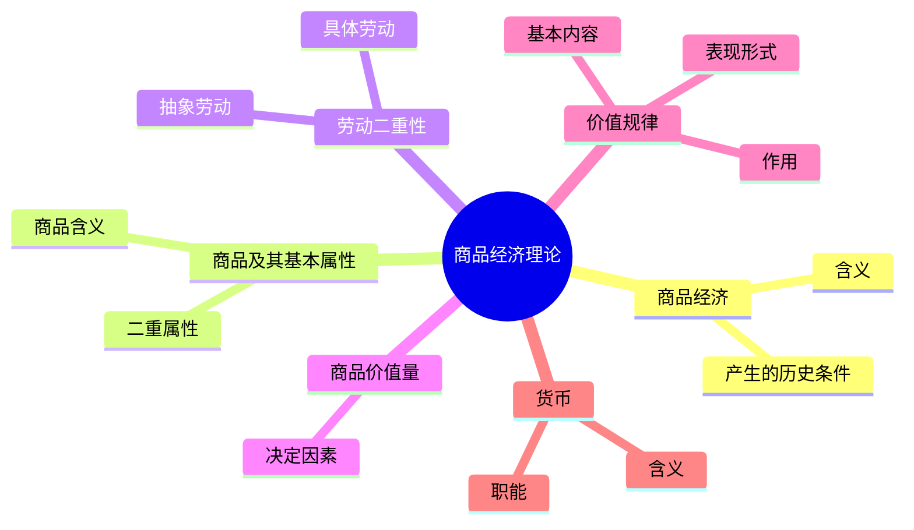
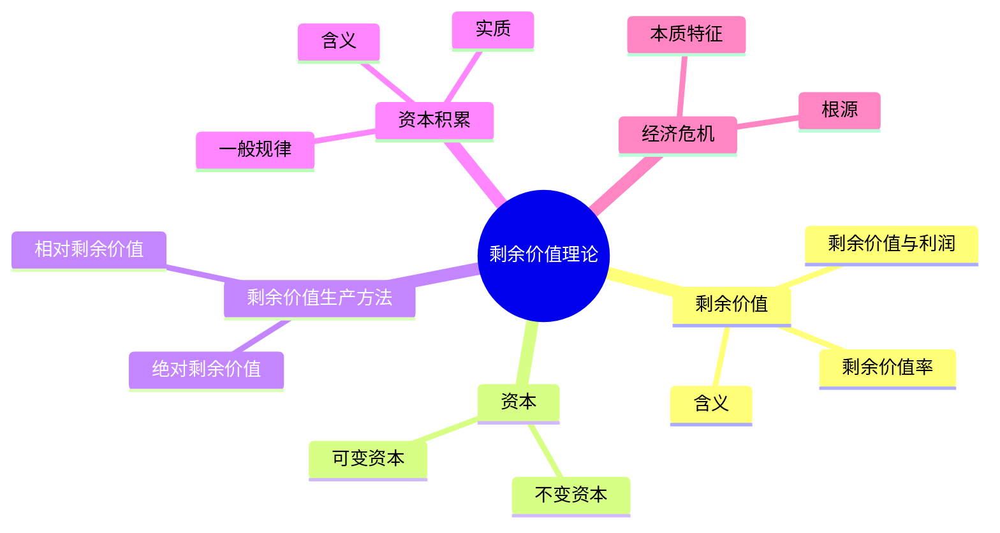
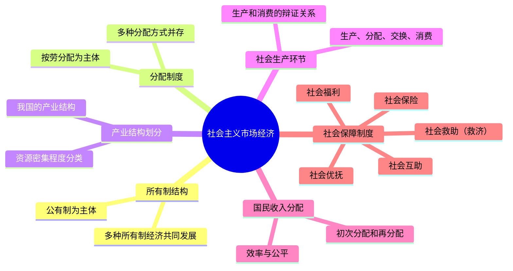
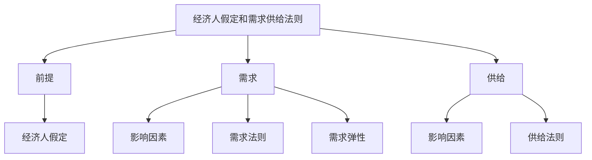
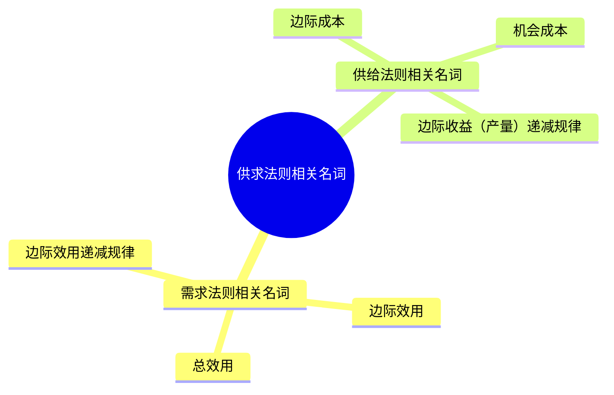
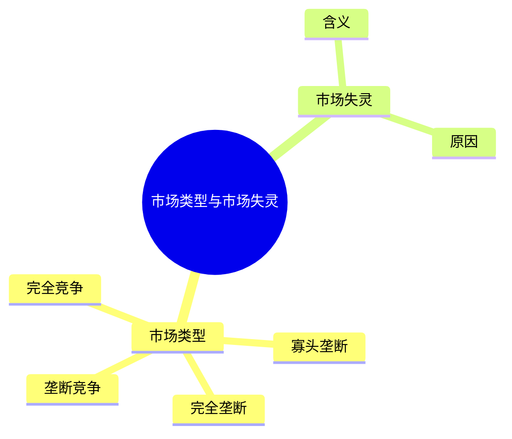

# 3.经济-金牌讲义

# 第四篇 经济知识

## 第一章 马克思主义政治经济学

一提起马克思主义政治经济学，很多考生天然就有一种陌生感和畏惧感。陌生感源于该理论历史久远，看似与现代经济生活相去甚远；畏惧感源于考生潜意识认为马克思主义理论艰涩难懂，不易理解。于是，很多考生带着心理预设去学习，往往收不到良好的效果。所以，考生在学习时千万不要认为它很难，虽然马克思主义理论思想很庞大，但考试中考查的内容相对集中。另外，答题时千万不要想当然地用常识得出答案，毕竟马克思生活的时代与今天不同，一定要根据马克思主义的相关原理来解题。

### 第一节 商品经济理论

**考情分析**

在公共基础知识的考试中，本节内容的考查概率较大，考点主要集中在商品的含义、商品的基本属性、商品价值量的确定、价值规律、货币职能等部分，考生对这几个考点要给予充分的复习。

**本节框架**


<!-- page: 3 -->

**知识内容**

#### 一、商品经济
商品经济不是从来就有的，而是在一定的历史条件下，作为自然经济的对立物而产生和发展起来的。商品经济是以交换为目的而进行生产的经济形式。商品经济产生的历史条件有两个：一是社会分工，二是生产资料和劳动产品属于不同的所有者。

社会分工是商品经济产生的前提：由于有了社会分工，所以出现了不同的剩余产品，故而有了交换的需要。例如，王某是种植大户，李某是养殖大户，王某就可以将自己的大米和李某家的牛羊进行交换。

生产资料和劳动产品属于不同的所有者也是商品经济产生的条件之一：不同的生产资料和劳动产品的所有者，不能无偿地占有对方的产品，彼此要取得对方的产品，必须通过等价交换，即把各自的产品作为商品来交换。例如，王某想要李某的牛羊，就要用自家的大米进行交换。

**拓展阅读**

社会基本经济形态：
（1）自然经济，即自给自足的经济，例如农民饲养的自用牛羊。
（2）商品经济，即以交换为目的的经济，例如王某用自家大米换了邻居家的肉。
（3）产品经济，即马克思设想的在商品经济消亡以后的未来社会的交换方式。
社会成员取得自己需要的东西不是通过交换，而是通过社会中心机构集中的、统一的分配来取得，即按需分配。

#### 二、商品及其基本属性
商品是用来交换的能满足人们某种需要的劳动产品，具有使用价值和价值两种属性。其中，使用价值是商品的自然属性，价值是商品的社会属性，也是其特有属性。

商品的使用价值与价值之间的关系是对立统一的。其对立性表现在：商品的使用价值和价值是相互排斥的，二者不可兼得。其统一性表现在：作为商品，必须同时具有使用价值和价值两个属性。

<!-- page: 4 -->

**名师解读**

1. 商品
商品必须是人类劳动创造出来的产品，但劳动产品不一定是商品。例如，自己织的毛衣自己穿，这件毛衣虽是劳动产品，但不是商品。所以劳动产品用于交换才能成为商品。

2. 商品的基本属性
（1）使用价值：能满足人们某种需要的物品的效用，即物品的有用性。这是商品本身就有、天生自带的属性，叫作自然属性。
（2）价值：凝结在商品中的无差别的人类劳动。判断一个物品是否有价值要先判断其是否为商品，如果不是商品，那么即使付出了人类劳动也不会形成价值。只有商品才有价值，价值是商品的特有属性。例如：自己织的毛衣自己穿，这件毛衣不是商品，则不具有价值；商场买来的毛衣是商品，具有价值。同时，商品交换体现了人与人之间的社会关系，所以价值是商品的社会属性。

3. 商品二因素之间的关系
（1）统一性是针对一个商品来讲的，作为一个商品，必须同时拥有使用价值和价值，其中使用价值是价值的物质承担者，没有使用价值的物品则没有价值，价值寓于使用价值之中。
（2）对立性是针对生产者或者消费者而言的，生产者只能让渡商品的使用价值来获得其价值，而消费者要让渡商品的价值来获得其使用价值，故二者相互排斥，不可兼得。

#### 三、劳动二重性
商品是劳动产品，生产商品的劳动可区分为具体劳动和抽象劳动。
（1）具体劳动：各种形式的有用劳动，生产使用价值。
（2）抽象劳动：无差别的人类劳动，形成价值实体。

具体劳动和抽象劳动不可分割，生产商品的劳动是具体劳动与抽象劳动的统一。
具体劳动与抽象劳动是同一劳动过程的两个方面，不是两次劳动，更不是两种劳动。

<!-- page: 5 -->

**名师解读**

1. 具体劳动
各种形式的有用劳动，或者说是指看得见的外在劳动形式。例如，手提肩扛、面朝黄土背朝天等动作形式为看得见的具体劳动。

2. 抽象劳动
无差别的人类劳动，或者说是指看不见的内在劳动消耗。例如，无论是种地还是放牛抑或在工厂做工，劳动的时候都有体力和脑力的消耗，即无差别的人类劳动，这就属于抽象劳动。

3. 劳动二重性与商品二因素之间的关系
劳动二重性形成了商品的二因素。其中，具体劳动生产使用价值。例如，工人通过裁剪缝制，把皮革加工成皮鞋，皮鞋可以穿，这个过程是具体劳动创造使用价值的过程。抽象劳动形成价值实体。因为抽象劳动就是无差别的人类劳动，而价值也是凝结在商品中的无差别的人类劳动，所以价值由抽象劳动形成。

#### 四、商品价值量
商品的价值量是指商品价值的大小，通常指单位商品价值量。商品的价值量不是由各个商品生产者所耗费的个别劳动时间决定的，而是由社会必要劳动时间决定的。

生产商品所需要的社会必要劳动时间随着劳动生产率的变化而变化。若其他因素不变，单位商品的价值量与生产该商品的社会必要劳动时间成正比，与社会劳动生产率成反比。

**名师解读**

（1）社会必要劳动时间是指在现有社会正常的生产条件下，在社会平均的劳动熟练程度和劳动强度下，制造任何一个使用价值所需要的劳动时间。通俗理解就是，一个行业生产一种商品的平均时间。
（2）通常条件下，若其他因素不变，商品价值量与生产该商品的社会必要劳动时间成正比。生产一个商品的社会必要劳动时间越长，凝结的劳动量越多，商品的价值量越大，所以商品价值量与社会必要劳动时间成正比。商品价值量与社会劳动生产率成反比。社会劳动生产率提高，意味着生产一个商品的时间缩短，

<!-- page: 6 -->

> 故商品的价值量下降。需要注意的是，影响商品价值量的因素是社会必要劳动时间和社会劳动生产率，而不是个别劳动时间和个别劳动生产率。个别劳动时间和个别劳动生产率与商品价值量无关。

#### 五、价值规律
**1. 基本内容**

价值规律是商品经济的基本规律。它的基本内容是：商品的价值量由生产该商品的社会必要劳动时间决定；商品交换以价值量为基础实行等价交换。

**2. 表现形式**

价格围绕价值上下波动。

**3. 作用**

（1）价值规律自发地调节生产资料和劳动力在社会各生产部门之间按比例分配，即调节社会资源。
（2）价值规律自发地刺激商品生产者改进技术，改善经营管理，进而促进社会生产力的发展。
（3）价值规律会引起和促进商品生产者的两极分化，造成优胜劣汰的结果。

> ✧ 名师解读
> （1）价值规律是商品经济的基本规律，意味着价值规律只在商品经济社会存在并发挥作用。自然经济和产品经济社会都不涉及交换，自然也就没有商品，所以不会存在价值规律。“价值规律贯穿于人类社会始终”的说法是错误的。
> （2）价值规律的内容只有两条：其一，从生产角度看，商品的价值量由生产该商品的社会必要劳动时间决定，社会必要劳动时间越长，该商品的价值量越大；其二，从交换角度看，商品交换以价值量为基础实行等价交换。所以，价值规律既支配商品生产，也支配商品交换。
> （3）价格之所以围绕价值上下波动，是因为价值决定价格，价值越大，价格越高。价格之所以会上下波动，主要是因为受到供求关系影响。供过于求时，价格下降；供不应求时，价格上涨。
> （4）价值规律的作用有三点。第一点可概括为“棒子”的作用。“棒子”即

<!-- page: 7 -->

> “指挥棒”的意思，价值规律自发将生产资料和劳动力资源指向利润高的领域，哪里赚钱指哪里。第二点可概括为“鞭子”的作用。通过鞭策和监督实现生产效率的提高，进而促进生产力的发展。第三点可概括为“筛子”的作用。在竞争中通过筛选产生优胜劣汰的结果。

#### 六、货币
**1. 货币的含义**

货币是在长期交换过程中形成的固定地充当一般等价物的特殊商品。

**2. 货币的职能**

| 职能类型 | 具体说明 |
| --- | --- |
| 价值尺度 | 价值尺度是指货币以自己为尺度来表现和衡量其他一切商品的价值<br>货币执行价值尺度职能，不需要现实的货币，只需要观念上的货币。常见形式为标价 |
| 流通手段 | 流通手段是指货币充当商品交换的媒介<br>货币充当流通手段，必须是现实的货币，且需要一手交钱一手交货 |
| 支付手段 | 支付手段是指在发生赊购赊销的情况下，货币用于清偿债务所执行的职能<br>货币作为支付手段，已被广泛运用于缴纳租金、税金和发放工资等方面 |
| 贮藏手段 | 贮藏手段是指货币退出流通领域，被人们当作社会财富的一般代表加以贮藏<br>货币作为贮藏手段，必须是足值的金属货币或金属条块 |
| 世界货币 | 世界货币是指货币在世界上作为一种购买手段、支付手段和社会财富的代表所发挥的作用<br>货币执行世界货币的职能是随着国与国之间的商品交换以及其他贸易活动的发展而发展起来的，它实际上是货币职能越出国界而在世界范围的延伸和应用 |

价值尺度和流通手段是货币的两种最基本职能，其他三种职能是在这两种基本职能的基础上派生和发展出来的。

> ✧ 名师解读
> 货币是商品交换发展到一定阶段出现的，固定充当一般等价物的特殊商品。
> 首先，货币是一种商品，即具有使用价值和价值。其次，货币和普通商品不同，它的本质是一般等价物。一般等价物是从商品中分离出来的表现其他一切商品价值的商品，它是社会公认的等价形态。它可以与其他一切商品直接相交换，其他

<!-- page: 8 -->

> 一切商品把它当作抽象人类劳动的化身而同它发生关系。但它还不是货币，只有一般等价物的职能稳定在贵金属上，它才发展成为货币。

####  考点清单
考点1——商品经济产生的前提。
商品经济产生的前提是社会分工。社会分工产生之后就出现了不同的剩余物品，故而有了交换的需要，产生了商品经济。

考点2——哪些物品可以成为商品？
必须同时满足“劳动产品”和“交换”两个条件。常见的大自然的物品、自给自足的物品、用于捐赠的物品均不属于商品。

考点3——商品的特有属性。
商品的特有属性是价值，只有商品才有价值。同时，价值也是商品的社会属性。

考点4——商品的自然属性。
商品的自然属性是使用价值。使用价值是商品本身就有、天生自带的有用性。

考点5——使用价值与价值的关系。
使用价值与价值是对立统一的关系。一方面，使用价值是价值的物质承担者，价值寓于使用价值之中。另一方面，商品的使用价值和价值是相互排斥的，二者不可兼得。

考点6——劳动二重性与商品二因素之间的关系。
具体劳动生产使用价值，抽象劳动形成价值实体。

考点7——商品价值量。
商品价值量与生产该商品的社会必要劳动时间成正比，与社会劳动生产率成反比，与个别劳动时间和个别劳动生产率无关。

考点8——价值规律。
价值规律是商品经济的基本规律，不是贯穿于人类社会始终的规律。价值规律既支配商品生产，也支配商品交换。其表现形式为价格围绕价值上下波动。

考点9——货币。
货币的本质是一般等价物，两种最基本的职能是价值尺度和流通手段。

<!-- page: 9 -->

**易混易错**

（1）商品具有二重属性，即使用价值和价值。有用性指的是使用价值，它是一切有用物品的共性；商品中凝结的无差别的人类劳动指的是价值，只有商品才有价值，这才是商品的特性。
（2）个别劳动生产率的变化不会影响单位商品的价值量。
（3）“一手交钱一手交货”体现了货币的流通手段，“钱货分离”体现了货币的支付手段。

#### 真题再现
1.（单选）商品是人类社会生产力发展到一定历史阶段的产物，是用于交换的劳动产品。下列物品不属于商品的是（　　）。
A. 学生亲手制作的教师节礼物　　B. 超市里的饮料
C. 网店里的衣服　　D. 市场上的蔬菜
**【答案】A**
【解析】本题考查马克思主义政治经济学。
商品是用来交换的劳动产品，具有使用价值和价值两个属性。使用价值是商品具有的效用，即能满足人类某种需要的属性，是商品的自然属性。凝结在商品中的无差别的人类劳动是商品的价值。价值是商品所特有的本质属性和社会属性，体现着商品生产者之间相互比较劳动耗费量和交换劳动的社会经济关系。
A项错误，学生亲手制作的教师节礼物是劳动产品，但没有用于交换，不属于商品。
B、C、D三项正确，是劳动产品且用于交换，属于商品。
本题为选非题，故正确答案为A。
2.（单选）一切有用物品包括商品所共有的属性是（　　）。
A. 价值　　B. 个别价值
C. 使用价值　　D. 社会价值
**【答案】C**
【解析】本题考查马克思主义政治经济学。
A项错误，价值是商品所特有的属性，是商品经济的范畴。
B项错误，个别价值是社会价值的对称，是生产同一种商品的个别生产者在不等的

<!-- page: 10 -->

> 个别劳动时间内形成的价值。
C项正确，使用价值是一切有用物品包括商品所共有的属性，是永恒的范畴。
D项错误，社会价值是一个部门所生产的商品的平均价值，它由该部门内部各个生产者所生产的商品的个别价值的加权平均数决定。
故正确答案为C。
3.（单选）下列有关商品和价值的说法，正确的是（　　）。
A. 价值规律既支配商品生产，也支配商品流通
B. 使用价值反映了商品的社会属性
C. 单位商品价值量与社会劳动生产率成正比
D. 具体劳动创造商品的价值
**【答案】A**
【解析】本题考查商品和价值的相关知识。
A项正确，价值规律是商品生产和商品交换的基本规律，即商品的价值量取决于社会必要劳动时间，商品按照价值相等的原则互相交换。
B项错误，使用价值反映了商品的自然属性，价值反映了商品的社会属性。
C项错误，社会劳动生产率越高，在单位时间内生产的商品数量越多，单位商品价值量越小；社会劳动生产率越低，在单位时间内生产的商品数量越少，单位商品价值量越大。因此，单位商品的价值量与社会劳动生产率成反比。
D项错误，具体劳动创造商品的使用价值。
故正确答案为A。
4.（单选）网上团购作为一种新型的网络购物方式，受到消费者的热捧。网上团购的盛行（　　）。
A. 使货币职能发生了本质性的变化　　B. 使商品交换的本质发生了变化
C. 使商品交换的方式发生了变化　　D. 表明纸币已经被电子货币取代
**【答案】C**
【解析】本题考查马克思主义政治经济学。
A项错误，无论在线下购物还是网络购物中，货币都要执行价值尺度、流通手段、支付手段的职能，因此货币职能没有发生变化。B项错误，商品交换就是商品所有者按照等价交换的原则相互自愿让渡商品所有权的经济行为。网络团购同样遵循这样的原则进行交换，因此商品交换的本质没有发生变化。
C项正确，网络团购使购物从线下迁移到线上，是商品交换方式的改变。
D项错误，纸币有其存在的独特价值，目前不会被电子货币取代，现阶段的电子货币只是一种新的货币形态或支付媒介。此外，该项说法也与题目没有关联，故排除。

故正确答案为C。
5.（单选）下列关于商品经济中价值规律的作用，说法错误的是（ ）。

A. 刺激生产技术的改进和提高劳动生产率
B. 自发调节生产资料和劳动力在社会生产各部门之间的分配
C. 导致商品生产者优胜劣汰
D. 揭示了工人受全体资本家剥削的实质

【答案】D
【解析】本题考查马克思主义政治经济学。
价值规律是商品经济的基本规律，其主要内容为商品的价值量取决于社会必要劳动时间，商品按照价值相等的原则互相交换。
A项正确，价值规律自发地调节生产，刺激生产技术的改进，加速商品生产者的分化，提高劳动生产率。
B项正确，价值规律调节生产资料和劳动力在各生产部门的分配。这是因为价值规律要求商品交换实行等价交换的原则，而等价交换又是通过价格和供求双向制约实现的。当供不应求时，价格就会上涨，从而使生产扩大；当供过于求时，价格就会下跌，从而使生产缩减。这里，价值规律就像一根无形的指挥棒，指挥着生产资料和劳动力的流向。当一种商品供大于求时，价值规律就指挥生产资料和劳动力从生产这种商品的部门流出；相反，则指挥生产资料和劳动力流入生产这种商品的部门。
C项正确，由于价值规律要求商品按照生产其的社会必要劳动时间所决定的价值量来交换，谁首先改进技术设备，劳动生产率比较高，生产商品的个别劳动时间少于社会必要劳动时间，谁就获利较多，因此导致商品生产者优胜劣汰。
D项错误，剩余价值理论揭示了工人受全体资本家剥削的实质，而非价值规律。
本题为选非题，故正确答案为D。

<!-- page: 12 -->

### 第二节 剩余价值理论

**考情分析**

在公共基础知识的考试中，本节内容的考查概率较大，考点主要集中在剩余价值的含义、资本分类、生产方法、资本积累、经济危机等部分，考生对这几个考点要给予充分的复习。

**本节框架**



**知识内容**

#### 一、剩余价值
1. 含义
    剩余价值是雇佣工人所创造的并被资本家无偿占有的超过劳动力价值的那部分价值。它是雇佣工人剩余劳动的凝结，体现了资本家与雇佣工人之间剥削与被剥削的关系。

2. 剩余价值率
    由于剩余价值是由雇佣工人创造的，这是可变资本变动的结果，因此要表明资本家对工人的剥削程度，必须抽去不变资本，只考察剩余价值和可变资本之间的比例关系。剩余价值和可变资本的比率就是剩余价值率。用 m′表示剩余价值率，m表示剩余价值，v表示可变资本，则公式为:m′ = m/v
$$
m′ = \frac{m}{v}
$$

<!-- page: 13 -->

3. 剩余价值与利润
当把剩余价值看成资本家全部预付资本的产物时，它就转化成了利润。在量上，剩余价值等于利润。

> #### 名师解读
> (1) 剩余价值的来源：工人的剩余劳动。工人在剩余劳动时间创造的价值称为剩余价值，此部分全部被资本家无偿占有，所以揭示了资本主义的剥削关系。
> (2) 剩余价值率的计算：由于剩余价值只和工人剩余劳动有关，故要计算剩余价值率只需考察剩余价值和可变资本之间的比例关系。公式为m'=m/v。例如，资本家榨取工人的剩余价值是5000元，给工人发的工资为1000元，则剩余价值率为5000÷1000=500%。
> (3) 剩余价值和利润，单纯从量上来讲，二者相等。马克思认为，增殖的部分是由劳动力创造的，故称之为剩余价值。而资本家认为增殖的部分是由全部预付资本带来的产物，故称之为利润。剩余价值揭示了剥削关系，而利润则掩盖了剥削关系。

#### 二、资本
资本在资本主义生产过程中以生产资料和劳动力两种形态存在。根据这两部分资本在剩余价值生产中所起的不同作用，可将资本分为不变资本和可变资本。
(1) 不变资本，是指以生产资料形态存在的那部分资本，其价值在生产过程中一次或多次转移到新产品中去，不会发生增殖（不会带来剩余价值），因此叫不变资本（c）。不变资本包括原材料、机器设备、厂房等。
(2) 可变资本，是指以劳动力价值形态存在的那部分资本，在生产过程中可以使价值增殖（可以带来剩余价值），因此叫可变资本（v）。可变资本只有劳动力。

> #### 名师解读
> 不变资本和可变资本的划分标准是两部分资本在剩余价值生产中所起的不同作用，也可以说按照这两部分资本能否带来剩余价值进行划分。

<!-- page: 14 -->

#### 三、剩余价值生产方法
资本家剥削工人的具体方法是多种多样的，但概括起来有两种基本方法：绝对剩余价值生产和相对剩余价值生产。
(1) 绝对剩余价值是指在必要劳动时间不变的条件下，通过延长工作时间所获得的剩余价值。
(2) 相对剩余价值是指在工作时间不变的条件下，由于缩短必要劳动时间而相对延长剩余劳动时间所生产的剩余价值。相对剩余价值是各个资本家追逐超额剩余价值而实现的。
★ 超额剩余价值是指单个资本家通过提高劳动生产率使商品的个别价值低于社会价值而比一般资本家多得的那部分价值。

> #### 名师解读
> (1) 工人的劳动时间分为两部分：一部分是必要劳动时间，用来生产劳动力价值，也就是给自己赚工资的时间；一部分是剩余劳动时间，用来生产剩余价值。资本家为了榨取更多的剩余价值，就会让工人延长工作时间。延长的这部分时间是剩余劳动时间，会生产更多的剩余价值。可以简单理解为让工人加班并且不付给工人加班费，这样所创造的多出来的剩余价值就全部归资本家所有。这是绝对剩余价值生产。
> (2) 工作日的延长会受到生理、道德界限的制约，特别是工人阶级的反抗斗争，迫使资产阶级颁布法律，把工作日限制在一定的长度以内。“一战”之后，西方资本主义国家被迫实行8小时工作制。在工作日的长度不变的条件下，资本家要提高对工人的剥削程度，就必须改变工作日划分为必要劳动时间与剩余劳动时间的比例。资本家想要更多的剩余价值，就只能缩短必要劳动时间，从而延长剩余劳动时间。这是相对剩余价值生产。
> (3) 绝对剩余价值和相对剩余价值的生产都是针对整个社会而言的。单个资本家通过提高劳动生产率使商品的个别价值低于社会价值，从而比一般资本家多得的那部分价值，我们称之为超额剩余价值。超额剩余价值只是短暂现象，当全社会所有资本家都提高了生产效率，超额剩余价值就转化成了相对剩余价值。

<!-- page: 15 -->

#### 四、资本积累
1. 含义
资本积累就是剩余价值的资本化。把榨取的剩余价值作为资本再次投入生产，可以给资本家带来更多的剩余价值，简单理解就是“钱生钱”的过程。
2. 实质
资本积累的实质是资本家通过无偿占有工人劳动的一部分，来扩大无偿占有工人劳动的权力。首先资本家要通过对工人的剥削来获取剩余价值，这就是资本家无偿占有工人劳动的一部分，有了这笔剩余价值，资本家就可以雇佣更多的工人，从更多的工人身上榨取更多的剩余价值，这就扩大了无偿占有工人劳动的权力。
3. 一般规律
由于资本家的剩余价值都是从工人身上榨取而来，故资本家越来越有钱，同时工人越来越穷，久而久之就形成了两极分化的现象。富人越来越富，穷人越来越穷，这就是“马太效应”。（“马太效应”源于《圣经·马太福音》第25章：“凡有的，还要加给他，叫他多余；没有的，连他原先所有的，也要夺过来。”反映的是社会两极分化的现象，即富的更富，穷的更穷。）

#### 五、经济危机
1. 资本主义经济危机爆发的根本原因
资本主义经济危机爆发的根本原因，在于资本主义固有的基本矛盾，即生产资料资本主义私人占有和生产社会化之间的矛盾。在资本主义条件下，随着科学技术的进步和生产力的发展，资本主义生产不断社会化，由原来分散的小生产者生产转化为大规模社会生产。在资本家私人占有生产资料和剥削雇佣工人的生产关系中，这种社会化的生产力变成了资本的生产力。社会化程度越高，技术越发达，说明劳动者投入的脑力劳动越多，创造的剩余价值也就越多，而这些剩余价值，这些资本财富越来越集中在少数资本家手里，劳动者的情况并没有随着生产力的发展有所好转，全社会劳动者都在劳动，但是财富却掌握在少数资本家手中，所以这种私有制和社会化生产的矛盾越来越尖锐，越来越不可避免，最终就导致了危机的爆发。
2. 资本主义经济危机的本质特征
资本主义经济危机的本质特征：生产相对过剩。资本家资本积累越来越多，越来越

<!-- page: 16 -->

越有钱，为了增加产量，资本家会大量投入机器，这就意味看他需要的工人越来越少，会导致大量的工人失业。工人失业没有收入，购买力就会下降。而随着机器的普及，劳动生产率提高，产量也同步提高，所以生产的产品出现积压，这种生产过剩叫作生产相对过剩。生产相对过剩并不是东西真的生产多了，而是相对于劳动人民有支付能力的需求来说社会生产的商品显得过剩。这就是资本主义经济危机的本质特征。

#### 考点清单
- 考点1——剩余价值的来源：工人的剩余劳动。
- 考点2——剩余价值率的计算：m' = m / v。
- 考点3——不变资本和可变资本的划分：不变资本包括机器设备、厂房、原材料，可变资本指劳动力。
- 考点4——绝对剩余价值：必要劳动时间不变的条件下，延长工作时间所获得的剩余价值。
- 考点5——相对剩余价值：工作时间不变的条件下，缩短必要劳动时间而相对延长剩余劳动时间所生产的剩余价值。
- 考点6——超额剩余价值：单个资本家通过提高劳动生产率使商品的个别价值低于社会价值而比一般资本家多得的那部分价值。
- 考点7——“马太效应”：社会两极分化的现象，富的更富，穷的更穷。
- 考点8——资本主义经济危机的根源是资本主义基本矛盾，即生产资料资本主义私人占有和生产社会化之间的矛盾。
- 考点9——资本主义经济危机的本质特征是生产相对过剩。

#### 真题再现
1.（单选）马克思把生产资本划分为不变资本和可变资本的依据是资本（　）。
A. 在资本流通中的周转速度不同
B. 在资本积累中的不同作用
C. 在剩余价值生产过程中的不同作用
D. 在生产过程中不同的实物存在形式和价值转移方式
【答案】C
【解析】本题考查马克思主义政治经济学。

<!-- page: 17 -->

资本在资本主义生产过程中以生产资料和劳动力两种形态存在，根据这两部分资本在剩余价值生产中所起的不同作用，可将资本划分为不变资本和可变资本。不变资本是指以生产资料形态存在的那部分资本，其价值在生产过程中一次或多次转移到新产品中去，不会发生增殖，因此叫不变资本；可变资本是指以劳动力价值形态存在的那部分资本，在生产过程中可以使价值增殖，因此叫可变资本。

故正确答案为C。
2.（单选）剩余价值率是（　）的比率。
A. 剩余价值与不变资本
B. 剩余价值与可变资本
C. 剩余价值与预付总资本
D. 剩余价值与总利润
【答案】B
【解析】本题考查经济常识。
剩余价值率，是在资本主义条件下工人受资本家剥削程度的表现，用公式表示为$\boldsymbol{m' = m / v}$，其中$m'$为剩余价值率，$m$为剩余价值，$v$为可变资本。
资本家经营投入的是不变资本和可变资本，但是马克思认为，剩余价值是由可变资本创造的，即工人作为劳动力的价值得到报酬之外的剩余劳动被资本家完全无偿取得，因此剩余价值率也叫资本主义剥削率。由于资本家对剩余价值的贪欲是无止境的，他们会采取种种手段不断提高剩余价值率，加重对雇佣劳动者的剥削。
故正确答案为B。
3.（单选）(　)是指在必要劳动时间不变的前提下，通过延长工作时间所获得的剩余价值。
A. 绝对剩余价值
B. 相对剩余价值
C. 消费者剩余
D. 剩余价值量
【答案】A
【解析】本题考查马克思主义政治经济学。
A项正确，绝对剩余价值是指在必要劳动时间不变的前提下，通过延长工作时间所获得的剩余价值。
B项错误，相对剩余价值是在工作日长度不变的条件下，由于缩短必要劳动时间，相应延长剩余劳动时间而产生的剩余价值。

<!-- page: 18 -->

C项错误，消费者剩余是指消费者消费一定数量的某种商品愿意支付的最高价格与这些商品的实际市场价格之间的差额。
D项错误，剩余价值量由可变资本量和剩余价值率所决定，也就是由劳动力价值的大小、雇工人数的多少和剩余价值率的高低决定。
故正确答案为A。
4.（单选）剩余价值率所反映的是（　）。
A. 不变资本的价值增殖程度
B. 资本家对工人的剥削程度
C. 固定资本的价值增殖程度
D. 预付资本的价值增殖程度
【答案】B
【解析】本题考查马克思主义政治经济学。
A项错误，不变资本是指在剩余价值生产过程中转变为生产资料的那一部分资本，即以生产资料形态存在的资本。剩余价值率所反映的不是它的价值增殖程度。
B项正确，剩余价值率用公式表示为：m' = m / v。在该公式中，m'为剩余价值率，m为剩余价值，v为可变资本。剩余价值率是在资本主义条件下，工人受资本家剥削程度的表现。
C项错误，固定资本是指以厂房、机器、设备和工具等劳动资料的形式存在的生产资本，是流动资本的对称，属于不变资本的一部分。剩余价值率所反映的不是它的价值增殖程度。
D项错误，预付资本是资本家用来购买生产资料和劳动力、为了生产剩余价值而预先垫付的资本。剩余价值率所反映的不是它的价值增殖程度。
故正确答案为B。

#### 本章导图

#### 马克思主义政治经济学
**商品经济理论**

1. **商品经济的由来**
   - 迄今为止两种经济形态
     - 自然经济：自给自足
     - 商品经济：交换

2. **商品经济产生的历史条件**
   - 社会分工
   - 生产资料和劳动产品属于不同的所有者

3. **商品**
   - 条件：用于交换；劳动产品
   - 二重属性
     - 使用价值：自然属性
     - 价值：社会属性（特有属性）

4. **劳动二重性**
   - 具体劳动
   - 抽象劳动：形成价值实体
     - 商品价值量的决定因素：社会必要劳动时间
     - 社会必要劳动时间越长，价值量越高

5. **价值规律**
   - 基本内容
     - 价值量的决定因素：社会必要劳动时间
     - 商品交换的依据：等价交换
   - 表现形式：价格围绕价值上下波动
   - 作用
     - “棒子”——调节资源配置
     - “鞭子”——提高劳动生产率
     - “筛子”——优胜劣汰

6. **货币**
   - 本质：一般等价物
   - 职能
     - 基本职能：价值尺度、流通手段
     - 衍生职能：支付手段、贮藏手段、世界货币

#### 剩余价值理论
1. **剩余价值来源**：工人的剩余劳动
2. **数量上**：剩余价值=利润
   - 剩余价值：工人劳动的产物
   - 利润：资本家全部预付资本的产物

3. **资本分类**：依据是否能够带来剩余价值
   - 可变资本
   - 不变资本

4. **剩余价值获取方式**
   - 绝对剩余价值（延长工作时间）
   - 相对剩余价值（提高劳动生产率）：超额剩余价值（个别企业提高劳动生产率）

5. **资本积累**
   - 含义：剩余价值资本化
   - 动力或目的：赚取更多剩余价值
   - 结果：两极分化（马太效应）

6. **经济危机**
   - 根源：资本主义基本矛盾
   - 本质特征：生产相对过剩

<!-- page: 20 -->

#### 拓展阅读

商品经济产生的前提是社会分工，早期人类历史上经历了三次社会大分工：
- 第一次社会大分工：游牧部落与其他部落分离开来，农业部落与游牧部落之间的产品交换随之发生。
- 第二次社会大分工：手工业与农业分离开来，形成与农业相区别的独立生产行业。
- 第三次社会大分工：出现专门经营商品买卖的商人，推进了商品生产和交换的发展。

<!-- page: 21 -->

## 第二章 社会主义市场经济理论

社会主义市场经济理论是邓小平理论体系中极具创新意义的组成部分，依据这一理论，中国确定了建立市场经济体制的改革目标。社会主义市场经济是同社会主义基本制度结合在一起的，市场在国家宏观调控下对资源配置起决定性作用。

在考试中，社会主义市场经济理论着重考查市场机制、所有制结构、收入分配、产业结构、社会保障制度等内容，需要考生重视。此部分知识容易混淆，需要对比来记忆。

### 第一节 市场经济概述

**考情分析**

在公共基础知识的考试中，本节内容的考查概率适中，考点主要集中在市场经济的含义、市场经济的基本特征、市场机制等部分，考生对这几个考点要给予充分的复习。

**本节框架**

- 市场经济概述
    - 市场经济的含义
    - 市场经济的基本特征
        - 市场主体的自主性
        - 市场关系的平等性
        - 市场行为的竞争性
        - 市场发展的开放性
        - 市场运转的有序性
    - 市场机制
        - 价格机制
        - 供求机制
        - 竞争机制
        - 风险机制
    - 市场体系
        - 市场体系三大支柱
        - 建成统一、开放、竞争、有序的大市场

---

<!-- page: 22 -->

**知识内容**

#### 一、市场经济的含义

市场经济，或称市场取向的经济，是指由市场进行资源调配的商品经济。通过市场进行的调节，属于一种事后调节。

**名师解读**

**1. 两种资源配置方式对比**

经济生活的中心问题是如何实现资源的有效配置，以解决资源的有限性和需求的无限性之间的矛盾。在现代经济条件下，资源配置的方式主要有两种：计划配置和市场配置，即计划调节和市场调节。

计划配置是指通过计划机制的作用过程来实现资源配置的方式。该调节属于一种事前调节。政府在事先对资源进行配置，计划生产多少、如何分配，这些都在事前完成。

市场配置是通过市场机制的作用过程实现资源配置的方式。市场机制对资源配置的调节作用即为市场调节。市场配置或市场调节实质上就是价值规律调节。在市场配置方式中，资源配置的决策者是各个分散的经济主体，配置的动力机制是各经济主体自身的经济利益及其之间的竞争，而市场价格则是市场商品供求状况的重要信号。如果价格信号发生变化，经济主体就会相应改变自己的行为，故而是一种事后调节。

市场经济不等于资本主义，计划经济不等于社会主义。市场和计划都是资源配置方式，与社会制度无关。社会主义和资本主义的本质区别在于生产资料所有制不同。社会主义为生产资料公有制，资本主义为生产资料私有制。

**2. 市场经济与商品经济的关系**

市场经济是发达的商品经济。市场经济是同商品经济密切联系在一起的经济范畴。市场经济以商品经济的充分发展为前提，是在产品、劳动力和物质生产要素逐步商品化的基础上形成、发展起来的。从这个意义上来说，市场经济是发达的商品经济，商品经济不一定是市场经济。

#### 二、市场经济的基本特征

**1. 市场主体的自主性**

市场主体是指参与市场交易活动的组织和个人，包括生产经营者和消费者。在通常情况下，市场主体是多元的，主要包括企业、居民、政府和其他非营利性机构，此外，市场主体也包括一些中介机构。其中，企业是最重要的市场主体。在市场经济条件下，企业拥有自主决策权，可以自主决定生产什么。

**2. 市场关系的平等性**

市场经济强调的是平等竞争，其实质是企业拥有平等参与市场和获取资源的机会。在市场竞争中，无论是国企还是私企，都拥有平等的经济关系，平等参与，平等竞争。

**3. 市场行为的竞争性**

市场竞争行为是指生产经营者在市场竞争过程中获取某种经济利益的行为。面对有限的资源，可能会出现不正当的竞争行为。也就是说，市场竞争会带来一定的市场缺陷，主要表现在：

(1) 市场调节的自发性。在市场经济中，商品生产者和经营者的经济活动都是在价值规律的自发调节下追求自身的利益，实际上就是根据价格的涨落决定自己的生产和经营活动。这会使一些个人或企业由于对自身利益的过分追求而产生不正当的行为，比如生产和销售伪劣产品，扰乱市场秩序，一切向钱看，不讲职业道德等。简单地说，就是出现不择手段、损人利己的竞争行为。

(2) 市场调节的盲目性。在市场经济条件下，个体的生产者和经营者不可能掌握社会各方面的信息，也无法控制经济变化的趋势，因此，他进行经营决策时，也就是观察市场上什么价格高、什么有厚利可图，据此决定生产、经营什么，这显然有一定的盲目性。因厂家瞄准的是市场价格，什么好卖就生产什么，于是各地“盲目跟风”“蜂拥而上”，其结果是重复上马、重复引进，而又形不成生产规模。

(3) 市场调节的滞后性。在市场经济中，市场调节是一种事后调节，即经济活动参加者是在某种商品供求不平衡导致价格上升或下跌后才做出扩大或减少这种商品供给的决定。这样，供求不平衡—价格变化—做出决定—实现供求平衡，必然需要一个长短不同的过程，有一定的时间差。商品的社会需求可能已经达到饱和点，而商品生产者却还在继续大量生产，到了滞销引起价格下跌后，才恍然大悟，因此蒙受巨大损失。

**4. 市场发展的开放性**

在开放的市场中，要素、商品与服务可以较自由地跨国界流动，从而实现最优资源配置和最高经济效率。开放的市场可以把国内经济和整个国际市场联系起来，尽可能充分地参加国际分工，同时在国际分工中发挥出本国经济的比较优势。

**5. 市场运转的有序性**

市场经济要求必须由法律来引导、规范、保障和约束，如市场准入、市场交易、市场竞争等，只有这样才能使人们的行为合乎法律和法规，使市场成为有序的市场。

#### 三、市场机制

市场机制是通过市场竞争配置资源的方式，即资源在市场上通过自由竞争与自由交换来实现配置的机制，也是价值规律的实现形式。一般市场机制是指在任何市场都存在并发生作用的市场机制，主要包括价格机制、供求机制、竞争机制和风险机制。

**1. 价格机制**

价格机制反映商品的供求同价格之间的有机联系和运行。简单理解就是，通过价格的变化来反映市场供求关系的变化。价格机制是市场中最重要的一种市场机制，也可以说是最核心的一种机制。市场的导向作用是通过价格机制来表现的。

价格机制对生产同种商品的生产者来说，谁以最好的质量售卖同一价格的商品，或者谁以最便宜的价格售卖同一质量的商品，谁就会在市场竞争中处于有利地位，能够赢得更多的获利机会；价格机制对消费者来说，可以灵敏地调节其需求方向和需求结构。商品价格的变动，影响消费者的购买力，从而调节消费者的需求规模。

**2. 供求机制**

供求机制反映价格与供求之间的内在联系。简单来讲，就是供求关系发生变化会反映价格的变化。供求机制也是一个重要的市场机制，价格机制、竞争机制等的作用都离不开供求机制。

当产品供不应求，价格上涨，供给增加，需求减少，以促使供求之间大体平衡；产品供过于求，价格下降，供给减少，需求增加，也促使供求之间大体平衡。

**3. 竞争机制**

竞争机制反映的是竞争同供求关系、价格变动、资金和劳动力流动等市场活动之间的有机联系。引起竞争的直接原因是不同生产者在交换中所获得的经济利益的差别。

**4. 风险机制**

风险机制反映的是经营利益与经营风险（亏损、破产）之间的相互联系。企业的生产经营活动，既可能取得盈利，也可能出现亏损，甚至破产。在风险机制的压力下，企业为了免遭破产，必须改善经营管理，不断提高劳动生产率和竞争力，使资源得到有效、合理使用。

#### 四、市场体系

**1. 市场体系的基本内容**

市场体系是相互联系的各类市场的有机统一体。它不仅包括消费品和生产资料等商品市场，而且还包括资本市场（或称金融市场）、劳动力市场、技术信息市场以及房地产市场等生产要素市场。其中商品市场、资本市场、劳动力市场是市场体系的最基本内容，是市场体系的三大支柱。

(1) 商品交换是市场交换的主要内容，商品市场在市场体系中处于基础地位，其他市场从某种意义上说是为商品市场服务的。

(2) 资本市场在市场体系中占有极其重要的地位，因为在现代市场经济中，货币是所有资源的一般代表形式。

(3) 劳动力市场则是劳动力资源交易和分配的场所。

**2. 建成统一、开放、竞争、有序的大市场**

市场体系内部各类市场之间存在着相互制约、相互依赖、相互促进的关系。如果某类市场发育不健全，发展滞后，就会影响其他市场的发展和功能的发挥，从而影响市场体系的整体效能。要使市场体系的整体功能得到发挥，必须形成统一、开放、竞争、有序的大市场。

(1) 统一的市场一方面指市场体系中的各个市场必须协调、均衡地发展；另一方面指各类市场在国内地域间是一个整体，不应存在行政分割与封闭状态。

(2) 开放的市场就是市场体系不仅要实现对国内开放，还要实现国内市场与国际市场的相互衔接。

(3) 竞争的市场是指市场主体在市场中展开公平竞争，以实现资源的合理配置，保障市场主体，尤其是企业的正常运行。

(4) 有序的市场是指经济活动主体在市场中的行为要标准化、规范化，避免经济运行的无序、混乱状态。

#### 考点清单
- 考点1——两种资源配置方式：计划配置和市场配置，即计划调节和市场调节。计划调节是事前调节，市场调节是事后调节。
- 考点2——社会主义和资本主义的本质区别在于生产资料所有制不同。
- 考点3——最重要的市场主体：企业。
- 考点4——市场缺陷：自发性、盲目性、滞后性。
- 考点5——商品市场中最重要的一种市场机制：价格机制。
- 考点6——市场体系的三大支柱：商品市场、资本市场、劳动力市场。
- * 易混易错——市场经济是商品经济，但商品经济不一定是市场经济。

#### 真题再现
1.（单选）市场经济是一种经济体系，在这种体系下产品和服务的生产及销售完全由自由市场的自由价格机制所引导，而不是像计划经济一般由国家所引导。下列选项中关于市场经济的理解，不正确的是（　）。
    A. 市场经济是道德经济
    B. 市场经济是信用经济
    C. 市场经济是法治经济
    D. 市场经济是自然经济

【答案】D

【解析】本题考查市场经济。
A、B、C三项正确，市场经济是要求市场经济主体自觉地遵守伦理规范并用伦理价值观来指导自己的经济行为的经济形态，强调彼此之间形成一种相互信任的生产关系和社会关系，并通过制定法律、法规，调整经济关系，规范经济行为，指导经济运行，维护经济秩序，使整个经济逐步按照法律预定的方式快速、健康、持续、有序地发展。
D项错误，自然经济是自给自足的经济，没有商品交换。它指生产是为了直接满足生产者个人或经济单位的需要，而不是为了交换的经济形式，不是市场经济。
本题为选非题，故正确答案为D。
2.（单选）近年来，“三去一降一补”已成为我国经济运行的重要关注点，其中“三去”中的“一去”是指去产能，尤其是煤炭及钢铁行业存在严重的产能过剩，该类企业往往在市场需求达到饱和时仍在不断地增加产能。这主要反映出市场经济运行过程中存在（ ）。
A. 自发性
B. 竞争性
C. 滞后性
D. 盲目性
【答案】C
【解析】本题主要考查市场经济的有关内容。
A 项错误，市场调节的自发性是指商品生产者和经营者的经济活动都是在价值规律的自发调节下进行的，即由于对更高利润的追逐，导致哪里有更高利润，各种市场资源便会自发地涌向哪里。题干中并未体现自发性。
B 项错误，竞争性是指符合商品经济的客观要求，能够比较合理地进行资源配置，使企业的生产经营与市场直接联系起来，促进竞争。题干中并未体现竞争性。
C 项正确，滞后性是指在个体的经营者看来合理的决策，在宏观层面上有可能已经滞后。市场调节是一种事后调节，从价格形成、价格信号传递到商品生产的调整有一定的时间差。题干中“在市场需求达到饱和时仍在不断地增加产能”说明企业的调节滞后，导致产能过剩。
D 项错误，盲目性是指由于市场中的每个生产经营者对市场前景的判断并不能从宏观层面做准确把握，也无法控制经济变化的趋势，因此所有生产经营者的决策都会带有一定的盲目性。
故正确答案为 C。
3.（单选） 节约资源、有效利用资源作为一种社会价值取向植根于地球资源的有限性和人类需求的无限性这样一个基本事实。在市场经济条件下，要实现资源的优化配置主要是通过（ ）。
    A. 对外贸易对经济的拉动来实现
    B. 一国政府对经济的宏观调控来实现
    C. 价格、供求、竞争等市场机制来实现
    D. 财政、税收、信贷等经济杠杆来实现
    【答案】C
    【解析】本题考查市场经济的有关内容。
    资源优化配置是指在市场经济条件下，不是由人的主观意志而是由市场根据平等性、竞争性、法制性和开放性的一般规律，由市场机制通过自动调节对资源实现的配置，即市场通过实行自由竞争和“理性经济人”的自由选择，由价值规律来自动调节供给和需求双方的资源分布，用“看不见的手”优胜劣汰，从而自动实现对全社会资源的优化配置。
    故正确答案为 C。
4.（多选） 市场体系的三大支柱是（ ）。
A. 商品市场
B. 资本市场
C. 劳动市场
D. 市场和信息市场
【答案】ABC
【解析】本题考查市场体系的三大支柱。
商品市场、资本市场、劳动力市场是市场体系的最基本的内容，是市场体系的三大支柱。
故正确答案为 ABC。
5.（单选） 社会主义市场经济理论认为，计划经济和市场经济属于（ ）。
A. 不同的资源配置方式
B. 不同的经济增长方式
C. 不同的经济制度的范畴
D. 不同的生产关系的范畴
【答案】A
【解析】本题考查社会主义市场经济理论。
A 项正确，计划经济和市场经济都是社会资源配置的方式。所谓社会资源配置，就是决定在一定时期，社会生产什么、生产多少、怎样生产、如何分配。二者的区别在于配置资源的根本方式不同。计划经济条件下，社会生产什么、生产多少、怎样生产、如何分配等经济决策的大权高度集中于政府，政府通过制定计划配置资源；市场经济条件下，则主要通过市场机制的作用实现资源配置。
B 项错误，经济增长方式是指一个国家（或地区）经济增长的实现方式，它可分为两种形式：粗放型和集约型。不能以此来区分计划经济和市场经济。
C 项错误，经济制度是指国家的统治阶级为了反映在社会中占统治地位的生产关系的发展要求，建立、维护和发展有利于其政治统治的经济秩序，而确认或创设的各种有关经济问题的规则和措施的总称。不能以此来区分计划经济和市场经济。D项错误，生产关系是人们在物质资料的生产过程中形成的社会关系。它是生产方式的社会形式，包括生产资料所有制的形式，人们在生产中的地位和相互关系，产品分配的形式，等等。其中，生产资料所有制的形式是最基本的、起决定作用的。计划经济和市场经济并不是两种不同的生产关系。故正确答案为 A。

**本节导图**

- **市场经济概述**
    - **市场经济的含义**
        - 市场进行资源调配
        - 事后调节
        - 市场经济是发达的商品经济
    - **市场经济的基本特征**
        - 市场主体的自主性 企业拥有自主决策权
        - 市场关系的平等性 企业拥有平等参与市场和获取资源的机会
        - 市场行为的竞争性 市场缺陷
            - 市场调节的自发性
            - 市场调节的盲目性
            - 市场调节的滞后性
        - 市场发展的开放性 要素、商品与服务可以较自由地跨国界流动
        - 市场运转的有序性 市场经济要求必须由法律来引导、规范、保障和约束
    - **市场机制**
        - 价格机制
            - 通过价格的变化来反映市场供求关系的变化
            - 最重要的一个市场机制
        - 供求机制 通过供求关系的变化来反映价格的变化
        - 竞争机制 竞争机制反映的是竞争同供求关系、价格变动、资金和劳动力流动等市场活动之间的有机联系
        - 风险机制 风险机制反映的是经营利益与经营风险（亏损、破产）之间的相互联系
    - **市场体系**
        - 市场体系三大支柱：商品市场、资本市场、劳动力市场
        - 建成统一、开放、竞争、有序的大市场

### 第二节 社会主义市场经济

**考情分析**

在公共基础知识的考试中，本节内容的考查概率较大，考点主要集中在社会主义初级阶段的所有制结构、分配方式、产业结构、生产和消费的辩证关系、国民收入分配、社会保障等内容，考生对这几个考点要给予充分的复习。

**本节框架**


**知识内容**

#### 一、所有制结构

社会主义初级阶段坚持公有制为主体、多种所有制经济共同发展。

**（一）公有制经济**

社会主义公有制生产关系的实质和核心是全体社会成员或部分社会成员共同占有生产资料，实现人们在生产资料面前的平等。

**1. 成分**

公有制经济包括国有经济和集体经济，还包括混合所有制经济中的国有成分和集体成分。

(1) 国有经济，即社会主义全民所有制经济，是指全体社会成员共同占有生产资料的一种公有制形式。例如国有企业。

(2) 集体经济，即社会主义集体所有制经济，是指由部分社会成员共同占有生产资料的一种公有制形式。例如农村土地。

(3) 混合所有制经济，是指财产权分属于不同性质所有者的经济形式。目前混合所有制经济主要有股份制企业、跨所有制组成的企业及企业集团、中外合资和中外合作企业等。这些企业中的国有成分和集体成分，最终所有权属于国家和集体，国家和集体行使所有者的权益，也属于公有制经济。

**2. 地位**

坚持公有制经济的主体地位，是社会主义的一条根本原则。

公有制经济的主体地位主要体现在两个方面：

(1) 公有资产在社会总资产中占优势。这是就全国而言的，有的地方、有的产业可以有差别。公有资产占优势，要有量的优势，更要注重质的提高，没有一定的量就没有一定的质，但单纯有量的优势，并不一定具有质的优势。质的方面主要体现在产业的属性及其在国民经济中的地位、技术构成、科技含量、经济的整体素质、规模经济、资本的增值能力和市场的竞争力等方面。

(2) 国有经济控制国民经济命脉，对经济发展起主导作用。国有经济起主导作用，集中体现在其对国民经济的控制力上。此控制力，一是控制国民经济发展方向；二是控制经济运行的整体态势；三是控制重要稀缺资源。

**（二）非公有制经济**

**1. 成分**

非公有制经济包括个体经济、私营经济、外资经济、混合所有制经济中的非公有制成分等。

(1) 个体经济是指由劳动者个人或家庭占有生产资料，从事个体劳动和经营的所有制形式。例如个体饭店、煎饼摊等。

(2) 私营经济是指以生产资料私有和雇佣劳动为基础，以取得利润为目的的所有制形式。例如华为公司。

(3) 外资经济是指我国发展对外经济关系，吸引外资建立起来的所有制形式。例如丰田公司。

**2. 鼓励、支持和引导非公有制经济发展**

非公有制经济是我国社会主义市场经济的重要组成部分，必须毫不动摇地鼓励、支持和引导非公有制经济发展。这是社会主义初级阶段生产关系适应生产力发展水平的客观要求，也是发展社会主义市场经济的客观要求，关系着社会主义初级阶段基本经济制度的坚持和完善。

#### 二、分配制度

社会主义初级阶段的分配制度是以按劳分配为主体、多种分配方式并存。

**（一）按劳分配**

**1. 含义**

按劳分配是指在生产资料社会主义公有制条件下，对社会总产品做了各项必要的社会扣除以后，按照劳动者提供给社会的劳动的数量和质量分配个人消费品，等量劳动领取等量报酬，多劳多得，少劳少得，不劳不得。

**2. 以按劳分配为主体的原因**

我国社会主义初级阶段实行按劳分配为主体，是由社会主义公有制和社会生产力的发展水平决定的。首先，公有制是实行按劳分配的前提条件和所有制基础。其次，社会主义初级阶段的生产力发展水平是实行按劳分配的物质基础。

**3. 形式**

公有制中按劳分配的形式包括工资、奖金、津贴收入。

**（二）多种分配方式并存**

按劳分配以外的多种分配方式，其实质就是按生产要素的贡献状况进行分配。

按生产要素分配包括：按管理要素分配、按资本要素分配、按技术要素分配和按劳动要素分配。

(1) 管理要素参与分配：管理者的工资收入。

(2) 资本要素参与分配：资本所有者在生产经营活动中凭借资本所取得的利润，如利息收入、股息收入、股票交易收入等。

(3) 技术要素参与分配：科技工作者提供新技术取得的收入，如专利转让费、技术入股等。

(4) 劳动要素参与分配：受雇于非公有制经济的雇佣劳动者的收入，如私企、外企基层员工工资收入。

#### 三、产业结构划分

**（一）我国的产业结构**

1. 第一产业

第一产业，又称第一次产业，指以利用自然力为主，生产不必经过深度加工就可消费的产品或工业原料的部门。一般包括农业、林业、渔业、畜牧业。第一产业是国民经济的基础。

2.第二产业

第二产业，指对第一产业和本产业提供的产品（原料）进行加工的部门。一般包括采矿业，制造业，电力、燃气及水的生产和供应业，建筑业。

3.第三产业

第三产业，指不生产物质产品的行业，即服务业。我国第三产业包括流通和服务两大部门。流通部门包括交通运输业、邮电通信业、仓储业等；服务部门包括金融业、保险业、房地产管理业、旅游业、信息咨询服务业和各类技术服务业等。

**(二)按资源密集程度分类**

1.劳动密集型产业

进行生产主要依靠大量使用劳动力，而对技术和设备的依赖程度低的产业。如纺织、服装、玩具、皮革、家具等制造业。

2.资本密集型产业

在其生产过程中，劳动、知识的有机构成水平较低，资本的有机构成水平较高，产品物化劳动所占比重较大的产业。如钢铁业、一般电子与通信设备制造业、运输设备制造业、石油化工、重型机械工业、电力工业等。

3.技术密集型产业

技术密集型产业又称知识密集型产业，属于高技术产业部门。在生产结构中，技术知识所占比重大，科研费用高，劳动者文化技术水平高，产品附加价值高，增长速度快。如微电子与信息产品制造业、航空航天工业、原子能工业、现代制药工业、新材料工业等。

#### 四、社会生产环节

**(一)社会生产环节的内容**

生产、分配、交换、消费是社会生产总过程内部的四个环节。它们之间存在着相互联系和相互制约的辩证关系。其中，生产是起决定作用的环节；分配和交换是连接生产与消费的桥梁和纽带，对生产和消费有着重要影响；消费是物质资料生产总过程的最终目的和动力。

**(二)生产和消费的辩证关系**

1. 生产决定消费
(1)生产决定消费的对象。这是从生产和消费的内容角度去论证的。只有生产出来的东西才可以去消费，生产不出来就无法消费。所以，生产什么才能消费什么，这是生产决定消费的对象。
(2)生产决定消费的方式。消费方式就是指怎么消费。人们的消费方式有没有发生变化，也是由生产决定的。在生产力发展水平比较低的时候，我们出行只能选择马车，后来随着生产力的发展，我们制造出了汽车、高铁、轮船和飞机，现在人们出行可以选择的方式就更多了。所以它强调的是变没变。消费方式变化是由生产决定的。
(3)生产决定消费的质量和水平。人们的消费质量和水平有没有提高也是由生产决定的。生产水平越高，产品质量越好，人们的消费水平和档次就会越高。
(4)生产为消费创造动力。没有某种商品的大力发展就没有人们对它的普遍需求。一方面，随着生产规模的扩大，商品价格逐渐降低，价格一降低，人们的消费动力就被激发起来了，消费欲望和需求就会增加;另一方面，由于产品的质量不断改进，原来的外观、功能等都在不断优化，这些都在吸引消费。所以，从量和质两方面来讲，生产的发展刺激了消费的欲望，为消费创造了动力。

2. 消费反作用于生产
(1)消费是生产的目的。只有生产出来的产品被消费了，这种产品的生产才算真正完成。
(2)消费调节生产。新的消费需求对生产的调整和升级起着导向作用。如汽车的需求量增加必然带动汽车产量的增加，对汽车性能要求的提高必然推动汽车产业的升级。
(3)消费是生产的动力。一个新的消费热点的出现，往往能带动一个产业的出现和成长。比如爱美的女性消费，带动了美容整形护肤行业的发展。
(4)消费为生产创造出新的劳动力，提高劳动力的质量，提高劳动力的生产积极性。

#### 五、国民收入分配

(一)初次分配和再分配

国民收入分配是指一个国家物质生产部门的劳动者在一定时期内（通常为一年）新创造的价值的总和在社会成员或社会集团之间分配的过程，包括初次分配和再分配。

1. 初次分配
国民收入的初次分配指国民收入在物质生产领域内部进行的分配。
初次分配主要应由生产部门自主进行，使市场机制对要素价格的形成起到基础性作用，政府通过生产税引导和调节资源的合理配置，以提高经济效率。国民收入在初次分配中可以分解为三部分: 以税金形式上缴国家，成为国家集中的纯收入，由国家统筹安排，在全社会范围内使用; 以企业基金形式留归企业支配，用于企业发展生产、集体福利、职工奖励等方面; 以工资形式分配给企业职工，由职工个人支配和使用。
初次分配的常见常考形式: 最低工资标准、企业职工工资正常增长机制。

2. 再分配
国民收入的再分配是国民收入在初次分配基础上的进一步分配。这种分配是在全社会范围内进行，其工具是国家财政及各种经济杠杆。
再分配主要由政府以收入税等形式对各个经济主体的初次分配所得进行调节，着重解决社会发展和社会公平问题。再分配的常见常考形式: 税收、社会保障、政府转移支付。

(二)效率与公平
党的十八大报告指出，初次分配和再分配都要兼顾效率和公平，再分配更加注重公平。完善劳动、资本、技术、管理等要素按贡献参与分配的初次分配机制，加快健全以税收、社会保障、转移支付为主要手段的再分配调节机制。(注: 初次分配和再分配都要处理好效率和公平的关系，不可再表述为“效率优先，兼顾公平”。)
二者的关系: 在社会主义市场经济条件下，效率与公平具有一致性。一方面，效率是公平的物质前提; 另一方面，公平是提高效率的保证。

#### 六、社会保障制度

社会保障是保障人民生活、调节社会分配的一项基本制度，是社会和谐稳定的安全网，用以保障居民的最基本的生活需要。社会保障制度包括社会保险、社会救助（救济）、社会福利、社会优抚和社会互助。

1. 社会保险
社会保险是国家通过立法强制建立社会保险基金，对参加劳动关系的劳动者在丧失劳动能力或失业时给予必要的物质帮助的保障制度。社会保险包括养老保险、失业保险、医疗保险、工伤保险、生育保险等方面。它是社会保障制度的核心内容，是基本纲领。

2. 社会救助（救济）
社会救助（救济）是国家和社会对于无法维持生活的公民提供物质救助的保障制度，属于最低层次的社会保障措施，是社会保障制度的最低纲领。
3. 社会福利
社会福利是国家或社会向全体公民提供资金帮助和优惠服务的保障制度。社会福利包括公共福利、集体福利等。它是社会保障制度的最高纲领。
4. 社会优抚
社会优抚是国家和社会对法定的对象给予抚恤和优待的保障制度。这些对象包括现役军人，军属和退伍、复员、转业、残疾军人，军烈属等特殊社会成员。社会优抚是社会保障制度的特殊纲领。
5. 社会互助
社会互助是指在政府鼓励和支持下，社会团体和社会成员自愿组织和参与的扶弱济困活动。其主要形式有工会、妇联等团体组织的群众性互助互济，民间公益事业团体组织的慈善救助等。社会互助是社会保障制度的补充纲领。

#### 考点清单
- 考点1——公有制经济包括国有经济和集体经济，还包括混合所有制经济中的国有成分和集体成分。
- 考点2——公有制经济的主体地位：公有资产在社会总资产中占优势；国有经济控制国民经济命脉，对经济发展起主导作用。
- 考点3——非公有制经济是我国社会主义市场经济的重要组成部分，必须毫不动摇地鼓励、支持和引导非公有制经济发展。
- 考点4——按劳分配的前提：公有制。
- 考点5——按劳分配的物质基础：社会主义初级阶段的生产力发展水平。
- 考点6——按劳分配的形式：工资、奖金、津贴收入。
- 考点7——按生产要素分配：管理者的工资属于按管理要素分配，理财利息收入属于按资本要素分配，技术专利转让费属于按技术要素分配，私企、外企基层员工工资收入属于按劳动要素分配。


- 考点8——社会生产环节：生产是起决定作用的环节；分配和交换是连接生产与消费的桥梁和纽带，对生产和消费有着重要影响；消费是物质资料生产总过程的最终目的和动力。
- 考点9——初次分配的常考形式：最低工资标准、企业职工工资正常增长机制。
- 考点10——再分配的常考形式：税收、社会保障、政府转移支付。
- 考点11——社会保障制度。
社会保障制度的核心内容、基本纲领：社会保险。
社会保障制度的最低纲领：社会救助。
社会保障制度的最高纲领：社会福利。
社会保障制度的特殊纲领：社会优抚。
社会保障制度的补充纲领：社会互助。
* 易混易错——采矿业属于第二产业，房地产属于第三产业。

#### 真题再现
1.（单选）国有经济是社会主义公有制经济的重要成分，国有经济在国民经济中的主导作用，主要体现在（  ）。
A. 数量上
B. 质量上
C. 效益上
D. 控制力上
【答案】D
【解析】本题主要考查经济常识。
国有经济是社会主义公有制经济的重要成分，对经济发展起主导作用，控制着国民经济命脉，主要表现在：①控制着国民经济的发展方向；②控制着经济运行的整体态势；③控制着重要的稀缺资源。故国有经济的主导作用主要体现在控制力上。
故正确答案为D。
2.（单选）老王在国企担任技术部编辑工程工作，今年9月获得了3000元底薪，2000元项目奖金和中秋过节奖。2000元项目奖金属于（  ）。
A. 按劳分配
B. 按生产要素分配
C. 按资本要素分配
D. 按技术要素分配
【答案】A

【解析】本题考查经济中收入分配的相关知识。
A项正确，公有制范围内的工资、奖金和津贴都属于按劳分配。公有制经济包括国有经济、集体经济以及混合所有制经济中的国有成分和集体成分。老王所在的国企属于公有制经济的范围，所以老王的工资、奖金和津贴都属于按劳分配。
B项错误，按生产要素分配是指按照进行物质资料生产时所投入的生产要素的多少进行收益分配的一种方式。题干未体现老王投入生产要素。
C项错误，题干未体现资本要素，如资金用于银行储蓄、购买有价证券、从事实业投资等。
D项错误，按技术要素分配是指技术的所有者凭借对技术的所有权参与分配，属于按生产要素参与分配的一种。
故正确答案为A。
3.（单选）一般认为，社会保障主要包括社会保险、社会救济、社会福利、社会优抚和社会互助等内容，其中社会保障的核心部分是（  ）。
A. 社会保险
B. 社会救济
C. 社会福利和社会优抚
D. 商业保险
【答案】A
【解析】本题考查社会保障知识。
社会保障主要包括社会保险、社会救济、社会福利、社会优抚和社会互助等内容。其中，社会保险是社会保障的核心部分。
故正确答案为A。
4.（单选）截至2016年上半年，中国电子商务交易额达10.5万亿元，同比增长37.6%。中国网购用户规模达4.8亿人，同比增长15.1%。同时网购带动了仓储、快递等相关产业的迅速发展。这表明（  ）。
A. 消费对生产有反作用
B. 居民的消费心理发生改变
C. 生产决定消费
D. 居民的消费结构不断完善
【答案】A
【解析】本题考查经济常识，主要涉及生产与消费的关系。
A项正确，电子商务交易额及网购用户规模的大幅度增长说明我国网购消费成为经推动了仓储、快递等相关产业的发展，体现了消费对生产的反作用，消费所形成的新的需要，对生产的调整和升级起着导向作用；一个新的消费热点的出现，往往能带动一个产业的出现和成长。济发展的重要部分，而网购的发展带动了仓储、快递等相关产业的迅速发展则表明消费对生产有反作用，促进了新的产业的出现和成长。
B项错误，居民的消费心理发生变化是网购迅速发展的原因之一，但不是带动仓储、快递等相关产业发展的原因。
C项错误，生产决定消费是指生产决定消费的方式，决定消费的质量和水平等，与题干所述内容无关，题干着重强调消费对生产的反作用。
D项错误，消费结构指的是各类支出在总支出中所占的比重。网购的发展和消费结构没有关系，也与题干所述内容无关。
故正确答案为A。
5.（单选）根据生产要素在各产业中的相对密集度，可以将产业划分为不同类型。下列对应正确的是（）。
A.技术密集型产业——畜牧业、采掘业
B.资本密集型产业——钢铁业、化工业
C.劳动密集型产业——微电子工业、现代制药业
D.土地密集型产业——重型机械业、电力工业

**【答案】B**
【解析】本题主要考查产业结构知识。
A项错误，技术密集型产业又称知识密集型产业，属于高技术产业部门。在生产结构中，技术知识所占比重大，科研费用高，劳动者文化技术水平高，产品附加价值高，增长速度快，包括新兴的电子计算机工业、机器人工业、航天工业、生物技术工业、新材料工业等。而畜牧业、采掘业属于土地密集型产业。
B项正确，资本密集型产业是指在其生产过程中劳动、知识的有机构成水平较低，资本的有机构成水平较高，产品物化劳动所占比重较大的产业。例如，交通、钢铁、机械、石油化学等基础工业和重化工业都是典型的资本密集型产业。钢铁业、化工业属于资本密集型产业。
C项错误，劳动密集型产业是指进行生产主要依靠大量使用劳动力，而对技术和设备的依赖程度低的产业。微电子工业、现代制药业属于技术密集型产业。
D项错误，资源密集型产业是指在生产要素的投入中需要使用较多的土地等自然资源才能进行生产的产业。土地资源作为一种生产要素泛指各种自然资源，包括土地、原始森林、江河湖海和各种矿产资源。与土地资源关系最为密切的是农矿业，包括种植业、林牧渔业、采掘业等。而重型机械业、电力工业属于资本密集型产业。
故正确答案为B。

#### **本节导图**

**社会主义市场经济**

- **所有制结构**
    - 公有制为主体
        - 国有经济、集体经济、混合所有制经济中的国有成分和集体成分
        - 公有资产在社会总资产中占优势
        - 国有经济控制国民经济命脉，对经济发展起主导作用
    - 多种所有制经济共同发展
        - 个体经济、私营经济、外资经济等
        - 社会主义市场经济的重要组成部分
        - 鼓励、支持和引导非公有制经济发展
- **分配制度**
    - 按劳分配为主体
        - 前提——公有制
        - 形式——工资+奖金+津贴
        - 物质基础——生产力发展水平
    - 多种分配方式并存
        - 按管理要素分配
        - 按资本要素分配
        - 按技术要素分配
        - 按劳动要素分配
- **产业结构划分**
    - 我国的产业结构
        - 第一产业：直接取自自然界 农业、林业、牧业、渔业
        - 第二产业：对初级产品加工 建筑业、采矿业、制造业等
        - 第三产业：提供服务
            - 流通部门
            - 服务部门
    - 资源密集程度分类
        - 劳动密集型：人力成本高
        - 资本密集型：入门门槛高
        - 技术密集型：高精尖产业
- **社会生产环节**
    - 生产、分配、交换、消费 生产环节起决定作用
    - 生产和消费的辩证关系
        - 生产决定消费
            - 生产决定消费的对象
            - 生产决定消费的方式
            - 生产决定消费的质量和水平
            - 生产为消费创造动力
        - 消费反作用于生产
            - 消费是生产的目的
            - 消费调节生产
            - 消费是生产的动力
            - 消费为生产创造出新的劳动力
- **国民收入分配**
    - 初次分配和再分配
        - 初次分配主要靠市场
            - 最低工资标准
            - 企业职工工资正常增长机制
    - 再分配靠政府
        -  税收
        - 社会保障
        - 转移支付
    - 效率与公平
        - 初次分配和再分配都要处理好效率与公平的关系，再分配更加注重公平
        - 效率是公平的物质前提；公平是提高效率的保证
- **社会保障制度**
    - 社会保险（基本纲领）
    - 社会救助（最低纲领）
    - 社会福利（最高纲领）
    - 社会优抚（特殊纲领）
    - 社会互助（补充纲领）

# 第三章 微观经济

微观经济是指个量经济活动，即单个经济单位的经济活动，如个别企业、经营单位及其经济活动，包括个别企业的生产、供销，个别交换的价格等。微观经济的运行，以价格和市场信号为诱导，通过竞争而自行调整与平衡。

在考试中，微观经济的考点集中在影响需求的主要因素、需求价格弹性、供求法则相关名词等内容，对供给的考查较少，考生要对需求相关考点给予充分的复习。

### 第一节 经济人假定和需求供给法则

**考情分析**

在公共基础知识的考试中，本节内容的考查概率适中，考点主要集中在需求的影响因素以及需求弹性等部分，考点难度不大，考生可结合生活常识来进行判断。

**本节框架**



**知识内容**

#### **一、经济人假定**

经济人假定也被称为理性人假定。“经济人”被视为经济生活中的一般的人的抽象，其本性被假定为利己的。“经济人”在一切经济活动中的行为都是合乎所谓的理性的，即都是以利己为动机，力图以最小的经济代价去追逐和获得自身的最大经济利益。

#### **二、需求**

1.  **需求的含义**
    对一种商品的需求是指消费者在一定的时期内在各种可能的价格水平愿意而且能够购买的该商品的数量。需求必须是既有购买欲望又有购买能力的有效需求。

2.  **影响需求的主要因素**
    (1) **商品的价格**：一般说来，一种商品的价格越高，对该商品的需求量就会越小。相反，价格越低，需求量就会越大。故商品的价格与需求量成反比。商品自身价格是影响需求的最主要因素。
    (2) **消费者的偏好**：当消费者对某种商品的偏好程度增强时，对该商品的需求量就会增加。相反，偏好程度减弱，需求量就会减少。故需求量与消费者的偏好成正比。
    (3) **收入水平**：对于多数商品来说，当消费者的收入水平提高时，就会增加对商品的需求量。相反，当消费者的收入水平下降时，就会减少对商品的需求量。故需求量与收入水平成正比。
    (4) **相关商品的价格**：当一种商品本身的价格保持不变，而和它相关的其他商品的价格发生变化时，这种商品本身的需求量也会随之发生变化。相关商品一般指该商品的替代品和互补品。
    替代品是指两种商品之间能够相互替代以满足消费者的某一种欲望，如洗衣粉和洗衣液。当洗衣粉的价格上涨时，则消费者会增加对洗衣液的需求，反之亦然。
    互补品指两种商品必须互相配合，才能共同满足消费者的同一种需要，如羽毛球拍和羽毛球。当羽毛球拍的价格提高时，则消费者会减少对羽毛球拍的需求，同样也会减少对羽毛球的需求，反之亦然。
    (5) **消费者对商品的价格预期**：当消费者预期某种商品的价格在将来某一时期会上升时，就会增加对该商品的现期需求量；当消费者预期某种商品的价格在将来某一时期会下降时，就会减少对该商品的现期需求量。故需求量与消费者对商品的价格预期成正比。
    (6) **广告宣传**：一种商品的广告宣传力度越大，则该商品的知名度就越高，消费者对该商品的需求量也会越大。故需求量与广告宣传成正比。(7) **利率**：利率分为存款利率和贷款利率。若存款利率提高，则银行吸收更多存款，那么用于消费的钱会减少，故需求减少。若贷款利率提高，则偿还的贷款利息增加，那么贷款会减少，需求也会减少。故需求量与利率成反比。

3.  **需求法则**
    需求法则研究的是某种商品或服务的价格与需求数量的关系。在其他条件不变的情况下，商品或服务的需求量与价格的变化成反比关系。价格高则需求量少，价格低则需求量大。

4.  **需求弹性**
    (1) **需求价格弹性。**
    需求价格弹性被用来衡量商品需求量的变动对商品自身价格变动反应的敏感程度。在一般情况下，商品的需求量与价格的变动方向相反。
    **类型：**
    ①需求缺乏弹性，一种商品的需求量对价格变动的反应很小。
    ②需求富有弹性，一种商品的需求量对价格变动的反应很大。

    >名师解读
    >需求价格弹性指的是价格变动从而引起的需求量变动的大小幅度。注意：是
    价格先发生变化而不是需求先发生变化。
    一般说来，需求缺乏弹性的商品主要是生活必需品一类，无论价格怎么变化，
    需求量变化的幅度都不大。而需求富有弹性的商品主要是奢侈品一类，价格一旦
    上涨，需求就会减少，而价格一旦下降，需求就会增加。

    (2) **需求收入弹性。**
    需求收入弹性是指收入变动幅度所引起的需求量的变动幅度，即需求量的变化率与收入的变化率之比。根据需求收入弹性值，可以将消费品分为以下两种。
    ①**正常品**：需求收入弹性为正，称为正常品。一般来说，随着收入的增加，需求量都会相应上升。其中，需求量上升幅度大于收入增加幅度者，称为奢侈品；需求量上升幅度小于收入增加幅度者，称为必需品。
    ②**劣等品**：需求收入弹性为负，称为劣等品。有些低档消费品的需求量，随着收入的增加反而减少。

>名师解读
    需求收入弹性指的是收入变动从而引起的需求量变动的大小幅度。注意：是
    收入先发生变化，而不是需求先发生变化。
    一般说来，对于大多数正常商品，收入越多，买的就越多。其中对于奢侈品
    来讲，收入增加之后，需求量上升幅度比较大。比如，原来月收入1万元，对名
    牌包的需求为0；而月收入为20万元时，对名牌包的需求为10，变化幅度比较
    大。对于必需品来讲，收入增加之后，需求量上升幅度比较小。比如，原来月收
    入1万元，对粮食的需求为每天三顿饭；而月收入为20万元时，对粮食的需求可
    能为每天4顿饭，但不可能为每天10顿饭。
    对于劣等品来讲，收入越多，反而买的就越少。比如地摊货、盗版货、两元
    店的商品等，月收入达到20万元时，就不会购买。

#### 三、供给和供给法则

**1. 影响供给的主要因素**

(1) **产品成本**：在商品自身价格不变的情况下，生产成本上升会使利润减少，从而使得商品的供给量减少。相反，生产成本下降会使利润增加，从而使得商品的供给量增加。故供给量与成本成反比。
(2) **商品的价格**：一般说来，一种商品的价格越高，利润空间就越大，供给量就越大。相反，商品的价格越低，供给量就越小。故供给量与商品价格成正比。
(3) **生产的技术水平**：在一般情况下，生产技术水平的提高可以降低生产成本，增加生产者的利润，生产者会提供更多的产量。故供给量与技术水平成正比。
(4) **相关商品的价格**：在一种商品的价格不变，而其他相关商品的价格发生变化时，该商品的供给量会发生变化。
    替代品的价格上涨，该商品的供给量减少，反之亦然。比如，洗衣粉的价格上涨，生产洗衣粉有利可图，故洗衣粉的供给量增加，那么洗衣液的供给量减少。
    互补品的价格上涨，该商品的供给量增加，反之亦然。比如，羽毛球拍的价格上涨，生产羽毛球拍有利可图，故羽毛球拍的供给量增加，那么羽毛球的供给量也会增加。
(5) **政府的税收或补贴政策**：如果政府税收增加，则企业缺乏生产积极性，故供给量下降。如果政府补贴增加，则企业提高生产积极性，故供给量增加。故税收政策与供给量成反比，而供给量与补贴政策成正比。

 **2.供给法则**

供给数量随着价格上升而增加，即供给数量与供给价格正向变动，称为供给法则。

#### 考点清单

考点1——西方经济学的前提假设：经济人假定（追求自身利益最大化）。
考点2——影响需求最主要的因素：价格。需求与价格成反比关系。
考点3——替代品价格和该商品需求成正比；互补品价格和该商品需求成反比。
考点4——需求法则：商品或服务自身价格和需求量成反比。
考点5——需求价格弹性：富有弹性——奢侈品；缺乏弹性——必需品。
考点6——需求收入弹性：弹性为正——正常品；弹性为负——劣等品。
考点7——供给法则：商品自身价格和供给量成正比。

#### 真题再现
1.（单选）“籴甚贵，伤民；甚贱，伤农。民伤则离散，农伤则国贫。”这说明（　　）。
    A. 粮食价格上涨
    B. 粮食的弹性需求少
    C. 粮食供给不足
    D. 自然灾害导致粮食价格不稳定

**【答案】B**

【解析】 本题考查经济学中的供求法则。
语出《汉书·食货志》，基本含义是：粮价太高，就会损害居民的利益；粮价太低，又要伤害农民的利益。居民受到损害，就会流离失散；农民受到伤害，就会使国家贫穷。对于国家而言，粮价过高和过低，它的伤害都是一样的，因此保持粮价稳定，才能国泰民安。
A项错误，粮食价格上涨，损害居民利益。与题意不符。
B项正确，所谓弹性需求，是指当商品或服务的价格有所变动时，市场对该商品或服务的需求也发生变动的状况。粮食是生活必需品，无论价格如何变化，人们对粮食的需求都比较稳定，因此粮食的弹性需求少。
C项错误，粮食供给不足，供小于求，会导致粮价上涨，损害居民利益。与题意不符。D项错误，自然灾害导致粮价不稳定，这一结论无法从题意得出，无中生有。
故正确答案为B。
2.（单选）一般来说，如果一种商品价格上涨，另一种商品的价格也上涨，那这就是互补商品。下列各项中两组商品为互补商品的是（　　）。
    A. 照相机 胶卷
    B. 洗衣机 空调
    C. 苹果 梨子
    D. 猪肉 鸡蛋

**【答案】A**

【解析】 本题考查经济常识，主要涉及互补商品的有关知识点。
互补品是指两种商品必须互相配合，才能共同满足消费者的同一种需要。
A项正确，照相机和胶卷存在着相互依赖的关系，两者只有相互配合，才能满足消费者的同一需求。
B项错误，两者同属于家用电器，但不存在互补或者替代关系。
C项错误，两者同属于水果，属于替代关系。
D项错误，两者不存在互补或者替代关系。
故正确答案为A。
3.（单选）以下不是直接影响需求的因素或条件的是（　　）。
    A. 成本
    B. 偏好
    C. 收入
    D. 价格

**【答案】A**

【解析】 本题考查微观经济。
A项错误，经济学中的需求是在一定的时期内，在一既定的价格水平下，消费者愿意并且能够购买的商品数量。成本影响的是供给而不是需求。
B项正确，影响需求的因素有价格因素和非价格因素，非价格因素主要包括收入、偏好、相关商品（替代品、互补品等）的价格和消费预期等。偏好会影响需求。当消费者对某种商品的偏好程度增强时，对该商品的需求量就会增加；相反，偏好程度减弱，需求量就会减少。
C项正确，收入直接影响需求，消费者的收入提高时，会增加商品的需求量；反之，收入降低，会减少商品的需求量，劣等品除外。D项正确，商品本身的价格是需求的直接影响因素。一般而言，商品的价格与需求量呈反方向变动，即价格越高，需求越少。
本题为选非题，故正确答案为A。
4.（单选）旅游淡季，航空公司为争抢客源，往往采取机票打折优惠的办法，有时特价机票价格会低于火车硬卧票价，这使得不少原打算坐火车出行的人改乘飞机。这种现象说明（　　）。
    A. 价格是由需求决定的
    B. 价格是受消费者制约的
    C. 消费者对现实中互为替代商品的需求，受二者价格变动的影响
    D. 消费者对商品的选择，受服务质量的影响

**【答案】C**

【解析】 本题考查微观经济。
替代商品是指两种商品因为功能差不多而可以互相代替满足消费者的同一种欲望。当一种商品价格上升时，对另一种商品的需求就增加；反之，当一种商品价格下降时，对另一种商品的需求就减少。
A项错误，价格是由价值决定的，受供求关系影响。
B项错误，价格是受消费者制约的，但题干中，机票打折优惠并不是因为消费者的制约。
C项正确，飞机与火车互为替代商品，消费者对二者的需求会受到彼此价格变动的影响。
D项错误，消费者对商品的选择，受服务质量的影响，但题干中消费者选择坐飞机是因为飞机票打折优惠而并非服务质量。
故正确答案为C。

#### 本节导图

（此处为思维导图，结构转换如下）

*   **前提**
    *   经济人假定：每一行为主体都是利己的，追求自身利益最大化
*   **经济人假定和需求供给法则**
    *   **需求**
        *   影响因素
            *   最主要因素：价格
            *   相关商品
                *   替代品 A价格上涨，B需求上涨
                *   互补品 C价格上涨，D需求下降
        *   需求法则 价格越高，需求越少；价格越低，需求越多
        *   需求弹性
            *   需求价格弹性
                *   富有弹性——奢侈品
                *   缺乏弹性——必需品
            *   需求收入弹性
                *   正常品：
                    *   收入增加，需求增加
                    *   需求增加幅度大——奢侈品
                    *   需求增加幅度小——必需品
                *   劣等品：收入增加，需求减少
    *   **供给**
        *   影响因素 最主要因素：价格
        *   供给法则 价格提高，供给增加

### 第二节 供求法则相关名词

**考情分析**

在公共基础知识的考试中，本节内容的考查概率适中，主要集中考查对各个名词概念的理解和应用，考点难度不大，考生掌握概念当中的关键词即可进行判断。

本节框架


**知识内容**

#### 一、需求法则相关名词

1. 总效用和边际效用
总效用是指从消费一定量某种物品中所得到的总满足程度。
边际效用是指消费量每增加一单位所增加的满足程度。

2. 边际效用递减规律
同一物品的每一单位消费给消费者所带来的满足程度是不同的，随着所消费的数量的增加，该物品对消费者的边际效用是递减的。这种现象称为边际效用递减规律。

> **名师解读**
>
> 通俗地讲，当你极度口渴的时候十分需要喝水，你喝下的第一杯水是最解燃眉之急、最畅快的，随着口渴程度的降低，你对下一杯水的渴望也在不断减少，当你喝到完全不渴的时候，再喝下去甚至会感到不适。所以，当你喝的水越来越多，那么每一杯水给你带来的新增加的满足感就越来越少，这就是边际效用递减规律。

#### 二、供给法则相关名词

1. 边际成本
边际成本是指在一定产量水平下，增加或减少一单位产量所引起的成本总额的变动数。一般而言，随着产量的增加，总成本递减地增加，从而边际成本下降，也就是所谓的规模经济。

> **名师解读**
>
> 边际成本指的是每一单位新生产的产品带来的总成本的增量。这个概念表明每一单位产品的成本与总产品量有关。比如，仅生产一辆汽车的成本是极大的，而生产第101辆汽车的成本就低得多，生产第10000辆汽车的成本就更低了（这是因为规模经济带来的效益）。

<!-- page: 51 -->

2. 机会成本
机会成本又称择一成本或替代性成本，是指在经济决策过程中，因选取某一方案而放弃其他方案所能获得的最大利益。

<div class="名師解讀">
机会成本又称择一成本，当你面临2种选择方案时，选择其一必将放弃另外一个，那么你放弃的这个方案所能获得的利益就是你的机会成本。如果你面临3种及以上的选择方案时，那么放弃的方案中所能获得的最大利益就是你的机会成本。因此，理解此概念需要抓住两个关键词：一个是放弃，一个是最大。例如，你有一块地，选择养鸡，收益为5000元；选择养猪，收益为8000元；选择养鸭，收益为6500元。如果选择了养猪，则机会成本为6500元。
</div>

3. 边际收益（产量）递减规律
在技术水平和其他因素不变的情况下，当把一种可变的生产要素连续地投入生产中时，最初这种生产要素的增加会使边际产量增加，但当它的连续投入增至一定限度后，产量的增量将会逐渐递减。这就是边际收益（产量）递减规律。

<div class="名師解讀">
边际效益递减规律也可以叫作边际产量递减规律。例如，在农业生产中，不断给土地施肥，一开始增加肥料，会使土地产量增加；如果继续施肥，超过了土地的承载限度，那么新增的产量就会不断下降，最后总产量也会减少，这就是“肥田出瘪稻”，体现的正是边际收益递减规律。
</div>

**考点清单**
考点1——边际：新增加的。
边际效用：新增加的满足感。
边际成本：新增加的成本量。
考点2——边际效用递减：新增加的满足感逐渐减少。
考点3——边际收益递减：随着投入的生产要素不断增加，产量的增量逐渐下降。
考点4——机会成本：放弃的最大的潜在利益。

<!-- page: 52 -->

* 易混易错——边际效用递减是针对消费者来讲的，而边际收益递减是针对生产者来讲的。

#### 真题再现
1.（单选） 经济学名词中与“捡了芝麻丢了西瓜”所描述的现象对应的是( )。
A. 负外部效应 　　 B. 机会成本
C. 沉没成本 　　 D. 边际效用递减

【答案】B

【解析】本题考查经济常识。
A项错误，负外部效应又称外部不经济，是指未能在价格中得以反映的，对交易双方之外的第三者所带来的成本。与题干不符。
B项正确，机会成本指为了得到某种东西而要放弃的另一些东西的最大价值，也可以理解为在面临多方案择一时，被舍弃的方案所能获得的最大利益。“捡了芝麻丢了西瓜”中被丢弃的西瓜的价值就是机会成本。
C项错误，沉没成本指由于过去的决策已经发生了，而不能由现在或将来的任何决策改变的成本。人们在决定去做一件事情时，不仅看这件事情给自己带来的好处，而且也看过去是否已经在这件事情上有过投入，并把这些已经发生不可收回的支出，如时间、金钱、精力等称为沉没成本。与题干不符。
D项错误，边际效用递减指在一定时间内，在其他商品的消费数量保持不变的条件下，当一个人连续消费某种物品时，随着所消费的该物品的数量增加，物品的边际效用（即每消费一单位该物品所带来的效用的增加量）有递减的趋势。与“入芝兰之室，久而不闻其香，即与之化矣”的意思相近，与题干不符。
故正确答案为B。
2.（多选） 以下关于边际效用理论的说法中，正确的是( )。
A. 边际效用是递增的
B. 消费数量的多少影响总效用
C. 总效用达到最大值时，边际效用为0
D. 边际效用是递减的

【答案】BCD

<!-- page: 53 -->
3.（单选）企业为生产额外一单位产量而发生的成本被作为（　　）。

A. 平均成本　　　　　　　　B. 总成本
C. 边际成本　　　　　　　　D. 机会成本

【答案】 C

【解析】 本题考查经济学中的成本类型。

A项错误，平均成本是指一定范围和一定时期内成本耗费的平均水平。平均成本考虑了某一企业或某一行业的全部产品，并非额外一单位产量耗费的成本。

B项错误，总成本是指企业生产某种产品或提供某种劳务而发生的总耗费。

C项正确，边际成本是指每一单位新生产的产品带来的总成本的增量。如仅生产一辆汽车的成本是极大的，而生产第101辆汽车的成本就低得多，生产第10000辆汽车的成本就更低了，原因是形成了规模经济。

D项错误，机会成本又称择一成本、替代性成本，是指在面临多方案择一时，被舍弃的方案所能获得的最大利益。

故正确答案为C。

### 第三节 市场类型与市场失灵

**考情分析**

在公共基础知识的考试中，本节内容的考查概率较大，主要集中考查不同市场类型的特征和典型部门、市场失灵的原因等，需要考生重点复习。

**本节框架**



**知识内容**

#### 一、市场类型

按市场上的竞争状况划分，市场可以划分为：完全竞争市场和不完全竞争市场，其中不完全竞争市场包括垄断竞争市场、寡头垄断市场和完全垄断市场。完全竞争市场和完全垄断市场是“竞争光谱”的两个极端。

**1. 完全竞争市场**

完全竞争市场是指竞争充分而不受任何阻碍和干扰的一种市场结构。完全竞争市场的特征：
（1）市场上有无数的买者和卖者，每个消费者或厂商对市场价格没有任何控制力，每个人都只能被动地接受既定的市场价格，他们被称为价格接受者。
（2）市场上每个厂商提供的商品都是同质的。这里的商品同质指厂商提供的商品是完全无差别的，它不仅指商品的质量、规格、商标等完全相同，还包括购物环境、售后服务等方面也完全相同。
（3）所有的资源具有完全的流动性。这意味着厂商退出一个行业是完全自由和毫无困难的。
（4）信息是完全的。这样，每一个消费者和每一个厂商都可以做出最优的经济决策，获得最大的经济利益，也排除了由于信息不通畅而导致的一个市场同时按照不同价格进行交易的情况。

完全竞争市场中不存在交易者的个性，不存在现实经济生活中的真正意义上的竞争。因而，在现实生活中，完全竞争市场是不存在的。通常是将一些农产品市场看成比较接近完全竞争市场。

**2. 垄断竞争市场**

垄断竞争市场是指一个市场中有许多厂商生产和销售有差别的同种产品，是比较接近完全竞争市场的市场结构。

垄断竞争市场的特征：
（1）生产集团中有大量的企业生产有差别的同种产品，这些产品彼此之间都是非常接近的替代品。一方面，由于市场的每种产品之间存在着差异，因此每个厂商对自己的产品的价格都具有一定的垄断力量，从而使得市场中带有垄断的因素。另一方面，由于有差别的产品相互之间又是很相似的替代品，因此，市场中又具有竞争的因素。垄断因素和竞争因素并存是垄断竞争市场的基本特征。
（2）厂商的生产规模比较小，因此，进入和退出一个生产集团比较容易。

在现实生活中，垄断竞争的市场组织在轻工业中是很普遍的。

**3. 寡头垄断市场**

寡头垄断市场又称寡头市场，它是指少数几家厂商控制整个市场的产品生产和销售的一种市场组织。寡头市场是比较接近垄断市场的一种类型。

寡头垄断市场的特征：

（1）厂商数极少，新的厂商加入该行业比较困难。
（2）产品既可同质，也可存在差别。如果产品同质，则称为纯粹寡头；如果产品有差别，则称为差别寡头。

在现实生活中，寡头垄断的市场组织在重工业中比较常见。

**4. 完全垄断市场**

完全垄断市场是指整个行业中只有一个厂商的市场组织。

完全垄断市场的特征：
（1）市场上只有一个卖者，它控制着整个行业的全部供给。
（2）垄断厂商的产品没有十分近似的替代品。
（3）不许有新厂商进入，垄断厂商控制着市场周围的种种进入障碍。

在现实生活中，完全垄断的市场组织在公用事业中比较典型。

#### 二、市场失灵

**1. 市场失灵的含义**

市场失灵是指由于市场机制不能充分地发挥作用而导致的资源配置缺乏效率或资源配置失当的情况。

**2. 市场失灵的主要原因**

市场失灵的存在表明市场机制的局限性，导致市场失灵的主要原因有垄断、外部性、公共物品和信息不对称。

（1）垄断。垄断指在生产集中和资本集中高度发展的基础上，一个大企业或少数几个大企业对相应部门产品生产和销售的独占或联合控制。

> **名师解读**
>
> 市场机制发生作用的条件是有效竞争，在这种情况下，价格由供求形成，可以反映供求的变动情况并调节供求，实现资源最优配置。
>
> 但在垄断市场上，垄断企业可以控制产量，并通过调节产量而在相当大程度上影响价格。比如市场上需求1万件服装，但是垄断企业只生产100件，这样就会出现供不应求的现象，价格自然上涨。所以，垄断的存在使市场机制无法正常发挥作用，出现市场失灵。解决这种市场失灵的方法是由政府对垄断进行限制。

（2）外部性。外部性又称外部效应，指某种经济活动给其他人带来的影响。
外部性可以分为负外部性和正外部性。负外部性是指某种经济活动给其他人带来的成本（坏的影响）。正外部性是指某种经济活动给其他人带来的利益（好的影响）。

> **名师解读**
>
> 外部性是指某种行为或活动给其他人带来的影响。如果没有外部性的存在，那么市场的成本和收益是相等的。由于有了外部性，就打破了这种平衡。负外部性是给他人带来的成本，也就是坏的影响，如企业随意排污，那么就给百姓增加了治污成本（国家治理污染用的是纳税人的钱），由此成本大于收益。而正外部性是给他人带来的收益，也就是好的影响，如养蜂人的蜜蜂在果园通过授粉可以提高水果的产量，由此收益大于成本。所以，无论正外部性还是负外部性，都打破了成本和收益之间的平衡关系，出现了市场失灵。

（3）公共物品。公共物品是可以供社会成员共同享用的物品，严格意义上的公共物品具有非竞争性和非排他性。非竞争性是指一个人对某一产品的消费不会减少他人对这一产品的消费。非排他性是指一个人对某一物品的消费不会阻止他人对这一产品的消费。

> **名师解读**
>
> 公共物品的非排他性和非竞争性决定了人们不用购买仍可以进行消费。这种不用购买就可以消费的现象称为“搭便车”。人们不购买公共物品，公共物品就不会进入市场交易，从而也就没有价格，生产者也不愿意向社会提供，所以市场调节无法提供充分的公共物品。在公共物品问题上，市场所实现的资源配置是无效率的，这就引起了市场失灵。在市场经济中，提供公共物品是政府的职责之一。

（4）信息不对称。信息不对称，又称信息不完全，是指交易中的各方拥有的信息不同。

> **名师解读**
>
> 信息不对称会引起逆向选择，导致市场失灵。
>
> 逆向选择是指在买卖双方信息不对称的情况下，差的商品总是将好的商品驱

逐出市场，即优汰劣胜，也就是我们常说的“劣币驱逐良币”。如外观相同的两双鞋，一双卖2000元，一双只要800元，因为存在信息不对称，消费者并不知道800元的是仿品，所以在外观相同的两双鞋前，人们更愿意购买价格低廉的商品，所以2000元的正品鞋无人问津，被市场淘汰。逆向选择的存在会导致市场资源配置的低效率，导致市场失灵。

---

#### 考点清单
- 考点1——不完全竞争市场包括垄断竞争市场、寡头垄断市场和完全垄断市场。
- 考点2——极端市场：完全竞争市场和完全垄断市场。
- 考点3——农产品市场是最接近完全竞争市场的部门。
- 考点4——市场失灵：由于市场机制不能充分地发挥作用而导致的资源配置缺乏效率或资源配置失当的情况。
- 考点5——市场失灵的原因：垄断、外部性、公共物品和信息不对称。
- **易混易错**——正外部性是给其他人带来的好的影响，负外部性是给其他人带来的坏的影响。

---

#### 真题再现
1.（单选） 如果一国的三家汽车公司的汽车几乎等于该国全部汽车的产量，并且进口汽车数量非常少，该国汽车方面属于（　　）。
    - A. 垄断竞争市场
    - B. 不完全竞争市场
    - C. 寡头垄断市场
    - D. 完全垄断市场

【答案】C

【解析】本题考查市场类型。
不完全竞争市场分为三种类型：垄断竞争市场、寡头垄断市场、完全垄断市场。垄断竞争市场是这样一种市场状况，一个市场中有许多企业生产和销售有差别的同种产品。垄断竞争市场主要具有以下特征：市场上生产和出售的产品都有差别，这种差别是指同一类产品的不同之处。产品有了差异，就不能彼此完全替代，所以形成垄断，即每个企业都有一定的垄断力量，从而使市场带有垄断的因素。寡头垄断市场是介于垄断竞争与完全垄断之间的一种比较现实的市场类型，是指少数几个企业控制整个市场的生产和销售的市场结构，这几个企业被称为寡头企业。一国的三家汽车公司的汽车几乎等于该国全部汽车的产量，并且进口汽车数量非常少，符合这一定义。

完全垄断市场是指整个行业中只有一个厂商的市场类型，如自来水市场等。

故正确答案为 C。
2.（多选）下列行业中，较易形成寡头垄断市场的有（ ）。
A. 石油行业
B. 日用品行业
C. 副食品行业
D. 有色金属行业

【答案】 AD
【解析】本题考查经济常识，主要考查市场经济相关知识点。
寡头垄断市场是介于垄断竞争与完全垄断之间的一种比较现实的市场类型，是指少数几个企业控制整个市场的生产和销售的市场结构，这几个企业被称为寡头企业。在现实经济中，寡头垄断常见于重工业部门，如汽车、钢铁、造船、石油化工、有色冶金、飞机制造、航空运输等部门。
A项正确，石油行业较易形成寡头垄断市场。
B项错误，垄断竞争市场是指一个市场中有许多厂商生产和销售有差别的同种产品，是比较接近完全竞争市场的市场结构。日用品行业较易形成垄断竞争市场。
C项错误，副食品行业较易形成垄断竞争市场。
D项正确，有色金属行业较易形成寡头垄断市场。
故正确答案为 AD。
3.（单选）市场失灵是指（ ）。
A. 市场不能有效配置稀缺资源
B. 市场完全不好
C. 收入分配不均
D. 资源在私人部门和公共部门配置不均

【答案】 A
【解析】本题考查微观经济。
A项正确，市场失灵是指通过市场配置资源不能实现资源的最优配置。一般认为，导致市场失灵的原因包括垄断、外部性、公共物品和信息不对称。B项错误，选项表述错误，虽然市场调节存在自发性、盲目性、滞后性等缺陷，但市场仍然是配置资源最有效的方式。

C、D两项错误，收入分配不均与资源在私人部门和公共部门配置不均是市场失灵的一些具体表现，而非对市场失灵的整体概括。

故正确答案为A。
4.（判断）“劣币驱逐良币”是市场失灵的一种现象。（    ）
【答案】正确
【解析】本题考查市场失灵相关知识点。
“劣币驱逐良币”又称逆向选择。逆向选择是买卖双方在信息不对称的情况下，出现劣质商品或服务驱逐优质商品或服务，以致市场萎缩甚至消失。这种信息不对称是产生市场失灵的原因之一。

故本题表述正确。

#### 本节导图
- 市场类型与市场失灵
    - 市场类型
        - 完全竞争
            - 最理想的市场类型，不可能实现
            - 产品无差别
            - 极端市场
        - 垄断竞争
            - 竞争与垄断并存
        - 寡头垄断
            - 几个厂商垄断市场
            - 纯粹寡头：产品无差别（自然资源）
            - 差别寡头：产品有差别
        - 完全垄断
            - 一个厂商垄断整个行业
            - 极端市场
    - 市场失灵
        - 含义：市场不能对资源进行最优配置
        - 原因
            - 垄断：破坏市场机制
            - 外部性
                - 正外部性：行为给其他人带来的收益（好的影响）
                - 负外部性：行为给其他人带来的成本（坏的影响）
            - 公共产品：“搭便车”
            - 信息不对称：“劣币驱逐良币”（逆向选择）

# 第四章 宏观经济

宏观经济指总量经济活动，是指整个国民经济或国民经济总体及其经济活动和运行状态，如总供给与总需求，国民经济的总值及其增长速度，国民经济中的主要比例关系，物价的总水平，劳动就业的总水平与失业率，货币发行的总规模与增长速度，进出口贸易的总规模及其变动，等等。

考试中对宏观经济的考查较多，考点集中在宏观调控的目标与手段、宏观政策的分析、主要的宏观调控的指标等，要求考生对宏观经济部分给予重视并进行充分的复习。

### 第一节 宏观调控概述

**考情分析**

在公共基础知识的考试中，本节内容的考查概率适中，考点主要集中在宏观调控的特点、目标以及手段等部分，考点难度不大，考生可通过理解来记忆。

**本节框架**

- **宏观调控概述**
  - **概念**
    - 凯恩斯提出，是一种宏观、间接的调控
  - **目标**
    - 促进经济增长
    - 增加就业
    - 稳定物价
    - 保持国际收支平衡
  - **手段**
    - 经济手段
    - 法律手段
    - 行政手段

**知识内容**

#### 一、宏观调控的概念

宏观调控由经济学家约翰·梅纳德·凯恩斯提出，是国家综合运用各种手段对经济运行状态和经济关系进行干预和调整，以保证国民经济的持续、快速、协调、健康发展。

宏观调控的特点：宏观而不是微观，间接而不是直接。

**拓展阅读**

约翰·梅纳德·凯恩斯，英国经济学家，现代经济学最有影响力的经济学家之一，因开创了经济学的“凯恩斯革命”而著称于世。他提出国家干预经济的主张，被后人称为“宏观经济学之父”。

#### 二、宏观调控的主要目标

宏观调控的目标主要有促进经济增长、增加就业以达到充分就业、稳定物价、保持国际收支平衡。

**1. 促进经济增长**

在宏观经济学中，经济增长通常被定义为产量的增加，这里产量既可以表示为经济总产量，也可以表示为人均产量。促进经济增长是宏观调控最主要的目标。

**2. 增加就业**

宏观调控的一个目标是增加就业以达到充分就业，在实际统计中，一般用失业率来衡量一国的就业状况。

失业按原因划分为摩擦性失业、结构性失业、季节性失业和周期性失业。

**名师解读**

**失业类型分析：**

（1）摩擦性失业是指劳动者在正常流动过程中所产生的失业。例如跳槽、毕业生求职等。

（2）结构性失业是指在经济结构的变化过程中，由于劳动力的供给和对劳动力需求在职业、技能、产业、地区分布等方面的不一致所引起的失业。此时虽然有岗位空缺，但因求职者技能不匹配，导致结构性失业。社会上有空缺的岗位，但也有失业人口存在。
(3)季节性失业是指由于季节变化而产生的失业。农业和建筑业的失业比较典型。
(4)周期性失业是指在经济周期中的衰退或萧条阶段因需求下降而造成的失业。可以理解为经济大环境不好导致的失业。

**3. 稳定物价**

稳定物价就是要抑制住通货膨胀，避免通货紧缩，维持币值的稳定。

**1. 通货膨胀的含义**

通货膨胀是货币（纸币）的发行量超过流通中实际需要的货币量而引起的商品和劳务的价格普遍和持续上涨的现象。

**2. 通货膨胀的特征**

(1)它指的是一般价格水平的普遍和持续的上升，而部分、个别商品的涨价、季节性的价格调整、暂时性的物价上涨，都不能算作通货膨胀。
(2)它不是指物价水平一时的上升，而是指持续一定时期的物价上涨。
(3)它是商品和劳务的价格上涨，而不是指其他物品的价格上涨，如有价证券等价格上涨不是通货膨胀。

**3. 通货膨胀的成因**

(1)货币数量论。货币数量论是指货币供给的增加是通货膨胀的基本原因。因为纸币发行量过大，超过了实际所需，从而引起通货膨胀。
(2)需求拉动通货膨胀。需求拉动通货膨胀是指总需求超过总供给所引起的一般价格水平的持续显著的上涨。需求拉动通货膨胀理论把通货膨胀解释为“过多的货币追求过少的商品”。此时市场出现了供不应求的现象，引起经济过热，物价上涨。

**4. 保持国际收支平衡**

除了受到国内因素影响外，国外因素也会对一国经济产生重大影响，故宏观调控需要注意保持国际收支平衡。在实际中，国际收支经常存在不平衡，即出现不同程度的顺差或逆差，这就出现了国际收支失衡。

**国际收支顺差与逆差**

国际收支顺差指一个国家在一定时期内（通常为一年）国际收入的总额大于支出的总额，即出口大于进口。
国际收支逆差指一个国家在一定时期内（通常为一年）国际支出的总额大于收入的总额，即出口小于进口。

#### 三、我国宏观调控的手段

**1. 经济手段**

经济手段是宏观调控最主要的手段，主要指的是各种经济政策，而经济政策包括财政政策、货币政策、收入分配政策和产业政策等。

**2. 法律手段**

法律手段主要是制定经济法规和运用经济法规。制定经济法规叫作经济立法，运用经济法规叫作经济司法。

**3. 行政手段**

行政手段主要包括行政命令、指示、规定、指标、禁止、整顿等，是最有强制力的手段。

#### 考点清单
- 考点1——宏观调控的特点：宏观、间接。
- 考点2——宏观调控的目标：“两增一稳保平衡”（促进经济增长、增加就业以达到充分就业、稳定物价、保持国际收支平衡）。
- 考点3——宏观调控最主要的目标：促进经济增长。
- 考点4——失业的类型：
  - 摩擦性失业：劳动者在正常流动过程中所产生的失业。
  - 结构性失业：劳动者技能不匹配所引起的失业。
  - 季节性失业：由于季节变化而产生的失业。
  - 周期性失业：经济大环境不好导致的失业。
- 考点5——通货膨胀：货币（纸币）的发行量超过流通中实际需要的货币量而引起的商品和劳务的价格普遍和持续上涨的现象。

\* 易混易错——现代经济学之父：亚当·斯密。宏观经济学之父：凯恩斯。

#### 真题再现
1.（单选）在社会主义市场经济条件下，我国宏观经济调控的主要手段是（ ）。
    A. 计划手段
    B. 行政手段
    C. 法律手段
    D. 经济手段

    【答案】 D

    【解析】 本题考查宏观调控手段。
    A项错误，计划手段是指政府根据国内外经济环境在对经济社会发展趋势预测基础上，对未来国民经济发展具有指导意义的安排，是宏观调控主体从国民经济运行和发展的实际出发，制定的国民经济和社会发展计划。
    B项错误，行政手段是指国家行政机关按照行政区划、行政系统、行政层次来对国民经济进行管理的手段，具有直接性、权威性、强制性、无偿性和速效性等特点。
    C项错误，法律手段是指依靠经济立法和经济司法来监督管理经济的手段，具有权威性和强制性。
    D项正确，经济手段是指按照客观经济规律要求，依靠各种经济组织，实施各种经济政策和运用各种经济杠杆，来调控经济的手段。它是一种间接调控手段，而且是主要的调控手段。
    故正确答案为D。
2.（多选）通货膨胀发生时，通常会（ ）。
    A. 导致纸币购买力下降
    B. 导致存款储蓄贬值
    C. 导致物价上升
    D. 影响人们的生活和社会的经济秩序

    【答案】 ABCD

    【解析】 本题考查宏观经济中的通货膨胀。
    通货膨胀，一般定义为，在信用货币制度下，流通中的货币数量超过经济实际需要而引起的货币贬值和物价水平全面而持续的上涨。也就是在一段给定的时间内，给定经济体中的物价水平普遍持续增长，造成货币购买力的持续下降、存款储蓄贬值、物价上升，从而影响人们的生活和社会的经济秩序。
    故正确答案为ABCD。
3.（单选）下列不属于市场经济国家宏观调控基本目标的是（　）。
A. 经济增长　　　　　　B. 充分就业
C. 价格稳定　　　　　　D. 贸易顺差
【答案】D
【解析】本题主要考查宏观经济中国家的宏观调控。
A、B、C三项正确，宏观调控的目标：保持社会总供给与总需求的基本平衡、弥补市场调节的不足，从而促进经济增长、增加就业以达到充分就业、稳定物价、保持国际收支平衡。
D项错误，国家宏观调控的目标之一是保持国际收支平衡，“贸易顺差”的说法错误。贸易顺差过大会导致经济对外依存度过高，增加资本流出，弱化货币政策效应，因此国家应将其控制在一定范围之内。
本题为选非题，故正确答案为D。
4.（单选）下列属于政府宏观调控中行政手段的特点的是（　）。
A. 直接性　　　　　　B. 普遍性
C. 稳定性　　　　　　D. 自发性
【答案】A
【解析】本题考查宏观调控手段。
A项正确，行政手段是国家通过行政机构，采取带强制性的行政命令、指示、规定等措施，来调节和管理经济的手段。据此可知，国家的行政手段是直接针对客观情况采取的措施，即具有直接性。
B项错误，行政手段是短期的非常规手段，不可滥用，必须在尊重客观经济规律的基础上使用，因此不具有普遍性。
C项错误，计划手段相对于行政手段而言具有稳定性。
D项错误，作为宏观调控手段的一种，行政手段是行政机构采取强制性的命令等来实施的，不具有自发性。
故正确答案为A。
5.（单选）小张原来在国企工作，为了考公务员辞职在家备考，请问这属于哪种失业类型？（　）

A. 结构性失业　　　　　　B. 摩擦性失业
C. 季节性失业　　　　　　D. 周期性失业
【答案】B
【解析】本题考查失业的类型。
A项错误，结构性失业是由于经济、产业结构变化以及生产形式、规模的变化，促使劳动力结构进行相应调整而导致的失业。
B项正确，摩擦性失业是由于劳动者的求职需求与岗位供给之间存在着时间上的差异而导致的失业，如新生劳动力找不到工作，工人想转换工作岗位时出现的工作中断，等等。本题中的小张是为了换工作岗位而辞职的，属于摩擦性失业。
C项错误，季节性失业是指由于某些部门的间歇性生产特征而造成的失业。
D项错误，周期性失业是指由于经济的周期性萎缩而导致的失业。
故正确答案为B。

#### 本节导图
- **宏观调控概述**
  - 概念：凯恩斯提出，是一种宏观间接的调控
  - 目标
    - 促进经济增长：最主要的目标
    - 增加就业：失业的四种类型
      - 摩擦性失业
      - 结构性失业
      - 季节性失业
      - 周期性失业
    - 稳定物价：抑制住通货膨胀，避免通货紧缩，维持币值稳定
      - 通货膨胀：货币（纸币）的发行量超过流通中实际需要的货币量
    - 保持国际收支平衡：防止过度的贸易顺差和逆差
  - 手段
    - 经济手段：财政政策、货币政策；最主要的手段
    - 法律手段：经济立法和经济司法
    - 行政手段：强制力，包括行政命令、指示、规定、指标、禁止、整顿

### 第二节 宏观调控政策分析

**考情分析**

在公共基础知识的考试中，本节内容的考查概率较大，考点主要集中在财政政策、货币政策的运用等部分，考点难度较大，考生需要重点理解。

**本节框架**

- **宏观调控政策分析**
  - 财政政策
    - 主体：财政收入、财政支出
    - 基本手段：国家预算（收支计划）、税收（收入）、政府购买、政府转移支付、国债
  - 货币政策
    - 主体
    - 工具
      - 三大货币政策工具：公开市场业务、存款准备金率、再贴现率
      - 其他：利率、汇率

**知识内容**

#### 一、财政政策

财政政策是指政府运用国家预算和税收等财政手段，通过对国民收入的分配和再分配，来实现社会总供给和社会总需求平衡的一种经济政策。财政政策主要有财政收入和财政支出。

1. 财政收入
    财政收入是指政府为履行其职能、实施公共政策和提供公共物品与服务需要而筹集的一切资金的总和。主要包括税、利、债、费四个部分。
    (1) 税指税收，它是国家为了实现其职能，按照法律预先规定的标准，强制地、无偿地取得财政收入的一种手段。税收具有强制性、无偿性和固定性三个特征，正为如此，税收是政府收入中主要的部分。(2) 利指利润，是国家凭借国有资产所有权获得的利润、租金、股息、红利、资金使用费等收入的总称。
    (3) 债指公债，是政府对公众的债务。它是政府财政收入的另一个组成部分，主要用来弥补财政赤字，到期必须还本付息。公债包括中央政府的债务与地方政府的债务。一般把中央政府的债务称为国债。
    (4) 费指费用，是国家政府机关或事业单位在提供公共服务、实施行政管理或提供特定公共设施时，向受益人收取一定费用的收入形式，如高速公路过路费。
    财政政策的实施主要通过调整税收和国债来进行。

2. 财政支出
财政支出是指通过国家预算安排用于各方面的支出。按照财政支出的经济性质划分，可将财政支出分为政府购买和转移支付两个方面。
(1) 政府购买指政府对商品和劳务的购买，涉及各种项目，包括购买军需品、警察装备用品、政府机关办公用品的支出，付给政府雇员的酬金，各种公共工程项目的支出等。
政府购买有着商品和劳务的实际交易，这笔钱花出去可以得到等价补偿。
(2) 政府转移支付指政府的社会福利等支出，如卫生保健支出、收入保障支出、退伍军人福利、失业救济和各种补贴等方面的支出。政府在付出这些货币时并无相应的商品和劳务的交换发生，因而是一种无偿支付。

3. 财政政策的种类
(1) 扩张性财政政策：通过财政分配活动来增加和刺激社会总需求。
(2) 紧缩性财政政策：通过财政分配活动来减少和抑制社会总需求。
(3) 中性财政政策：财政的分配活动对社会总需求的影响保持中性。

4. 财政政策的基本手段
(1) 国家预算，也称政府预算，是国家（政府）的基本财政收支计划。
(2) 税收。
(3) 政府购买。
(4) 政府转移支付。
(5) 国债。

**名师解读**

>在经济萧条（通货紧缩）时，应采用扩张性的调控政策；在经济过热（通货膨胀）时，应采用紧缩性的调控政策。
以通货膨胀（市场上流通的货币过多）时期为例：
(1) 国家预算：增收减支，抑制社会总需求。
(2) 税收：增加税收，抑制社会总需求。
(3) 政府购买：减少政府购买，抑制社会总需求。
(4) 政府转移支付：减少政府转移支付，抑制社会总需求。
(5) 国债：大多数情况下，发行国债用于投资基础设施项目。所以，在通货膨胀时期，以投资为目的的国债要减少发行以避免投资增多，来抑制社会总需求。
少数情况下，发行国债的目的是为了减少市场上流通的货币量，此时要增发该种类型的国债用来抑制社会总需求。若题目没有明确指出发行国债的目的，那么默认认为发行国债用于投资基础设施项目。

#### 二、货币政策

1. **银行制度**
(1) 中央银行。
中央银行是一国最高的货币金融管理机构，它统筹管理全国金融活动，实施货币政策以影响经济。我国的中央银行是中国人民银行。
中央银行具有三个职能：
① 作为发行的银行，发行国家的货币。
② 作为银行的银行，既为商业银行提供贷款（用票据再贴现、抵押贷款等办法），又为商业银行集中保管存款准备金，还为商业银行集中办理全国的结算业务。
③ 作为国家的银行：第一，它代理国库；第二，提供政府所需资金；第三，代表政府与外国发生金融业务关系；第四，执行货币政策。

​	(2) 政策性银行。
政策性银行是指由政府发起、出资成立，为贯彻和配合政府特定经济政策和意图而进行融资和信用活动的机构。
我国有三家政策性银行，即国家开发银行、中国进出口银行、中国农业发展银行。

​	(3)商业银行。

商业银行是以营利为目的，以多种金融负债筹集资金，以多种金融资产为经营对象，具有信用创造功能的金融机构。

我国的五家大型国有商业银行为中国工商银行、中国农业银行、中国银行、中国建设银行、交通银行。

**2. 货币政策的定义**

货币政策是指中央银行通过控制和调节货币供应量以保持社会总供给和社会总需求平衡的一种经济政策。

**3. 货币政策的工具**

(1) **公开市场业务**：中央银行通过买进或卖出有价证券，吞吐基础货币，调节货币供应量的活动。注意：央行买卖证券的目的不是为了盈利，而是为了调节货币供应量。在通货膨胀时期，央行应该卖出证券收回货币，来抑制社会总需求。

(2) **存款准备金率**：商业银行按规定比例在其吸收的存款总额中提取一定的金额缴存央行，缴存在央行的准备金占商业银行吸收的存款总额的比例叫作存款准备金率。可以理解为这部分钱是放在央行不能花的钱。在通货膨胀时期，法定存款准备金率应该上调，放在央行的钱多了，市场上流通的钱就减少了，可以起到抑制社会总需求的作用。

(3) **再贴现率**：商业银行将其贴现的未到期票据向中央银行申请再贴现时的预扣利率。可以理解为央行扣掉的手续费。在通货膨胀时期，再贴现率应该上调，可以起到抑制社会总需求的作用。

(4) **利率**：利息率，表示一定时期内利息量与本金的比率，包括存款利率和贷款利率。在通货膨胀时期，存款利率应该上调，存到银行的货币增加，市场上流通的钱就减少了，可以起到抑制社会总需求的作用。同样，贷款利率也应该上调，这样贷款要偿还的利息增加，就会减少贷款，市场上流通的钱减少了，可以起到抑制社会总需求的作用。

(5) **汇率**：一国货币兑换另一国货币的比率。对汇率的考查通常集中在汇率变化对进出口贸易的影响方面。一般来说，本币汇率降低，即本币对外币贬值，能起到促进出口、抑制进口的作用。如人民币汇率降低，则意味着人民币对外贬值，购买力下降，故中国出口商品的价格会下降，有利于我国出口；同时，由于人民币贬值，所以我国进口商品的价格会上涨，自然起到了抑制进口的作用。

#### 考点清单

考点 1——财政收入包括税、利、债、费。

考点 2——税收的特征：强制性、无偿性和固定性。

考点 3——财政支出按其经济性质分为政府购买和政府转移支付。

考点 4——财政政策的运用：在经济萧条（通货紧缩）时，采用扩张性的调控政策，要增发建设性国债以吸纳资金进行投资，减少税收，增加政府购买和转移支付；在经济过热（通货膨胀）时，采用紧缩性的调控政策，要减发建设性国债以避免投资增多，提高税率，减少政府购买和转移支付。

考点 5——我国的中央银行：中国人民银行。

考点 6——货币政策的运用：在经济萧条（通货紧缩）时，采用扩张性的调控政策，应降低法定存款准备金率，降低再贴现率，降低利率，买入债券。在经济过热（通货膨胀）时，采用紧缩性的调控政策，应提高法定存款准备金率，提高再贴现率，提高利率，卖出债券。

\* 易混易错——本币汇率下降：有利于出口，不利于进口。本币汇率上升：有利于进口，不利于出口。

#### 真题再现
1.（单选）自 2017 年 12 月 1 日起，中国下调 187 项进口商品的关税，其中婴儿尿布及配方婴幼儿奶粉进口关税甚至降为零。在其他条件不变的前提下，降低关税会使中国的净出口（ ）。

A. 减少

B. 不变

C. 增加

D. 不能确定

【答案】 A

【解析】 本题考查税收与进出口的关系。

净出口是指出口总额与进口总额的差额。根据题干分析，其他条件不变指的是出口等条件不变，降低关税指的是题干中所说的进口关税。降低进口关税，进口成本降低，我国进口就会增加，在其他条件不变的前提下，出口与进口的差额会减少，即中国的净出口会减少。故 A 项正确，B、C、D 三项错误。

故正确答案为 A。

（单选）中央银行在公开市场上买进和卖出各种有价证券的主要目的是（ ）。
A. 调节价格水平
B. 调节债券价格
C. 调节利润率
D. 调节货币供给量

【答案】D

【解析】本题考查货币政策。
中央银行在公开市场上买进和卖出各种有价证券的主要目的是改变货币供给量，是一种货币政策工具。买进有价证券是增加货币供给，属于扩张性货币政策；卖出有价证券是减少货币供给，属于紧缩性货币政策。
故正确答案为D。
3.（单选）税收是国家收入的重要来源，其特征是（ ）。
    A. 强制性，公平性，合理性
    B. 强制性，普遍性，合理性
    C. 强制性，无偿性，固定性
    D. 强制性，无偿性，公平性

【答案】C

【解析】本题考查经济常识，主要考查财政政策中税收的有关知识点。
税收是国家（政府）公共财政最主要的收入形式和来源。税收的本质是国家为满足社会公共需要，凭借公共权力，按照法律所规定的标准和程序，参与国民收入分配，强制取得财政收入所形成的一种特殊分配关系。它体现了一定社会制度下国家与纳税人在利益分配上的一种特定分配关系。税收与其他分配方式相比，具有强制性、无偿性和固定性的特征，习惯上称为税收的“三性”。
A项错误，税收的特征不包括公平性和合理性。
B项错误，税收不具有普遍性和合理性的特征。
C项正确，税收具有强制性、无偿性、固定性。强制性是指税收是国家以社会管理者的身份，凭借政权力量，依据政治权力，通过颁布法律或政令来进行强制征收。无偿性是指国家征税后，纳税人所纳税款的所有权随之发生转移，国家对具体纳税人需要直接偿还，也不付出任何形式的直接报酬。固定性是指税收是按照国家法令规定的标准征收的，即纳税人、课税对象、税目、税率、计价办法和期限等，都是税收法令预先规定了的，有一个比较稳定的适用期间，税收是一种固定的连续性收入。
D项错误，公平性不是税收的特征。
故正确答案为C。
4.（单选）当前我国经济发展仍面临着需求不足，投资、出口和经济增长乏力等问题，在此情况下，国家需要实施积极的财政政策。下列不属于积极的财政政策的是（　）。

A. 加强基础设施建设
B. 降低银行税率
C. 增发国债
D. 减少财政支出
【答案】 D
【解析】 本题考查经济常识，主要涉及财政政策。
扩张性财政政策（又称积极的财政政策）是指通过财政分配活动来增加和刺激社会的总需求。其通过增发国债、支出大于收入，出现财政赤字等来实现。
A项正确，加强基础设施建设属于积极的财政政策，通过财政投融资进行国家基本建设与基础设施建设，刺激社会的总需求，有利于促进经济稳定发展、人民生活水平稳步提高。
B项正确，降低银行税率属于积极的财政政策，有利于企业扩大投资，拉动经济增长。
C项正确，增发国债属于积极的财政政策，通过增发国债，把老百姓的钱集中到国家手里，再通过国家的财政计划投资到各个方面，如国企、基础设施建设项目、为促进消费而开展的项目如家电下乡等，以拉动消费来刺激经济发展。
D项错误，减少政府财政支出，不利于扩大内需，不能拉动经济增长，属于紧缩性财政政策。
本题为选非题，故正确答案为D。
5.（单选）为遏制宏观经济过快的增长速度，我国先后几次提高了存款准备金率，这种调控手段属于（　）。

A. 紧缩性货币政策
B. 扩张性货币政策
C. 紧缩性财政政策
D. 扩张性财政政策
【答案】 A
【解析】 本题考查经济常识，主要涉及紧缩性货币政策的有关知识点。
存款准备金是指金融机构为保证客户提取存款和资金清算需要而准备的在中央银行的存款，中央银行要求的存款准备金占其存款总额的比例就是存款准备金率。
在经济过热、通货膨胀较严重时，政府会采取削减货币供应增长率的措施来降低总需求水平，即实行紧缩性货币政策。其中一项主要措施就是提高存款准备金率，中央银行要求商业银行把更多的缴存到中央银行，从而银行贷款能力，社会上货币减少，达到抑制投资、消费，降低需求，制通货膨胀目的。

### 第三节 宏观经济学名词

**本节框架**

```
宏观经济学名词
├─ GDP 国内生产总值
├─ GNP 国民生产总值
├─ CPI 消费者物价指数
├─ 财政赤字 支出大于收入
├─ 基尼系数 衡量收入分配差异
└─ 恩格尔系数 食品支出占总支出的比例
```

**知识内容**

#### 一、国内生产总值

国内生产总值（Gross Domestic Product，GDP）是指在一定时期内（一个季度或一年），一个国家或地区的经济中所生产出的全部最终产品和劳务的价值，被公认为衡量国家经济状况的最佳指标。它不但可以反映一个国家的经济表现，还可以反映一国的国力与财富。

**名师解读**

> 对GDP概念的理解：
> (1) GDP测度的是最终产品的价值，中间产品价值不计入GDP，否则会造成重复计算。
> (2) GDP是一定时期内所生产而不是所售卖掉的最终产品价值。
> (3) GDP是一国范围内生产的最终产品的市场价值，从而是一个地域概念。
> (4) GDP一般仅指市场活动导致的价值。家务劳动、自给自足生产等非市场活动不计入GDP。
>
> 注意：国民生产总值（Gross National Product，GNP）是一个国家或地区的所有国民所拥有的全部生产要素在一定时期内所生产的最终产品（包括商品和服务）的市场价值。
> 国内生产总值是一个地域概念，而国民生产总值是一个国民概念。

#### 二、消费者物价指数

消费者物价指数（Consumer Price Index，CPI）是反映与居民生活有关的商品及劳务价格变动的指标，通常作为观察通货膨胀水平的重要指标。一般来说，当CPI增幅>3%时，我们称为通货膨胀。

#### 三、财政赤字

一国政府在每一财政年度开始时，总会制定一个当年的财政预算方案。若实际执行结果收入大于支出，为财政盈余；支出大于收入，为财政赤字。
通常赤字增加，容易导致通货膨胀。
财政赤字率 = $\frac{财政赤字}{GDP} \times 100\% = \frac{财政支出 - 财政收入}{GDP} \times 100\%$。
欧盟财政赤字率安全警戒线为3%。

**名师解读**

> 财政赤字的弥补方法：动用历年结余；增加税收；增发货币；发行公债。其中最佳的弥补方法为发行公债。

#### 四、基尼系数

基尼系数（Gini Coefficient）用于定量测定收入分配差异程度，是国际上用来综合考察居民内部收入分配差异状况的一个重要分析指标。
基尼系数最大为“1”，最小等于“0”。
国际上通常把0.4作为收入分配差距的“警戒线”。

#### 五、恩格尔系数

恩格尔系数（Engel's Coefficient）是食品支出总额占个人消费支出总额的比重，是表示生活水平高低的一个指标。其计算公式如下：
恩格尔系数 = $\frac{食品支出金额}{总支出金额} \times 100\%$。
由此可知，恩格尔系数与生活水平成反比。
根据联合国粮农组织提出的标准，恩格尔系数在59%以上为贫困；50%～59%为温饱；40%～50%为小康；30%～40%为富裕；低于30%为最富裕。

**名师解读**

> 考试中经常同时考查基尼系数和恩格尔系数。两个系数的区别：基尼系数衡量收入分配差距，恩格尔系数衡量生活水平。两个系数的共同点：系数越大代表状况越差。基尼系数越大，代表收入差距越大；而恩格尔系数越大，代表生活水平越低。

#### 考点清单
考点1——被公认为衡量国家经济状况的最佳指标是GDP。
考点2——需要核算到GDP中的项目：当期生产的、具有市场价值的最终产品和劳务。
考点3——弥补财政赤字最佳的方法：发行公债。
考点4——欧盟财政赤字率安全警戒线：3%。
考点5——基尼系数收入分配差距的“警戒线”：0.4。
考点6——衡量生活水平的指标：恩格尔系数。
* 易混易错——国内生产总值是一个地域概念，而国民生产总值是一个国民概念。

#### 真题再现
1.（单选）国际上用来考察居民内部收入分配的一个重要分析指标是（ ）。
A. GDP B. 基尼系数
C. 恩格尔系数 D. 道琼斯系数

【答案】B
【解析】本题考查经济常识，主要涉及经济指标的相关内容。
A项错误，国内生产总值（Gross Domestic Product，GDP）是指一个国家或者地区所有常驻单位在一定时期内生产的所有最终产品和劳务的市场价值。GDP是国民经济核算的核心指标，也是衡量一个国家或地区总体经济状况的重要指标。
B项正确，基尼系数（Gini Coefficient）由意大利经济学家基尼提出，用于定量测定收入分配差异程度，是国际上用来综合考察居民内部收入分配差异状况的一个重要分析指标。其经济含义是：在全部居民收入中，用于进行不平均分配的那部分收入占总收入的百分比。基尼系数的实际数值只能介于0～1。经济学家们通常用基尼系数来表现一个国家和地区的财富分配状况。这个系数的数值越低，表明财富在社会成员之间的分配越均匀；反之则反是。通常把0.4作为收入分配差距的“警戒线”。

C项错误，恩格尔系数（Engel’s Coefficient）是食品支出总额占个人消费支出总额的比重。简单地说，一个家庭的恩格尔系数越小，就说明这个家庭经济越富裕。反之，如果这个家庭的恩格尔系数越大，就说明这个家庭的经济越困难。

D项错误，道琼斯指数是世界上最有影响、使用最广的股价指数。它以在纽约证券交易所挂牌上市的一部分有代表性的公司股票作为编制对象，由四种股价平均指数构成。

故正确答案为B。
2.（单选）应计入GDP的项目是（ ）。
A. 工厂购买厂房设备 B. 某人获得一笔遗产
C. 政府支付公债利息 D. 政府发放救济金

【答案】A
【解析】本题考查宏观经济指标。
A项正确，国内生产总值（Gross Domestic Product，GDP）是指一个国家或地区所有常驻单位在一定时期内生产的所有最终产品和劳务的市场价值。GDP是国民经济核算的核心指标，也是衡量一个国家或地区总体经济状况的重要指标。所谓最终产品，是指在一定时期内生产的可供人们直接消费或者使用的物品和服务。这部分产品已经到达生产的最后阶段，不能再作为原料或半成品投入到其他产品和劳务的生产过程中去。工厂购买厂房设备应计入GDP。

B项错误，某人获得一笔遗产，仅是财产权的转移，并不是价值的生产，因此不计入GDP。

C、D两项错误，政府无论是支付公债利息还是发放救济金，只是简单地把收入从一个人或一个组织转移到另一个人或另一个组织，并没有相应的货物或劳务的产生。

故正确答案为A。
3.（单选）财政赤字是指（ ），它反映着一国政府的收支情况。

<!-- page: 80 -->

A. 财政略有结余
B. 财政收支相抵
C. 财政收入大于财政支出而形成的差额
D. 财政支出大于财政收入而形成的差额

【答案】D
【解析】本题考查财政政策的相关内容。
财政赤字是财政支出大于财政收入而形成的差额，由于会计核算中用红字处理，所以称为财政赤字。它反映着一国政府的收支状况。

A项错误，财政平衡状态指财政收入等于财政支出，但这种绝对平衡状态非常少见，所以为了稳妥起见，人们往往把财政收入大于财政支出，略有结余的情况称为财政平衡。但是也有另一种观点认为，既然预算执行结果无法做到收支绝对平衡，那么略有结余或略有赤字都应视为财政平衡。故A项财政略有结余应属于财政平衡。

B项错误，财政赤字是指财政收入小于财政支出。

C项错误，财政收入大于财政支出是指财政盈余。

D项正确，财政支出大于财政收入为财政赤字。

故正确答案为D。
4.（单选）国际上常用的“恩格尔系数”是食品支出总额与个人支出总额的比重，用来衡量一个国家或地区人民生活水平的高低。下列哪个正确？（ ）
A. 恩格尔系数越高越好 B. 恩格尔系数越低越好
C. 恩格尔系数适中最好 D. 过高过低都不好

【答案】B
【解析】本题考查宏观经济指标。
恩格尔系数（Engel’s Coefficient）是食品支出总额占个人消费支出总额的比重。19世纪德国统计学家恩格尔根据统计资料，从消费结构的变化中得出一个规律：一个家庭收入越少，家庭收入中（或总支出中）用来购买食物的支出所占的比例就越大；随着家庭收入的增加，家庭收入中（或总支出中）用来购买食物的支出比例则会下降。推而广之，一个国家越穷，每个国民的平均收入中（或平均支出中）用于购买食物的支出所占比例就越大，随着国家的富裕，这个比例呈下降趋势。

故正确答案为B。

#### 本节导图
#### 宏观经济学名词
- **GDP**：国内生产总值，地域概念
- **GNP**：国民生产总值，国民概念
- **CPI**：
  - 消费者物价指数，衡量通货膨胀的指标
  - CPI增幅>3%：发生通货膨胀
- **财政赤字**：
  - 支出大于收入
  - 最佳弥补方式：发行公债
- **基尼系数**：
  - 衡量收入分配差异，警戒线：0.4
  - 结论：基尼系数越小，收入差异越小
- **恩格尔系数**：
  - 食品支出总额占总支出的比例，衡量人民生活水平
  - 结论：恩格尔系数与生活水平成反比

