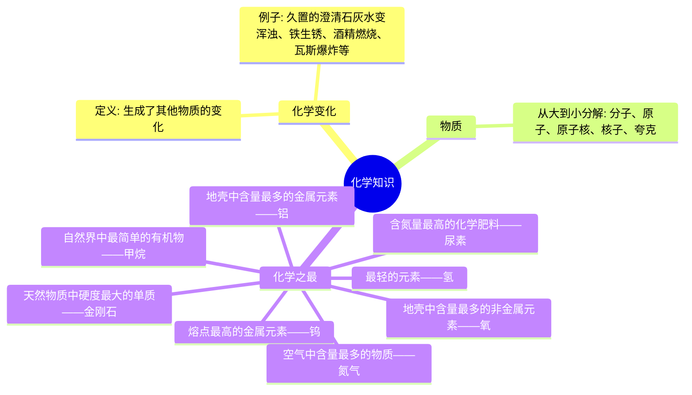
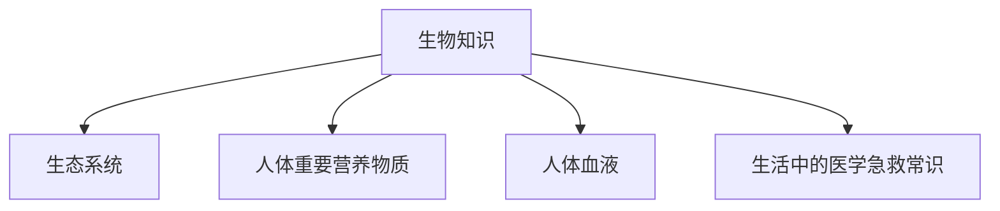
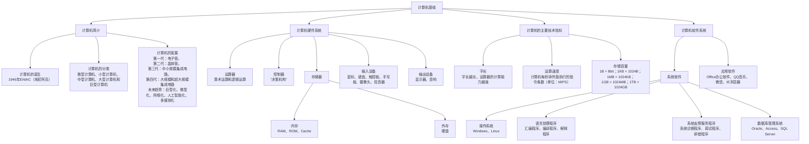

# 第八篇 科技知识

## 第一章 高新技术

很多考生在做高新技术知识类的题目时，觉得其中涉及的领域很“高大上”，看到题目有些犯怵，例如“什么是物联网”“大数据有什么用”。其实没有必要犯怵，这些知识看似高精尖，其实跟生活息息相关，出题人不会考其背后深入的原理，一定会跟生活实际相结合。所以，在学习这类知识的时候可以结合生活，这样不仅学起来有意思，寓学于乐，而且有利于掌握考点。

### 第一节 新能源技术

**考情分析**

在公共基础知识的考试中，本节内容的考查概率较高，考点主要集中在能源的分类、新能源的种类（比如核能、太阳能、地热能等等）以及各自的应用，考生对这几项考点要充分复习。

**本节框架**

*   **新能源技术**
    *   **能源及其分类**
        *   一次能源与二次能源
        *   可再生能源与非再生能源（亦称“不可再生能源”）
        *   新能源与常规能源
    *   **新能源的种类**
        *   核能、太阳能、风能、海洋能、生物质能、地热能、可燃冰

**知识内容**

#### 一、能源及其分类

能源是一切生命生存的基础，比如植物需要吸收光能，动物需要摄入食物的化学能。这里的能源通常指热能、电能、光能、机械能、化学能等。

根据不同的分类标准，能源可做如下分类：

| 分类依据 | 具体类型 | 定义及典型代表 |
| :--- | :--- | :--- |
| **是否直接从自然界获取** | **一次能源** | 指自然界中以原有形式存在的，不需要经过加工转换的能源。比如煤、石油、天然气、太阳能、风能、地热能、生物质能、核能等 |
| | **二次能源** | 指由一次能源经过加工转换而成的能源。比如汽油、柴油、沼气、电能等 |
| **是否可再生（仅限一次能源）** | **可再生能源** | 是指取之不尽、用之不竭，可以循环利用的能源。比如太阳能、风能、地热能、生物质能等 |
| | **非再生能源** | 是指需要经过漫长的地质年代才能形成而无法在短期内再生的能源。比如煤、石油、天然气、核能等 |
| **利用是否成熟** | **常规能源** | 在现有经济和技术条件下，已经大规模生产和广泛使用的能源。比如煤、石油、天然气等 |
| | **新能源** | 新近利用或正在着手开发的能源，比如太阳能、风能、地热能、生物质能、核能等 |

**☆名师解读**

**1. 核能属于非再生能源的原因**
现在人们能利用的核能主要是核裂变形式，裂变用到的原料铀储藏量有限，所以现行所利用核裂变的核能是非再生能源。

**2. 生物质能**
生物质可理解为植物、动物和微生物等。生物质能是这些生物吸收了太阳能之后，体内产生化学变化得到的能量。

#### 二、新能源的种类

新能源又称非常规能源，是指传统能源之外的各种能源形式，即刚开始开发利用或正在积极研究、有待推广的能源，如核能、太阳能、风能、海洋能、生物质能、地热能和可燃冰等。

**（一）核能**
核能指的是原子核里的核子重新分配和组合时释放出来的能量。核能的释放主要有三种形式：

**1. 核裂变能**
核裂变能是通过一些重原子核的裂变释放出的能量。核裂变用的原料主要是铀，因为铀是自然界当中能找到的最重的元素。核裂变目前主要应用于原子弹、核电站。

（1）1964年，我国第一颗原子弹爆炸成功。

（2）核能发电不会造成空气污染，也不会产生加重地球温室效应的二氧化碳，运输和储存都很方便。位于浙江嘉兴的秦山核电站是我国大陆第一座核电站。它的建设，结束了中国大陆无核电的历史。核电站的选址一般都在沿海的地方。

**☆名师解读**

**为什么核电站的选址一般都在沿海的地方？**
这是因为核能发电需要大量的水冷却。在裂变过程中产生了大量热能，处于高压力下的水会把热能带出，产生高压蒸汽，蒸汽推动汽轮机带动发电机一起旋转进而发电。高压蒸汽做完功后，需要大量的冷却水冷却，再循环使用产生高压蒸汽。

**2. 核聚变能**
核聚变能指的是由两个或两个以上轻原子核（如氢的同位素——氘和氚）结合成一个较重的原子核，同时发生质量亏损，从而释放出的巨大能量。

核聚变能一旦实现和平利用，地球上的能源将取之不尽、用之不竭，因能源短缺带来的社会问题可得到彻底解决。常见的核聚变有：

（1）太阳内部：太阳的能量来源于太阳内部的核聚变反应。太阳内部在高温高压下，4个氢原子核经过一连串的核聚变反应，变成一个氦原子核。在核聚变过程中，原子核质量出现亏损，亏损的质量转化为能量。

（2）氢弹：1967年，我国成功爆炸了第一颗氢弹。

**3. 核衰变能**
核衰变能是原子核自发衰变过程中释放的能量。核衰变能是一种自然的、慢得多的裂变形式，因其能量释放缓慢而难以利用。

**（二）太阳能**
太阳能指太阳光的辐射能量，是太阳核聚变反应过程中产生的能量。主要利用形式有三种，即光热转换、光电转换和光化学转换。

**1. 光热转换**
光热转换是将太阳光收集起来，通过转换成热能加以利用。生活中典型的应用有太阳能热水器、太阳灶。

**2. 光电转换**
光电转换是将太阳能直接转换为电能。生活中典型的应用有太阳能电池。

**3. 光化学转换**
光化学转换是吸收光辐射产生化学反应转换为化学能。生活中典型的应用有光合作用。

**（三）风能**
风能是太阳辐射下空气流动所产生的动能。其优势是蕴藏量大、分布广泛、永不枯竭。风力发电是当今社会风能利用的主要形式。

**（四）海洋能**
海洋能主要包括海水温差能、海水盐度差能、海流能、潮汐能、波浪能等。海洋能主要用于发电，蕴藏量巨大，可以再生，但是利用率不高。

因海水涨落及潮水流动所产生的能量称为潮汐能。利用潮汐能可以进行发电。潮汐发电始于欧洲，20世纪初德国和法国已开始研究潮汐发电，之后美国、英国、加拿大、苏联、瑞典、丹麦、挪威、印度等国都陆续研究开发潮汐发电技术，兴建各具特色的潮汐电站，并已取得巨大成功。目前，温岭江厦潮汐试验电站是我国最大的潮汐能发电站。

**☆名师解读**

**潮汐能发电的原理是什么？**
潮汐是指海水在月球和太阳引潮力作用下所产生的周期性运动。潮汐能发电的原理，就是利用潮汐形成的落差来推动水轮机，再由水轮机带动发电机发电。

**（五）生物质能**
生物质能来源于生物质，是太阳能以化学能形式贮存于生物质中的一种能量形式。它直接或间接地来源于植物的光合作用，即生物质能的本质是太阳能。

生物质能贮存的太阳能，可转化成常规的固态、液态或气态燃料。

**（六）地热能**

地热能是地球内部不断进行反应，产生的巨大热能通过大地的热传导、火山喷发、地震等途径向地表散发，从而产生的热能。地热能的利用方式主要有地热发电和直接利用（比如供暖、温泉等）。

《中国地热能发展报告（2018）》数据显示，我国浅层地热能、中深层地热能直接利用率分别以年均 28%、10% 的速度增长，已连续多年位居世界第一。

> **☆ 名师解读**
>
> 我国目前浅层地热能利用规模最大的地方是哪里？
>
> 《中国地热能发展报告（2018）》数据显示，我国浅层地热能利用快速发展。
>
> 截至 2017 年底，中国地源热泵装机容量达 2 万兆瓦，年利用浅层地热能折合 1900 万吨标准煤，实现供暖（制冷）建筑面积超过 5 亿平方米，<unclear>京津冀开发利用规模最大。</unclear>

**（七）可燃冰**

可燃冰是一种甲烷与水结合的固体物质，因其外形与冰相似，故称“可燃冰”，也叫“天然气水合物”。它主要广泛分布于深海和陆地永久冻土中。

据测算，可燃冰的蕴藏量比地球上的煤、石油和天然气的总和还多。同时可燃冰的能量密度非常高，同等条件下燃烧产生的能量比煤、石油、天然气要多出数十倍。

#### 🔖 考点清单

*   **考点 1**——能源分类的问题：哪些能源属于一次能源，哪些能源属于二次能源？一次能源中哪些属于可再生能源，哪些属于不可再生能源？
*   **考点 2**——核裂变用的原料主要是什么？
    铀，因为铀是自然界中能找到的最重的元素。
*   **考点 3**——核裂变的主要应用：原子弹、核电站。
*   **考点 4**——常见的核聚变：氢弹、太阳内部。
*   **考点 5**——我国成功爆炸第一颗原子弹和第一颗氢弹是什么时间？
    1964 年，我国第一颗原子弹爆炸成功；1967 年，我国第一颗氢弹爆炸成功。

<!-- page: 7 -->

考点6——生物质能的本质是什么呢？
太阳能。因为生物质能直接或间接地来源于植物的光合作用，植物的光合作用需要太阳能。

考点7——我国目前浅层地热能利用规模最大的地方：京津冀地区。
考点8——可燃冰的主要成分：甲烷。
考点9——可燃冰主要分布在哪里？
主要分布在深海和陆地永久冻土中。

* 易混易错
(1) 原子弹和氢弹虽然都属于核能的应用，但是二者利用的核能形式是不一样的。原子弹利用的是核裂变，氢弹利用的是核聚变。
(2) 如果题目说可燃冰是一种稀缺的能源，正确吗？其实是不对的，因为可燃冰的蕴藏量比地球上的煤、石油和天然气的总和还多，而且分布广泛。

#### 真题再现
1.（单选）天然能源分为可再生能源和不可再生能源。下列属于可再生能源的是（    ）。
A. 可燃冰
B. 核能
C. 页岩气
D. 太阳能
**【答案】D**
【解析】 本题考查科技常识。
天然能源（一次能源）可以进一步分为可再生能源和不可再生能源（亦称“非再生能源”）两大类。可再生能源是指在自然界可以循环再生，取之不尽、用之不竭的能源，包括太阳能、水能、风能、生物质能、波浪能、潮汐能、地热能等；不可再生能源是指在自然界中经过亿万年形成，短期内无法恢复且随着大规模开发利用，储量越来越少，总有枯竭的一天的能源，包括煤、原油、天然气、页岩气、核能等。
故正确答案为D。
2.（单选）我国第一颗原子弹研制成功是在（    ）年。
A. 1960
B. 1962
C. 1964
D. 1967
**【答案】C**

<!-- page: 8 -->

【解析】本题考查我国科技史上的主要成就。
1964年10月16日下午3时，中国自行研制的第一颗原子弹在新疆罗布泊上空爆炸成功，我国第一次将原子核裂变的巨大火球和蘑菇云升上了戈壁荒漠。
故正确答案为C。
3.（多选） 按基本形态，能源有一次能源和二次能源之分，前者即天然能源，指在自然界现成存在的能源，后者指由一次能源加工转换而成的能源产品。下列哪些不属于二次能源? ( )
A. 水能         B. 风能
C. 汽油         D. 电能
【答案】AB
【解析】本题考查科技常识。
一次能源是指直接取自自然界、没有经过加工转换的各种能量和资源，包括太阳能、水能、风能、生物质能、波浪能、潮汐能、海洋温差能等；二次能源是转化过形式的能源，也称“次级能源”或“人工能源”，是由一次能源经过加工或转换得到的其他种类和形式的能源，包括煤气、焦炭、汽油、煤油、柴油、重油、电能、蒸汽、热水、氢能等。因此，A、B两项均属于一次能源，错误；C、D两项均属于二次能源，正确。
本题为选非题，故正确答案为AB。
4.（判断） 我国在南海北部神狐海域进行的可燃冰试采获得成功，这标志着我国成为全球第一个实现了在海域可燃冰试开采中获得连续稳定产气的国家。可燃冰作为一种清洁能源，其主要成分是乙炔。( )
【答案】错误
【解析】可燃冰作为一种清洁能源，其主要成分是甲烷。
故表述错误。

<!-- page: 9 -->

#### 本节导图

- **新能源技术**
  - **核能**
    - 核裂变
      - 原料：铀
      - 核能发电：建在沿海的地方是因为需要大量的水冷却；秦山核电站是我国大陆第一座核电站
      - 原子弹：1964年我国第一颗原子弹爆炸成功
    - 核聚变
      - 太阳内部
      - 氢弹：1967年我国第一颗氢弹爆炸成功
    - 核衰变
  - **太阳能**
    - 光热转换（太阳能热水器、太阳灶）
    - 光电转换（太阳能电池）
    - 光化学转换（光合作用）
  - **风能**
    - 风力发电
  - **海洋能**
    - 包括潮汐能、波浪能、海流能、海水温差能、海水盐度差能
    - 温岭江厦潮汐试验电站是我国最大的潮汐能发电站
  - **生物质能**
    - 本质是太阳能
    - 可转化成常规的固态、液态、气态的燃料
  - **地热能**
    - 利用方式：地热发电、直接利用
    - 我国浅层地热能利用规模最大的地区：京津冀地区
  - **可燃冰**
    - 主要成分：甲烷
    - 主要分布在陆地永久冻土、海洋深处

---

#### 拓展阅读

清洁能源技术是21世纪的一个重要产业，未来我国能源结构将发生“清洁能源为主、化石能源为辅”的根本性转变。化石能源和清洁能源的概念和种类如下：

化石能源，是由死去的动物和植物在地下分解而形成的一种碳氢化合物或其衍生物，生活中常见的化石能源有煤炭、石油和天然气等。

清洁能源，主要有狭义和广义两种概念。狭义的清洁能源是指可再生能源，如水能、生物能、太阳能、风能、地热能和海洋能等。这些能源消耗之后可以恢复补充，很少产生污染。广义的清洁能源则还包括在能源的生产及其消费过程中，选用对生态环境低污染或无污染的能源，如清洁煤等。

### 第二节 生物工程技术

**考情分析**
在公共基础知识的考试中，本节内容的考查概率一般，考点主要集中在生物工程所包括的各种技术，比如基因工程、细胞工程、微生物工程等，及其在实际中的应用，考生对这些内容要充分复习。

**本节框架**
```
生物工程技术
├─ 基因工程（遗传工程）
├─ 细胞工程
├─ 微生物工程（发酵工程）
└─ 酶工程
```

**知识内容**
#### 一、生物工程技术的概念
生物工程是指运用生物化学、分子生物学、微生物学、遗传学等原理与生化工程相结合，来改造或重新创造设计细胞的遗传物质、培育出新品种，以工业规模利用现有生物体系，以生物化学过程来制造工业产品。

近年来，现代生物技术突飞猛进，其主要包括基因工程（遗传工程）、细胞工程、微生物工程（发酵工程）、酶工程。其中，基因工程是现代生物工程技术的核心和建立的标志。

#### 二、生物工程技术的应用
| 名称 | 原理 | 应用 |
| ---- | ---- | ---- |
| 基因工程 | 也叫作遗传工程，是通过DNA重组操作，人为地在体外对生物体的基因进行剪切、修饰、改变和转移，实现基因克隆、基因转移、基因编辑和基因治疗的目的 | <unclear>利用基因工程技术研发转基因食品和抗虫棉 |

| 细胞工程 | 广义的细胞工程包括所有的生物组织、器官及细胞离体操作和培养技术；狭义的细胞工程则是指细胞融合和细胞培养技术 | 利用细胞工程技术进行试管婴儿、克隆 |
| --- | --- | --- |
| 微生物工程 | 又叫发酵工程，是利用微生物发酵作用，通过现代工程技术手段来生产有用物质 | 日常生活中的酱油、醋、味精、酒等就是发酵工程的产物 |
| 酶工程 | 是在一定生物反应装置中利用酶的催化性质，将相应原料转化成有用物质的技术 | 酶工程的应用主要集中于食品工业、轻工业以及医药工业中。蛋白酶可用于洗涤剂工业，如日常生活中的加酶洗衣粉 |

**名师解读**

> (1) 抗虫棉如何利用了基因工程？
> 以前的棉花总是被害虫吃，品质不好。于是科学家把外来的Bt毒蛋白基因导入到棉花中，棉花则会产生带毒素的晶体，害虫一吃便死掉，从而提高了棉花的品质。
>
> (2) 什么是克隆？
> 要认识克隆技术，首先要了解无性繁殖，即广义上的克隆。我们在生活中经常能够遇到这种情形:一株草莓依靠它沿地“爬走”的匍匐茎，一年内就能长出数百株草莓苗。这种通过生物自身的某一部分来繁衍后代的方式就叫做无性繁殖。
> 而现如今，“克隆”的含义早已不仅仅是“无性繁殖”，而是一种人工诱导的无性繁殖方式。人们利用生物技术由无性生殖产生与原个体有完全相同基因组织的后代，这一过程被称为克隆。世界上第一例克隆动物是诞生于英国的“多莉”羊。
>
> (3) 生活中使用加酶洗衣粉用冷水洗涤去污效果更好吗？
> 此种做法不正确，温度过高或过低都会抑制酶的活性，温水的温度是更接近酶发挥作用的适宜温度，因此使用加酶洗衣粉在温水中去污效果更佳。

#### 考点清单
考点 1——现代生物工程技术的核心和建立的标志:基因工程。
考点 2——基因工程在生活中的应用:转基因食品、抗虫棉。
考点 3——细胞工程在生活中的应用:试管婴儿、克隆。

考点 4——克隆属于无性繁殖还是有性繁殖?
无性繁殖。
考点 5——世界上第一例克隆动物是什么?
羊。
考点 6——加酶洗衣粉用温水还是用冷水去污效果更好?
温水。
* 易混易错——克隆技术属于细胞工程带来的产物，考试时若有这道题千万不要选错了。

#### 真题再现
1.（单选）现代生物技术的核心是（    ），它的出现带动了生物技术的全面发展。
A. 基因工程        B. 发酵工程
C. 细胞工程        D. 酶工程
【答案】A
【解析】本题考查科技常识。
生物工程技术包括酶工程、发酵工程、细胞工程和基因工程。现代生物技术的核心是基因工程，它的出现带动了生物技术的全面发展。
A项正确，基因工程，又称基因拼接技术和DNA重组技术，是以分子遗传学为理论基础，以分子生物学和微生物学的现代方法为手段，将不同来源的基因按预先设计的蓝图，在体外构建杂种DNA分子，然后导入活细胞，以改变生物原有的遗传特性、获得新品种、生产新产品。基因工程技术为基因的结构和功能的研究提供了有力的手段。
B项错误，发酵工程，是指采用现代工程技术手段，利用微生物的某些特定功能，为人类生产有用的产品，或直接把微生物应用于工业生产过程的一种新技术。发酵工程的内容包括菌种的选育、培养基的配制、灭菌、扩大培养和接种、发酵过程和产品的分离提纯等方面。
C项错误，细胞工程是生物工程的一个重要方面。总的来说，它是应用细胞生物学和分子生物学的理论和方法，按照人们的设计蓝图，进行在细胞水平上的遗传操作及大规模的细胞和组织培养。当前细胞工程所涉及的主要技术领域有细胞培养、细胞融合、细胞拆合、染色体操作及基因转移等方面。通过细胞工程可以生产有用的生物产品或培养有价值的植株，并可以产生新的物种或品系。D项错误，酶工程，又称蛋白质工程学，是指工业上有目的地设置一定的反应器和反应条件，利用酶的催化功能，在一定条件下催化化学反应，生产人类需要的产品或服务于其他目的的一门应用技术。
故正确答案为A。
2.（单选）酱油、醋、酒是运用（    ）技术的结果。
A. 微生物工程        B. 细胞工程
C. 酶工程            D. 蛋白质工程
【答案】A
【解析】本题考查科技常识。
A项正确，微生物工程又叫发酵工程，是指采用现代工程技术手段，利用微生物的某些特定功能，为人类生产有用的产品，或直接把微生物应用于工业生产过程的一种新技术。如利用酵母菌发酵制造酒、酱油、工业酒精等，利用乳酸菌发酵制造奶酪和酸牛奶，利用真菌大规模生产青霉素等。
B项错误，细胞工程是应用细胞生物学和分子生物学的理论和方法，按照人们的设计蓝图，进行在细胞水平上的遗传操作及大规模的细胞和组织培养。在作物育种、繁育优良品种等方面有广泛的应用。
C项错误，酶工程就是将酶或者微生物细胞、动植物细胞、细胞器等放置在一定的生物反应装置中，利用酶所具有的生物催化功能，借助工程手段将相应的原料转化成有用物质并应用于社会生活的一门科学技术。主要应用于食品工业、轻工业以及医药工业中。
D项错误，蛋白质工程以蛋白质分子的结构规律及其生物功能的关系作为基础，通过化学、物理和分子生物学的手段进行基因修饰或基因合成，对现有蛋白质进行改造，或制造一种新的蛋白质，以满足人类生产和生活的需求。
故正确答案为A。
3.（多选）生物技术是21世纪技术的核心，以生命科学为基础，是利用生物体和工程原理等生产制品的综合技术，生物技术主要包括（    ）。
A. 基因工程        B. 细胞工程
C. 酶工程          D. 微生物工程
【答案】ABCD
【解析】本题考查科技常识。生物技术是应用生物学、化学和工程学的基本原理，利用生物体（包括微生物、动物细胞和植物细胞）或其组成部分（细胞器和酶）来生产有用物质，或为人类提供某种服务的技术。生物技术包括的四个领域是基因工程、细胞工程、酶工程、微生物工程。
A项正确，基因工程，又称基因拼接技术和DNA重组技术，是以分子遗传学为理论基础，以分子生物学和微生物学的现代方法为手段，将不同来源的基因按预先设计的蓝图，在体外构建杂种DNA分子，然后导入活细胞，以改变生物原有的遗传特性、获得新品种、生产新产品。
B项正确，细胞工程是生物工程的一个重要方面。总的来说，它是应用细胞生物学和分子生物学的理论和方法，按照人们的设计蓝图，进行在细胞水平上的遗传操作及大规模的细胞和组织培养。当前细胞工程所涉及的主要技术领域有细胞培养、细胞融合、细胞拆合、染色体操作及基因转移等方面。
C项正确，酶工程，又称蛋白质工程学，是指工业上有目的地设置一定的反应器和反应条件，利用酶的催化功能，在一定条件下催化化学反应，生产人类需要的产品或服务于其他目的的一门应用技术。
D项正确，微生物工程，又称发酵工程，是指采用现代工程技术手段，利用微生物的某些特定功能，为人类生产有用的产品，或直接把微生物应用于工业生产过程的一种新技术。发酵工程的内容包括菌种的选育、培养基的配制、灭菌、扩大培养和接种、发酵过程和产品的分离提纯等方面。
故正确答案为ABCD。

#### 本节导图
```
生物工程技术
├─ 基因工程（遗传工程）
│  ├─ 应用：转基因食品、抗虫棉
│  └─ 是现代生物工程技术的核心和建立的标志
├─ 细胞工程
│  ├─ 试管婴儿 → 有性繁殖
│  └─ 克隆 → 无性繁殖；克隆羊“多莉”是世界首例克隆动物
├─ 微生物工程（发酵工程）
│  └─ 发酵食品：酒、醋、酱油、味精等
└─ 酶工程
   └─ 加酶洗衣粉用温水洗涤去污效果好
```


#### 拓展阅读
自从1997年“多莉”羊体细胞克隆成功后，体细胞克隆技术经历了多年的发展，先后诞生出包括牛、马、猪和骆驼等在内的大型家畜，以及包括小鼠、大鼠、兔、猫和狗在内的多种实验动物，但与人类最为相近的非人灵长类动物体细胞克隆的难题一直没有得到解决，成为世界性难题。
2017年11月27日，我国首次成功实现了世界首例非人灵长类动物的体细胞克隆。世界首个体细胞克隆猴“中中”诞生。一周后，第二个体细胞克隆猴“华华”诞生。

### 第三节 新材料技术
**考情分析**
在公共基础知识的考试中，本节内容的考查概率较高，考点主要集中在新材料技术当中的新型材料，比如纳米材料、超导材料等，考生可以结合生活中的所见所闻予以复习。

**本节框架**
```
新材料技术
├─ 纳米材料
├─ 超导材料
├─ 金属材料
├─ 半导体材料
└─ 合成材料
```

**知识内容**

#### 一、新材料的含义

新材料是指那些新近发展或正在发展之中的比传统材料的性能更为优异的一类材料。新材料技术是按照人的意志，通过物理研究、材料设计、材料加工、试验评价等一系列研究过程，创造出能满足各种需要的新型材料的技术。

新材料技术被称为“发明之母”和“产业粮食”。

#### 二、新材料的种类

| 名称 | 简介 | 典型代表 |
| :--- | :--- | :--- |
| 纳米材料 | 一般情况下，对于固体粉末或纤维，当其有一维尺寸小于100纳米，即达到纳米尺寸，即可称为纳米材料 | 石墨烯是世界上最薄的纳米材料。石墨烯是由一层碳原子构成、按蜂窝状六边形排列的平面晶体。石墨烯独特的结构让它具有更导电、更传热、更坚硬、更透光等优异的电学、热学、力学、光学等方面的性能。被称为“黑金”，是“新材料之王” |
| 超导材料 | 超导是20世纪最伟大的科学发现之一，指的是某些材料在温度降低到某一临界温度时，电阻突然消失并且不能被磁场穿过的现象。具备这种特性的材料称为超导材料。超导材料具有零电阻和完全抗磁性两大特性。利用零电阻的超导材料替代有电阻的常规金属材料，可以节约输电过程中造成的大量热损耗；可以组建超导发电机、变压器、储能环；可以在较小空间内实现强磁场，从而获得高分辨的核磁共振成像、进行极端条件下的物性研究、发展安全高速的磁悬浮列车等 | 铁基超导体是继铜氧化合物高温超导体之后发现的一类新型高温超导材料。它的出现为高温超导电性的研究开辟了一个全新的方向，是目前物理学的一个研究热点 |

| 名称 | 简介 | 典型代表 |
| :--- | :--- | :--- |
| 金属材料 | 金属材料是指金属元素或以金属元素为主构成的具有金属特性的材料的统称。常见的金属材料包括纯金属、合金等 | 青铜是金属冶铸史上最早的合金。青铜一般是在纯铜中加入金属锡。与纯铜相比，青铜强度高，铸造性好，耐磨<br><br>钛是20世纪50年代发展起来的一种重要的结构金属，没有毒、重量轻、强度高。而钛合金的优势更明显，强度高、耐腐蚀、耐热等。钛合金的用途非常广，可用于航天、医疗、建筑等领域。因为钛和钛合金功能强大，被誉为“21世纪金属” |
| 半导体材料 | 半导体材料是指在常温下导电性能介于导体与绝缘体之间的材料。半导体在收音机、电视机以及测温上有着广泛的应用，涉及的产业主要包括集成电路、LED、太阳能光伏等 | 单晶硅是主要的半导体材料，用于制造半导体器件、太阳能电池等 |
| 合成材料 | 按照用途和性能可分为合成高分子材料（包括塑料、合成纤维、合成橡胶、涂料等）、功能高分子材料（包括液晶高分子、医用高分子、高吸收性树脂等）和复合材料 | 塑料、合成纤维、合成橡胶被称为“三大合成材料” |

**名师解读**

> **(1) 什么是纳米?**
> 纳米跟米、厘米、毫米一样，是长度单位，1纳米等于十亿分之一米。
>
> **(2) 什么是超导体的抗磁性?**
> 即超导体一旦进入超导态，就如同练就了“金钟罩”“铁布衫”一样。这是因为超导体在靠近磁场时会在其表面感应出超导电流，这个超导电流会在超导体内部产生一个与外磁场方向相反、大小相等的磁场，外界磁场根本进不去，两种磁场相互抵消，从而体内的磁感应强度为零。
>
> **(3) 什么是高温超导?**
> 高温超导中的“高温”是相对于零下270摄氏度的低温超导而言的，这里的“高温”其实是我们通常意义上的超低温，甚至达到零下196摄氏度的液氮沸点的温度。

中国科学院院士赵忠贤是我国高温超导领域的领军人物，2017年1月，他凭借在高温超导领域的突出贡献，获得2016年度国家最高科学技术奖。

#### 考点清单

*   考点1——1纳米等于多少米?
    *   1纳米等于十亿分之一米。
*   考点2——纳米材料研究的尺度范围：小于100纳米。
*   考点3——世界上最薄的纳米材料是什么?
    *   石墨烯，被称为“黑金”，是“新材料之王”。
*   考点4——超导材料的特性是什么?
    *   零电阻和完全抗磁性。
*   考点5——青铜是什么合金?
    *   青铜是金属冶铸史上最早的合金。青铜一般是在纯铜中加入金属锡。
*   考点6——被誉为“21世纪金属”的是什么?
    *   钛和钛合金。
*   考点7——主要的半导体材料是什么?
    *   单晶硅。
*   考点8——被称为“三大合成材料”的是什么?
    *   塑料、合成纤维、合成橡胶。
*   \*易混易错——1纳米等于十亿分之一米，即1纳米=$10^{-9}$米，一定要看清楚指数。

#### 真题再现
1.（单选） 2018年2月25日举行的平昌冬奥会闭幕式“北京8分钟”文艺表演中，“轻薄又保暖、防风又透气、运动又发光”的表演服装引人瞩目。设计师为了兼顾服装的轻薄和保暖，不断尝试多种材料，使用了多种科技手段，比如在服装内层选用具有低温下可持续发热功能的（     ）与自发热纤维，将被动保暖变成主动保暖。
    A. LED
    B. 石墨烯
    C. 远红外
    D. 羽绒

**【答案】B**

**【解析】本题考查科技常识。**

A项错误，LED，即发光二极管，是半导体二极管的一种，可以把电能转化成光能，不能持续发热保暖。
B项正确，石墨烯是一种由碳原子以sp²杂化轨道组成六角型呈蜂巢晶格的二维碳纳米材料。石墨烯的电子迁移率受温度变化的影响较小，在低温下其载流子迁移率甚至可高达250000cm²/(V·s)。石墨烯具有非常好的热传导性能，是目前为止导热系数最高的碳材料之一。因此，在服装内层选用具有低温下可持续发热功能的石墨烯，可将被动保暖变成主动保暖。
C项错误，按照不同波长范围，红外线分为近红外、中红外和远红外区域，相对应波长的电磁波称为近红外线、中红外线及远红外线。远红外线对于血液循环和微循环障碍引起的多种疾病均具有改善和防治作用，对服装的保温作用有限，不能主动保暖。
D项错误，羽绒是制作羽绒服的材料，不具有低温下可持续发热功能，不能主动保暖。
故正确答案为B。
2.（单选） 下列选项中，属于合成材料的是（     ）。
    A. 羊毛
    B. 棉花
    C. 塑料
    D. 天然橡胶

**【答案】C**

**【解析】本题考查科技常识。**

合成材料又称人造材料，是人为地把不同物质经化学方法或聚合作用加工而成的材料，其特质与原料不同，如塑料、合金（部分合金）等。塑料、合成纤维和合成橡胶号称20世纪三大有机合成材料。
故正确答案为C。
3.（单选） 关于金属材料，下列表达错误的是（     ）。
    A. 重金属和轻金属是根据强度不同划分的
    B. 钛合金可用于制造飞机、火箭的结构件
    C. 青铜是金属冶铸史上最早出现的合金
    D. 纯铝的导热性好，强度低，耐磨性差

**【答案】A**

**【解析】本题考查科技常识。**

A项错误，轻金属和重金属是按照金属密度的不同划分的。密度小于4.5克/立方厘米的是轻金属，密度大于4.5克/立方厘米的则是重金属。
B项正确，钛合金具有强度高、耐蚀性好、耐热性高的特点。主要用于制作飞机发动机压气机部件，其次为火箭、导弹和高速飞机的结构件。
C项正确，青铜是金属冶铸史上最早的合金。与纯铜（紫铜）相比，青铜强度高且熔点低，并且铸造性好，具有耐磨且化学性质稳定的特点。
D项正确，工业纯铝密度小，熔点低，具有良好的导电性，仅次于金、银、铜，塑性好，但强度低、硬度低，耐磨性差，不适合制作受力的机械零件，可进行各种冷、热加工。
本题为选非题，故正确答案为A。
4.（多选） 关于功能材料的说法，正确的是（     ）。
    A. 半导体材料的电导率介于导体与绝缘体之间，是当代电子信息领域中最重要的新材料，单晶硅是主要的半导体材料
    B. 超导材料具有零电阻性，利用超导体可最大限度地降低超高压输电的损耗
    C. 超导材料具有磁悬浮性，超导悬浮技术现在被用在无磨损轴承、磁悬浮列车，以及粒子加速器、核聚变反应堆的研制上
    D. 1纳米是1米的万亿分之一，当物质到纳米尺度以后，物质的性能就会发生突变，出现特殊性能

**【答案】ABC**

**【解析】本题考查科技常识。**

A项正确，半导体材料的导电能力介于导体与绝缘体之间，是当代电子信息领域中最重要的新材料，可用来制作半导体器件和集成电路。单晶硅是主要的半导体材料，可以用于二极管级、整流器件级、电路级以及太阳能电池级单晶产品的生产和深加工制造。
B、C两项正确，零电阻和完全抗磁性是超导体的两个重要特性。超导材料有两个极具利用价值的特性：一是零电阻性，利用超导体可最大限度地降低超高压输电的损耗；<unclear>
D项错误，1纳米是1米的十亿分之一（$10^{-9}$米），而不是万亿分之一。当物质到纳米尺度以后，物质的性能确实会发生突变，出现特殊性能。
故正确答案为ABC。

<!-- page: 21 -->

二是磁悬浮性，超导悬浮技术现在被用在无磨损轴承、磁悬浮列车，以及粒子加速器、核聚变反应堆的研制上。

D项错误，1纳米是1米的十亿分之一，当物质到纳米尺度以后，物质的性能就会发生突变，出现特殊性能。

故正确答案为ABC。

#### 本节导图

- 新材料技术
  - 新材料技术含义：被称为“发明之母”和“产业粮食”
  - 纳米材料
    - 纳米是长度单位，1纳米等于十亿分之一米
    - 纳米材料：尺度范围（1~100nm）
    - 石墨烯：世界上最薄的纳米材料；被称为“黑金”，是“新材料之王”
  - 超导材料
    - 现象：温度降低到一定数值时，电阻突然消失
    - 两大特性：零电阻、完全抗磁性
    - 我国高温超导领军人物：赵忠贤
  - 金属材料
    - 合金
      - 青铜：金属冶铸史上最早的合金；铜+锡
      - 钛和钛合金：被誉为“21世纪金属”
  - 半导体材料
    - 导电性能介于导体与绝缘体之间
    - 单晶硅是主要的半导体材料
  - 合成材料
    - 塑料
    - 合成纤维
    - 合成橡胶

### 第四节 现代信息技术

**考情分析**

在公共基础知识的考试中，本节内容的考查概率较高，考点主要集中在信息技术中的热词和热门技术，比如大数据、物联网、5G等，这部分也可以结合生活中的前沿科学技术进行复习。

**本节框架**
- 现代信息技术
  - 大数据
  - 物联网
  - 5G技术
  - 人工智能
  - VR
  - 3D打印

**知识内容**
#### 一、信息技术的含义
信息技术是主要用于管理和处理信息所采用的各种技术的总称。它主要是应用计算机科学和通信技术来设计、开发、安装和实施信息系统及应用软件。信息技术主要包括传感技术、计算机技术和通信技术等。

#### 二、现代信息技术的应用
| 名词 | 概念及应用 |
| :--- | :--- |
| 大数据 | 大数据是依确定目的而挖掘、处理的大量不特定主体的数字信息。其特征为“4V”标准，分别为Volume（规模大）、Variety（多样）、Value（价值密度低）、Velocity（速度快）。收集大数据主要用来进行数据分析 |

| **5G 技术** | 5G 技术是第五代移动通信技术的简称。5G 具有高速率、大容量、低时延、低功耗的特性，这种通信技术未来跟人工智能、大数据紧密结合，将会开启一个万物互联的全新时代 |
| :--- | :--- |
| **人工智能** | 人工智能，简称 AI，是研究、开发用于模拟、延伸和扩展人的智能的理论、方法、技术以及应用系统的一门综合性技术科学。核心包括推理、规划、学习、交流、感知、移动和操作物体的能力等。主要涉及机器人、语言识别、图像识别等领域。比如 AlphaGo、自动驾驶技术等 |
| **VR** | 中文称为虚拟现实，是运用计算机仿真系统生成多源信息融合的交互式三维动态场景以及动作仿真。该技术通过调动用户视觉、听觉、触觉、嗅觉等感官，使其沉浸在计算机生成的虚拟环境之中 |
| **3D 打印** | 3D 打印是一种以数字模型文件为基础，运用粉末状金属或塑料等可黏合材料，通过逐层打印的方式来构造物体的技术<br>目前，3D 打印技术在模具制造、工业设计等领域被广泛应用。在工业、汽车、航空航天、医疗、建筑等领域均有涉及 |

**☆ 名师解读**

> **为什么大数据价值密度低？**
> 大数据具有价值密度低的特征。大数据虽然拥有海量的信息，但是真正可用的数据可能只有很小一部分。以视频为例，连续不间断监控过程中，可能有用的数据仅仅有一两秒。

####  考点清单
**考点 1——大数据的特征是什么？**
数据规模大、数据类型多样、数据价值密度低、数据处理速度快。
**考点 2——物联网的核心是什么？**
互联网。
**考点 3——物联网的典型应用有哪些？**
**考点 4——5G 的特点是什么？**
高速率、大容量、低时延、低功耗。

**考点5——人工智能的英文简称是什么？**

AI。

**考点6——VR的中文意思是什么？**

虚拟现实。

**考点7——3D打印的应用领域有哪些？**

3D打印技术被广泛应用在工业、汽车、航空航天、医疗、建筑等领域。

####  易混易错
（1）VR和AR的中文含义是不一样的。VR的中文名称为虚拟现实，是运用计算机仿真系统生成多源信息融合的交互式三维动态场景以及动作仿真。而AR的中文名称为增强现实，这种技术的目标是在屏幕上把虚拟世界套在现实世界并进行互动。
（2）网上购物不属于物联网的应用。网上购物只是通过互联网进行网络交易，不属于物联网的应用。考题中若出现“网上购物属于物联网的应用”则不要选。

#### 真题再现
1.（单选）下列关于大数据特征的说法，错误的是（ ）。
A. 数据类型多样
B. 数据由垄断企业获取
C. 数据价值大
D. 数据规模大

【答案】 C

【解析】 本题考查科技常识。
大数据或称巨量资料，指的是需要新处理模式才能具有更强的决策力、洞察力和流程优化能力的海量、高增长率和多样化的信息资产。大数据具有海量的数据规模、快速的数据流转、多样的数据类型和价值密度低等四大特征。
A项正确，大数据的数据类型繁多，如网络日志、视频、图片、地理位置信息等。
B项正确，大数据已成为支撑社会有效运行的战略资源，但目前普遍存在“拿走数据的多，贡献数据的少”现象。少数大型互联网垄断企业为追求利益最大化，以安全和企业机密等理由拒绝向社会提供关键数据。
C项错误，大数据具有价值密度低的特征。大数据虽然拥有海量的信息，但是真正可用的数据可能只有很小一部分。以视频为例，连续不间断监控过程中，可能有用的数据仅仅有一两秒。
D项正确，大数据的数据体量巨大。从TB（太字节）级别，跃升到PB（拍字节）

<!-- page: 25 -->

级别乃至 EB（艾字节）级别。（1TB 等于 2 的 40 次方个字节，1PB 等于 2 的 50 次方个字节，1EB 等于 2 的 60 次方个字节。）
本题为选非题，故正确答案为 C。
2.（单选）当前国内三大运营商都宣布了推出 5G 技术的消息，下列关于 5G 技术说法错误的是（    ）。
A. 当前热门的 5G 是指第五代移动通信技术
B. 5G 具有比 4G 更高的速率、更宽的带宽
C. 5G 技术是目前保密性能最佳的通信技术
D. 5G 可满足自动驾驶、智能制造等行业需求

【答案】C
【解析】本题考查科技常识。
A、B 两项正确，5G 指的是在移动通信网络发展中的第五代移动通信技术，与之前的第四代移动网络相比，5G 网络在实际应用过程中表现出更加强大的功能，并且理论上其传输速度每秒钟能够达到数十 GB，这种速度是 4G 网络的几百倍。
C 项错误，其保密性并非最佳，如量子通信的保密性要优于 5G。
D 项正确，5G 网络通信最显著的一个特点及优势是兼容性强大，能在网络通信的应用及发展中满足不同设备的正常使用，同时有效融合类型不同、阶段不同的网络。
本题为选非题，故正确答案为 C。
3.（单选）下列关于“物联网”说法错误的是（    ）。
A. 具有智能处理的能力
B. 不能对物体实施智能控制
C. 是各种感知技术的广泛应用
D. 是一种建立在互联网上的泛在网络

【答案】B
【解析】本题考查物联网的相关知识。
A 项正确，物联网本身具有智能处理的能力，能够对物体实施智能控制。物联网将传感器和智能处理相结合，利用云计算、模式识别等各种智能技术，扩充其应用领域。从传感器获得的海量信息中分析、加工和处理出有意义的数据，以适应不同用户的不同需求，发现新的应用领域和应用模式。
B 项错误，物联网能够对物体实施智能控制。
C 项正确，物联网是各种感知技术的广泛应用。物联网上部署了海量的多种类型传

<!-- page: 26 -->

感器，每个传感器都是一个信息源，传感器获得的数据具有实时性，按一定的频率周期性地采集环境信息，不断更新数据。
D 项正确，物联网是一种建立在互联网上的泛在网络。物联网技术的重要基础和核心仍旧是互联网，通过各种有线和无线网络与互联网融合，将物体的信息实时准确地传递出去。
本题为选非题，故正确答案为 B。
4.（单选）关于“虚拟现实”，下列说法错误的是（    ）。
A. 使用户体验到身临其境的感觉
B. 不用借助计算机终端连接显示器
C. 将计算机技术与艺术成像结合在一起
D. 融入了全息摄影术等不同的多媒体技术

【答案】B
【解析】本题考查科技常识。
A 项正确，虚拟现实是一种高度逼真地模拟人在现实生活中视觉、听觉、动作等行为的人机界面交互技术，其采用计算机加上先进的外围设备，为用户提供一种临境和多感觉通道的体验。
B 项错误，虚拟现实是利用以现代高速电子计算机为核心的信息处理设备、相应的软件系统和微电子传感技术模拟或创造出来的，与现实的真实世界相同、相似或不相似的仿真图景。这种技术需要借助计算机终端连接显示器，让用户通过使用各种交互设备，同虚拟环境中的实体相互作用，使之产生身临其境感觉的交互式视景仿真和信息交流。
C 项正确，虚拟现实将计算机技术与艺术成像结合在一起，利用计算机技术生成一个逼真的，具有视、听、触等多种感知的虚拟环境，使用户体验到身临其境的感觉。
D 项正确，虚拟现实融入了多种不同的技术，包括利用激光创建三维成像的全息摄影术、液晶显示屏、高清晰度电视和在计算机终端连接各种显示器的多媒体技术。
本题为选非题，故正确答案为 B。
5.（多选）3D 打印是快速成型技术的一种，是一种通过逐层打印的方式来构造物体的技术，可应用于下列哪些领域？（    ）
A. 航天技术
B. 医学领域
C. 房屋建筑
D. 汽车行业

<!-- page: 27 -->

【答案】ABCD
【解析】本题考查科技常识。
3D 打印即快速成型技术的一种，它是一种以数字模型文件为基础，运用粉末状金属或塑料等可黏合材料，通过逐层打印的方式来构造物体的技术。
A 项正确，航天 3D 打印机于 2014 年 12 月 7 日问世，这台 3D 打印机采用双激光器，一种是长波的光纤激光器，另一种是短波的二氧化碳激光器，可以打印长、宽、高不超过 250 毫米的物品，每小时可打印 8 立方厘米，打印材料为不锈钢、钛合金、镍基高温合金等。
B 项正确，3D 打印在临床医学的应用，一方面，通过患者病变部位扫描成像，利用 3D 打印机将二维图像打印成 3D 模型，让病人和医生更为直观地观察与沟通，并根据模型反映的实际情况量身定做手术方案，保证手术精度；另一方面，通过 3D 模型，用特殊的生物“墨汁”打印活体细胞，在体外培育仿生器官及活体组织，再植入人体内。
C 项正确，2013 年 2 月，在英国伦敦首次建立了一个 3D 打印房屋，3D 打印房屋需要用尼龙搭扣或者像纽扣一样的扣合件起到固定作用，同时借助传统建造技术。
D 项正确，世界首款 3D 打印汽车被称为斯特拉迪，2014 年 10 月斯特拉迪在纽约首次试行。
故正确答案为 ABCD。

本节导图
现代信息技术
大数据
特征为“4V”标准：规模大、数据多样、价值密度低、处理速度快
应用：数据分析
物联网
通过信息传感设备，把任何物品与互联网连接起来，实现智能化识别和管理
核心：互联网
5G 技术
5G 技术是第五代移动通信技术的简称
特点是高速率、大容量、低时延、低功耗
人工智能
英文：AI
应用：AlphaGo、自动驾驶技术等
VR
虚拟现实：借助计算机，生成三维动态场景，使用户沉浸在虚拟环境中
3D 打印
逐层打印、可选材料多、应用广

<!-- page: 28 -->

## 第二章 航天科技及重大科技奖项

航天科技的题目在考试当中非常受青睐，因为近十几年来我国的航天科技成就令世界瞩目。例如神舟系列飞船、墨子号、嫦娥四号、北斗导航系统等。有了科技成就，也得有相应的鼓励和奖励，毕竟科学家为了研究出成果呕心沥血，乃至奉献了一生，因此我们也需要掌握科技相关领域的重要奖项。在学习这部分知识的时候要注意结合时下的热点成就，这样才能紧跟时代，掌握命题方向。

### 第一节 航天科技成就

**考情分析**

在公共基础知识的考试中，本节内容的考查概率较高，考点主要集中在航天科技史、探月和登月、各类人造卫星等方面，考生对这几项考点要充分复习。

**本节框架**

航天科技成就
├── 基本概念
│   ├── 宇宙飞船
│   ├── 航天飞机
│   ├── 空间站
│   ├── 人造卫星
│   └── 运载火箭
└── 航天探索
    ├── 探月和登月
    ├── 载人航天
    └── 我国重要人造卫星

**知识内容**

#### 一、基本概念

| 航天器名称 | 介绍 |
| --- | --- |
| 宇宙飞船 | 一种运送航天员、货物到达太空并安全返回的航天器 |
| 航天飞机 | 一种可重复使用的、往返于太空和地面之间的航天器 |

| 空间站 | 一种在近地轨道长时间运行，可供多名航天员巡访、长期工作和生活的载人航天器 |
| --- | --- |
| 人造卫星 | 环绕地球飞行并在空间轨道运行一圈以上的无人航天器。主要用于科学探测和研究、天气预报、土地资源调查、土地利用、区域规划、通信、跟踪、导航等各个领域 |
| 运载火箭 | 将人们制造的各种航天器推向太空的航天运输工具。用于把人造地球卫星、载人飞船、航天站或行星际探测器等送入预定轨道 |

**名师解读**

运载火箭有哪些类别？
(1) 按推进剂来分，可分为固体火箭、液体火箭和固液混合型火箭三种类型。
(2) 按级数来分，可以分为单级火箭、多级火箭。

#### 二、航天探索

**(一) 探月和登月**

| 名称 | 国家 | 时间 | 内容 |
| --- | --- | --- | --- |
| 阿波罗11号 | 美国 | 1969年 | 美国人阿姆斯特朗成为第一个登上月球的人 |
| 嫦娥三号 | 中国 | 2013年 | “玉兔号”月球车，我国成为第三个实现月球软着陆的国家 |
| 嫦娥四号 | 中国 | 2018年 | “玉兔二号”月球车，实现人类首次月球背面软着陆 |

**名师解读**

(1) 阿姆斯特朗登上月球之后的名言是什么？
1969年7月20日这一天，美国宇航员尼尔·阿姆斯特朗在月球上为人类留下了第一个脚印。“这是我的一小步，却是人类的一大步”，他的这句话也成为此举最好的注脚，被世人铭记。

(2) 什么是软着陆技术？
软着陆技术是说人造卫星、宇宙飞船、探测器等利用一定装置，改变运行轨道，逐步降低降落速度，最后安全地、不受损害地降落到其他星球表面。中国发射的月球探测器嫦娥三号成功在月球上实现软着陆。在成功向月球表面发射探测器方面，中国成为继美国和苏联之后的第三个国家。

**(二) 载人航天**

| 名称 | 发射时间 | 内容 |
| --- | --- | --- |
| 神舟五号 | 2003年10月15日 | 我国首次发射的载人航天飞行器 |
| 神舟七号 | 2008年9月25日 | 实现我国第一次太空漫步 |
| 神舟九号 | 2012年6月16日 | 实现我国首次载人空间交会对接 |
| 神舟十号 | 2013年6月11日 | 我国首次太空授课 |
| 神舟十一号 | 2016年10月17日 | 截至当时持续时间最长的一次载人飞行任务 |

**名师解读**

(1) 我国载人航天史中重要宇航员的事迹有什么？
① 杨利伟——中国第一位飞天宇航员。（乘坐神舟五号）
② 翟志刚——中国太空漫步第一人。（乘坐神舟七号）
③ 刘洋——中国首位女航天员。（乘坐神舟九号）
④ 王亚平——进行中国首次太空授课。（乘坐神舟十号）
⑤ 景海鹏——中国唯一一位三次进入太空的宇航员。（分别乘坐神舟七号、神舟九号、神舟十一号）

(2) 神舟系列飞船是在我国哪个卫星发射中心发射的？
我国卫星发射中心一共有4个，分别是甘肃酒泉卫星发射中心、四川西昌卫星发射中心、山西太原卫星发射中心以及海南文昌卫星发射中心。神舟系列飞船均是在甘肃酒泉卫星发射中心成功发射的。

**(三) 我国重要人造卫星**

| 名称 | 内容 |
| --- | --- |
| “东方红一号” | 我国第一颗人造卫星 |
| “风云”系列 | 气象卫星，用于气候预测、环境监测等 |
| “北斗” | 我国卫星导航系统 |
| “悟空号” | 探测暗物质 |
| “墨子号” | 世界首颗量子科学实验卫星 |
| “慧眼” | 观测宇宙空间中的X射线 |

<!-- page: 31 -->

| 高分五号 | 世界首颗对大气和陆地综合观测的全谱段高光谱卫星 |
| :--- | :--- |
| 高分七号 | 我国首颗民用亚米级高分辨率光学传输型立体测绘卫星 |

**☆ 名师解读**

> **(1) “东方红一号”发射成功的时间。**
> 1970年4月24日，我国自行研制的第一颗人造地球卫星——“东方红一号”准确进入预定地球轨道，开创了中国航天事业的新纪元，使中国成为世界上第五个自行研制和发射人造卫星的国家。
> 经党中央批准、国务院批复，决定把发射第一颗人造地球卫星——“东方红一号”的日子定为“中国航天日”。2016年，国务院决定将每年4月24日设立为“中国航天日”。
>
> **(2) 北斗卫星导航系统是由什么组成的？**
> 北斗系统由空间段、地面段和用户段三部分组成。
> ——空间段：北斗系统空间段由若干地球静止轨道卫星、倾斜地球同步轨道卫星和中圆地球轨道卫星三种轨道卫星组成混合导航星座。
> ——地面段：北斗系统地面段包括主控站、时间同步/注入站和监测站等若干地面站。
> ——用户段：北斗系统用户段包括北斗兼容其他卫星导航系统的芯片、模块、天线等基础产品，以及终端产品、应用系统与应用服务等。
>
> **(3) 什么是量子通信？**
> 量子通信技术利用量子态实现信息的编码、传输、处理和解码。在众多通信的方式中，量子通信技术被称为“史上最难破译”的加密技术，量子通信最大的优点就在于保密。

#### ◎ 考点清单

**考点1——人造卫星环绕什么飞行？**
人造卫星环绕地球飞行。

**考点2——第一个登上月球的宇航员是谁？**
美国的宇航员阿姆斯特朗。

<!-- page: 32 -->

考点 3——嫦娥四号的意义是什么？
实现人类首次月球背面软着陆。

考点 4——我国首次发射的载人飞船：神舟五号。

考点 5——我国第一位进入太空的宇航员：杨利伟。

考点 6——我国第一位进行太空漫步的宇航员：翟志刚。

考点 7——我国第一位女宇航员：刘洋。

考点 8——我国第一颗人造卫星：“东方红一号”。

考点 9——中国航天日：每年 4 月 24 日。

考点 10——我国卫星导航系统代号：北斗。

**\* 易混易错**

天舟一号和天宫一号是不一样的两类航天器。天舟一号是我国首艘货运飞船，于 2017 年 4 月 20 日在文昌航天发射场发射成功，这是我国载人航天工程“三步走”发展战略第二步的收官之作。

天宫一号是我国首个目标飞行器，于 2011 年 9 月 29 日在酒泉卫星发射中心发射升空。2011 年 11 月 3 日，天宫一号目标飞行器与神舟八号飞船顺利完成首次交会对接，这是中国载人航天工程完成的首次空间交会对接试验。

#### 真题再现
1.（单选） 中国正在实施的自主发展、独立运行，与世界其他卫星导航系统兼容共用的全球卫星导航系统是 (    )。

A. GPS 系统

B. 北斗卫星系统

C. 格洛纳斯系统

D. 伽利略系统

**【答案】B**

【解析】 本题考查科技常识。

A项错误，GPS是英文Global Positioning System的简称，中文名为全球定位系统，简称为“球位系”。GPS是20世纪70年代由美国陆海空三军联合研制的新一代空间卫星导航定位系统。其主要目的是为陆、海、空三大领域提供实时、全天候和全球性的导航服务，并用于情报收集、核爆监测和应急通信等一些军事目的，是美国独霸全球战略的重要组成部分。经过20余年的研究实验，耗资300亿美元，到1994年3月，全球覆盖率达高达98%的24颗GPS卫星星座已布设完成。

B项正确，2011年12月27日，北斗卫星导航系统新闻发言人、中国卫星导航系统管理办公室主任冉承其介绍，北斗卫星导航系统是中国自主建设、独立运行，并与世界其他卫星导航系统兼容共用的全球卫星导航系统，可在全球范围内全天候、全天时为各类用户提供高精度、高可靠的定位、导航、授时服务，并兼具短报文通信能力。
C项错误，格洛纳斯卫星导航系统作用类似于美国的GPS、欧洲的伽利略卫星定位系统和中国的北斗卫星导航系统。该系统最早开发于苏联时期，后俄罗斯继续该计划。俄罗斯于1993年开始独自建立本国的全球卫星导航系统。
D项错误，欧洲伽利略系统是欧洲计划建设的新一代民用全球卫星导航系统。
故正确答案为B。
2.（单选）关于中国的新科技成果，下列说法错误的是（　　）。
A. “慧眼”是指硬X射线调制望远镜卫星
B. 中国“墨子号”是人类第一颗量子卫星
C. “风云”系列是中国导航定位卫星系统
D. 中国“天眼”是世界最大的单口径射电望远镜

**【答案】C**

【解析】本题考查科技常识。
A项正确，“慧眼”硬X射线调制望远镜卫星是中国第一个空间天文卫星，是既可以实现宽波段、大视场X射线巡天又能够研究黑洞、中子星等高能天体的短时标光变和宽波段能谱的空间X射线天文望远镜，同时也是具有高灵敏度的伽马射线暴全天监视仪。
B项正确，“墨子号”是中国发射的世界首颗量子科学实验卫星，于2016年8月16日1时40分，在酒泉用长征二号丁运载火箭成功发射升空。此次发射任务的圆满成功，标志着我国空间科学研究又迈出重要一步。
C项错误，北斗卫星导航系统是由中国自主研发的全球卫星导航系统，也是全球第四个成熟的卫星导航系统。“风云”系列一般是指气象卫星，包括风云一号、风云二号、风云三号等。
D项正确，中国“天眼”（FAST）具有中国独立自主知识产权，是目前世界最大的单口径射电望远镜（500米口径）、最精密的单天线射电望远镜。
本题为选非题，故正确答案为C。

公共基础知识（下册）
3.（单选）关于航天科技，下列表述错误的是（）。
A. 1969年，苏联宇航员加加林在月球上留下人类第一个脚印
B. 中国嫦娥三号探月器上搭载的月球车名为“玉兔”
C. 中国第一位进入太空的宇航员是杨利伟
D. 目前，中国已有女宇航员进入太空

【答案】A

【解析】本题考查科技常识，主要考查航天航空成就。
A项错误，1969年7月，美国宇航员阿姆斯特朗在月球上留下了人类第一个脚印。
B项正确，2013年11月26日，探月工程副总指挥李本正在发布会上宣布，中国首辆月球车——嫦娥三号巡视器（月球车）全球征名活动结束，最终被命名为“玉兔”。
C项正确，2003年10月15日，杨利伟乘坐由长征二号F火箭运载的“神舟五号”飞船首次进入太空，他成为中国第一位进入太空的宇航员，标志着中国太空事业向前迈进一大步。
D项正确，2012年6月15日，宇航员景海鹏、刘旺和刘洋组成飞行乘组，执行“神舟九号”与“天宫一号”载人交会对接任务。刘洋成为中国第一个进入太空的女宇航员。2013年6月11日，王亚平作为中国第二个女宇航员与聂海胜、张晓光乘坐“神舟十号”进入太空，并进行了太空授课。

本题为选非题，故正确答案为A。
4.（多选）下列关于我国航天科学知识的说法，正确的是（）。
A. 中国运载火箭主要以“长征”系列命名
B. 中国载人飞船主要以“神舟”系列命名
C. 中国探月工程主要以“嫦娥”系列命名
D. 中国载人空间站主要以“天舟”系列命名

【答案】ABC

【解析】本题考查科技常识。
A项正确，长征是人类历史上的伟大奇迹，而载星火箭的研制也是一次长征，中国运载火箭技术研究院有感于毛主席著名的《七律·长征》中表现出来的长征精神，将火箭命名为“长征”，寓意我国火箭事业一定会像红军长征一样，克服任何艰难险阻，到达胜利的彼岸。
B项正确，从字面上看，“神舟”意为“神奇的天河之舟”，又是“神州”的谐音，象征着飞船研制得到了全国人民的支持，是四面八方、各行各业大协作的产物；同时，“神舟”又有神气、神采飞扬之意，预示着整个中华民族为飞船的诞生而无比骄傲与自豪。
C项正确，中国探月工程，又称“嫦娥工程”。“嫦娥奔月”是中国家喻户晓的神话故事，探月工程象征着月球探测的终极梦想，开展月球探测工程是我国迈出航天深空探测第一步的重大举措。
D项错误，空间站又称太空站、航天站。我国的载人空间站命名为“天宫”，“天舟”系列是货运飞船。

故正确答案是ABC。

#### 本节导图
- 航天科技成就
  - 基本概念
    - 宇宙飞船：一种运送航天员、货物到达太空并安全返回的航天器
    - 航天飞机：一种可重复使用的、往返于太空和地面之间的航天器
    - 空间站：一种在近地轨道长时间运行，可供多名航天员巡访、长期工作和生活的载人航天器
    - 人造卫星：环绕地球飞行并在空间轨道运行一圈以上的无人航天器
    - 运载火箭：将人们制造的各种航天器推向太空的航天运输工具
  - 航天探索
    - 探月和登月
      - 美国宇航员阿姆斯特朗是第一个登上月球的人
      - 嫦娥三号：搭载“玉兔号”月球车，使我国成为第三个实现软着陆的国家
      - 嫦娥四号：实现人类首次月球背面软着陆
    - 载人航天
      - 神舟五号：我国首次发射的载人飞船 杨利伟
      - 神舟七号：实现我国第一次太空漫步 翟志刚
      - 神舟九号：实现我国首次载人空间交会对接
      - 神舟十号：我国首次太空授课 王亚平
      - 神舟十一号：截至当时持续时间最长的一次载人飞行任务
    - 我国重要人造卫星
      - “东方红一号”：1970年4月24日发射，我国第一颗人造卫星
      - “风云”系列：气象卫星
      - “北斗”：我国卫星导航系统
      - “悟空号”：探测暗物质
      - “墨子号”：世界首颗量子科学实验卫星
      - “慧眼”：观测宇宙空间中的X射线
      - 高分五号：世界首颗对大气和陆地综合观测的全谱段高光谱卫星
      - 高分七号：我国首颗民用亚米级高分辨率光学传输型立体测绘卫星

### 第二节 重大科技奖项

**考情分析**
在公共基础知识的考试中，本节内容的考查概率较低，但也会涉及，考点主要集中在各个奖项的适用领域以及主要获奖人物等，考生对这几项考点要充分复习。

**本节框架**
*   **重大科技奖项**
    *   诺贝尔奖
    *   戈登贝尔奖
    *   图灵奖
    *   国家最高科学技术奖
    *   卡林加奖
    *   菲尔兹奖

**知识内容**

#### 一、诺贝尔奖
诺贝尔奖分设物理、化学、生理学或医学、文学、和平和经济学六个奖项。于1901年首次颁发，每年在诺贝尔的逝世日12月10日颁发诺贝尔奖。其中和平奖由挪威确定，其余五个奖项由瑞典确定。

**名师解读**
(1) 世界上第一位两获诺贝尔奖的科学家是谁？
1903年，居里夫妇和贝克勒尔由于对放射性的研究而共同获得诺贝尔物理学奖；1911年，因发现元素钋和镭，居里夫人再次获得诺贝尔化学奖，她因而成为世界上第一个两获诺贝尔奖的科学家。

<!-- page: 37 -->

(2) 获得诺贝尔奖的中国人。
莫言，原名管谟业，2012年诺贝尔文学奖获得者，也是第一个获得诺贝尔文学奖的中国籍作家。代表作《红高粱家族》《檀香刑》《丰乳肥臀》《生死疲劳》《蛙》。
屠呦呦，获得2015年诺贝尔生理学或医学奖，理由是她发现了青蒿素，这种药品可以有效降低疟疾患者的死亡率。她成为首获科学类诺贝尔奖的中国人。

#### 二、戈登贝尔奖
戈登贝尔奖设立于1987年，主要颁发给高性能应用领域最杰出成就，特别是高性能计算创新应用的杰出成就。2016年，中国科学院软件研究所杨超等人凭借“千万核可扩展全球大气动力学全隐式模拟”这一研究成果获得该奖项，实现了中国此奖项上零的突破。

#### 三、图灵奖
图灵奖由美国计算机协会于1966年设立，专门奖励那些对计算机事业做出重要贡献的个人。一般每年只奖励一名计算机科学家，它是计算机界最负盛名的一个奖项。华人获奖者目前仅有2000年图灵奖得主姚期智。

#### 四、国家最高科学技术奖
国家最高科学技术奖于2000年由国务院设立，授予在当代科学技术前沿取得重大突破或者在科学技术发展中有卓越建树，在科学技术创新、科学技术成果转化和高技术产业化中，创造巨大经济效益或者社会效益的科学技术工作者。
每年评审一次，每年授予人数不超过2名。

#### 五、卡林加奖
卡林加奖由联合国教科文组织于1952年设立，授予致力于向大众介绍科学、研究和技术，同时致力于在国际上宣传科学技术的重要性的学者。2013年，中国科学家李象益获得该奖，这是该奖设立以来，首次有中国人获奖。

<!-- page: 38 -->

#### 六、菲尔兹奖
菲尔兹奖每四年颁奖一次，颁给二至四名有卓越贡献的年轻数学家。

#### 考点清单

考点1——诺贝尔奖分设了哪几个奖项？
分设物理、化学、生理学或医学、文学、和平和经济学奖。

考点2——诺贝尔奖的和平奖由哪个国家确定？
和平奖由挪威确定，其余五个奖项由瑞典确定。

考点3——世界上第一位两获诺贝尔奖的科学家：居里夫人。

考点4——中国第一位获得诺贝尔文学奖的作家：莫言。

考点5——中国第一位获得诺贝尔生理学或医学奖的科学家：屠呦呦。

考点6——戈登贝尔奖颁发给什么领域？
主要颁发给高性能应用领域最杰出成就，特别是高性能计算创新应用的杰出成就。

考点7——获得卡林加奖的中国科学家：李象益。

考点8——菲尔兹奖的颁发领域：数学领域。

*易混易错——诺贝尔奖并没有设立数学奖，数学跟物理、化学一样，都是很重要的基础学科。之所以没有设立数学奖是因为当时人们更多看到的是物理、化学在工业革命中的巨大作用，而忽视了数学的重要性，因此并未设立数学奖。

#### 真题再现
1.（单选） 我国中药学家（　）因创制新型抗疟疾药——青蒿素，而获得2015年诺贝尔生理学或医学奖，这是中国大陆科学家首次获评诺贝尔医学奖。
A. 屠呦呦　　　　　　B. 李普曼
C. 纪尧姆　　　　　　D. 刘慈欣

**【答案】A**

【解析】 本题考查科技常识。
A项正确，屠呦呦，药学家，中国中医研究院终身研究员兼首席研究员，青蒿素研究开发中心主任。2015年10月，因发现青蒿素治疗疟疾的新疗法获诺贝尔生理学或医学奖。屠呦呦是第一位获得诺贝尔科学奖项的中国本土科学家、第一位获得诺贝尔生理学或医学奖的华人科学家。

<!-- page: 39 -->

B项错误，1908年诺贝尔物理学奖授予法国物理学家加布里埃尔·李普曼，他发明的干涉彩色摄影技术让照片完美再现色彩，引起了巨大轰动。
C项错误，查尔斯·埃杜德·纪尧姆，瑞士著名的冶金学家、物理学家。他因发现镍钢合金于精密物理中的重要性，在1920年获得了诺贝尔物理学奖。
D项错误，刘慈欣，科幻作家，凭借科幻小说《三体》获第73届雨果奖（雨果奖被称为科幻艺术界的“诺贝尔奖”），这是亚洲人首次获得雨果奖，也是中国科幻迈出国门走向世界的重要一步。
故正确答案为A。
2.（单选） 下列关于著名科学家的描述，错误的一项是（　）。
A. 法国著名女科学家玛丽·居里是历史上第一个两次获诺贝尔物理学奖的人，她的最主要成就是发现了放射性元素镭和钋
B. 张仲景被后人尊称为“医圣”，著有传世巨著《伤寒杂病论》，其确立的辨证论治原则是中医临床的基本原则，受到历代医学家的推崇
C. 霍金是传奇的物理天才，更是生活的强者。他的伟大科学成就是在他被病魔禁锢在轮椅上20年之久的情况下做出的，因此他的贡献对于人们的观念有着深远的影响
D. 陈景润是我国杰出的数学家，他的著名的“1+2”定理被命名为陈氏定理，成为哥德巴赫猜想研究上的里程碑。这一理论至今仍然在世界上遥遥领先

**【答案】A**

【解析】 本题考查科技常识。
A项错误，玛丽·居里，世称“居里夫人”，法国著名波兰裔科学家、物理学家、化学家。1903年，居里夫妇和贝克勒尔由于对放射性的研究而共同获得诺贝尔物理学奖；1911年，因发现元素钋和镭，居里夫人再次获得诺贝尔化学奖，因而成为世界上第一个两获诺贝尔奖的人，而非两次获诺贝尔物理学奖。
B项正确，张仲景，名机，字仲景，东汉末年著名医学家，被后人尊称为“医圣”。张仲景广泛收集医方，写出了传世巨著《伤寒杂病论》，其确立的辨证论治原则，是中医临床的基本原则，是中医的灵魂所在。
C项正确，斯蒂芬·威廉·霍金，20世纪享有国际盛誉的伟人之一。1963年，霍金21岁时患上肌肉萎缩性侧索硬化症，全身瘫痪，不能言语，手部只有三根手指可以

<!-- page: 40 -->

活动。1979至2009年任卢卡斯数学教授，主要研究领域是宇宙论和黑洞，证明了广义相对论的奇性定理和黑洞面积定理，提出了黑洞蒸发理论和无边界的霍金宇宙模型，在统一20世纪物理学的两大基础理论，即爱因斯坦创立的相对论和普朗克创立的量子力学方面走出了重要一步。
D项正确，陈景润，1933年5月22日生于福建福州，当代数学家。1973年发表了“1+2”的详细证明，被公认为是对哥德巴赫猜想研究的重大贡献。
本题为选非题，故正确答案为A。
3.（单选） 2016年11月17日，中国首次在国际高性能计算运用领域获得最高奖的是（　）。
A. 南丁格尔奖　　　　B. 戈登贝尔奖
C. 普利策奖　　　　　D. 拉夏贝尔奖

**【答案】B**

【解析】 本题考查科技常识。主要涉及前沿科技与知名国际奖项的获得。
A项错误，南丁格尔奖是红十字国际委员会为表彰在护理事业中做出卓越贡献人员的最高荣誉奖，而题干为高性能计算运用领域。
B项正确，戈登贝尔奖设立于1987年，主要颁发给高性能应用领域最杰出成就，中国团队此前从未入围获奖，直到中国科学院软件研究所杨超等人在美国盐湖城举行的2016年全球超级计算大会上获得了戈登贝尔奖，他们的获奖应用名称为“千万核可扩展全球大气动力学全隐式模拟”。
C项错误，普利策奖也称为普利策新闻奖。现在，不断完善<unclear>评选制度已使普利策奖成为全球性的一个奖项，被称为“新闻界的诺贝尔奖”。
D项错误，无此奖项。
故正确答案为B。

<!-- page: 41 -->

公共基础知识（下册）

#### 本节导图
- 重大科技奖项
  - 诺贝尔奖
    - 分设物理、化学、生理学或医学、文学、和平和经济学奖
    - 和平奖由挪威确定，其余五个奖项由瑞典确定
    - 世界上第一位两获诺贝尔奖的科学家 居里夫人
    - 获得诺贝尔奖的中国人
      - 莫言：2012年诺贝尔文学奖获得者，代表作《红高粱家族》《檀香刑》《丰乳肥臀》《蛙》等
      - 屠呦呦：2015年诺贝尔生理学或医学奖获得者，发现青蒿素治疗疟疾
  - 戈登贝尔奖
    - 主要颁发给高性能应用领域最杰出成就
    - 2016年，由中国科学院软件研究所杨超等人获奖，实现了中国此奖项上零的突破
  - 图灵奖
    - 奖励那些对计算机事业做出重要贡献的个人
    - 华人学者目前仅有姚期智获奖
  - 国家最高科学技术奖
    - 每年评审一次，每年授予人数不超过2名
  - 卡林加奖
    - 授予致力于向大众介绍科学、研究和技术的人
    - 中国科学家李象益获得该奖
  - 菲尔兹奖
    - 数学领域的奖项

## 第三章 物理知识

### 第一节 物理知识


物理在初高中是比较重要的学科，在公共基础知识考试当中也占有一席之地。尽管高中物理知识比较深入，但在公共基础知识考试中考的知识点相对浅显，大多考题涉及的是初中物理知识，因此考生在学习这部分内容时不必恐慌，掌握好基础考点，一定能攻克此类考题。

**考情分析**
在公共基础知识的考试中，本章内容的考查概率较高。内容包括经典力学、声学、光学、热学、电磁波相关的基本物理知识。本章的考查形式为记忆和理解相结合，一方面会考查重要的物理知识，另一方面会结合生活常识进行考查。

**本章框架**

- **物理知识**
  - **声学**
    - 产生与传播
    - 特性
  - **光学**
    - 光沿直线传播
    - 光的反射
    - 光的折射
    - 光的散射
  - **电磁波**
    - 预言与证实
    - 电磁波谱
  - **热学**
    - 分子热运动
    - 热力学三大定律
  - **经典力学**
    - 牛顿三大定律
    - 万有引力定律
  - **生活中的物理常识**

**知识内容**

#### 一、声学

**(一) 产生与传播**

| 分类 | 内容说明 |
| :--- | :--- |
| 产生 | 一切正在发声的物体都在振动；振动停止则发声停止 |
| 传播 | 声音靠介质传播，气体、液体和固体都可以传播声音。声音在空气中的传播速度是 $340\ \text{m/s}$ |

> **名师解读**
> 声音在哪种介质中传播最快？
> 一般来说，声音在介质中的传播速度从大到小排列依次是：$\text{固体} > \text{液体} > \text{气体}$。但是，真空不能传播声音。

**(二) 特性**

| 特性 | 内容说明 |
| :--- | :--- |
| 音调 | 频率决定音调，频率高则音调高，频率低则音调低<br>人耳能听到的声音频率范围是 $20 ～ 20000\ \text{Hz}$，高于 $20000\ \text{Hz}$ 的声波叫超声波；低于 $20\ \text{Hz}$ 的声波叫次声波 |
| 响度 | 物体振幅越大，产生声音的响度就越大 |
| 音色 | 不同发声体的材料、结构不同，发出声音的音色也就不同 |

> **名师解读**
> 超声波在生活中的应用有哪些？
> 超声波在生活中有很多的应用，比如，科学家根据蝙蝠回声定位的原理发明了声呐来探知海洋的深度，还能获得水中鱼群的信息；在医学上，医生可以用B超查看胎儿的发育情况。

#### 二、光学

| 特性 | 定义 | 应用 |
| :--- | :--- | :--- |
| 光沿直线传播 | 在同一种均匀介质中，光沿直线传播。在空气中的传播速度近似等于 $3 \times 10^8 \text{m/s}$ | 影子的形成、月食、日食、小孔成像等 |
| 光的反射 | 光从一种均匀的物质射向另一种物质时，在它们的分界面上会改变光的传播方向，又回到原先的物质中 | 照镜子、潜望镜、水中倒影、球面镜（汽车后视镜、街头拐弯路口的反光镜） |
| 光的折射 | 光从一种介质斜射入另一种介质时，传播方向发生偏折 | 潭清疑水浅、看到鱼在水中游、海市蜃楼、透镜（放大镜、显微镜目镜、近视镜片） |
| 光的散射 | 光通过不均匀介质时一部分光偏离原方向传播的现象 | 晴天的时候天空是蓝色的 |

**名师解读**

**(1) 打雷和闪电同时同地发生，人是先看到闪电还是先听到雷声？**

光在空气中的传播速度近似等于 $3 \times 10^8\text{m/s}$。声音在空气中的传播速度是 $340\text{m/s}$，这说明光比声音在空气中传播的速度要快得多。所以打雷和闪电同时同地发生的时候，人总是先看到闪电，后听到雷声。

**(2) 人看见鱼在水中游，那么看到的鱼的位置是鱼的真实位置吗？**

并不是，人看到的鱼的位置其实比鱼的真实位置要浅。因为水中鱼的反射光由水中射入空气，在水面处发生折射，折射光线进入人的眼睛，人便看到了水中的鱼。但人看物体的时候认为光是沿直线传播的，所以认为鱼在折射光线的反向延长线上。由于光的折射，实际上我们看到的“鱼”其实是鱼的虚像，它比鱼的真实位置浅。

#### 三、电磁波

**(一) 预言与证实**

1864年，英国科学家麦克斯韦在总结前人研究电磁现象的基础上，建立了完整的电磁理论。他断定电磁波的存在，推导出电磁波与光具有同样的传播速度。麦克斯

韦预言了电磁波的存在，并预言光是一种电磁波。

1888 年，德国物理学家赫兹用实验证实了电磁波的存在。之后，马可尼又进行了许多实验，不仅证明光是一种电磁波，而且发现了更多形式的电磁波，它们的本质完全相同，只是波长和频率有很大的差别。

**（二）电磁波谱**

无线电波、红外线、可见光、紫外线、X射线、γ射线都是电磁波。按电磁波的波长或频率大小的顺序把它们排列成谱，叫作电磁波谱。

| 名称 | 应用 |
| ---- | ---- |
| 无线电波 | 雷达、移动电话 |
| 红外线 | 电视机遥控器、红外夜视仪 |
| 可见光 | 唯一肉眼可见的电磁波，分为红、橙、黄、绿、蓝、靛、紫 |
| 紫外线 | 消毒灯、验钞机 |
| X 射线（伦琴射线） | X光 |
| γ射线 | 治疗肿瘤 |

**名师解读**

> (1) 雷达如何测定目标的位置？
> 雷达可以不断地发射无线电波，无线电波发射出去遇到障碍物反射回来，据此来测定物体的位置。
>
> (2) 为什么信号灯用红色的光表示停止？
> 因为在可见光中红光波长最长，不容易被散射，穿透介质的能力最强，最容易被人们的视觉观察到，因此用作停止信号灯。

#### 四、热学
**（一）分子热运动**

| 项目 | 内容 |
| :--- | :--- |
| 概念 | 一切物质的分子都在不停地做无规则的运动，这种无规则的运动叫作分子热运动。温度越高，这种运动越激烈 |
| 能说明分子做无规则运动的现象 | 闻到香气/臭味；长期堆放煤的墙角，墙壁的内部变黑；水中加糖（盐），水变甜（咸） |

**（二）热力学定律**

| 定律名称 | 内容 | 结论 |
| --- | --- | --- |
| 热力学第一定律 | 也叫能量守恒定律，能量既不会凭空产生，也不会凭空消失，它只能从一种形式转化为别的形式，或者从一个物体转移到别的物体，在转化或转移的过程中，能量的总量保持不变 | 第一类永动机不可能制成 |
| 热力学第二定律 | 热量不能自发地从低温物体传到高温物体 | 任何热机的效率都不可能达到100% |
| 热力学第三定律 | 在温度达到绝对零度时，物质系统（分子或原子）无规则的热运动将停止 | 绝对零度不可能达到 |

> ☆ 名师解读
>
> **绝对零度是多少？**
> 绝对零度是开尔文温度标定义的零点，也就是0开氏度，约等于-273.15℃。

#### 五、经典力学

| 定律名称 | 内容 |
| --- | --- |
| 牛顿第一定律 | 也叫惯性定律，指任何物体都要保持匀速直线运动或静止状态，直到外力迫使它改变运动状态为止 |
| 牛顿第二定律 | 物体加速度的大小跟作用力成正比，跟物体的质量成反比，且与物体质量的倒数成正比；加速度的方向跟作用力的方向相同 |
| 牛顿第三定律 | 相互作用的两个物体之间的作用力和反作用力总是大小相等，方向相反，作用在同一条直线上 |
| 万有引力定律 | 任意两个质点通过连心线方向上的力相互吸引。该引力的大小与它们的质量乘积成正比，与它们距离的平方成反比 |

#### 六、生活中的物理常识

| 物理知识 | 生活常识 |
| --- | --- |
| 力学 | 车开动时先后退一下是为了减小所需要克服的最大静摩擦力 |
| 力学 | 手套、袜子等衣物在湿了之后难脱，因为水的表面张力使织物绷紧而增加对身体的附着力 |
| 力学 | 电梯上的特殊感觉“超重”和“失重”是两种物理现象，地球上任何物体都受重力的作用。如果有力使物体克服重力做向上加速运动，那么就会呈现“超重”现象。如果物体沿着重力做向下加速运动，就会呈现“失重”现象 |
| 力学 | 菜刀的刀刃薄是为了减小受力面积，增大压强 |
| 力学 | 乘飞机时，乘务员发给乘客口香糖不是为了给乘客的旅行增加甜蜜味道，而是为了减轻因气压差异所带来的不适 |
| 热学 | 煮熟后滚烫的鸡蛋在冷水中浸泡后更易剥壳，是利用了蛋壳与蛋白遇冷收缩程度不同的原理 |
| 热学 | 自来水管“出汗”是水蒸气液化的结果，常常是下雨的预兆 |
| 热学 | 冬季从保温瓶里倒出一些开水，盖紧瓶塞时，常会看到瓶塞马上跳一下。这是因为随着开水倒出，进入一些冷空气，瓶塞塞紧后，进入的冷空气受热很快膨胀，压强增大，从而推开瓶塞 |
| 其他 | 轿车前边的车窗玻璃做成倾斜的。小汽车前窗倾斜安装，除了减少空气阻力和美观的考虑之外，最主要的是前窗玻璃倾斜后，它透射光线的性能几乎未变，却将车内景物在前窗玻璃上形成的虚像，反射到了驾驶员视野的下方，因而对行车安全有非常实际的作用 |
| 其他 | 用高压锅煮食物熟得快些。主要是增大了锅内气压，提高了水的沸点，即提高了煮食物的温度 |
| 其他 | 煮食物并不是火越旺越快。因为水沸腾后温度不变，即使再加大火力，也不能提高水温，结果只能加快水的汽化，使锅内水蒸发变干，浪费燃料。正确的方法是用大火把锅内水烧开后，用小火保持水沸腾就行了 |

> ④ 考点清单
>
> 考点1——声音的产生原理是什么？
> 声音是由物体振动产生的。

考点2——声音在哪些介质中可以传播？
气体、液体和固体都可以传播声音，但真空不可以传播声音。

考点3——声音的音调和响度分别由什么决定？
频率决定音调，振幅决定响度。

考点4——人耳能听到的声音频率范围是多少？
20～20000Hz。

考点5——超声波在生活中的应用有哪些？
声呐、B超。

考点6——“潭清疑水浅”说明的光学原理是什么？
光的折射。

考点7——晴天的时候为什么天空是蓝色的？
因为光的散射。

考点8——预言和证实电磁波的科学家分别是谁？
麦克斯韦预言了电磁波的存在，赫兹证实了电磁波的存在。

考点9——移动电话能发出信息依靠的是什么？
无线电波。

考点10——长期堆放煤的墙角变黑的原因是什么？
分子无规则运动。

考点11——热力学第一定律又叫什么？
能量守恒定律。

考点12——菜刀的刀刃薄的原因是什么？
为了增大压强。

> \* 易混易错
>
> （1）潜望镜依靠的是光的反射原理。水面的入射光线通过两次镜面反射传达到潜水者的视野范围内。
>
> （2）声音不可以在真空中传播，但是光可以在真空中传播。

#### 真题再现
1.（单选）下列设备中，利用超声波工作的是（ ）。
A.验钞机 B.微波炉
C.电视遥控器 D.潜艇上的声呐系统

**【答案】D**
【解析】本题考查科技知识。
A项错误，验钞机是一种验明钞票真伪以及清点钞票数目的机器，其辨伪手段通常有荧光识别、磁性分析和红外穿透三种方式。超声波并不能应用到验钞机去辨别钞票的真伪。
B项错误，微波炉是利用食物在微波场中吸收微波能量而使自身加热的烹饪器具。微波是一种电磁波，而超声波是一种机械波，两者性质不同。
C项错误，电视遥控器是一种运用红外线来远控电视的装置。红外线是一种不可见光，光属于一种电磁波，而超声波是一种机械波，两者性质不同。
D项正确，超声波是声波的一种，是人耳听不见、频率高于20000Hz的声波。它和声波都是由物质振动产生的，属于机械波。声呐系统利用水中声波进行探测、定位和通信，超声波恰恰具备方向性好、穿透能力强等特点，因此被应用于潜水艇水下探测、定位等工作中。
故正确答案为D。
2.（单选）一些诗句俗语中蕴含着丰富的物理学原理，以下诗句对应的物理知识正确的是（ ）。
A.“潭清疑水浅”是光的折射
B.“酒香不怕巷子深”是液体升华
C.“日照香炉生紫烟”是光的反射
D.“满城尽带黄金甲”是运动和静止的相对性

**【答案】A**
【解析】本题考查科技常识。
A项正确，“潭清疑水浅”这句诗描述的是俯首碧潭，水清见底，看起来似乎潭水很浅的样子，而实际上，潭水远比看起来的要深。这是光的折射现象。
B项错误，“酒香不怕巷子深”体现的是分子热运动。

C项错误，“日照香炉生紫烟”描述的是水蒸气的液化现象。
D项错误，“满城尽带黄金甲”描绘了菊花如身披黄金铠甲，屹立在飒飒西风之中，抗霜斗寒，傲然怒放的形象。这里之所以能够看到菊花呈现金黄色，是因为光的反射原理。
故正确答案为A。
3.（单选）下列成语所蕴含自然原理的解释，正确的是（ ）。
A.水中捞月：光的漫反射 B.旭日东升：地球的公转
C.扬汤止沸：降低水的沸点 D.近朱者赤：分子的扩散运动

**【答案】D**
【解析】本题考查科技常识。
A项错误，水中的月亮是月亮在水面形成的像，属于平面镜成像，是镜面反射。
B项错误，旭日东升是地球自转形成的，地球自转形成了昼夜更替和时差。
C项错误，扬汤止沸是指将汤（水）舀起再倒回锅里，舀起的过程中汤因蒸发吸热，再回到锅里时温度降低（低于沸点），从而停止沸腾，但这一过程并不会改变水的沸点（在一定的大气压下，水的沸点是不变的）。
D项正确，“近朱者赤，近墨者黑”是一种扩散现象，是分子做无规则运动的结果。一切物质的分子都在不停地做无规则的运动。这种无规则运动叫作分子的热运动。相互接触的物体彼此进入对方的现象就是扩散，所以靠近“朱”的东西容易发红，而靠近“墨”的东西容易发黑。
故正确答案为D。
4.（单选）能量守恒和转化定律又被称为“热力学第（ ）定律”。
A.一 B.二
C.三 D.四

**【答案】A**
【解析】本题考查科技知识。
A项正确，热力学第一定律也叫能量守恒定律，又称能量守恒与转化定律。
B项错误，热力学第二定律有几种表述方式：克劳修斯表述为热量可以自发地从温度高的物体传递到温度低的物体，但不可能自发地从温度低的物体传递到温度高的物体；开尔文-普朗克表述为不可能从单一热源吸取热量，并将这热量完全变为功，而不产生

<!-- page: 51 -->

其他影响；以及熵增表述为孤立系统的熵永不减小。

C 项错误，热力学第三定律通常表述为绝对零度时，所有纯物质的完美晶体的熵值为零，或者绝对零度（T=0K）不可达到。

D 项错误，热力学只有三大定律。

故正确答案为 A。

#### 本章导图

**物理常识**
- **声学**
    - 产生：振动
    - 传播：靠介质传播（真空不能传播声音） 固体>液体>气体（在空气中的传播速度是340m/s）
    - 特性
        - 音调：由频率决定
            - 超声波 声呐、B超
            - 次声波
        - 响度：由振幅决定
        - 音色：不同材料、结构
- **光学**
    - 光沿直线传播 影子、小孔成像、日食、月食
    - 光的反射
        - 照镜子、潜望镜、水中倒影
        - 球面镜
            - 凸面镜(汽车后视镜、街头反光镜)
            - 凹面镜（太阳灶）
    - 光的折射
        - 潭清疑水浅、看到鱼在水中游、海市蜃楼
        - 透镜
            - 凸透镜（放大镜、显微镜）
            - 凹透镜（近视镜片）
    - 光的散射 晴天的时候天空是蓝色的
- **电磁波**
    - 预言与证实
        - 预言：麦克斯韦
        - 证实：赫兹
    - 电磁波谱
        - 无线电波 雷达、移动电话
        - 红外线 电视机遥控器、红外夜视仪
        - 可见光 唯一肉眼可见
        - 紫外线 消毒灯、验钞机
        - X射线 X光
        - $\gamma$ 射线 治疗肿瘤

<!-- page: 52 -->

**物理常识**
- **热学**
    - 分子热运动 扩散现象
        - 闻到厨房的炒菜香味
        - 墙内开花墙外香
        - 把盐（糖）加入水里，水变咸（甜）
        - 长时间堆放煤的墙角变黑
    - 热力学定律
        - 热力学第一定律
            - 能量既不会凭空产生，也不会凭空消失，它只能从一种形式转化为别的形式，或者从一个物体转移到别的物体，在转化或者转移的过程中，能量的总量保持不变
            - 第一类永动机不可能制成
        - 热力学第二定律
            - 热量不能自发地从低温物体传到高温物体
            - 热机效率不可能达到100%
        - 热力学第三定律
            - 在温度达到绝对零度时，物质系统（分子或原子）无规则的热运动将停止
            - 热力学绝对零度不可能达到
- **经典力学**
    - 牛顿第一定律（惯性定律）
    - 牛顿第二定律
    - 牛顿第三定律
    - 万有引力定律 引力的大小与物体的质量乘积成正比，与它们距离的平方成反比

<!-- page: 53 -->

## 第四章 化学知识

### 第一节 化学基础


化学知识在公共基础知识考试中考得并不是很深，而且题量相对较少，但考的知识点较为集中，因此考生在学习这部分内容时，不需要掌握得过多过深，掌握基础知识即可。

**考情分析**

在公共基础知识考试中，本章内容的考查概率较低。内容包括化学变化、化学之最，以及生活中的一些化学知识。

**本章框架**

**化学知识**
- 化学变化
- 物质
- 化学之最
- 生活中的化学

**知识内容**

#### 一、化学变化

**(一) 定义**

生成了其他物质的变化，叫作化学变化。

**(二) 例子**

久置的澄清石灰水变浑浊、铁生锈、酒精燃烧、瓦斯爆炸等。

**名师解读**

**爆炸一定是化学变化吗？**

爆炸不一定是化学变化。爆炸是指气体迅速膨胀，产生高压，可能是物理变

化，也可能是化学变化。比如气球因为吹多了气而爆炸、轮胎爆胎等就属于物理变化。

#### 二、物质

宇宙间物质微粒由大到小分解：

(1) 分子，是物质能独立存在并保持该物质一切化学性质不变的最小单位。

(2) 原子，是组成单质和化合物分子的最小单位。

(3) 原子核，是原子的中心体，由质子与中子组成。

(4) 核子（质子与中子的统称），是组成原子核的基本单位。每个核子由 3 个夸克构成。

(5) 夸克，是构成物质的最小单位。

**名师解读**

**夸克是什么？**

根据现有理论，组成物质的已知最小单元——夸克本来是没有质量的，宇宙大爆炸发生时，受一种被称为希格斯玻色子的粒子的影响，夸克才开始有质量。物质中的每个质子和中子都是由 3 个夸克组成的。

#### 三、化学之最

| 分类 | 具体内容 |
|---|---|
| 化学元素之最 | (1) 最轻的元素：氢<br>(2) 熔点最高的金属元素：钨<br>(3) 延展性最好的元素：金<br>(4) 人体中含量最多的元素：氧<br>(5) 海洋中含量最多的元素：氧<br>(6) 地壳中含量最多的金属元素：铝<br>(7) 地壳中含量最多的非金属元素：氧<br>(8) 组成化合物种类最多的元素：碳 |

<!-- page: 55 -->

| 分类 | 具体内容 |
|---|---|
| 化合物之最 | (1) 相对分子质量最小的氧化物是水<br>(2) 自然界中最简单的有机物是甲烷<br>(3) 人体中含量最多的物质是水<br>(4) 含氮量最高的化学肥料是尿素 |
| 单质之最 | (1) 密度最小的单质是氢气<br>(2) 天然物质中硬度最大的单质是金刚石<br>(3) 熔点最高的非金属物质是碳，熔点最低的非金属物质是氦<br>(4) 最易燃的非金属是磷。民间通常所说的“鬼火”是化学中的磷自燃现象<br>(5) 人工制得纯度最高的单质是硅<br>(6) 地球上最硬的金属是铬，其硬度仅次于金刚石；最软的金属是铯，用刀就可以把它切开<br>(7) 导电性最好的金属是银<br>(8) 空气中含量最多的物质是氮气<br>(9) 金属活动顺序中活动性最强的金属是钾 |

**名师解读**

**(1) 甲烷的特点有什么？**

甲烷（$CH_4$）是最简单的有机物，无色无味，与适量空气混合能点燃，即会燃烧。

**(2) 尿素是什么？**

尿素，又称碳酰胺，是由碳、氮、氧、氢组成的有机化合物，是一种白色晶体。尿素适用于各种土壤和植物。它易保存，使用方便，对土壤的破坏作用小，是目前使用量较大的一种化学氮肥。

#### 四、生活中的化学

| | |
|---|---|
| 温室效应 | 主要是现代工业社会过多燃烧煤炭、石油和天然气，大量排放尾气，这些燃料燃烧后放出大量的二氧化碳气体进入大气造成的<br>温室气体主要有二氧化碳、甲烷、氧化亚氮、全氟碳化物等<br>为了减少温室气体的排放，要低碳生活 |

<!-- page: 56 -->

| 术语 | 解释 |
| --- | --- |
| 酸雨 | 即酸性降水，其雨水的pH值（即酸碱度）通常小于5.6。造成酸雨的主要气体是二氧化硫等。科学实验证实，pH值低于4.7的酸雨会使土壤中的有机铅转化为无机铅，它抑制树木根部细胞分裂，因而，各种细菌、真菌、病毒及其他病原体的孢子侵入树根，可置树木于死地；若pH值低于3.5，还会直接伤害植物叶面，使之枯黄死亡。因此，人们常把这种酸雨称为“天空之死神” |
| 臭氧层 | 臭氧层中臭氧含量虽然很少，但可以吸收来自太阳的大部分紫外线，使地球上的生物免遭伤害。20世纪80年代，科学家观测到南极上空的臭氧急剧减少，形成了“臭氧空洞” |
| 光化学烟雾 | 光化学烟雾主要来自工厂与车辆排放的碳氢化合物、氮氧化物等。在强光的作用下，原有的复杂化合物分解为一些新的化合物，也有不同成分的污染物聚合为新的化学物质，形成了混合的二手污染物。这些二手污染物和其他一些气体污染物、气溶胶等共同形成了一种淡蓝色且有刺激性的烟雾，对人体和环境有害 |
| 臭氧 | 雷雨之后，空气在雷电过程中发生了化学变化，有部分氧气变成了臭氧，起到净化空气和杀菌作用，使人感到特别舒服。臭氧具有杀菌和漂白的作用。浓的臭氧呈淡蓝色，具有很强的氧化能力；适量浓度的臭氧，则会给人以清新、愉快的感觉 |
| PM2.5 | 指大气中直径小于或等于2.5微米的颗粒物，也称为可入肺颗粒物<br>PM2.5粒径小，富含大量的有毒、有害物质，且在大气中的停留时间长、输送距离远，因而对人体健康和大气环境质量的影响更大 |
| 水体富营养化 | 指氮、磷等营养物质大量排放到河流湖泊中后，水中的氮、磷含量升高，水质趋向富营养化，导致各种藻类、水草大量滋生，水质浑浊，水体缺氧，鱼等水生物死亡的现象 |
| 硬水 | 硬水是指水中存在较多的矿物质成分，水的硬度指的是水中钙、镁离子的总和。硬水会使用水器具结水垢、肥皂和清洁剂的洗涤效率降低等 |
| 甲醛 | 是一种无色、有强烈刺激性气味的气体。甲醛在常温下是气态，通常以水溶液形式出现。甲醛易溶于水和乙醇。35%～40%的甲醛水溶液叫福尔马林，具有杀菌和防腐作用 |
| 石墨 | 铅笔的笔芯就是用石墨和黏土按一定比例混合制成的H表示铅笔芯的硬度，前面的数字越大，铅笔芯就越硬。B代表石墨，表示铅笔芯质软程度 |

<!-- page: 57 -->

**名师解读**

**光化学烟雾会对人体造成怎样的危害？**

污染物中的二氧化氮、氨气、硫化物等化合物会产生浓烈的异味，被人体吸入后会引起头晕、恶心等刺激性反应，加重呼吸系统疾病。如果长时间暴露在高浓度污染物的环境中，则会加重中老年患者的心脑血管疾病。另外，这些污染物小颗粒会与皮肤或黏膜接触，容易产生一些皮肤表面上的过敏反应，如皮肤发红、发肿，过敏性疾病等。

#### 考点清单
- 考点1——保持物质化学性质不变的最小单位是分子。
- 考点2——熔点最高的金属元素：钨。
- 考点3——地壳中含量最多的金属元素：铝。
- 考点4——地壳中含量最多的非金属元素：氧。
- 考点5——天然物质中硬度最大的单质：金刚石。
- 考点6——空气中含量最多的物质：氮气。
- 考点7——温室气体主要有：二氧化碳、甲烷、氧化亚氮、全氟碳化物等。
- 考点8——酸雨的pH值范围是多少？
  酸雨的pH值通常小于5.6。
- 考点9——PM2.5指的是直径小于或等于2.5微米的颗粒物。
- 考点10——水体富营养化是因为水中的氮、磷含量升高，水质趋向富营养化。
- 考点11——硬水：钙、镁离子含量高。

* 易混易错
  （1）铅笔笔芯不是由铅制成，而是用石墨和黏土按一定比例混合制成。
  （2）福尔马林虽然具有杀菌的功效，但不能作为食品防腐剂。

#### 真题再现
1.（单选）按照目前物理科学研究的最新成果，构成物质的最小单位是（　　）。
A. 夸克　　B. 量子
C. 中子　　D. 质子

【答案】A
【解析】本题考查科技知识。
A项正确，夸克是一种参与强相互作用的基本粒子，也是构成物质的基本单元。按照目前物理科学研究的最新成果，构成物质的最小单位是夸克。
B项错误，量子最早由德国物理学家M·普朗克在1900年提出。他假设黑体辐射中的辐射能量是不连续的，只能取能量基本单位的整数倍，从而很好地解释了黑体辐射的实验现象。
C项错误，中子是组成原子核的成分之一，由两个下夸克和一个上夸克组成，不带电。
D项错误，质子是组成原子核的成分之一，由两个上夸克和一个下夸克组成，带正电。
故正确答案为A。
2.（单选）下列物质变化属于化学反应的是（　　）。
A. 冰融化了　　B. 樟脑丸变小了
C. 树叶变黄了　　D. 海水结晶出海盐

【答案】C
【解析】本题考查科技知识。
A项错误，冰融化了，是固态的冰遇热变成液态水的过程，属于物理变化。
B项错误，衣柜里的樟脑丸变小了，由固态直接变成了气态，属于升华，属于物理变化。
C项正确，化学反应是指分子破裂成原子，原子重新排列组合生成新分子的过程。树叶之所以是绿色是因为叶子中有叶绿素。树叶中除了有绿色素外，还有红色素、黄色素等许多色素。到了秋天，绿色素慢慢褪去，红色素、黄色素便露了出来，使树林变得一片金黄或一片火红，分子发生了变化。
D项错误，从海水中获取海盐不需要进行化学变化，只需要蒸发结晶就可以了。
故正确答案为C。
3.（单选）目前湖泊水体富营养化的原因，主要是由排放的大量（　　）所造成。
A. 氮和磷　　B. 氯和铜
C. 碳和磷　　D. 镁和磷

【答案】A
【解析】本题考查化学知识。
A项正确，水体富营养化指的是水体中氮、磷等营养盐含量过多而引起的水质污染现象。其实质是由于营养盐的输入输出失去平衡，从而导致水生态系统物种分布失衡，单一物种疯长，破坏了系统的物质与能量的流动。
B项错误，含氯污染物能够消耗臭氧，危害人的中枢神经系统，引发癌症。铜污染会引起水生生物急性中毒、牡蛎肉变绿等。二者都不是造成水体富营养化的原因。
C项错误，大量的磷是造成水体富营养化的主要原因之一，碳不是。
D项错误，排放大量的镁不是造成水体富营养化的主要因素。
故正确答案为A。
4.（单选）下列关于臭氧层的说法，错误的是（　　）。
A. 臭氧层对人类的作用较小，可有可无
B. 臭氧层中的臭氧主要是紫外线制造出来的
C. 臭氧层的主要作用是吸收短波紫外线
D. 人类过多地使用化学物质对臭氧层造成破坏

【答案】A
【解析】本题考查化学知识。
A项错误，臭氧层能吸收太阳光中大部分的紫外线，保护地球生物，使其免遭过量紫外线辐射的伤害，被称为“地球生命的保护层”。故臭氧层对人类的作用不是可有可无的。
B项正确，当大气中的氧气分子受到短波紫外线照射时，氧分子会分解成原子状态。氧原子的不稳定性极强，极易与其他物质发生反应，与氧分子（O₂）反应时，就形成了臭氧（O₃）。
C项正确，在离地20～30千米的大气层内，是臭氧集中分布的地带，称作臭氧层。太阳辐射透过这层大气时，大量的臭氧吸收了波长较短的紫外线辐射（0.20～0.30微米波段），大大减弱了到达地面太阳辐射中的紫外线强度。
D项正确，诸如氟利昂等化学物质的过多使用，造成了臭氧层空洞。
本题为选非题，故正确答案为A。
5.（单选）“硬水”是指含有较多可溶性钙、镁化合物的水。下列现象中，不是由“硬水”造成的是（　　）。
A. 水壶上结有水垢　　B. 肥皂的洗涤效率降低
C. 镜面布满的水渍　　D. 加热器的传热加快

【答案】D
【解析】本题考查化学常识。
A项正确，含有钙、镁等盐类杂质的水进入水壶后，在烧水时吸收了许多热量，钙、镁等盐类杂质便会发生化学反应，生成难以溶解的物质，最后析出，析出物随着沸水的不断蒸发而逐渐浓缩，当达到一定浓度时，就会成为固体，并沉淀附着在水壶内壁上，形成一层白色的“膜”。这就是我们所说的水垢，它的主要成分是碳酸钙、碳酸镁等。
B项正确，硬水和肥皂反应时产生不溶性的沉淀，降低洗涤效果。
C项正确，硬水会使镜面布满水渍。
D项错误，硬水会形成水垢，阻碍加热器的传热。
本题为选非题，故正确答案为D。

#### 本章导图



**化学知识**

**生活中的化学**

- **温室效应**
  - 温室气体：二氧化碳、甲烷、氧化亚氮、全氟碳化物
  - 低碳生活
- **酸雨**
  - pH值小于5.6
  - 主要气体：二氧化硫
- **臭氧层**：吸收来自太阳的大部分紫外线
- **光化学烟雾**：主要污染物是碳氢化合物、氮氧化物等
- **臭氧**
  - 呈淡蓝色
  - 有净化空气和杀菌作用
- **PM2.5**：直径小于或等于2.5微米的颗粒物
- **水体富营养化**：水中的氮、磷含量升高
- **硬水**
  - 水中钙、镁离子多
  - 降低肥皂和清洁剂的洗涤效率
- **甲醛**
  - 无色、有强烈刺激性气味
  - 35%~40%的甲醛水溶液叫福尔马林
- **石墨**：铅笔的笔芯就是用石墨和黏土按一定比例混合制成的

## 第五章 生物知识

### 第一节 生物知识


生物知识在公共基础知识考试中考题较多，相比物理、化学，生物知识比较易懂而且更贴近生活，因此这部分知识也受到出题人的青睐，所以生物知识相关的题目在复习时一定要给予足够的重视。

**考情分析**
在公共基础知识的考试中，本章内容的考查概率较高。内容包括生态系统、人体重要营养物质、人体血液、生活中的医学急救常识。本章考查形式以记忆为主，主要结合生活进行考查。

#### 本章框架


**知识内容**
#### 一、生态系统
生态系统指的是生物群落与它的无机环境相互作用而形成的统一整体。生态系统的组成如下：

|组成|分类|说明|
|----|----|----|
||非生物的物质和能量|比如太阳、水、空气等|
||生产者|一部分植物可以利用光合作用，把光能变成一些化学能，比如产生糖类，带来能量|
||消费者|这部分生物生存必须直接或间接地依赖于植物，靠吸取其他生物体上的养料维持生存|
||分解者|一些微生物（如细菌和真菌）、腐食性动物（如蚯蚓）能将动植物的遗体、排出物等逐步再分解，被植物重新利用|

名师解读
**细菌与真菌的区别有哪些？**
从结构上看，细菌没有成形的细胞核，而真菌有成形的细胞核；从生殖方式上看，细菌属于分裂生殖，而真菌靠孢子进行生殖。常见的细菌有杆菌、螺旋菌、球菌等；常见的真菌有蘑菇、木耳、酵母菌等。

#### 二、人体重要营养物质
人体的一切生命活动都需要能量，如物质代谢的合成反应、肌肉收缩、腺体分泌等，而这些能量主要来源于食物。
食物中所含的营养素可分为六大类：水、糖类、脂肪、蛋白质、无机盐和维生素。

（一）三大供能物质
|营养素|主要功能|
|----|----|
|糖类|提供热能，人体所需要的70%左右的能量由糖类提供|
|蛋白质|①生命的主要物质基础；②构成组织和细胞的重要成分；③生长发育、新陈代谢所需；④氧化供能|
|脂肪|①供给人体热量；②保持体温|

名师解读
**蛋白质的基本组成单位是什么？**
氨基酸是蛋白质的基本组成单位。氨基酸分为必需氨基酸和非必需氨基酸两种。必需氨基酸是指人体自身不能合成或合成速度不能满足人体需要，必须从食<unclear>摄取的氨基酸。对成人来讲，必需氨基酸共有八种：赖氨酸、色氨酸、苯丙氨酸、甲硫氨酸、苏氨酸、异亮氨酸、亮氨酸、缬氨酸。
非必需氨基酸是指不一定非从食物直接摄取不可的氨基酸。这类氨基酸包括谷氨酸、丙氨酸、甘氨酸、天冬氨酸、丝氨酸等。

（二）无机盐
人体中无机盐包括钙、磷、钾、钠、镁、铁、锌等，虽然无机盐在细胞、人体中的含量很低，但是作用非常大。缺乏相关的无机盐会引起一些疾病，无机盐缺乏症如下：

|种类|作用|缺乏症|
|----|----|----|
|钙|骨骼的重要组成成分|佝偻病、骨质疏松|
|铁|血红蛋白的重要组成成分|缺铁性贫血|
|碘|甲状腺激素的重要组成成分|甲状腺肿大（大脖子病）|
|锌|体内多种酶的组成成分|生长发育不良|

（三）维生素
维生素是人和动物为维持正常的生理功能而必须从食物中获得的一类微量有机物质，在人体生长、代谢、发育过程中发挥着重要的作用。维生素既不参与构成人体细胞，也不为人体提供能量。维生素缺乏也会引起相应的病症。

|维生素种类|主要功能|缺乏症|食物来源|
|----|----|----|----|
|维生素A|维持人的正常视觉|夜盲症|动物肝脏、胡萝卜等|
|维生素B₁|神经系统的正常功能|脚气病|豌豆、扁豆、糙米等|
|维生素C|维持肌肉和血管等正常作用|坏血病|橘子、柠檬、青椒等|
|维生素D|促进钙、磷吸收和骨骼发育|佝偻病、骨质疏松|动物肝脏、蛋黄等|

名师解读
**夜盲症是什么？**
夜盲症是比较常见的一种眼部疾病，患者视力下降看不清楚东西，在比较暗的环境下甚至会完全看不见。

#### 三、人体血液
人体的血液分静脉血和动脉血。动脉血含氧较多，含二氧化碳较少，呈鲜红色。静脉血含氧较少，含二氧化碳较多，呈暗红色。血液由血浆和血细胞组成，血细胞主要包含红细胞、白细胞和血小板。血细胞的功能如下：

|名称|功能|
|----|----|
|红细胞|是血液中数量最多的一种血细胞，主要功能是输送氧|
|白细胞|对人体起着防御和保护作用|
|血小板|止血和加速凝血|

名师解读
**煤气中毒的原理是什么？**
煤气中毒指的是一氧化碳中毒。中毒原理是一氧化碳与血红蛋白的亲合力比氧与血红蛋白的亲合力高，所以一氧化碳极易与血红蛋白结合，形成碳氧血红蛋白，使血红蛋白丧失携氧的能力和作用，造成组织窒息。

#### 四、生活中的医学急救常识
|情况|急救方式|
|----|----|
|骨折|一定要将伤肢（指）固定好再送医院，否则骨折断端异常活动，会加重损伤。可因地制宜用木板、木棍、树枝、竹竿、杂志等作为固定用的临时夹板|
|扭伤|先冷敷患处，24小时后改用热敷|
|溺水|溺水者被救上岸后急救方法及步骤如下：清除口、鼻中杂物；人工呼吸；胸外心脏按压|
|烫伤|烫伤后应立即用20℃左右的凉水冲洗，等冷却后<unclear>可小心地将贴身衣服脱去，以免撕破烫伤后形成的水泡。不可用冰块冷敷<unclear>，以免产生冻伤|

| 类型               | 注意事项                                                                                                                                                                                                 |
|--------------------|----------------------------------------------------------------------------------------------------------------------------------------------------------------------------------------------------------|
| 触电急救           | 当发现有人触电时，尽快找到电闸，切断电源是当务之急。如果暂时找不到电源，可就近找一样绝缘的东西，如木棍或塑料管子，挑开触电者与电源的接触，然后检查触电者的反应                                                                 |
| 地震逃生注意事项   | 强烈地震发生时，在家中的人可躲在较坚实的家具如床、桌子下面，或躲在跨度小、刚度强的小开间的室内暂避，如厨房、卫生间等处。地震后应迅速撤离至户外，撤离时要注意保护头部。要注意关闭煤气，切断电源。住在高层建筑物里的人不能使用电梯，也不要跑到阳台上，尤其是不能跳楼 |
| 火灾逃生注意事项   | 逃生时可用湿毛巾或餐巾布、口罩、衣服等将口鼻捂严，否则会有中毒和被热空气灼伤呼吸系统软组织而窒息致死的危险。在充满烟雾的房间和走廊内，逃离时最好弯腰使头部尽量贴近地板，必要时应匍匐前进                                                                 |

#### 考点清单
- 考点1——生态系统的组成：非生物的物质和能量、生产者、消费者、分解者。
- 考点2——蘑菇属于植物吗？
  不属于，蘑菇属于真菌。
- 考点3——人体三大供能物质：糖类、蛋白质、脂肪。
- 考点4——蛋白质的基本组成单位：氨基酸。
- 考点5——碘的缺乏症：甲状腺肿大（大脖子病）。
- 考点6——维生素C的缺乏症：坏血病。
- 考点7——血细胞主要包含：红细胞、白细胞和血小板。
- 考点8——红细胞的主要功能：输送氧气。
- 考点9——扭伤之后应先冷敷患处。
- 考点10——烫伤之后的应急处理：应立即用20℃左右的凉水冲洗。
- 考点11——地震、火灾发生时不可以乘坐电梯。

* 易混易错——脚气病和脚气不一样，脚气病是维生素B₁缺乏导致的神经炎症，一般表现为周围神经炎等；而脚气一般是指真菌感染脚部所引起的一种疾病，一般会出现红斑、水泡、脱屑、瘙痒等症状。

#### 真题再现
1.（单选）蘑菇作为一种较为有营养的食物，且是一种常用食材，属于（　　）。

A. 原核生物             B. 原生生物
C. 真菌                 D. 植物

【答案】C

【解析】本题考查生物知识。

我们平时吃的木耳、蘑菇都属于真菌，由大量的菌丝构成，每个细胞结构为：细胞壁、细胞核、细胞质、细胞膜和液泡等。体内不含叶绿体，营养方式为异养，必须以现成的有机物为食，从中获得生命活动所需的物质和能量。
A项错误，原核生物是没有成形细胞核或线粒体的一类单细胞（或多细胞）生物。而蘑菇有细胞核。
B项错误，原生生物，包含于最简单的真核生物。全部生活在水中，没有角质，可分为三大类：藻类、原生动物类、原生菌类。
C项正确，我们平时吃的木耳、蘑菇都属于真菌，由大量的菌丝构成。
D项错误，蘑菇属于真菌，就目前科学而言，真菌既不属于动物界，也不属于植物界。
故正确答案为C。
2.（单选） 皮肤划破后血液会自动凝结，这是血液中的（    ）立的功劳。
A. 白细胞              B. 红细胞
C. 血小板              D. 血红蛋白

【答案】C

【解析】本题考查生物知识。

皮肤划破后血液会自动凝结，这是血液中的血小板的功劳。血小板的止血功能对机体极为重要。因血管创伤而失血时，血小板在生理止血过程中的功能活动大致可以分为两个阶段：第一阶段主要是创伤发生后，血小板迅速黏附于创伤处，并聚集成团，形成较松软的止血栓子；第二阶段主要是促进血凝并形成坚实的止血栓子。
故正确答案为C。
3.（单选） 关于维生素，下列说法正确的是（    ）。
A. 缺乏维生素C可致佝偻病
B. 维生素A有助于视力和免疫力
C. 维生素E有助于凝血并强健骨骼
D. 维生素D促进骨骼生长和重构，防止坏血病

【答案】B
【解析】本题考查生物知识。

A项错误，维生素C具有抗氧化作用，有助于改善胆固醇代谢，增强免疫力，改善铁、钙和叶酸的利用。佝偻病即维生素D缺乏性佝偻病，是由于婴幼儿、儿童、青少年体内维生素D不足，引起钙、磷代谢紊乱，产生的一种以骨骼病变为特征的全身、慢性、营养性疾病，而非缺乏维生素C。
B项正确，维生素A的作用是增强视力，提升免疫力，维持黏膜正常功能，令皮肤光洁柔嫩。
C项错误，维生素E具有抗氧化、预防衰老的作用，可保护红细胞的不饱和脂肪酸免于氧化破坏而造成溶血，它还与动物生育功能有关，缺乏时生殖器官受损而不育。具有凝血作用、促进骨骼生长的是维生素K。
D项错误，维生素D有助于小孩牙齿及骨骼发育，补充成人骨骼所需钙质，防止骨质疏松症。维生素C（抗坏血酸）严重缺乏可能会引起坏血病，而非维生素D。
故正确答案为B。
4.（单选）对于热水瓶爆裂造成的烫伤，下列紧急处理方法正确的是（ ）。
A. 立即脱去被开水浸湿的衣裤或鞋袜
B. 立即用纱布包冰块敷在烫伤处
C. 立即用约20℃的凉水冲洗
D. 擦干烫伤皮肤，用紫药水涂

【答案】C
【解析】本题考查生活中的医学急救常识。

烫伤后应立即用20℃左右的凉水冲洗，等冷却后才可小心地将贴身衣服脱去，以免撕破烫伤后形成的水泡。凉水冲洗的目的是止痛、减少渗出和肿胀，从而避免或减少水泡形成。用冰块冷敷，会产生冻伤。烫伤后切忌用紫药水或红汞涂擦，以免影响观察烫伤后创面的变化。
故正确答案为C。
5.（单选）关于地震表述不正确的是（ ）。
A. 在室内可以选择开间小的房间或卫生间躲避
B. 应疏散到小胡同、陡山坡、小河边

C. 在家中可选择在床下、桌子下避险
D. 要切断电源

【答案】B
【解析】本题考查地震发生时如何紧急避险。

A项正确，地震来了，在开间小的房间或卫生间躲避。在室内房屋倒塌后所形成的三角空间，往往是人们得以幸存的安全地点，可称为避震空间。而小开间会使这样的三角结构更加牢靠。
B项错误，地震时应避免到小胡同、陡山坡、小河边。因为要避免其他房屋坍塌、落石滑落等使自己再度陷入危险。
C项正确，在床下、桌下避险，可以分担房屋倒塌压在人身上的重量和减轻直接伤害。
D项正确，切断电源可防止地震造成更大灾害。
本题为选非题，故正确答案为B。

本章导图

生物知识
├─生态系统
│  ├─概念：由生物群落与它的无机环境相互作用而形成的统一整体
│  └─组成
│     ├─非生物的物质和能量
│     ├─生产者：一部分植物
│     ├─消费者：动物
│     └─分解者：细菌、真菌、腐食性动物
└─人体重要营养物质
   ├─三大供能物质
   │  ├─糖类
   │  ├─蛋白质
   │  │  ├─基本单位——氨基酸
   │  │  └─功能
   │  │     ├─生命的主要物质基础
   │  │     ├─构成组织和细胞的重要成分
   │  │     ├─生长发育、新陈代谢所需
   │  │     └─氧化供能
   │  └─脂肪
   ├─无机盐
   │  ├─钙（佝偻病）
   │  ├─铁（缺铁性贫血）
   │  ├─碘（甲状腺肿大）
   │  └─锌（生长发育不良）
   └─维生素
      ├─维生素A（夜盲症）
      ├─维生素B₁（脚气病）
      ├─维生素C（坏血病）
      └─维生素D（佝偻病）

生物知识
├─人体血液
│  └─血细胞
│     ├─红细胞（输送氧）
│     ├─白细胞（防御保护）
│     └─血小板（加速凝血）
└─生活中的医学急救常识
   ├─骨折：先固定再送医院
   ├─扭伤：先冷敷患处
   ├─溺水：清除口、鼻中杂物；人工呼吸；胸外心脏按压
   ├─烫伤：用20℃左右的凉水冲洗
   ├─触电急救：切断电源
   ├─地震逃生：躲在较坚实的家具如床、桌下面；不能使用电梯
   └─火灾逃生：口鼻捂严，匍匐前进

## 第六章 计算机技术

### 第一节 计算机基础

**考情分析**
在公共基础知识的考试中，本节内容的考查概率较低，考点主要集中在计算机的分类和划代、内存的分类和区别、软件的基本类别等。考生对这几个考点要进行充分的复习。

**本节框架**
- 计算机基础
  - 计算机简介
    - 计算机的诞生
    - 计算机的分类
    - 计算机的发展
  - 计算机硬件系统
    - 运算器
    - 控制器
    - 存储器
    - 输入设备
    - 输出设备
  - 计算机的主要技术指标
    - 字长
    - 运算速度
    - 存储容量
  - 计算机软件系统
    - 系统软件
    - 应用软件

**知识内容**

#### 一、计算机简介

（一）计算机的诞生
世界上第一台计算机ENIAC（埃尼阿克），1946年2月诞生于美国宾夕法尼亚大学<unclear>

<!-- page: 72 -->

学。ENIAC 研究时正是第二次世界大战期间，美国军方为了解决计算大量的军用数据的难题，而发起了这个项目。ENIAC 占地面积为 170 多平方米，重达 30 吨，由 1.8 万个电子管和其他元器件构成。为了使它稳定工作，还配备了一台 30 吨重的冷却设备使环境维持恒温条件。ENIAC 可以每秒执行 5000 次加法运算或 500 次乘法运算，比当时最快的继电器计算机快了 1000 倍。ENIAC 的诞生标志着计算机时代的到来。

现代电子计算机的原理跟 ENIAC 一样，都采用冯·诺依曼结构，因此冯·诺依曼被称为“计算机之父”。

**名师解读**
冯·诺依曼结构是电子计算机的基本机构。其发明人为美国数学家冯·诺依曼。
他提出存储程序原理，把程序本身当作数据来对待，程序和该程序处理的数据用同样的方式存储，并确定了存储程序计算机的五大组成部分和基本工作方法。
现代电子计算机虽然在运算速度上已经远远超过 ENIAC，但是其基本的结构同属冯·诺依曼结构。随着量子计算机的发展，将来使用的量子计算机可能会突破冯·诺依曼结构，采用新的构型。

**（二）计算机的分类**

计算机可按照性能规模划分为：微型计算机、小型计算机、中型计算机、大型计算机和巨型计算机等五类。微型计算机是日常生活接触最多的计算机，常见的笔记本电脑就是微型计算机的一种，简称微机。小型计算机则是指能够为许多人提供服务的计算机，一般不作为个人用途，其性能也是微型计算机不能比拟的。中型计算机和大型计算机的扩展能力则进一步增强，拥有更强的计算能力，能够为更多的人提供服务。巨型计算机（又称超级计算机）则是运算能力超强的计算机系统，可用于天气预报、核爆炸模拟等需要超强算力的场景。“天河一号”就是典型的巨型计算机，它的成功研制，意味着中国首次具备了独立研究制造<unclear>级别超级计算机的能力。

**（三）计算机的发展**

(1) 计算机的发展阶段可分为四代。第一代，主要使用电子管；第二代，主要使用晶体管；第三代，中小规模集成电路得到应用；第四代，大规模和超大规模集成电路成为标准配置，此时微型计算机出现并进入人们的日常生活。目前来说，前三代的计算机已经全部退出了实际应用的领域。

**名师解读**

**集成电路到底是什么？**
集成电路是一种电子元器件的整合方式。把一个电路中所需的晶体管、电阻、电容和电感等元件及布线互连一起，制作在一小块半导体晶片上，然后封装在一个管壳内，成为具有所需电路功能的微型结构。在一块半导体上集成的晶片越多，对工艺的要求越高。

（2）未来的计算机将向巨型化、微型化、网络化、人工智能化、多媒体化等方向发展。巨型化是指巨型计算机的应用场景越来越广泛，对巨型计算机的需求也越来越大；微型化则是指日常使用的计算机的体积不断缩小，运算能力不断提升；网络化则是指计算机的定位趋于网络中的一个节点，依靠网络才能发挥全面的功能；人工智能化则是指随着人工智能技术的发展，计算机将具有成为人工智能终端的趋势；多媒体化则是指在视觉、听觉领域不断提升其效果，计算机所带来的视听享受更为强大。

#### **二、计算机硬件系统**

一个完整的计算机系统是由硬件系统和软件系统两部分组成的。
计算机硬件系统基本部分主要包括运算器、控制器、存储器和输入、输出设备。

**（一）运算器**
运算器是计算机中执行各种算术和逻辑运算操作的部件。计算器不等于中央处理器，它只是中央处理器的一部分。运算器的基本功能是执行加、减、乘、除的算术运算，与、或、非、异或等逻辑运算。日常生活中所指的32位或64位计算机，则是运算器一次能处理的二进制数据位数。一般来说，位数越大，运算器的运算能力越强。

**（二）控制器**
控制器是计算机中发布命令的“决策机构”。它向各个部件发出控制信息，负责协调和指挥整个计算机系统的操作。控制器与运算器一起组成中央处理器，中央处理器简称CPU。控制器能够通过发出指令，协调各个部件的工作，使得计算机整体运行有序。

**（三）存储器**
<unclear>存储器是用来存储程序和各种数据信息的记忆部件。存储器可分为内部存储器和

<!-- page: 74 -->

外部存储器两大类。其中，通常把内部存储器和CPU合在一起称作主机。

**1. 内部存储器**

内部存储器（内存）也被称为主存储器（主存）。计算机中所有程序的运行都是在内存中进行的，它是外部存储器与CPU沟通的桥梁。内存分为RAM、ROM及Cache。

RAM（Random Access Memory，随机存取存储器）：既可以从中读取信息，也可以向其中写入信息。关机后其中存储的信息都会消失。

ROM（Read Only Memory，只读存储器）：只能从其中读取信息，不可向其中写入信息。在开机之前ROM中已经存有信息，并且其中存储的信息无法改变或删除，所以一般用来存放计算机系统管理程序，比如基本输入/输出系统BIOS等。电源关闭后其中的信息不会消失。

Cache（高速缓冲存储器）：位于CPU与RAM之间，规模较小，但速度很快（快于RAM和ROM）。它在不同速度的设备之间交换信息时起缓冲作用。

**2. 外部存储器**

外部存储器（外存）也被称为辅助存储器（辅存）。CPU不可直接访问其中的数据，只有先调入内存方可使用。其相对内存来说最突出的特点是容量大、价格低、存取速度慢，断电后信息不会丢失。

**（四）输入设备**

输入设备是向计算机输入数据和信息的设备。常见的输入设备包括鼠标、键盘、触控板、手写板、摄像头和拾音器等，能够将外界的信息传导至计算机内部。

**（五）输出设备**

输出设备是把各种计算结果以数字、字符、图像、声音等形式表现出来的设备。常见的输出设备包括显示器、音响等，能够把计算机的运算结果呈现给外部使用者。

#### 三、计算机的主要技术指标
通过计算机的主要技术指标，就能对这台计算机的性能有一个较为准确的评价和掌握。影响计算机性能的主要技术指标包括字长、运算速度、存储容量。

**（一）字长**

字长指的是CPU一次能并行处理的二进制位数。主要由CPU内部的运算器的性<unclear>

能决定，字长越长，说明 CPU 内部的运算器的计算能力越强。

（二）运算速度

运算速度是指计算机每秒钟所能执行的指令条数。运算速度的快慢直接决定了计算机的性能，一般所采用的单位是 MIPS（Million Instructions Per Second），即每秒处理的百万级的机器语言指令数。

（三）存储容量

存储容量是指存储器可以容纳的二进制信息量。其基本单位是字节（Byte，记作 B）。一个字节由 8 个二进制位组成。常用存储容量单位换算如下：
1B = 8bit；1KB = 1024B；1MB = 1024KB；1GB = 1024MB；1TB = 1024GB

四、计算机软件系统

计算机的软件系统是指在计算机中运行的各种程序、数据及相关文档资料。计算机软件系统通常被分为系统软件和应用软件两大类，虽然它们各自的用途不同，但它们的共同点是都存储在计算机存储器中，都是以某种格式编码书写的程序或数据。

（一）系统软件

系统软件是指控制和协调计算机各部分设备，支持应用软件开发和运行的系统。系统软件主要包括：操作系统、语言处理程序、系统支撑服务程序、数据库管理系统。

1. 操作系统

操作系统是管理计算机软硬件资源的计算机程序，是位于底层的系统软件，其他系统软件和应用软件都是在操作系统上运行的，是计算机系统中最重要、最基本的系统软件。例如 Windows、Android、Linux、iOS、Mac OS、UNIX 等都属于操作系统。

2. 语言处理程序

使用汇编语言或各种高级语言（C、C++、Java 等）开发的程序，计算机是不能直接执行的，必须将它们翻译成计算机可执行的机器语言程序。完成这些翻译工作的翻译程序就是语言处理程序，包括汇编程序（针对汇编语言）、编译程序和解释程序（针对高级语言）。

<unclear>机器语言、汇编语言、高级语言分别是什么？<unclear>
<unclear>对于计算机来说，能够理解的语言只有一种，就是机器语言。机器语言全部<unclear>

是二进制的数字，程序员进行编程的时候是无法直接使用机器语言编程的。汇编语言是较早期的编程语言，程序员能够读懂但还不够直观。高级语言则是在汇编语言基础上进一步发展，符号和逻辑符合人类习惯的编程语言。现在的程序员都使用高级语言编程，最后通过语言处理程序，翻译成计算机能读懂的机器语言，计算机则按照翻译后的机器语言执行程序。

**3. 系统支撑服务程序**

系统支撑服务程序又称为实用程序，如系统诊断程序、调试程序、排错程序等。  
这些程序都是用来维护计算机系统的正常运行或进行系统开发的。

**4. 数据库管理系统**

数据库管理系统是一种操纵和管理数据库的大型软件，用于建立、使用和维护数据库，简称 DBMS（Database Management System）。它对数据库进行统一的管理和控制，以保证数据库的安全性和完整性，是数据库系统的核心。有代表性的数据库管理软件包括 Oracle、Access、SQL Server、DB2、Sybase 系列、Informix 等。

**（二）应用软件**

应用软件是为满足用户不同领域、不同问题的应用需求而提供的那部分软件。  
它可以拓宽计算机系统的应用领域，放大硬件的功能。例如 Office 办公软件、QQ 音乐、微信、IE 浏览器等都属于应用软件。

#### 考点清单
考点 1——计算机的诞生时间是 1946 年；第一台计算机的名称是 ENIAC（埃尼阿克）；“计算机之父”是冯·诺依曼。  
考点 2——计算机的分类：微型计算机、小型计算机、中型计算机、大型计算机和巨型计算机；“天河一号”是中国首台千万亿次每秒级别超级计算机。  
考点 3——计算机可分为四代：第一代电子管、第二代晶体管、第三代中小规模集成电路、第四代大规模和超大规模集成电路。  
考点 4——未来的计算机发展趋势：巨型化、微型化、网络化、<unclear>多媒体化。  
考点 5——计算机硬件系统基本部分包括运算器、控制器、存储器和输入、输出<unclear>

设备。运算器是计算机中执行各种算术和逻辑运算操作的部件；控制器是计算机中发布命令的“决策机构”；存储器是用来存储程序和各种数据信息的记忆部件，存储器可分为内部存储器和外部存储器两大类；输入设备是向计算机输入数据和信息的设备；输出设备是把各种计算结果以数字、字符、图像、声音等形式表现出来的设备。
考点6——计算机性能的主要技术指标包括字长、运算速度、存储容量。字长指的是CPU一次能并行处理的二进制位数；运算速度是指计算机每秒钟所能执行的指令条数；存储容量是指存储器可以容纳的二进制信息量，基本单位是字节（Byte，记作B）。
考点7——计算机软件系统通常被分为系统软件和应用软件两大类。系统软件是指控制和协调计算机各部分设备，支持应用软件开发和运行的系统，主要包括操作系统、语言处理程序、系统支撑服务程序、数据库管理系统。
\*易混易错——一定要记住，内存和外存之间的功能区别非常大。当电脑运行速度慢，增加内存才能有作用，增加外存如硬盘、扩展储存卡等，都没有作用。

#### 真题再现
1.（单选） 计算机发展历程第四代所用逻辑部件是（ ）。
A. 集成电路 B. 晶体管
C. 电子管 D. 大规模、超大规模集成电路
**【答案】 D**
【解析】 本题考查计算机基础知识。
计算机到目前为止共发展了四代：第一代逻辑部件为电子管；第二代逻辑部件为晶体管；第三代逻辑部件为中小规模集成电路；第四代逻辑部件为大规模、超大规模集成电路。
故正确答案为 D。
2.（单选） 我们平常所说的内存条其实就是（ ），主要的作用就是存放各种输入、输出数据和中间计算结果，以及与外部存储器交换信息时做缓冲之用。
A. RAM B. Cache
C. ROM D. PCB
**【答案】 A**
【解析】 本题考查计算机基础知识。
内存是指计算机系统中存放数据与指令的半导体存储单元，包括RAM（随机存取存储器）、ROM（只读存储器）和Cache（高速缓冲存储器）。内存是计算机中不可缺少的组成部分，与磁盘等外部存储器相比，内存是指CPU可直接读取的内部存储器，主要以芯片形式出现。
A项正确，RAM，即随机存取存储器，也叫主存，是与CPU直接交换数据的内部存储器。它可以随时读写（刷新时除外），而且速度很快，通常作为操作系统或其他正在运行中的程序的临时数据存储介质。平常所说的内存条属于RAM的一种。
B项错误，Cache，即高速缓冲存储器，是位于CPU和主存储器DRAM之间，规模较小，但速度很快的存储器，通常由SRAM静态存储器组成。
C项错误，ROM是只读存储器（Read Only Memory）的简称，是一种只能读出事先所存数据的固态半导体存储器。其特性是一旦储存资料就无法再将之改变或删除。
D项错误，PCB，即印制电路板，是重要的电子部件，是电子元器件的支撑体，电子元器件电气连接的载体。
故正确答案为A。
3.（单选） 一个完整的计算机系统通常包括（ ）。
A. 主机、键盘、显示器 B. 计算机及其外部设备
C. 应用软件和系统软件 D. 计算机硬件系统和软件系统
**【答案】 D**
【解析】 本题考查计算机基础知识。
A项错误，主机、键盘、显示器属于计算机硬件部分。
B项错误，计算机及其外部设备属于计算机硬件部分。
C项错误，应用软件和系统软件属于计算机软件部分。
D项正确，计算机系统由硬件系统和软件系统两部分组成。硬件系统包括运算器、存储器、控制器和输入、输出设备；软件是计算机的运行程序和相关的文档资料。计算机系统具有接收和存储信息、按程序快速计算和判断并输出处理结果等功能。
故正确答案为D。
4.（单选） 语言处理程序包括：汇编程序、编译程序和（ ）
A. C语言程序 B. BASIC程序
C. PASCAL程序 D. 解释程序
**【答案】 D**
【解析】 本题考查计算机基础知识。
语言处理程序包括汇编程序、编译程序和解释程序三个基本类型。
汇编程序是指把汇编语言书写的程序翻译成与之等价的机器语言程序的翻译程序。
编译程序也称为编译器，是指把用高级程序设计语言书写的源程序，翻译成等价的机器语言格式目标程序的翻译程序。
解释程序是高级语言翻译程序的一种，它将源语言书写的源程序作为输入，解释一句后就提交计算机执行一句，并不形成目标程序。
故正确答案为D。

#### 本节导图


### 第二节 计算机网络基础

**考情分析**
在公共基础知识的考试中，本节内容的考查概率较低，考点主要集中在计算机网络的分类、域名的区分，考生对这几个考点要进行充分的复习。

**本节框架**
计算机网络基础  
├── 计算机网络简介  
│   ├── 相关基本概念  
│   ├── 主要性能指标  
│   └── 分类  
├── IP地址和域名  
│   ├── IP地址：互联网协议地址  
│   └── 域名：便于记忆  
└── 计算机网络应用  
    ├── WWW服务  
    └── 电子邮件  


**知识内容**
#### 一、计算机网络简介

（一）计算机网络相关基本概念
（1）计算机网络由资源子网和通信子网两部分组成。资源子网由计算机、外部设备（如打印机）组成，负责处理数据；通信子网由各种网络通信设备（如路由器、交换机）和通信线路组成，负责数据传输。  
（2）计算机网络技术由计算机技术和通信技术组成。计算机网络技术是计算机技术和通信技术的结合。  
（3）计算机网络基本功能包括数据通信和资源共享。其中，可以共享的网络资源包括硬件、软件和数据。  


名师解读
计算机网络可分为资源子网和通信子网，具体含义如下：  
（1）资源子网是指计算机等能够处理数据的设备组成的网络，负责处理数据，能产生可供传输的数据资源。比如一篇文稿，经过计算机处理，成为标准的<unclear>

<!-- page: 81 -->

word 文件。
（2）通信子网是指由各种网络通信设备和通信线路组成的网络，负责将数据在不同的设备间进行传输。比如经计算机处理得到的 word 文件，经过路由器和网线，传输到另外一台计算机。

**（二）计算机网络的主要性能指标**

衡量计算机网络的性能指标有许多，掌握最重要的速率和带宽这两个指标即可。

**1. 速率**

计算机网络中的速率是指计算机在数字信道上传送数据的速率，基本单位是 bps。除此之外还有 Kbps、Mbps 和 Gbps 等，每一个单位的速率大小都是上一个单位的 1024 倍。

**2. 带宽**

带宽是指通信线路所能传送数据的能力，是通信线路传输数据的最大速率，因此其单位与速率相同。在实际的网络通信中，实时速率一般达不到最大速率值，理想情况下最多等于宽带值，而不可能超过。

> **⭐ 名师解读**
> 为什么速率单位的换算关系是 1024 倍而不是 1000 倍？
> 1Mbps=1024Kbps 而不是 1000Kbps，其原因是计算机采用二进制而不是常用的十进制计算。$1024=2^{10}$，即 2 的十次方，用二进制写作 10000000000。
> 在日常生活中，在计算硬盘或者 U 盘大小时，为了方便起见，厂家一般都用 1000 而不是 1024 作为换算单位，所以 1T 的硬盘其实际大小往往小于 1000G。

**（三）计算机网络的分类**

计算机网络种类有很多种，分类的依据主要有地理范围、通信介质、使用对象和拓扑结构等。

**1. 按地理范围划分**

（1）局域网（LAN）。局域网通常位于一个建筑物内或者一个校园内，工作范围在十几米到一千米左右。比如一所大学里的所有用户，可以连入本校的局域网，局域网用户之间传输数据相对较快。

（2）城域网（MAN）。城域网覆盖了一个城市，常见到的是将多个局域网互联起来的城域网。

（3）广域网（WAN）。广域网跨接很大的地理区域，比如一个国家或一个大洲。广域网也称为远程网络。广域网是日常生活中使用最多的网络类型。

**2. 按通信介质划分**

（1）有线网。有线网是指通信数据依靠网络数据线进行传输（电缆或者光纤）。有线网信号传输稳定，无泄密风险，适用于固定终端。

（2）无线网。无线网是指通信数据不依靠网络数据线进行传输，而是依赖无线电波信号进行传输。无线网使用方便，适合移动设备，但其信号容易受到干扰，泄密风险高。

**3. 按管理性质或使用对象划分**

（1）专用网。专用网是为特定用户准备的，比如铁路、电力系统都有自己的专用网。在高铁上使用手机搜索 WiFi 往往会发现两个无线网络，但是使用手机无法连接，这其实是列车的通信网络，属于专用网。

（2）公用网。公用网是可供全社会用户使用的网络。只要具有接入网络的基本条件，就可使用公用网。

**4. 按网络的拓扑结构划分**

拓扑结构是指接入网络的节点和数据传输线所形成的几何结构，不同的结构有不同的优缺点。在此，只需要掌握按拓扑结构可以分为总线型、星型、网状、环型、树型等类型即可。

#### 二、IP 地址和域名

IP 地址和域名是为每台接入网络的设备所编制的“门牌号码”。只有知道了“门牌号码”，我们才能精准地访问我们想要访问的设备。每台设备的 IP 地址是唯一的一串数字，为了方便人类记忆，为 IP 地址分配了域名，通过访问域名即可到达其对应的 IP 地址。

**（一）IP 地址**

IP 地址（Internet Protocol Address）是指互联网协议地址，又译为网际协议地址。IP 地址是 IP 协议提供的一种统一的地址格式，它为互联网上的每一个网络和每一台主机分配一个逻辑地址。

目前应用的 IPv4 地址占用 4 个字节 32 位，通常以十进制形式表示。每 8 位分为 1 组，共 4 组，每组的 8 位二进制数转换成十进制数，每个字节之间用点号隔开。

**（二）域名**

由于数字形式的 IP 地址难以记忆和理解，所以使用域名标识 Internet 上的服务器。域名中不区分大小写。域名在整个 Internet 中是唯一的，一个域名只能指向一台服务器。一台服务器只能有一个 IP 地址，但是却可以有多个域名。

域名用点号将各级子域名分隔开来，域名从右到左分别称为顶级域名（或一级域名，或域名后缀）、二级域名、三级域名、四级域名。例如 www.ustb.edu.cn。“cn” 为一级域名，表示所在国家或地区，此处为中国；“edu” 为二级域名，表示机构类型，此处为教育机构；“ustb” 为三级域名，表示机构名称；“www” 为四级域名，表示服务器名。

#### 三、计算机网络应用

万维网和电子邮件是许多人日常都使用的，但往往因为日常使用而忽视了其性质。这二者本身不等于网络，而是网络应用。

**（一）WWW 服务**

WWW（World Wide Web，万维网）是 Internet 上应用最广泛的一种服务。WWW 服务基于 HTML（超文本标记语言）和 HTTP/HTTPS（超文本传输协议）。每个网页都对应一个唯一的地址，即 URL（统一资源定位符）。URL 主要由三部分组成：协议类型、域名 /IP 地址、文件路径及文件名。比如 “https://www.ustb.edu.cn/42”，就是一个完整的 URL。其中 “https://” 是协议名称，“www.ustb.edu.cn” 是域名，“/42” 则是文件路径及文件名。

在使用万维网时，一般需要借助浏览器。常用的浏览器有：Microsoft Internet Explorer（IE）、360 安全浏览器、Mozilla Firefox（火狐）、搜狗高速浏览器、傲游浏览器、Google Chrome 等。

**（二）电子邮件**

电子邮件的内容可以是文字、图像、声音等多种形式。每个电子邮箱都有一个唯一的邮箱地址，其形式为：邮箱名 @ 邮箱所在主机域名。

收发电子邮件可以通过浏览器完成，也可以使用电子邮件专用软件，例如 Outlook

Express、Foxmail 等。与浏览器不同的是，专用软件支持离线阅读和管理邮件。

#### 考点清单

考点 1——计算机网络由资源子网和通信子网两部分组成。资源子网由计算机等能够处理数据的设备组成，负责处理数据；通信子网由各种网络通信设备和通信线路组成，负责数据传输。

考点 2——计算机网络技术由计算机技术和通信技术组成。

考点 3——计算机网络基本功能包括数据通信和资源共享。其中，可以共享的网络资源包括硬件、软件和数据。

考点 4——计算机网络的主要性能指标包括速率和带宽。速率是指计算机在数字信道上传送数据的速率，基本单位是 bps；带宽是指通信线路传输数据的最大速率。

考点 5——计算机网络按地理范围划分为局域网（LAN）、城域网（MAN）、广域网（WAN）。按通信介质划分为有线网和无线网。按管理性质或使用对象划分为专用网和公用网。按网络的拓扑结构划分为总线型、星型、网状、环型、树型等。

考点 6——目前应用的 IPv4 地址占用 4 个字节 32 位，通常以十进制形式表示；域名用点号将各级子域名分隔开来，域名从右到左分别称为顶级域名、二级域名、三级域名、四级域名。

考点 7——WWW（World Wide Web，万维网）上的每个网页都对应一个唯一的地址，即 URL（统一资源定位符）。URL 主要由三部分组成：协议类型、域名 /IP 地址、文件路径及文件名。

考点 8——电子邮件的内容可以是文字、图像、声音等多种形式。每个电子邮箱都有一个唯一的邮箱地址，其形式为：邮箱名 @ 邮箱所在主机域名。

\* 易混易错——域名是为了方便记忆而出现的，可以说 IP 地址是给计算机看的，域名是给人看的。那么以 “https://www.ustb.edu.cn/42” 为例，其中 “www.ustb.edu.cn” 已经是一个完整的总共四级的域名。如果说 “https://www.ustb.edu.cn/42” 是一个域名则是错误的。

#### 真题再现
1.（单选）总线型网络、星型网络是按照（ ）来划分的。
A. 网络功能
B. 网络拓扑
C. 管理性质
D. 网络跨度

**【答案】B**
【解析】 本题考查计算机网络基础知识。
A 项错误，按照网络功能可把网络分为资源子网和通信子网。
B 项正确，拓扑结构是指接入网络的节点和数据传输线所形成的几何结构。根据拓扑结构的不同，可以把网络分为总线型、星型、网状、环型、树型等类型。
C 项错误，按照管理性质可以把网络分为专用网和公用网。
D 项错误，按照网络跨度可以把网络分为局域网、城域网和广域网。
故正确答案为 B。
2.（单选）网络技术由（ ）。
A. 传感技术与计算机知识融合而成
B. 通信技术构成
C. 计算机技术构成
D. 通信技术与计算机技术构成

**【答案】D**
【解析】 本题考查计算机网络基础知识。
网络技术是通信技术与计算机技术相结合的产物，是以通信技术与计算机技术的融合为物质基础，以发送和接收信息为核心的一种技术。
故正确答案为 D。
3.（多选）网上共享的资源有（ ）。
A. 硬件
B. 软件
C. 数据
D. 信道

**【答案】ABC**
【解析】 本题考查计算机网络基础知识。
资源共享是现代计算机网络的最主要的作用，它包括软件共享、硬件共享及数据共享。
A 项正确，硬件共享是指可在网络范围内提供对处理资源、存储资源、输入输出资源等硬件资源的共享，特别是对一些高级和昂贵的设备，如巨型计算机、大容量存储器、
3.（单选） 以下属于计算机网络中共享资源的是（    ）

A. 共享硬件，如网络中的打印机、绘图仪、高分辨率的激光打印机等。
B. 软件共享是指计算机网络内的用户可以共享计算机网络中的软件资源，包括各种语言处理程序、应用程序和服务程序。
C. 数据共享是指对网络范围内的数据进行共享。网上信息包罗万象，可以供每一个上网者浏览、咨询、下载。
D. 信道共享技术又称为多点接入技术，就是将同一个信道供多个用户同时使用并保证互不干扰，可以提高信道资源的利用率。

【答案】 ABC
【解析】 本题考查计算机网络共享资源的种类。
*   **A项正确**，硬件共享指网络内的用户可以共同使用一些硬件设备，如网络中的打印机、绘图仪、高分辨率的激光打印机等。
*   **B项正确**，软件共享是指计算机网络内的用户可以共享计算机网络中的软件资源，包括各种语言处理程序、应用程序和服务程序。
*   **C项正确**，数据共享是指对网络范围内的数据进行共享。网上信息包罗万象，可以供每一个上网者浏览、咨询、下载。
*   **D项错误**，信道共享技术又称为多点接入技术，就是将同一个信道供多个用户同时使用并保证互不干扰，可以提高信道资源的利用率。不属于网上共享的资源。

故正确答案为ABC。
4.（判断） 计算机网络是由负责信息处理并向全网提供可用资源的资源子网和负责传输的通信子网组成的。(    )

【答案】 正确
【解析】 本题考查计算机网络基础知识。
计算机网络是指将地理位置不同的具有独立功能的多台计算机及其外部设备，通过通信线路连接起来，在网络操作系统、网络管理软件及网络通信协议的管理和协调下，实现资源共享和信息传递的计算机系统。计算机网络是由负责信息处理并向全网提供可用资源的资源子网和负责传输的通信子网组成的。资源子网是计算机网络中面向用户的部分，通信子网是计算机网络中负责数据通信的部分。两者都是网络的组成部分。

故表述正确。

#### 本节导图

*   **计算机网络基础**
    *   计算机网络简介
        *   基本概念
            *   计算机网络
                *   资源子网：处理数据
                *   通信子网：传输数据
            *   计算机网络技术
                *   计算机技术
                *   通信技术
            *   计算机网络基本功能
                *   数据通信
                *   资源共享
        *   主要性能指标
            *   速率：计算机在数字信道上传送数据的速率（单位：bps、Kbps、Mbps和Gbps）
            *   带宽：通信线路传输数据的最大速率
        *   分类
            *   地理范围
                *   局域网（LAN）
                *   城域网（MAN）
                *   广域网（WAN）
            *   通信介质
                *   有线网
                *   无线网
            *   管理性质或使用对象
                *   专用网
                *   公用网
            *   拓扑结构
                *   总线型、星型、网状、环型、树型
    *   IP地址和域名
        *   IP地址：互联网协议地址 唯一的一串数字
        *   域名：便于记忆 "www.ustb.edu.cn" 从右到左分别称为顶级域名、二级域名、三级域名、四级域名
    *   计算机网络应用
        *   URL（统一资源定位符）
            *   协议类型
            *   域名/IP地址
            *   文件路径及文件名
        *   WWW服务
            *   浏览器
                *   IE
                *   火狐
                *   Google Chrome
        *   电子邮件
            *   邮箱名@邮箱所在主机域名

#### 拓展阅读

IP 地址的总数是有限的，目前使用的 IP 地址协议为 IPv4。它由 4 个字节表示，只有 32 位，2 的 32 次方 = 4294967296。也就是说，IP 地址的总数不到 43 亿个。因此，IP 地址资源是有限的。
在 IPv4 协议下，IP 地址迟早会用完，因此将 IPv4 升级到新版本的 IPv6 是大势所趋。IPv6 地址有 128 位长，通常写成 8 组，每组为四个十六进制数的形式。因此看到 IPv6 地址带有字母，是十六进制的数字。

