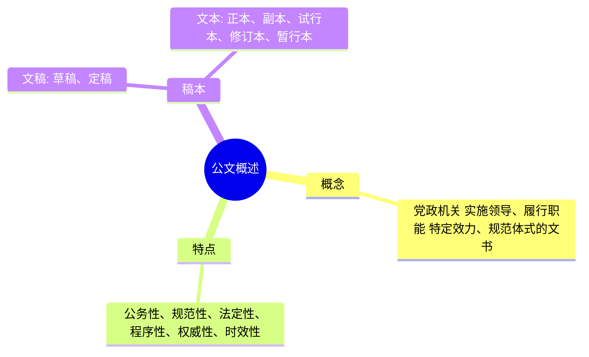
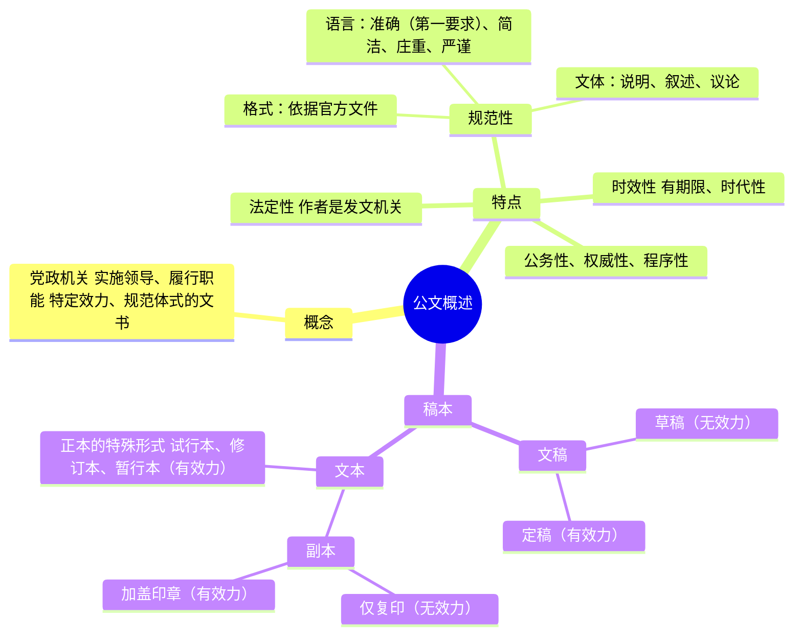
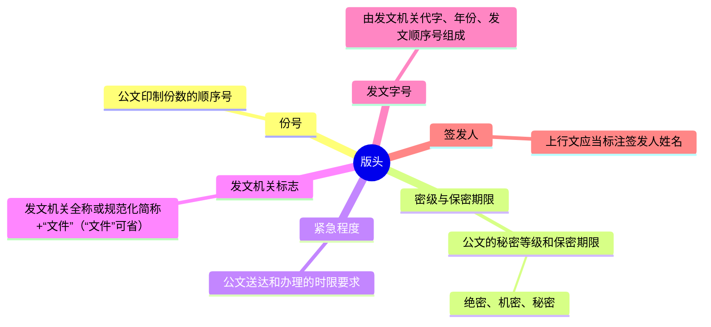
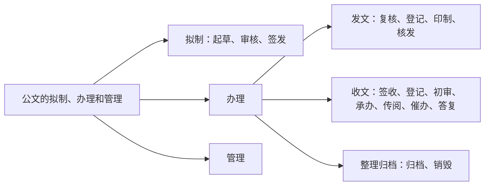

# 第六篇 　公文知识

考生在做公文题时，存在两种情况：一种是由于未曾接触过公文理论知识，做题时只能靠猜测；还有一种是有工作经验且接触过公文的，会按照实际工作经验来做题，但在实际工作中有些公文处理的做法是错误的，并没有按照官方文件规定执行。这两种做法都是不可取的。考生在做题时一定要运用官方针对公文的相关规定来解题，如《党政机关公文处理工作条例》和《党政机关公文格式》国家标准（GB/T 9704—2012）等等。

## 第一章 　公文概述

### 第一节 　公文概述

**考情分析**
在公共基础知识的考试中，本章内容的考查概率较低，考点主要集中在公文的特点、公文的文稿上，考生要对这两个考点充分复习。

**本章框架**



**知识内容**

#### 一、公文的概念
2012年《党政机关公文处理工作条例》第三条规定：“党政机关公文是党政机关实施领导、履行职能、处理公务的具有特定效力和规范体式的文书，是传达贯彻党和国家的方针政策，公布法规和规章，指导、布置和商洽工作，请示和答复问题，报告、通报和交流情况等的重要工具。”

公文是具有特定效力和规范体式的文书，具体含义如下：
（1）特定效力，是指公文是党政机关发出的，所以代表了机关的职责和职能。如果公文里有需要遵守的事项，收文单位需要遵守。
（2）规范体式，是指公文的格式是有严格规范的。根据《党政机关公文格式》国家标准（GB/T 9704—2012）的规定，公文格式全国统一。

#### 二、公文的特点
（1）公务性：涉及的内容是公共事务。

（2）规范性：格式、语言、文体等要规范。
（3）法定性：作者法定。
（4）程序性：发文、收文要遵循流程。
（5）权威性：党政机关在职权范围内发文，下级机关不能拒不执行。
（6）时效性：公文的作用有期限，内容具有时代性。

**名师解读**
（1）当题目问“以下属于公文特点的有哪些”，此时选项中涉及以上六大特点或者其同义词的都应该入选。
（2）“规范性”，需要从三方面去理解：一是公文的格式要规范，公文格式要严格依据官方文件；二是公文的语言表达要规范，公文语言要做到准确、简洁、庄重、严谨、平实等；三是公文的表达方式要规范，写公文可以使用叙述、说明和议论这三种表达方式。
（3）“法定性”，指的是公文作者是法定的，这里的作者一般指的是发文机关。像撰稿人、撰写人、秘书等在考试中如果出现，不能作为公文作者，他们只是机关单位负责起草公文的工作人员。
（4）“权威性”，也被称为“强制性”，公文是具有特定效力的，公文中有需要遵守的内容，收文单位必须遵守，这就体现了权威性。
（5）“时效性”，是指公文的作用是有期限的，而且公文写作在内容上要与时俱进。

#### 三、公文的稿本
**（一）文稿**

1. 草稿
公文在起草过程中形成的稿件。
2. 定稿
草稿审核无误，经负责人审批签发的即为定稿。

**（二）文本**

1. 正本
具有法定效力的正式文本，根据定稿制作，内容与定稿一致。

2. 副本
再现公文正本内容及全部或者部分外形特征的公文复制本或者复印本。
3. 试行本
在规定的试行期间推行的，具有正式公文效力的特殊文本。试行本在试行期满之后可能会予以修订，并最终形成正式的文本。
4. 修订本
已经发布生效的公文，经实践检验重新予以修订，修订补充之后再发布的文本。
5. 暂行本
暂时推行的，在规定期限内暂时试行的，具有正式公文效力的公文文本。

####  考点清单
考点1——公文常用的表达方式有叙述、说明、议论，注意没有描写和抒情。
考点2——公文语言表达具体有哪些要求？
公文的语言表达要规范，要求有很多，如准确、简洁、庄重、严谨、平实等。考试出现这些词语的同义词或近义词都应当选。需要注意的是，其中第一要求是准确。
考点3——正本的特殊形式有试行本、修订本、暂行本，因为过了相应的期限，它们是有可以转成正本正式实施的，因此被称为正本的特殊形式。
\* 易混易错——在公文的稿本中，要区分不同稿本的效力问题：
草稿是在起草过程中形成的，无效力；定稿已经负责人审批签发，有效力；正本是正式实施的文本，有效力；副本加盖复制（复印）机关印章后有效力；试行本、修订本、暂行本也具有效力。

####  真题再现
1.（单选）公文区别于其他文章的主要特点是（　　）。
A. 公文形成的主体是国家机关及其他社会组织
B. 公文形成的条件是行使职权和实施管理
C. 公文是办理公务的重要工具之一
D. 公文是具有法定效用与规范格式的文件
【答案】D

【解析】本题考查公文的基本知识。
《党政机关公文处理工作条例》第三条规定：“党政机关公文是党政机关实施领导、履行职能、处理公务的具有特定效力和规范体式的文书，是传达贯彻党和国家的方针政策，公布法规和规章，指导、布置和商洽工作，请示和答复问题，报告、通报和交流情况等的重要工具。”题目中四个选项都是公文区别于其他文章的特点，但是最主要的区别是公文的法定效用和规范格式。
故正确答案为D。

2.（单选）公文的作者是指（　　）。
A. 撰拟文章的相关工作人员
B. 制发文件的机关
C. 审核签发文件的机关工作人员
D. 参与文件形成过程的全体机关工作人员
【答案】B
【解析】本题考查公文的基本知识。
公文的作者是指发文机关，是依据宪法和其他有关法律、章程、决定成立的并能以自己的名义行使法定的职能权力和担负一定的任务、义务的机关、组织或代表机关、组织的领导人。因此B项正确，A、C、D三项错误。
故正确答案为B。

3.（单选）公文的语言应符合（　　）的要求。
A. 准确、简练、严谨、朴素　　B. 精练、夸张、生动、华丽
C. 累赘、鲜明、朴素、准确　　D. 简练、庄重、繁复、朴素
【答案】A
【解析】本题考查公文的基本知识。
《党政机关公文处理工作条例》第十九条规定：“公文起草应当做到：……（三）内容简洁，主题突出，观点鲜明，结构严谨，表述准确，文字精练。”因此A项正确，B、C、D三项错误。
故正确答案为A。

4.（多选）规范性公文正本的特殊形式是（　　）。
A. 副本　　B. 修订本
C. 暂行本　　D. 试行本
【答案】BCD
【解析】规范性公文正本的特殊形式包括试行本、暂行本、修订本，它们都跟正本一样具有法定效力，不同之处是有自己的特殊情况，比如特殊的适用范围或者应对情况等。
故正确答案为BCD。

####  本章导图


<!-- page: 7 -->

## 第二章 　公文的格式
根据《党政机关公文处理工作条例》第九条的规定，公文一般由份号、密级和保密期限、紧急程度、发文机关标志、发文字号、签发人、标题、主送机关、正文、附件说明、发文机关署名、成文日期、印章、附注、附件、抄送机关、印发机关和印发日期、页码等组成。

根据《党政机关公文格式》的规定，公文用纸采用GB/T 148中规定的A4型纸。如无特殊说明，公文格式各要素一般用3号仿宋体字，每面排22行，每行排28个字，并撑满版心，特定情况可以作适当调整。《党政机关公文格式》将版心内的公文格式各要素划分为版头、主体和版记三部分。公文首页红色分隔线以上的部分称为版头；公文首页红色分隔线（不含）以下、公文末页首条分隔线（不含）以上的部分称为主体；公文末页首条分隔线以下、末条分隔线以上的部分称为版记。页码位于版心外。

### 第一节 　公文的版头

**考情分析**
在公共基础知识的考试中，本节内容的考查概率较高，考点主要集中在发文机关标志、发文字号以及签发人这三个要素上，考生对这三个要素要充分复习。

#### 本节框架


<!-- page: 8 -->

#**知识内容**
公文首页红色分隔线以上的部分称为版头。

#### 一、份号
（1）份号是指公文印制份数的顺序号。涉密公文应当标注份号。
（2）如需标注份号，一般用6位3号阿拉伯数字，顶格编排在版心左上角第一行。份号由6位阿拉伯数字组成，在不够6位的情况下前面加0补位，构成6位数，如份号为100，则应写成“000100”。

#**名师解读**
涉密公文在版头中标注份号，有利于掌握公文的分发去向，提高公文管理的效率。

#### 二、密级和保密期限
**1. 公文的秘密等级和保密期限**

涉密公文应当根据涉密程度分别标注“绝密”“机密”“秘密”和保密期限。
（1）绝密公文：绝密公文中含有最重要、非常重要、特别重要的保密事项，如果泄露会给国家带来最严重、非常严重、特别严重的损害。
（2）机密公文：机密公文中含有重要的保密事项，如果泄露会给国家带来严重的损害。
（3）秘密公文：秘密公文中含有一般的保密事项，如果泄露会给国家带来一般的损害。

**2. 格式**

如需标注密级和保密期限，一般用3号黑体字，顶格编排在版心左上角第二行；保密期限中的数字用阿拉伯数字标注。

#**名师解读**
保密期限：保密期限是对公文密级时效的规定。公文如果规定保密期限，则密级与保密期限中间用黑色实心五角星连接。如果不规定保密期限，则绝密公文最高默认保密期限是30年，机密公文最高默认保密期限是20年，秘密公文最高默认保密期限是10年。

<!-- page: 9 -->

#### 三、紧急程度
（1）紧急程度是指公文送达和办理的时限要求。根据紧急程度，紧急公文应当分别标注“特急”“加急”，电报应当分别标注“特提”“特急”“加急”“平急”。
（2）如需标注紧急程度，一般用3号黑体字，顶格编排在版心左上角。
（3）如需同时标注份号、密级和保密期限、紧急程度，按照份号、密级和保密期限、紧急程度的顺序自上而下分行排列。

#**名师解读**
电报紧急程度中的“特提”，指的是这份电报的内容需要立即、刻不容缓地进行处理。

#### 四、发文机关标志
（1）发文机关标志由发文机关全称或者规范化简称加“文件”二字组成，也可以使用发文机关全称或者规范化简称，不加“文件”二字。
（2）联合行文时，发文机关标志可以并用联合发文机关名称，也可以单独用主办机关名称。如需同时标注联署发文机关名称，一般应当将主办机关名称排列在前；如有“文件”二字，应当置于发文机关名称右侧，以联署发文机关名称为准上下居中排布。
（3）发文机关标志居中排布，上边缘至版心上边缘为35mm，推荐使用小标宋体字，颜色为红色，以醒目、美观、庄重为原则。

#**名师解读**
（1）发文机关标志写的是发文机关的全称或规范化简称加“文件”二字（“文件”二字可以省略）。比如“中国共产党中央委员会”是全称，规范化简称是“中共中央”，写发文机关的全称或规范化简称都可以。
（2）根据《党政机关公文处理工作条例》的规定，多个机关联合行文，发文机关标志有两种写法：①把所有的发文机关全部写上，主办机关名称写在前面，协办机关名称写在后面，如安徽省教育厅、安徽省财政厅、安徽省公安厅联合行文，其中安徽省教育厅是主办机关，则把它排在第一位，其余机关依次向后写即可。②只写主办机关名称。

（3）发文机关标志的颜色为红色。公文俗称“红头文件”，就是因为“发文机关标志”的颜色是红色。

#### 五、发文字号
（1）发文字号由发文机关代字、年份、发文顺序号组成。联合行文时，使用主办机关的发文字号。
（2）发文字号编排在发文机关标志下空二行位置，居中排布。年份、发文顺序号用阿拉伯数字标注；年份应标全称，用六角括号“〔 〕”括入；发文顺序号不加“第”字，不编虚位（即1不编为01），在阿拉伯数字后加“号”字。
（3）上行文的发文字号居左空一字编排，与最后一个签发人姓名处在同一行。

#**名师解读**
（1）发文字号由发文机关代字、年份、发文顺序号组成。如“国发〔2020〕2号”，其中“国发”为国务院的机关代字，表示国务院发公文，由于我国机关较多，考试时一般不在此处设题；“〔2020〕”是年份，要写全四位阿拉伯数字，外面用六角括号，使用小括号、中括号等其他符号都不正确；“2号”是顺序号，发文机关每年要发很多公文，第一次发文顺序号是“1号”，第二次是“2号”，依次按顺序向后排列即可，顺序号前不加“第”和“0”。
（2）一篇公文只有一个发文字号，多个机关联合行文发文字号也只有一个，用主办机关的发文字号。
（3）下级机关给上级机关发公文叫作上行文，由于上行文需要在版头中标注签发人姓名，所以在排列上行文发文字号的时候要居左空一字编排。如果是上级机关发给下级机关的下行文或者是同级机关之间发的平行文，则版头不需要标注签发人姓名，发文字号居中排布。

#### 六、签发人
（1）上行文应当标注签发人姓名。由“签发人”三字加全角冒号和签发人姓名组成，居右空一字，编排在发文机关标志下空二行位置。“签发人”三字用3号仿宋体字，签发人姓名用3号楷体字。

(2) 如有多个签发人，签发人姓名按照发文机关的排列顺序从左到右、自上而下依次均匀编排，一般每行排两个姓名；回行时，与上一行第一个签发人姓名对齐。

#### 名师解读
> 不是所有公文都需要在版头中标注签发人姓名，只有上行文在版头标注签发人姓名（如“签发人：×××”），签发人通常是机关单位的负责人。下行文和平行文不需要在版头中标注签发人姓名。

#### 考点清单

**考点1——所有公文都要在版头中标注份号吗？**
并不是，《党政机关公文处理工作条例》明确规定，涉密公文应当在版头处标注份号。

**考点2——发文机关标志由发文机关全称或者规范化简称加“文件”二字组成，“文件”二字是否可以省略？**
可以，发文机关标志可以使用发文机关全称或者规范化简称，即省略“文件”二字。

**考点3——发文机关标志一共有两种写法，如果题目表述为“联合发文时，发文机关标志必须把所有机关名称都写上”，那么这种表述是错误的，因为也可以只写主办机关的名称。**
**考点4——一份公文只有一个发文字号，即便是联合行文，这份公文也只有一个发文字号，用的是主办机关的发文字号。**

**考点5——发文字号中的年份及发文顺序号的正确写法需要注意，年份外加六角括号，即“〔 〕”，考试中经常出现的“( )”“【 】”等都是错误写法；发文顺序号前不加“第”字，不编虚位（即1不编为01），在阿拉伯数字后加“号”字。**

**考点6——所有公文都要在版头中标注签发人姓名吗？**
并不是，根据《党政机关公文处理工作条例》，上行文应当在版头处标注签发人姓名。

\* 易混易错——电报和公文的紧急程度划分不同：电报的紧急程度是特提、特急、加急、平急，公文的紧急程度只有特急、加急。

#### 真题再现
1. (多选) 涉密文件分为( )。
A. 绝密文件
B. 秘密文件
C. 机密文件
D. 普通文件
【答案】ABC
【解析】涉密文件的密级包括秘密、机密、绝密。①若公文中含有一般的保密事项，泄露后会给国家带来一般损害，为秘密公文。②若公文中含有重要的保密事项，泄露后会给国家带来严重损害，为机密公文。③若公文中含有最重要、非常重要、特别重要的保密事项，如果泄露会给国家带来最严重、非常严重、特别严重的损害，为绝密公文。
故正确答案为ABC。

2. (单选) 下列不属于电报公文加注的紧急程度的是( )。
A. 平急
B. 紧急
C. 特急
D. 特提
【答案】B
【解析】《党政机关公文处理工作条例》第九条第三项规定：“紧急程度。公文送达和办理的时限要求。根据紧急程度，紧急公文应当分别标注‘特急’‘加急’，电报应当分别标注‘特提’‘特急’‘加急’‘平急’。”因此，B项不属于，A、C、D三项均属于。
本题为选非题，故正确答案为B。

3. (单选) 山西省人民政府在2018年就应对空气重污染采取临时交通管理措施发文，其发文字号书写正确的是( )。
A. 晋政(2018)15号
B. 晋政〔2018〕15号
C. 晋政〔2018〕第15号
D. 晋政〔2018年〕15号
【答案】B
【解析】《党政机关公文格式》规定：“7.2.5 发文字号：编排在发文机关标志下空二行位置，居中排布。年份、发文顺序号用阿拉伯数字标注；年份应标全称，用六角括号‘〔 〕’括入；发文顺序号不加‘第’字，不编虚位（即1不编为01），在阿拉伯数字后加‘号’字。上行文的发文字号居左空一字编排，与最后一个签发人姓名处在同一行。”

A项错误，年份应用六角括号“〔 〕”括入。
B项正确，符合发文字号相关要求。
C项错误，发文顺序号不加“第”字。
D项错误，年份应标全称，用六角括号“〔 〕”括入，六角括号内不加“年”字。
故正确答案为B。

4. (单选) 公文中需要标注签发人的是( )。
A. 上行文
B. 平行文
C. 下行文
D. 各种行文
【答案】A
【解析】《党政机关公文处理工作条例》第九条第六项规定：“签发人。上行文应当标注签发人姓名。”
故正确答案为A。

#### 本节导图
```
版头
├─ 份号：涉密公文标注，用6位阿拉伯数字（如：000001）
├─ 密级与保密期限
│  ├─ 绝密：含有最重要的保密事项，泄露带来最严重的损害
│  ├─ 机密：含有重要的保密事项，泄露带来严重的损害
│  └─ 秘密：含有一般的保密事项，泄露带来一般的损害
├─ 紧急程度
│  ├─ 公文：特急、加急
│  └─ 电报：特提、特急、加急、平急
├─ 发文机关标志
│  ├─ 发文机关全称或规范化简称+“文件”（“文件”可省）
│  └─ 联合行文
│     ├─ 全写：主办在前、协办在后
│     └─ 只写主办机关
├─ 发文字号
│  ├─ 组成
│  │  ├─ 机关代字
│  │  ├─ 年份：标4位数字，用六角括号
│  │  └─ 顺序号：号前不加“第”和“0”
│  └─ 只有一个，联合行文用主办机关的
└─ 签发人：上行文在版头标注签发人姓名
```

### 第二节 公文的主体

**考情分析**
在公共基础知识的考试中，本节内容的考查概率较高，考点主要集中在公文的标题、正文、落款等格式要素上，考生对这些要素要充分复习。

**本节框架**

*   **主体**
    *   标题
        *   发文机关+事由+文种
    *   主送机关
        *   公文的主要受理机关
    *   正文
        *   用来表述公文的内容
    *   附件说明
        *   公文附件的顺序号和名称
    *   落款
        *   发文机关署名
        *   成文日期
        *   印章
    *   附注
        *   公文印发传达范围等需要说明的事项
    *   附件
        *   公文正文的说明、补充或参考资料

#**知识内容**
公文首页红色分隔线（不含）以下、公文末页首条分隔线（不含）以上的部分称为主体。公文的主体包括标题、主送机关、正文等几部分。

#### 一、标题
（1）标题由发文机关名称、事由和文种组成。如“国务院关于开展第七次全国人口普查的通知”，其中“国务院”是发文机关，“开展第七次全国人口普查”是事由，“通知”是文种。

（2）标题一般用2号小标宋体字，编排于红色分隔线下空二行位置，分一行或多行居中排布；回行时，要做到词意完整、排列对称、长短适宜、间距恰当，标题排列应当使用梯形或菱形。

**名师解读**

1. 实际工作中有些公文标题中的发文机关和事由可以酌情省略，如“关于××××××××的通知”“公告”。唯独文种一定不能省略。
2. 公文的标题过长可以拆行写，拆行注意可以排列成梯形或菱形，即上短下长（下长上短）、上下短中间长都可以。而且回行时要做到词意完整，一个完整的词语不能拆到两行写，比如“农村工作会议”不可以拆成“农村工——作会议”。

#### 二、主送机关
1. 主送机关是公文的主要受理机关，应当使用机关全称、规范化简称或者同类型机关统称。
2. 主送机关编排于标题下空一行位置，居左顶格；回行时仍顶格，最后一个机关名称后标全角冒号。
3. 主送机关名称过多导致公文首页不能显示正文时，应当将主送机关名称移至版记。

**名师解读**

1. 主送机关是指对公文负有办理和答复责任的机关，顶格书写，写全称、规范化简称或者统称，后面标冒号。
2. 如果一份公文发给很多个机关，主送机关特别多，公文首页都写不完，此时不能翻到第二页继续写，因为公文首页必须出现正文。如果主送机关确实特别多，一页写不下，应当将主送机关名称移到版记中书写。
3. 主送机关中的同类型机关可以使用统称，统称就是给一些机关起一个统一的称呼，如省政府发公文给辖区内的各市政府和县政府，主送机关则可写成“各市、县人民政府”。

#### 三、正文
1. 正文用来表述公文的内容。公文首页必须显示正文。
2. 正文一般用3号仿宋体字，编排于主送机关名称下一行，每个自然段左空二字，回行顶格。文中结构层次序数依次可以用"一、""（一）""1.""（1）"标注；一般第一层用黑体字，第二层用楷体。

> **名师解读**
> 
> 正文层次序数用"一、""（一）""1.""（1）"标注。正文出现层次序数，则要按照这个顺序来写。前两个是汉字，分别加顿号和括号；后两个是阿拉伯数字，分别加点和括号，考试时常会考四个层次的先后顺序。

#### 四、附件说明

（1）附件说明指公文附件的顺序号和名称。
（2）如有附件，在正文下空一行左空二字编排"附件"二字，后标全角冒号和附件名称；如有多个附件，使用阿拉伯数字标注附件顺序号（如"附件:1.×××××"）；附件名称后不加标点符号。
（3）附件名称较长需回行时，应当与上一行附件名称的首字对齐。

> **名师解读**
> 
> 附件说明相当于附件的目录。只有一个附件时不用排序，即"附件：××××××××"。注意，附件名称后不加标点符号。

#### 五、发文机关署名

（1）发文机关署名署发文机关全称或者规范化简称。
（2）发文机关署名在成文日期之上、以成文日期为准居中编排。

#### 六、成文日期

（1）成文日期署会议通过或者发文机关负责人签发的日期。联合行文时，成文日期署最后签发机关负责人签发的日期。
（2）加盖印章的公文，成文日期一般右空四字编排。
（3）用阿拉伯数字（不能使用汉字数字）将年、月、日标全，年份应标全称，月、日不编虚位（即1不编为01）。

#### 七、印章

(1) 印章用红色，不得出现空白印章。公文中有发文机关署名的，应当加盖发文机关印章，并与署名机关相符。

(2) 单一机关行文时，一般在成文日期之上、以成文日期为准居中编排发文机关署名，印章端正、居中下压发文机关署名和成文日期，使发文机关署名和成文日期居印章中心偏下位置，印章顶端应当上距正文（或附件说明）一行之内。

(3) 联合行文时，一般将各发文机关署名按照发文机关顺序整齐排列在相应位置，并将印章一一对应、端正、居中下压发文机关署名，最后一个印章端正、居中下压发文机关署名和成文日期，印章之间排列整齐、互不相交或相切，每排印章两端不得超出版心，首排印章顶端应当上距正文（或附件说明）一行之内。

(4) 有特定发文机关标志的普发性公文和电报可以不加盖印章。

**名师解读**
(1) 印章的颜色都是红色，而且是圆章。印章的位置要做到上不压正文，下压成文日期。
(2) 联合行文时，一般将各发文机关署名按照发文机关顺序整齐排列在相应位置，并将印章一一对应、端正、居中下压发文机关署名，每个印章之间要有距离，不能相切、相交，一行最多可以排三个章，如果有多个章，依次向下排列就可以。
(3) 并非所有的公文都要盖章，电报、普发性公文不用盖章。

#### 八、附注

(1) 附注是公文印发传达范围等需要说明的事项。
(2) 如有附注，居左空二字加圆括号编排在成文日期下一行。

**名师解读**
附注写在成文日期的左下角，用来说明文件发放、传达范围等，如可以写“此件公开传达”“此件发至县团级”。

#### 九、附件

（1）附件是公文正文的说明、补充或者参考资料。

（2）附件应当另面编排，并在版记之前，与公文正文一起装订。“附件”二字及附件顺序号用3号黑体字顶格编排在版心左上角第一行。如附件与正文不能一起装订，应当在附件左上角第一行顶格编排公文的发文字号并在其后标注“附件”二字及附件顺序号。

#### 考点清单

**考点1**——公文标题由三部分组成：发文机关名称、事由和文种。文种是中心词，不可省略，其他部分可以视情况省略。

**考点2**——如果公文标题过长一行写不下，可以拆行写，回行要做到词意完整，标题可以排列成菱形、梯形，但是不能排列成长方形、正方形。

**考点3**——主送机关的排列原则：
（1）**先高后低**：主送机关中同时出现级别高和级别低的单位，如“各市、县人民政府”，先写级别高的单位“市”，后写级别低的单位“县”。
（2）**先外后内**：如果主送机关之间没有级别的高低之分，它们是同级，要遵循“先外后内”，先写关系远的，后写关系近的。如广东省人民政府给广东省各市政府和广东省政府各职能部门（省教育厅、公安厅、财政厅等厅级单位，统称省直各单位）发公文，由于各市政府和省直各单位都是省政府的直接下级，它俩是同级，要遵循“先外后内”，很明显省政府与省直各单位的关系更亲近，与市政府的关系稍远些，所以市政府排列在前面，省直各单位排列在后面，即写为“各市政府、省直各单位”。
（3）**党政军群**：主送机关中如果同时出现党的机关、政府的机关、军队、人民团体，此时按照“党政军群”的顺序排列即可。

**考点4**——公文正文中如果引用了其他公文，需要同时引用公文的标题和发文字号。先引用标题，后引用发文字号，如“根据《关于构成哄抬价格行为涨价幅度界定问题的意见》（鲁价调发〔2005〕65号）的要求”。

**考点5**——公文写到最后会涉及结尾用语问题，不同公文对结语的要求是不同的：
（1）下行文对结语没有硬性规定，可写可不写，如果写，通常是“特此”二字加文种，如“特此决定”“特此批复”等。

（2）平行文对结语也没有硬性规定，但一般出于礼貌会写。最典型的平行文为“函”，“函”的结语可以使用“特此函询”“特此函达”等。
（3）上行文必须写结语，其中最典型的是“请示”，可以写“妥否，请批复”“当否，请批示”等，要用征询、询问的语气。

\* 易混易错
（1）**附件说明和附件**：附件说明是公文附件的顺序号和名称，即附件的目录；附件是公文正文的说明、补充或者参考资料，即附件的具体内容。
（2）**主送机关和抄送机关**：主送机关对公文负有办理和答复的责任；抄送机关只需要对公文执行或者知晓即可，无须办理和答复。

 真题再现

1.（单选）下列选项中的公文标题，拟制正确的是（ ）。
A.关于开展抗洪救灾工作××县政府通知
B.××县人民政府对于开展抗洪救灾工作的通知
C.××县人民政府关于开展抗洪救灾工作的通知
D.××县人民政府开展抗洪救灾工作的通知

【答案】C
【解析】《党政机关公文处理工作条例》第九条第七项规定：“标题。由发文机关名称、事由和文种组成。”
A项错误，发文机关名称和事由顺序错误，应该是“发文机关+事由+文种”。
B项错误，在一般的公文标题中，“关于”两字常出现在发文机关名称之后、“事由”之前，用于引入“事由”，不使用“对于”。
C项正确，公文标题由发文机关名称、事由和文种组成，要素齐全。
D项错误，缺少引入“事由”的介词“关于”，语句表达不规范。
故正确答案为C。

2.（单选）联合行文时署（ ）签发的日期。
A.首个签发机关负责人
B.最后签发机关负责人
C.主办机关负责人
D.协办机关负责人

【答案】B

【解析】《党政机关公文处理工作条例》第九条第十二项规定：“成文日期。署会议通过或者发文机关负责人签发的日期。联合行文时，署最后签发机关负责人签发的日期。”
故正确答案为 B。

3.（单选）下列有关公文成文日期的写法中，正确的一项是（ ）。
A. 17年7月1日 B. 2017年7月1日
C. 2017年07月01日 D. 二〇一七年七月一日
【答案】B
【解析】《党政机关公文格式》规定：“7.3.5.4 成文日期中的数字：用阿拉伯数字将年、月、日标全，年份应标全称，月、日不编虚位（即1不编为01）。”因此，B项正确，A、C、D三项错误。
故正确答案为B。

4.（单选）公文的核心部分是主体，要体现公文中实质性的内容，下列各项中不属于公文主体部分要素的是（ ）。
A. 附件 B. 附注
C. 主送机关 D. 抄送机关
【答案】D
【解析】《党政机关公文格式》规定：“7.1 公文格式各要素的划分：本标准将版心内的公文格式各要素划分为版头、主体、版记三部分。公文首页红色分隔线以上的部分称为版头；公文首页红色分隔线（不含）以下、公文末页首条分隔线（不含）以上的部分称为主体；公文末页首条分隔线以下、末条分隔线以上的部分称为版记。”
A、B、C三项正确，公文主体部分的要素有标题、主送机关、正文、附件说明、发文机关署名、成文日期、印章、附注和附件。
D项错误，版记部分的要素有抄送机关、印发机关和印发日期。抄送机关属于版记，不属于主体。
本题为选非题，故正确答案为D。


#### 本节导图
**主体**

- **标题**
  发文机关+事由+文种（唯独文种一定不可省）
  一行写不下可拆多行写，排成梯形或菱形，回行做到词意完整
- **主送机关**
  机关全称、规范化简称，同类型机关的统称
  主送机关过多应移至版记，公文首页必须出现正文
  排列原则：先高后低、先外后内、党政军群
- **正文**
  层次序数：“一、”“（一）”“1.”“（1）”
  正文中引用其他公文：先引用标题，后引用发文字号
  结尾用语：
  - 请示：妥否，请批示
  - 函：特此函询/达
- **附件说明**
  顺序号：只有一个附件不需要写顺序号
  附件名称：附件名称后不加标点符号
- **落款**
  发文机关署名：发文机关全称、规范化简称，在日期之上居中写
  成文日期：
  - 右空4字，用阿拉伯数字标注年、月、日
  - 写会议通过或负责人签发日期
  印章：
  - 上不压正文、下压成文日期
  - 电报、普发性公文可以不盖章
- **附注**
  文件的发放、传达范围等
- **附件**
  公文正文的说明、补充或参考资料

---

### 第三节 公文的版记和页码

**考情分析**
在公共基础知识的考试中，本节内容的考查概率较低，考生简单了解即可。

**本节框架**

**版记和页码**

- **版记**
  - 抄送机关：除主送机关外需要执行或知晓公文内容的其他机关
  - 印发机关：公文的送印机关
  - 印发日期：公文的送印日期
- **页码**
  公文页数的顺序号

**知识内容**

公文末页首条分隔线以下、末条分隔线以上的部分称为版记。

#### 一、版记

1. 抄送机关
（1）除主送机关外需要执行或者知晓公文内容的其他机关，应当使用机关全称、规范化简称或者同类型机关统称。
（2）一般用4号仿宋体字，在印发机关和印发日期之上一行、左右各空一字编排。“抄送”二字后加全角冒号和抄送机关名称，回行时与冒号后的首字对齐，最后一个抄送机关名称后标句号。

**名师解读**
主送机关需要对公文负有办理和答复的责任，抄送机关只需要对公文执行或者知晓即可。

2. 印发机关和印发日期
印发机关和印发日期指的是公文的送印机关和送印日期。
印发机关和印发日期一般用4号仿宋体字，编排在末条分隔线之上，印发机关左空一字，印发日期右空一字，用阿拉伯数字将年、月、日标全，年份应标全称，月、日不编虚位（即1不编为01），后加“印发”二字。

**名师解读**
（1）印发机关通常是发文机关的办公厅（室），如××市人民政府发公文，其印发机关通常是××市人民政府办公室，若××省人民政府发公文则印发机关为××省人民政府办公厅。
（2）印发日期指的是公文的送印日期，公文哪天印发，印发日期就写哪天，印发日期在成文日期之后。

#### 二、页码

页码是指公文页数顺序号，一般用4号半角宋体阿拉伯数字，编排在公文版心下边缘之下，数字左右各放一条一字线；一字线上距版心下边缘7mm。单页码居右空一字，双页码居左空一字。

#### 考点清单
*易混易错——公文格式中的字体字号总结：
正文：3号仿宋体。
密级、紧急程度：3号黑体。
发文机关标志：小标宋体。
标题：2号小标宋体。
签发人姓名：3号楷体。
“签发人”三字：3号仿宋体。
抄送机关、印发机关和印发日期：4号仿宋体。

#### 真题再现
1.（单选）公文末页首条分隔线以下、末条分隔线以上的部分称为（ ）。
A. 版记
B. 附件
C. 抄送机关
D. 主送机关

**【答案】A**

**【解析】**本题考查公文的基本常识。
A项正确，公文版心内各要素划分为版头、主体、版记三部分。公文末页首条分隔线以下、末条分隔线以上的部分为版记部分。
B项错误，附件是公文正文的说明、补充或者参考资料。属于主体部分。
C项错误，抄送机关是除主送机关外需要执行或者知晓公文内容的其他机关，应当使用机关全称、规范化简称或者同类型机关统称。属于版记部分。
D项错误，主送机关是公文的主要受理机关，应当使用机关全称、规范化简称或者同类型机关统称。属于主体部分。
故正确答案为A。

2.（单选）公文格式分为三大部分，分别是（ ）。
A. 版记、主干、后记
B. 版头、主体、版记
C. 版主、主体、版记
D. 版头、主体、版心

**【答案】B**

**【解析】**公文的各要素分为版头、主体、版记三部分。
公文版头部分：公文首页红色分隔线以上的部分称为版头。版头包括：份号、密级和保密期限、紧急程度、发文机关标志、发文字号、签发人。
公文主体部分：公文首页红色分隔线（不含）以下、公文末页首条分隔线（不含）以上的部分称为主体。主体包括：标题、主送机关、正文、附件说明、发文机关署名、成文日期和印章、附注、附件。
公文版记部分：公文末页首条分隔线以下、末条分隔线以上的部分称为版记。版记包括：抄送机关、印发机关和印发日期。
故正确答案为B。

3.（单选）下列公文要素属于版记部分的是（ ）。
A. 印发日期
B. 附件
C. 附注
D. 成文日期

**【答案】A**

**【解析】**根据《党政机关公文格式》的规定，公文版记包括抄送机关、印发机关和印发日期。印发机关和印发日期编排在末条分隔线之上，印发机关左空1字，印发日期右空1字，用4号仿宋体字排印。印发日期用阿拉伯数字，年份不能简写。
故正确答案为A。

4.（单选）在公文规范中，除主送机关外需要执行或者知晓公文内容的其他机关被称为（ ）。
A. 抄送机关
B. 相关机关
C. 印发机关
D. 执行机关

**【答案】A**

**【解析】**本题考查公文的基本知识。
《党政机关公文处理工作条例》第九条第十六项规定：“抄送机关。除主送机关外需要执行或者知晓公文内容的其他机关，应当使用机关全称、规范化简称或者同类型机关统称。”
故正确答案为A。

5.（单选）下面关于公文的页码说法错误的是（ ）。
A. 公文的附件与正文一起装订时，页码应当连续编排
B. 页码一般用4号半角宋体阿拉伯数字
C. 单页码居左空一字，双页码居右空一字
D. 页码要编排在公文版心下边缘之下，数字左右各放一条一字线

**【答案】C**

**【解析】**A项正确，根据《党政机关公文格式》有关“页码”的规定，公文的附件与正文一起装订时，页码应当连续编排。
B项正确，根据《党政机关公文格式》有关“页码”的规定，页码一般用4号半角宋体阿拉伯数字。
C项错误，根据《党政机关公文格式》有关“页码”的规定，单页码居右空一字，双页码居左空一字。
D项正确，根据《党政机关公文格式》有关“页码”的规定，页码编排在公文版心下边缘之下，数字左右各放一条一字线，一字线上距版心下边缘7mm。
本题为选非题，故正确答案为C。

#### 本节导图
**版记和页码**

- **版记**
  - 抄送机关：
    - 除主送机关外需要执行或知晓公文内容的其他机关
    - 使用机关全称、规范化简称或同类型机关统称
    - 4号仿宋体字书写，“抄送”二字后加全角冒号和抄送机关名称
  - 印发机关：
    - 公文的送印机关
    - 左空一字
  - 印发日期：
    - 公文的送印日期
    - 右空一字，阿拉伯数字标全年、月、日，后加“印发”二字
- **页码**
  - 公文页数的顺序号
  - 单页码居右空一字，双页码居左空一字

#### 拓展阅读
以下为公文格式示意图，供考生直观感受公文格式：

-->

## 第三章 公文的种类

### 第一节 法定公文文种

**考情分析**
在公共基础知识的考试中，本节内容的考查概率较高，考点主要集中在法定公文文种的适用范围上，考生对这一板块要充分复习。

**本节框架**

法定公文文种包含：决议、决定、命令、公报、公告、通告、意见、通知、通报、报告、请示、批复、议案、函、纪要

**知识内容**

#### 一、决议
决议适用于会议讨论通过的重大决策事项。

**名师解读**
记忆关键词“会议讨论”。决议是与会议相关的公文，一定是会议讨论通过的重大决策事项。例如：中国共产党第十九次全国代表大会关于《中国共产党章程（修正案）》的决议，这份决议是2017年10月24日中国共产党第十九次全国代表大会通过的。

#### 二、决定
决定适用于对重要事项作出决策和部署、奖惩有关单位和人员、变更或者撤销下级机关不适当的决定事项。
（1）对重要事项作出决策和部署，如2014年发布的《中共中央关于全面推进依法治国若干重大问题的决定》，这份决定就是在对“依法治国”这一重要事项作出决策和部署。

<!-- page: 28 -->

（2）奖惩有关单位和人员，如2020年1月发布的《国务院关于2019年度国家科学技术奖励的决定》，这份决定主要用于奖励有关单位和人员。
（3）变更或者撤销下级机关不适当的决定事项，如××市政府发了一份公文，其上级机关××省政府认为××市政府公文中的一些决定事项不妥，于是××省政府发了一篇公文来撤销××市政府的不适当决定，此时××省政府发的公文就是“决定”这一文种。

#### 三、命令（令）
命令（令）适用于公布行政法规和规章、宣布施行重大强制性措施、批准授予和晋升衔级、嘉奖有关单位和人员。
（1）公布行政法规和规章：可以用命令文种来公布一些法规和规章，如习近平主席签署命令，发布《军事立法工作条例》。
（2）宣布施行重大强制性措施：如禁酒令、禁塑令等。
（3）批准授予和晋升衔级：多在军队系统使用，如在军队晋升军衔用命令。
（4）嘉奖有关单位和人员：嘉奖令，如广东省公安厅颁布的《关于给揭阳市公安机关全力做好高考安保工作确保社会安全稳定的嘉奖令》。

**名师解读**
在法定公文的15个文种中，命令是强制性色彩最浓厚的文种。例如主席令、国务院令、嘉奖令、禁塑令、禁酒令，其中的“令”指的都是“命令”这一文种。

#### 四、公报
公报适用于公布重要决定或者重大事项。
公报即向社会公开报道重要决定或者重大事项，多公开见诸报端。如《中华人民共和国和美利坚合众国关于建立外交关系的联合公报》《中国共产党第十八届中央委员会第五次全体会议公报》，这些公报涉及的事项一经公开报道，会在全社会引发热议，具有新闻性、报道性的特点。

<!-- page: 29 -->

#### 五、公告
公告适用于向国内外宣布重要事项或者法定事项。
（1）公告的适用范围为“国内外”，告知的范围大。
（2）适用于向国内外宣布重要事项或者法定事项。
①重要事项：2020年清明节为表达全国各族人民对抗击新冠肺炎疫情斗争牺牲烈士和逝世同胞的深切哀悼，4月4日举行了全国性哀悼活动，全国停止公共娱乐活动，当日10时起全国人民默哀3分钟，此为国务院宣布重要事项，发的即为“公告”文种。
②法定事项：比如参加事业单位考试，人事考试部门会发布招考公告，此为宣布法定事项。

#### 六、通告
通告适用于在一定范围内公布应当遵守或者周知的事项。

**名师解读**
通告的适用范围记忆关键词“一定范围内”，相较于公告，其告知范围小。
例如：××市要修路，两条街道临时封锁，需发公文告知老百姓，发的则是“通告”文种，告知对象是对这两条街有出行需求的人，属于一定范围内告知。

#### 七、意见
意见适用于对重要问题提出见解和处理办法。

**名师解读**
在实际工作中，机关单位是可以互相提意见的，如××市人民政府可以给其直接上级××省人民政府提意见，××市人民政府也可以给其同级邻市政府提意见，也可以给其下级××县人民政府提意见。意见可以给上级、同级、下级发，行文具有多向性。

#### 八、通知
通知适用于发布、传达要求下级机关执行和有关单位周知或者执行的事项，批转、转发公文。

<!-- page: 30 -->

（1）由于通知的使用频率高，又被称为“公文之王”“公文中的轻骑兵”。
（2）通知侧重于传达要求下级机关执行的事项，如《国务院关于开展第七次全国人口普查的通知》主送各省人民政府，这就是国务院要求其下级机关各省政府去执行人口普查这件事，因此发的是“通知”文种。
（3）通知除了可以要求下级机关执行某件事，还可以用来发布要求有关单位周知或者执行的事项，如《国务院办公厅关于2019年部分节假日安排的通知》主送各省、自治区、直辖市人民政府，这篇公文就属于用通知来发布有关单位周知的事项。
（4）通知还可用于批转、转发公文，在考试中遇到题干说批转、转发公文，直接选择“通知”文种即可，如《国务院办公厅转发国家发展改革委关于深化公共资源交易平台整合共享指导意见的通知》。

#### 九、通报
通报适用于表彰先进、批评错误、传达重要精神和告知重要情况。

**名师解读**
通报包括表彰性通报、批评性通报、情况通报。无论是哪种通报，都是通过描述一个典型事件（好人好事、灾情警情等），对接收到公文的机关单位或公民个人起到教育和说理的作用。

#### 十、报告
报告适用于向上级机关汇报工作、反映情况，回复上级机关的询问。例如，劳动部《关于实施再就业工程的报告》。

#### 十一、请示
请示适用于向上级机关请求指示、批准。例如，《公安部关于申请设立“中国人民警察节”的请示》。

**名师解读**
注意：请示不可“先斩后奏”，必须事前请示。而且请示具有期复性，即期待上级的答复，上级如果不批复，下一步工作则无法开展。

<!-- page: 31 -->

#### 十二、批复
批复适用于答复下级机关请示事项。
批复是针对请示写的，批复是被动行文，下级不写请示上级不能批复。

#### 十三、议案
议案适用于各级人民政府按照法律程序向同级人民代表大会或者人民代表大会常务委员会提请审议事项。例如，××省人民政府提议案应提给××省人大或××省人大常委会，若是××市人民政府提议案则提给××市人大或××市人大常委会。

#### 十四、函
函适用于不相隶属机关之间商洽工作、询问和答复问题、请求批准和答复审批事项。

> **名师解读**
> 记忆关键词“不相隶属机关”。“不相隶属”简单理解即发文机关和收文机关之间非上下级关系。如××市公安局与××市纪委商洽工作，两个机关中一个是政府的机关，一个是党的机关，是不相隶属关系，此时就可以发函来商洽工作。

#### 十五、纪要
纪要适用于记载会议主要情况和议定事项，属记录性质公文。如果写纪要，不需要全面如实地记载会议的所有情况，只需要记载会议的主要情况即可。

#### 考点清单
考点1——公文中可以用于奖励的文种有决定、命令、通报，可用于惩罚的文种有决定、通报。注意：决定和通报既可以用于奖励，也可以用于惩罚，而命令只可以用于嘉奖。
考点2——在法定公文的15个文种中，命令的强制性色彩最为浓厚。
考点3——公报适用于公布重要决定或者重大事项，具有新闻性、报道性。
考点4——“公文之王”“公文中的轻骑兵”指的文种是通知。
考点5——通报具有鲜明的教育性、说理性。
考点6——报告和请示都是下级发给上级的，所以都是上行文。

<!-- page: 32 -->

考点7——批复是针对请示写的，批复是被动行文，下级不写请示上级则不能批复。

#### * 易混易错

**1. 通告、通知、通报的区别**

(1) 适用范围不同：通告适用于在一定范围内公布应当遵守或者周知的事项；通知适用于发布、传达要求下级机关执行和有关单位周知或执行的事项，批转、转发公文；通报适用于表彰先进、批评错误、传达重要精神和告知重要情况。
(2) 发文目的不同：通告对一定范围内的组织或群众有直接的、具体的约束力，即禁止你做什么；通知侧重于未来工作的部署和安排，即要求你做什么；通报的指示性、宣传教育性更明显，没有工作的具体部署与安排，即教育你应该做什么。
(3) 告知对象不同：通告需一定范围内的相关组织和人员知晓；通知多有具体的收文单位，它所告知的对象是有限的；通报常需明确标注主送机关。
(4) 事项发生时间不同：通告是告知未发生事项；通知是通知未来事项；通报是通报已发生事项。

**2. 公告和通告的区别**

(1) 适用范围不同：公告适用于向国内外宣布重要事项或者法定事项；通告适用于在一定范围内公布应当遵守或者周知的事项。
(2) 涉及内容不同：公告主要是告知重要消息，除特例外不涉及强制性的执行要求；通告常涉及有关人员应遵循的事项，有具体细致的行为规范和对公文具体如何遵守的要求。

**3. 命令、决定、通报的区别**

(1) 适用范围不同：命令适用于公布行政法规和规章、宣布施行重大强制性措施、批准授予和晋升衔级、嘉奖有关单位和人员；决定适用于对重要事项作出决策和部署、奖惩有关单位和人员、变更或者撤销下级机关不适当的决定事项；通报适用于表彰先进、批评错误、传达重要精神和告知重要情况。
(2) 功能不同：命令仅用于表彰；决定和通报既可用于表彰，也可用于惩罚。
(3) 发文级别不同：嘉奖令的发文机关的级别限制最为明显，就行政系统来说，一般为国务院、国务院所属各部委及各直属机构等；决定、通报是各级行政机关、部门都可使用的文种。
(4) 奖惩对象典型程度不同：嘉奖令的嘉奖对象往往是在特别重大的任务中，或在一些危急、艰险的情况下有特别卓越的表现或杰出的贡献的主体；决定在用于奖惩

时，也主要以当事者主体因素为依据，此外往往还需符合某种奖惩规定；通报，其受表彰、批评的对象除了要符合某种奖惩规定外，更为重要的是要考虑其在社会范围内所起到的宣传教育作用或警示作用。

**4. 报告和请示的区别**

(1) 适用范围不同：报告适用于向上级机关汇报工作、反映情况，回复上级机关的询问；请示适用于向上级机关请求指示、批准。
(2) 写作目的和作用不同：报告是向上级汇报工作、反映情况、提出问题和建议，不一定要求上级答复；请示是就某一个问题请示上级机关，希望能够给予指示、批准，并需要上级批复。
(3) 写作时间不同：报告无要求，事前、事中、事后均可；请示要求写在事前。
(4) 写作事项的要求不同：报告可以一事一报，也可以多事一报，无具体限制；请示则要求一文一事。
(5) 结语不同：报告一般用“特此报告”等；请示一般用“当否，请批示”等。

#### 真题再现
1. (单选)下列选项中，必须通过会议产生的文种是(    )。
A. 决议 B. 通知
C. 请示 D. 函
【答案】A
【解析】本题考查公文常识。
A项正确，决议是指经会议讨论通过并要求进行贯彻执行的重要指导性公文。一般具有权威性和指导性。
B项错误，通知是运用广泛的知照性公文，用来发布法规、规章，转发上级机关、同级机关和不相隶属机关的公文，批转下级机关的公文，要求下级机关办理某项事务等。
C项错误，请示是适用于向上级请求指示、批准的公文，属于上行文。
D项错误，函是不相隶属机关之间相互商洽工作、询问和答复问题，或者向有关主管部门请求批准事项时所使用的公文。
故正确答案为A。

2. (单选)公安局拟发文严禁赌博活动，应选(    )行文。
A. 通知 B. 通告
C. 公告 D. 命令

【答案】B
【解析】本题考查公文常识，主要考查公文文种的有关知识点。
选择公文文种的依据主要有三个方面：一是发文机关与主要受文者间的工作关系；二是发文机关的法定或规定权限；三是行文目的、行文要求和表现公文主题的需要。
A项错误，通知适用于发布、传达要求下级机关执行和有关单位周知或者执行的事项，批转、转发公文。严禁赌博活动并非仅针对下级机关或有关单位，而是面向全社会的。
B项正确，通告适用于在一定范围内公布应当遵守或者周知的事项。公安局发文严禁赌博活动面向的是辖区群众，所以应用通告文种。
C项错误，公告适用于向国内外宣布重要事项或者法定事项。
D项错误，命令适用于公布行政法规和规章、宣布施行重大强制性措施、批准授予和晋升衔级、嘉奖有关单位和人员。
故正确答案为B。

3. (单选)根据气象部门的最新消息，新一轮的台风本周内将登陆我国东部沿海。为了充分做好抗台防洪工作，某地政府紧急召开会议，要求各部门、各单位积极准备、全力投入，最大限度地减少台风暴雨对人民群众生命财产造成的损失。若你是该地政府办公室的一名职员，现将政府抗台防洪紧急会议精神以发文形式传达，则发文的文种应该为(    )。
A. 通知 B. 报告
C. 决定 D. 函
【答案】A
【解析】本题考查公文文种的相关知识。
题干要求从政府办公室角度向各部门、各单位传达会议精神，行文规则应为下行文。
A项正确，通知适用于发布、传达要求下级机关执行和有关单位周知或者执行的事项，批转、转发公文。通知一般是下行文，而本题描述的是传达上级机关的指示、发布要求下级机关办理和有关单位共同执行或者周知的事项，与题干要求相匹配。
B项错误，报告适用于向上级机关汇报工作、反映情况，回复上级机关的询问。报告为上行文，不能向各部门、各单位传达会议精神，与题干不匹配。
C项错误，决定适用于对重要事项作出决策和部署、奖惩有关单位和人员、变更或者撤销下级机关不适当的决定事项。决定是应用广泛的下行文。但题干所表述的并非重大事项的决策部署或者奖惩，因此不适用决定文种。
D项错误，函适用于不相隶属机关之间商洽工作、询问和答复问题、请求批准和答复审批事项。函属于公文中的平行文，用于平级机关之间，不能满足题干传达各部门、各单位周知或执行的要求。
故正确答案为A。

4. (多选)关于通报与通知的区别，下列说法正确的有(    )。
A. 通报的目的是引起读者的广泛注意和从中受到教育，而不着重要求予以具体办理和执行
B. 通报的事例典型、情况重要，具有较大影响
C. 通报是用来传达重要精神和情况的
D. 通知有主送单位，通报没有主送单位
【答案】ABC
【解析】本题考查公文的基本知识。
A、C两项正确，《党政机关公文处理工作条例》第八条第九项规定：“通报。适用于表彰先进、批评错误、传达重要精神和告知重要情况。”通报的目的主要是交流、了解情况，通过典型事例教育人们，宣传先进思想和事迹，引起读者广泛注意，让他们从中受到教育，并不着重要求予以具体办理和执行，而通知要求受文机关了解要办什么事，该怎样办理，要求遵照执行。
B项正确，通报的主要内容是表彰先进、批评错误和传达交流重要情况，而通知的内容主要是批转、转发公文，传达需要办理或周知的事项。
D项错误，主送单位是行文的主要对象，即要求主办和答复的单位，也就是对文件内容负有掌握、答复或贯彻执行责任的受文单位。除少数直接面向社会或本机关全体工作人员发布的文件外，公文一般均要注明主送机关。所以，通知和通报都有主送单位。
故正确答案为ABC。

5. (单选)某国有大型企业商请某市属高校举办营销培训班，应使用的文种是(    )。
A. 请示 B. 报告
C. 函 D. 意见

【答案】C
【解析】本题考查公文文种知识。
A项错误，请示适用于向上级机关请求指示、批准。国有企业和高校不是上下级关系。
B项错误，报告适用于向上级机关汇报工作、反映情况，回复上级机关的询问。国有企业和高校不是上下级关系。
C项正确，函适用于不相隶属机关之间商洽工作、询问和答复问题、请求批准和答复审批事项。国有企业和高校不相隶属，而且商请举办营销培训班属于商洽工作。
D项错误，意见适用于对重要问题提出见解和处理办法。题干没有体现对重要问题提出见解和处理办法。
故正确答案为C。

#### 本节导图


### 第二节 常用事务性文书

**考情分析**
在公共基础知识的考试中，本节内容的考查概率适中，考点主要集中在慰问信、邀请信、倡议书、简报、总结、启事这几种事务性文书的细节上，考生对这几项内容要充分复习。

**本节框架**


**知识内容**

#### 一、日常事务性文书

**(一) 慰问信**

慰问信是对做出突出贡献、遭受重大损失或者节假日仍坚持在工作岗位的人员所发的文书。

> **名师解读**
> 慰问信是以单位或者个人的名义表示慰问。慰问的对象有三类，即做出突出贡献、遭受重大损失或者节假日仍坚持在工作岗位的个人或集体。标题可以只写“慰问信”三个字，也可以写“××××致××××××的慰问信”，格式为书信体，较为简单。

**(二) 表扬信**

表扬信是机关单位、团体表扬有关人员先进事迹、先进品质、先进思想的一种书信。

**(三) 感谢信**

感谢信是机关单位、团体向支持和帮助过自己的有关方面、有关人员表示感谢的一种书信。

> **名师解读**
> 受到别人的关怀、帮助和支持，向对方表示感谢时写感谢信。考试时会给出几个事件，问哪个事件需要写感谢信，此时应选择的是之前提供过帮助或支持的人或团体。

**(四) 祝贺信**

祝贺信是机关单位、团体向取得突出成绩或遇上重大喜事的有关方面、有关人员表示庆贺的专用书信，也叫贺信，以电报发出的叫贺电。

**(五) 邀请信（请柬）**

邀请信（请柬）是邀请他人参加某项活动的礼仪性文书。
(1) 邀请信需写清楚邀请他人参加的具体活动，如婚礼、聚会、联欢晚会等；后面需要写清楚时间、地点、姓名等。
(2) 邀请信的用词要谦恭，表达出邀请者的热情和诚意。最后要礼节性地写上恭候语，如“敬请光临”“恭候光临”“敬请莅临”，不能用命令的语气，如“务必准时参加”，题目中出现命令的语气则是错误的。

**(六) 聘请书**

聘请书是用于聘请某人担任职务或工作的文书，也称聘书。比如某地政府聘请某大学教授为政府法律顾问，政府需要发一份聘请书给该教授。

**(七) 倡议书**

倡议书是机关单位、团体等为推进某项工作顺利进行，促进某项活动积极开展，向社会或有关方面公开提出的，带有号召性建议的一种专用书信。
(1) 倡议书的正文由三部分构成，即倡议事由、倡议事项、呼吁号召。其中呼吁号召最重要。
(2) 倡议书具有现实性、号召性和鼓动性。

#### 二、信息反馈文书
 (一) 调查报告
调查报告是对一些情况、事件或问题深入调查并分析、综合后形成的书面报告。
(1) 撰写调查报告要以调查为基础，通过对调查阶段搜集的客观事实材料进行分

<!-- page: 39 -->

析，才能形成调查报告。
(2) 撰写调查报告时，一般用第三人称，以叙述为主。

 (二) 简报
简报是机关单位内部有新闻性质的简要情况报道。
简报，也被称为简讯、内部参考、要情、摘报、要刊等，在机关单位内部使用频率较高，是机关单位内部用于传递信息、带有一定新闻性质的简短小报。
(1) 特点:快（快捷）、简（简要）、新（写新情况、新经验、新问题）、真（真实）。
(2) 简报篇幅短小，一篇简报的字数为一千字左右，因此也被称为“千字文”。

 (三) 公务信息
公务信息涵盖范围较广，如领导人在本地的重要讲话、公开的政务信息、大事记等。

 (四) 总结
总结是对一个时间段的工作进行总结、分析和研究，得出经验和不足的一种文书，其写作重点是经验。

> **名师解读**
> (1) 总结是对一个时间段工作的总结分析，因此都是事后撰写。与之相对应的计划是事前撰写。
> (2) 无论是撰写总结还是计划，使用的都是第一人称。

#### 三、告启文书
 (一) 启事
启事是机关单位、团体需要公开向大家说明某件具体事情，或希望公众协助办理某项具体事务而使用的应用文。例如，寻人启事、寻物启事等。启事最主要的特点是具有求助性，在最后须写明联系人和联系方式。

 (二) 声明
声明是机关单位、团体对重大事件或重要问题表明立场、观点、态度或主张而发表的一种文书。

 (三) 海报
海报是机关单位、团体向公众公布有关文化、艺术、体育、科技、学术和展览等方面活动消息的文书。其主要用途是宣传，相当于广告，分为文字形式和美术形式。

<!-- page: 40 -->

 (四) 公示
公示是领导机关或机关单位、团体领导机构，需要作出涉及某项决策、人事任免、组织处理或安排等重要事项的决定，在事前征示一定范围内公众意见的一种周知性公文。

> **名师解读**
> 公示是党政机关和企事业单位将某些事项预先告知群众，征询意见、寻求监督的文书。公示具有公开性、周知性、科学性、民主性。如事业单位招聘工作最终确定录用人员名单前会进行公示。

#### 考点清单
考点1——贺电也是祝贺信的一种，形式是电报。
考点2——邀请信（请柬）用词要谦恭，表达出邀请者的热情和诚意。不能在最后写明“务必准时参加”，需要用敬语，而不能是命令的语气。
考点3——倡议书中最重要的部分是结尾发出呼吁和号召。
考点4——调查报告一般用第三人称，以叙述为主。
考点5——简报篇幅短小，字数控制在一千字左右，也被称为“千字文”。
考点6——总结都是事后撰写。
考点7——启事具有求助性，无强制性。

#### * 易混易错
 1. 法定公文与常用事务性文书的区别
法定公文具有法定性，即公文作者为发文机关；常用事务性文书作者可以是单位，也可以是个人。
 2. 总结和计划的撰写时间不同
总结写在事后；计划写在事前。

#### 真题再现
1. (单选)下列情况不能使用慰问信的是(    )。
A. 取得成绩 B. 遭受灾害
C. 张教授60寿辰 D. 节日问候
【答案】C
【解析】本题考查公文的基本知识。

<!-- page: 41 -->

慰问信是向对方（一般是同级、上级对下级单位、个人）表示关怀、慰问的信函。它是有关机关或者个人，以组织或个人的名义在他人处于特殊的情况下向对方表示问候、关心的应用文。张教授60寿辰不属于慰问和鼓励的范畴。
本题为选非题，故正确答案为C。

2.（单选）下列关于倡议书的说法，错误的是（ ）。
A. 标题应标明“倡议书”三个字
B. 称呼可根据倡议对象选用适当的称谓
C. 称呼可以不另起行而在正文中指明倡议对象
D. 不可以在标题“倡议书”三个字前面概括倡议的内容
【答案】D
【解析】本题考查公文的基本知识。
A项正确、D项错误，倡议书标题一般由文种名单独组成，即在第一行正中用较大的字体写“倡议书”三个字。另外，标题还可以由倡议内容和文种名共同组成，如“把遗体交给医学界利用的倡议书”。
B项正确。倡议书的称呼可依据倡议的对象而选用适当的称呼。
C项正确。倡议书可不用称呼，而在正文中指出。
本题为选非题，故正确答案为D。

3.（多选）调查报告作为研究结果的书面材料，它必须（ ）。
A. 以科学分析为手段 B. 以叙述、描写为主
C. 以客观事实为基础 D. 以传递信息为目的
【答案】AC
【解析】本题考查公文的基本知识。
调查报告属于事务性文书，主要是对某些情况、某些事件等进行调查和分析研究时使用的一种文书。调查报告的用途很广泛，有时候是为了调查某些先进做法，并予以推广；有时候是针对社会上存在的一些消极现象，分析原因，提出解决建议；有时候是为了反映社会的新生事物；等等。
A、C两项正确，调查报告必须建立在客观事实基础上，以科学分析为手段。
B项错误，调查报告写作一般以叙述为主。
D项错误，调查报告的用途和目的很广泛，不是“必须”以传递信息为目的。
故正确答案为AC。

<!-- page: 42 -->

4.（单选）工作总结重点写的是（ ）。
A. 工作经验 B. 感想体会
C. 存在不足 D. 努力方向
【答案】A
【解析】本题考查公文的基本知识。
工作总结就是把一个时间段的工作进行一次全面系统的总检查、总评价、总分析、总研究，并分析成绩和不足，从而得出经验。因此，工作总结重点写的是工作经验。总结是应用写作的一种，是对已经做过的工作进行理性的思考。总结与计划是相辅相成的，总结要以工作计划为依据，制订计划总是在总结经验的基础上进行的。
故正确答案为A。

#### 本节导图
*   **事务性文书**
    *   **日常事务性文书**
        *   慰问信 对象：做出突出贡献的、遭受重大损失的、节假日仍坚持在工作岗位的
        *   表扬信 对他人行为表示赞扬，重点反映他人的事迹与品质
        *   感谢信 对他人行为表达谢意
        *   祝贺信 对他人表示祝贺
        *   邀请信（请柬） 邀请他人参加某项活动的礼仪性文书；涉及时间、地点、人名要核准查实
        *   聘请书 聘请某人担任职务或工作
        *   倡议书 倡议事由、倡议事项、呼吁号召；现实性、号召性、鼓动性
    *   **信息反馈文书**
        *   调查报告 对情况、事件或问题深入调查并分析、综合后形成的书面报告；第三人称，叙述为主
        *   简报 内部有新闻性质的简要情况报道；特点：快、简、新、真，篇幅短小，被称为“千字文”
        *   公务信息 如领导人在本地的重要讲话、公开的政务信息等
        *   总结 事后撰写，第一人称
    *   **告启文书**
        *   启事 公开某件事，希望相关人员参与或协助办理，最后需要写明联系人和联系方式
        *   声明 表明立场、态度的文书
        *   海报 宣传报道
        *   公示 预先告知群众，征询意见、寻求监督的文书；公开性、周知性、科学性、民主性

<!-- page: 43 -->

## 第四章 公文的行文规则

### 第一节 公文的行文规则

**考情分析**
在公共基础知识的考试中，本章内容的考查概率适中，考点主要集中在上行文和下行文的行文规则上，考生对这两项规则要充分复习。

**本章框架**
- 行文规则
  - 基本规则
    - 行文应当确有必要，讲求实效
    - 一般不得越级行文
  - 上行文规则
    - 原则上主送一个上级机关，不抄送下级
    - 党委、政府的部门请示、报告重大事项，应当经本级党委、政府同意
    - 向上转报下级的请示要提出倾向性意见
    - 请示应当一文一事
  - 下行文规则
    - 重要的下行文应当同时抄送发文机关的直接上级
    - 党委、政府的办公厅（室）根据授权可以向下级党委、政府发指令性要求
    - 涉及多部门职权的下行文，行文前要先协商一致
  - 特殊规则
    - 同级机关必要时可以联合行文

**知识内容**

#### 一、基本行文规则
（1）行文应当确有必要，讲求实效，注重针对性和可操作性。
（2）行文关系根据隶属关系和职权范围确定。一般不得越级行文，特殊情况需要越级行文的，应当同时抄送被越过的机关。

**名师解读**

（1）的确有必要的时候才发公文，避免出现文山会海。
（2）发公文要做到

但是遇到特殊情况也是可以越级行文的，如：

①事出突然，情况特别紧急，比如发生战争、重大灾害等。

②多次请示直接上级未得到答复，比如××县人民政府给直接上级××市人民政府发请示，发了很多次但是××市人民政府都没有批复，此时××县人民政府可以越过××市人民政府，把公文发给××省人民政府。

③上级领导或领导机关交办，并指定越级直接上报的事项。

（3）公文一般不得越级行文，遇到特殊情况需要越级行文的，应当同时抄送给被越过的机关。如××县人民政府越过直接上级××市人民政府向××省人民政府行文，××省人民政府是主送机关，此时这份公文要抄送给××市人民政府。

#### 二、向上级机关行文规则

（1）原则上主送一个上级机关，根据需要同时抄送相关上级机关和同级机关，不抄送下级机关。

①上行文原则上主送一个上级机关，如果同时发给两个上级机关，可能会出现互相推诿或政出多门的情况。为了防止这些情况的出现，于是规定上行文原则上主送一个上级机关。

②上行文不抄送下级机关，即给自己的上级机关发公文没有必要让自己的下级机关知晓，如××市政府发上行文给自己的直接上级××省政府，不能抄送给自己的下级机关××县政府。

（2）党委、政府的部门向上级主管部门请示、报告重大事项，应当经本级党委、政府同意或者授权；属于部门职权范围内的事项应当直接报送上级主管部门。

例如，××县教育局受××县政府和××市教育局双重领导，如果××县教育局有重大事项向上级主管部门，也就是××市教育局请示、报告，应当经××县政府同意或者授权。

再如，××县教育局并非所有事项都应当经××县政府同意或者授权，如果是职权范围内的事情，直接报送上级主管部门××市教育局即可。

（3）下级机关的请示事项，如需以本机关名义向上级机关请示，应当提出倾向性意见后上报，不得原文转报上级机关。

例如，××市政府给××省政府发请示，但是××省政府对其中的请示事项<unclear>

<!-- page: 45 -->

拿不定主意，于是以本机关名义向上级机关国务院请示，此时××省政府不能原文转报，而是要提出倾向性意见才可以。

（4）<u>请示应当一文一事</u>，即一份请示只能请求一个事项，若有两件事情需要请示，则应该发两份请示。不得在报告等非请示性公文中夹带请示事项。

（5）<u>除上级机关负责人直接交办事项外，不得以本机关名义向上级机关负责人报送公文，不得以本机关负责人名义向上级机关报送公文。</u>
①一般情况下，下级机关不能以机关名义给上级机关的负责人报送公文，也不能以下级机关负责人的名义向上级机关报送公文，只能以机关的名义给上级机关报送公文。
②若是上级机关负责人直接交办事项，如××省省长直接交代××市人民政府给其报送公文，则××市人民政府可以把公文报送给××省省长。

（6）<u>受双重领导的机关向一个上级机关行文，必要时抄送另一个上级机关。</u>
例如，××县教育局受××县人民政府和××市教育局双重领导，××县教育局给××市教育局发公文，必要时可以抄送给××县人民政府，而非必须抄送。

#### 三、向下级机关行文规则
（1）主送受理机关，根据需要抄送相关机关。<u>重要行文应当同时抄送发文机关的直接上级机关。</u>
例如，××省人民政府给辖区内的××市人民政府发了一份重要的下行文，此时需要抄送一份给发文机关的直接上级——国务院，因为国务院也想知道××省人民政府是如何发文和执政的。

（2）党委、政府的办公厅（室）根据本级党委、政府授权，可以向下级党委、政府行文，其他部门和单位不得向下级党委、政府发布指令性公文或者在公文中向下级党委、政府提出指令性要求。需经政府审批的具体事项，经政府同意后可以由政府职能部门行文，文中须注明已经政府同意。比如××省人民政府办公厅经省政府授权可以向下级各市政府发指令性公文，省政府的其他部门则没有这个权限。

（3）党委、政府的部门在各自职权范围内可以向下级党委、政府的相关部门行文。
例如，××省公安厅可以在自己的职权范围内直接给各市公安局发下行文。再如××省教育厅也可以给各市教育局发下行文。

(4) 涉及多个部门职权范围内的事务，部门之间未协商一致的，不得向下行文；擅自下行文的，上级机关应当责令其纠正或者撤销。
例如，为了整治市容市貌，要发一篇下行文，这件事涉及 × × 市城管局和 × × 市工商局的职权范围，此时需要 × × 市城管局和 × × 市工商局先协商出一致结果，才可以把下行文发出去。

(5) 上级机关向受双重领导的下级机关行文，必要时抄送该下级机关的另一个上级机关。
例如，× × 县教育局受 × × 县人民政府和 × × 市教育局双重领导，× × 市教育局给 × × 县教育局发公文，必要时可以抄送给 × × 县人民政府，而非必须抄送。

#### **四、特殊的行文规则**

(1) 同级党政机关、党政机关与其他同级机关必要时可以联合行文。属于党委、政府各自职权范围内的工作，不得联合行文。

**名师解读：**
同级机关必要时可以联合行文，上下级不可以联合行文，比如 × × 省人民政府和 × × 市人民政府不可以联合行文。
这里的“同级”包括党的机关、政府的机关和其他同级机关。其他同级机关如妇联、红十字会等，它们虽然不是党政机关，但也可以发公文。× × 市妇联可以和 × × 市教育局联合行文。

(2) 党委、政府的部门依据职权可以相互行文。
例如，× × 市纪委（党委的部门）和 × × 市公安局（政府的部门）依据职权可以相互行文，市纪委可以给市公安局发公文，市公安局也可以给市纪委发公文。

(3) 部门内设机构除办公厅（室）外不得对外正式行文。

**名师解读：**
× × 市人民政府有很多科室，如办公室、财务科、应急管理科等，这些内设机构中只有办公室可以对外发公文，强调办公厅（室）的重要性。

<!-- page: 47 -->

公共基础知识（中册）

#### 考点清单

- 考点1——公文一般不得越级行文，特殊情况需要越级行文，应当抄送被越过的机关。
- 考点2——上行文原则上主送一个上级机关，不抄送下级机关。
- 考点3——下级机关的请示事项，应当提出倾向性意见后上报，不得原文转报上级机关。
- 考点4——请示应当一文一事。
- 考点5——重要的下行文，应当同时抄送发文机关的直接上级机关。
- 考点6——党委、政府除办公厅（室），其他部门不得向下发布指令性要求。
- 考点7——涉及多部门职权的下行文，发文前要先协商一致。
- 考点8——同级党政机关、党政机关与其他同级机关必要时可联合行文。

#### **\*易混易错**

（1）公文一律不得越级吗？
不是，根据《党政机关公文处理工作条例》的规定，一般不得越级行文，特殊情况可以越级行文。

（2）公文原则上主送一个机关，对吗？
不对，只有上行文原则上主送一个上级机关，而下行文和平行文则没有规定。

（3）作为市政府，下级机关县政府的请示事项，如果自己拿不定主意，需要向自己的直接上级省政府转报，可以直接把县政府的请示原文转报吗？
不可以，市政府在中间要提出倾向性意见后才能上报。

（4）请示应当一文一事，报告可以一文多事。

（5）党委、政府的部门和单位中只有谁可以根据本级党委、政府授权，向下级党委、政府发布指令性公文或者提出指令性要求？
只有党委、政府的办公厅（室）可以。

（6）涉及多部门职权范围内的事，部门间未协商一致的，可以向下级行文吗？
不可以，需要先协商一致。

#### 真题再现

1.（多选）关于行文规则，下列说法正确的有（    ）。

A. 行文应当确有必要，注重针对性和可操作性
B. 部门内设机构不得对外正式行文
C. 向上级机关报告应当一文一事
D. 行文关系根据隶属关系和职权范围确定，一般不得越级行文

【答案】AD

【解析】本题考查公文的基本知识。
A 项正确，《党政机关公文处理工作条例》第十三条规定：“行文应当确有必要，讲求实效，注重针对性和可操作性。”
B 项错误，根据《党政机关公文处理工作条例》第十七条的规定，部门内设机构除办公厅（室）外不得对外正式行文。
C 项错误，《党政机关公文处理工作条例》第十五条规定：“向上级机关行文，应当遵循以下规则：……（四）请示应当一文一事。不得在报告等非请示性公文中夹带请示事项。……” 根据该条规定，请示应当一文一事，而不是报告。
D 项正确，《党政机关公文处理工作条例》第十四条规定：“行文关系根据隶属关系和职权范围确定。一般不得越级行文，特殊情况需要越级行文的，应当同时抄送被越过的机关。”
故正确答案为 AD。

2.（单选）上行文的行文规则中规定：“下级机关的请示事项，如需以本机关名义向上级机关请示，应当提出（    ）后上报，不得原文转报上级机关。”

A. 倾向性意见            B. 辅佐性意见
C. 执行性建议            D. 可行性建议

【答案】A

【解析】本题考查公文常识，主要考查行文规定。
根据《党政机关公文处理工作条例》第十五条规定，下级机关的请示事项，如需以本机关名义向上级机关请示，应当提出倾向性意见后上报，不得原文转报上级机关。
故正确答案为 A。

3.（单选）行文规则是指各级机关公文往来时需要共同遵守的制度和原则。在向下级机关行文时，下列做法符合行文规则的是（    ）。

A. 一般的下行文可以不抄送发文机关的直接上级机关

B. 党委的办公厅根据本级政府授权，可以向下级党委行文
C. 涉及多个部门职权范围内的事务，部门之间未协商一致的，可以分别向下级机关行文
D. 上级机关向受双重领导的下级机关行文，不需要抄送该下级机关的另一个上级机关

【答案】A

【解析】本题考查公文的基本知识。

A项正确，根据《党政机关公文处理工作条例》第十六条的规定，向下级机关行文，主送受理机关，根据需要抄送相关机关。重要行文应当同时抄送发文机关的直接上级机关。因此，一般行文可以不抄送发文机关的直接上级机关。

B项错误，根据《党政机关公文处理工作条例》第十六条的规定，党委、政府的办公厅（室）根据本级党委、政府授权，可以向下级党委、政府行文。党委、政府应区分开，即党委办公厅向下级党委行文应根据本级党委授权，而不是本级政府授权。

C项错误，根据《党政机关公文处理工作条例》第十六条的规定，涉及多个部门职权范围内的事务，部门之间未协商一致的，不得向下行文；擅自行文的，上级机关应当责令其纠正或者撤销。

D项错误，根据《党政机关公文处理工作条例》第十六条的规定，上级机关向受双重领导的下级机关行文，必要时抄送该下级机关的另一个上级机关。

故正确答案为A。

4.（单选）下列有关公文的行文规则，说法不正确的是（ ）。
A. 行文要讲求实效性
B. 一般情况下应该逐级行文
C. 逐级行文即按隶属关系只对直属的上下级机关行文
D. 不同级别的党政机关之间可联合行文

【答案】D

【解析】A项正确，《党政机关公文处理工作条例》第十三条规定："行文应当确有必要，讲求实效，注重针对性和可操作性。"

B、C两项正确，《党政机关公文处理工作条例》第十四条规定："行文关系根据隶属关系和职权范围确定。一般不得越级行文，特殊情况需要越级行文的，应当同时抄送被越过的机关。"

D项错误，《党政机关公文处理工作条例》第十七条规定："同级党政机关、党政机关与其他同级机关必要时可以联合行文。"

关与其他同级机关必要时可以联合行文。属于党委、政府各自职权范围内的工作，不得联合行文。”联合行文就是同级机关、部门或单位联合发文的形式，行文的各机关必须是同级的。

本题为选非题，故正确答案为D。

**行文规则**

**基本规则**

- 行文应当确有必要，讲求实效
- 一般不得越级行文，越级同时抄送给被越过的机关
  - 越级情况：
    - 事出突然特别紧急
    - 多次请示直接上级未得到答复
    - 上级指定越级上报事项

**上行文规则**

- 原则上主送一个上级机关，不抄送下级
- 党委、政府的部门请示、报告重大事项，应当经本级党委、政府同意或授权
- 向上转报下级的请示时要提出倾向性意见
- 请示应当一文一事
- 除上级机关负责人直接交办的事项外，公文一般由下级机关报送给上级机关
- 受双重领导的机关向一个上级机关行文，必要时抄送另一个上级机关

**下行文规则**

- 重要的下行文应当同时抄送发文机关的直接上级机关
- 党委、政府的办公厅（室）根据授权可以向下级党委、政府发布指令性要求
- 党委、政府的部门在职权范围内，可以向下级党委、政府相关部门发下行文
- 涉及多部门职权的下行文，行文前要先协商一致
- 上级机关向受双重领导的下级机关行文，必要时抄送该下级机关的另一个上级机关

**特殊规则**

- 同级机关必要时可以联合行文
- 党委的部门和政府部门可以相互行文
- 部门内设机构只有办公厅（室）可以对外正式行文

## 第五章 公文的拟制、办理和管理

### 第一节 公文的拟制、办理和管理

**考情分析**
在公共基础知识的考试中，本章内容的考查概率较低，考点主要集中在公文的拟制、公文的办理上，考生对这两个考点要充分复习。

**本章框架**


**知识内容**

#### 一、公文的拟制
公文的拟制包括公文的起草、审核、签发等程序。

**（一）起草**

（1）符合国家法律法规和党的理论路线方针政策，完整准确体现发文机关意图，并同现行有关公文相衔接。
（2）一切从实际出发，分析问题实事求是，所提政策措施和办法切实可行。
（3）内容简洁，主题突出，观点鲜明，结构严谨，表述准确，文字精练。
（4）文种正确，格式规范。
（5）深入调查研究，充分进行论证，广泛听取意见。
（6）公文涉及其他地区或者部门职权范围内的事项，起草单位必须征求相关地区或者部门意见，力求达成一致。
（7）机关负责人应当主持、指导重要公文起草工作。

**（二）审核**

公文文稿签发前，应当由发文机关办公厅（室）进行审核。
经审核不宜发文的公文文稿，应当退回起草单位并说明理由；符合发文条件但内容需作进一步研究和修改的，由起草单位修改后重新报送。

**（三）签发**

公文应当经本机关负责人审批签发。重要公文和上行文由机关主要负责人签发。党委、政府的办公厅（室）根据党委、政府授权制发的公文，由受权机关主要负责人签发或者按照有关规定签发。
签发人签发公文，应当签署意见、姓名和完整日期；圈阅或者签名的，视为同意。联合发文由所有联署机关的负责人会签。

---
**名师解读**

(1) 一般来说，公文应当经本机关负责人签发，但如果是重要的公文和上行文则由机关主要负责人签发。比如××县人民政府要发一份普通的下行文，××县人民政府的负责人（如分管的某个副县长）审批签发即可；××县人民政府要发一份请示（上行文），此时需要××县人民政府的主要负责人（正职领导）签发才可以。
(2) 签发人签发公文，要签署意见、姓名和完整日期；如果是圈阅或者仅签名的，也视为同意。在联合发文的情况下，所有联署机关的负责人都要签发，叫作会签。

---

#### 二、公文的办理
公文的办理包括发文办理、收文办理和整理归档。

**（一）发文办理**

1. **复核**
已经发文机关负责人签批的公文，印发前应当对公文的审批手续、内容、文种、格式等进行复核；需作实质性修改的，应当报原签批人复审。
2. **登记**
对复核后的公文，应当确定发文字号、分送范围和印制份数并详细记载。

<!-- page: 53 -->

3. **印制**
公文印制必须确保质量和时效。涉密公文应当在符合保密要求的场所印制。
4. **核发**
公文印制完毕，应当对公文的文字、格式和印刷质量进行检查后分发。

**（二）收文办理**

1. **签收**
对收到的公文应当逐件清点，核对无误后签字或者盖章，并注明签收时间。
2. **登记**
对公文的主要信息和办理情况应当详细记载。
3. **初审**
对收到的公文应当进行初审。经初审不符合规定的公文，应当及时退回来文单位并说明理由。
4. **承办**
阅知性公文应当根据公文内容、要求和工作需要确定范围后分送。
批办性公文应当提出拟办意见报本机关负责人批示或者转有关部门办理；需要两个以上部门办理的，应当明确主办部门。
紧急公文应当明确办理时限。承办部门对交办的公文应当及时办理，有明确办理时限要求的应当在规定时限内办理完毕。
5. **传阅**
根据领导批示和工作需要将公文及时送传阅对象阅知或者批示。
6. **催办**
及时了解掌握公文的办理进展情况，督促承办部门按期办结。紧急公文或者重要公文应当由专人负责催办。
7. **答复**
公文的办理结果应当及时答复来文单位，并根据需要告知相关单位。

**（三）整理归档**

需要归档的公文及有关材料，应当根据有关档案法律法规以及机关档案管理规定，及时收集齐全、整理归档。
两个以上机关联合办理的公文，原件由主办机关归档，相关机关保存复制件。

<!-- page: 54 -->

不具备归档和保存价值的公文，经批准后可以销毁。销毁涉密公文必须严格按照有关规定履行审批登记手续，确保不丢失、不漏销。个人不得私自销毁、留存涉密公文。

#### 三、公文的管理
(1) 党政机关公文由文秘部门或者专人统一管理。设立党委（党组）的县级以上单位应当建立机要保密室和机要阅文室，并按照有关保密规定配备工作人员和必要的安全保密设施设备。
我国有机要保密室、机要阅文室，主要对公文进行管理。绝密级公文含有最重要、非常重要的国家秘密，一旦泄露会使国家遭受最严重、非常严重的损害，因此绝密级公文应当由专人管理。
(2) 复制、汇编机密级、秘密级公文，应当符合有关规定并经本机关负责人批准。绝密级公文一般不得复制、汇编，确有工作需要的，应当经发文机关或者其上级机关批准。复制、汇编的公文视同原件管理。复制件应当加盖复制机关戳记。汇编本的密级按照编入公文的最高密级标注。
如有一份汇编本，目前只编入两份公文，一份是机密公文，一份是秘密公文，则这个汇编本的密级为机密。
(3) 公文的撤销和废止，由发文机关、上级机关或者权力机关根据职权范围和有关法律法规决定。公文被撤销的，视为自始无效；公文被废止的，视为自废止之日起失效。
(4) 新设立的机关应当向本级党委、政府的办公厅（室）提出发文立户申请。经审查符合条件的，列为发文单位，机关合并或者撤销时，进行相应调整。比如新成立的××市退役军人事务局需要向××市人民政府办公室提出发文立户申请。

---
#### 考点清单
考点1——公文的拟制包括公文的起草、审核、签发三个步骤。
考点2——公文应当经本机关负责人签发，重要公文和上行文由机关主要负责人签发。
考点3——公文发文办理的顺序是复核→登记→印制→核发。
考点4——公文收文办理的顺序是签收→登记→初审→承办→传阅→催办→答复。

考点5——绝密级公文一般不得复制、汇编，汇编本的密级按照编入公文的最高密级标注。

\*易混易错
（1）所有公文都是由机关主要负责人审批签发吗？
并不是，只有重要公文和上行文由机关主要负责人签发。
（2）签发人签发公文，应当签署意见、姓名和完整日期；圈阅或者签名的，也视为同意。
（3）联合发文由所有联署机关的负责人会签，这里的“会签”指的是所有机关的负责人都要签发，以最后一个负责人签发的日期作为成文日期。
（4）公文拟办是指由综合办公部门或业务部门的负责人及有关人员对需要办理的公文提出建议性处理意见的参谋性活动。公文批办指的是领导对公文下一步如何办理作出批示。
（5）在收文办理的流程中，承办是具体办理公文的经过，属于中心环节。
（6）关于复制件应当加盖复制机关戳记，这里的戳记就是章的意思，如果不盖章，则复制件无效，且需要明确的是，盖的是复制机关的章。
（7）公文撤销和公文废止的失效日期不同。公文被撤销的，自始无效；公文被废止的，自废止之日起失效。

#### 真题再现
1.（单选）公文拟制、办理、管理等一系列相互关联、衔接有序的工作属于（　　）。
A. 公文写作　　B. 公文运行
C. 公文处理　　D. 公文系统
【答案】C
【解析】本题考查公文的基本常识。
A项错误，公文写作是指公务文书的写作，是文件的拟稿工作，它是机关制发文件的第一个工作环节。
B项错误，公文运行是指从收文到发文的办理过程中的公文运转程序。
C项正确，公文处理是指对公文的创造、处置和管理，包括公文的拟制、办理、管理等一系列相互关联、衔接有序的工作。

D项错误，公文系统就是涉及公文管理、写作等各个方面的总称。
故正确答案为C。

2.（单选）下列公文处理程序中，不属于发文办理的是（　　）。
A. 复核　　B. 登记
C. 印制　　D. 签收
【答案】D
【解析】本题考查公文常识。
《党政机关公文处理工作条例》第二十五条规定：“发文办理主要程序是：（一）复核。已经发文机关负责人签批的公文，印发前应当对公文的审批手续、内容、文种、格式等进行复核；需作实质性修改的，应当报原签批人复审。（二）登记。对复核后的公文，应当确定发文字号、分送范围和印制份数并详细记载。（三）印制。公文印制必须确保质量和时效。涉密公文应当在符合保密要求的场所印制。（四）核发。公文印制完毕，应当对公文的文字、格式和印刷质量进行检查后分发。”因此，A、B、C三项属于发文办理。
本题为选非题，故正确答案为D。

3.（多选）以下属于收文办理主要程序的有（　　）。
A. 签收　　B. 登记
C. 初审　　D. 承办
【答案】ABCD
【解析】《党政机关公文处理工作条例》第二十四条规定：“收文办理主要程序是：
（一）签收。对收到的公文应当逐件清点，核对无误后签字或者盖章，并注明签收时间。
（二）登记。对公文的主要信息和办理情况应当详细记载。
（三）初审。对收到的公文应当进行初审。初审的重点是：是否应当由本机关办理，是否符合行文规则，文种、格式是否符合要求，涉及其他地区或者部门职权范围内的事项是否已经协商、会签，是否符合公文起草的其他要求。经初审不符合规定的公文，应当及时退回来文单位并说明理由。
（四）承办。阅知性公文应当根据公文内容、要求和工作需要确定范围后分送。批办性公文应当提出拟办意见报本机关负责人批示或者转有关部门办理；需要两个以上部门办理的，应当明确主办部门。紧急公文应当明确办理时限。承办部门对交办的公文应当及时办理，有明确办理时限要求的应当在规定时限内办理完毕。（五）传阅。根据领导批示和工作需要将公文及时送传阅对象阅知或者批示。办理公文传阅应当随时掌握公文去向，不得漏传、误传、延误。（六）催办。及时了解掌握公文的办理进展情况，督促承办部门按期办结。紧急公文或者重要公文应当由专人负责催办。（七）答复。公文的办理结果应当及时答复来文单位，并根据需要告知相关单位。”
故正确答案为ABCD。

4.（多选）关于公文的管理，下列说法正确的有（　　）。
A. 公文的密级需要变更的，由原确定密级的机关或者其上级机关决定
B. 公文被撤销的，自撤销之日起无效
C. 公文被废止的，视为自始无效
D. 不具备归档和保存价值的公文，经批准后可以销毁
【答案】AD
【解析】本题考查公文的基本知识。
A项正确，根据《党政机关公文处理工作条例》第三十条的规定，公文的密级需要变更或者解除的，由原确定密级的机关或者其上级机关决定。
B、C两项错误，根据《党政机关公文处理工作条例》第三十三条的规定，公文被撤销的，视为自始无效；公文被废止的，视为自废止之日起失效。
D项正确，《党政机关公文处理工作条例》第三十五条规定：“不具备归档和保存价值的公文，经批准后可以销毁。销毁涉密公文必须严格按照有关规定履行审批登记手续，确保不丢失、不漏销。个人不得私自销毁、留存涉密公文。”
故正确答案为AD。

5.（多选）复制、汇编有保密要求的公文时，下列说法正确的有（　　）。
A. 复制、汇编机密级和秘密级公文，应当符合有关规定并经本机关负责人批准
B. 绝密级公文一般不得复制、汇编，确有工作需要的，应当经发文机关或者其上级机关批准
C. 复制件应当加盖复制机关戳记
D. 复制、汇编的公文不具有原件的法律效力，不需要同样的管理
【答案】ABC

<!-- page: 58 -->

【解析】
A项正确，根据《党政机关公文处理工作条例》第三十二条的规定，复制、汇编机密级、秘密级公文，应当符合有关规定并经本机关负责人批准。
B项正确，根据《党政机关公文处理工作条例》的规定，绝密级公文一般不得复制、汇编，确有工作需要的，应当经发文机关或者其上级机关批准。
C项正确，根据《党政机关公文处理工作条例》的规定，复制件应当加盖复制机关戳记。翻印件应当注明翻印的机关名称、日期。
D项错误，根据《党政机关公文处理工作条例》的规定，复制、汇编的公文视同原件管理。
故正确答案为 ABC。

---

#### 本章导图
#### 公文的拟制、办理和管理
- **拟制**：起草、审核、签发
  重要公文和上行文由主要负责人签发，联合行文所有机关的负责人进行会签
- **办理**
  发文：复核、登记、印制、核发
  收文：签收、登记、初审、承办、传阅、催办、答复
  注：拟办（初步拟定办理意见）、批办（领导进行批示办理）
  整理归档：有价值的归档、没有价值的经批准后销毁
- **管理**
  绝密公文由专人管理，且一般不得复制、汇编，汇编本按编入公文的最高密级标注
  公文被撤销的，自始无效；公文被废止的，自废止之日起失效
  新设立的机关要向本级党委、政府的办公厅（室）提出发文立户申请

