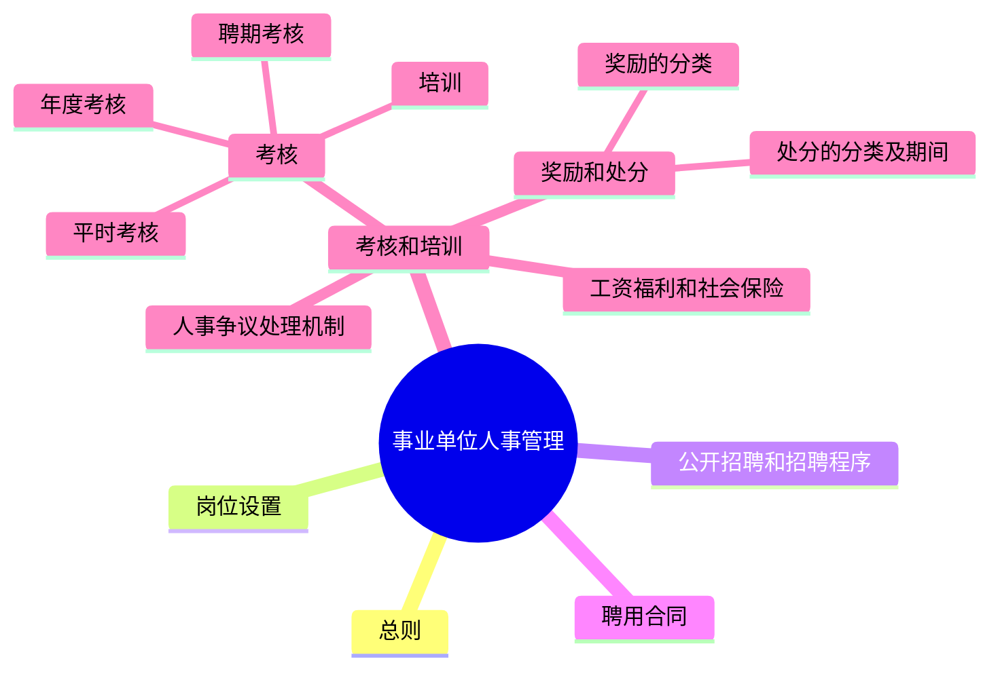
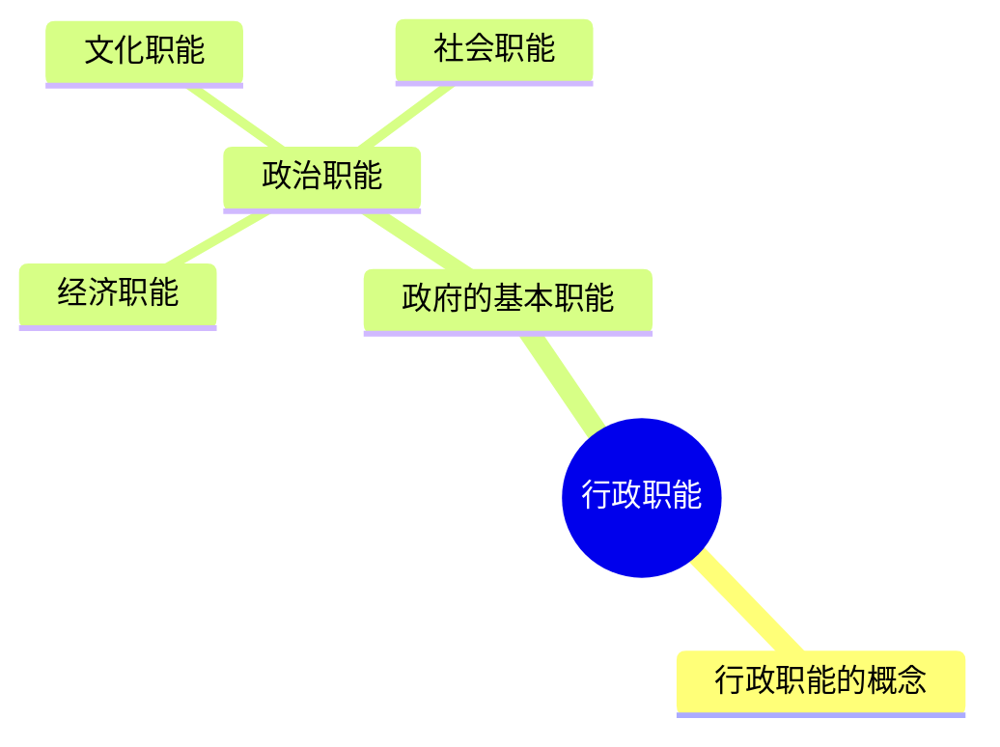



#### 第五篇 管理知识

## 第一章 行政管理

行政管理是运用国家权力对社会事务以及自身内部进行管理的一种活动，也可以泛指一切企业、事业单位的行政事务管理工作。在事业单位考试中，对于这一部分主要会从《事业单位人事管理条例》、行政职能、行政组织等角度进行考查，考查方式比较固定，考生在理解的基础上进行记忆即可。

### 第一节 事业单位人事管理

**考情分析**

国务院于2014年发布《事业单位人事管理条例》。该条例是为规范事业单位人事管理，保障事业单位工作人员合法权益，建设高素质的事业单位工作人员队伍，促进公共服务的发展而制定的。在近几年的事业单位考试中，对于《事业单位人事管理条例》中的细节考查较多，考点主要集中在事业单位工作人员的奖励、处分方式，以及聘用合同的相关规定等方面。考查方式以记忆性为主，故各位考生在备考此部分内容时，着重以记忆为主即可。

**本节框架**


**知识内容**

#### 一、总则

**(一) 管理原则及方针**

事业单位人事管理，坚持党管干部、党管人才原则，全面准确贯彻民主、公开、竞争、择优方针。

**(二) 管理方式**

国家对事业单位工作人员实行分级分类管理。

**名师解读**

> 如何进行分级分类？
>
> 根据《事业单位岗位设置管理试行办法》，事业单位岗位分为管理岗位、专业技术岗位和工勤技能岗位三种类别。
>
> 其中：
> (1) 管理岗位分为10个等级，即一至十级职员岗位。
> (2) 专业技术岗位分为13个等级，包括高级岗位、中级岗位和初级岗位。
>     高级岗位分7个等级，即一至七级；中级岗位分3个等级，即八至十级；初级岗位分3个等级，即十一至十三级。
> (3) 工勤技能岗位包括技术工岗位和普通工岗位，其中技术工岗位分为5个等级，即一至五级。普通工岗位不分等级。

**(三) 管理主体**

中央事业单位人事综合管理部门负责全国事业单位人事综合管理工作。
县级以上地方各级事业单位人事综合管理部门负责本辖区事业单位人事综合管理工作。
事业单位主管部门具体负责所属事业单位人事管理工作。

**(四) 人事管理制度**

事业单位应当建立健全人事管理制度。
事业单位制定或者修改人事管理制度，应当通过职工代表大会或者其他形式听取工作人员意见。


#### 二、岗位设置

国家建立事业单位岗位管理制度，明确岗位类别和等级。事业单位根据职责任务和工作需要，按照国家有关规定设置岗位。岗位应当具有明确的名称、职责任务、工作标准和任职条件。事业单位拟订岗位设置方案，应当报人事综合管理部门备案。

#### 三、公开招聘和招聘程序

**(一) 公开招聘**

事业单位新聘用工作人员，应当面向社会公开招聘。但是，国家政策性安置、按照人事管理权限由上级任命、涉密岗位等人员除外。

**(二) 招聘程序**

事业单位公开招聘工作人员按照下列程序进行：
(1) 制定公开招聘方案；
(2) 公布招聘岗位、资格条件等招聘信息；
(3) 审查应聘人员资格条件；
(4) 考试、考察；
(5) 体检；
(6) 公示拟聘人员名单；
(7) 订立聘用合同，办理聘用手续。

#### 四、聘用合同

**(一) 合同期限**

事业单位与工作人员订立的聘用合同，期限一般不低于3年。
初次就业的工作人员与事业单位订立的聘用合同期限3年以上的，试用期为12个月。

事业单位工作人员在本单位连续工作满10年且距法定退休年龄不足10年，提出订立聘用至退休的合同的，事业单位应当与其订立聘用至退休的合同。

**(二) 聘用合同解除**

**1. 单位开除员工情形**

(1) 事业单位工作人员连续旷工超过15个工作日，或者1年内累计旷工超过30个工作日的，事业单位可以解除聘用合同。

(2) 事业单位工作人员年度考核不合格且不同意调整工作岗位，或者连续两年年度考核不合格的，事业单位提前30日书面通知，可以解除聘用合同。

**2. 员工主动离职情形**

事业单位工作人员提前30日书面通知事业单位，可以解除聘用合同。但是，双方对解除聘用合同另有约定的除外。

**3. 合同的解除情形**

事业单位工作人员受到开除处分的，解除聘用合同。
自聘用合同依法解除、终止之日起，事业单位与被解除、终止聘用合同人员的人事关系终止。


**☆ 名师解读**

> (1) 不低于3年：大于等于3年。
> (2) 旷工超过15个工作日：大于15个工作日（注：不包括15个工作日）。


#### 五、考核和培训

**(一) 考核**

事业单位应当根据聘用合同规定的岗位职责任务，全面考核工作人员的表现，重点考核工作绩效。考核应当听取服务对象的意见和评价。
考核分为平时考核、年度考核和聘期考核。
年度考核的结果可以分为优秀、合格、基本合格和不合格等档次，聘期考核的结果可以分为合格和不合格等档次。
考核结果作为调整事业单位工作人员岗位、工资以及续订聘用合同的依据。

**(二) 培训**

事业单位应当根据不同岗位的要求，编制工作人员培训计划，对工作人员进行分级分类培训。
工作人员应当按照所在单位的要求，参加岗前培训、在岗培训、转岗培训和为完成特定任务的专项培训。


#### 六、奖励和处分

**（一）奖励**

奖励坚持精神奖励与物质奖励相结合、以精神奖励为主的原则。
奖励分为嘉奖、记功、记大功、授予荣誉称号。

**名师解读**

根据《事业单位工作人员奖励规定》，事业单位的奖励原则包括：
（1）坚持精神奖励与物质奖励相结合、以精神奖励为主；
（2）坚持定期奖励与及时奖励相结合、以定期奖励为主。
故此处两种奖励原则如果同时在考试中出现，大家知道都是正确的即可。

#### **（二）处分**
**1. 处分的种类和期间**

处分分为警告、记过、降低岗位等级或者撤职、开除。
受处分的期间：警告，6个月；记过，12个月；降低岗位等级或者撤职，24个月。

**2. 处分的解除**

工作人员受开除以外的处分，在受处分期间没有再发生违纪行为的，处分期满后，由处分决定单位解除处分并以书面形式通知本人。

#### 七、工资福利和社会保险

**（一）工资福利**

国家建立激励与约束相结合的事业单位工资制度。
事业单位工作人员工资包括基本工资、绩效工资和津贴补贴。
国家建立事业单位工作人员工资的正常增长机制。事业单位工作人员的工资水平应当与国民经济发展相协调，与社会进步相适应。
事业单位工作人员享受国家规定的福利待遇。事业单位执行国家规定的工时制度和休假制度。

**（二）社会保险**

事业单位及其工作人员依法参加社会保险，工作人员依法享受社会保险待遇。
事业单位工作人员符合国家规定退休条件的，应当退休。


#### 八、人事争议处理机制

**（一）争议处理**

事业单位工作人员与所在单位发生人事争议的，依照《中华人民共和国劳动争议调解仲裁法》等有关规定处理。

事业单位工作人员对涉及本人的考核结果、处分决定等不服的，可以按照国家有关规定申请复核、提出申诉。

> **☆ 名师解读**
> 根据《事业单位工作人员申诉规定》，事业单位工作人员对涉及本人的人事处理不服的，可以依照本规定申请复核；对复核结果不服的，可以依照本规定提出申诉、再申诉。
>
> 事业单位工作人员对人事处理不服申请复核的，由原处理单位管辖。
>
> 事业单位工作人员对中央和地方直属事业单位作出的复核决定不服提出的申诉，由同级事业单位人事综合管理部门管辖。
>
> 事业单位工作人员对中央和地方各部门所属事业单位作出的复核决定不服提出的申诉，由主管部门管辖。
>
> 事业单位工作人员对主管部门或者其他有关部门作出的复核决定不服提出的申诉，由同级事业单位人事综合管理部门管辖。
>
> 事业单位工作人员对乡镇党委和人民政府作出的复核决定不服提出的申诉，由县级事业单位人事综合管理部门管辖。
>
> 事业单位工作人员对中央垂直管理部门省级以下机关作出的复核决定不服提出的申诉，由上一级机关管辖；对申诉处理决定不服提出的再申诉，由作出申诉处理决定机关的同级事业单位人事综合管理部门或者上一级机关管辖。

**（二）回避**

负有事业单位聘用、考核、奖励、处分、人事争议处理等职责的人员履行职责，有下列情形之一的，应当回避：
1. 与本人有利害关系的；
2. 与本人近亲属有利害关系的；
3. 其他可能影响公正履行职责的。


#### 考点清单

\* 易混易错

| 事业单位人事处分 vs 党纪处分 | |
| :--- | :--- |
| 事业单位人事处分 | (1) 警告<br>(2) 记过<br>(3) 降低岗位等级或者撤职<br>(4) 开除 |
| 党纪处分 | (1) 警告<br>(2) 严重警告<br>(3) 撤销党内职务<br>(4) 留党察看<br>(5) 开除党籍 |

#### 真题再现

1.（单选）依据《事业单位人事管理条例》的规定，事业单位奖励不包括（ ）。
A. 嘉奖 &emsp; B. 提职
C. 记大功 &emsp; D. 授予荣誉称号

【答案】B
【解析】本题考查事业单位人事管理制度。
《事业单位人事管理条例》第二十七条规定：“奖励分为嘉奖、记功、记大功、授予荣誉称号。”A、C、D三项属于该条例的规定，而B项不属于。
本题为选非题，故正确答案为B。

2.（单选）根据《事业单位人事管理条例》，下列说法正确的是（ ）。
A. 事业单位人事管理，坚持民主、公开、竞争、择优的原则
B. 事业单位工作人员年度考核不合格，事业单位提前30日书面通知，可以解除聘用合同
C. 事业单位工作人员受到撤职处分的，解除聘用合同
D. 事业单位年度考核的结果可以分为优秀、合格、基本合格和不合格等档次

【答案】D

【解析】本题考查事业单位相关制度。

A项错误，《事业单位人事管理条例》第二条规定：“事业单位人事管理，坚持党管干部、党管人才原则，全面准确贯彻民主、公开、竞争、择优方针。国家对事业单位工作人员实行分级分类管理。”所以事业单位人事管理，坚持党管干部、党管人才的原则，民主、公开、竞争、择优是事业单位人事管理的方针。

B项错误，《事业单位人事管理条例》第十六条规定：“事业单位工作人员年度考核不合格且不同意调整工作岗位，或者连续两年年度考核不合格的，事业单位提前30日书面通知，可以解除聘用合同。”所以事业单位工作人员连续两年年度考核不合格的，事业单位提前30日书面通知，可以解除聘用合同。

C项错误，《事业单位人事管理条例》第十八条规定：“事业单位工作人员受到开除处分的，解除聘用合同。”《事业单位人事管理条例》第二十九条规定：“处分分为警告、记过、降低岗位等级或者撤职、开除。受处分的期间为：警告，6个月；记过，12个月；降低岗位等级或者撤职，24个月。”所以事业单位工作人员受到开除处分的，才解除聘用合同；受到撤职处分的，不解除聘用合同。

D项正确，《事业单位人事管理条例》第二十一条规定：“考核分为平时考核、年度考核和聘期考核。年度考核的结果可以分为优秀、合格、基本合格和不合格等档次，聘期考核的结果可以分为合格和不合格等档次。”

故正确答案为D。

3.（单选）根据《事业单位人事管理条例》，初次就业的工作人员与事业单位订立的聘用合同期限3年以上的，试用期为（  ）。
A.3个月　　　　　　　　　B.6个月
C.9个月　　　　　　　　　D.12个月

【答案】D
【解析】本题考查事业单位相关制度。

《事业单位人事管理条例》第十三条规定：“初次就业的工作人员与事业单位订立的聘用合同期限3年以上的，试用期为12个月。”

故正确答案为D。

4.（多选）2014年2月26日，国务院第40次常务会议通过《事业单位人事管理条例》，

并确定自2014年7月1日起施行。对于事业单位的人事管理，下列说法正确的有（　　）。

A. 事业单位与工作人员签订的聘用合同，期限一般不低于5年
B. 事业单位工作人员连续旷工超过10个工作日的，事业单位可以解除聘用合同
C. 事业单位工作人员工资包括基本工资和津贴补贴
D. 事业单位应当根据不同岗位要求，编制工作人员培训计划，对工作人员进行分级分类培训

【答案】CD
【解析】本题考查事业单位相关制度。
A项错误，《事业单位人事管理条例》第十二条规定：“事业单位与工作人员订立的聘用合同，期限一般不低于3年。”
B项错误，《事业单位人事管理条例》第十五条规定：“事业单位工作人员连续旷工超过15个工作日，或者1年内累计旷工超过30个工作日的，事业单位可以解除聘用合同。”
C项正确，《事业单位人事管理条例》第三十二条规定：“国家建立激励与约束相结合的事业单位工资制度。事业单位工作人员工资包括基本工资、绩效工资和津贴补贴。”
D项正确，《事业单位人事管理条例》第二十三条规定：“事业单位应当根据不同岗位的要求，编制工作人员培训计划，对工作人员进行分级分类培训。”
故正确答案为CD。

5.（单选）某公立医院与刚刚大学毕业的许某签订聘用合同，合同内容符合《事业单位人事管理条例》规定的是（　　）。

A. 签订了三年的聘用合同
B. 约定随时解除聘用关系
C. 签订了五年的聘用合同，试用期为六个月
D. 订立的聘用合同约定许某的工资在试用期结束后统一发放

【答案】A
【解析】本题考查管理常识，主要考查《事业单位人事管理条例》的相关内容规定。
A项正确，《事业单位人事管理条例》第十二条规定：“事业单位与工作人员订立的聘用合同，期限一般不低于3年。”
B项错误，根据《事业单位人事管理条例》的规定，聘用关系的解除有以下几种情况：事业单位工作人员连续旷工超过15个工作日，或者1年内累计旷工超过30个工作日

日的；事业单位工作人员年度考核不合格且不同意调整工作岗位，或者连续两年年度考核不合格的，事业单位提前 30 日书面通知；事业单位工作人员提前 30 日书面通知事业单位；事业单位工作人员受到开除处分的。据此，约定随时解除聘用关系不符合规定。

C 项错误，《事业单位人事管理条例》第十三条规定：“初次就业的工作人员与事业单位订立的聘用合同期限 3 年以上的，试用期为 12 个月。”

D 项错误，《事业单位人事管理条例》在“聘用合同”一章中并未规定工资在试用期结束后统一发放。

故正确答案为 A。

#### 本节导图

*   **事业单位人事管理**
    *   **总则**
        *   **管理原则** 党管干部、党管人才
        *   **方针** 民主、公开、竞争、择优
        *   **管理方式** 分级分类管理
            *   管理岗
            *   专业技术岗
            *   工勤技能岗
        *   **管理主体** 事业单位人事综合管理部门
    *   **公开招聘和招聘程序**
        *   **特殊岗位**
            *   政策性安置
            *   上级任命
            *   涉密岗位
        *   **招聘程序** 制定招聘方案—公布岗位—审查应聘人员资格条件—考试—体检—公示—订立合同
    *   **聘用合同**
        *   **合同期限**
            *   聘用合同 不低于3年
            *   试用期
                *   事业单位 初次就业：12个月（合同期限3年以上）
                *   公务员 12个月
                *   企业 6个月
            *   退休 连续工作满10年+距法定退休年龄不足10年
        *   **合同解除**
            *   单位即时解除
                *   连续旷工超过15个工作日
                *   1年内累计旷工超过30个工作日
            *   单位预告解除（提前30天通知）
                *   年度考核不合格+不同意调岗
                *   连续两年年度考核不合格
            *   员工主动离职 事业单位工作人员提前30日书面通知事业单位


*   **事业单位人事管理**
    *   **考核和培训**
        *   **考核**
            *   平时考核
            *   年度考核
                *   优秀
                *   合格
                *   基本合格
                *   不合格
            *   聘期考核
                *   合格
                *   不合格
        *   **培训** 岗前培训、在岗培训、转岗培训和为完成特定任务的专项培训
    *   **奖励和处分**
        *   **奖励**
            *   嘉奖
            *   记功
            *   记大功
            *   授予荣誉称号（最高奖励）
        *   **处分**
            *   警告：6个月
            *   记过：12个月
            *   降低岗位等级或撤职：24个月
            *   开除
        *   **区分：党纪处分**
            *   警告
            *   严重警告
            *   撤销党内职务
            *   留党察看
            *   开除党籍
    *   **人事争议处理**
        *   **依据** 《中华人民共和国劳动争议调解仲裁法》
        *   **方式**
            *   复核 原处理单位
            *   申诉
                *   事业单位人事综合管理部门
                *   主管部门

#### 拓展阅读
为规范事业单位人事管理工作，维护人事管理公平公正，根据《事业单位人事管理条例》及有关法律法规，2019年9月，中共中央组织部、人力资源社会保障部印发了《事业单位人事管理回避规定》。小粉笔特为大家总结了规定中的重要内容：

(1) 本规定所称事业单位人事管理回避包括岗位回避和履职回避。
(2) **【岗位回避】** 事业单位工作人员凡有下列亲属关系的，不得在同一事业单位聘用至具有直接上下级领导关系的管理岗位，不得在其中一方担任领导人员的事业单位聘用至从事组织（人事）、纪检监察、审计、财务工作的岗位，也不得聘用至双方直接隶属于同一领导人员的从事组织（人事）、纪检监察、审计、财务工作的内设机构正职岗位：
①夫妻关系；
②直系血亲关系，包括祖父母、外祖父母、父母、子女、孙子女、外孙子女；

③三代以内旁系血亲关系，包括叔伯姑舅姨、兄弟姐妹、堂兄弟姐妹、表兄弟姐妹、侄子女、甥子女；
④近姻亲关系，包括配偶的父母、配偶的兄弟姐妹及其配偶、子女的配偶及子女配偶的父母、三代以内旁系血亲的配偶；
⑤其他亲属关系，包括养父母子女、形成抚养关系的继父母子女及由此形成的直系血亲、三代以内旁系血亲和近姻亲关系。
(3) **【履职回避】** 事业单位工作人员应当回避的履职活动包括：
①岗位设置、公开招聘、聘用解聘（任免）、考核考察、奖励、处分、交流、人事争议处理、出国（境）审批；
②人事考试、职称评审、人才评价；
③招生考试、项目评审、成果评选、资金审批与监管；
④其他应当回避的履职活动。

### 第二节 行政职能

**考情分析**

在事业单位考试中，本节内容的考查概率较高，考点主要集中在政府的基本职能部分，例如政治职能、经济职能、文化职能、社会职能，一般会以例子的形式进行考查，考生对这几项考点要充分复习。

**本节框架**



**知识内容**

#### 一、行政职能的概念
行政职能又称政府职能，是指行政主体作为国家管理的执行机关，在依法对国家政治、经济和社会公共事务进行管理时应承担的职责和所具有的功能。

#### 二、政府的基本职能

| 种类 | 内容 | 名师解读 |
| :--- | :--- | :--- |
| **政治职能** | 阶级专政职能 | 指对犯罪分子进行的制裁 |
| **政治职能** | 军事保卫职能 | 指保卫国防和领土安全 |
| **政治职能** | 社会治安职能 | 打击犯罪 |
| **政治职能** | 民主政治职能 | 维护公民的民主权利（如选举权） |
| **政治职能** | 国际交往职能 | 国与国之间的外交 |
| **经济职能** | 计划指导职能 | 制定经济计划和规划 |
| **经济职能** | 培育和完善市场机制职能 | 反垄断，反不正当竞争 |
| **经济职能** | 宏观调控职能 | 运用财政政策和货币政策调节经济 |
| **经济职能** | 服务职能 | 服务市场主体（主要指企业） |
| **经济职能** | 检查监督职能 | 进行市场的监督和监管 |
| **文化职能** | 发展科学技术的职能 | 发展科学事业 |
| **文化职能** | 发展教育的职能 | 发展国民教育事业 |
| **文化职能** | 发展文化事业的职能 | 发展文化事业，进行文化推广 |
| **文化职能** | 发展卫生事业的职能 | 制定卫生相关政策 |
| **文化职能** | 发展体育事业的职能 | 制定体育相关政策，发展体育事业 |
| **社会职能** | 社会服务职能 | 多指对民生的服务 |
| **社会职能** | 社会保障职能 | 五重社会保障体系，包括社会保险、社会救助、社会福利、社会优抚、社会互助 |
| **社会职能** | 环境保护职能 | 也称生态职能 |
| **社会职能** | 人口控制职能 | 控制人口数量和质量，进行优生优育 |


#### 考点清单

考点1——对犯罪分子的制裁属于什么职能？
政治职能。
考点2——政治职能也可以叫作统治职能？
是的，政治职能，亦称统治职能，是指政府为维护国家统治阶级的利益，对外保护国家安全，对内维持社会秩序的职能。政治职能是由国家的性质所决定的，具有鲜明的阶级性，它是国家最为核心的运行职能。

#### 真题再现

1.（单选）“农家书屋”工程是社会主义新农村建设的文化工程，也是国家实施的文化惠民五大重点工程之一。实施“农家书屋”工程说明政府在履行（ ）。
A. 组织社会主义经济建设的职能
B. 保障人民民主和国家长治久安的职能
C. 组织社会主义文化建设的职能
D. 提供社会公共服务的职能

【答案】C
【解析】本题考查行政职能。

A项错误，组织社会主义经济建设的职能属于经济职能，主要是为了国家经济发展，对社会经济生活进行管理。“农家书屋”工程是社会主义新农村建设的文化工程，不属于经济职能。
B项错误，保障人民民主和国家长治久安的职能属于政治职能，主要是为了维护国家安全和社会秩序。“农家书屋”工程是社会主义新农村建设的文化工程，不属于政治职能。
C项正确，文化职能是政府为满足人民日益增长的文化生活需要，对文化事业所实施的管理。“农家书屋”工程是政府统一规划并组织实施的重大文化工程，体现了政府组织社会主义文化建设的职能。
D项错误，社会公共服务职能主要包括社会保障、保护生态环境、建立社会服务体系等。“农家书屋”工程是社会主义新农村建设的文化工程，不属于社会公共服务职能。

故正确答案为C。

2.（单选）我国政府职能的实施主体是（　　）。
A. 国务院　　　　　　　　　B. 全国人大
C. 中共中央　　　　　　　　D. 各级人民政府
【答案】D
【解析】本题考查行政职能。
政府职能是指政府为实现国家利益和满足社会发展需要而负有的职责和所应发挥的功能。政府职能的实施主体是人民政府，在我国有着不同级别的政府，只有各级人民政府共同努力才能更好地实现政府职能，因此各级人民政府是我国政府职能的实施主体。国务院是中央人民政府；全国人大是最高国家权力机关；中共中央即中国共产党中央委员会，是中国共产党全国代表大会产生的中国共产党核心权力机构。它们均不是政府职能的实施主体。
故正确答案为D。

3.（单选）下列不属于政府职能的是（　　）。
A. 经济调节职能　　　　　　B. 市场监管职能
C. 社会管理职能　　　　　　D. 企业管理职能
【答案】D
【解析】本题考查行政职能。
政府职能是国家行政机关依法对国家和社会公共事务进行管理时应承担的职责和所具有的功能。我国政府主要应履行四大职能：政治职能、经济职能、文化职能、社会职能。
A项正确，经济调节属于政府的经济职能，是指调节经济运行、推进经济发展。主要是运用经济手段、法律手段，并辅之以必要的行政手段调节经济活动。
B项正确，市场监管属于政府的经济职能，是指推进公平准入，规范市场执法，加强对涉及人民生命财产安全领域的监管。
C项正确，社会管理属于政府的社会职能，主要包括强化政府促进就业和调节社会分配，完善社会保障体系，健全基层社会管理体制，维护社会稳定。
D项错误，企业管理不属于政府职能。
本题为选非题，故正确答案为D。

#### 本节导图

行政职能

- 政治职能
    - 专政：打击敌对势力和犯罪分子；维护国家主权和领土完整
    - 民主：民主权利
- 经济职能
    - 制定经济计划和规划
    - 宏观调控——运用财政政策+货币政策调节经济
    - 市场监督
- 文化职能：科+教+文+卫+体
- 社会职能
    - 民生服务
    - 社会保障
    - 环境保护
    - 人口控制

### 第三节　行政组织

**考情分析**
在近几年的事业单位考试中，对于行政组织的考查主要集中在行政组织的类型、设置原则上，也会涉及行政组织结构等方面的内容，一般以例子的形式进行考查，要求考生精准记忆，做好区分，切勿混淆概念。

**本节框架**
行政组织

- 概念
- 类型
    - 领导机关
    - 职能机关
    - 辅助机关
    - 参谋咨询机关
    - 派出机关
    - 信息机关
    - 监督机关
- 设置原则


**知识内容**

#### 一、行政组织的概念

行政组织是行使国家行政权力、管理国家行政事务和社会公共事务的机构体系。

#### 二、行政组织的类型

按照行政组织职权范围和作用的不同，行政组织可分为：

**（一）领导机关**
领导机关是指从中央到地方的各级行政首脑机关，是各级政府的决策和指挥中心，主要任务是对辖区内的行政工作进行统一领导。领导机关在整个行政组织系统中起中枢和统率作用。如我国的国务院和地方各级人民政府就属于领导机关。

**（二）职能机关**
职能机关是在行政领导机关的领导下，负责组织和管理某一专业方面行政事务的执行机关。职能机关是领导机关的组成部门，执行领导机关制定的方针、政策和指示。它的职权活动具有局部性、专业性等特征。如我国国务院所属部委就属此类。

**（三）辅助机关**
辅助机关是指为了使行政首长或专业职能机关顺利地进行管理活动，在机关内部承担辅助性工作任务的机构。它的状态直接关系首脑机关功能的发挥。辅助机关可分为综合性、专业性、政务性和事务性的辅助机关。如国务院和地方政府的办公厅（室）就是综合性辅助机关。

**（四）参谋咨询机关**
参谋咨询机关亦称智囊机构，是现代政府的一种组织形态，是指汇集专家学者和富有经验的政府官员来专门为政府出谋划策、提供论证政策方案的行政机构。参谋咨询机关业务独立，其基本职能是研究咨询、参与决策、协调政策、培训人才。参谋咨询机关没有决策权，不需要对决策负责。如政策研究室就属于参谋咨询机关。

**（五）派出机关**
派出机关是由有权地方人民政府在一定行政区域内设立，代表设立机关管理该行政区域内各项行政事务的行政机构。在我国，派出机关有行政公署、区公所、街道办事处。

**（六）信息机关**
信息机关是专门从事信息收集、加工、储存与传播的行政机关，如信息中心、统计部门等。

**（七）监督机关**
监督机关是指负责对整个行政机关及其工作人员、非政府公共组织、企业组织及公民遵纪守法情况、政策决策执行情况等进行督导、检查工作的行政机关，如审计部门。

#### 三、行政组织设置原则

1. 为民便民原则
2. 精干效能原则
3. 完整统一原则
4. 按需设置原则
5. 权责一致原则
6. 依法设置原则
7. 适应发展原则

#### 考点清单

考点1——省政府属于什么类型的行政组织？
领导机关。
考点2——谁是行政组织中的主体？
职能机关。

* 易混易错——派出机关 vs 派出机构：
派出机关是由有权地方人民政府在一定行政区域内设立，代表设立机关管理该行政区域内各项行政事务的行政机构。我国地方人民政府的派出机关主要有三种类型：（1）行政公署；（2）区公所；（3）街道办事处。
派出机构是由有权地方人民政府的职能部门在一定行政区域内设立，代表该设立机构管理该行政区域内某一方面行政事务的行政机构。如公安分局与派出所、国土分局与国土所等。

#### 真题再现

1.（多选）行政组织的设置需遵循下列哪些原则？（　　）
A. 精简与高效原则　　　　　B. 公正公开原则
C. 完整统一原则　　　　　　D. 职、权、责一致原则
【答案】ACD
【解析】本题考查行政组织。
行政组织是行政体制的组织表现形式，是公共行政管理活动的主体。我国行政组织的设置，一般应遵循以下基本原则：（1）职能需要原则。行政组织是实现政府职能的载体，因此必须依据政府职能的需要，建立相应的组织机构，并且适应政府职能变化的需要，进行相应的调整和改革。（2）精干高效原则。精干高效是行政组织科学化的重要标志。精干与高效的关系是相互统一的，行政组织只有做到机构精简、人员精干、办事程序简化，才能实现高效的目标。（3）完整统一原则。行政组织作为国家行使行政权的主体，其组织体系应是一个完整统一的整体。（4）权责一致原则。行政组织是个权责体系，权责一致原则是建设科学合理的行政组织的内在要求，是确保公共行政管理活动有效运行的必备条件。（5）依法设置原则。加强行政组织体系法制建设，依法设置行政组织，是依法行政、依法治国的基本要求。行政组织的设置原则中没有公正公开原则。
故正确答案为ACD。

2.（单选）行政组织中的行政领导机关也被称为（　　）。
A. 职能机关　　　　　　　　B. 办公机关
C. 首脑机关　　　　　　　　D. 主管机关
【答案】C
【解析】本题考查行政组织。
A项错误，职能机关是在行政领导机关的领导下，负责组织和管理某一专业方面行政事务的执行机关。

政事务的执行机关。职能机关是领导机关的组成部门，执行领导机关制定的方针、政策和指示。
B项错误，办公机关是指为了使行政首长或专业职能机关顺利地进行管理活动，在机关内部承担辅助性工作任务的机构。
C项正确，首脑机关又称领导机关，是中央政府和地方各级政府统辖全局的指挥中枢和决策监督核心。
D项错误，主管机关是指在行政领导机关的领导下，执行某一具体职能，管理某一具体行政事务的机关。
故正确答案为C。

3.（单选）政府的结构反映政府内外部各要素之间围绕权力分配而展开的排列组合、相互联系和相互作用的方式，在其内部结构中（　）主要任务之一是制定实施方针、政策和长远规划。
A. 领导机构　　　　　　　B. 职能机构
C. 办公机构　　　　　　　D. 直属机构
【答案】A
【解析】本题考查管理中行政组织的类型的相关知识。
A项正确，领导机构在整个行政组织系统中起中枢和统率作用，主要任务是对辖区内的行政工作进行统一领导，并制定方针、政策和指示。
B项错误，职能机构是领导机关的组成部门，执行领导机关制定的方针、政策和指示。它的职权活动具有局部性、专业性等特征。
C项错误，办公机构是辅助机构，在机关内部承担辅助性工作任务。
D项错误，直属机构是在政府直接领导下主办专门业务的机构，其职能类似于政府的职能机构，负责执行某一专业领域的方针、政策。
故正确答案为A。

4.（单选）统计局、信息中心、档案局这些机构都属于行政组织中的（　）。
A. 领导机构　　B. 执行机构
C. 监督机构　　D. 信息机构
【答案】D

【解析】本题考查行政组织。
行政组织是行政管理活动的基础，是社会公共事务管理的主体。它分为领导机关、执行机关、监督机关、咨询机关、信息机关、辅助机关、派出机关。其中，信息机关是指国家行政机关中对管理所需要的行政信息进行搜集、加工、传递、存贮、处理的机关。信息机关为行政活动服务，向行政领导提供确实和系统的行政信息，以保证行政组织的正常运转。题干中统计局、信息中心和档案局都是为行政活动提供信息和数据的机关，故属于信息机关。
故正确答案为D。

#### 本节导图
行政组织
├─**概念**：狭义概念：特指政府组织机构实体
├─**类型**
│ ├─领导机关
│ ├─职能机关 主体
│ ├─辅助机关 办公厅或办公室
│ ├─参谋咨询机关 智囊团 如：研究中心
│ ├─派出机关 政府派出
│ ├─信息机关 收集、统计信息 如：统计局、档案局、资料室
│ └─监督机关 内部监督 审计监督
└─**设置原则**
　├─为民便民原则
　├─精干效能原则
　├─完整统一原则
　├─按需设置原则
　├─权责一致原则
　├─依法设置原则
　└─适应发展原则

#### 拓展阅读
#### 非政府组织
非政府组织也可称为非营利组织、第三部门等，是指依靠社会权力，以增加社会公共利益为组织目标，以提供公共服务为基本职责，非官方、非营利的社会组织。我国的非政府组织主要分为事业单位、社会团体、民办非企业单位等。


### 第四节 行政监督

**考情分析**
在近几年的事业单位考试中，行政监督也是常考的重点内容之一。考查的内容较为单一，主要是行政内部监督和行政外部监督。在考查形式上，有的题目直接考查不同监督方式的地位和作用，有的题目则以例子的形式考查监督方式。这要求考生记忆并能够结合字面意思理解不同监督方式的异同点。

**本节框架**
行政监督
├─**内部监督（自我监督）**
│ ├─一般监督
│ └─专门监督
└─**外部监督**
　├─立法监督
　├─司法监督
　├─政党监督
　├─社会监督
　└─监察监督

**知识内容**
#### 一、行政监督的概念
行政监督是指在公共行政管理过程中，各类监督主体依法对国家行政机关及国家公务员在执行公务和履行职责时各种行政行为所实施的监察、督促和控制活动。

##### 名师解读
（1）行政监督的主体：各类监督主体。
（2）行政监督的对象：国家行政机关的行政行为和行政工作人员的职务行为。


#### 二、行政监督体系

| 分类   | 分类       | 监督主体                                                                 |
|--------|------------|--------------------------------------------------------------------------|
| 内部监督 | 一般监督   | 指具有行政隶属关系的上下级之间的监督，也叫作层级监督                     |
| 内部监督 | 专门监督   | 主要指审计监督（监督内容：经济财务问题）                                 |
| 外部监督 | 立法监督   | 立法机关                                                                 |
| 外部监督 | 司法监督   | 司法机关                                                                 |
| 外部监督 | 政党监督   | 中国共产党及各民主党派                                                   |
| 外部监督 | 社会监督   | 社会团体、新闻媒体和公民个人等                                           |
| 外部监督 | 监察监督   | 监察委员会                                                               |

#### 考点清单
考点1——审计监督属于内部监督还是外部监督？
内部监督。
考点2——行政监察属于什么监督？
已经没有这个说法了，2018年宪法修改后，我们设立了监察委员会，其独立于行政机关之外，故目前已经没有行政监察这个说法。监察委员会属于外部监督。
考点3——质询属于什么监督方式？
立法监督，质询是指立法机关个人或集体以书面或口头方式就政府行政活动有关事项向政府首脑或部长提出问题，要求其即席或书面答复。
考点4——社会监督的主体包括哪些？
社会团体、新闻媒体、公民个人等。

#### 真题再现
1.（单选）我国完整的行政监督体系由外部监督和内部监督构成，下列属于内部行政监督的是（　）。
A. 执政党的监督　　　　　　B. 人民政协的监督
C. 公民和法人的监督　　　　D. 审计监督
【答案】D

【解析】本题考查行政监督的知识。
行政监督是指各类监督主体依法对国家行政机关及其工作人员的行政行为实施的监督活动。行政监督分为行政内部监督系统和行政外部监督系统。行政内部监督系统分为一般监督和专门监督，行政外部监督系统分为立法监督、司法监督、政党监督、社会监督以及监察委员会的监督。
A项错误，执政党的监督也就是中国共产党的监督，属于行政外部监督中的政党监督。
B项错误，人民政协是民主党派参政议政的组织，是由中国共产党领导的多党合作和政治协商的重要机构，是中国政治生活中发扬社会主义民主的一种重要形式，属于行政外部监督中的政党监督。
C项错误，公民和法人的监督属于行政外部监督中的社会监督。
D项正确，审计监督属于行政内部监督中的专门监督。
故正确答案为D。

2.（单选）下列哪一项不属于我国现行行政机关外部监督体系的范畴？（　）
A. 公民监督　　　　　B. 执政党监督
C. 审计监督　　　　　D. 检察监督
【答案】C
【解析】本题考查行政监督。
行政外部监督系统是指除行政机关以外的监督主体所构成的对行政机关及其工作人员行政行为的遵纪守法情况进行督查、督导的监督体系，包括立法监督、司法监督（包括法院、检察院的监督）、监察监督、政党监督（主要指的是中国共产党的监督）和社会监督。审计监督属于行政内部监督体系的一种。
本题为选非题，故正确答案为C。

3.（多选）行政监督中的社会监督包括（　）。
A. 民主党派监督　　　B. 工青妇组织监督
C. 社会舆论监督　　　D. 公民监督
【答案】BCD
【解析】本题考查行政监督。

B、C、D三项正确，社会监督即非国家机关的监督，是指各社会组织和公民以多种形式、多种手段和多种途径广泛地、积极主动地参与法的实施的一种监督。中国社会监督的主要形式包括：（1）公民的监督；（2）社会组织的监督；（3）社会舆论的监督。政党监督、社会监督和司法监督是并列关系。

故正确答案为BCD。

4.（单选）目前，我国已经依据宪法和法律，初步建立起全面的行政监督体系。下列选项中不属于行政系统外部监督的是（　　）。
A. 人民政协的监督　　　　B. 司法机关的监督
C. 上级政府的监督　　　　D. 人大的监督
【答案】C
【解析】本题考查行政监督。
行政监督分为内部监督和外部监督。（1）内部监督又分为一般监督和专门监督：①一般监督又称层级监督，是指国家行政机关在上、下级行政隶属关系上产生的一种相互监督的关系和活动。一般监督是行政机关内部监督体系中最重要的部分，也是最为广泛的一种监督，具有直接性、经常性和广泛性等特点。②专门监督分为行政监察和审计机关对行政机关及其公务人员的审计监督。（2）行政外部监督系统包括：立法监督、司法监督、政党监督、社会监督、监察监督。①立法监督，是指各级人民代表大会及其常务委员会对国家行政机关及其工作人员的行政管理活动实施的监督。②政党监督，主要是指执政党和其他民主党派（政协）的监督。③司法监督，主要指人民法院和人民检察院的监督。④社会监督，是社会组织和公民实施的监督，比如媒体监督。⑤监察监督，指监察委员会进行的监督。
A、B、D三项正确，三者均属于行政系统外部监督。C项错误，上级政府的监督属于行政内部监督。
本题为选非题，故正确答案为C。


公共基础知识（中册）

#### 本节导图

- **行政监督**
    - **内部监督（自我监督）**
        - 一般监督 层级监督
        - 专门监督 审计监督
    - **外部监督**
        - 立法监督 人大+人大常委会
        - 司法监督
            - 法院
            - 检察院
        - 政党监督
            - 中国共产党
            - 民主党派
        - 社会监督
            - 社会团体
            - 新闻媒体
            - 公民个人
        - 监察监督 监察委员会的监督


## 第二章 管理学基本原理

### 第一节 管理概述

**考情分析**
在近几年的事业单位考试中，管理学的基本原理是常考内容之一。本节内容的考点集中在对概念的理解和把握上，如管理的主体、载体、对象、最终目的，以及管理的基本职能。考查方式上以直接考查概念本身为主，也会以例子的形式进行考查，要求考生吃透概念，准确掌握相关知识。

**本节框架**

- **管理概述**
    - 定义
    - 职能
        - 计划
        - 组织
        - 领导
        - 控制

**知识内容**

管理是指管理者在特定的环境条件下，以人为中心，对组织所掌握的相关资源进行有效的决策、计划、组织、领导、控制，以便达到既定组织目标的过程。

**名师解读**

>1. **管理的对象**
管理的对象是相关资源，而人力资源是最重要的资源，管理要以人为中心。
>2. **管理的职能**
管理的职能有较多版本的表述，来源于各学派管理学大师所提出的不同观点。
现阶段比较流行的观点是将其简化为四个基本职能：计划、组织、领导和控制。

**（1）计划。**

计划是对未来活动的预先筹划。人们在从事一项活动之前一般要制订计划，这是管理的前提。
**（2）组织。**
组织工作决定着要完成的任务是什么，谁去完成这些任务，这些任务怎么分类组合，谁向谁报告，以及各种决策应在哪一级上制定等。
**（3）领导。**
管理的领导职能是指指导和协调组织中的成员，包括管理者激励下属，指导他们的活动，选择最有效的沟通渠道，解决组织成员之间的冲突等，从而使组织中的全体成员以高昂的士气、饱满的热情投身到组织活动中去。
**（4）控制。**
控制是按既定目标和标准对组织的活动进行监督、检查，发现偏差，采取纠正措施，以使工作能按原定计划进行，或适当调整计划以达预期目的。

#### 考点清单

考点1——围绕组织目标，制定实施方案，在政府管理运行中所处的职能是什么？
计划职能。
考点2——对组织活动进行纠偏纠错的职能是什么？
控制职能。

#### 真题再现

1.（单选）西蒙认为，管理的实质是（　　）。
A. 组织　　B. 协作
C. 沟通　　D. 决策
【答案】D
【解析】本题考查管理学的基本原理。
决策管理学派的创始人西蒙认为，管理的实质是决策，组织是由作为决策者的个人所组成的系统，组织的决策是组织成员及其群体参与的结果。其贡献主要体现在：①突出了决策在管理中的作用；②系统阐述了决策原理；③强调了决策者的作用。西蒙有一句名言：管理即决策。
故正确答案为D。

2.（单选）古人云：“运筹帷幄之中，决胜千里之外。”这里的“运筹帷幄”反映了管理的（　　）职能。
A. 计划　　B. 组织
C. 领导　　D. 控制
【答案】A
【解析】本题考查管理学的基本原理。
“运筹帷幄之中，决胜千里之外”指的是只要做好了前期部署，就能让事情获得成功。
A项正确，计划职能是指确定组织未来发展目标以及目标实现的方式，是对未来的工作活动在时间、空间上做出规定和安排的职能。和“运筹帷幄”的意思一致，符合题干要求。
B项错误，组织职能是指按照计划对企业的活动及其生产要素进行的分派和组合。
C项错误，领导职能是指领导者运用组织赋予的权力，组织、指挥、协调和监督下属人员，完成领导任务的职责和功能。
D项错误，控制职能是管理者对组织的运行状况加以监督，通过控制可发现当初的计划与实际的偏差，采取有力的行动纠正偏差，保证计划的实行，确保原来的目标得以实现。
故正确答案为A。

#### 本节导图

- **管理概述**
    - **中心** 人
    - **管理的对象**：相关资源（人力资源——最重要）
    - **管理的职能**：决策、计划、组织、领导、控制
    - **管理的目的**：实现既定组织目标
    - **职能**
        - **计划** 实施其他管理职能的前提和依据
        - **组织** 资源和人的合理分配，人尽其事
        - **领导** 在合作中协调人与人之间的矛盾和冲突，指导人的行为
        - **控制** 纠偏纠错


### 第二节 决策

**考情分析**

在近几年的事业单位考试中，行政决策也是常考内容之一，考点集中在行政决策的概念、地位和作用上，而行政决策的类型更是重中之重。在考查方式上，会直接考查概念本身，但更多是以例子的形式来考查决策的类型。这就要求考生加强理解，重点把握好行政决策分类的标准，做到“以一持万”，才能“万无一失”。

**本节框架**

```
决策
├── 决策的含义
└── 决策的类型
    ├── 按决策的性质划分
    ├── 按决策的主体划分
    ├── 按决策的重复程度划分
    └── 按决策的风险程度划分
```

**知识内容**

#### 一、决策的含义

所谓决策，就是做出决定，即人们为实现一定目标所做的行为设计及其抉择。从这个角度来看，决策的主体可以是某个人、组织或者国家，决策主体不同会导致其影响范围不同。

> ⭐ 名师解读
> （1）行政决策在公共行政管理过程中具有决定性作用，处于核心地位。它是行政管理的前提和依据，是公共行政管理成败的决定因素。
> （2）行政决策主导着公共行政管理的全过程，而不只是最初阶段才需要决策

#### 二、决策的类型

1. 按照决策的性质（影响），可分为战略决策、战术决策、业务决策
  （1）战略决策：指与企业发展方向和远景有关的重大问题的决策。战略决策具有长期性、方向性和全局性的特点。
  （2）战术决策：是在组织内贯彻的决策，属于战略决策执行过程中的具体决策。战术决策具有微观性、局部性、阶段性和区域性的特点。
  （3）业务决策，又称执行性决策，且业务决策大多是重复发生的，具有一定确定性的程序化决策。如定额的制定，生产任务的分配，人力、物资的调度，设备维修等。

2. 按照决策的主体，可分为集体决策和个人决策
集体决策又称群体决策，指由多个人一起做出的决策。
个人决策就是单独一个人做出的决策。
3. 按照决策的重复程度，可分为程序性决策与非程序性决策
程序性决策，即有关常规的、反复发生的问题的决策，如管理者日常遇到的常规性问题。
非程序性决策，是指偶然发生的或首次出现而又较为重要的非重复性决策，如对偶然发生的、新颖的、性质和结构不明的、具有重大影响的问题的决策。
4. 按决策的风险程度，可分为确定型决策、风险型决策和不确定型决策
确定型决策，是指可供选择的方案中只有一种自然状态时的决策，即决策的条件是确定的。
风险型决策，是指可供选择的方案中，存在两种或两种以上的自然状态，但每种自然状态所发生概率的大小是可以估计的。
不确定型决策，是指在可供选择的方案中，存在两种或两种以上的自然状态，而且，这些自然状态所发生的概率是无法估计的。

#### 考点清单

考点1——按决策的风险程度划分，决策类型可以分为哪几种？
（1）确定型决策；
（2）风险型决策；
（3）不确定型决策。

考点2——领导应该把工作重心放在程序性决策上还是非程序性决策上？
非程序性决策。

考点3——科学发展观属于哪种决策类型？
战略性决策。

#### 真题再现
1. (多选) 按照不同的分类标准，决策可以分为（　　）。
    A. 个人决策和群体决策
    B. 临时决策和标准化决策
    C. 战略决策和业务决策
    D. 不确定型决策和风险型决策

【答案】ACD

【解析】本题考查决策的类型。
- A项正确，按照决策主体，决策可以分为个人决策和群体决策。
- B项错误，按照决策出现的重复程度，决策可以分为程序性决策和非程序性决策，临时决策和标准化决策并不属于同一分类标准下的划分。
- C项正确，按照决策的性质划分，决策可以分为战略决策、战术决策、业务决策。
- D项正确，按照决策的风险程度划分，决策可以分为确定型决策、风险型决策、不确定型决策。

故正确答案为ACD。

2. (多选) 集体决策的优点是（　　）。
    A. 能够更大范围汇总信息
    B. 拟订更多的备选方案
    C. 能得到更多的认同
    D. 做出更好的决策

【答案】ABCD

【解析】本题考查决策类型中的集体决策。
集体决策是为充分发挥集体的智慧，由多人共同参与决策分析并制定决策的整体过程。其中，参与决策的人组成了决策集体。
- A项正确，集体决策有利于集中不同领域专家的智慧，更大范围地汇总信息，应付日益复杂的决策问题。通过不同领域专家的广泛参与，可以对决策问题提出建设性意见，汇集各方面的意见和建议。
- B项正确，集体决策能够利用更多的知识优势，借助于更多的信息，拟出更多的备选方案。由于决策集体的成员在知识和信息方面具有互补性，能够挖掘出更多的令人满意的行动方案。
- C项正确，集体决策容易得到普遍的认同，有助于决策的顺利实施。由于决策集体的成员具有广泛的代表性，所形成的决策是在综合各成员意见的基础上形成的对问题趋于一致的看法，因而有利于与决策实施有关的部门或人员的理解和接受，在实施中也容易得到各部门的相互支持与配合，从而在很大程度上有利于提高决策实施的质量。
  D 项正确，集体决策可以集中各领域专家的多方面信息和建议，有利于在决策方案贯彻实施之前，发现其中存在的问题，提高决策的针对性、全面性和科学性。
  故正确答案为 ABCD。

3. （单选）近期，广发银行正式推出“五年发展计划”，明确提出“建设全国一流商业银行”的目标，实现“功能完备、业务多元、特色鲜明、同业一流”的发展愿景。那么，广发银行的“五年发展计划”属于（　）。
A. 程序性决策
B. 战略决策
C. 战术决策
D. 风险型决策

**【答案】** B

**【解析】** 本题考查行政决策分类的相关知识。
A 项错误，程序性决策是指对重复出现的日常管理问题所做的决策。这类决策有先例可循，能按原已规定的程序、处理方法和标准进行决策。它多属于日常的业务决策和可以规范化的技术决策。与题干无关。
B 项正确，战略决策指事关全局的重大决策，由高层管理人员做出。与题干相符。
C 项错误，战术决策指为了实现战略决策、解决某一具体问题做出的决策。与题干无关。
D 项错误，风险型决策是指决策者对决策对象的自然状态和客观条件比较清楚，但是实现决策目标必须冒一定风险。与题干无关。
故正确答案为 B。

4. （单选）程序性决策被称为（　）。
A. 例行决策、常规决策和定型化决策
B. 开关式决策和重复性决策
C. 旋钮式决策和开关式决策
D. 战略决策和旋钮式决策

**【答案】** A

**【解析】** 本题考查行政决策的类型。
行政决策的类型：(1) 确定型决策、风险型决策和不确定型决策；(2) 程序性决策和非程序性决策；(3) 个人决策和集体决策；(4) 经验决策和科学决策；(5) 战略决策、


战术决策和业务决策；(6)开关式决策和旋钮式决策。其中，程序性决策也叫作例行决策、常规决策和定型化决策，因此，B、C、D三项错误。
故正确答案为A。

5. (单选)决策过程中遇到首次出现的问题，无先例可循，这属于（ ）。
A. 程序性决策
B. 非程序性决策
C. 风险型决策
D. 宏观性决策
【答案】B
【解析】本题考查非程序性决策。
A项错误，程序性决策，也叫常规性决策，是指决策者对有法可依、有章可循、有先例可参考的结构性较强、重复性的日常事务所进行的决策。与题干不符。
B项正确，非程序性决策，也叫非常规性决策，是指决策者对所要决策的问题无法可依、无章可循、无先例可供参考的决策，是非重复性的、非结构性的决策。与题干相符。
C项错误，风险型决策是指决策者对决策对象的自然状态和客观条件比较清楚，也有比较明确的决策目标，但是实现决策目标必须冒一定风险。与题干不符。
D项错误，宏观性决策是指立足于未来，通过对诸多环境因素的深入洞察与分析，结合自身资源，对组织的远景与发展路径进行全面缜密的思考和系统规划后做出的决策。与题干不符。
故正确答案为B。

#### 本节导图

*   **含义及地位**
    *   地位 决定性作用——核心地位
    *   主导 全过程
*   **决策的类型**
    *   按决策性质划分
        *   战略决策 宏观——全局
        *   战术决策 微观——短期内具体事项
        *   业务决策
    *   按决策主体划分
        *   集体决策
        *   个人决策
    *   按决策重复程度划分
        *   程序性决策
        *   非程序性决策 领导工作重心——例外原则
    *   按风险划分
        *   确定型决策
        *   风险型决策
        *   不确定型决策


### 第三节 组织

**考情分析**

在近几年的事业单位考试中，组织部分的内容考查较多，考生须重点把握影响组织规模的因素——管理幅度和管理层次，以及在此基础上衍生出来的高耸型管理模式和扁平化管理模式的特点。另外，个别省份也会考查组织的结构分类。考生们在学习这部分内容时，主要以理解为主，掌握每个组织类型的基本特点即可。

**本节框架**

- 组织
    - 管理幅度和管理层次
        - 管理幅度
        - 管理层次
        - 扁平化结构和高耸型结构
    - 集权与分权
        - 集权
            - 优点
            - 缺点
        - 分权
            - 优点
            - 缺点
    - 行政组织的结构
        - 直线制
        - 职能制
        - 直线-职能制
        - 事业部制
        - 矩阵制
        - 网络制

**知识内容**

#### 一、管理幅度和管理层次

**(一) 管理幅度**

管理幅度又称控制幅度，是指一名主管人员所能够直接领导、指挥和监督的下级人员或下级部门的数量及范围。科学合理的管理幅度没有统一的标准，而是取决于管理机构的合理程度以及物资设备和技术水平的先进程度。

**(二) 管理层次**

管理层次也称管理层级，是指组织的纵向等级结构和层级数目。管理层次是以人类劳动的垂直分工和权力的等级属性为基础的。


**（三）管理幅度和管理层次的关系**

管理幅度与管理层次有密切的关系。一般来说，在条件不变的情况下，**管理幅度与管理层次成反比例关系**。加大管理幅度，管理层次就相应减少；相反，缩小管理幅度，则管理层次就相应增多。因此，管理幅度与管理层次是影响行政机构形态的决定性因素，两者必须兼顾，做到幅度适当、层次少而精。

**（四）扁平化结构和高耸型结构**

**扁平化结构**：现代管理教育对扁平化组织结构的定义是通过减少行政管理层次，裁减冗余人员，从而建立一种紧凑、干练的组织结构。

**高耸型结构**：与扁平化结构相对应。该结构是管理层次多而管理幅度小，犹如金字塔。

> #### ⭐名师解读
> 1. 影响管理幅度的因素
>    （1）下属员工的素质（员工干活的积极性）；
>    （2）领导者的素质；
>    （3）管理手段的先进程度。
> 2. 管理层次和信息传递的准确程度的关系
>    二者成反比例关系。管理层次越多，信息传递越容易失真。

#### 二、集权与分权
集权与分权一般是指领导方式，即领导者在进行领导活动时，对待下级和部属的态度和行为的表现。它其实是权力（主要是决策权）在领导和下属之间的分配格局，往往反映了某种类型的领导体制和组织体制。

**（一）集权**

集权意味着决策权在很大程度上向处于较高管理层次的职位集中，它是以领导为中心的领导方式。
1. 集权的优点
   （1）政令统一，标准一致，便于统筹全局。
   （2）指挥方便，命令容易贯彻执行。
   （3）有利于形成统一的企业形象。


(4) 容易形成排山倒海的气势。
(5) 有利于集中力量应付危局。

**2. 集权的缺点**
(1) 不利于发展个性，顾及不到事物的特殊性。
(2) 缺少弹性和灵活性。
(3) 对外部环境的应变能力差。
(4) 下级容易产生依赖思想。
(5) 下级不愿承担责任。

**(二) 分权**
分权是指决策权在很大程度上分散到处于较低管理层次的职位上，是以下属为中心的领导方式。

**1. 分权的优点**
由于下级领导机关与领导者可以在自己的管辖范围内独立自主地工作，因此能够集思广益，充分发挥下级的主观能动性，做到从实际出发，具体问题具体分析，从而因时制宜、因地制宜地制定具有特色的决策等，以利于充分利用并发挥组织的特色与优势。

**2. 分权的缺点**
缺点在于难以坚持政令统一、标准一致，容易造成各自为政，使组织中各个层级的矛盾与冲突难以协调，也容易造成分散主义、地方主义与本位主义等现象。

**三、行政组织的结构**

**1. 直线制**
直线制是一种最早也最简单的组织形式，它的特点是各级行政单位从上到下实行垂直领导，下属部门只接受一个上级的指令，各级主管负责人对所属单位的一切问题负责。

**2. 职能制**
职能制组织结构是指各级行政单位除主管负责人外，还相应地设立一些职能机构。

**3. 直线－职能制**
直线－职能制组织结构，是在直线制和职能制的基础上，取长补短，吸取这两种形式的优点而建立起来的组织结构形式。


**4. 事业部制**

事业部制最早是由美国通用汽车公司总裁斯隆于1924年提出的，故有“斯隆模型”之称，是一种高度集权下的分权管理体制。它适用于规模庞大、品种繁多、技术复杂的大型企业，是国外较大的联合公司所采用的一种组织形式。

**5. 矩阵制**

在组织结构上，矩阵制是把按职能划分的部门和按项目划分的小组结合起来组成一个矩阵，一名管理人员既同原职能部门保持组织与业务上的联系，又参加项目小组的工作。职能部门是固定的组织，项目小组是临时性组织，完成任务以后就自动解散，其成员回原部门工作。

**6. 网络型**

网络型组织结构是利用现代信息技术手段，适应和发展起来的一种新型组织结构。网络型结构是一种很小的中心组织，是依靠其他组织以合同为基础进行制造、分销、营销或其他关键业务的经营活动的结构。

#### 考点清单
*   考点1——在组织规模一定的情况下，管理幅度和管理层次之间成哪种关系？
    *   反比。
*   考点2——高耸型组织的效率较高，对吗？
    *   错误。
*   考点3——跨国公司适用于哪种组织结构？
    *   事业部制。

#### 真题再现
1. (判断) 直线制是一种最早也最简单的组织形式。(    )
    *   **【答案】** 正确
    *   **【解析】** 本题考查直线制组织形式。
        直线制组织结构，是最古老、最简单的组织结构形式。它的特点是各级行政单位从上到下实行垂直领导，下属部门只接受一个上级部门的指令，各级主管负责人对所属单位的一切问题负责。
        故表述正确。

2. (单选) 现代政府组织结构形式发展的一个重要方向就是扁平化。所谓组织扁平化，是指通过减少行政管理层次，裁减冗余人员，从而建立一种扁平化的组织结构。扁平化结构具有的优势是（　　）。
A. 行政组织的管理幅度增宽，管理层次增多
B. 行政组织的权力分散，行政管理控制增强
C. 行政幅度增宽，行政层次减少，组织成员积极性提高，管理成本降低，工作效率大大提高
D. 行政幅度减小，行政层次减少，组织成员积极性提高，管理成本降低，工作效率大大提高

【答案】C

【解析】本题考查行政管理。
扁平化结构的优势：一是行政幅度增宽，行政层次减少，组织成员的积极性提高；二是组织内信息畅通；三是管理成本降低，工作效率大大提高。但扁平化组织结构也可能造成权力分散、行政控制减弱的弊端。
故正确答案为C。

3. (单选) 以项目为中心，通过与其他组织建立研发、生产制造、营销等业务合同网，有效发挥核心业务专长的组织形式是（　　）。
A. 矩阵型结构
B. 地域部门化
C. 动态网络型结构
D. 产品部门化

【答案】C

【解析】本题考查组织形式的基本概念。
A项错误，矩阵式组织结构形式是在直线-职能制垂直形态组织系统的基础上，再增加一种横向的领导系统。
B项错误，地域部门化又称地区部门化、区域部门化，就是根据地理因素来设立管理部门经营业务，将职责划分给不同部门的经理。
C项正确，动态网络型组织结构是一种以项目为中心，通过与其他组织建立研发、生产制造、营销等业务合同网，有效发挥核心业务专长的协作型组织形式。
D项错误，产品或服务部门化是指划分管理单位，把同一产品的生产销售工作或服务的提供工作集中在相同的部门组织进行。
故正确答案为C。

4.（单选）在新时期的政府改革中出现的管理幅度较大、管理层次较少的组织结构形态是（    ）。

A. 直线型组织结构   B. 职能制组织结构
C. 线型组织结构   D. 扁平化组织结构

**【答案】D**
**【解析】** 本题考查管理常识——行政组织结构。

行政组织结构，是指构成行政组织各要素的配合和排列组合方式，包括行政组织各成员、单位、部门和层级之间的分工协作，以及联系、沟通方式。其类型主要有：直线型组织结构、职能制组织结构、线型组织结构、扁平化组织结构、事业部组织结构和网络组织结构等。管理幅度，又称控制幅度，是指一名主管人员所能够直接领导、指挥和监督的下级人员或下级部门的数量及范围。管理层次，也称管理层级，是指组织的纵向等级结构和层级数目，是以人类劳动的垂直分工和权力的等级属性为基础的。

A项错误，直线型组织结构，是最古老的组织结构形式。它的特点是各级行政单位从上到下实行垂直领导，下属部门只接受一个上级部门的指令，各级主管负责人对所属单位的一切问题负责。

B项错误，职能制组织结构，是指各级行政单位除主管负责人外，还相应地设立一些职能机构。

C项错误，线型组织结构来自军事组织系统，是按照纵向关系逐级安排责、权的组织方式。在线型组织结构中，每一个工作部门只有一个指令源，避免了由于矛盾的指令而影响组织系统的运行。

D项正确，扁平化组织结构，是通过减少行政管理层次，裁减冗余人员，从而建立起来的一种紧凑、干练的组织结构。其特点是：因行政组织的管理幅度较大，从而形成的管理层次较少。

故正确答案为D。

#### 本节导图
**管理幅度和管理层次**
- **管理幅度**（横向概念）
  - 影响因素：
    - 规模一定，管理层次vs管理幅度——反比
    - 下属员工的素质——正比
    - 领导者的素质——正比
    - 管理手段的先进程度——正比
- **管理层次**（纵向概念）
  - 影响：管理层次和信息传递准确程度成反比
- **扁平化和高耸型结构**
  - **扁平化**
    - 优点：信息传递速度快，员工积极性较高
    - 缺点：幅度较宽，权力分散；主管人员的管理幅度大，负荷重，精力分散
  - **高耸型**
    - 优点：管理严密，分工明确
    - 缺点：管理效率较低

**集权和分权**
- **集权**
  - 优点：政令统一，标准一致，便于统筹全局；指挥方便，命令容易贯彻执行
  - 缺点：不利于发展个性，顾及不到事物的特殊性；缺少弹性和灵活性；对外部环境的应变能力差
- **分权**
  - 优点：灵活性强，易于发挥下级的主观能动性；利于发挥组织的特色和优势
  - 缺点：难以坚持政令统一；容易导致本位主义、分散主义

**组织的结构**
- **直线制**：垂直领导。最早、最简单的组织形式。适用小企业。
- **职能制**：设置职能机构帮助领导进行管理。缺陷：容易导致多头管理。
- **直线-职能制**：纵向设层级，横向设部门。优点：避免多头管理。
- **事业部制**：适用范围：规模庞大的大企业，如：跨国公司。
- **矩阵制**：职能部门+项目小组——双重领导。
- **网络型**：利用现代信息手段，自己只做核心，其他外包。

### 第四节 领导

**考情分析**
在近几年的事业单位考试中，行政领导部分的内容考查不多，重点把握行政领导


方式的分类、激励理论（包括马斯洛需要层次理论、激励—保健双因素理论、强化理论、X—Y理论）和沟通理论。在考查方式上，一般以例子的形式设题，重点考查对概念的区分。因此，只要考生在备考的过程中把握核心要点、吃透概念，就能“过五关斩六将”，拿下关键一分。

**本节框架**
（思维导图部分转写）
**领导**

- **领导者**
  - 领导的概念
  - 领导者技能
- **沟通**
  - 功能
  - 方法
  - 分类：组织系统、方向、是否有反馈
- **激励**
  - 需要层次理论
  - 双因素理论
  - 强化理论：正强化、负强化
  - X—Y理论

**知识内容**

#### 一、领导者
**(一) 领导的概念**

领导是领导者及其领导活动的简称。领导者是组织中那些有影响力的人员，他们可以是组织中拥有合法职位的、对各类管理活动具有决定权的主管人员，也可能是一些没有确定职位的权威人士。领导活动是领导者运用权力或权威对组织成员进行引导或施加影响，以使组织成员自觉地与领导者一道去实现组织目标的过程。领导是管理的基本职能，它贯穿于管理活动的整个过程。

**(二) 领导者的层次**

组织的管理人员可以按其所处的管理层次区分为高层管理者、中层管理者和基层管理者。


1. **高层管理者**
高层管理者是指一个组织中最高领导层的组成人员。他们对外代表组织，对内拥有最高职位和最高职权，并对组织的总体目标负责。他们侧重于组织的长远发展计划、战略目标和重大政策的制定，拥有人事、资金等资源的控制权，以决策为主要职能，故也称为决策层。

2. **中层管理者**
中层管理者是指一个组织中中层机构的负责人员。他们是高层管理者决策的执行者，负责制定具体的计划、政策，行使高层授权的指挥权，并向高层报告工作，也称为执行层。

3. **基层管理者**
基层管理者是指在生产经营第一线的管理人员。他们负责将组织的决策在基层落实，制定作业计划，负责现场指挥与现场监督，也称为作业层。

**(三) 领导者技能**

如果把领导者分为低、中、高三个层次，技术、人际和概念三种技能结构的比例依次为：
低层——47 : 35 : 18；
中层——27 : 42 : 31；
高层——18 : 35 : 47。

**[名师解读]**
**管理者各项技能**
1. **技术技能**
技术技能是指使用某一专业领域内有关的工作程序、技术和知识完成组织任务的能力。

2. **人际技能**
人际技能是指与处理人事关系有关的技能或者说是与组织内外的人打交道的能力。

3. **概念技能**
概念技能是指能够洞察组织与环境相互影响的复杂性，并在此基础上加以分析、判断、抽象、概括并迅速做出正确决断的能力。


##### 二、沟通

| 分类方式 | 分类 | 含义 |
| :--- | :--- | :--- |
| 按照功能划分 | 工具式沟通 | 指发送者将信息、知识、想法、要求传达给接收者，目的是改变接收者行为，最终达到组织目标 |
|  | 感情式沟通 | 沟通双方表达感情，获得对方精神上的同情和谅解，最后改善相互间的关系 |
| 按照方法划分 | 口头沟通 | 沟通方式：交谈、讲座 |
|  | 书面沟通 | 沟通方式：报告、信件、文件 |
|  | 非言语沟通 | 沟通方式：声、光信号、体态（手势） |
|  | 电子媒介沟通 | 沟通方式：传真、闭路电视、电子邮件 |
| 按照组织系统划分 | 正式沟通 | 一般指在组织系统内，依据组织明文规定的原则进行的信息传递与交流 |
|  | 非正式沟通 | 指的是通过正式沟通渠道以外的信息交流和传达方式进行的沟通 |
| 按照方向划分 | 上行沟通 | 由下而上的沟通 |
|  | 下行沟通 | 由上而下的沟通 |
|  | 平行沟通 | 同级之间的信息沟通，也称横向沟通 |
| 按照是否有反馈划分 | 单向沟通 | 没有反馈的信息传递 |
|  | 双向沟通 | 有反馈的信息传递 |

##### 三、激励
**(一) 含义**

激励是指通过影响职工个人需要的实现来提高他们的工作积极性、引导他们在组织活动中的行为。


**(二) 激励理论**

| 理论名称 | 提出者 | 内容 |
| :--- | :--- | :--- |
| 需要层次理论 | 马斯洛 | 马斯洛将人类需要划分为五级：<br>(1) 生理的需要：人类最基本的需要<br>(2) 安全的需要<br>(3) 社交的需要<br>(4) 尊重的需要<br>(5) 自我实现的需要：最高层次的需要 |
| 双因素理论 | 赫茨伯格 | (1) 激励因素包括工作本身、认可、成就和责任，这些因素涉及对工作的积极感情，又和工作本身的内容有关<br>(2) 保健因素包括公司政策和管理、技术监督、薪水、工作条件以及人际关系等 |
| 强化理论 | 斯金纳 | 该理论认为人的行为是其所获刺激的函数<br>(1) 正强化：奖励那些符合组织目标的行为，以便使这些行为得到进一步加强，从而有利于组织目标的实现<br>(2) 负强化：惩罚那些不符合组织目标的行为，以使这些行为削弱直至消失，从而保证组织目标的实现不受干扰 |
| X—Y理论 | 道格拉斯·麦克里戈 | X理论主要内容：<br>(1) 多数人天生是懒惰的，他们都尽可能逃避工作<br>(2) 多数人都没有雄心大志，不愿负任何责任，而心甘情愿受别人的指导<br>(3) 多数人的个人目标都是与组织的目标相矛盾的，必须用强制、惩罚的办法，才能迫使他们为实现组织目标而工作<br>(4) 多数人干工作都是为了满足基本的生理需要和安全需要，因此，只有金钱和地位才能鼓励他们努力工作<br>Y理论主要内容：<br>(1) 一般人都是勤奋的，如果环境条件有利，工作如同游戏或休息一样自然<br>(2) 控制和惩罚不是实现组织目标的唯一方法，人们在执行任务中能够自我指导和自我控制<br>(3) 在正常情况下，一般人不仅会接受责任，而且会主动寻求责任 |


| X—Y理论 | 道格拉斯·麦克里戈 | (4) 在人群中广泛存在着高度的想象力、智谋和解决组织中问题的创造性<br>(5) 在现代工业条件下，一般人的潜力只利用了一部分 |
| :--- | :--- | :--- |

#### 考点清单

考点1——行政管理需要沟通，可以自由选择沟通渠道，具有感情交流特点的沟通是什么？
非正式沟通。
考点2——按照方向不同，可将沟通分为哪几类？
下行沟通、上行沟通和平行沟通。
考点3——双因素理论的双因素指的是什么？
激励因素和保健因素。
考点4——X—Y理论的提出者是谁？
道格拉斯·麦克里戈。

#### 真题再现

1.（多选）张某在知晓其下属的父母在车祸中身亡后，私下对其进行安慰疏导并表示自己愿意提供帮助，这种沟通属于（ ）。
A. 工具式沟通 B. 感情式沟通
C. 正式沟通 D. 非正式沟通
【答案】BD
【解析】本题考查管理学常识。
A项错误，工具式沟通，是指发送者将信息、知识、想法、要求传达给接收者，目的是影响、改变接收者的行为。故张某对其下属的安慰疏导不属于工具式沟通。
B项正确，感情式沟通，是指沟通双方表达情感，获得对方精神上的同情和谅解，最终改善相互之间的人际关系。故张某对其下属的安慰疏导属于感情式沟通。
C项错误，正式沟通，是指在组织系统内，依据组织明文规定的原则进行的信息传递与交流，如组织与组织之间的公函来往、组织内部的文件传达、召开会议、上下级之间的定期情报交换等。张某是私下对其下属进行安慰疏导，故不属于正式沟通。
D项正确，非正式沟通，是一种通过正式规章制度和正式组织程序以外的其他各种

渠道进行的沟通。张某私下对其下属进行安慰疏导属于非正式沟通。
故正确答案为BD。

2.（单选）根据马斯洛需要层次理论，良好的同事关系属于（ ）。
A. 安全需要 B. 归属和爱的需要
C. 尊重的需要 D. 自我实现的需要
【答案】B
【解析】本题考查管理学的基本原理。
马斯洛需要层次理论是人本主义科学的理论之一，由美国心理学家亚伯拉罕·马斯洛1943年在《人类激励理论》一文中提出。马斯洛将人类需要像阶梯一样从低到高按层次划分为五种，分别是生理需要、安全需要、归属与爱的需要（社交需要）、尊重需要和自我实现需要。（1）生理需要，指维持生存及延续种族的需要；（2）安全需要，指希求受到保护与免于遭受威胁从而获得安全的需要；（3）归属与爱的需要，指被人接纳、爱护、关注、鼓励及支持等的需要；（4）尊重需要，指获取并维护个人自尊心的一切需要；（5）自我实现需要，指在精神上臻于真善美合一人生境界的需要，亦即个人所有需要或理想全部实现的需要。
良好的同事关系属于被人接纳、爱护、关注、鼓励及支持的范畴，属于归属和爱的需要。
故正确答案为B。

3.（单选）在进行人事管理时，管理人员需要关注员工归属感的需要，特别是对组织归属感的需要，对交际、被同伴接受的需要，这些需要主要体现的是人的需求层次中的（ ）。
A. 生理需要 B. 安全需要
C. 社会需要 D. 自我实现的需要
【答案】C
【解析】本题考查管理学的基本原理。
马斯洛需要层次理论把需要分成生理需要、安全需要、社会需要、尊重需要和自我实现需要五类，依次由较低层次到较高层次排列。
A项错误，生理需要也称级别最低、最具优势的需要，包括对食物、水、空气、性、健康的需要。
B项错误，安全需要包括物质与心理上的安全保障，如对人身安全、生活稳定以及免遭痛苦、威胁或疾病等的需要。
C项正确，社会需要是对社会隶属关系的需要，包括对组织群体的归属感的需要，

对交际、被同伴接受的需要等。
D项错误，自我实现的需要的目标是发挥自己的潜能，通过自己的努力，实现对自己的期望。
故正确答案为C。

#### 本节导图

*   领导
    *   领导者技能
        *   高层 概念技能
        *   中层 人际关系技能
        *   基层 业务技术技能
    *   沟通
        *   功能
            *   工具式沟通 将知识、想法等传达给对方，从而改变对方的行为
            *   感情式沟通 获得精神上的同情和谅解，改善相互间关系
        *   分类
            *   沟通方法
                *   口头沟通
                *   书面沟通
                *   非言语沟通
                *   电子媒介沟通
            *   组织系统
                *   正式沟通
                *   非正式沟通
            *   方向
                *   上行沟通 下级—上级
                *   下行沟通 上级—下级
                *   平行沟通 同级沟通
            *   是否有反馈
                *   单向沟通
                *   双向沟通
    *   激励
        *   马斯洛需要层次理论
            *   生理需要 衣食住行
            *   安全需要
                *   现在的安全
                *   对未来的安全感
            *   社交需要——爱与归属 亲情、友情、爱情
            *   尊重需要
                *   内部：自尊
                *   外部：别人的认可、社会地位、尊重
            *   自我实现需要 理想、梦想
        *   双因素理论
            *   提出者：赫茨伯格
            *   激励因素 能够带来满足感，激发工作热情的因素
            *   保健因素 只能消除不满，不能带来满意
        *   强化理论
            *   正强化 奖励符合目标的行为
            *   负强化 减少、削弱不希望出现的行为
        *   X—Y理论
            *   提出者：麦克里戈
            *   X理论——“实利人”，人性好逸恶劳，所以要采取强制的管理方式
            *   Y理论——“自动人”，人喜欢工作，并渴望发挥其才能


#### 拓展阅读

强化理论进一步细分可分为四种，如下所示：
(1) 正强化，就是奖励那些符合组织目标的行为，以使这些行为得到进一步的加强，重复出现。
(2) 负强化，预先告知某种不符合要求的行为和不良绩效可能引起的后果，从而减少和削弱不希望出现的行为。负强化强调的是事前规避。
(3) 惩罚，即在消极行为发生后，以某种带有强制性、威慑性的手段表示对某种不符合要求的行为的否定。
(4) 忽视，也称自然消退，就是对已出现的不符合要求的行为进行“冷处理”，达到“无为而治”的效果。

### 第五节 控制

**考情分析**

在近几年的事业单位考试中，行政控制部分的内容考查较少，考查方式也是以例子为主。所以考生在备考时，无须投入大量精力，只需重点理解行政控制的目的和方式，以及行政控制过程的类型，并掌握常见考点即可。

**本节框架**

*   控制
    *   控制的含义
        *   控制是指监视各项活动以保证它们按计划进行，并纠正各种重要偏差的过程
    *   控制的分类
        *   事前控制
        *   事中控制
        *   事后控制

**知识内容**

#### 一、控制的含义

控制是指监视各项活动以保证它们按计划进行，并纠正各种重要偏差的过程个有效的控制系统可以保证各项行动都是朝着达到组织目标方向进行的。控制系统越是完善，管理者实现自己的目标就越容易。

> ☆ 名师解读
>
> 1. **控制过程的三个步骤**
>     确立标准、对照标准检查实际绩效、采取措施纠正偏差。
>
> 2. **控制的四个基本功能**
>     监督功能、纠偏功能、协调功能、激励功能。

#### 二、控制的分类

根据控制作用的环节不同，控制类型可分为事前控制、事中控制和事后控制。

**1. 事前控制**

事前控制，也称预先控制或前馈控制，是一种在工作开始之前就进行的控制。

**优点**：事前控制是针对某项计划行动所依赖的条件进行控制，不针对具体人员，易于被员工接受并付诸实施；事前控制是控制的最高境界，它能够在事故发生之前就采取有效的预防措施，防患于未然，避免事后控制对已铸成的差错无能为力的弊端。

**缺点**：实施事前控制的前提条件较多，所需要的信息常常难以获得，所以在实践中还必须依靠其他两类控制方式。

**2. 事中控制**

事中控制也称现场控制或过程控制，是一种在工作正在进行的同时进行的控制。现场控制的职能主要有指导和监督两项。

**优点**：事中控制具有指导职能，有助于提高工作人员的工作能力和自我控制能力。

**缺点**：容易受到管理者时间、精力、业务水平的制约；应用范围比较窄；容易在控制者与被控制者之间形成心理上的对立，从而降低工作效率。

**3. 事后控制**

事后控制也称反馈控制或成果控制，是一种在工作结束之后进行的控制。事后控制把注意力主要集中于工作成果上，通过对工作结果进行测量、比较和分析，采取相应的措施，进而矫正今后的行动。

**优点**：总结规律，为进一步改造实施创造条件，实现良性循环，提高效率。

**缺点**：在采取矫正措施之前，偏差已经发生，损失难以挽回。

290


#### 考点清单
考点1——控制具有的四个基本功能：监督功能、纠偏功能、协调功能、激励功能。
考点2——为了防患于未然而采取的预防措施属于什么控制？ 前馈控制。

#### 真题再现
1. (单选)某单位对员工违反生产安全的行为采取了一系列措施进行控制，下列属于预先控制的是（）。
A. 领导及相关科室干部到一线岗位进行相关检查
B. 对经检查发现违反相关规定的个人扣除当月奖金
C. 大力进行相关教育，并制定了一系列检查和奖罚措施
D. 发现各项措施成效不明显时，厂长带队到相关单位取经
【答案】C
【解析】本题考查管理常识。
控制的时机一般称为控制的时维，它是控制职能一个相当重要的概念。根据控制的时维分类，控制可分为预先控制、实时控制和事后控制。
A项错误，领导及相关科室干部到一线岗位进行相关检查属于实时控制。
B项错误，对经检查发现违反相关规定的个人扣除当月奖金，属于出现违反情况之后的控制，属于事后控制。
C项正确，预先控制是在做决策、制定计划时的控制。组织通过制定政策、程序、条例、规定组成的持续性计划，来建立预期或预先控制，重点是预防系统过于偏离预先制定的标准，使系统维持在指定的限度之内，防止不符合期望的事情发生。加大教育、制定检查和奖罚措施属于预先控制。
D项错误，发现各项措施成效不明显时，厂长带队到相关单位取经属于事后控制。
故正确答案为C。

2. (单选)利用财务报告分析进行控制属于（）。
A. 预先控制 B. 反馈控制
C. 同期控制 D. 前馈控制
【答案】B

【解析】本题考查管理学的基本原理。
A、D 两项错误，前馈控制也称预先控制或事前控制，指在活动开展前就认真分析研究进行预测并采取防范措施，使可能出现的偏差在之前就可以筹划和解决的控制方法。
B 项正确，反馈控制也叫事后控制，指管理人员分析以前工作的执行结果，与控制标准相比较，发现偏差所在并找出原因，拟定纠正措施以防止偏差发展或继续存在。利用财务报告分析进行控制，其控制作用发生在行动之后，属于反馈控制。
C 项错误，同期控制亦称现场控制或过程控制，是指企业经营过程开始以后，对活动中的人和事进行指导和监督。
故正确答案为 B。

3.（单选）“预防为主，防消结合”是消防工作的基本方针。根据这一说法，以下哪种控制方式是最重要的？（  ）
A. 前馈控制 &emsp;&emsp;&emsp;&emsp;&emsp;&emsp;&emsp;&emsp;&emsp;B. 同期控制
C. 反馈控制 &emsp;&emsp;&emsp;&emsp;&emsp;&emsp;&emsp;&emsp;&emsp;D. 集中控制

【答案】A

【解析】本题考查管理学的基本原理。
“预防为主，防消结合”指把火灾的预防工作放在首位，预防和扑救两者有机地结合。
A 项正确，前馈控制，指通过观察情况、收集整理信息、掌握规律、预测趋势，正确预计未来可能出现的问题，提前采取措施，将可能发生的偏差消除在萌芽状态，为避免在未来不同发展阶段可能出现的问题而事先采取的措施。“预防”体现的就是前馈控制，“预防为主”说明前馈控制是最主要的控制方式。
B 项错误，同期控制，又称过程控制，控制点处于事物发展进程中，对正在进行的活动给予指导与监督，以保证活动按规定的政策、程序和方法进行，针对行动过程，一旦发生偏差，马上予以纠正。目的是保证本次活动尽可能少发生偏差，改进本次而非下一次活动的质量。
C 项错误，反馈控制，指在某一行动和任务完成之后，将实际结果进行比较，从而对下一步行动的进行产生影响，起到控制的作用。
D 项错误，集中控制，指在组织中建立一个相对稳定的控制中心，由控制中心对组织内外的各种信息进行统一的加工处理，发现问题并提出问题的解决方案。
故正确答案为 A。


**控制的含义**

控制是指监视各项活动以保证它们按计划进行，并纠正各种重要偏差的过程

**控制的分类**

**事前控制**

- **概念**：在事故发生之前就采取有效的预防措施  
- **优点**：防患于未然  
- **缺点**：需要的前提条件较多，实践中较难  

**事中控制**

- **概念**：在工作正在进行的同时进行的控制  
- **优点**：有利于提高工作人员的工作能力  
- **缺点**：应用范围较窄，效率较低  

**事后控制**

- **概念**：也称反馈控制或成果控制，是一种在工作结束之后进行的控制  
- **优点**：及时总结规律，利于良性循环  
- **缺点**：偏差已经发生，损失难以挽回

