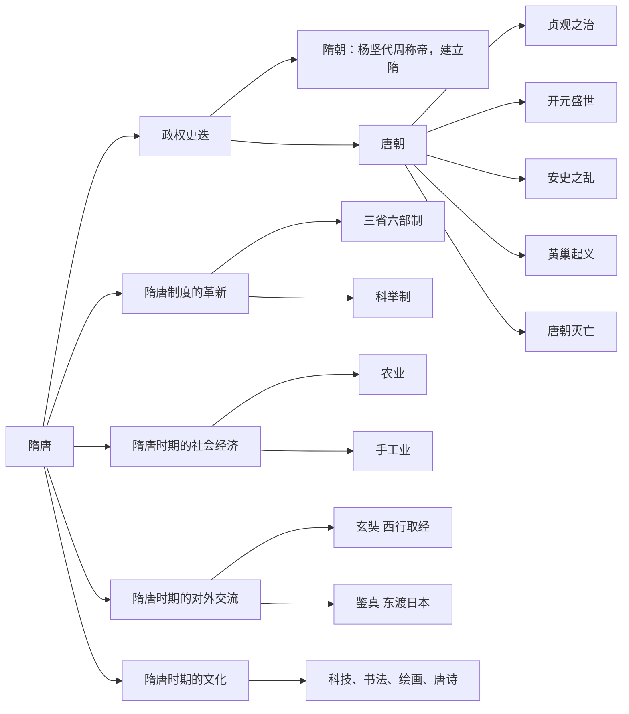
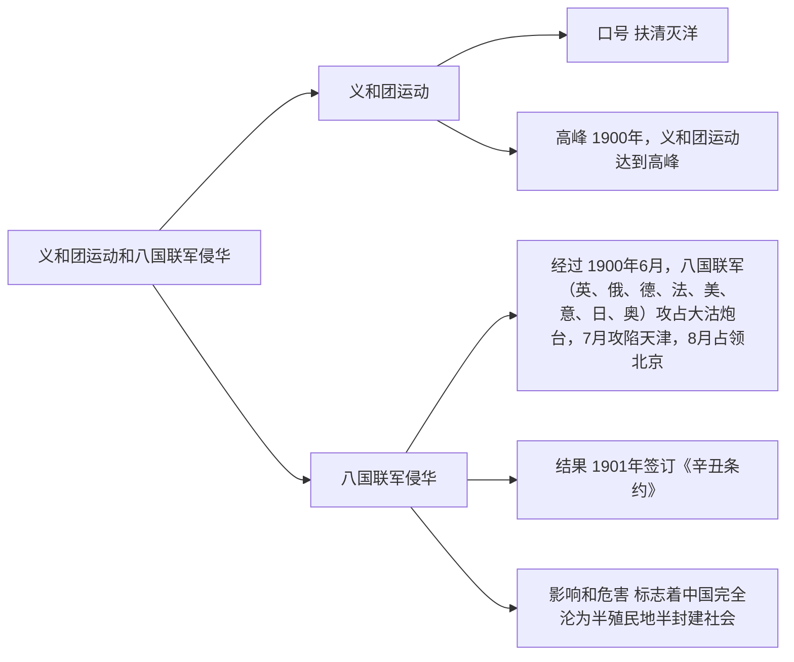
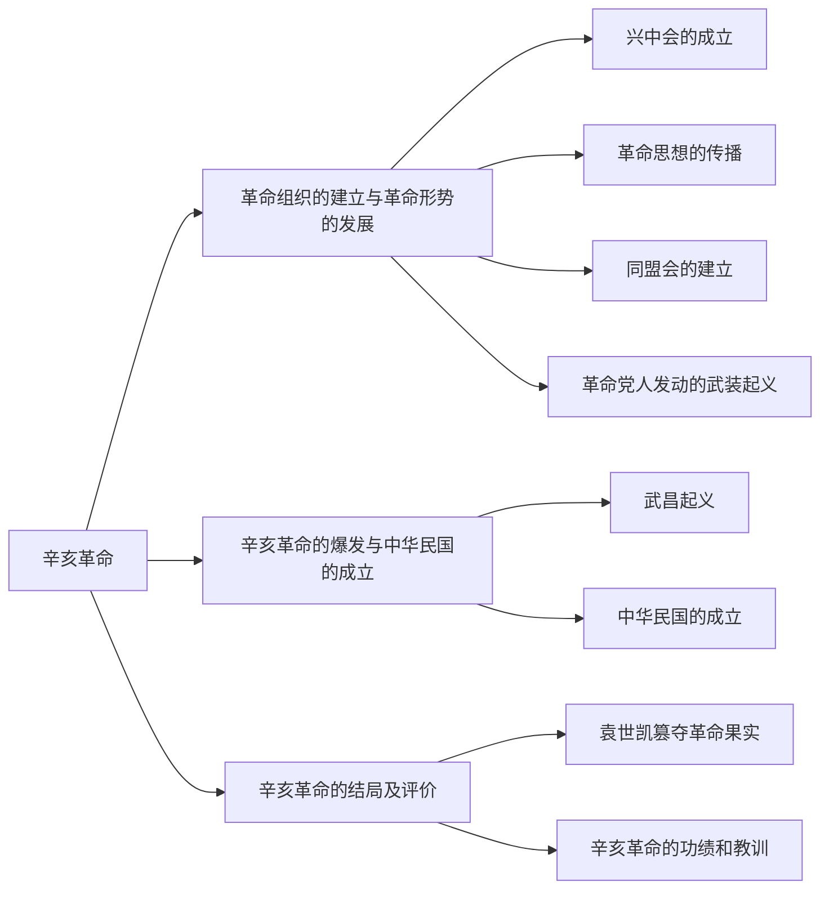
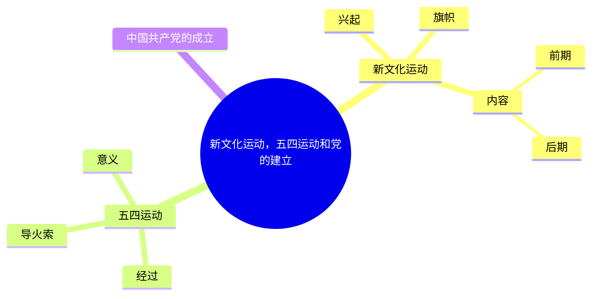
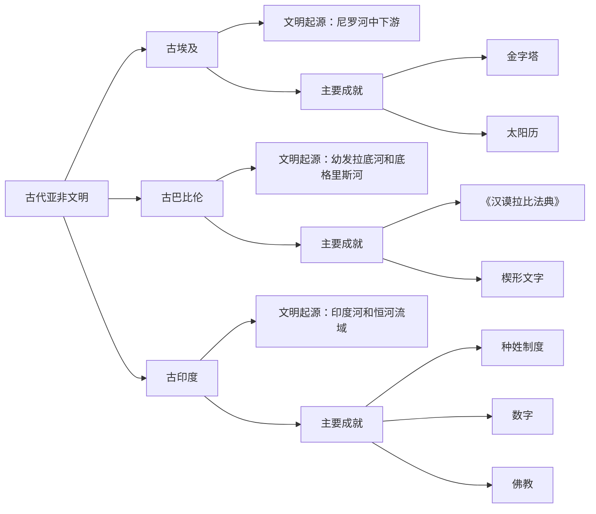
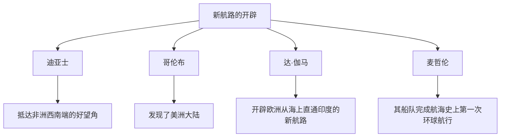
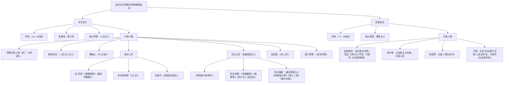

# 第七篇 文史知识

## 第一章 中国古代史

中国是世界上最早诞生文明的国家之一，有5000多年的历史。中国古代史包括以下三个阶段：原始社会、奴隶社会和封建社会。在数千年的历史长河中，中华民族以不屈不挠的顽强意志和勇于探索的聪明才智，创造了同期世界历史上极其灿烂的物质文明与精神文明。考生在学习中国古代史时，一定要把握历史发展的脉络，在理解的基础上精准记忆知识点，并注重平时的积累，同时也要克服畏难心理。中国古代史即便考查范围广、知识量大，但也是有重点可循的。

### 第一节 中国原始社会

**考情分析**

在公共基础知识的考试中，本节内容的考查概率较低，考点主要集中在我国古人类生活的时代及发现地点、中华人文始祖，考生对这几项考点予以了解即可。

**本节框架**

*   中国原始社会
    *   旧石器时代
        *   元谋人
        *   北京人
        *   山顶洞人
    *   新石器时代
        *   河姆渡文化
        *   半坡文化
        *   大汶口文化
        *   龙山文化
    *   远古传说
        *   炎黄联盟
        *   尧舜禹

**知识内容**

#### 一、我国境内的早期人类

**1. 元谋人**

我国历史悠久，是世界上发现早期人类化石和遗址最丰富的国家之一。我国境内目前已确认的最早的古人类是元谋人，他们生活的时代距今约170万年。

**2. 北京人**

发现于北京西南周口店龙骨山的北京人，距今约70万至20万年。他们结成群体生活在一起，共同进行获取食物的劳动。

**3. 山顶洞人**

距今约3万年，在北京人活动过的地区，又生活着一群远古人，因为其骨骼化石是在周口店龙骨山顶部的洞穴里发现的，因此被命名为“山顶洞人”。山顶洞人处在旧石器时代晚期，过着集体生活，共同劳动，共同分配食物，没有贫富贵贱的差别。

> **名师解读**
>
> 旧石器时代：元谋人和北京人已学会制造石器和使用火。北京人制作石器的技术比较成熟，采用不同的打制方法，制作成不同类型的工具。山顶洞人依然使用打制石器，但已掌握钻孔技术。使用这种打制石器的时代，被叫作“旧石器时代”。元谋人、北京人和山顶洞人都处在“旧石器时代”。

#### 二、原始农耕生活

**1. 河姆渡文化**

河姆渡文化是长江流域的新石器时代文化，距今约7000年。因第一次发现于浙江余姚的河姆渡村，故而命名。河姆渡原始居民已经开始种植水稻，房屋主要是干栏式建筑，以木桩插于地下，上面用木板等拼接成屋，是中国最早的木构建筑。

> **名师解读**
>
> 新石器时代：河姆渡原始居民已经普遍使用磨制石器，就是表面磨光的石器，比打制石器的形态、功能更精细。使用磨制石器的时代，叫作“新石器时代”。


**2. 半坡文化**

半坡文化属黄河中游地区新石器时代的仰韶文化，距今约6000年，发现于陕西西安半坡村。半坡原始居民掌握了种粟的技术，还种植蔬菜和麻，房屋主要是半地穴式圆形房屋，多用木头作柱子，屋内有灶坑。半坡人的生活用具主要是陶器，最具特色的为彩陶。

> **名师解读**
>
> 仰韶文化：仰韶文化是黄河中上游地区一种重要的新石器时代彩陶文化，距今约7000至5000年，从今天的甘肃省到河南省之间都有分布。因1921年首次在河南省渑池县仰韶村发现，故被称为“仰韶文化”。

**3. 大汶口文化**

距今5000年前后，山东大汶口文化农耕经济已经具有一定水平。这里的原始居民还从事原始手工业，会制作黑陶和白陶。其中黑陶乌黑光亮，工艺水平很高，是大汶口文化晚期典型器物。

**4. 龙山文化**

龙山文化泛指黄河中下游地区新石器时代晚期的文化遗存，源自大汶口文化，因首次发现于山东章丘龙山镇而得名，距今4000多年。这一时期，人们已经能够制作厚度不到1毫米的“蛋壳陶”。

#### 三、远古传说

**1. 炎黄联盟**

炎帝、黄帝是距今约四五千年黄河流域的部落联盟首领。炎帝部落与黄帝部落联合，与东方的蚩尤部落在涿鹿激战，最终打败了蚩尤。炎黄部落在黄河流域长期生息繁衍，构成后来华夏族的主体部分，因此后人尊崇炎帝和黄帝为中华民族的人文始祖。

相传在黄帝时期，仓颉创造文字，伶伦制作音律，隶首发明算盘，黄帝的妻子嫘祖会缫丝，擅长纺织。

**2. 尧舜禹的禅让**

尧、舜、禹是黄帝以后黄河流域的几位部落联盟的首领，当时实行禅让制，即将联盟首领的位置传给贤德之人。尧年老之时，召集部落首领，民主推举舜为继承人。舜年老时，又用同样方式让位给治水有功的禹。


#### 考点清单

**考点1——我国境内目前发现的最早的古人类：元谋人。**

**考点2——下列文化遗址位于黄河流域/长江流域的有哪些？**

位于黄河流域的有半坡文化（属于仰韶文化）、大汶口文化、龙山文化等。位于长江流域的有河姆渡文化等。

**\*易混易错**

| 古人类 | 发现地点 | 所处时代 | 社会阶段 |
| :--- | :--- | :--- | :--- |
| 元谋人 | 云南元谋县 | 旧石器时代 | 原始人群 |
| 北京人 | 北京周口店龙骨山 | 旧石器时代 | 原始人群 |
| 山顶洞人 | 北京周口店龙骨山顶部洞穴 | 旧石器时代 | 母系氏族社会 |
| 河姆渡人 | 浙江余姚 | 新石器时代 | 母系氏族社会 |
| 半坡人 | 陕西西安半坡村 | 新石器时代 | 母系氏族社会 |
| 大汶口人 | 山东泰安 | 新石器时代 | 父系氏族社会 |

#### 真题再现

1. （单选）在中国境内发现的最早的古人类是（    ）。
    A. 北京人
    B. 元谋人
    C. 山顶洞人
    D. 丁村人

【答案】B
【解析】本题考查人文历史，主要涉及我国境内原始人的相关知识。
A项错误，“北京人”生活在距今约70万至20万年，发现于北京周口店龙骨山。
B项正确，“元谋人”是目前我国境内发现的最早的古人类，约在170万年前，发现地点在云南元谋县上那蚌村西北小山岗上。
C项错误，“山顶洞人”是生活在约3万年前的晚期智人，因发现于北京周口店龙骨山顶部洞穴而得名。
D项错误，“丁村人”是发现于山西襄汾县丁村的早期智人，形态介于现代人和北京猿人之间，生存年代距今10万年左右，属于旧石器时代中期文化遗存。


故正确答案为B。

2. (单选)文字的产生因与原始宗教如卜筮一类活动有关，被赋予神秘的色彩，先秦诸子将文字的创造归功于（ ）。

   A. 祝融
   B. 仓颉
   C. 神农
   D. 毕昇

【答案】B

【解析】本题考查人文历史。

A项错误，祝融是三皇五帝时夏官火正的官名，历史上有多位著名的祝融被后世祭祀为火神灶神。

B项正确，相传仓颉是黄帝时期造字的左史官，仓颉仰观奎星环曲走势，俯察龟背纹理、鸟兽爪痕、山川形貌和手掌指纹，从中受到启迪，根据事物形状创造了象形文字。仓颉在汉字创造的过程中起了重要作用，被尊为“造字圣人”。

C项错误，神农，即炎帝，发明医药，制耒耜，种五谷，制作陶器，开辟集市，联合黄帝打败蚩尤。

D项错误，毕昇，我国北宋时期伟大的发明家。其发明的活字印刷术，比德国人谷腾堡发明金属活字印刷早400多年。

故正确答案为B。

3. (多选)在我国古文化中位于黄河流域的有（ ）。

   A. 仰韶文化
   B. 河姆渡文化
   C. 龙山文化
   D. 红山文化

【答案】AC

【解析】本题考查古文化。

A项正确，仰韶文化是我国新石器时代黄河流域两种重要文化之一。

B项错误，河姆渡文化在长江流域。

C项正确，龙山文化是我国新石器时代黄河流域两种重要文化之一。

D项错误，红山文化以辽河流域为中心。红山文化是距今五六千年间在燕山以北、大凌河与西辽河上游流域活动的部落集团创造的农业文化，因最早发现于内蒙古赤峰市郊的红山后遗址而得名。


故正确答案为 B。

2.（单选）文字的产生因与原始宗教如卜筮一类活动有关，被赋予神秘的色彩，先秦诸子将文字的创造归功于（）。
A.祝融  B.仓颉
C.神农  D.毕昇

【答案】B
【解析】本题考查人文历史。
A项错误，祝融是三皇五帝时夏官火正的官名，历史上有多位著名的祝融被后世祭祀为火神灶神。
B项正确，相传仓颉是黄帝时期造字的左史官，仓颉仰观奎星环曲走势，俯察龟背纹理、鸟兽爪痕、山川形貌和手掌指纹，从中受到启迪，根据事物形状创造了象形文字。仓颉在汉字创造的过程中起了重要作用，被尊为“造字圣人”。
C项错误，神农，即炎帝，发明医药，制耒耜，种五谷，制作陶器，开辟集市，联合黄帝打败蚩尤。
D项错误，毕昇，我国北宋时期伟大的发明家。其发明的活字印刷术，比德国人谷腾堡发明金属活字印刷早 400 多年。
故正确答案为 B。

3.（多选）在我国古文化中位于黄河流域的有（）。
A.仰韶文化  B.河姆渡文化
C.龙山文化  D.红山文化

【答案】AC
【解析】本题考查古文化。
A项正确，仰韶文化是我国新石器时代黄河流域两种重要文化之一。
B项错误，河姆渡文化在长江流域。
C项正确，龙山文化是我国新石器时代黄河流域两种重要文化之一。
D项错误，红山文化以辽河流域为中心。红山文化是距今五六千<unclear>间在燕山以北、大凌河与西辽河上游流域活动的部落集团创造的农业文化，因最早发现于内蒙古赤峰市郊的红山后遗址而得名。


故正确答案为 AC。

4.（判断）古代禅让制是一种典型的权力交接形式，如尧让舜、舜让禹。（）

【答案】正确
【解析】本题考查人文历史。
“禅让制”是我国原始社会后期，各部落首领民主推选部落联盟首领的制度。它实际上是以传贤为宗旨的民主选举首领制度，是一种权力交接形式。相传尧为部落联盟首领时，民主推举舜为继承人，舜后来又用同样方式，让位给治水有功的禹。
故表述正确。

#### 本节导图
```
中国原始社会
├─旧石器时代
│ ├─元谋人：距今约170万年，我国境内目前发现的最早的古人类
│ ├─北京人：距今约70万至20万年，北京周口店龙骨山
│ └─山顶洞人：距今约3万年，北京周口店龙骨山顶部洞穴
├─新石器时代
│ ├─河姆渡文化：距今约7000年，浙江余姚（长江流域），干栏式房屋
│ ├─半坡文化：距今约6000年，陕西西安半坡村（黄河流域），半地穴式圆形房屋、彩陶
│ ├─大汶口文化：距今5000年前后，山东泰安（黄河流域），黑陶和白陶
│ └─龙山文化：距今4000多年，山东章丘龙山镇（黄河流域）
└─远古传说
├─炎黄联盟
│ ├─涿鹿之战——炎黄战蚩尤
│ └─炎黄子孙
│ ├─仓颉创造文字，伶伦制作音律，隶首发明算盘
│ └─嫘祖养蚕缫丝
└─尧舜禹 禅让制 选贤与能
```


#### 拓展阅读
前文讲到了代表我国早期文明的重要遗址，除此之外，能够实证中华5000年文明史的文化遗址还有什么呢？

以良渚古城为核心的良渚遗址，位于浙江省杭州市余杭区，1936年首次发现。迄今为止，遗址考古发现非常丰富。良渚古城距今5300—4300年，为新石器时代晚期文化遗址。城内外祭坛上权贵们的墓地里，随葬着数十件至数百件数量不等、制作精美的玉器，包括祭祀神灵用的玉琮、玉璧和象征军事指挥权的玉钺，这说明当时的社会阶级分化已经相当明显。良渚古城的考古发现证实，距今5000年左右，长江下游地区已经出现早期国家，进入了文明社会，成为中华5000年文明的实证。2019年7月6日，良渚古城遗址被列入《世界遗产名录》。至此，我国世界遗产总数达55处，居世界第一。

### 第二节 夏、商与西周

**考情分析读**
在公共基础知识的考试中，本节内容的考查概率较低，考点主要集中在这一时期的重要制度、战役、文化（青铜器和甲骨文），考生对这几项考点要充分复习。

**本节框架**
```
夏、商与西周
├─夏、商与西周的更替
│ ├─夏朝：禹建立夏朝；汤伐桀，夏朝灭亡
│ ├─商朝：汤建立商朝；武王伐纣，商朝灭亡
│ └─西周：周武王建立周朝，史称西周；犬戎攻破镐京，杀死周幽王，西周灭亡
├─西周的制度
│ ├─分封制
│ ├─宗法制
│ └─井田制
└─夏、商与西周的文化
├─青铜器
└─甲骨文和金文
```


**知识内容**
#### 一、夏、商与西周的更替
1. **夏朝**
约公元前 2070 年，禹建立夏朝。禹死后，他的儿子启登上王位，“公天下”变为“家天下”，王位世袭制代替了禅让制。

夏朝是我国第一个奴隶制王朝。夏朝建立了最早的国家机器，设置了官职、监狱，制定了刑法，国家机构初具规模。中国自此进入了奴隶社会。

夏朝最后一个王桀，暴虐无道，狂妄自大。约公元前 1600 年，黄河下游的商部落，在首领汤的率领下，发兵讨桀，大败夏兵，夏朝灭亡。

**名师解读**

>- **世袭制**：“世袭制”是“禅让制”或“选举制”的对称，指的是国家君主和皇室贵族的职位不经过民主选举，而直接按血统亲族，依法世代相传，比如父死子继、兄终弟及都属于世袭制。
>- **奴隶制**：奴隶制是人类历史上第一个人剥削人的制度，奴隶主占有生产资料和奴隶。传说中的尧、舜、禹时代，正是我国原始社会向奴隶社会过渡的时期。氏族、部落首领逐步转变为有权势的氏族贵族和奴隶主，一些贫苦氏族成员和战俘沦为奴隶，形成奴隶主和奴隶两个阶级。

2. **商朝**
汤灭夏后建立了商朝，建都在亳。商朝前期屡次迁都。商朝中期，商王盘庚把都城迁到殷（今河南安阳），从此稳定下来，因此商朝又称殷朝、殷商。

商朝最后一个王纣，是有名的暴君。他修建很多宫殿苑囿（鹿台），终日饮酒作乐（酒池肉林），还作炮烙之刑残害人民。他的统治最终引起不满，周武王趁商朝内乱，联合其他部落讨伐商纣，史称“武王伐纣”。公元前 1046 年，双方在商都郊外牧野展开激战，纣王临时凑集的部队临阵倒戈，引导周军攻进商都，纣王自焚而死，商朝灭亡。

3. **西周**
商朝灭亡后，周武王建立周朝，定都镐京（今陕西西安），史称西周。


#### 三、夏、商与西周的文化

**1. 青铜器**

夏、商、周三代被称为我国的"青铜时代"，尤其是商和西周两朝，青铜铸造艺术达到高峰。商朝青铜器不仅形制雄伟，而且工艺精湛，代表作有后母戊鼎和四羊方尊。

> **☆ 名师解读**
>
> 后母戊鼎（曾称"司母戊鼎"）出土于河南安阳，重 832.84 千克，是目前已知中国古代最大、最重的青铜器，腹内壁铸有"后母戊"，是商王母亲的庙号。
>
> 四羊方尊出土于湖南宁乡，造型雄奇，在现存商代青铜方尊中体形最大。

**2. 甲骨文和金文**

甲骨文是我国目前发现的最早的、系统的成熟文字，因刻写在龟甲和兽骨上，故称为"甲骨文"，也叫"契文"，清朝末年在河南殷墟发现。这些甲骨文是商朝占卜的记录。商朝人迷信鬼神，不论祭祀、战争，还是渔猎、农事，都要进行占卜，并将所得结果刻录在龟甲和兽骨上，故甲骨文也叫"甲骨卜辞"。2017 年，我国申报的甲骨文成功入选《世界记忆名录》。

金文是铸刻在青铜器上的文字，又称为"钟鼎文"。商朝的青铜器上文字很少，西周青铜器有长篇铭文出现，至今出土的最长的铭文刻在周宣王时代的毛公鼎上，字数近五百个。

 #### **考点清单**
>
> 考点 1——王位世袭制取代禅让制的标志：禹死启继。
>
> 考点 2——牧野之战：①战役的时间（商朝末年）；②交战双方（武王伐纣）；③战役的结果（商朝灭亡）；④战役中的典故（临阵倒戈）。
>
> 考点 3——分封制、宗法制和井田制：①制度的含义和特点；②制度施行的朝代。
>
> 考点 4——我国目前发现的最早的成熟文字：甲骨文。
>
> \* 易混易错——这里要注意区分与周朝几位君主相关的历史典故：
>
> 周武王——临阵倒戈（牧野之战）。
>
> 周厉王——道路以目（国人暴动）。
>
> 周幽王——烽火戏诸侯。


#### 真题再现

1.（单选）史学界一般把哪一件事作为王位世袭制取代原始社会后期的禅让制的标志？（　　）

A. 舜承尧位

B. 禹建夏朝

C. 禹死启继

D. 盘庚传弟

**【答案】C**

**【解析】** 本题考查历史常识。

禅让制，实际上是以传贤为宗旨的民主选举首领制度。世袭制是指权力一代继一代地保持在某个血缘家庭中的一种社会概念。王位在一家一姓中传承，这是王位世袭制的主要特点。由禅让制到世袭制，血缘关系和宗族纽带起到了越来越大的作用，占的地位越来越重要。世袭制取代禅让制，标志着部落分散统治的结束和奴隶制国家的诞生。

A 项错误，尧是黄帝以后比较著名的部落联盟首领，尧年老后，把部落联盟首领位置让给舜，推舜为帝。这种让位，历史上称为"禅让"。

B 项错误，约公元前 2070 年，禹建立了我国历史上第一个王朝——夏朝，开始了中国古代早期政治制度。该事件并不是王位世袭制取代原始社会后期的禅让制的标志。

C 项正确，夏禹死后，禹的儿子启继位，以前的禅让制度被代替，变成王位世袭制，并在以后历代相沿。

D 项错误，盘庚传弟是指商朝的君主盘庚传位给自己的弟弟，这是世袭制度的一种形式——兄终弟及。其发生在禹死启继之后，并不是王位世袭制取代原始社会后期的禅让制的标志。

故正确答案为 C。

2.（单选）（　　）是中国的一种古老文字，又称"契文"，是汉字的早期形式，也是现存中国商朝时期一种成熟文字。

A. 甲骨文

B. 楔形文字

C. 金文

D. 梵文

**【答案】A**

**【解析】** 本题考查文字常识，主要是汉字。

A 项正确，甲骨文，是中国的一种古老文字，又称"契文""甲骨卜辞""殷墟文


字""龟甲兽骨文"，主要指中国商朝晚期王室用于占卜记事，而在龟甲或兽骨上镌刻的文字，是中国及东亚已知最早的成体系的文字。甲骨文，是中华道统的文字之一。

B 项错误，楔形文字，是由苏美尔人所创，属于象形文字。

C 项错误，金文是中国古代的一种书体名称，指的是铸造在殷周青铜器上的铭文，也叫钟鼎文。

D 项错误，梵文是印度古代的一种语言文字。

故正确答案为 A。

3.（单选）迄今发现的世界上最大的青铜器是（　　）。

A. 陶鹰鼎

B. 大盂鼎

C. 铸客大铜鼎

D. 司母戊鼎

**【答案】D**

**【解析】** 本题考查人文历史。

司母戊鼎，又称后母戊鼎，全称为后母戊大方鼎，1939 年 3 月在河南安阳出土，相传是商王为祭祀其母戊所制，是商周时期青铜文化的代表作，现藏于中国国家博物馆。司母戊鼎是迄今世界上出土最大、最重的青铜礼器，享有"镇国之宝"的美誉。现为国家一级文物，2002 年列入禁止出国（境）展览文物名单。

故正确答案为 D。

4.（单选）《说文解字》解释说："宗，尊祖庙也。"即宗法制的"宗"本意是指宗庙，可见西周宗法制是以什么关系为纽带？（　　）

A. 财产

B. 地域

C. 信仰

D. 血缘

**【答案】D**

**【解析】** 本题考查人文历史。

宗法制是用规定宗族内嫡庶系统的办法，来确立和巩固父系家长在本宗族中的地位，最终以保证王权的稳定的制度。宗法制的特点是嫡长子继承制，利用父系血缘关系的亲疏来决定土地、财产和政治地位的分配与继承。宗法制把血缘纽带同政治关系结合起来，"家"和"国"密切结合。

故正确答案为 D。

#### **本节导图**

```
夏、商与西周
    ├── 夏、商与西周的更替
    │   ├── 夏朝
    │   │   ├── 建立者 禹
    │   │   ├── 世袭制代替禅让制 禹死启继
    │   │   └── 我国第一个奴隶制王朝
    │   ├── 商朝
    │   │   ├── 建立者 汤
    │   │   ├── 都城 盘庚迁殷（今河南安阳）
    │   │   └── 武王伐纣 牧野之战（临阵倒戈）
    │   └── 西周
    │       ├── 建立者 周武王
    │       └── 国人暴动 道路以目；防民之口，甚于防川
    ├── 西周的制度
    │   ├── 分封制 西周分封诸侯的制度
    │   ├── 宗法制 用父系血缘关系的亲疏来分配国家权力，核心是嫡长子继承制
    │   └── 井田制 周王把土地分赐给诸侯臣下，耕地阡陌纵横，如同井字
    └── 夏、商与西周的文化
        ├── 青铜器
        │   ├── 后母戊鼎 目前已知中国古代最大、最重的青铜器
        │   └── 四羊方尊 在现存商代青铜方尊中体形最大
        └── 甲骨文和金文
            ├── 甲骨文 我国目前发现的最早的、系统的成熟文字
            └── 金文 铸刻在青铜器上的文字，又称为"钟鼎文"
```

### 第三节　春秋战国

 **考情分析**

在公共基础知识的考试中，本节内容的考查概率较高，考点主要集中在春秋五霸、变法、战役、诸子百家、文化成就等，考生对这几项考点要充分复习。

 **本节框架**

```
春秋战国
    ├── 春秋
    │   └── 春秋五霸 齐桓公、晋文公、楚庄王、吴王阖闾、越王勾践
    ├── 战国
    │   ├── 战国七雄 齐、楚、秦、燕、赵、魏、韩
    │   └── 著名战役
    │       ├── 桂陵之战
    │       ├── 马陵之战
    │       └── 长平之战
    ├── 社会经济和社会变革
    │   ├── 铁器时代、水利灌溉
    │   └── 管仲改革、初税亩、李悝变法、商鞅变法
    └── 文化
        └── 百家争鸣、文学、科技、史学
```


 **知识内容**

公元前 771 年，犬戎族攻破镐京，西周灭亡。第二年，周平王迁都洛邑，史称东周。后世又将东周分为春秋和战国。这一时期，社会动荡、民族融合，奴隶制度逐渐瓦解，封建制度逐步建立。

#### 一、春秋

春秋五霸：齐桓公、晋文公、楚庄王、吴王阖闾、越王勾践。

**1. 齐桓公**

齐桓公用管仲为相，改革政治、经济、军事，并打着"尊王攘夷"的口号，联合黄河中游诸侯国，北御夷狄，南制楚蛮。公元前 7 世纪中期，齐桓公在葵丘会盟，成为春秋时期的第一个霸主。

**2. 晋文公**

晋国在城濮之战中，退避三舍，大败楚国，晋文公成为中原霸主。

> **☆ 名师解读**
>
> 退避三舍：古代一舍三十里，三舍即九十里。晋文公在城濮之战中遵守承诺，主动退让九十里，楚将骄傲自大，最终晋军大败楚军。

**3. 楚庄王**

相关典故：一鸣惊人、问鼎中原。

**4. 吴王阖闾**

吴王阖闾以楚国旧臣伍子胥为相，以齐人孙武为将军，成为长江中下游的霸主。

**5. 越王勾践**

越王勾践卧薪尝胆，立志复国，终于灭了吴，成为春秋时期的最后一个霸主。

#### 二、战国

**1. 战国七雄**

三家分晋和田氏代齐后，形成了战国七雄争霸的格局。"七雄"指齐、楚、秦、燕、赵、魏、韩七个强盛的诸侯国。


**☆名师解读**

**三家分晋**：晋国被韩、赵、魏三家瓜分。
**田氏代齐**：齐国的大夫田氏废掉原来的国君姜氏而成为诸侯。

2. 战国时期的著名战役

| 主要战役 | 交战国家 | 典故 |
| --- | --- | --- |
| 桂陵之战 | 魏（庞涓）、赵、齐（孙膑） | 围魏救赵 |
| 马陵之战 | 魏（庞涓）、韩、齐（孙膑） | 减灶诱敌 |
| 长平之战 | 秦（白起）、赵（赵括） | 纸上谈兵 |

#### **三、春秋战国时期的社会经济和社会变革**

**(一) 社会经济**
春秋时期，铁农具开始出现。战国时期，铁农具使用范围扩大。铁器时代的到来，标志着我国社会生产力的显著提高。
春秋战国时期水利灌溉事业有很大发展。春秋时楚相孙叔敖修的芍陂，战国时秦国蜀郡太守李冰修的都江堰，水工郑国在秦修的郑国渠，都是著名的水利工程。

**☆名师解读**
芍陂在今安徽寿县，灌溉面积一万多顷。都江堰在今四川都江堰市，它的修建，使成都平原从此成为“天府之国”。郑国渠由韩国水工郑国在泾渭水系修建，使关中平原成为沃野。

**(二) 改革变法**
**1. 春秋时期**
(1) **管仲改革**：齐桓公任用管仲为相，进行改革，其中一条重要举措为“相地而衰征”，是指根据土地多少和田质好坏征收赋税。
(2) **“初税亩”**：公元前 6 世纪初鲁国的“初税亩”，开始实行按亩征税，这是承认私有土地合法化的开始。


**2. 战国时期**
(1) **李悝变法**：战国初期，魏国国君魏文侯任用李悝为相，实行变法。李悝提出“尽地力之教”，发展农业生产，并制定了中国历史上第一部比较系统的成文法典——《法经》。
(2) **商鞅变法**：战国时期，秦孝公时的商鞅变法较为彻底。在公元前 356 年和公元前 350 年，商鞅先后两次实行变法，其主要内容有：废井田，开阡陌；重农抑商，奖励耕织；按军功授爵，贵族无军功不再受爵；实行连坐法；等等。商鞅变法废除了奴隶主贵族的世袭特权，促进了封建经济的发展，加强了新兴地主阶级的中央集权，使秦国逐步强盛起来，为后来秦统一六国奠定了基础。

#### **四、春秋战国时期的文化**

**1. 百家争鸣**

| 学派 | 代表人物 | 时期 | 相关作品 | 核心思想 |
| --- | --- | --- | --- | --- |
| **儒家** | 孔子 | 春秋 | 《论语》 | 以“仁”为核心，提出“仁者爱人”“己所不欲，勿施于人”；主张“为政以德”，反对苛政；维护周礼，主张贵贱有序；兴办私学，主张“有教无类”，打破“学在官府”的局面 |
| | 孟子 | 战国 | 《孟子》 | 主张施行“仁政”，提出“民贵君轻”“政在得民”的思想；主张“性善论” |
| | 荀子 | 战国 | 《荀子》 | 认为自然有自己的规律，提出“天行有常”和“制天命而用之”；主张“性恶论”，强调后天环境和教育对人的影响 |
| **道家** | 老子 | 春秋 | 《道德经》 | 认为“道”是天地万物的本原，提出“天法道，道法自然”；政治上主张“无为而治”，反对采用严刑峻法；具有朴素的辩证法思想，如“有无相生，难易相成”“祸兮，福之所倚；福兮，祸之所伏” |
| | 庄子 | 战国 | 《庄子》 | 政治上主张治国顺应民心；人生观上认为应追求精神的自由，保持独立的人格；鄙视富贵利禄，痛恨“窃钩者诛，窃国者为诸侯”的不公平社会现象 |


| **法家** | 韩非子 | 战国 | 《韩非子》 | 法家思想的集大成者。他认为历史向前发展，当代胜过古代，提倡改革；主张“以法为本”来治国，“法不阿贵”；主张“法、术、势”相结合，树立君主权威，建立中央集权专制统治 |
| **墨家** | 墨子 | 战国 | 《墨子》 | 主张“兼爱”，即爱一切人，不分阶级差别；“非攻”，反对不义战争；“尚贤”，主张任人唯贤 |
| **兵家** | 孙武 | 春秋 | 《孙子兵法》 | 其著作《孙子兵法》是世界上最早的兵书 |

**☆名师解读**
《论语》：孔子弟子及再传弟子记录孔子及其弟子言行而编成的语录集，非孔子本人所写。

**2. 文学**
《诗经》和《楚辞》是我国文学史上的两座高峰，分别开创了现实主义和浪漫主义的诗风。
(1) 《诗经》是我国第一部诗歌总集，收录了西周初年至春秋中叶的诗歌共 305 篇，又称《诗三百》。《诗经》在内容上分为风、雅、颂三个部分，在表现手法上分为赋、比、兴，合称“六义”。
(2) “楚辞”是战国时期楚国诗人屈原采用楚国方言，利用南方民歌的形式，创造出的一种新的诗歌体裁。他写了许多优秀诗篇，以《离骚》最为有名。西汉刘向收录屈原、宋玉及汉代东方朔、王褒等人的辞赋作品，编辑成作品集《楚辞》。

**☆名师解读**
六义：诗经学名词。风是周朝时各诸侯国的民歌，统称“国风”，是最精华的部分；雅是西周的宫廷乐曲歌辞；颂是宗庙祭祀的舞曲。赋就是铺陈直叙，即诗人把思想感情及其有关的事物平铺直叙地表达出来；比就是打比方，以彼物比此物，借一个事物来作比喻；兴就是借助其他事物为所咏内容做铺垫。

**3. 科技**
(1) **医学**：战国名医扁鹊采用“望、闻、问、切”四诊法诊断疾病，被后世医家奉为“脉学之宗”。


(2) **天文**：①《春秋》记载，公元前 613 年，“有星孛入于北斗”，这是世界上公认的首次关于哈雷彗星的确切记录；②战国时期的《甘石星经》，是世界上最早的天文学著作。
(3) **物理**：《墨经》是《墨子》内容的一部分，涉及大量的物理学知识，其中包括杠杆原理，还有声学和光学的记载。关于光影关系、小孔成像等，写得很系统，被称为“光学八条”。

**4. 史学**
(1) 《春秋》：周朝时期鲁国的国史，据说由孔子修订而成，是我国现存最早的编年体史书。
(2) 《左传》：为《春秋》做注解的一部史书，旧传为春秋时左丘明所撰，与《公羊传》《穀梁传》合称“春秋三传”，是我国第一部叙事详细的编年体史书。
(3) 《国语》：我国第一部国别体史书，记录了周朝王室和鲁国、齐国、晋国、郑国、楚国、吴国、越国等诸侯国的历史。
(4) 《战国策》：西汉刘向编订的一部国别体史书，主要记述了战国时期纵横家的政治主张和策略，也有一些战国史事的记载。

**名师解读**
**编年体**：以年代、时间为线索编排有关历史事件的史书体例。
**国别体**：以国家为单位，分别记叙历史事件的史书体例。

#### **考点清单**

**考点 1** ——与春秋五霸相关的人物、事件与典故。
**考点 2** ——战役发生的时间、交战双方与典故。
**考点 3** ——诸子百家各派的思想或名言。
**考点 4** ——《诗经》：①第一部现实主义诗歌总集；②诗六义。
**考点 5** ——扁鹊：①战国名医；②“四诊法”；③脉学之宗。
* 易混易错 ——一定记住，世界上最早的兵书是春秋时期孙武的《孙子兵法》，与它很相似的是战国时期孙膑的《孙膑兵法》，要区分开来。

#### 真题再现

1. (单选) 春秋时期，辅佐齐桓公成为五霸之首，主张“德义未明于朝者，则不可加于尊位；功力未见于国者，则不可授以重禄；临事不信于民者，则不可使任大官”的用人原则的名相是 (   )。
A. 商鞅
B. 管仲
C. 郭隗
D. 范蠡

**【答案】 B**
**【解析】** 本题考查人文历史。
《管子·立政》中写道：“德义未明于朝者，则不可加于尊位；功力未见于国者，则不可授以重禄；临事不信于民者，则不可使任大官。”管仲是我国古代重要的政治家、军事家、道法家，后世尊称为“管子”，誉为“法家先驱”“圣人之师”“华夏文明保护者”“华夏第一相”。
故正确答案为 B。

2. (单选) 在春秋战国时期，各种思想学术流派的成就形成了诸子百家争鸣的繁荣局面。下列观点言论与人物对应错误的是 (   )。
A. 青，取之于蓝，而青于蓝——孔子
B. 老吾老以及人之老，幼吾幼以及人之幼——孟子
C. 祸兮，福之所倚；福兮，祸之所伏——老子
D. 天下兼相爱则治，交相恶则乱——墨子

**【答案】 A**
**【解析】** 本题考查人文知识。
A 项错误，“青，取之于蓝，而青于蓝”语出荀子的《劝学》，而非孔子。这句话说的是靛青从蓝草中取得，颜色却比蓝草更深。比喻学生如果能用功研究学问，坚持不懈地努力，就可以比他的老师更有成就。
B 项正确，“老吾老以及人之老，幼吾幼以及人之幼”出自《孟子·梁惠王上》一文，指的是在赡养孝敬自己的长辈时不应忘记其他与自己没有亲缘关系的老人，在抚养教育自己的小孩时不应忘记其他与自己没有血缘关系的小孩。
C 项正确，“祸兮，福之所倚；福兮，祸之所伏”出自《道德经》。《道德经》是春...


秋时期老子的哲学作品，也称《老子》。该句表明福与祸并不是绝对的，它们相互依存，互相转化。

D项正确，“天下兼相爱则治，交相恶则乱”出自《墨子·兼爱上》，意思是说天下人相亲相爱社会就能治理好，相互仇恨就必然导致混乱。

本题为选非题，故正确答案为A。

3.（单选）中医的“望闻问切”四诊法起源于战国时期，其发明者（ ）被后世尊为“脉学之宗”。
A. 华佗
B. 扁鹊
C. 张仲景
D. 孙思邈
【答案】B
【解析】本题考查人文历史。
A项错误，华佗，东汉著名医学家，字元化，沛国谯（今安徽亳县）人。华佗精通内、外、妇、儿、针灸各科，对外科手术尤其擅长，发明麻沸散进行麻醉，仿虎、鹿、熊、猿、鸟五种动物的活动姿态，创“五禽戏”以锻炼身体。
B项正确，扁鹊，战国时期著名医学家，姓秦，名越人。因其医术高超，与传说中的神医扁鹊相似，故人们称其为“扁鹊”。扁鹊发明“望闻问切”四诊法，用“针”“石”“熨”等医疗器械治病，通内、妇、儿、五官等科，被后世尊为“脉学之宗”。
C项错误，张仲景，东汉著名医学家，姓张，名机，撰写的《伤寒杂病论》奠定了中医辨证施治理论体系。张仲景创立六经辨证学说，广泛使用汤剂，被历代医家尊为“医圣”。
D项错误，孙思邈，唐代著名医药学家，代表作有《千金要方》《千金翼方》等。孙思邈在药学方面贡献巨大，被后世尊为“药王”。
故正确答案为B。

4.（单选）下列三部著作成书的先后顺序是（ ）。
A.《诗经》—《论语》—《春秋》
B.《诗经》—《春秋》—《论语》
C.《春秋》—《诗经》—《论语》
D.《春秋》—《论语》—《诗经》
【答案】B
【解析】本题考查人文历史。


《诗经》是中国古代诗歌的开端，是我国最早的一部诗歌总集，收集了从西周初年（公元前11世纪）到春秋中叶（公元前6世纪）约500年间的诗歌305篇。
《春秋》相传为孔子依据鲁国史官所编《春秋》加以整理修订而成，是春秋时期鲁国的史记。《春秋》所记之事起于鲁隐公元年（公元前722年），止于鲁哀公十四年（公元前481年，已属春秋末期）。
《论语》是记载中国古代著名思想家孔子及其弟子言行的语录，由孔子的弟子及其再传弟子编写。
故以上三部作品成书的先后顺序是《诗经》—《春秋》—《论语》。
故正确答案为B。

5.（多选）下列选项中，关于《诗经》表述正确的有（ ）。
A. 我国现实主义文学的源头
B. 按乐调分为风、雅、颂三类
C. 国风指地方乐调及各地的民乐
D. 主要采用赋、比、兴的艺术表现手法
【答案】ABCD
【解析】本题考查人文历史。
A项正确，《诗经》收录了西周至春秋时期305篇诗歌，距今已经有3000多年，是我国第一部诗歌总集，同时也是我国现实主义文学的源头。
B项正确，《诗经》按乐调可分为风、雅、颂三类。“风”是各诸侯国的乐调，“雅”是宗周地区的正乐，“颂”是宗庙祭祀之乐。
C项正确，《诗经》收录了十五个诸侯国的民间歌曲，国风是反映当时周代各诸侯国人民风俗、生活特色的诗作，反映了劳动人民真实的生活，表达了他们对受剥削、受压迫的处境的不平和争取美好生活的信念。
D项正确，《诗经》的艺术表现手法被总结成“赋、比、兴”。赋是平铺直叙，非常直白地讲述一件事；比是比喻，是《诗经》使用最多的一种表现手法；兴是起兴，即说一件事不直接说，而是先描写其他事情。
故正确答案为ABCD。


#### 本节导图
- 春秋
  - 春秋五霸 齐桓公、晋文公、楚庄王、吴王阖闾、越王勾践
  - 齐桓公
    - 春秋时期的第一个霸主
    - 管仲：尊王攘夷
    - 葵丘会盟
  - 晋文公 城濮之战（退避三舍）
  - 楚庄王 一鸣惊人；问鼎中原
  - 越王勾践 卧薪尝胆
- 战国
  - 战国七雄 齐、楚、秦、燕、赵、魏、韩
  - 著名战役
    - 桂陵之战——围魏救赵（孙膑）
    - 马陵之战——减灶诱敌（孙膑）
    - 长平之战——纸上谈兵（赵括）
- 社会经济和社会变革
  - 社会经济
    - 铁器时代
    - 芍陂（孙叔敖）、都江堰（李冰）、郑国渠（郑国）
  - 社会变革
    - 春秋
      - 齐国管仲改革——“相地而衰征”
      - 鲁国“初税亩”——开始实行按亩征税
    - 战国
      - 魏国李悝变法——《法经》（中国历史上第一部比较系统的成文法典）
      - 秦国商鞅变法——废井田，开阡陌；重农抑商，奖励耕织；按军功授爵；实行连坐法；等等
- 文化
  - 百家争鸣
    - 儒家
      - 孔子
        - 著作《论语》（弟子）
        - 思想 仁，“为政以德”
        - 教育 兴办私学，有教无类
      - 孟子
        - 著作《孟子》
        - 思想 仁政，民贵君轻，性善论
      - 荀子
        - 著作《荀子》
        - 思想“天行有常”“制天命而用之”，性恶论
    - 道家
      - 老子
        - 著作《道德经》
        - 思想 道，无为而治，辩证法
      - 庄子
        - 著作《庄子》
        - 思想 精神自由，“窃钩者诛，窃国者为诸侯”
    - 法家 韩非子
      - 著作《韩非子》
      - 思想 提倡法治，中央集权，变法革新
    - 墨家 墨子
      - 著作《墨子》
      - 思想 兼爱，非攻，尚贤
    - 兵家 孙武 著作《孙子兵法》是世界上最早的兵书

- 春秋战国
  - 文化
    - 文学
      - 《诗经》 我国第一部（现实主义）诗歌总集，共305篇
        - 诗六义：风、雅、颂、赋、比、兴
      - 楚辞
        - “楚辞”：楚国诗人屈原创制的一种诗歌体裁
        - 《楚辞》：西汉刘向编辑整理的诗歌集
    - 科技
      - 医学 战国名医扁鹊 “望闻问切”四诊法；脉学之宗
      - 天文
        - 世界上公认的首次关于哈雷彗星的确切记录记载于《春秋》
        - 《甘石星经》是世界上最早的天文学著作
      - 物理 《墨经》“光学八条”（小孔成像）
    - 史学
      - 《春秋》：我国现存最早的编年体史书
      - 《左传》：我国第一部叙事详细的编年体史书
      - 《国语》：我国第一部国别体史书
      - 《战国策》：西汉刘向编订的一部国别体史书

#### 拓展阅读
儒家思想是两千多年来中国传统文化的主流，随着时代的发展不断进行演变。
（1）西汉时期：董仲舒以儒学为基础，兼采诸子百家，建立起新儒学，其核心是“天人感应”“君权神授”。董仲舒认为，人君受命于天进行统治，如果人君无道，天就会降下灾祸来警告。
（2）两宋时期：主要的哲学思想是程朱理学，“程”是北宋哲学家程颢、程颐，“朱”是南宋哲学家朱熹。朱熹作为理学的集大成者，完善发展了客观唯心主义的思想体系，提出“存天理，灭人欲”。朱熹将《礼记》中《大学》《中庸》两篇单独拿出，与《论语》《孟子》一起编订并进行注解，编注成《四书集注》，始有“四书”之名。
（3）明朝中期：心学的代表人物王阳明，主张“心外无物，心外无理”，提出“致良知”“知行合一”。

### 第四节 秦朝
**考情分析**
在公共基础知识的考试中，本节内容的考查概率较低，考点主要集中在秦朝制度、秦末战争、楚汉之争等，考生对这几项内容了解即可。

**本节框架**

- 秦朝
  - 秦朝的建立 秦王嬴政统一六国
  - 专制主义中央集权制度的建立
    - 政治方面
    - 经济方面
    - 文化方面
  - 秦末农民战争
    - 陈胜、吴广起义
    - 刘邦、项羽反秦斗争
  - 楚汉之争 项羽（西楚霸王）vs 刘邦（汉王）

**知识内容**

#### 一、秦朝的建立
公元前230年至公元前221年，秦王嬴政先后灭韩、赵、魏、楚、燕、齐六国，完成统一，建立起我国历史上第一个统一的中央集权的封建国家——秦朝，定都咸阳。秦朝疆域东临东海，西到陇西，南濒南海，北抵长城一带，此范围内生活着两千多万人。

#### 二、专制主义中央集权制度的建立
为巩固统治，秦朝颁布了一系列旨在加强中央集权的政策措施，主要内容包括：
1. 政治方面
（1）确立皇帝制度。
（2）建立从中央到地方的官制。
在中央，设三公九卿。三公指丞相、太尉、御史大夫。丞相帮助皇帝处理全国的政事；太尉负责管理军事；御史大夫执掌群臣奏章，下达皇帝诏令，兼理国家监察事务。九卿是丞相之下设的诸卿，分别掌管国家的各项具体事务。
在地方，废除分封制，实行郡县制。
2. 经济方面
统一货币，统一度量衡。

** 名师解读**

度量衡是我国古代使用的计量单位，其中“度”指长度单位，“量”指容积单位，“衡”指重量单位。

**3. 文化方面**

统一文字（小篆），焚书坑儒。

**名师解读**

秦始皇统一六国之后，有感于全国文字的繁杂和书体的不一，于是提出“书同文”，并命令擅长书法的李斯去做这项工作。李斯在秦国原来使用的大篆籀文的基础上进行简化，形成了小篆，故李斯被称为“小篆之祖”。后来，社会上又流行一种更加简易的字体——隶书。

#### 三、秦末农民战争

**1. 陈胜、吴广起义**

公元前 209 年，陈胜、吴广率领九百多戍卒，在大泽乡发动了中国历史上第一次大规模的农民起义，高呼“王侯将相宁有种乎”。

**2. 刘邦、项羽反秦斗争**

公元前 207 年，项羽在巨鹿之战中，破釜沉舟，消灭了秦军主力。之后刘邦攻占咸阳，秦朝灭亡。

#### 四、楚汉之争

（1）秦亡，项羽自称西楚霸王，封刘邦为汉王。公元前 206 年至公元前 202 年，刘邦和项羽前后进行了四年争夺统治权的战争，史称“楚汉之争”。

（2）垓下之战。公元前 202 年初，刘邦采用韩信十面埋伏的计策，将项羽围困至垓下。项羽在四面楚歌中溃散而逃，后突围至乌江自刎。

####  考点清单

考点1——秦灭六国的顺序：韩、赵、魏、楚、燕、齐

考点2——三公九卿制中的三公：丞相、太尉、御史大夫。


考点3——度量衡分别指什么计量单位？
度指长度，量指容积，衡指重量。

考点4——秦始皇灭六国后统一的文字：小篆。

考点5——与项羽相关的典故：破釜沉舟、四面楚歌。

\*易混易错——一定记住，秦朝定都在咸阳，不是长安。

#### 真题再现

**1.（单选）**秦始皇统一六国后，建立了以皇帝为尊，以三公九卿制为中央官制的中央集权制。下列不属于“三公”的是（　　）。

A. 丞相　　　　　　　　　　B. 太尉

C. 太仆　　　　　　　　　　D. 御史大夫

**【答案】C**

**【解析】**本题考查人文历史。

秦朝的中央行政机关实行三公九卿制。“三公”，即丞相、太尉、御史大夫。“九卿”，即奉常、廷尉、治粟内史、典客、郎中令、少府、卫尉、太仆、宗正。

本题为选非题，故正确答案为 C。

**2.（单选）**“有志者，事竟成，破釜沉舟，百二秦关终属楚；苦心人，天不负，卧薪尝胆，三千越甲可吞吴。”与这副对联有关的战役是（　　）。

A. 长平之战　　　　　　　　B. 巨鹿之战

C. 官渡之战　　　　　　　　D. 牧野之战

**【答案】B**

**【解析】**本题考查人文历史。

A 项错误，长平之战爆发于公元前 262 年至公元前 260 年，是战国晚期秦赵之间的一场大战，赵军最终战败，秦军获胜进占长平。与题干典故无关，排除。

B 项正确，巨鹿之战是爆发于公元前 207 年的反秦之战，由项羽率领数万楚军，在巨鹿与四十万秦军主力进行的一场重大决战性战役。最终，项羽破釜沉舟，以少胜多，大败秦军。“破釜沉舟”出自此次战役，与题干典故有关，当选。

C 项错误，官渡之战爆发于公元 200 年，曹操军以少胜多打败袁绍军，从此奠定了曹操的北方霸主地位。与题干典故无关，排除。


D 项错误，牧野之战是周武王联军与商朝军队在牧野进行的决战，最后商纣王兵败自焚，商朝灭亡。与题干典故无关，排除。

故正确答案为 B。

**3.（单选）**秦朝统一全国后，创立了一种不同于此前以血缘关系为基础的政治体制，且此后历朝沿用，影响深远。下列有关这一新体制的概括表述最准确的是（　　）。

A. 儒家帝国　　　　　　　　B. 法家帝国

C. 宗法帝国　　　　　　　　D. 官僚帝国

**【答案】D**

**【解析】**本题考查人文历史。

A 项错误，儒家帝国是指以儒学为主要意识形态的帝国。汉朝以后的中国封建王朝是儒家帝国。秦朝在意识形态方面实行“焚书坑儒”，以法家思想为治国理念。

B 项错误，法家帝国是指以法家思想为主要意识形态的帝国。秦朝以严刑峻法、苛政暴律维护政权统一，但法家思想并没有被后世朝代沿用，汉代以后的中国封建社会是儒家帝国。

C 项错误，宗法帝国是以宗法制为管理体制的帝国。宗法制度是由氏族社会父系家长制演变而来的，是王族贵族按血缘关系分配国家权力，以便建立世袭统治的一种制度。这种制度确立于夏朝，发展于商朝，完备于周朝，影响了后来的各封建王朝。按照周朝的宗法制度，宗族中分为大宗和小宗。周王自称天子，是天下的大宗。天子的除嫡长子以外的其他儿子被封为诸侯。诸侯对天子而言是小宗，但在他的封国内却是大宗。因此，宗法制并非秦朝创立。

D 项正确，官僚帝国是以官僚制为管理体制的帝国。秦朝确立中央集权制度，地方上建立由中央直接管辖的郡县制，皇帝和朝廷牢牢地控制了全国各地的权力。郡县制的实行，开创了我国历代王朝地方行政的基本模式，而郡县制本质上就是一种官僚体制。

故正确答案为 D。

**4.（单选）**下列与楚汉之争无关的是（　　）。

A. 中国象棋棋盘上的楚河汉界　　　B. 民乐琵琶曲《十面埋伏》

C. 传统京剧《霸王别姬》　　　　　D. 成语“风声鹤唳，草木皆兵”

**【答案】D**


**【解析】**本题考查人文历史。

A 项正确，楚河汉界的历史典故，汉王刘邦和西楚霸王项羽仅在荥阳一带就爆发了“大战七十，小战四十”，因种种原因，项羽“乃与汉约，中分天下，割鸿沟以西为汉，以东为楚”，鸿沟（即楚河汉界）便成了楚汉的边界。在中国象棋的棋盘中间，横亘着一条“大河”，“河中”一般都会写有“楚河汉界”四个大字，中国象棋对弈中的“规则”所沿袭的正是楚汉之争的文化底蕴。

B 项正确，《十面埋伏》原是琵琶独奏的古曲，表现的是楚汉之争时，刘邦与项羽在垓下决战的情景，该曲的艺术特点主要表现在反映古代楚汉之争重大历史题材时，抓住了典型时间、典型环境。

C 项正确，京剧《霸王别姬》取材于楚汉之争，讲述的是主人公项羽与刘邦在垓下决战兵败后，自知大势已去，在突围前夕，不得不和宠姬虞姬诀别的故事。

D 项错误，“风声鹤唳，草木皆兵”发生在东晋时期，前秦苻坚率兵攻打东晋时，先是“投鞭于江，足断其流”轻敌，先锋受挫后又“风声鹤唳，草木皆兵”畏惧起来，与楚汉之争无关。

本题为选非题，故正确答案为 D。

#### 本节导图

```
秦朝
├── 秦朝的建立
│   ├── 秦灭六国顺序：韩、赵、魏、楚、燕、齐
│   └── 都城：咸阳
├── 专制主义中央集权制度的建立
│   ├── 政治
│   │   ├── 中央：设置丞相、太尉、御史大夫
│   │   └── 地方：实行郡县制
│   ├── 经济
│   │   ├── 统一货币
│   │   └── 统一度量衡：度指长度，量指容积，衡指重量
│   └── 文化
│       ├── 统一文字（小篆）
│       └── 焚书坑儒
├── 秦末农民战争
│   ├── 陈胜、吴广起义——"王侯将相宁有种乎"
│   └── 刘邦、项羽反秦斗争
│       ├── 巨鹿之战（项羽破釜沉舟）
│       └── 刘邦攻占咸阳，秦朝灭亡
└── 楚汉之争
    ├── 项羽（西楚霸王）和刘邦（汉王）
    └── 垓下之战：十面埋伏、四面楚歌、霸王别姬、乌江自刎
```


#### 拓展阅读

在长达四年的楚汉之争中，发生了很多故事，除了前文中讲到的，还有哪些历史典故呢？

##### 1. 明修栈道，暗度陈仓

项羽灭秦以后，自封西楚霸王，背叛"先破秦入咸阳者王之"的约定，将刘邦赶到巴蜀汉中去当汉王。刘邦虽极为不满，但不得不暂时领兵西上，把一路走过的几百里栈道，全部烧毁，以迷惑项羽，表示不会再出来。后来，刘邦用韩信之计，表面上派兵修栈道，而暗中以主要兵力偷渡陈仓（今陕西宝鸡），从而夺取了关中之地。

##### 2. 楚河汉界

公元前 203 年，楚汉之争进入相持阶段。长期相持之后，项羽退兵广武（今河南荥阳北），想与刘邦决一死战，而刘邦则按兵不动。项羽因后援不继，不敢与刘邦作持久战，只得与汉讲和，约定中分天下，划鸿沟为界，其东属楚，其西归汉。象棋棋盘中的"楚河汉界"，即来源于这段历史。

---

### 第五节　两汉

**考情分析**

在公共基础知识的考试中，本节内容的考查概率较高，考点主要集中在两汉时期的治世、汉武帝时的制度及史学著作、医学成就、丝绸之路等，考生须对这几项内容进行重点复习。

**本节框架**

- 两汉
  - 西汉
    - 西汉的建立
    - 文景之治
    - 七国之乱
    - 汉武帝大一统
  - 东汉
    - 光武中兴
    - 黄巾起义
  - 两汉的制度与文化
    - 察举制、史学、科技、宗教、文学
  - 两汉时期的民族关系
    - 张骞通西域
    - 丝绸之路

**知识内容**

#### 一、西汉

1.  **西汉的建立**
    公元前202年，刘邦称帝，建立汉朝，定都长安（今陕西西安），史称西汉。

2.  **文景之治**
    汉文帝、汉景帝统治时期，朝廷采取“轻徭薄赋”“与民休息”的政策。这一时期政治清明，经济发展，人民生活安定，中国封建社会出现第一个治世——“文景之治”。

3.  **七国之乱**
    汉景帝即位后，御史大夫晁错提议削弱诸侯王势力、加强中央集权。景帝三年（公元前154年），汉景帝采用晁错的“削藩策”，先后下诏削夺楚、赵等诸侯国的封地。这时以吴王刘濞为首<unclear>的七个刘姓宗室诸侯王，以“清君侧”为名发动叛乱。由于梁国的坚守和汉将周亚夫所率汉军的进击，叛乱在三个月内被平定。

4.  **汉武帝大一统**
    (1) 政治上，颁布“推恩令”，削弱了诸侯王的势力，中央集权大大加强。
    (2) 思想上，采用董仲舒的建议，“罢黜百家，独尊儒术”儒学从此成为西汉的统治思想。
    (3) 军事上，出兵匈奴，汉武帝派卫青、霍去病“三击匈奴”，解除了来自北方


的威胁，保护了中原地区农耕文明的发展。

> 推恩令：规定诸侯王死后，嫡长子继承王位，其他子弟分割王国部分土地为列侯，列侯归郡统辖。结果，诸侯国越分越小，中央集权加强。

5.  **西汉灭亡**
    西汉后期，政局混乱。公元9年，外戚王莽自立为帝，改国号为新，西汉灭亡。

#### 二、东汉

1.  **光武中兴**
    公元25年，刘秀建立东汉，定都洛阳，刘秀即光武帝。他采取安抚的统治方法，以柔道治天下，经过努力，社会终于安定下来，经济恢复，户口增加，史称“光武中兴”。

2.  **黄巾起义**
    东汉后期土地兼并严重，统治日益腐朽。公元184年，巨鹿人张角以“苍天已死，黄天当立，岁在甲子，天下大吉”为口号，发动黄巾起义，最终被镇压。但这次起义沉重打击了东汉的统治，使其一蹶不振。

#### 三、两汉的制度与文化

(一) **察举制**
察举是一种由下而上推选人才为官的制度，是两汉选用官吏最主要的途径之一。汉武帝即位后，令郡国岁举孝、廉各一人，建立起人才选拔制度。东汉时期，察举主要根据人才在地方上的声望进行选拔。随着地方豪强势力的发展，门第族望成为选举的主要依据，到了东汉后期，出现“举秀才，不知书；察孝廉，父别居”的怪象。

(二) **史学**
(1) 西汉史学家司马迁写出了中国古代第一部纪传体通史《史记》，叙述了黄帝至汉武帝共3000多年的历史，有很高的史料和文学价值，被鲁迅誉为“史家之绝唱，无韵之《离骚》”。
(2) 东汉史学家班固写出了中国古代第一部纪传体断代史《汉书》，叙述了西汉一朝的历史。


> 纪传体：以人物传记为中心而编写的史书体裁。创始于司马迁的《史记》，用“本纪”叙述帝王事迹，用“世家”记述王侯封国，用“表”排比大事，用“书”记载典章制度的原委，用“列传”记人物。后来历代所修正史，均采用这一体例。
> 通史：对各个时期史实连贯叙述的史书。
> 断代史：相对于“通史”而言，记述某一个朝代或某一个历史阶段的史实的史书。

(三) **科技**

1.  **天文历法**
    (1) 汉武帝时，天文学家制定了中国第一部较完整的历书《太初历》，开始以正月为岁首。
    (2) 西汉关于太阳黑子的记录，被世界公认为有关太阳黑子的最早记录。
    (3) 张衡发明的地动仪，可以遥测到千里以外地震发生的方向，比欧洲人制作的地动仪早1700多年。

2.  **数学**
    汉代最重要的数学著作《九章算术》，约成书于东汉，是当时世界上最先进的应用数学，标志着我国古代数学形成了完整的体系。

3.  **医学**
    (1) 战国问世、西汉编订的《黄帝内经》，是我国现存最早的一部医学理论著作。
    (2) 东汉的《神农本草经》，是中国第一部完整的药物学著作。
    (3) 东汉名医华佗，擅长外科手术，发明了“麻沸散”和“五禽戏”。
    (4) 东汉名医张仲景著有《伤寒杂病论》，后人称其为“医圣”。

> 麻沸散：一种从植物中提取的麻醉药，用于全身麻醉，是世界上最早的麻醉剂。
> 五禽戏：模仿虎、鹿、熊、猿、鸟（鹤）五种动物的形体创编的一套强身术。


4.  **造纸**
    我国是世界上最早发明纸的国家，西汉前期已经有了纸。东汉蔡伦改进造纸术，用树皮、麻头、破布、渔网等造出便于书写的纸，人称“蔡侯纸”。

(四) **宗教**
(1) 西汉末年，佛教经中亚传入中国内地。东汉明帝派使臣到西域求佛法，后在洛阳建造了我国第一座官办寺院——白马寺。
(2) 东汉时，民间流行的神仙方术与道家学说相结合，形成了我国本土宗教——道教。

(五) **文学**
两汉文学，以汉赋和乐府诗最为突出。

1.  **汉赋**
    “汉赋四大家”：
    西汉：司马相如（《子虚赋》《上林赋》《长门赋》），扬雄（《甘泉赋》《羽猎赋》）。
    东汉：班固（《两都赋》），张衡（《二京赋》《归田赋》）。

2.  **乐府诗**
    乐府是汉武帝时期由政府掌管音乐歌舞的机构，采集民间诗歌编选配乐而成诗集。乐府名篇有《陌上桑》《孔雀东南飞》等，其中东汉时期的《孔雀东南飞》是中国文学史上第一部长篇叙事诗，和北朝民歌《木兰诗》（也称《木兰辞》）合称为“乐府双璧”。

#### 四、两汉时期的民族关系

1. **张骞通西域**
   汉武帝为反击匈奴，于公元前138年派张骞出使西域。张骞获得大量前所未闻的西域资料，也向各国介绍了汉朝的情况。公元前119年，张骞第二次出使西域，西域各国纷纷派使者回访，汉朝和西域各国建立了友好关系，加强了经济、文化交流。
   公元前60年，西汉设西域都护，管理西域。西域都护的设置，标志着西域开始正式归属中央政权。
   东汉初年无力顾及西域，西域各国重新被匈奴控制。东汉明帝时，班超开始经营西域，西域与内地联系加强。

2. 丝绸之路

   张骞出使西域以后，汉朝的使者、商人接踵西行，中国的铁器、丝绸和铸铁术、井渠法、造纸术等先后西传，西域的葡萄、石榴、苜蓿、蚕豆、胡麻、胡瓜、核桃等也陆续输入中原。这条沟通中西交通的陆上要道，从长安出发往西，经河西走廊、西域（今新疆境内）、中亚、西亚直至欧洲的大秦（古罗马），就是著称于后世的"丝绸之路"。

**名师解读**

> 1877年，德国地理学家李希霍芬在其著作《中国：亲身旅行的成果和以之为根据的研究》中，首次提出“丝绸之路”的概念。

#### 考点清单

考点1——治世出现的朝代：文景之治——西汉；光武中兴——东汉。

考点2——史学著作：①作者；②内容及体例；③评价。

考点3——华佗和张仲景：①朝代；②著作；③医学成就；④地位。

考点4——经丝绸之路传入中原的物产：葡萄、石榴、苜蓿、蚕豆、胡麻、胡瓜、核桃等。

易混易错

| 外来物产                                 | 传入中原的时间 |
| ---------------------------------------- | -------------- |
| 葡萄、石榴、苜蓿、蚕豆、胡麻、胡瓜、核桃 | 汉             |
| 玉米、辣椒、番茄、土豆                   | 明             |

#### 真题再现

1.（单选）“五禽戏”是汉末医学家华佗倡导的一种模仿动物的动作和神态进行健身的方法。下列不属于“五禽”之一的是（ ）。

A. 虎

B. 蛇

C. 熊

D. 猿

【答案】B

【解析】本题考查人文历史


五禽戏是通过模仿虎、鹿、熊、猿、鸟（鹤）五种动物的动作，以保健强身的一种引导术，是中国古代医学家华佗在前人的基础上创造的，故又称“华佗五禽戏”。因此，“蛇”不属于“五禽”之一。
本题为选非题，故正确答案为B。

2.（单选）汉武帝时，张骞出使西域，开辟了著名的“丝绸之路”。下列不是经此路传入中原的是（ ）。
A. 石榴
B. 良马
C. 葡萄
D. 大豆

**【答案】D**
**【解析】** 本题考查人文历史。
A、B、C三项正确，张骞出使西域后，丝绸之路逐渐打通，此后汉朝和西域的经济文化交流频繁。汗血马等良种马传入中原，葡萄、核桃、苜蓿、石榴、胡萝卜和地毯等也输入进来，丰富了汉族的经济生活。汉族的铸铁、开渠、凿井等技术和丝织品、金属工具等，传到了西域，促进了西域的经济发展。
D项错误，中国是世界公认的大豆起源地，具有五千年的大豆种植历史。古语中称“稻、黍、稷、麦、菽”为“五谷”，其中的“菽”即指大豆。
本题为选非题，故正确答案为D。

3.（判断）《史记》是西汉史学家司马迁撰写的纪传体史书，是中国历史上第一部纪传体通史，被列为“二十四史”之首，其中记载帝王言行政绩的称为列传。（ ）
**【答案】错误**
**【解析】** 本题考查人文历史。
《史记》是西汉史学家司马迁撰写的纪传体史书，是中国历史上第一部纪传体通史，记载了上至上古传说中的黄帝时代，下至汉武帝时期共3000多年的历史，被列为“二十四史”之首，与后来的《汉书》《后汉书》《三国志》合称“前四史”。其中记载帝王言行政绩的称为本纪；记载重要人物的言行事迹的称为列传。
故表述错误。

4.（判断）“文景之治”是指汉武帝在位期间社会繁荣发展的现象。（ ）
**【答案】错误**


**【解析】** 本题考查人文历史。
“文景之治”是指西汉汉文帝、汉景帝统治时期出现的治世。汉初，因多年战乱导致社会经济凋敝。文景时期，推崇黄老治术，采取“轻徭薄赋”“与民休息”的政策，着力于恢复农业生产，稳定封建统治秩序，提倡节俭，重视“以德化民”，社会比较安定，经济得到发展，出现了多年未有的稳定富裕的景象。
故表述错误。

**本节导图**

*   **西汉**
    *   建立：刘邦建立西汉，定都长安
    *   治世：文景之治
    *   七国之乱：汉景帝时期
    *   汉武帝大一统
        *   政治上，颁布推恩令
        *   思想上，采纳董仲舒的建议，“罢黜百家，独尊儒术”
        *   军事上，出兵匈奴（卫青、霍去病）
    *   公元9年，外戚王莽自立为帝，改国号为新，西汉灭亡
*   **东汉**
    *   治世：光武中兴
    *   农民起义：黄巾起义（“苍天已死，黄天当立，岁在甲子，天下大吉”）
*   **两汉的制度与文化**
    *   察举制：由下而上推选人才为官的制度
    *   史学
        *   《史记》：西汉司马迁所写的我国第一部纪传体通史
        *   《汉书》：东汉班固所写的我国第一部纪传体断代史
    *   天文历法
        *   汉武帝时，中国第一部较完整的历书《太初历》
        *   西汉关于太阳黑子的记录，被世界公认为有关太阳黑子的最早记录
        *   张衡发明地动仪
    *   数学：《九章算术》是当时世界上最先进的应用数学
    *   科技
        *   《黄帝内经》是我国现存最早的一部医学理论著作
        *   《神农本草经》是中国第一部完整的药物学著作
        *   东汉华佗发明“麻沸散”和“五禽戏”
        *   东汉张仲景著有《<unclear>伤寒杂病论》，被称为“医圣”
    *   造纸：东汉蔡伦改进造纸术
    *   宗教
        *   佛教：西汉末年，经中亚传入中国内地
        *   道教：东汉时期，创立于我国
    *   文学
        *   汉赋：汉赋四大家：司马相如、扬雄、班固、张衡
        *   乐府诗：“乐府双璧”：《孔雀东南飞》《木兰诗》
*   **两汉时期的民族关系**
    *   张骞通西域
        *   汉武帝时，派张骞两次出使西域
        *   公元前60年，西汉设西域都护，西域开始正式归属中央政权
        *   东汉班超经营西域，西域与内地联系加强
    *   丝绸之路
        *   输入：葡萄、石榴、苜蓿、蚕豆、胡麻、胡瓜、核桃


#### 拓展阅读

张骞通西域后，开辟了陆上丝绸之路，除此之外还有海上丝绸之路。

海上丝绸之路，是古代中国与外国交通贸易和文化交往的海上通道，形成于秦汉时期，分为东海航线和南海航线两条线路，其中主要以南海为中心。南海航线的起点主要是广州和泉州，经中南半岛和南海诸国，穿过印度洋，进入红海，抵达东非和欧洲，途经100多个国家和地区，成为中国与外国贸易往来和文化交流的海上大通道，并推动了沿线各国的共同发展。2013年，国家主席习近平分别提出建设“丝绸之路经济带”和“21世纪海上丝绸之路”的合作倡议，简称“一带一路”。


### 第六节 三国两晋南北朝

**考情分析**

在公共基础知识的考试中，本节内容的考查概率适中，考点主要集中在战役、文化成就等，考生须在理清这一时期朝代更迭的基础上，精准把握上述考点。

**本节框架**

*   **三国两晋南北朝**
    *   **三国**
        *   官渡之战
        *   赤壁之战
        *   三国鼎立
        *   夷陵之战
    *   **西晋**
        *   西晋的建立
        *   八王之乱与西晋的灭亡
    *   **东晋与十六国**
        *   东晋
        *   十六国
        *   淝水之战
    *   **南北朝**
        *   北魏孝文帝改革
    *   **三国两晋南北朝时期的文化**
        *   农学、地理、书法、绘画、文学


**知识内容**

#### 一、三国

东汉末年，爆发了黄巾起义。在镇压黄巾起义的过程中，一些州郡长官和豪强地主扩充武装，积蓄力量，形成许多大小割据势力。他们之间相互攻伐，几年后形成袁绍、曹操等一些较为强大的割据军阀。

**1. 官渡之战**

公元200年，曹操以少量兵力同袁绍的十多万大军在官渡决战，夜袭乌巢，烧毁袁绍的军粮，大败袁绍，史称“官渡之战”。官渡之战是中国历史上著名的以少胜多的战役，为曹操统一北方奠定了基础。

**2. 赤壁之战**

曹操统一北方后，企图完成统一中国的大业。公元208年，曹操率二十多万大军南下，与孙权、刘备五万联军在赤壁决战。孙刘联军使用火攻，曹军大败，退守北方。这一战役史称“赤壁之战”。赤壁之战是我国历史上以少胜多的著名战役，它促成三国鼎立局面的初步形成。

> **名师解读**
> 《三国演义》对赤壁之战进行了浓墨重彩的描写，诞生了很多著名的典故，考试中也经常涉及，比如：万事俱备，只欠东风；草船借箭；周瑜打黄盖。

**3. 三国鼎立**

公元220年，曹丕废汉献帝，在洛阳称帝建魏；公元221年，刘备称帝建蜀汉；公元222年，孙权称王建吴。三国鼎立局面正式形成。

**4. 夷陵之战（猇亭之战）**

公元221年，刘备称帝后，为夺回荆州，替关羽报仇，率军讨伐东吴。东吴大将陆逊与刘备相持七八个月后，火烧连营，大败刘备，史称“夷陵之战”。

#### 二、西晋

**1. 西晋的建立**

公元266年，司马懿的孙子司马炎废魏称帝，建立晋朝，定都洛阳，史称西晋。

验，自上而下进行改革。
改革的主要内容包括：颁布均田令，按人口分配国家掌握的土地；为加强对中原的控制，将都城从平城迁到洛阳；改革鲜卑旧俗，学习汉族文化，穿汉服，说汉话，采汉姓，提倡与汉族通婚。孝文帝的改革，促进了少数民族的封建化，加强了民族之间的大融合。

#### 三、东晋与十六国

1. 东晋 公元 317 年，西晋皇室司马睿以建康（今江苏南京）为都城，建立东晋。公元 420 年，掌握实权的东晋大将刘裕废晋帝自立，东晋灭亡。
2. 十六国 东汉、魏、晋时期，我国北部和西北部的少数民族不断内迁，主要有匈奴、鲜卑、羯、氐、羌。东晋统治南方的时候，各族统治者先后在北方和巴蜀地区建立了十几个割据政权，史称“十六国”。
3. 淝水之战 经过一系列征战，氐族建立的前秦逐渐统一北方。公元 383 年，前秦苻坚集结大军南征，讨伐东晋，东晋在谢安、谢玄等人领导下在淝水迎战，以少胜多，大败前秦，史称“淝水之战”。 名师解读 淝水之战中诞生了很多典故，如投鞭断流、风声鹤唳、草木皆兵。

#### 四、南北朝

1. 南北朝 东晋灭亡之后，南方政权更迭频繁，先后经历了宋、齐、梁、陈四个王朝，均定都建康，史称南朝。与此同时，我国北方先后出现少数民族建立的北魏、东魏、西魏、北齐、北周五个政权，历史上称为北朝。南北长期对峙，合称南北朝。
2. 北魏孝文帝改革 北魏统一黄河流域后，为了加强统治，北魏孝文帝吸取汉族地主阶级的统治经

#### 五、三国两晋南北朝时期的文化

**（一）农学**

北魏农学家贾思勰的《齐民要术》，是我国现存最早最完整的农书。

**（二）地理**

北魏地理学家郦道元的《水经注》，是一部综合性的地理著作。

**（三）书法**

东晋大书法家王羲之，世称“书圣”，其代表作《兰亭序》被誉为“天下第一行书”。与王羲之相关的典故有“入木三分”“东床快婿”“书成换鹅”。

**（四）绘画**

东晋画家顾恺之，代表作有《女史箴图》《洛神赋图》。

**（五）文学**

**1. 建安文学**

建安是东汉献帝的年号，这一时期，以曹操父子为代表的诗人，以所见所闻及亲身经历，写出了不少内容充实、风格苍凉而又富有生气的诗赋，史称“建安文学”。

（1）“三曹”：曹操、曹丕、曹植。

| 人物 | 作品及说明 |
| :---: | --- |
| 曹操 | 老骥伏枥，志在千里。——《龟虽寿》<br>何以解忧？唯有杜康。——《短歌行》 |
| 曹丕 | 《燕歌行》（现存最早最完整的七言诗） |
| 曹植 | 《洛神赋》《白马篇》 |

（2）“建安七子”：孔融、陈琳、王粲、徐干、阮瑀、应玚和刘桢。

**2. 田园诗和山水诗**

（1）田园诗派创始人：东晋诗人陶渊明，自称“五柳先生”，世称“靖节先生”，代表作有《饮酒》《桃花源记》《归去来兮辞》等。


(2) 山水诗派创始人：南朝诗人谢灵运，代表作为《登池上楼》。

#### 3. 竹林七贤
三国魏正始年间，嵇康、阮籍、山涛、向秀、刘伶、王戎及阮咸七人，常在竹林之下喝酒纵歌，肆意酣畅，世谓“竹林七贤”。

#### 考点清单
*   考点1——奠定三国鼎立局面的战争：赤壁之战。
*   考点2——与“风声鹤唳”“草木皆兵”有关的战役：淝水之战。
*   考点3——我国现存最早最完整的农书：贾思勰的《齐民要术》。
*   考点4——被称为“书圣”的书法家：王羲之。
*   考点5——田园诗派的创始人：陶渊明。
*   *易混易错——要区分清楚两场动乱：七国之乱是西汉景帝时期的一次诸侯国叛乱，八王之乱是西晋时期皇族为争夺中央政权而引发的内乱。

#### 真题再现
1. （单选）现存的第一部完整的农书全面介绍了南北朝时期粮食、禽畜、鱼类、农副产品的生产、加工和储存技术，该书是贾思勰所著的（    ）。
    A. 《黄帝内经》    B. 《齐民要术》
    C. 《伤寒杂病论》    D. 《神农本草经》

【答案】B

【解析】本题考查人文历史。

A项错误，《黄帝内经》又称《内经》，是中国最早的典籍之一，也是中国传统医学四大经典之首。相传为黄帝所作，因以为名，但后世较为公认此书最终成书于西汉，作者亦非一人，而是由中国历代黄老医家传承增补发展创作而来。《黄帝内经》分《灵枢》《素问》两部分，奠定了人体生理、病理、诊断以及治疗的认识基础，是中国影响极大的一部医学著作，被称为“医之始祖”。

B项正确，《齐民要术》大约成书于北魏末年，是北朝北魏时期中国杰出农学家贾思勰所著的一部综合性农学著作，也是世界农学史上最早的专著之一，是中国现存最早最完整的农书。它全面介绍了南北朝时期粮食、禽畜、鱼类、农副产品的生产、加工和储存技术，被誉为“中国古代农业百科全书”。


C项错误，《伤寒杂病论》是中国传统医学著作之一，作者是张仲景，该书系统地分析了伤寒的原因、症状、发展阶段和处理方法，创造性地确立了对伤寒病的“六经分类”进行辨证施治的原则，奠定了理、法、方、药的理论基础。

D项错误，《神农本草经》又称《本草经》或《本经》，托名“神农”所作，实成书于汉代，是中医四大经典著作之一，是现存最早的中药学著作。全书分三卷，载药365种，以三品分类法，分上、中、下三品，文字简练古朴，是中药理论精髓。其中制定的大部分中药学理论和配伍规则以及提出的“七情和合”原则在几千年的用药实践中发挥了巨大作用，是中医药药物学理论发展的源头。

故正确答案为B。

2. （单选）被称为“天下第一行书”的作品是王羲之的（    ）。
    A. 《千金帖》    B. 《黄庭经》
    C. 《黄州寒食帖》    D. 《兰亭序》

【答案】D

【解析】本题考查人文历史。

A项错误，《千金帖》有两个：一个是初唐僧人怀仁公元672年集摹王羲之行书字的《大唐三藏圣教序》，另一个是中唐僧人怀素公元799年书写的《小草千字文》。

B项错误，《黄庭经》又名《老子黄庭经》，是道教养生修仙专著。王羲之抄写的《黄庭经》是其楷书代表作，其原本为黄素绢本，在宋代曾摹刻上石，有拓本流传。此帖其法极严，其气亦逸，有秀美开朗之意态。

C项错误，《黄州寒食帖》是宋代苏轼撰诗并书写的墨宝。此帖是墨迹素笺本，以行草写成，笔法自由，旁边还有黄庭坚作跋。

D项正确，《兰亭序》又名《兰亭集序》《临河序》等，有“天下第一行书”之称。东晋穆帝永和九年（公元353年）三月三日，王羲之与谢安、孙绰等四十一位军政高官，在山阴（今浙江绍兴）兰亭“修禊”，会上各人作诗，《兰亭序》是王羲之为他们的诗写的序文手稿。《兰亭序》中记叙兰亭周围山水之美和聚会的欢乐之情，抒发作者对生死无常的感慨。

故正确答案为D。


3. （单选）田园诗是中国古代歌咏田园生活的诗，其特色在于描写农村的朴实生活和田园风光。中国田园诗派的开创者是（    ）。
    A. 陶渊明    B. 谢灵运
    C. 王维    D. 孟浩然

【答案】A

【解析】本题考查人文历史。

A项正确，田园诗派的开创者是陶渊明。在中国文学史上，陶渊明第一个以田园景色和田园生活为题材进行了大量的诗歌创作，他的田园诗创立了中国古典诗歌的一个新流派——田园诗。陶渊明，字元亮，又名潜，私谥“靖节”，世称“靖节先生”，东晋末至南朝宋初期伟大的诗人、辞赋家。著有《陶渊明集》。

B项错误，谢灵运，东晋末至南朝宋初期诗人、旅行家，山水诗派鼻祖。一次，他边喝酒边自夸道：“魏晋以来，天下的文学之才共有一石（一种容量单位，一石等于十斗），其中曹子建（即曹植）独占八斗，我得一斗，天下其他的人共分一斗。”

C项错误，王维，字摩诘（源自佛经《维摩诘经》），唐代著名诗人，有“诗佛”之称。苏轼评价道：“味摩诘之诗，诗中有画；观摩诘之画，画中有诗。”

D项错误，孟浩然，唐代著名诗人，襄州襄阳（今湖北襄阳）人，世称“孟襄阳”。孟浩然与王维是山水田园诗人的代表，合称为“王孟”。

故正确答案为A。

4. （判断）“建安七子”指的是孔融、陈琳、王粲、嵇康、阮籍、曹植、杜甫七人。（    ）

【答案】错误

【解析】本题考查人文历史。

建安七子，是汉建安年间（公元196—220年）七位文学家的合称，包括孔融、陈琳、王粲、徐干、阮瑀、应玚、刘桢。这七人大体上代表了建安时期除曹氏父子（即曹操、曹丕、曹植）外的文学成就，所以“七子”之说，得到后世的普遍承认。

故表述错误。

5. （判断）“草船借箭”这一典故出自三国时期的淝水之战。（    ）

【答案】错误

【解析】本题考查人文历史。

### 第七节 隋唐

**考情分析读**
在公共基础知识的考试中，本节内容的考查概率较高，考点主要集中在历史事件、治世、科举制、文化成就等，文化成就中书法、唐诗是高频考点，考生须重点掌握。

**本节框架**


**知识内容**
#### 一、政权更迭
**（一）隋朝**

公元581年，北周外戚杨坚代周称帝，改国号为隋，年号开皇，定都长安。杨坚即隋文帝。

公元618年，隋炀帝在江都被部将杀死，隋朝灭亡。

**（二）唐朝**

公元618年，李渊称帝，定国号为唐，李渊即唐高祖。


1. 贞观之治
李世民通过发动“玄武门之变”夺得皇位，他就是唐太宗。唐太宗在位期间，君臣励精图治，政治清明，社会安定，开创了唐初繁荣昌盛的局面，史称“贞观之治”。

2. 开元盛世
唐玄宗统治前期，社会秩序比较安定，国家强盛，经济空前繁荣，唐朝进入全盛时期，史称“开元之治”或“开元盛世”。

3. 安史之乱
唐玄宗统治后期，朝政日渐腐败。公元755年，节度使安禄山和部将史思明乘唐<unclear>（水印遮挡区域）</unclear>朝内地兵力空虚，政局混乱，在范阳起兵叛乱，攻占洛阳、长安，唐玄宗逃往四川。直至公元763年，唐朝才平息叛乱。这场持续八年的“安史之乱”严重地削弱了唐朝的统治力量，唐朝由强盛走向衰落。

4. 黄巢起义
唐朝后期，爆发了黄巢起义，导致唐王朝分崩离析，名存实亡。

5. 唐朝灭亡
在唐末农民起义中，起义军将领朱温降唐，被封为节度使。公元907年，朱温代唐称帝，国号梁，史称后梁。

#### 二、隋唐制度的革新
**（一）三省六部制**

隋文帝综合汉魏以来的官制，在中央确立了三省六部制。唐太宗时，进一步明确划分三省的职权。

三省为中书省、门下省、尚书省。中书省负责草拟和颁发皇帝的诏令；门下省负责审核诏令，有不可行的应驳回；尚书省负责执行政令。

六部为尚书省下设机构，包括吏、户、礼、兵、刑、工六部。吏部主管官吏的考核和任免，户部主管户口、赋税等，礼部主管国家礼仪制度，兵部主管军政，刑部主管刑法，工部主管国家的工程建设。

**（二）科举制**

**1. 隋朝创立**

隋文帝时，废除九品中正制，开始采用分科考试的方式选拔人才；隋炀帝时，始建进士科，科举制形成。

---

**2. 唐朝完善**

唐太宗时，增加了考试科目，以进士和明经两科为主；武则天时，首创了武举和殿试；唐玄宗时，诗赋成为进士科考试的主要内容。

> **名师解读**
> 九品中正制：三国时的魏国评定州郡人才高低，分为九个等级，作为政府选用官吏的依据。中正，有名望的推荐官，人才的等级由他们评定。

#### 三、隋唐时期的社会经济
**1. 农业**

（1）唐代农民改进犁的构造，制成曲辕犁，还创制了新的灌溉工具筒车。

（2）茶叶生产在江南农业中占有重要地位，饮茶之风在全国范围盛行。唐代茶学家陆羽著成世界上第一部茶叶专著《茶经》，被誉为“茶圣”。

**2. 手工业**

唐三彩是盛行于唐代的一种低温釉陶器，釉彩有黄、绿、白、褐、蓝、黑等色彩，而以黄、绿、白三色为主，所以被称为“唐三彩”。唐三彩因最早、最多出土于洛阳，亦有“洛阳唐三彩”之称。

#### 四、隋唐时期的对外交流
#### 1. 玄奘
玄奘是唐代著名高僧，法相宗创始人，被尊称为“三藏法师”，后世俗称“唐僧”。唐太宗贞观年间，玄奘去天竺求取真经。玄奘归来后，长期从事翻译佛经的工作，并通过口述，将他亲身游历西域的所见所闻编写成《大唐西域记》。

#### 2. 鉴真
鉴真是唐代著名高僧，应日本留学僧请求先后六次东渡，弘传佛法，促进了唐文化的传播与中日交流。

#### 五、隋唐时期的文化
**（一）科技**

（1）雕版印刷术：唐代印制的《金刚经》是世界上现存最早的、标有确切日期的雕版印刷品。

（2）火药：唐中期书籍中有关于火药配方的记载，唐末，火药开始用于军事。

（3）天文和历法：唐代天文学家僧一行制定的《大衍历》，比较准确地反映了太阳运行的规律，表明中国古代历法体系的成熟。一行还是世界上用科学方法实测地球子午线长度的创始人。

（4）医学：唐代医学家孙思邈被称作“药王”，他所著的《千金方》，全面总结了历代和当时的医药学成果。

（5）建筑：隋代工匠李春设计建造的赵州桥，是世界上最古老的一座石拱桥。

**（二）书法**

**1. 楷书代表人物**

“颜筋柳骨”：盛唐的颜真卿创立了气势雄浑的“颜体”，代表作有《颜氏家庙碑》，其行书作品《祭侄文稿》被誉为“天下第二行书”；中晚唐的柳公权与颜真卿齐名，创立了“柳体”，代表作有《神策军碑》。

楷书四大家：欧阳询、颜真卿、柳公权、赵孟頫（元）。

**2. 草书代表人物**

“颠张醉素”：唐代书法家张旭被誉为“草圣”，代表作有《肚痛帖》；怀素与张旭齐名，代表作有《自叙帖》。

**（三）绘画**

（1）阎立本擅长人物故事画，代表作《步辇图》，内容反映的是吐蕃赞普（王）松赞干布迎娶文成公主入藏的故事。

（2）吴道子被称为“画圣”，代表作《送子天王图》。

**（四）唐诗**

唐代诗歌发展的四个阶段：初唐、盛唐、中唐、晚唐。

**1. 初唐**

初唐四杰：王勃、杨炯、卢照邻、骆宾王。

| 诗人 | 作品 | 名句 |
| ---- | ---- | ---- |
| 王勃 | 《滕王阁序》 | 落霞与孤鹜齐飞，秋水共长天一色 |
| 王勃 | 《送杜少府之任蜀州》 | 海内存知己，天涯若比邻 |

**2. 盛唐**

边塞诗人：高适、岑参。


| 诗人       | 作品                     | 诗句                               |
|------------|--------------------------|------------------------------------|
| 刘禹锡<br>（诗豪） | 《乌衣巷》               | 旧时王谢堂前燕，飞入寻常百姓家     |
|            | 《竹枝词》               | 东边日出西边雨，道是无晴却有晴     |
| 李贺<br>（诗鬼） | 《金铜仙人辞汉歌》       | 哀兰送客咸阳道，天若有情天亦老     |
|            | 《雁门太守行》           | 报君黄金台上意，提携玉龙为君死     |

**3. 中唐**

中唐时期的珠宝代表诗人是白居易，字乐天，号香山居士，被称为“诗魔”。他与元稹共同倡导新乐府运动。主张“文章合为时而落，诗歌合为事而做”

| 诗人   | 作品       | 诗句                                                         |
| ------ | ---------- | ------------------------------------------------------------ |
| 白居易 | 《长恨歌》 | 在天愿作比翼鸟，在地云为连理枝<br>天长地久有时尽，此恨绵绵无绝期 |
|        | 《琵琶行》 | 同是天涯沦落人，相逢何必曾相识                               |
| 刘禹锡 | 《乌衣巷》 | 旧时王谢堂前燕，飞人寻常百姓家                               |

**4. 晚唐**

“小李杜”——李商隐和杜牧。

| 诗人   | 作品         | 诗句                               |
|--------|--------------|------------------------------------|
| 李商隐 | 《无题》     | 春蚕到死丝方尽，蜡炬成灰泪始干<br>蓬山此去无多路，青鸟殷勤为探看 |
| 杜牧   | 《过华清宫》 | 一骑红尘妃子笑，无人知是荔枝来     |
|        | 《赤壁》     | 东风不与周郎便，铜雀春深锁二乔     |

#### 考点清单
考点1——发生在唐朝的历史事件：玄武门之变、贞观之治、开元盛世、安史之乱、黄巢起义。
考点2——科举制创立的朝代：隋朝。
考点3——书法绘画：①人物的别称；②代表作。
考点4——唐诗：①诗人别称；②代表作；③诗句中蕴含的历史典故、节日习俗、景点等。

* 易混易错

**唐朝诗人别称**

| 诗人   | 别称   |
|--------|--------|
| 李白   | 诗仙   |
| 杜甫   | 诗圣   |
| 王维   | 诗佛   |
| 白居易 | 诗魔   |
| 刘禹锡 | 诗豪   |
| 李贺   | 诗鬼   |

| 诗人（别称） | 代表作 | 名句 |
| ---- | ---- | ---- |
| 刘禹锡<br>（诗豪） | 《乌衣巷》 | 旧时王谢堂前燕，飞入寻常百姓家 |
| | 《竹枝词》 | 东边日出西边雨，道是无晴却有晴 |
| 李贺<br>（诗鬼） | 《金铜仙人辞汉歌》 | 哀兰送客咸阳道，天若有情天亦老 |
| | 《雁门太守行》 | 报君黄金台上意，提携玉龙为君死 |


#### 真题再现
1.（单选）唐太宗即位后，励精图治，政治清明，社会安定，开创了唐代繁荣昌盛的局面，被誉为“（ ）”。
A. 文景之治
B. 光武中兴
C. 贞观之治
D. 开元盛世
【答案】C
【解析】本题考查人文历史。
A项错误，文景之治是指西汉汉文帝、汉景帝统治时期出现的治世，是封建大一统王朝创立以后的第一个太平盛世。汉初，多年战乱导致社会经济凋敝，汉廷推崇黄老治术，采取“轻徭薄赋”“与民休息”的政策，生产日渐得到恢复并且迅速发展。
B项错误，光武中兴又称建武盛世，指的是东汉光武帝刘秀统治时期出现的治世。光武帝以“柔道”治天下，采取一系列措施恢复、发展社会生产，缓和了西汉末年以来的社会危机。
C项正确，贞观之治是唐朝初年唐太宗在位期间出现的政治清明、经济复苏、文化繁荣的治世局面。唐太宗任人唯贤，知人善用，广开言路，尊重生命，自我克制，虚心纳谏；采取了以农为本、厉行节约、休养生息、复兴文教、完善科举制度等政策，使得社会出现了安定的局面；并大力平定外患，尊重边族风俗，稳固边疆，最终取得天下大治的理想局面。因其时年号为“贞观”（公元627—649年），故史称“贞观之治”。
D项错误，开元盛世又称开元之治，是指唐朝在唐玄宗治理下出现的盛世。唐玄宗登基以后，治国之道以道家清静无为思想为宗，提倡文教。他任用贤能，改革官制，整顿吏治，制定新的经济措施，以增加财政收入，减轻人民负担；改革兵制，在边境地区大力发展屯田，提高军队战斗力，扩张疆域；实行和解的民族政策，改善民族关系，使国家进一步统一。因当时年号为“开元”，史称“开元盛世”。
故正确答案为C。

2.（单选）下列按照时间顺序出现最晚的是（ ）。
A. 井田制
B. 九品中正制
C. 科举制
D. 郡县制
【答案】C
【解析】本题考查中国古代史知识。井田制起始于商朝，成熟于西周，到春秋战国，由于铁制农具和牛耕的普及等诸多原因逐渐瓦解。
九品中正制起于曹魏时期，至西晋渐趋完备，南北朝时又有所变化。
科举制起于隋朝，止于清光绪三十一年（1905年）。
郡县制起于春秋战国时期，成形于秦汉时期。
按出现的时间这些制度的排序为：井田制—郡县制—九品中正制—科举制。因此A、B、D三项错误，C项正确。
故正确答案为C。

3.（单选）习近平总书记在《一个国家、一个民族不能没有灵魂》的重要文章中提到的“文章合为时而著，歌诗合为事而作”出自唐朝诗人（ ）之手。
A. 李白
B. 杜甫
C. 白居易
D. 李商隐
【答案】C
【解析】本题考查人文历史。
此句出自新乐府运动倡导者白居易。他在《与元九书》中说：“自登朝来，年齿渐长，阅事渐多。每与人言，多询时务；每读书史，多求理道。始知文章合为时而著，歌诗合为事而作。”意思是诗文创作要贴近实际，把握时代脉搏，反映社会现实。
故正确答案为C。

4.（单选）下列诗句，出自杜甫笔下的是（ ）。
A. 出师未捷身先死，长使英雄泪满襟
B. 遥知兄弟登高处，遍插茱萸少一人
C. 在天愿作比翼鸟，在地愿为连理枝
D. 天生我材必有用，千金散尽还复来
【答案】A
【解析】本题考查人文历史。
A项正确，“出师未捷身先死，长使英雄泪满襟”出自杜甫的《蜀相》，是唐代诗人杜甫定居成都草堂后，翌年游览武侯祠时创作的一首咏史怀古诗。此诗借游览古迹，表达了诗人对蜀汉丞相诸葛亮雄才大略、辅佐两朝、忠心报国的称颂，以及对他出师未捷而身死的惋惜之情。诗中既有尊蜀正统的观念，又有才困时艰的感慨，字里行间寄寓感物思人的情怀。
B项错误，“遥知兄弟登高处，遍插茱萸少一人”出自唐代诗人王维的名篇《九月九日忆山东兄弟》。
C项错误，“在天愿作比翼鸟，在地愿为连理枝”出自唐代诗人白居易的《长恨歌》。
D项错误，“天生我材必有用，千金散尽还复来”出自唐代伟大的浪漫主义诗人李白的《将进酒》。
故正确答案为A。

5.（单选）下列关于书法的说法，正确的是（ ）。
A. 欧体是唐代书法家欧阳修创作的一种行书字体
B. 张旭以草书闻名，被后世尊称为“草圣”
C. 怀素是唐代著名的书法家，是隶书的代表人物
D. 颜真卿的《兰亭集序》被称为天下第一行书
【答案】B
【解析】本题考查文化常识，主要涉及书法的相关内容。
A项错误，欧体是唐代大书法家欧阳询创作的一种楷书字体，其特点是方圆兼施，以方为主，点画劲挺，笔力凝聚。既欹侧险峻，又严谨工整。欹侧中保持稳健，紧凑中不失疏朗。
B项正确，张旭，字伯高，性好酒，据《旧唐书》记载，他“每醉后号呼狂走，索笔挥洒”，故人称“张颠”。这也说明他对艺术爱好的狂热，被后世尊称为“草圣”。
C项错误，怀素，唐代书法家，以“狂草”名世。自幼出家为僧，经禅之暇，爱好书法。与张旭齐名，合称“颠张醉素”。
D项错误，《兰亭集序》作者是王羲之。
故正确答案为B。


### 第八节 两宋

**考情分析**
在公共基础知识的考试中，本节内容的考查概率较高，考点主要集中在历史事件、文化成就等，文化成就中须重点掌握史学著作和宋词。

**本节框架**
- 两宋
  - 政权更迭
    - 北宋
      - 陈桥兵变
      - 杯酒释兵权
      - 澶渊之盟
      - 靖康之变
    - 南宋
      - 南宋建立
      - 岳飞抗金
  - 北宋中期的改革与变法
    - 庆历新政
    - 王安石变法
  - 两宋时期的社会经济
    - 手工业
    - 商业和城市的繁荣
  - 两宋时期的文化
    - 科技、史学、绘画、宋词

**知识内容**
#### 一、政权更迭
**(一) 北宋**

1. **陈桥兵变**
公元960年，后周统领禁军的大将赵匡胤，在东京东北的陈桥驿发动兵变，黄袍加身，史称“陈桥兵变”。随后赵匡胤废去后周皇帝，建立宋朝，定都东京（今河南开封）。

2. **杯酒释兵权**
宋太祖赵匡胤登上皇位后，为了加强中央集权，同时避免别的将领也“黄袍加身”，篡夺政权，在一次酒宴上采用威逼利诱的方式，要求高级将领交出兵权，此次历史事件被称为“杯酒释兵权”。


3. **澶渊之盟**
1004年，辽军大举进攻北宋。危急之下，宰相寇准力劝宋真宗御驾亲征，据守澶州的宋军因此士气大振，大挫辽军锐气。辽方提出议和要求，宋真宗接受。第二年，双方订立和约，宋每年给辽“岁币”；辽撤兵；双方约为兄弟之国，各守边界。史称“澶渊之盟”。

4. **靖康之变**
金在与北宋联手攻辽的过程中，了解到北宋统治腐朽、防备空虚，灭辽后大举进攻北宋。不久，东京被攻陷。1127年，金军掳走徽宗、钦宗二帝，北宋灭亡。史称“靖康之变”。

**(二) 南宋**

1. **南宋建立**
1127年，北宋康王赵构在应天府（今河南商丘）称帝，后定都临安（今浙江杭州），史称南宋。赵构就是宋高宗。

2. **岳飞抗金**
南宋抗金将领岳飞所率领的岳家军，是当时抗金的中坚力量，给金军以重大打击。宋高宗和宰相秦桧为首的投降派，害怕抗金力量壮大对他们的统治不利，合谋向金求和，命令岳飞班师，并以“莫须有”的罪名将其杀害。

#### 二、北宋中期的改革与变法
1. **庆历新政**
1043年，宋仁宗任用范仲淹为参知政事，以改革时弊。此事发生在庆历年间，史称“庆历新政”。新政的主要内容有：严格官吏升迁考核制度；限制官僚子弟及亲友通过恩荫做官；加强各级长官的保举和选派；裁并州县，减轻徭役；严肃中央政令，取信于民。
新政触犯了保守派官僚的利益，仅一年左右，范仲淹等改革派被排挤出朝廷，改革措施也被废止。

2. **王安石变法**
1069年，宋神宗任用王安石为参知政事，主持变法。变法自熙宁二年（1069年）开始，故亦称“熙宁变法”。变法的主要措施有：市易法、青苗法、募役法、方田均税法和农田水利法等富国措施，将兵法、保甲法等强兵措施。
新法在推行过程中，由于用人不当，出现了危害百姓的现象；更主要的是，新法触犯了大地主、大官僚的利益，遭到强烈反对。宋神宗死后，新法被废除。


> **名师解读**
> - **市易法**：设置机构市易务，低价收购滞销物，市场短缺时再卖出，限制大商人对市场的控制。
> - **青苗法**：每年青黄不接时，政府贷款或提供谷物给农民，收获以后还本付息。既能使农民免受高利贷盘剥，又能增加政府收入。
> - **募役法**：政府向应服役而不愿服役的人户，收取免役钱，雇人服役。
> - **方田均税法**：政府重新丈量土地，按照每户占有土地的多少和土质好坏来征收赋税。
> - **农田水利法**：政府鼓励兴修水利，由当地住户按贫富等级来出钱。
> - **将兵法**：把禁军固定在一定辖区，由固定的将官加以训练。
> - **保甲法**：政府把农村住户组织起来，十家编为一保，保丁在农闲时组织军事训练，战时编入军队作战。

#### 三、两宋时期的社会经济
1. **手工业**
北宋制瓷业水平大大超过前代，出现了五大名窑：定窑、汝窑、哥窑、官窑、钧窑。江西景德镇以生产青白瓷著称，产品行销海内外。
> **名师解读**
> 定窑在河北曲阳，以烧制白瓷为主；汝窑属五大名窑之首，在河南汝州，主要烧制宫廷用瓷，瓷胎薄而坚细，釉多呈天青色；哥窑在浙江龙泉，出产青瓷；官窑在河南开封，专为宫廷烧制瓷器；钧窑在河南禹州，产品釉色青中带红，称钧红，有的釉色呈紫色，称钧紫。

2. **商业和城市的繁荣**
(1) 北宋时，大城市的商业活动已突破坊和市的界限，营业时间也不受限制。市内有许多娱乐兼营商业的场所，叫作“瓦子”。瓦子中圈出许多专供演出的圈子，称为“勾栏”。
(2) 北宋时，四川地区出现了世界上最早的纸币“交子”。纸币的推广，反映了商业的高度发展。


#### 四、两宋时期的文化
**(一) 科技**

(1) **活字印刷术**：11世纪中期，北宋平民毕昇发明了活字印刷术，早于欧洲四个多世纪。
(2) **指南针**：战国时人们制作出指示方向的仪器“司南”，后来根据磁石指南原理制成指南针。指南针在宋代航海交通上已普遍使用，13世纪传入阿拉伯和欧洲。
(3) **火药**：火药在宋代广泛应用于军事，南宋时发明管形火器“突火枪”。
(4) 北宋科学家沈括所著《梦溪笔谈》，是一部涉及古代自然科学、工艺技术及社会历史现象的综合性笔记体著作，被英国学者李约瑟誉为“中国科学史的里程碑”。

**(二) 史学**

北宋司马光主编的《资治通鉴》是我国第一部编年体通史，记述了从战国时期到五代末年共1362年的历史。
宋神宗认为此书“鉴于往事，有资于治道”，即有利于统治者以历史的得失作为鉴戒来加强统治，所以定名为《资治通鉴》。

**(三) 绘画**

北宋张择端的《清明上河图》是我国历史上著名的风俗画，描绘了北宋东京汴河沿岸风光和繁华景象。

**(四) 宋词**

1. **豪放派**
北宋文学家苏轼，字子瞻，号东坡居士，是宋词中豪放派的创始人和主要代表；南宋词人辛弃疾，字幼安，号稼轩，继承和发展了苏轼的豪放词风，与苏轼合称“苏辛”。
| 作者 | 作品 | 名句 |
| :--- | :--- | :--- |
| 苏轼 | 《念奴娇·赤壁怀古》 | 羽扇纶巾，谈笑间，樯橹灰飞烟灭 |
| | 《水调歌头·明月几时有》 | 但愿人长久，千里共婵娟 |
| | 《江城子·密州出猎》 | 为报倾城随太守，亲射虎，看孙郎 |
| 辛弃疾 | 《永遇乐·京口北固亭怀古》 | 凭谁问：廉颇老矣，尚能饭否 |
| | 《青玉案·元夕》 | 众里寻他千百度。蓦然回首，那人却在，灯火阑珊处 |

2. **婉约派**
柳永是北宋时期婉约派的代表人物，所谓“凡有井水处，皆能歌柳词”，他的词作主要反映市民的生活面貌，具有浓厚的市民气息，因此流传很广；李清照，号易安居士，生活在两宋之交，与辛弃疾合称“济南二安”。
| 作者 | 作品 | 名句 |
| :--- | :--- | :--- |
| 柳永 | 《雨霖铃·寒蝉凄切》 | 今宵酒醒何处？杨柳岸，晓风残月 |
| | 《蝶恋花·伫倚危楼风细细》 | 衣带渐宽终不悔，为伊消得人憔悴 |
| 李清照 | 《如梦令·昨夜雨疏风骤》 | 知否，知否？应是绿肥红瘦 |
| | 《醉花阴·薄雾浓云愁永昼》 | 东篱把酒黄昏后，有暗香盈袖。莫道不销魂，帘卷西风，人比黄花瘦 |

#### 考点清单

考点1——发生在宋朝的历史事件：陈桥兵变、杯酒释兵权、澶渊之盟、靖康之变、岳飞抗金、庆历新政、王安石变法。

考点2——被誉为“中国科学史的里程碑”：沈括《梦溪笔谈》。

考点3——我国第一部编年体通史：司马光《资治通鉴》。

考点4——《清明上河图》：描绘了北宋时期都城开封的城市景象。

考点5——宋词：①豪放派和婉约派的代表人物；②代表作；③词句中蕴含的历史典故、节日风俗。

• 易混易错

| 北宋时期先后出现的历史事件 | 主要人物       | 主要措施                                 | 结果 |
| -------------------------- | -------------- | ---------------------------------------- | ---- |
| 庆历新政                   | 范仲淹、宋仁宗 | 整顿吏治、减轻徭役、严查中央政令等       | 失败 |
| 熙宁变法                   | 王安石、宋神宗 | 市易法、青苗法、募役法、将兵法、保甲法等 | 失败 |

#### 真题再现

1. （单选）下列历史事件：（1）孝文帝迁都；（2）杯酒释兵权；（3）张骞通西域；（4）鉴真东渡。按照发生时间先后顺序排列正确的是（ ）。

A. ①④③②  B. ②③①④  
C. ③①④②  D. ①③②④  

【答案】C  

【解析】本题考查中国历史知识，具体涉及历史事件的排序。  
魏孝文帝迁都发生在南北朝时期，杯酒释兵权是北宋开国皇帝宋太祖赵匡胤为了稳定自己的统治采取的政治手段，张骞通西域发生在汉代，鉴真东渡发生在唐代。故历史事件的先后顺序应为：③①④②。  
故正确答案为C。

2.“官哥汝定钧，一片值千金”是对宋代五大名窑的称赞，有“雨过天晴云破处”之誉的是（ ）。  

A. 官窑  B. 哥窑  
C. 汝窑  D. 定窑  

【答案】C  

【解析】本题考查人文历史。  
A项错误，宋代官窑是宋代宫廷自置、专为皇室烧制精美器物的瓷窑。因为胎土含铁量极高，手感沉重，胎土呈深黑褐色，具有“紫口铁足”的特征。  
B项错误，哥窑名列宋代五大名窑，在陶瓷史上有举足轻重的地位。哥窑胎色有黑、深灰、浅灰及土黄多种，其釉均为失透的乳浊釉，釉色以灰青为主。  
C项正确，汝窑，因产于宋代的汝州而得名。汝窑位居五大名窑之首，有“青瓷之首，汝窑为魁”之称，汝瓷是中国北宋时期主要代表瓷器。汝瓷造型古朴大方，以名贵玛瑙为釉，色泽独特，有“玛瑙为釉古相传”的赞誉。随光变幻，观其釉色，犹如“雨过天晴云破处”“千峰碧波翠色来”之美妙。  
D项错误，定窑是宋代著名瓷窑，北方白瓷的中心，以产白瓷著称，兼烧黑釉、酱釉和绿釉瓷等品种，分别称为“黑定”“紫定”和“绿定”。  
故正确答案为C。

3.李清照的词“知否，知否？应是绿肥红瘦”，这里的“红瘦”指的是（ ）。  

A. 牡丹  B. 芍药  
C. 海棠  D. 月季  

【答案】C  

【解析】本题考查文学常识。


这句词出自李清照的《如梦令·昨夜雨疏风骤》：“昨夜雨疏风骤，浓睡不消残酒。试问卷帘人，却道海棠依旧。知否，知否？应是绿肥红瘦。”联系上文，“绿”应当指的是海棠的叶子，而“红”说的是海棠花；“肥”形容雨后的叶子因水分充足而茂盛肥大，“瘦”形容雨后的花朵因不堪雨打而凋谢稀少。“红瘦”正是表明春天的渐渐消逝，而“绿肥”正是象征着绿叶成荫的盛夏即将来临。绿叶茂盛花渐凋谢，指的是暮春时节，写出了作者对红颜易老的感慨。  
故正确答案为C。

4.郭沫若在（ ）的纪念祠写下“铁板铜琶，继东坡高唱大江东去；美芹悲黍，冀南宋莫随鸿雁南飞”，评价了此人在词坛的地位和政治抱负。  

A. 苏轼  B. 陆游  
C. 辛弃疾  D. 张孝祥  

【答案】C  

【解析】本题考查文学常识，主要涉及中国古代文学的有关知识点。  
“铁板铜琶，继东坡高唱大江东去；美芹悲黍，冀南宋莫随鸿雁南飞”是郭沫若为辛弃疾纪念祠写的对联。上联“铁板铜琶”是一个典故：苏轼曾让人评价他的词和柳（指柳永）词的高低，答曰：“柳郎中词，只合十七八女郎，执红牙板，歌‘杨柳岸，晓风残月’。学士词，须关东大汉，铜琵琶、铁绰板，唱‘大江东去’。”“大江东去”出自《念奴娇·赤壁怀古》，正是苏轼的得意之作，而苏轼和辛弃疾先后引领宋代的豪放词风，辛弃疾继承了苏词豪放的特点，在创作中取得了较高的成就。下联的“美芹悲黍”指辛弃疾曾写《美芹十论》，陈述抗金救国、收复失地、统一中国的大计。“冀南宋莫随鸿雁南飞”，是希望南宋不要像南飞的大雁偏安一隅，而要立志收复失地。  
A项错误，从题中内容“继东坡”上看，肯定不是苏轼。  
B项错误，陆游，号放翁，南宋著名爱国诗人，并非题干描述的对象。  
C项正确，该对联上联概括了辛弃疾的文学特色，下联突出了辛弃疾的政治抱负，对联挂于辛弃疾纪念祠。  
D项错误，张孝祥，字安国，南宋著名词人、书法家，并非题干描述的对象。  
故正确答案为C。

5.《清明上河图》描绘的是南宋都城临安（今浙江杭州）清明时节的繁荣景象。（ ）  

【答案】错误


【解析】本题考查人文历史。  
《清明上河图》是北宋画家张择端仅见的存世精品，生动记录了中国十二世纪北宋都城东京（又称汴京，今河南开封）的城市面貌和当时社会各阶层人民的生活状况，是北宋都城汴京当年繁荣的见证，也是北宋城市经济情况的写照。  
故表述错误。


#### 本节导图：两宋  
- **政权更迭**  
  - 北宋  
    - 赵匡胤“陈桥兵变”建立宋朝，定都东京（今河南开封）  
    - 杯酒释兵权 集中军权  
    - 澶渊之盟 宋辽议和  
    - 靖康之变 1127年，金掳走徽宗、钦宗二帝，北宋灭亡  
  - 南宋  
    - 1127年，赵构在应天府称帝，后定都临安（今浙江杭州），史称南宋  
    - 岳飞抗金  
- **北宋中期的改革与变法**  
  - 范仲淹“庆历新政”  
  - 王安石“熙宁变法”  
- **两宋时期的社会经济**  
  - 手工业  
    - 五大名窑：定窑、汝窑、哥窑、官窑、钧窑  
  - 商业和城市的繁荣  
    - 北宋时出现了世界上最早的纸币“交子”  
- **两宋时期的文化**  
  - 科技  
    - 北宋毕昇发明活字印刷术  
    - 指南针普遍应用于航海  
    - 火药广泛应用于军事  
    - 北宋沈括《梦溪笔谈》“中国科学史的里程碑”  
  - 史学  
    - 北宋司马光主编我国第一部编年体通史《资治通鉴》  
  - 绘画  
    - 北宋张择端《清明上河图》  
  - 宋词  
    - 豪放派  
      - 苏轼《念奴娇·赤壁怀古》《水调歌头·明月几时有》  
      - 辛弃疾《永遇乐·京口北固亭怀古》  
    - 婉约派  
      - 柳永《雨霖铃·寒蝉凄切》《蝶恋花·伫倚危楼风细细》  
      - 李清照《如梦令·昨夜雨疏风骤》《醉花阴·薄雾浓云愁永昼》


### 第九节 元朝  

**考情分析**  

在公共基础知识的考试中，本节内容的考查概率较低，考点主要集中在元朝制度与机构、文化成就，考生重点复习与元曲相关的内容即可。  

**本节框架：元朝**  

- **蒙古的兴起和元朝的建立**  
  - 成吉思汗建立蒙古汗国  
  - 忽必烈建立元朝  
- **元朝重要制度和机构**  
  - 行省制度  
  - 宣政院  
  - 澎湖巡检司  
- **元朝的文化**  
  - 科技  
  - 元曲  

**知识内容**  

#### 一、蒙古的兴起和元朝的建立  
1206年，蒙古族杰出首领铁木真（成吉思汗）通过十多年征战，打败周围各部，结束了混战局面，建立蒙古汗国；1271年，成吉思汗的孙子忽必烈改国号为元，次年定都燕京，称为大都（今北京）；1276年，元军攻破临安，南宋灭亡。  
临安陷落后，南宋大臣文天祥、陆秀夫等人继续在东南沿海一带坚持抗元。文天祥被俘后，严词拒绝元军的劝降，写下了“人生自古谁无死，留取丹心照汗青”的不朽诗句，表现出崇高的气节。  


#### 二、元朝重要制度和机构  

**1. 行省制度**  

元朝在中央设置中书省，作为全国最高行政机构，管辖大都及附近地区。在地方，设置行中书省，简称“行省”或“省”，由中央委派官吏管理。这一制度意味着地方政治制度进入划省而治的阶段，对后世产生了深远的影响，是中国省制的开端。  

**2. 宣政院**  

宣政院统领宗教事务并管辖西藏地区，西藏正式归属中央政府管辖。  

**3. 澎湖巡检司**  

澎湖巡检司管辖澎湖、台湾地区，是我国在台湾地区设立专门政权机构的开始。


#### 三、元朝的文化  

**1. 科技**  

元朝杰出的天文学家郭守敬创制了简仪和高表等近二十件天文观测仪器，主持了全国范围的天文测量。他主持制定的《授时历》，是我国古代沿用时间最长的一部历法。  

**名师解读**  
简仪是浑仪的简化，用于测量天体的位置；高表是测量日影长短的仪器，根据日影长短，可以推算节气和时间。  

**2. 元曲**  

（1）**元曲四大家**：关汉卿、马致远、郑光祖、白朴。  

| 作者   | 代表作       | 作品主人公       |
|--------|--------------|------------------|
| 关汉卿 | 《窦娥冤》   | 窦娥             |
|        | 《拜月亭》   | 王瑞兰、蒋世隆   |
| 马致远 | 《汉宫秋》   | 王昭君、汉元帝   |
| 郑光祖 | 《倩女离魂》 | 张倩女、王文举   |
| 白朴   | 《梧桐雨》   | 杨贵妃、唐玄宗   |
|        | 《墙头马上》 | 李千金、裴少俊   |

（2）**王实甫**：元代著名杂剧作家，代表作有《西厢记》，叙写了书生张生与相国小姐崔莺莺的爱情故事。  

**名师解读**  
关汉卿的《窦娥冤》、白朴的《梧桐雨》、马致远的《汉宫秋》、纪君祥的《赵氏孤儿》合称为元杂剧四大悲剧。  
关汉卿的《拜月亭》、王实甫的《西厢记》、白朴的《墙头马上》、郑光祖的《倩女离魂》合称为元杂剧四大爱情剧。


#### 考点清单  
考点1——元朝的建立者：忽必烈。  
考点2——我国省制的开端：元朝行省制度。  
考点3——西藏正式成为中央政府行政区的时间：元朝。  
考点4——元曲四大家：关汉卿、马致远、郑光祖、白朴。  
考点5——元杂剧：作品中的男女主人公。  

\* 易混易错——一定记住，王实甫虽然是元代著名杂剧作家，但他不属于元曲四大家之一，答题时不能选错。  


#### 真题再现  
1. (单选) 行省制起源于（ ）。  
A. 北宋  B. 南宋  
C. 元朝  D. 清朝  

【答案】C  
【解析】本题考查人文历史。  
行省制是13世纪以来中国的主要行政模式，起源于元朝，明清两朝得到发展，最终影响了现代中国的行政体制。元朝为改变宋朝地方无权、人浮于事的局面，在地方实行行省制度。除河北、山西、山东由中书省直接管理外，地方设行省。行省之下，分别为路、府、州、县。行省制度，加强了中央集权，巩固了多民族国家的统一。它的创立，是地方行政制度的重大变革，是中国省制的开端。  
故正确答案为C。  


2. (单选) 宋元时期是我国科技发展的第二个黄金时期，居于世界领先地位的科技成就有（ ）。  
①沈括创制的“十二气历”  
②郭守敬的《授时历》  
③张衡发明的“地动仪”  
④印刷术、指南针、火药和火器的发明和使用  
A. ①②③④  B. ①②③


C.①②④  
D.③④  

【答案】C  

【解析】本题考查科技史。  

①沈括，北宋政治家、科学家，被誉为“中国科学史中最卓越的人物”，其代表作《梦溪笔谈》集前代科学成就之大成，在世界文化史上有着重要的地位，被称为“中国科学史的里程碑”。“十二气历”是沈括创制的一种与现今阳历相似的历法。既可以和天文实际较好地吻合，又便利了农时的掌握和农事的安排，因此是一种很有科学价值和实用意义的历法。  

②郭守敬，元朝天文学家、数学家、水利工程专家。郭守敬在天文、历法、水利和数学等方面都取得了卓越的成就。他自至元十三年（1276年）起，奉命修订新历法，历时四年，制定了通行360多年的《授时历》。《授时历》是当时世界上最先进的一种历法。  

③张衡，东汉时期地震学家、科学家、文学家、发明家和政治家。在地震学方面，他发明创造了“地动仪”，是世界上第一架测定地震方位的仪器，比欧洲早1700多年。在天文学方面著有《浑天仪图注》和《灵宪》等书，画出了完备的星象图，提出了“月光生于日之所照”的科学论断。“地动仪”不属于宋元时期的科技成就。  

④印刷术，从隋唐时期的雕版印刷到北宋的活字印刷，这一发明的有序推进和广泛应用，极大地促进了中国文化事业的发展与繁荣。中国印刷术传播到了朝鲜、日本等国，之后又被传入欧洲，对世界文明进程产生了巨大的促进作用。指南针，用磁针导航始自宋代，为远洋航行的航向把握、动力与安全性提供了保障，促成了郑和七下西洋的壮举和其后的一系列地理大发现，改变了人们对地球的认识，极大地扩充了人类文明的发展空间。火药的发明与炼丹术有紧密的联系，硫黄、硝石和木炭混合加热引发爆燃现象是在唐代发现的。黑火药的配方首载于北宋曾公亮所著《武经总要》。宋元时期，火药已广泛用于烟花爆竹、火器的制作及井下爆破。其后由阿拉伯人传至欧洲，几经改进，在军事上显示了巨大威力，并得到广泛的应用。  

综上所述，①②④正确。  

故正确答案为C。  

3.（单选）中国古典戏剧作品塑造过很多经典的女性形象，《西厢记》塑造的女性形象是（ ）。  
A. 王昭君  
B. 李香君


C. 杜丽娘
D. 崔莺莺

**【答案】D**

**【解析】** 本题考查人文常识。
A项错误，王昭君，名嫱，字昭君，与西施、貂蝉、杨玉环并称中国古代四大美女。王昭君是汉元帝时期的宫女，后和亲远嫁匈奴呼韩邪单于，维护汉匈关系稳定达半个世纪之久，“昭君出塞”的故事千古流传。
B项错误，李香君是清初文学家孔尚任创作的《桃花扇》中的女主人公。全剧以侯方域、李香君的悲欢离合为主线，展现了明末南京的社会现实，同时也揭露了弘光政权衰亡的原因，歌颂了对国家忠贞不渝的英雄人物和底层百姓，展现了明朝遗民的亡国之痛。
C项错误，杜丽娘是明朝剧作家汤显祖创作的《牡丹亭》中的女主人公，描写了官家千金杜丽娘对梦中书生柳梦梅倾心相爱，竟伤情而死，化为魂魄寻找现实中的爱人，人鬼相恋，最后起死回生，终于与柳梦梅永结同心的故事。
D项正确，崔莺莺是王实甫《西厢记》中的女主人公。《西厢记》叙写了书生张生与相国小姐崔莺莺在侍女红娘的帮助下，冲破孙飞虎、崔母、郑恒等人的重重阻挠，终成眷属的故事。
故正确答案为D。

#### 本节导图
*   **元朝**
    *   **蒙古的兴起和元朝的建立**
        *   1206年，铁木真（成吉思汗）建立蒙古汗国
        *   1271年，忽必烈改国号为元，次年定都燕京，称为大都（今北京）
    *   **元朝重要制度和机构**
        *   **行省制度** 地方政治制度进入划省而治的阶段
        *   **宣政院** 统领宗教事务并管辖西藏地区
        *   **澎湖巡检司** 管辖澎湖、台湾地区
    *   **元朝的文化**
        *   **科技** 郭守敬《授时历》，是我国古代沿用时间最长的一部历法
        *   **元曲**
            *   **元曲四大家**
                *   关汉卿《窦娥冤》《拜月亭》
                *   马致远《汉宫秋》
                *   郑光祖《倩女离魂》
                *   白朴《梧桐雨》《墙头马上》
            *   王实甫《西厢记》


### 第十节 明清

**考情分析读**
在公共基础知识的考试中，本节内容的考查概率较高，考点主要集中在历史事件、对外关系、科技文化成就，考生需要重点掌握科技著作和明清小说。

**本节框架**
- **明清**
    - **明朝**
        - 建立
        - 靖难之役与迁都北京
        - 明朝的重要制度
        - 明末农民起义
    - **清朝**
        - 建立
        - 加强皇权
    - **明清时期的社会经济**
        - 一条鞭法
        - 摊丁入亩
        - 对外贸易的状况
    - **明清时期的对外关系**
        - 郑和下西洋
        - 戚继光抗倭
        - 郑成功收复台湾
        - 雅克萨自卫反击战
    - **明清时期的文化**
        - 科技巨著，戏曲，小说，类书、丛书的编纂

**知识内容**
#### 一、明朝
1. 建立
1368年，朱元璋称帝，国号大明，建元洪武，定都南京，朱元璋就是<unclear>明太祖</unclear>。

2. 靖难之役与迁都北京
朱元璋死后，皇太孙朱允炆即位，改元建文。建文帝在位期间采取一系列削藩措施，严重威胁藩王利益，坐镇北平的燕王朱棣起兵反抗，挥师南下，史称“<unclear>靖难之役</unclear>”。1402年，朱棣即位，是为明成祖。次年，改元永乐，改北平为北京。1421年，


北京城全部主体工程建成，朱棣正式迁都北京。

**3. 明朝的重要制度**

**（1）废丞相，设三司。**

在中央，明太祖废除了丞相制度，六部尚书直接对皇帝负责，加强了皇权。
在地方，实行三司分权。改元朝的行中书省为承宣布政使司，掌管民政、财政；设置提刑按察使司掌管监察、司法；设置都指挥使司管理军政。合称“三司”。

**（2）厂卫特务机构。**

明太祖设锦衣卫掌管侦查、缉捕、审讯，直接对皇帝负责。明成祖和明宪宗时分别设立东厂和西厂特务机构，由宦官统领，皇帝直接控制。

**（3）八股取士。**

明朝沿袭了前代科举取士制度。为了严厉控制士人的思想，考试仅从儒家的四书、五经中命题，不许发挥个人见解。答卷的文体，有严格的规定，由破题、承题、起讲、入手、起股、中股、后股和束股八个部分组成，称为“八股文”。这种文体，严重束缚了学子的思想与才华。

**4. 明末农民起义**

明朝末年，统治黑暗，天灾不断。1627年，陕北农民起义爆发。农民起义军领袖高迎祥死后，起义军主力分别由李自成和张献忠率领。李自成领导的起义军进入河南后，提出“均田免粮”的口号，受到广大农民拥护。1644年，李自成攻入北京，明朝灭亡。

---

#### 二、清朝
**1. 建立**

1616年，努尔哈赤建后金；1636年，皇太极改国号为清，皇太极就是清太宗；1644年，李自成攻占北京后，驻守山海关的明将吴三桂降清，引清军入关。不久，清顺治帝迁都北京，清朝逐步统一全国。

**2. 加强皇权**

（1）政治上：雍正时期设立军机处，军国大事全凭皇帝裁决，军机大臣只是跪受笔录，然后负责传达给中央各部和地方官员去执行。军机处的设置，标志着我国封建君主专制主义中央集权制度发展到顶峰。


（2）思想上：康乾时期文字狱盛行。这种文化专制政策，造成了社会恐怖，从而禁锢了思想，摧残了人才。

#### 三、明清时期的社会经济

**1. 一条鞭法**
1581年，明朝内阁首辅张居正，为了缓和阶级矛盾，改革赋役制度，在全国推行一条鞭法。一条鞭法将原来的田赋、徭役、杂税并为一条，折成银两，把从前按户、丁征收的役银，分摊在田亩上，按人丁和田亩的多寡来分担。

**2. 摊丁入亩**
雍正帝时推行“摊丁入亩”的制度，把丁税平均摊入田赋中，征收统一的地丁银。这样，人头税废除了，对我国人口增长和社会经济发展有重要意义。

**3. 对外贸易的状况**
清政府实行闭关锁国政策，一方面禁止国人出海贸易，另一方面限制外商来华贸易。由于长期与世隔绝，中国逐渐落在世界潮流之后。

#### 四、明清时期的对外关系

**1. 郑和下西洋**
为了加强同海外各国的联系，明成祖派遣郑和下西洋。1405年至1433年，郑和先后七次下西洋，最远到达红海沿岸和非洲东海岸，比欧洲航海家的远航早了半个多世纪。

**2. 戚继光抗倭**
元末明初，日本的武士、海盗、商人，经常骚扰我国沿海地区，被称为倭寇。明朝中期，戚继光被派往东南沿海抗击倭寇十余年，基本肃清了东南沿海的倭患。

**3. 郑成功收复台湾**
明末，荷兰殖民者侵占我国台湾。1661年，郑成功率战舰攻打荷兰殖民者。1662年，荷兰殖民者投降，台湾回到祖国怀抱。

**4. 雅克萨自卫反击战**
明清之际，清军主力入关，东北边界空虚，俄国侵略者趁机强占了雅克萨（在今黑龙江漠河以东黑龙江北岸，今俄罗斯<unclear>阿尔巴津诺</unclear>）和尼布楚（今俄罗斯<unclear>涅尔琴斯克</unclear>）等地。为了捍卫边疆，康熙帝组织自卫反击战，并大败俄军。1689年，中俄双方经

#### 五、明清时期的文化

1. **科技巨著**

| 时期 | 人物 | 著作 | 地位 |
| :--- | :--- | :--- | :--- |
| 明朝 | 李时珍 | 《本草纲目》 | 全面总结了16世纪以前的中国医药学，被誉为“东方医药巨典” |
| 明朝 | 徐光启 | 《农政全书》 | 综合介绍了我国传统农学成就，还介绍了欧洲先进的水利技术和工具，书中包含着作者治国治民的“农政”思想 |
| 明朝 | 徐霞客 | 《徐霞客游记》 | 地理学巨著，书中对石灰岩地貌的观察和记述，早于欧洲一个多世纪 |
| 明朝 | 宋应星 | 《天工开物》 | 系统地记述了中国古代农业、手工业的生产技术，国外称它为“中国17世纪的工艺百科全书” |

2. **戏曲**

(1) 汤显祖，明代戏曲家、文学家，其戏剧作品《还魂记》（即《牡丹亭》）、《紫钗记》、《南柯记》和《邯郸记》合称“临川四梦”，其中《牡丹亭》描写了官家千金杜丽娘与书生柳梦梅的爱情故事。在戏曲史上，汤显祖被称为“中国的莎士比亚”。

(2) “南洪北孔”，指的是清初著名历史剧作家洪昇和孔尚任。洪昇代表作《长生殿》，描写了唐玄宗和杨贵妃的爱情故事；孔尚任创作的《桃花扇》，以侯方域、李香君的悲欢离合为主线，展现了明末南京的社会现实。

3. **小说**

| 书名 | 作者 | 成书时间 | 价值 |
| :--- | :--- | :--- | :--- |
| 《三国演义》 | 罗贯中 | 元末明初 | 我国古代第一部长篇历史小说 |
| 《水浒传》 | 施耐庵 | 元末明初 | 我国第一部以农民起义为题材的长篇小说 |
| 《西游记》 | 吴承恩 | 明朝 | 我国古代著名的长篇神话小说 |
| 《红楼梦》 | 曹雪芹、高鹗 | 清朝 | 我国古代最优秀的古典长篇小说 |
| 《儒林外史》 | 吴敬梓 | 清朝 | 我国古代优秀的讽刺小说 |
| 《聊斋志异》 | 蒲松龄 | 清朝 | 我国古代优秀的文言短篇小说集 |


| 《官场现形记》 | 李宝嘉 | 清朝 | “晚清四大谴责小说” |
| :--- | :--- | :--- | :--- |
| 《二十年目睹之怪现状》 | 吴沃尧 | 清朝 | |
| 《老残游记》 | 刘鹗 | 清朝 | |
| 《孽海花》 | 曾朴 | 清朝 | |

4. **类书、丛书的编纂**

明成祖时，由解缙等主持编纂了一部庞大的类书《永乐大典》。全书两万多卷，被《不列颠百科全书》称为“世界有史以来最大的百科全书”。但后来《永乐大典》不断散佚，正本约毁于明亡之际，副本至清咸丰时也渐散佚。中华书局据征集所得，影印出版七百九十七卷。

清代官修类书《古今图书集成》，共计一万卷，是我国现存最大的类书。


**☆ 名师解读**

类书：辑录各种书籍上有关的材料，按内容分门别类编排起来，便于寻检、征引的一种工具书。

清乾隆时，由纪昀主持编纂的《四库全书》，是我国最大的一部丛书。全书分经、史、子、集四大类，收录典籍三千四百六十余种，装成三万六千余册。


**☆ 名师解读**

丛书：由很多书汇编成集的一套书，按一定的目的，在一个总名之下，将各种著作汇编于一体的一种集群式图书。

经史子集：经部收录儒家经典和诠释阐述儒家经典的书以及文字、音韵、训诂等方面的著作；史部收录各种体裁历史著作；子部收录诸子百家及释道宗教著作；集部收录诗文词总集和专集等。

#### 考点清单

考点1——发生在明清时期的历史事件：靖难之役、郑和下西洋、戚继光抗倭、郑成功收复台湾、雅克萨自卫反击战。

考点2——科技巨著：①作者；②地位。


考点3——戏曲：①代表作；②作品中的男女主人公。

考点4——小说：①作者；②价值。

**\* 易混淆**

(1) 靖康之变——北宋——金灭北宋。

(2) 靖难之役——明朝——明成祖朱棣。

####  真题再现

1. (单选) 吴敬梓是清代最伟大的小说家之一，安徽省全椒县人，其代表作为讽刺小说（ ）。

A. 《官场现形记》 B. 《儒林外史》

C. 《三侠五义》 D. 《聊斋志异》

【答案】B

【解析】本题考查人文历史。

A项错误，《官场现形记》是晚清文学家李宝嘉创作的长篇小说。它由30多个相对独立的官场故事连缀起来，涉及清政府中上自皇帝、下至佐杂小吏等，开创了近代小说批判现实的风气。

B项正确，《儒林外史》是清代吴敬梓创作的长篇小说，以写实主义描绘各类人士面对“功名富贵”时的不同表现，从而对当时吏治的腐败、科举的弊端、礼教的虚伪等进行了深刻的批判和嘲讽。其代表着中国古代讽刺小说的高峰。

C项错误，《三侠五义》作者是清代石玉昆，堪称中国武侠小说的开山鼻祖。

D项错误，《聊斋志异》是清代小说家蒲松龄创作的文言短篇小说集，其中或揭露封建统治的黑暗，或抨击科举制度的腐朽，或反抗封建礼教的束缚，具有丰富深刻的思想内容。

故正确答案为B。

2. (单选) 下列作者与其作品对应错误的是（ ）。

A. 《千金方》——张仲景 B. 《梦溪笔谈》——沈括

C. 《农政全书》——徐光启 D. 《天工开物》——宋应星

【答案】A

【解析】本题考查人文历史。

#### 本节导图
**明清**

**明朝**

- 建立：朱元璋称帝，定都南京
- 靖难之役与迁都北京：明成祖朱棣
- 明朝的重要制度：废丞相，设三司；厂卫特务机构；八股取士
- 明末农民起义：1644年李自成攻陷北京，明朝灭亡

**清朝**

- 建立：1616年，努尔哈赤建后金；1636年，皇太极改国号为清；1644年，清朝定都北京
- 加强皇权：雍正时期设立军机处，标志着我国封建君主专制主义中央集权制度发展到顶峰

**明清时期的社会经济**

- 一条鞭法：明朝张居正改革
- 摊丁入亩：清朝雍正帝时
- 对外贸易的状况：清政府实行闭关锁国政策，中国逐渐落伍于世界

**明清时期的对外关系**

- 郑和下西洋：明成祖派遣郑和下西洋，最远到达红海沿岸和非洲东海岸
- 戚继光抗倭：明朝中期，戚继光在东南沿海抗击倭寇（日本）
- 郑成功收复台湾：驱逐荷兰殖民者
- 雅克萨自卫反击战：清军大败俄军，签订《尼布楚条约》

**明清时期的文化**

- **科技巨著**
  - 《本草纲目》：明·李时珍；“东方医药巨典”
  - 《农政全书》：明·徐光启；“农政”思想
  - 《徐霞客游记》：明·徐霞客；最早记载石灰岩地貌
  - 《天工开物》：明·宋应星；“中国17世纪的工艺百科全书”
- **戏曲**
  - 明·汤显祖：临川四梦：《牡丹亭》《紫钗记》《南柯记》《邯郸记》
  - 清·南洪北孔：洪昇《长生殿》；孔尚任《桃花扇》
- **小说**
  - 四大名著：《三国演义》《水浒传》《西游记》《红楼梦》
  - 《儒林外史》：清·吴敬梓
  - 《聊斋志异》：清·蒲松龄
  - 晚清四大谴责小说：李宝嘉《官场现形记》、吴沃尧《<unclear>十年目睹之怪现状》、刘鹗《老残游记》、曾朴《孽海花》
- **类书、丛书**
  - 类书
    - 《永乐大典》被《不列颠百科全书》称为“世界有史以来最大的百科全书”
    - 《古今图书集成》是我国现存最大的类书
  - 丛书：《四库全书》是我国最大的一部丛书

## 第二章 中国近代史

中国近代史是从1840年鸦片战争爆发到1949年中华人民共和国成立的中国历史，是一部充满灾难、落后挨打的屈辱史，也是一部中华民族抵抗侵略、探索救国之路的抗争史。考生在学习中国近代史时，一定要理清这两条时间线，在了解时代背景的基础上做到精准记忆。

### 第一节 两次鸦片战争

**考情分析读**
在公共基础知识的考试中，本节内容的考查概率较高，考点主要集中在鸦片战争、新思想的萌发等，考生须重点掌握这几项内容。

**本节框架**

**两次鸦片战争**

**鸦片战争**

- 根本原因 英国向中国倾销鸦片，掠夺原料
- 导火索 林则徐虎门销烟
- 经过 三元里人民抗英斗争
- 结果 战败签订《南京条约》
- 影响 中国近代史的开端，中国开始沦为半殖民地半封建社会

**第二次鸦片战争**

- 签订《天津条约》《北京条约》
- 英法联军火烧圆明园
- 俄国侵占我国北方大片领土
- 影响 中国社会半殖民地半封建化的程度加深了

**新思想的萌发**

- 林则徐 近代中国“开眼看世界的第一人”
- 魏源 著有《海国图志》，提出“师夷长技以制夷”

**知识内容**

#### 一、鸦片战争
**1. 根本原因**

英国企图打开中国市场，倾销商品、掠夺原料，把中国变为其殖民地。

**2. 导火索**

为扭转对华贸易逆差，英国无耻地向中国走私鸦片，从中国掠走大量白银。湖广总督林则徐等上书道光帝，请求严禁鸦片。1839年6月，林则徐虎门销烟，显示了中华民族反抗外国侵略的坚强决心。中国禁烟的消息传到英国，英国政府很快决定对中国发动蓄谋已久的侵略战争，即鸦片战争。

**3. 经过**

1840年6月，英国舰队驶进广东海面，封锁珠江口，进行挑衅，鸦片战争开始。
1841年初，英军扩大侵华战争。中国军民奋起抵抗，涌现出众多民族英雄。广州附近三元里人民的抗英斗争，是近代史上中国人民第一次自发的大规模抵抗外国侵略的斗争。
1842年8月，清政府屈服求和，鸦片战争宣告结束。

**4. 结果**

1842年，英国侵略者强迫清政府签订了中国近代史上第一个不平等条约《南京条约》，主要内容有：割香港岛给英国；开放广州、厦门、福州、宁波、上海五处为通商口岸；中国向英国赔款2100万银元；英商进出口货物缴纳的关税，中国须同英国商定。

**5. 影响**

鸦片战争是中国近代史的开端，中国开始沦为半殖民地半封建社会。

**名师解读：如何理解鸦片战争对中国社会产生的影响？**

> （1）社会性质的变化。在政治上，鸦片战争以前，中国是一个独立自主的封建国家；鸦片战争以后，通过不平等条约，中国的领土、司法、关税等主权开始遭到严重的破坏。在经济上，鸦片战争以前，中国是一个自给自足的封建经济占统治地位的国家；鸦片战争以后，西方资本主义国家利用侵略特权，疯狂地向中国倾销商品，并掠夺原料，逐渐把中国市场卷入世界资本主义市场，中国自给自足的封建经济逐步解体，中国开始沦为半殖民地半封建社会。

> （2）社会矛盾的变化。随着中国社会性质的变化，中国社会的主要矛盾由地主阶级和农民阶级的矛盾，开始转变为外国资本主义和中华民族的矛盾，封建主义和人民大众的矛盾；而外国资本主义和中华民族的矛盾，成为各种社会矛盾中最主要的矛盾。

> （3）革命任务的变化。鸦片战争以前，中国人民的革命任务是反对本国的封建统治；鸦片战争以后，中国人民肩负起反对外国资本主义侵略和反对本国封建统治的双重革命任务，中国从此进入了旧民主主义革命时期。鸦片战争是中国历史的转折点，是中国近代史的开端。


#### 二、第二次鸦片战争
1856年，英法联军发动侵略战争。这次侵略战争实际上是鸦片战争的继续，所以称为“第二次鸦片战争”。

**1. 《天津条约》和《北京条约》**

英法联军占领天津后，俄、美、英、法四国于1858年先后强迫清政府签订了《天津条约》，主要内容有：允许外国公使进驻北京；增开汉口、南京等十处为通商口岸；外籍传教士可入内地自由传教；外国军舰和商船可在长江各口岸自由航行。

1860年，英法联军再度攻占天津，一路烧杀抢掠，进逼北京，咸丰帝逃往热河（今河北承德）。接着，英法联军洗劫并焚毁了圆明园，占领了北京。

1860年，英法联军强迫清政府签订了中英、中法《北京条约》，俄国借机迫使清政府签订中俄《北京条约》，第二次鸦片战争结束。条约的主要内容有：增设天津为商埠；准许英法招募华工出国；割九龙司地方一区给英国。

**2. 俄国侵占我国北方大片领土**

从19世纪50年代末到80年代，俄国趁火打劫，侵吞了我国北方150多万平方公里领土。其中1858年签订的中俄《瑷珲条约》，割占领土60多万平方公里，是近代史中割让我国领土最多的不平等条约。

**3. 第二次鸦片战争的影响**

第二次鸦片战争使中国社会半殖民地半封建化的程度加深了。

#### 三、新思想的萌发

在鸦片战争中，英国侵略者的船坚炮利，使一些爱国知识分子从天朝上国的梦幻中惊醒了。他们开始抛弃虚骄自大的陈腐观念，注目世界，探索新知，关心时局，寻求强国御侮之道，由此萌发了向西方学习的新思想。

1. 林则徐 林则徐在广东主持禁烟期间，设立译馆，成为中国人开眼看世界的窗口。当时他主持编译出的《四洲志》，叙述了世界四大洲（亚洲、欧洲、非洲、美洲）30多个国家的地理、历史和政治状况，受到人们的重视。在鸦片战争期间，林则徐积极仿制西方战船，提出建设新式海军的主张。林则徐是近代中国“开眼看世界的第一人”。
2. 魏源 魏源是林则徐的好友，受林则徐委托，根据《四洲志》等资料，编写出《海国图志》一书，是当时介绍西方历史地理最详实的著作。书中阐述了作者“师夷长技以制夷”的思想，即主张利用外国先进科学技术武装自己，以抵御外国的侵略。

- 考点清单 考点1——中国近代史的开端：鸦片战争。 考点2——中国近代史上签订的第一个不平等条约/标志着中国开始沦为半殖民地半封建社会的条约：中英《南京条约》。 考点3——火烧圆明园的时间及凶手：第二次鸦片战争期间（1860年），英法联军。 考点4——近代中国“开眼看世界的第一人”：林则徐。 考点5——“师夷长技以制夷”思想的提出者：魏源。
- 易混易错——一定记住，“开眼看世界的第一人”是林则徐，不是魏源。

#### 真题再现

1.（单选）近代中国与西方国家签订的第一个不平等条约是（ ）。

A.《望厦条约》

B.《南京条约》

C.《马关条约》

D.《辛丑条约》

【答案】B

【解析】本题考查历史常识，主要涉及中国近代史的相关内容。

A项错误，《望厦条约》是1844年7月3日清政府与美国在澳门的望厦村签订的不平等条约，也是清政府与美国签订的第一个不平等条约。  
B项正确，1842年，清政府在鸦片战争中战败，被迫在南京与英国签订《南京条约》。中英《南京条约》是中国近代史上与外国签订的第一个丧权辱国的不平等条约，涉及割地、赔款、五口通商和关税协商等内容。  
C项错误，《马关条约》是1895年4月清政府和日本在日本马关（今山口县下关市）签订的不平等条约。《马关条约》的签订标志着甲午中日战争的结束。根据条约规定，中国割让辽东半岛、台湾全岛及所有附属各岛屿、澎湖列岛给日本，赔偿日本2亿两白银。中国还增开沙市、重庆、苏州、杭州为商埠，并允许日本在中国的通商口岸投资办厂。《马关条约》使中国民族危机空前严重，半殖民地化程度大大加深。  
D项错误，《辛丑条约》是中国近代史上赔款数目最庞大、主权丧失最严重的不平等条约。该条约标志着清政府完全成为帝国主义统治中国的工具，中国彻底沦为半殖民地半封建社会，严重侵犯了中国的主权，给人民带来了沉重的负担。  
故正确答案为B。

2.（单选）中国近代史上，被称为“开眼看世界的第一人”的是（  ）。  
A. 李鸿章        B. 林则徐  
C. 康有为        D. 严复  

【答案】B  

【解析】本题考查人文历史。  
A项错误，李鸿章，晚清名臣，洋务运动的主要领导人之一，日本首相伊藤博文视其为“大清帝国中唯一有能耐可和世界列强一争长短之人”，德国海军大臣柯纳德称其为“东方俾斯麦”，慈禧太后视其为“再造玄黄之人”，与曾国藩、张之洞、左宗棠并称为“晚清中兴四大名臣”。  
B项正确，为了解西方的地理、历史、政治，较为系统地介绍世界各国的情况，林则徐组织翻译了英国人慕瑞的《世界地理大全》，编为《四洲志》，被称为“开眼看世界的第一人”。  
C项错误，康有为是中国晚清时期重要的政治家、思想家、教育家。他与梁启超等人一起发起了“戊戌变法”，是资产阶级改良主义的代表人物。  
D项错误，严复翻译了《天演论》，创办了《国闻报》，系统地介绍西方民主和科学，宣传维新变法思想，将西方的社会学、政治学、政治经济学、哲学和自然科学介绍到中国，提出的“信、达、雅”的翻译标准，对后世的翻译工作产生了深远影响，是清末极具影响的资产阶级启蒙思想家、翻译家和教育家，是中国近代史上向西方国家寻找真理的“先进的中国人”之一。  
故正确答案为B。

3.（单选）近些年来，圆明园遗址的保护问题成为社会各界关注的焦点之一。当年被称为“万园之园”的圆明园，如今只剩下断壁残垣，造成这种结果的罪魁祸首是（  ）。  
A. 英俄侵略军        B. 英法联军  
C. 八国联军          D. 日本侵略军  

【答案】B  

【解析】本题考查历史常识，主要考查中国近代史。  
圆明园有“万园之园”之称，清帝每到盛夏就来到这里避暑、听政，处理军政事务，因此也称“夏宫”。1860年10月6日，英法联军洗劫圆明园，抢掠文物，放火焚烧，是毁坏圆明园的罪魁祸首。同治帝欲修复，后因财政困难，被迫停止，改建其他建筑。八国联军侵华之后，又遭到匪盗的打劫，终变成一片废墟。  
故正确答案为B。  

4.（判断）魏源著书《四洲志》，提出“师夷长技以制夷”，试图吸收西方先进技术，使中国富强起来，是洋务思潮和洋务运动的先驱。（  ）  

【答案】错误  

【解析】本题考查历史常识。  
1842年，魏源在林则徐主持编译的《四洲志》的基础上编成《海国图志》，该书广泛介绍西方知识，并阐述“师夷长技以制夷”的思想，试图吸收西方先进技术，使中国富强起来。因此《四洲志》不是魏源的著作。  
故表述错误。

#### 本节导图  
#### 两次鸦片战争  
- **鸦片战争**  
  - 根本原因：英国企图打开中国市场，把中国变为殖民地  
  - 导火索：1839年6月林则徐虎门销烟  
  - 经过：三元里人民抗英斗争（近代史上中国人民第一次自发的大规模抵抗外国侵略的斗争）  
  - 结果：战败签订中英《南京条约》  
  - 影响：鸦片战争是中国近代史的开端，中国开始沦为半殖民地半封建社会  

- **第二次鸦片战争**  
  - 签订《天津条约》《北京条约》  
  - 1860年，英法联军攻占北京，火烧圆明园  
  - 俄国侵占我国北方大片领土  
    - 侵吞我国150多万平方公里领土  
    - 中俄《瑷珲条约》（近代史中割让我国领土最多的不平等条约）  
  - 影响：中国社会半殖民地半封建化的程度加深了  

- **新思想的萌发**  
  - 林则徐：组织编译《四洲志》，是近代中国“开眼看世界的第一人”  
  - 魏源：著有《海国图志》，提出“师夷长技以制夷”  

### 第二节 太平天国运动  

**考情分析读**  
在公共基础知识的考试中，本节内容的考查概率较低，考生重点了解太平天国运动时期颁布的纲领即可。  

**本节框架**  

- **太平天国运动**  
  - **兴亡**  
    - 兴起：金田起义  
    - 衰落：天京事变  
    - 失败：天京陷落  
  - **纲领**  
    - 《天朝田亩制度》  
    - 《资政新篇》

**知识内容**  

#### 一、兴亡  
1. **兴起**  
1843年，受西方宗教影响的洪秀全，创立“拜上帝教”，目的是推翻清朝的统治。  
1851年1月，洪秀全发动金田起义，建号“太平天国”，自称天王；1853年，攻占南京，改南京为天京，定为都城，正式建立农民政权，同清廷对峙。  

2. **衰落**  
1856年秋，太平天国领导集团内部为争权夺利而分裂。先是韦昌辉杀了杨秀清，继而韦昌辉被处死。接着，由于洪秀全的猜忌，石达开率领精锐部队出走。后来石达开在四川大渡河陷入清兵包围，全军覆没。  
天京事变使太平天国元气大伤，出现“国中无人”“朝中无将”的局面，太平天国运动由盛转衰。  

3. **失败**  
1862年春，清军分路进攻太平军，进而围攻天京。1864年，天京陷落，标志着太平天国运动的失败。  


#### 二、纲领  
1. **《天朝田亩制度》**  
太平天国定都天京以后，颁布了《天朝田亩制度》，废除封建地主阶级土地所有制，根据“凡天下田，天下人同耕”和“无处不均匀”的原则，以户为单位，不论男女，按人口和年龄平均分配土地。关于产品的分配，每户留足口粮，其余归圣库（国库）。  
《天朝田亩制度》是太平天国的革命纲领，突出反映了农民阶级要求废除封建土地所有制的强烈愿望，但它只是空想，并没有真正实行过。  

> < 名师解读 >  
> 《天朝田亩制度》没有实行的主要原因：从客观方面来说，没有一个安定的环境保证实施分田方案；从主观方面来说，平均分配土地与生产、生活资料统归圣库的规定都是空想，根本无法实施。  


2. **《资政新篇》**  
太平天国运动后期，洪秀全封族弟洪仁玕为干王，总理朝政。洪仁玕提出了一个改革内政和建设国家的新方案——《资政新篇》，主要内容是向西方学习，进行经济、政治和文化方面的改革。  
《资政新篇》是中国人最早提出的带有资本主义色彩的改革方案，符合社会发展的规律和趋势。但它不是农民革命实践的产物，未涉及农民土地问题，无法调动农民的积极性，所以它根本没有推行。  

#### 考点清单  

- 考点1——太平天国运动的时间：1851—1864年。  
- 考点2——太平天国运动由盛转衰的分水岭：天京事变。  
- 考点3——太平天国运动中提出的纲领性文件：《天朝田亩制度》《资政新篇》。  
- 考点4——中国人最早提出的带有资本主义色彩的改革方案：《资政新篇》。  
* 易混易错——一定记住，《资政新篇》是太平天国运动时期的纲领性文件，不是洋务运动时期，也不是戊戌变法时期，在考试中经常会将其设置为干扰项。  


#### 真题再现  
1.（单选）太平天国由盛转衰的分水岭是（  ）。  
A. 天京事变        B. 天京城外的破围战  
C. 金田起义        D. 北伐失利  

【答案】A  

【解析】本题考查历史常识。  
天京事变是1856年太平天国领导集团内部发生的一次公开的分裂。  
定都天京以后，太平天国主要领导人之间嫌隙日生，杨秀清、韦昌辉、石达开等各自结成自己的势力集团，进行争权夺利的斗争。东王杨秀清掌握大部分军政实权，其骄傲专横的作风扩大了他和洪秀全、韦昌辉、石达开、秦日纲等的矛盾。1856年八九月间，江南大营被打垮之后，杨秀清逼天王洪秀全到东王府封其万岁。洪秀全密令韦昌辉和石达开回部对付杨秀清。韦昌辉接令后立即率兵回天京，包围东王府，诛杀杨秀清及其眷属，在天京城内制造大屠杀，实行恐怖统治，并杀死石达开全家老小，石达开逃往<unclear>（此处被水印影响，内容不全）

安庆。韦昌辉的屠杀和暴虐统治激起了天京将士的愤怒，石达开也要求洪秀全惩办韦昌辉，洪秀全遂于11月初处死韦昌辉及其心腹200多人。11月底，石达开回天京，洪秀全命他掌管政务，但是对其心存疑忌，加封自己兄弟为王，处处牵制石达开。1857年6月石达开率部出走，1863年5月陷入清军包围，全部被剿灭。天京事变使太平军元气大伤，并丧失了乘胜歼灭敌人的有利时机，是太平天国由盛转衰的转折点。

故正确答案为A。

2.（多选）太平天国运动是中国历史上农民运动的最高峰。在长达十几年的太平天国运动中，其领导人提出了若干个纲领性文件，包括（　　）。
A.《天朝田亩制度》　　　　B.《资政新篇》
C.《海国图志》　　　　D.《变法刍议》
【答案】AB
【解析】本题考查人文历史知识。

太平天国运动是清朝咸丰元年（1851年）到同治三年（1864年）由洪秀全等人发起的反对清朝封建统治和外国资本主义侵略的农民革命战争。

A项正确，《天朝田亩制度》是太平天国时期颁发的一部纲领性文件。确定“凡天下田，天下人同耕”的原则，“有田同耕，有饭同食，有衣同穿，有钱同使”。《天朝田亩制度》把农民平均主义思想发展到了顶峰。

B项正确，《资政新篇》是太平天国后期的重要文献。它具有鲜明的资本主义色彩，是近代中国的先进人士最早提出的发展资本主义的近代化纲领，集中反映了当时先进的中国人向西方寻找真理和探索救国救民道路的迫切愿望。

C项错误，《海国图志》是魏源在清道光年间编写的介绍西方国家的科学技术和世界地理、历史知识的综合性图书，与太平天国运动无关。

D项错误，《变法刍议》应指薛福成编写的《筹洋刍议》，是反映整个洋务运动发展状况的重要著作，与太平天国运动无关。

故正确答案为AB。

3.（判断）1859年刊行的《资政新篇》，中心内容是关于土地制度的规定，集中反映了广大农民反对封建土地制度的要求。（　　）
【答案】错误

【解析】本题考查历史知识。

《资政新篇》是太平天国后期的社会改革方案。1859年4月洪仁玕被封为干王，总理朝政。他向洪秀全提出了一个改革内政和建设国家的新方案——《资政新篇》，经洪秀全批准后，作为官方的文书正式颁行，是太平天国后期的重要文献。《资政新篇》具有鲜明的资本主义色彩，是近代中国的先进人士最早提出的发展资本主义的近代化纲领，集中反映了当时先进的中国人向西方寻找真理和探索救国救民道路的迫切愿望。但由于农民阶级自身的局限性以及没有付诸实施的客观环境和条件，对太平天国革命的发展未产生显著作用。

1853年，太平天国农民革命政权颁布的《天朝田亩制度》的中心内容是关于土地制度的规定，提出了“凡天下田，天下人同耕”的基本原则，集中反映了广大农民反对封建土地制度的要求。

故表述错误。

#### 本节导图
```
太平天国运动
├─兴亡
│ ├─兴起 1851年，金田起义
│ ├─衰落 1856年，天京事变——由盛转衰
│ └─失败 1864年，天京陷落
└─纲领
 ├─《天朝田亩制度》
 │ ├─内容：废除封建地主阶级土地所有制，按人口和年龄平均分配土地
 │ └─意义：太平天国的革命纲领，但只是空想，无法实施
 └─《资政新篇》
  ├─内容：向西方学习，进行经济、政治和文化改革
  └─评价：最早的带有资本主义色彩的改革方案，但未涉及土地问题，无法调动农民积极性，未能真正推行
```

### 第三节 洋务运动

**考情分析读**
在公共基础知识的考试中，本节内容的考查概率适中，考生需要重点掌握洋务运动的时间、代表人物及主要内容。

**本节框架**
```
洋务运动
├─洋务运动的兴起和发展
│ ├─目的 维护清政府封建统治
│ ├─时间 19世纪60年代到90年代中期
│ ├─代表人物 奕䜣、曾国藩、李鸿章、左宗棠、张之洞
│ ├─口号 前期：自强。后期：求富
│ └─内容
│  ├─军事工业
│  ├─民用工业
│  ├─海军
│  └─新式教育
└─洋务运动的破产
 ├─失败标志：甲午中日战争清政府惨败
 └─根本原因：未从根本上变革落后的封建制度
```

**知识内容**
#### 一、洋务运动的兴起和发展
1. 背景
在太平天国运动和第二次鸦片战争的双重打击下，清政府内外交困，统治阶级急于寻找出路。他们认识到西方列强船坚炮利，技术精良，于是主张利用西方先进科学技术来维护清朝统治。从19世纪60年代到90年代中期，他们掀起了一场旨在“自强”“求富”的洋务运动。

2. 代表人物
洋务派在中央以恭亲王奕䜣为代表，在地方以曾国藩、李鸿章、左宗棠、张之洞等人为代表。

3. 主要内容
洋务运动前期，洋务派以“自强”为旗号，采用西方先进生产技术，创办了一批近代军事工业。比较重要的有曾国藩创设的安庆内军械所，李鸿章成立的江南制造总局（规模最大），左宗棠开办的福州船政局。

洋务运动后期，为解决军事工业资金、燃料、运输等方面的困难，洋务运动打出“求富”的旗号，兴办了一批近代民用工业。规模较大的有李鸿章开办的上海轮船招商局（最早创设）和开平煤矿，张之洞设立的湖北织布局和汉阳铁厂等。

从19世纪70年代中期，洋务派开始筹划海防，组建新式海军。到80年代中期，初步建成北洋、南洋、福建三支海军，中央成立海军衙门。其中以北洋海军实力最为雄厚。

为了适应洋务运动需要，洋务派先后创办了三十多所新式学校，如建立京师同文馆，培养翻译、军事和科技人才，还派遣留学生出国深造。

#### 二、洋务运动的破产
清政府在甲午中日战争中的惨败，宣告了标榜“自强”“求富”的洋务运动的破产，根本原因在于，其指导思想是“中学为体，西学为用”，即企图靠单纯引进西方的先进技术和设备，而不从根本上变革落后的封建制度就想让国家富强起来。

#### 考点清单
考点1——洋务运动的时间：19世纪60年代到90年代中期。
考点2——洋务运动的主要代表人物（洋务派）：奕䜣、曾国藩、李鸿章、左宗棠、张之洞等人。
考点3——洋务运动的主要内容：创办了近代军事、民用工业；筹建海军；兴办近代学校和派遣留学生等。
考点4——洋务运动的指导思想：中学为体，西学为用（中体西用）。
* 易混易错
（1）京师同文馆——洋务运动时期。
（2）京师大学堂（北京大学前身）——戊戌变法时期。

#### 真题再现
1.（单选）洋务运动是19世纪60年代到90年代晚清洋务派进行的一场引进西方军事装备、机器生产和科学技术以维护清朝统治的自救运动。该运动的主要代表人物不包括（　　）。
A.曾国藩　　B.张之洞
C.李鸿章　　D.康有为
【答案】D

【解析】本题考查人文历史。
洋务运动是19世纪60年代到90年代洋务派所进行的一场引进西方军事装备、机器生产和科学技术以维护封建统治的“自强”“求富”运动。
A、B、C三项正确，推行洋务运动的中央机构是总理衙门，在中央以奕䜣为代表，在地方以曾国藩、李鸿章、左宗棠、张之洞为代表。

D项错误，康有为，资产阶级改良派的代表人物。光绪二十一年（1895年）得知《马关条约》签订，联合1300多名举人上万言书，即“公车上书”。

本题为选非题，故正确答案为D。

2.（单选）下列与洋务运动无关的是（　　）。
A.创办了近代军事、民用工业
B.创办了京师同文馆
C.以“能变则全，不变则亡”为口号
D.兴办近代学校和派遣留学生
【答案】C
【解析】本题考查人文历史。
洋务运动，又称自强运动，是19世纪60年代到90年代中期晚清洋务派所进行的一场引进西方军事装备、机器生产和科学技术以挽救清朝统治的自救运动。
A项正确，1861年辛酉政变后，慈禧重用洋务派，洋务派大规模引进西方先进的科学技术和生产技术，创办新式军事工业，训练新式海陆军，兴办轮船、铁路、电报、采矿、纺织等各种新式民用工业。

B、D两项正确，洋务派创办新式学校，选送留学生出国深造，培养翻译人才、军事人才和科技人才。1862年在北京设立的京师同文馆，就是中国最早的官办新式学校。

C项错误，洋务运动有两个口号：一曰“自强”；一曰“求富”。1898年1月29日，康有为上《应诏统筹全局折》（第六次上书），请求光绪皇帝厉行变法，指出“能变则全，不变则亡；全变则强，小变仍亡”。

本题为选非题，故正确答案为C。

3.（多选）“中体西用”是洋务派处理中西文化关系的一种文化模式，一种文化心态，在洋务运动时期，下列属于“中体西用”的内容有（　　）

A. 西方政治制度　　B. 西方科学技术
C. 西方教育理念　　D. 西方军事装备

【答案】BCD

【解析】本题考查人文历史。

A项错误，“中体西用”主张在不改变封建专制制度的基础上，采用西方造船炮、修铁路、开矿山、架电线等自然科学技术以及文化教育方面的具体办法来挽救统治危机。故学习西方政治制度不属于“中体西用”的内容。

B项正确，西方科学技术属于“中体西用”的内容。洋务派在这一时期兴建了一批民用工业，学习西方的造船、炼铁、纺织和采矿等技术，成立汉阳铁厂、开平煤矿等企业。

C项正确，西方教育理念属于“中体西用”的内容。洋务派提出的“中体西用”，在不危及“中体”的前提下侧重强调采纳西学，这既是洋务派的文化教育观，也是洋务派应对守旧派的策略。在“中体西用”的形势下，“西学”教育规模不断扩大，实施留学教育和建立新式学堂，给僵化的封建教育体制打开了缺口，改变了单一的传统教育结构。

D项正确，西方军事装备属于“中体西用”的内容。洋务派在这一时期兴建了北洋、南洋、福建三支海军，并兴办了江南制造总局、安庆内军械所等，增强了军事实力。

故正确答案为BCD。

4. （判断）江南制造总局是洋务派创立的最大的军事工业。（　　）

【答案】正确

【解析】本题考查历史常识，主要考查中国近代史。

江南制造总局是清朝洋务运动中成立的近代军事工业生产机构，为晚清中国最重要的军工厂，是清政府洋务派开设的规模最大的近代军事工业。

故表述正确。

A. 西方政治制度
B. 西方科学技术
C. 西方教育理念
D. 西方军事装备

【答案】BCD
【解析】本题考查人文历史。
A项错误，“中体西用”主张在不改变封建专制制度的基础上，采用西方造船炮、修铁路、开矿山、架电线等自然科学技术以及文化教育方面的具体办法来挽救统治危机。故学习西方政治制度不属于“中体西用”的内容。
B项正确，西方科学技术属于“中体西用”的内容。洋务派在这一时期兴建了一批民用工业，学习西方的造船、炼铁、纺织和采矿等技术，成立汉阳铁厂、开平煤矿等企业。
C项正确，西方教育理念属于“中体西用”的内容。洋务派提出的“中体西用”，在不危及“中体”的前提下侧重强调采纳西学，这既是洋务派的文化教育观，也是洋务派应对守旧派的策略。在“中体西用”的形势下，“西学”教育规模不断扩大，实施留学教育和建立新式学堂，给僵化的封建教育体制打开了缺口，改变了单一的传统教育结构。
D项正确，西方军事装备属于“中体西用”的内容。洋务派在这一时期兴建了北洋、南洋、福建三支海军，并兴办了江南制造总局、安庆内军械所等，增强了军事实力。
故正确答案为BCD。

4. (判断) 江南制造总局是洋务派创立的最大的军事工业。( )
【答案】正确
【解析】本题考查历史常识，主要考查中国近代史。
江南制造总局是清朝洋务运动中成立的近代军事工业生产机构，为晚清中国最重要的军工厂，是清政府洋务派开设的规模最大的近代军事工业。
故表述正确。

#### 本节导图
**洋务运动**

- **洋务运动的兴起和发展**
  - 目的：维护清政府封建统治
  - 时间：19世纪60年代到90年代中期
  - 代表人物：
    - 中央：奕訢
    - 地方：曾国藩、李鸿章、左宗棠、张之洞等人
  - 口号：
    - 前期：自强
    - 后期：求富
  - 内容：
    - 军事工业代表：安庆内军械所、江南制造总局（规模最大）、福州船政局
    - 民用工业代表：上海轮船招商局（最早创设）、开平煤矿、湖北织布局、汉阳铁厂
    - 海军：筹建北洋、南洋、福建三支海军，中央成立海军衙门
    - 新式教育：建立京师同文馆，创办新式学校，派遣留学生出国
- **洋务运动的破产**
  - 失败标志：甲午中日战争清政府惨败
  - 根本原因：“中体西用”，未从根本上变革落后的封建制度

### 第四节 民族危机的加深和戊戌变法

**考情分析读**
在公共基础知识的考试中，本节内容的考查概率较高，考生需要重点掌握《马关条约》和戊戌变法的相关考点。

**本节框架**

- 民族危机的加深和戊戌变法
  - 甲午中日战争
    - 背景：日本的对外扩张政策
    - 爆发：丰岛海战
    - 经过：平壤战役、黄海海战、辽东战役、威海卫之战
    - 结果：清政府战败，签订《马关条约》
    - 影响和危害：中国社会半殖民地化的程度大大加深
  - 戊戌变法
    - 背景：19世纪末，民族资产阶级登上历史舞台
    - 维新派：王韬、郑观应、康有为、梁启超
    - 公车上书：1895年，由康有为领导
    - 严复《天演论》：宣扬“物竞天择，适者生存”
    - 百日维新：1898年6月，光绪帝颁布《定国是诏》，变法开始
    - 戊戌政变：“戊戌六君子”为变法献身

**知识内容**

#### 一、甲午中日战争
1. 背景
日本在明治维新后，大力发展资本主义，国力逐渐强盛，但由于国内仍保留着浓厚的封建残余势力，国内市场狭小，因此急需从对外侵略扩张中寻找出路，为此制定了以侵略中国为中心的“大陆政策”。

2. 爆发
丰岛海战：1894年，日本海军在朝鲜丰岛海面突袭清军的运兵船，不宣而战。

3. 经过
甲午战争分为两个阶段，第一阶段从1894年7月到9月，主要战役有平壤战役和黄海海战。
- 平壤战役：清军回族将领左宝贵指挥作战，中炮牺牲。
- 黄海海战：致远舰管带邓世昌与官兵英勇战斗，与舰同沉。

第二阶段从1894年10月到第二年4月，主要战役有辽东战役和威海卫之战。
- 辽东战役：日军从辽东半岛的花园口登陆，占领大连、旅顺。在旅顺，日军对当地的居民实行了野蛮的大屠杀。
- 威海卫之战：1895年初，日军进犯北洋海军基地威海卫，北洋舰队全军覆没。

4. 结果
1895年，李鸿章与日本政府代表伊藤博文在日本马关签订了《马关条约》，主要内容有：割辽东半岛、台湾全岛及所有附属各岛屿、澎湖列岛给日本；赔偿日本军费白银2亿两；开放沙市、重庆、苏州、杭州为通商口岸，日本轮船可沿着内河驶入以上各口岸；允许日本在中国的通商口岸开设工厂，产品运销中国内地免收内地税。

5. 影响和危害
（1）《马关条约》反映了帝国主义资本输出、分割世界的侵略要求。外国资本主义对中国的侵略进入了一个新的阶段，中国社会半殖民地化的程度大大加深了。
（2）中国在甲午战争中的惨败和清政府的投降政策，大大助长了列强争夺中国的野心。甲午战争后，帝国主义列强掀起了瓜分中国的狂潮。
（3）“一战而人皆醒”，正如梁启超所说“唤起吾国四千年之大梦，实自甲午一役始也”。甲午战争后，中华民族的民族意识有了普遍觉醒，一大批中国人认识到指望“中体西用”不可能实现强国梦，政治体制改革（变法）势在必行。

#### 二、戊戌变法
1. 背景
19世纪末，中国民族资本主义有了初步发展，民族资产阶级作为新的政治力量开始登上历史舞台，资产阶级维新派掀起救亡图存的维新变法运动。

2. 维新派
19世纪60年代后，在一些知识分子中间产生了早期的资产阶级维新思想，代表人物有王韬、郑观应等。他们在经济上主张发展民族工商业；在文化上主张兴办学校，学习西方的自然科学知识；在政治上主张实行君主立宪制度。

19世纪90年代，资产阶级维新思想有了进一步发展，代表人物是康有为、梁启超。
康有为把西方资本主义的政治学说同传统的儒家思想相结合，宣传维新变法的道理，代表作有《新学伪经考》《孔子改制考》。
梁启超在上海担任《时务报》主笔期间，发表《变法通议》等论文，抨击封建顽固派的因循守旧，阐述变法图存的道理。

3. 公车上书
1895年春，康有为领导“公车上书”，联合在京会试的举人，联名上书光绪帝，反对签订丧权辱国的《马关条约》，要求变法图存。公车上书使维新思想发展为爱国救亡的政治运动。

4. 严复《天演论》
严复翻译英国生物学家赫胥黎的《天演论》，宣传了“物竞天择，适者生存”的观点，为戊戌变法提供了思想基础。

5. 百日维新
1898年初，康有为呈递了《应诏统筹全局折》，请求光绪帝确定维新变法政策。
1898年6月，光绪帝颁布《定国是诏》，变法开始，史称戊戌变法。新政共推行了103天，所以又称“百日维新”。
戊戌变法的主要内容有：
- 政治方面：准许官民上书言事；取消闲散重叠机构，裁撤冗员；废除旗人寄生特权。
- 经济方面：设立铁路矿务局和农工商总局；奖励创造发明；改革财政；等等。
- 军事方面：裁撤绿营，精练陆军；实行征兵制；添设海军。
- 文化教育方面：开办京师大学堂；废除八股，改试策论，开设经济特科；设立译书局，翻译外国新书；准许设立报馆、学会；派人出国留学。

6. 戊戌政变
新政触犯了以慈禧太后为首的顽固派的利益，遭到他们的激烈反对。1898年9月21日，慈禧太后发动宫廷政变，囚禁光绪帝，下令逮捕维新人士。谭嗣同、杨锐、林旭、刘光第、杨深秀、康广仁六人被杀于菜市口刑场，史称“戊戌六君子”。新政中除京师大学堂等保留外，其余全部被废除。

#### 考点清单
- 考点1——割让台湾全岛给日本/允许日本在中国的通商口岸开设工厂的不平等条约：《马关条约》。

- 考点2——甲午中日战争的影响：①中国社会半殖民地化的程度大大加深；②帝国主义列强掀起瓜分中国的狂潮；③中华民族的民族意识有了普遍觉醒。

- 考点3——维新派：康有为、梁启超、谭嗣同、严复。

- *易混易错——一定要记清楚，严复所翻译的、宣传“物竞天择，适者生存”观点的《天演论》，其作者是英国生物学家赫胥黎，不是达尔文。

#### 真题再现
 1.（单选）把台湾及其附属岛屿割让给日本的不平等条约是（ ）。

 A.《天津条约》 B.《北京条约》
 C.《马关条约》 D.《辛丑条约》

【答案】C

【解析】本题考查人文历史。

A项错误，《天津条约》是1858年第二次鸦片战争中英国、法国、俄国、美国强迫清政府在天津分别签订的不平等条约。第二次鸦片战争是英法两国为了进一步扩大侵略特权而对中国发动的侵略战争，爆发于1856年10月，结束于1860年10月。

B项错误，《北京条约》包括中英《北京条约》、中法《北京条约》、中俄《北京条约》是1860年清政府于第二次鸦片战争后在北京分别与英国、法国、俄国签订的不平等条约。

C项正确，《马关条约》是清政府和日本政府于1895年在日本马关签订的不平等条约。条约内容包括：割让辽东半岛、台湾全岛及所有附属各岛屿、澎湖列岛给日本；赔偿日本军费白银2亿两；开放重庆、沙市、苏州和杭州为通商口岸；允许日本在中国的通商口岸开设工厂等。《马关条约》使日本获得巨大利益，中国民族危机空前严重，半殖民地化程度大大加深。

D项错误，《辛丑条约》是清政府和英国、美国、法国、德国、沙俄、日本、意大利、奥匈帝国、西班牙、荷兰、比利时在义和团运动失败、八国联军攻入北京后签订的一个不平等条约，是中国近代史上赔款数目最庞大、主权丧失最严重的不平等条约。

故正确答案为C。

2.（单选）以下不是甲午战争后对中国的影响的是（）。

A. 台湾被日本侵占

B. 帝国主义列强掀起瓜分中国的狂潮

C. 中国人普遍有了民族意识的觉醒

D. 中国海关的行政权落入外国人手中

【答案】D

【解析】本题考查历史常识。

甲午战争以1894年7月25日丰岛海战的爆发为开端，1895年4月17日《马关条约》的签订为结束。这场战争以中国战败、北洋水师全军覆没告终。甲午战争的失败给中华民族带来空前严重的民族危机，大大加深了中国社会半殖民地化的程度。

A项正确，《马关条约》中规定：中国割让台湾全岛及所有附属各岛屿、澎湖列岛给日本。

B项正确，甲午战争战败后，清政府的国际地位一落千丈，成为帝国主义列强瓜分的对象。

C项正确，鸦片战争后，中国人的民族意识开始觉醒，但只是少数人的觉醒，代表人物有林则徐、魏源等。而甲午中日战争中清政府的惨败，使中国人的民族意识有了普遍的觉醒。

D项错误，鸦片战争后，1842年中英签订的《南京条约》规定：中国海关收取英商约》，是 1860 年清政府于第二次鸦片战争后在北京分别与英国、法国、俄国签订的不平等条约。

C项正确，《马关条约》是清政府和日本政府于 1895 年在日本马关签订的不平等条约。条约内容包括：割让辽东半岛、台湾全岛及所有附属各岛屿、澎湖列岛给日本；赔偿日本军费白银 2 亿两；开放重庆、沙市、苏州和杭州为通商口岸；允许日本在中国的通商口岸开设工厂等。《马关条约》使日本获得巨大利益，中国民族危机空前严重，半殖民地化程度大大加深。
D项错误，《辛丑条约》是清政府和英国、美国、法国、德国、沙俄、日本、意大利、奥匈帝国、西班牙、荷兰、比利时在义和团运动失败、八国联军攻入北京后签订的一个不平等条约，是中国近代史上赔款数目最庞大、主权丧失最严重的不平等条约。
故正确答案为 C。

2. (单选) 以下不是甲午战争后对中国的影响的是 ( )。
    A. 台湾被日本侵占
    B. 帝国主义列强掀起瓜分中国的狂潮
    C. 中国人普遍有了民族意识的觉醒
    D. 中国海关的行政权落入外国人手中
    **【答案】 D**
    **【解析】** 本题考查历史常识。
    甲午战争以 1894 年 7 月 25 日丰岛海战的爆发为开端，1895 年 4 月 17 日《马关条约》的签订为结束。这场战争以中国战败、北洋水师全军覆没告终。甲午战争的失败给中华民族带来空前严重的民族危机，大大加深了中国社会半殖民地化的程度。
    A项正确，《马关条约》中规定：中国割让台湾全岛及所有附属各岛屿、澎湖列岛给日本。
    B项正确，甲午战争战败后，清政府的国际地位一落千丈，成为帝国主义列强<unclear>瓜分</unclear>的对象。
    C项正确，鸦片战争后，中国人的民族意识开始觉醒，但只是少数人的觉醒，代表人物有<unclear>林则徐、魏源等。</unclear>而甲午中日战争中清政府的惨败，使中国人的民族意识有了普遍的觉醒。
    D项错误，鸦片战争后，1842 年中英签订的《南京条约》规定：中国海关收取英商进出口货物的关税，由双方商定。中英《南京条约》的签订已经使中国丧失了关税主权，即海关行政权已落入外国人手中。
    本题为选非题，故正确答案为 D。

3. (单选) 清光绪二十一年，康有为、梁启超领导的公车上书拉开了 ( ) 的序幕。
A. 洋务运动 B. 戊戌变法
C. 辛亥革命 D. 五四运动
**【答案】 B**
**【解析】** 本题考查中国历史，主要涉及近代史。
A项错误，洋务运动，是 19 世纪 60 年代到 90 年代中期晚清洋务派所进行的一场引进西方军事装备、机器生产和科学技术以挽救清朝统治的自救运动。洋务运动前期口号为“自强”，后期口号为“求富”。
B项正确，清光绪二十一年（1895 年），康有为率梁启超等数千名举人联名上书光绪帝，反对在甲午战争中败于日本的清政府签订丧权辱国的《马关条约》。公车上书被认为是维新派登上政治舞台的标志，也被认为是中国群众的政治运动的开端，揭开了戊戌变法的序幕。
C项错误，辛亥革命，是指发生于中国农历辛亥年（清宣统三年），即 1911 年至 1912 年初，旨在推翻清朝专制帝制、建立共和政体的全国性革命。
D项错误，五四运动，是指 1919 年 5 月 4 日发生在北京的一场以青年学生为主，广大群众、市民、工商人士等阶层共同参与的，通过示威游行、请愿、罢工等多种形式进行的爱国运动，是中国人民彻底反对帝国主义、封建主义的爱国运动。
故正确答案为 B。

4. (多选) 下列选项中与清朝末年资产阶级维新运动有关的是 ( )。
    A. “百日维新” B. “戊戌政变”
    C. 《资政新篇》 D. “公车上书”
    **【答案】 ABD**
    **【解析】** 本题考查历史常识。
    A项正确，百日维新是晚清时期以康有为、梁启超为代表的维新派人士通过光绪帝进行的倡导学习西方，提倡科学文化，改革政治、教育制度，发展农、工、商业等的资产阶级改良运动。
    B项正确，戊戌政变是指清光绪二十四年（1898 年）发生在清政府统治集团内部，以慈禧太后为首的守旧派势力向以光绪帝为首的改良派势力发动的一场血腥政变，政变的结果是，持续了百余日的戊戌变法宣告失败，“戊戌六君子”被杀，康有为、梁启超等逃往国外，光绪帝失去了人身自由，被软禁于中南海瀛台，而以慈禧太后为首的守旧派势力重新掌权。
    C项错误，《资政新篇》，洪仁玕撰，1859 年（咸丰九年）刊行，是太平天国后期的重要文献。《资政新篇》具有鲜明的资本主义色彩，是近代中国的先进人士最早提出的发展资本主义的近代化纲领，但由于农民阶级自身的局限性以及没有付诸实施的客观环境和条件，对太平天国革命的发展未产生显著作用。与资产阶级维新运动无关。
    D项正确，公车上书标志着酝酿多年的资产阶级维新变法思潮已发展为爱国救亡的政治运动，对社会的影响和震动很大，康有为从此取得了维新运动的领袖地位。
    故正确答案为 ABD。

5. (判断) “公车上书”的发生与《马关条约》的签订有直接触动关系。( )
**【答案】 正确**
**【解析】** 本题考查人文历史。
“公车上书”是指 1895 年康有为率梁启超等数千名举人联名上书光绪帝，反对清政府签订《马关条约》的事件。因此“公车上书”的发生与《马关条约》的签订有直接触动关系。
补充：“公车上书”提到“拒和、迁都、练兵、变法”等主张，虽被清政府拒绝，但在社会上产生了巨大影响。“公车上书”被认为是维新派登上政治舞台的标志，也被认为是中国群众的政治运动的开端。
故表述正确。

#### **本节导图**

*   **甲午中日战争**
    *   **背景**：根本原因：日本的对外扩张政策
    *   **爆发**：1894年7月，丰岛海战
    *   **经过**
        *   平壤战役：清军将领左宝贵牺牲
        *   黄海海战：致远舰管带邓世昌与舰同沉
        *   辽东战役：旅顺大屠杀
        *   威海卫之战：北洋舰队全军覆没
    *   **结果**：清政府战败，签订《马关条约》
    *   **影响和危害**
        *   中国社会半殖民地化的程度大大加深
        *   帝国主义列强掀起了瓜分中国的狂潮
        *   中华民族的民族意识有了普遍觉醒
*   **民族危机的加深和戊戌变法**
    *   **背景**：19世纪末，<unclear>民族资产阶级登上</unclear>历史舞台
    *   **维新派**：早期：王韬、郑观应；后期：康有为、梁启超
    *   **<unclear>公车上书</unclear>**：1895年，由康有为领导，<unclear>维新思想</unclear>发展为爱国救亡的政治运动
    *   **严复《天演论》**：宣扬“物竞天择，适者生存”，为戊戌变法提供了思想基础
    *   **百日维新**：1898年6月，光绪帝颁布《定国是诏》，变法开始，新政共推行103天，又称“百日维新”
    *   **戊戌政变**：“戊戌六君子”（谭嗣同、杨锐、林旭、刘光第、杨深秀、康广仁）为变法献身

#### **第五节 义和团运动和八国联军侵华**

**考情分析**
在公共基础知识的考试中，本节内容的考查概率较低，考生重点理解义和团运动的性质以及《辛丑条约》的影响和危害即可。

**本节框架**
*   **义和团运动和八国联军侵华**
    *   **义和团运动**
        *   口号：“扶清灭洋”
        *   高峰：1900年
    *   **八国联军侵华**
        *   经过：1900年，八国联军占领北京
        *   结果：1901年签订《辛丑条约》
        *   影响和危害：标志着中国完全沦为半殖民地半封建社会

**知识内容**

#### 一、义和团运动

19世纪末，洋教遍布山东。西方传教士以传教为名，肆意欺压百姓，山东各地人民反洋教斗争风起云涌。1898年秋，鲁西北义和拳首领赵三多树起“扶清灭洋”大旗，率众攻打当地教堂，揭开了义和团反帝爱国运动的序幕。1900年，义和团运动达到高峰。

**名师解读**

> “扶清灭洋”的口号具有爱国的性质，它反映了当时帝国主义与中华民族的矛盾已经成为主要矛盾，义和团打击的对象是外国侵略势力。但这个口号带有很大的局限性。“扶清”有利于争取官军，却容易让群众放松对清政府的警惕；“灭洋”能够动员广大群众参加反帝斗争，却带有笼统排外色彩。

#### 二、八国联军侵华

1. 经过 1900年6月，英、俄、德、法、美、意、日、奥八国组成侵略联军，从天津向北京进犯。6月中旬攻占大沽炮台，7月攻陷天津，8月占领北京。
2. 结果 1901年，清政府被迫与英、俄、德、法、美、意、日、奥以及比利时、荷兰、西班牙11国签订《辛丑条约》，主要内容有：清政府赔偿白银共4.5亿两，分39年还清，本息共计9.8亿两；将北京东交民巷划为使馆区，中国人不得居住，各国派兵驻守；帝国主义列强可在自北京至山海关铁路沿线要地驻扎军队；清政府承诺镇压反帝斗争；将总理衙门改为外务部，列六部之上，成为清政府与列强交涉的专门机构。

**名师解读**

> 《辛丑条约》是中国近代史上赔款数额最大的不平等条约，因为它针对的是1900年(旧历庚子年)的赔款，所以叫“庚子赔款”

**3. 影响和危害**

《辛丑条约》是帝国主义列强强加给中国的一个严重的不平等条约。列强除了穷凶极恶地对中国敲诈勒索外，还重新确立了以慈禧太后为首的清政府继续充当他们在华的代理人。从此，清政府彻底成为帝国主义统治中国的工具。《辛丑条约》的签订，标志着中国半殖民地半封建社会统治秩序的完全确立，中国的半殖民地半封建社会最终形成。

#### 考点清单

- 考点1——标志着中国完全沦为半殖民地半封建社会/中国近代史上赔款数额最大的不平等条约：《辛丑条约》。
- 考点2——义和团运动的口号：“扶清灭洋”。
- 考点3——八国联军中的八个国家：英、俄、德、法、美、意、日、奥八国。

\* 易混易错
（1）近代史上侵占我国领土最多的不平等条约：中俄《瑷珲条约》。
（2）近代史上我国赔款数额最大的不平等条约：《辛丑条约》。

#### 真题再现
1.（单选）中国近代史上赔款数目最庞大、主权丧失最严重的不平等条约是（　　）。
A.《南京条约》　　　　　　　B.《北京条约》
C.《马关条约》　　　　　　　D.《辛丑条约》
【答案】D
【解析】本题考查人文历史。
A项错误，《南京条约》是1842年清政府与英国签订的中国近代史上第一个不平等条约，清政府赔偿2100万银元。它标志着鸦片战争的结束，破坏了中国的领土完整和关税主权，便利了英国对华的商品输出，使中国开始沦为半殖民地半封建社会。
B项错误，《北京条约》是1860年清政府于第二次鸦片战争后在北京分别与英国、法国、俄国签订的不平等条约。条约规定清政府对英、法两国赔款各增至800万两白银。该条约的签订进一步加深了中国的半殖民地半封建社会程度。
C项错误，《马关条约》是1895年清政府和日本签订的不平等条约。清政府赔偿日本军费2亿两白银，还有3000万两白银的“赎辽费”。《马关条约》的签订标志着甲午中日战争的结束，与此同时，使中国民族危机空前严重，半殖民地化程度大大加深。
D项正确，《辛丑条约》是1901年清政府和英、美、俄等十一国政府，在义和团运动失败、八国联军攻入北京后签订的不平等条约。清政府赔款白银4.5亿两，分39年还清，本息共计9.8亿两。《辛丑条约》是中国近代史上赔款最多，主权丧失最严重的不平等条约，它表明清政府已完全成为帝国主义统治中国的工具，标志着中国已完全沦为半殖民地半封建社会。
故正确答案为D。

2.（单选）下列战争及战争结果对应正确的是（　　）。
A.鸦片战争—《尼布楚条约》
B.第二次鸦片战争—割让香港岛
C.甲午战争—《南京条约》
D.八国联军侵华战争—“庚子赔款”
E.第一次鸦片战争—圆明园被焚烧
【答案】D
【解析】本题考查历史常识。
A项错误，鸦片战争（1840年6月—1842年8月）的结果是签订了中英《南京条约》，使得中国开始沦为半殖民地半封建社会；《尼布楚条约》是清政府和沙俄之间签订的第一份边界条约。中俄《尼布楚条约》是清代康熙年间与俄国签订的边界条约，而非鸦片战争时期。
B项错误，第二次鸦片战争（1856—1860年）的结果是和俄、英、美、法签订《天津条约》，与俄签订《瑷珲条约》，与俄、英、法签订《北京条约》。割让香港岛是中英《南京条约》里的规定，对应的是鸦片战争。
C项错误，甲午战争的结果是签订《马关条约》。
D项正确，八国联军侵华战争（1900年6月—1901年9月）的结果是签订《辛丑条约》，产生了“庚子赔款”，使中国彻底沦为半殖民地半封建社会。
E项错误，“火烧圆明园”发生在1860年，是第二次鸦片战争中的事件。
故正确答案为D。

<!-- page: 104 -->

3.（单选）“一个正义的运动，只有情感是不够的，民族主义也一样，没有理性的指导和来源，就易被人所利用”，属于这一运动的是（　　）。
A.禁烟运动　　　　　　　　　B.太平天国运动
C.义和团运动　　　　　　　　D.辛亥革命
【答案】C
【解析】本题考查人文历史。
A项错误，此处的禁烟运动指的是虎门销烟。虎门销烟（1839年6月）指清政府委任钦差大臣林则徐在广东虎门集中销毁鸦片的历史事件。虎门销烟在一定程度上遏制了鸦片在中国的泛滥，在民间产生了积极的影响。
B项错误，太平天国运动是清朝咸丰元年到同治三年（1851—1864年）期间，由洪秀全、杨秀清、萧朝贵、冯云山、韦昌辉、石达开等组成的领导集团从广西金田村率先发起的反对清朝封建统治和外国资本主义侵略的农民革命战争，是19世纪中叶中国最大规模的反清运动。
C项正确，义和团运动是19世纪末在中国发生的一场以“扶清灭洋”为口号的农民运动。这一运动粉碎了帝国主义列强瓜分中国的狂妄计划，沉重打击了清政府的反动统治，加速了它的灭亡。义和团运动本是中国人民反侵略的爱国运动，但是却盲目排外，倡导“扶清灭洋”，被清政府所利用，体现了农民阶级的局限性，最终在中外反动势力联合绞杀下失败了。
D项错误，辛亥革命是指发生于中国农历辛亥年，即1911年至1912年初，旨在推翻清朝封建君主专制帝制、建立共和政体的全国性革命。辛亥革命是近代中国比较完全意义上的民族民主革命。
故正确答案为C。

#### 本节导图


### 第六节 辛亥革命

**考情分析读**
在公共基础知识的考试中，本节内容的考查概率适中，考点主要集中在同盟会、三民主义、武昌起义以及辛亥革命的结果和意义。

**本节框架**



**知识内容**

#### 一、革命组织的建立与革命形势的发展

1. 兴中会的成立
1894年，孙中山在檀香山建立了中国资产阶级第一个革命团体兴中会。在入会誓词中，孙中山提出了“驱除鞑虏，恢复中国，创立合众政府”的革命主张，决心推翻清政府，建立资产阶级共和国。孙中山开始了他的早期革命活动，成为中国民主革命的先行者。

2. 革命思想的传播
20世纪初，不少中国留学生在国外接受了资产阶级革命思想，资产阶级、小资产阶级革命知识分子的队伍迅速壮大起来。章炳麟、邹容、陈天华等是著名的民主革命思想家和宣传家。
章炳麟在《驳康有为论革命书》中明确指出，革命是除旧布新的良药，提倡革命，实现民主共和是不可抗拒的历史潮流。
邹容在《革命军》中，主张推翻清朝统治，建立一个独立、自由、民主的“中华共和国”。
陈天华写成《猛回头》《警世钟》两本宣传革命的小册子，指出清政府已成了“洋人的朝廷”，因此要反对帝国主义的侵略，就必须反对清政府的反动统治。

3. 同盟会的建立
革命思想的传播、革命团体的出现和各地革命活动的蓬勃发展，为建立统一的资产阶级革命政党做了准备。
1905年，孙中山同黄兴、宋教仁等兴中会、华兴会、光复会成员七十多人，在日本东京集会，成立了第一个全国性的、统一的资产阶级革命政党——中国同盟会。同盟会以孙中山提出的“驱除鞑虏，恢复中华，创立民国，平均地权”为政治纲领，并决定创办机关刊物《民报》。
孙中山在《民报》发刊词中，把同盟会的政治纲领阐发为“民族、民权、民生”三大主义，简称三民主义。

> **名师解读**
> “驱除鞑虏，恢复中华”，即孙中山的民族主义思想，就是用革命手段推翻帝国主义控制的清王朝的封建统治，也就打击了帝国主义在华的侵略势力。
> “创立民国”，即孙中山的民权主义思想，就是要进行政治革命，推翻封建帝制，建立资产阶级共和国，民权主义是孙中山三民主义思想的核心。
> “平均地权”，即孙中山的民生主义思想，主张核定全国地价，现有地价归原主所有，革命后因社会进步所增长的地价归国家所有，由国民共享，做到“家给人足”。

4. 革命党人发动的武装起义
同盟会成立以后，资产阶级革命派发动了一系列武装起义，沉重打击了清朝的统治。著名的有刘道一发动的萍浏醴起义，秋瑾、徐锡麟领导的浙皖起义，孙中山、黄兴领导的镇南关起义、黄花岗起义等。其中，孙中山、黄兴领导的广州黄花岗起义影响最大。革命党人的勇敢精神和视死如归的英雄气概，鼓舞了全国人民的革命斗志，加速了革命发展的进程。

#### 二、辛亥革命的爆发与中华民国的成立

**1. 武昌起义**

1911年10月10日，武昌起义爆发，武汉三镇很快全部光复。历史上称这次革命为“辛亥革命”。武昌起义后，各省纷纷响应，不到两个月，全国有十几个省区宣布脱离清政府而独立，清朝的统治土崩瓦解。

**2. 中华民国的成立**

1912年1月1日，中华民国南京临时政府宣布成立，孙中山任临时大总统，同年3月颁布了中国历史上第一部资产阶级宪法性文献——《中华民国临时约法》。

#### 三、辛亥革命的结局及评价

**1. 袁世凯篡夺革命果实**

南京临时政府成立后，帝国主义各国采取各种手段对革命政权施加压力，帮助袁世凯篡夺革命果实。孙中山被迫妥协，表示如果清帝退位，袁世凯宣布赞成共和，可以保举他为临时大总统。袁世凯便加紧逼迫清帝退位，1912年2月12日，宣统帝颁布退位诏书，清王朝统治结束。

袁世凯通电赞成共和，孙中山辞职，参议院选举袁世凯为临时大总统。1912年3月，袁世凯在北京就职，辛亥革命的胜利果实被袁世凯窃取。

**2. 辛亥革命的功绩和教训**

辛亥革命是中国近代史上一次伟大的资产阶级民主革命。它推翻了清王朝，结束了中国两千多年的封建帝制，建立起资产阶级民主共和国，使民主共和的观念深入人心。但是，由于资产阶级的软弱性和妥协性，辛亥革命并没有完成反帝反封建的民主革命任务，中国半殖民地半封建社会的性质也没有得到彻底改变。

**名师解读**

> 评价辛亥革命一定要从两方面入手。一方面，辛亥革命推翻了封建帝制，赶跑了皇帝，让民主共和的观念深入人心，以后无论谁想当皇帝，都会在人民的反对下迅速垮台。另一方面，它的革命果实被袁世凯窃取了，仍旧实行封建独裁统治，帝国主义在中国的特权依然存在，因此辛亥革命并没有完成反帝反封建的任务，也没有改变中国半殖民地半封建社会的性质，从这个角度来说辛亥革命是失败了的。


### 第七节 新文化运动，五四运动和党的建立

**考点分析**

在公共基础知识的考试中，本节内容的考查概率较高，考点主要集中在新文化运动的兴起、指导思想，五四运动的时间、导火索、意义，以及中共一大，考生须重点把握上述内容。

**本届框架**




#### 一、新文化运动

**1. 新文化运动的兴起**

1915年，陈独秀在上海创办《青年杂志》，标志着新文化运动的兴起。后来，《新青年》杂志社迁到北京。当时《新青年》主要撰稿人有李大钊、鲁迅、胡适等，他们大多接受了西方民主与科学的思想，这些思想也成为新文化运动前期的指导思想。

<unclrear>《新青年》第一卷称《青年杂志》，从第二卷起，改名《新青年》。</unclrear>

**2. 新文化运动的内容**

初期的新文化运动，主要内容有：
（1）提倡民主与科学，反对专制和迷信。这也是新文化运动的口号，由陈独秀首先提出。
（2）提倡新道德，反对旧道德。旧道德是指以孔子为代表的儒家传统道德。
（3）提倡新文学，反对旧文学。新文化运动又是一场文学革命，提倡以白话文代替文言文。《新青年》先后发表胡适的《文学改良刍议》，陈独秀的《文学革命论》，文学革命由此开始。

#### 二、五四运动

**1. 导火索**

**1919年，巴黎和会上中国外交的失败。**

> **名师解读**
>
> 1919年初，一战结束后，战胜国在巴黎召开和平大会，中国政府代表提出：废除帝国主义国家在中国的一切特权，取消“二十一条”，收回日本在大战时夺去的德国在山东的特权。英美等国操纵会议，无理拒绝中国的正义要求。消息传到国内，便引发了这场轰轰烈烈的反帝爱国运动。

**2. 经过**

第一阶段，运动中心在北京，北京大学等校三千多名学生在天安门前集合，举行示威游行。他们高呼“外争主权，内除国贼”“废除二十一条”“还我青岛”“拒绝在和约上签字”等口号，一致要求惩办卖国贼曹汝霖、章宗祥、陆宗舆。北洋军阀政府进行镇压，逮捕了许多学生。

第二阶段，运动中心转移至上海，工人罢工，商人罢市，给北洋政府重大压力。军阀政府被迫释放被捕学生，罢免曹汝霖、章宗祥、陆宗舆三人的职务，在巴黎的中国代表没有在和约上签字。五四爱国运动取得初步胜利。

**3. 意义**

五四运动是中国近代史上一次彻底反帝反封建的革命运动。青年学生在运动中起了先锋作用。中国工人阶级开始登上政治舞台，在运动后期发挥了主力军作用。

五四运动促进了马克思主义的传播，为中国共产党的成立准备了思想基础。

五四运动标志着新民主主义革命的开端。

> **名师解读**
>
> 如何理解五四运动标志着新民主主义革命的开端？
>
> 民主主义革命分为旧民主主义革命和新民主主义革命两个阶段，新旧民主主义革命的主要区别在于领导阶级不同，旧民主主义革命是资产阶级领导的，新民主主义革命是无产阶级领导的。五四运动以后，工人阶级登上政治舞台，接下来的革命就由这个崭新的阶级来领导，因此五四运动标志着新民主主义革命的开端，是旧民主主义革命和新民主主义革命的分水岭。

#### 三、中国共产党的成立

**1. 南陈北李，相约建党**

1920年初，李大钊和陈独秀开始考虑成立中国共产党。1920年夏，陈独秀在上海建立了中国共产党第一个早期组织。随后，北京、武汉、长沙等地也相继成立了共产党早期组织。

**2. 中共一大**

（1）时间：1921年7月23日。

（2）地点：上海、浙江嘉兴南湖游船。

（3）人物：毛泽东、董必武等13人（李大钊、陈独秀未参加）。

（4）内容：决定建立中国共产党；选举陈独秀为中央局书记；通过了党纲，规定党的奋斗目标是用无产阶级军队推翻资产阶级政权，实现共产主义。

（5）意义：中共一大宣告了中国共产党的诞生，犹如一轮红日在东方冉冉升起，照亮了中国革命的前程。它的诞生给灾难深重的中国人民带来光明和希望，是开天辟地的大事。自从有了中国共产党，中国革命的面貌就焕然一新了。

> **名师解读**
>
> 中共一大为何会有两个地点？
>
> 1921年7月23日晚，中国共产党第一次全国代表大会在上海法租界贝勒路树德里3号（后称望志路106号，今兴业路76号）秘密召开，但在一大第六次会议刚开始时，就遭到法租界巡捕房的侵扰，大家一致认为会议不能在上海举行了，于是转移到浙江嘉兴南湖的一条小船上继续进行。7月31日，会议结束。

#### 考点清单

考点1——新文化运动兴起的标志：1915年，陈独秀在上海创办《青年杂志》。

考点2——新文化运动前期的指导思想：民主与科学。

考点3——“第一个引来天火的人”：李大钊。

考点4——五四运动的导火索：1919年，巴黎和会上中国外交的失败。

考点5——五四运动的口号：“外争主权，内除国贼”“废除二十一条”“还我青岛”“拒绝在和约上签字”。

考点6——五四运动的意义：中国工人阶级开始登上政治舞台；是中国新民主主义革命的开端。

考点7——中共一大的地点：上海、浙江嘉兴南湖游船。

*** 易混易错**

（1）中共一大的地点有两个，上海和浙江嘉兴南湖游船。

（2）李大钊、陈独秀虽然是我党的先驱代表，但二人并未参加中共一大。

#### 真题再现

1.（单选）1915年创办的《青年杂志》是新文化运动兴起的标志，其创办者是（    ）。

A. 李大钊      B. 陈独秀

C. 胡适        D. 蔡元培

**【答案】B**

**【解析】** 本题考查新文化运动的相关知识。

《新青年》原名《青年杂志》，是中国文化史上一本具有里程碑意义的杂志。

A项错误，李大钊是中国共产党的主要创始人之一，他在《新青年》上发表的《庶民的胜利》和《布尔什维主义的胜利》，是中国最早的马列主义文献。

B项正确，1915年，陈独秀创办《青年杂志》，宣传民主与科学，提倡新文学，反对旧文学，提倡白话文，反对文言文。《青年杂志》的出现标志着新文化运动的兴起。

C项错误，胡适1918年加入《新青年》编辑部，大力提倡白话文，宣扬个性解放、思想自由，与陈独秀同为新文化运动的领袖。

D项错误，蔡元培曾是北京大学的校长，在民国初年制定了中国近代高等教育的第一个法令《大学令》，他不是《青年杂志》的创办者。故正确答案为B。

2.（单选）中国新民主主义革命伟大开端的标志是（    ）。

A. 辛亥革命      B. 五四运动

C. 中国共产党的成立      D. 新中国的成立

**【答案】B**

**【解析】** 本题考查五四运动的相关知识。

A项错误，辛亥革命，是指发生于中国农历辛亥年（清宣统三年），即1911年至1912年初，旨在推翻清朝专制帝制、建立共和政体的全国性革命。它属于旧民主主义革命时期（1840年6月—1919年5月）的历史事件。

B项正确，五四运动是指1919年5月4日发生在北京的一场以青年学生为主，广大群众、市民、工商人士等阶层共同参与的，通过示威游行、请愿、罢工等多种形式进行的爱国运动，是中国人民彻底反对帝国主义、封建主义的爱国运动，又称“五四风雷”。五四运动直接影响了中国共产党的诞生和发展，成为旧民主主义革命和新民主主义革命的分水岭。

C项错误，1921年7月，中国共产党第一次全国代表大会在上海和浙江嘉兴召开。中国共产党一大宣告了中国共产党的正式成立。中国共产党的成立，使中国革命有了坚强的领导核心，中国革命从此在无产阶级领导下，不断向前发展，由民主革命向社会主义革命推进。

D项错误，新中国的成立，开辟了中国历史的新纪元，从此，中国结束了一百多年来被侵略被奴役的屈辱历史，真正成为独立自主的国家，中国人民从此站起来了，成为国家的主人。

故正确答案为B。

3.（单选）1921年7月23日，中国共产党第一次全国代表大会在上海召开，大会最后一天转移到（    ）举行，党的一大宣告了中国共产党的成立。

A. 上海浦东      B. 江苏无锡太湖

C. 浙江嘉兴南湖      D. 浙江杭州西湖

**【答案】C**

**【解析】** 本题考查中共党史。1921年7月23日，中国共产党第一次全国代表大会在上海秘密召开，最后一天的会议转移到浙江嘉兴南湖举行，中国共产党一大宣告了中国共产党的成立。2017年10月31日，习近平带领中共中央政治局常委瞻仰上海中共一大会址和浙江嘉兴南湖红船时强调：“上海党的一大会址、嘉兴南湖红船是我们党梦想起航的地方。我们党从这里诞生，从这里出征，从这里走向全国执政。这里是我们党的根脉。”

故正确答案为C。

4.（单选）“胶州亡矣，山东亡矣，国将不国矣！”该宣言针对的历史事件是（    ）。

A. 1915年袁世凯与日本签署“二十一条”

B. 1919年中国外交在巴黎和会上的失败

C. 1931年日本发动“九一八事变”

D. 1937年“七七事变”的爆发

**【答案】B**

**【解析】** 本题考查人文历史知识。

A项错误，1914年8月23日，日本对德国宣战，经70多日激战，于11月7日占领全部的德国租借地胶州湾。1915年1月，日本向中国提出“二十一条”。“要求中国承认日本继承德国在山东的一切权益；山东省不得让与或租给他国；准许日本修建自烟台（或龙口）连接胶济路的铁路”等，但当时并无“胶州亡矣，山东亡矣，国将不国矣！”的宣言。

B项正确，1919年，第一次世界大战结束后举行的巴黎和会中，列强把德国在山东的权益转让给日本，当时北洋政府未能捍卫国家利益，引起国人极端不满。同年5月2日，北京政府密电中国代表可以签约。外交委员会事务长、国民外交协会理事林长民在《晨报》撰文：“胶州亡矣，山东亡矣，国将不国矣！”

C项错误，1931年9月18日夜，在日本关东军安排下，铁道“守备队”炸毁沈阳柳条湖附近的南满铁路路轨，并栽赃嫁祸于中国军队。日军以此为借口，炮轰沈阳北大营，是为“九一八事变”。“九一八事变”标志着世界反法西斯战争的开始，揭开了第二次世界大战东方战场的序幕。

D项错误，1937年7月7日夜，日军在北平西南卢沟桥附近演习时，借口一名士兵“失踪”，要求进入宛平县城搜查，遭到中国守军第29军严词拒绝，日军遂向中国守军开枪射击，又炮轰宛平城，第29军奋起抗战，这就是震惊中外的“七七事变”，又称“卢沟桥事变”。“七七事变”是日本帝国主义全面侵华战争的开始，也是中华民族进行全面抗战的起点。
故正确答案为B。

5.（单选）胡适曾说，有三个杂志代表三个时代，可以说是创造了三个时代：一是《时务报》；二是《民报》；三是《新青年》。这三个时代的共同主题是（ ）。
A. 宣传西学        B. 维新变法
C. 救亡图存        D. 民主共和

【答案】C

【解析】本题考查人文历史。
《时务报》于1896年8月9日由维新派在上海创办，由梁启超主笔，载有论说、上谕、奏折、中外杂志、域外报译等，以宣传维新变法、救亡图存为宗旨。1898年8月8日终刊。

《民报》于1905年11月26日创刊于东京，为大型政论型刊物，是中国同盟会的机关报，是孙中山先生领导的革命派的主要宣传阵地。孙中山先生亲自为《民报》撰写发刊词，第一次将中国同盟会的政治纲领“驱除鞑虏，恢复中华，创立民国，平均地权”概括为“民族”“民权”“民生”三大主义，因此，“三民主义”也就成为《民报》宣传的主要内容。

《新青年》原名《青年杂志》，于1915年9月由陈独秀在上海创办。《新青年》杂志的创办是新文化运动兴起的标志，宣传民主与科学，提倡新文学，反对旧文学，提倡白话文，反对文言文。

1840年到1919年，中国处于半殖民地半封建社会，主权遭破坏，列强干涉中国内政，封建主义根深蒂固，国家和民族处于危难之际。因此上述三个时代共同的主题是“救亡图存”，即拯救国家的危亡，谋求国家的生存。
故正确答案为C。

**本节导图**

*   **新文化运动**
    *   兴起：1915年，陈独秀在上海创办《青年杂志》
    *   旗帜：民主与科学
    *   内容
        *   前期：提倡民主；提倡科学；提倡新道德；提倡新文学
        *   后期：李大钊发表《布尔什维主义的胜利》，马克思主义开始在中国传播
*   **五四运动**
    *   导火索：1919年，巴黎和会上中国外交的失败
    *   经过
        *   第一阶段：运动中心在北京，学生是主力
        *   第二阶段：运动中心在上海，工人是主力
    *   口号：“外争主权，内除国贼”“废除二十一条”“还我青岛”“拒绝在和约上签字”
    *   意义
        *   工人阶级开始登上政治舞台
        *   促进了马克思主义的传播
        *   标志着新民主主义革命的开端
*   **中国共产党的成立**
    *   南陈北李，相约建党：1920年，陈独秀在上海建立了中国共产党第一个早期组织
    *   中共一大
        *   时间：1921年7月23日
        *   地点：上海、浙江嘉兴南湖游船
        *   人物：13人（李大钊、陈独秀未参加）
        *   内容：建立中国共产党；选举陈独秀为中央局书记；通过了党纲，规定党的奋斗目标是用无产阶级军队推翻资产阶级政权，实现共产主义
        *   意义：开天辟地的大事；中国革命的面貌焕然一新

#### **第八节 国民革命**

**考情分析**
在公共基础知识的考试中，本节内容考查概率较低，考生主要了解国共第一次合作从开始到破裂的过程即可。

**本节框架**

*   **国民革命**
    *   第一次国共合作的实现
        *   中共三大：共产党员以个人身份加入国民党
        *   国民党一大：标志着国共第一次合作的实现
        *   黄埔军校的建立
    *   国民革命运动的发展和失败
        *   北伐战争 对象：吴佩孚、孙传芳、张作霖
        *   国共合作失败

**知识内容**

#### 一、第一次国共合作的实现

1.  中共三大
    1923年，中共三大在广州召开，大会正式决定同孙中山领导的国民党合作，建立革命统一战线。会上确定了合作的方针：共产党员以个人身份加入国民党，同时保持共产党在政治、思想和组织上的独立性。
2.  国民党一大
    1924年初，国民党一大在广州召开，会议通过《中国国民党第一次全国代表大会宣言》，重新解释了三民主义，把旧三民主义发展为新三民主义，以适应时代潮流精神。这在实际上确立了“联俄、联共、扶助农工”三大政策。
    国民党一大的召开，标志着国共两党合作的实现和革命统一战线的正式建立。国民党一大后，全国反帝反封建的国民革命运动迅速开展起来。

**名师解读**
新三民主义和旧三民主义的表述一致，但对内涵的解释有所不同，具体对比如下表：

|            | 旧三民主义内容                                     | 新三民主义内容                                                 |
| :--------- | :------------------------------------------------- | :------------------------------------------------------------- |
| **民族主义** | 反对民族压迫，反对满洲贵族的统治                   | 中国民族自求解放，反对帝国主义侵略，中国境内各民族一律平等     |
| **民权主义** | 推翻君主专制政体，建立共和政体，国民一律平等       | 民权为一般平民所共有，凡真正反对帝国主义之个人及团体，均得享有一切自由及权利 |
| **民生主义** | 平均地权                                           | 平均地权，节制资本                                             |

3.  黄埔军校的建立
    在中国共产党和苏联的帮助下，1924年5月，孙中山在广州黄埔建立陆军军官学校，简称黄埔军校。蒋介石任校长，周恩来任政治部主任。黄埔军校为建立国民革命军奠定了基础，培养了大批军事人才。

#### 二、国民革命运动的发展和失败

1.  北伐战争
    为打倒帝国主义，推翻军阀统治，统一中国，1926年，国民政府决定出师北伐。北伐的主要对象是吴佩孚、孙传芳和张作霖三个军阀。
    1927年，国民政府从广州迁到武汉，武汉成为全国革命的中心。
2.  国共合作失败
    在北伐胜利进军时，蒋介石加紧准备反革命政变。1927年，蒋介石发动“四一二”反革命政变，汪精卫发动“七一五”反革命政变，对共产党员和革命群众进行血腥大屠杀。第一次国共合作全面破裂。
    惨痛的失败使共产党认识到要领导人民取得革命胜利，就必须坚持无产阶级对革命的领导权，必须掌握革命的武装，坚持武装斗争。

#### **考点清单**

考点1——中共三大的内容：决定共产党员以个人身份加入国民党。
考点2——国共第一次合作实现的标志：1924年国民党一大的召开。
考点3——国共第一次合作破裂的标志：“四一二”“七一五”反革命政变。
*易混易错——一定要记清楚，国共第一次合作实现的标志，并不是中共三大，中共三大只是确定了合作的方针，国民党一大的召开才标志着国共第一次合作的实现。

#### 真题再现

1.（单选）近代史上，国共两党一共有两次合作，（ ）是第一次国共合作的开始。
A. 国民党一大的召开            B. 共产党一大的召开
C. 黄埔军校的开办              D. 三民主义的正式提出
【答案】A

【解析】本题考查人文历史。
A项正确，国民党一大是1924年1月在广州召开的，对党进行全面改组、实现国共合作的会议。这次大会标志着第一次国共合作正式形成，改组后的国民党成为工人、农民、城市小资产阶级和民族资产阶级四个阶级的民主革命联盟。
B项错误，中共一大于1921年7月23日至31日在上海法租界贝勒路树德里3号和浙江嘉兴南湖召开。共产党一大的召开标志着中国共产党的正式成立。
C项错误，黄埔军校是1924年以后由中国国民党及国民政府兴办的军事学校。黄埔军校是孙中山先生在中国共产党和苏联的积极支持和帮助下创办的，是第一次国共合作的产物。
D项错误，三民主义是1905年10月正式提出的，是孙中山所倡导的民主革命纲领，由民族主义、民权主义和民生主义组成。三民主义在中国历史上第一次提出要在中国实施民主立宪的政治制度和多种经济成分并存发展的经济制度，并把两者紧密结合起来。
故正确答案为A。

2.（判断）第一次国共合作的政治基础是孙中山的三民主义。（ ）
【答案】错误

【解析】本题考查人文历史。
第一次国共合作，即在大革命时期，中国共产党同中国国民党首次建立的合作。1924年1月20日至30日，国民党第一次全国代表大会由孙中山主持，在广州举行。出席开幕式的代表165人中，有共产党员20多人。李大钊被孙中山指定为大会主席团成员。大会通过的宣言，对孙中山的三民主义作出新的解释。民族主义突出反对帝国主义的内容；民权主义强调民主应为“一般平民所共有”；民生主义则以“平均地权”“节制资本”为两大原则。这个新三民主义的纲领同中国共产党在民主革命阶段的纲领是基本一致的，因而成为第一次国共合作的政治基础。
故表述错误。

3.（判断）1927年4月12日，蒋介石发动“四一二”反革命政变，7月15日汪精卫在武汉举行反共会议，正式同共产党决裂，第一次国共合作全面破裂。（ ）
【答案】正确

【解析】本题主要考查历史常识。1927年4月12日，以蒋介石为首的国民党新右派在上海发动反对国民党左派和共产党的武装政变，大肆屠杀共产党员、国民党左派及革命群众，这就是历史上著名的“四一二”反革命政变。蒋介石在上海发动“四一二”反革命政变后，以汪精卫为首的武汉国民政府逐步走上公开反共的道路，1927年7月15日，汪精卫在武汉举行反共会议，史称“七一五”反革命政变，会议宣布停止与中国共产党的合作，至此第一次国共合作正式结束。

故表述正确。

#### 本节导图
- 国民革命
  - 第一次国共合作的实现
    - 中共三大：1923年，共产党员以个人身份加入国民党
    - 国民党一大：1924年，标志着国共第一次合作的实现
    - 黄埔军校的建立：蒋介石任校长，周恩来任政治部主任
  - 国民革命运动的发展和失败
    - 北伐战争
      - 目的：打倒帝国主义，推翻军阀统治，统一中国
      - 对象：吴佩孚、孙传芳、张作霖
      - 1927年，国民政府从广州迁到武汉
    - 国共合作失败
      - 蒋介石“四一二”反革命政变
      - 汪精卫“七一五”反革命政变

### 第九节 国共的十年对峙

**考情分析读**
在公共基础知识的考试中，本节内容考查概率较高，考点主要集中在南昌起义、八七会议、三湾改编、长征等，考生需要对这几项内容进行充分复习。

**本节框架**

- 国共的十年对峙
  - 中共的武装反抗
    - 南昌起义
    - 八七会议
    - 秋收起义
    - 三湾改编
  - “工农武装割据”形成
    - 井冈山革命根据地
    - 古田会议
    - 中华苏维埃共和国的建立
  - 红军的长征（1934年10月—1936年10月）
    - 第五次反“围剿”失败
    - 中央红军长征路线
    - 长征胜利结束：会宁会师
    - 长征胜利历史意义

**知识内容**

#### 一、中共的武装反抗

**1. 南昌起义**

1927年8月1日，周恩来、朱德、贺龙、叶挺、刘伯承等率领革命军在南昌起义，打响了武装反抗国民党反动统治的第一枪，揭开了中国共产党独立领导武装斗争、创建人民军队和武装夺取政权的序幕。

**2. 八七会议**

1927年8月7日，中共中央在汉口秘密召开紧急会议，即“八七会议”。会议总结了大革命失败的教训，清算了陈独秀的右倾错误，确定了开展土地革命和武装反抗国民党统治的总方针，决定秋收时发动武装起义。会上，毛泽东提出“政权是由枪杆子中取得的”思想。

**3. 秋收起义**

1927年9月，毛泽东领导了湘赣边秋收起义，公开打出工农革命军的旗号。起义军攻打长沙受挫后队伍退守到文家市，毛泽东制定了文家市决策，改向敌人力量薄弱的山区进军。途经江西省永新县的三湾村，毛泽东进行了著名的“三湾改编”，确立了党对军队的绝对领导。

<!-- page: 124 -->

#### 二、“工农武装割据”形成

**1. 井冈山革命根据地**

1927年10月，毛泽东率领工农革命军到达井冈山，开辟了第一个农村革命根据地——井冈山革命根据地。1928年4月，朱德、陈毅率领南昌起义的部分军队和湘南工农武装来到井冈山，与毛泽东领导的工农革命军会师，合编为中国工农红军第四军。

**2. 古田会议**

1929年12月，在福建上杭县古田村召开了中国工农红军第四军第九次党的代表大会，重申了党对红军实行绝对领导的原则。

**3. 中华苏维埃共和国的建立**

1931年11月，中华苏维埃共和国临时中央政府成立，定都瑞金。毛泽东为临时中央政府主席，朱德为中央革命军事委员会主席。

#### 三、红军的长征（1934年10月—1936年10月）

**1. 第五次反“围剿”失败**

红军和革命根据地的发展，使国民党大为震骇。从1930年10月开始，国民党反动派对中央革命根据地先后发动五次反革命“围剿”。前四次“围剿”都被粉碎，但由于党内负责人博古、李德犯了“左”倾冒险主义错误，第五次反“围剿”失败，中央红军被迫进行战略转移，开始长征。

**2. 中央红军长征路线**

瑞金—强渡湘江—遵义会议—四渡赤水—南渡乌江—巧渡金沙江—强渡大渡河—飞夺泸定桥—翻越夹金山—翻越六盘山—吴起镇会师—会宁会师。

**名师解读**

> 遵义会议：1935年1月，中共中央召开遵义会议，取消博古、李德的军事指挥权，在事实上确立了以毛泽东为核心的党中央的正确领导。这是中国共产党第一次独立自主地运用马克思主义原理解决自己的路线、方针和政策问题，是我党从幼稚走向成熟的标志。这次会议在极其危急的状况下，挽救了党、挽救了红军、挽救了革命，是党的历史上一个生死攸关的转折点。

四渡赤水：遵义会议后，毛泽东亲自指挥四渡赤水战役，巧妙地穿插于国民党军重兵集团“围剿”之间，打乱了敌人的“围剿”计划，最突出反映了毛泽东军事思想和指挥才能，被毛泽东视为其军事生涯的“得意之笔”。

3. **长征胜利结束**

1935年10月，中央红军同陕北红军在吴起镇会师。1936年10月，红一方面军、红二方面军、红四方面军三大主力在甘肃会宁地区会师，宣告红军二万五千里长征胜利结束。

**4. 长征胜利的历史意义**

第一，粉碎了国民党反动派“围剿”红军、扼杀中国革命的企图，使中国革命转危为安。

第二，红军长征后，经过千锤百炼保存下来的中国共产党和红军的精华，构成了以后领导全面抗战和人民解放战争的主干。

第三，在长征途中，中国共产党宣传了自己的政治主张，广泛地播下了革命的火种。如毛泽东同志所说“长征是宣言书，长征是宣传队，长征是播种机”。

#### 考点清单
- 考点1——打响武装反抗国民党反动统治的第一枪：南昌起义。
- 考点2——毛泽东“政权是由枪杆子中取得的”提出场合：八七会议。
- 考点3——最早从组织上确立党对军队的绝对领导：三湾改编。
- 考点4——第一个农村革命根据地：井冈山革命根据地。
- 考点5——发生在红军长征期间的历史事件。
- 考点6——红军长征路线的排序。
- *易混易错——一定要记清楚，吴起镇会师并不是长征最终的胜利会师。1936年10月，红军三大主力在甘肃会宁地区会师，才宣告红军二万五千里长征胜利结束。

#### 真题再现

1.（单选）1927年4月12日，蒋介石在上海发动“四一二”反革命政变，标志着第一次国共合作开始破裂；1927年汪精卫在武汉发动“七一五”反革命事变，标志着第一次国共合作全面破裂。持续三年多的轰轰烈烈的大革命最后失败了，中国共产党抛弃国民党旗帜，独立树起工农革命军旗帜开始于（）。

A.八七会议

B.南昌起义

C.秋收起义

D.广州起义

【答案】C

【解析】本题考查中共党史。

1924年1月，中国国民党第一次全国代表大会的召开，标志着国民党改组的完成和国共合作的正式建立。第一次国共合作的形成，极大地推动了中国民主革命的进程。但是，革命统一战线仅维持了三年多的时间，在革命形势一片大好，即将取得国民革命胜利之时，国民党右派却突然叛变革命。1927年，蒋介石制造“四一二”政变，汪精卫制造“七一五”政变，疯狂屠杀共产党员、革命群众和国民党左派，国共合作宣告破裂。

秋收起义后，中国共产党抛弃国民党旗帜，独立树起工农革命军旗帜。

A项错误，八七会议是第一次国内革命战争失败后，中共中央政治局于1927年8月7日在汉口召开的紧急会议。会议批判了陈独秀的右倾机会主义错误，选出了新的临时中央政治局，确定了开展土地革命和武装反抗国民党统治的总方针，决定发动秋收起义。八七会议中毛泽东提出了“政权是由枪杆子中取得的”著名思想，为处于思想紊乱和组织涣散的中国共产党指明了新的出路，为挽救党和革命做出了巨大贡献。

B项错误，南昌起义发生于1927年8月1日。通过起义，中国共产党打响了武装反抗国民党反动统治的第一枪，揭开了中国共产党独立领导武装斗争和创建人民军队的序幕。

C项正确，秋收起义是毛泽东在湖南东部和江西西部领导工农革命军（即红军）举行的一次武装起义，发生于1927年9月。毛泽东及时作出从进攻大城市转向农村进军的决定，初步形成了农村包围城市的战略思想。秋收起义是中国共产党抛弃国民党旗帜，独立树起工农革命军旗帜的起点。

D项错误，广州起义是指1927年12月11日中国共产党在广州领导工人、农民和革命士兵举行的反抗国民党反动派的武装起义，是中国共产党和中国人民继南昌起义、湘赣边秋收起义之后，对国民党反动派的又一次英勇反击，是在城市建立苏维埃政权的大胆尝试，在国内外都引起了很大的震动。

故正确答案为C。

2.（单选）红军长征中，哪次战役最突出反映毛泽东军事思想和指挥才能？（）

A.飞夺泸定桥

B.强渡大渡河

C. 四渡赤水 D. 直罗镇<unclear>战役
【答案】C
【解析】本题考查历史常识，主要涉及的是红军长征的知识点。
红军长征是指在1934年10月到1936年10月，共产党领导的红一方面军、红二方面军、红四方面军和红二十五军分别从长江南北各苏区向陕甘苏区的战略撤退和转移。中央红军转移路线：瑞金—强渡湘江—遵义会议—四渡赤水—南渡乌江—巧渡金沙江—强渡大渡河—飞夺泸定桥—翻越夹金山—翻越六盘山—吴起镇会师—会宁会师。而1934年10月10日到1935年1月15日属于长征的失利阶段，在这革命的危急关头，在毛泽东等人的力争之下，中央红军改变了原先的战略计划，决定争取战争主动权。在1935年1月的遵义会议上确立了毛泽东同志的正确领导，红军展开了机动灵活的运动战。他们转战贵州、四川、云南边界地区，四渡赤水，迂回曲折穿插于敌人重兵之间，歼灭大量敌人。
A项错误，飞夺泸定桥发生于1935年5月29日，此次战役打破了蒋介石妄图把红军变成第二个石达开的反革命迷梦，是红军长征中具有战略意义的重大胜利之一。这次胜利体现了红军无限忠于人民革命事业的大无畏精神。
B项错误，强渡大渡河是指1935年5月中国工农红军在四川省越西县安顺场渡过大渡河的战斗，也是长征途中的一次著名战斗。
C项正确，四渡赤水战役是遵义会议之后，毛泽东根据情况的变化，吸取前几次战斗的教训，指挥中央红军巧妙地穿插于国民党军重兵集团之间，灵活地变换作战方向，为红军赢得了时机，创造战机，在运动中歼灭了大量国民党军，牢牢地掌握战场的主动权，取得了战略转移中具有决定意义的胜利，这是中国工农红军战争史上以少胜多、变被动为主动的光辉战役，也充分体现了毛泽东的军事思想和指挥才能。
D项错误，直罗镇战役是指1935年11月，中国工农红军第一方面军和国民党军东北军在陕西省鄜县（今富县）直罗镇地区发生的战斗。此次战役是以红军在陕北胜利会师为背景，面对国民党五个师兵分东、西两路趁红军立足未稳而加以围歼的企图，毛泽东、周恩来和彭德怀等指挥红一方面军，在直罗镇地区打的一场歼灭战，发生在红军长征的结束阶段。
故正确答案为C。

3.（单选）最早从组织上确定党领导军队原则的重要事件是（ ）。
A.南昌起义 B.三湾改编
C.秋收起义 D.遵义会议
【答案】B
【解析】本题考查中共党史。
A项错误，南昌起义是指在1927年8月1日中共联合国民党左派，在江西南昌发动的一次武装起义。南昌起义打响了武装反抗国民党反动统治的第一枪，揭开了中国共产党独立领导武装斗争和创建人民军队的序幕。
B项正确，三湾改编指的是1927年9月29日至10月3日，毛泽东在江西永新县三湾村对革命队伍进行的一次重大调整。三湾改编从政治上、组织上保证了党对军队的绝对领导，是我党建设新型人民军队最早的一次成功探索和实践，标志着毛泽东建设人民军队思想的开始形成。
C项错误，秋收起义是1927年9月毛泽东在湖南东部和江西西部领导工农革命军（即红军）举行的一次武装起义。虽然起义以失败告终，但它开创了一条新的道路，也开辟了第一个在农村的根据地——井冈山革命根据地。
D项错误，遵义会议是指1935年1月中共中央政治局在贵州遵义召开的独立自主地解决中国革命问题的一次极其重要的扩大会议。这次会议初步确立了以毛泽东为代表的马克思主义的正确路线在中共中央的领导地位，这次会议挽救了党、挽救了红军、挽救了中国革命，是中国共产党历史上一个生死攸关的转折点。
故正确答案为B。

4.（多选）下列属于南昌起义参加者的是（ ）。
A.邓小平 B.毛泽东
C.朱德 D.贺龙
【答案】CD
【解析】本题考查历史常识。
南昌起义发生在1927年8月1日，打响了武装反抗国民党反动统治的第一枪，揭开了中国共产党独立领导武装斗争和创建人民军队的序幕。南昌起义由周恩来、贺龙、叶挺、朱德、刘伯承、谭平山领导。
故正确答案为CD。

本节导图
- 国共的十年对峙
  - 中共的武装反抗
    - 南昌起义 打响了武装反抗国民党反动统治的第一枪
    - 八七会议 毛泽东“政权是由枪杆子中取得的”
    - 秋收起义 公开工农革命军的旗号
    - 三湾改编 确立党对军队的绝对领导
  - “工农武装割据”形成
    - 井冈山革命根据地 第一个农村革命根据地
    - 古田会议 重申了党对红军实行绝对领导的原则
    - 中华苏维埃共和国的建立 1931年11月，中华苏维埃共和国临时中央政府成立，定都瑞金
  - 红军的长征（1934年10月—1936年10月）
    - 原因：第五次反“围剿”失败，中央红军被迫进行战略转移
    - 中央红军长征路线：瑞金—强渡湘江—遵义会议—四渡赤水—南渡乌江—巧渡金沙江—强渡大渡河—飞夺泸定桥—翻越夹金山—翻越六盘山—吴起镇会师—会宁会师
    - 长征胜利结束：1936年10月，红一、二、四方面军三大主力在甘肃会宁胜利会师，宣告红军二万五千里长征胜利结束
    - 长征胜利的历史意义：使中国革命转危为安；共产党宣传了自己的政治主张，播下了革命的火种

### 第十节 抗日战争

**考情分析**
在公共基础知识的考试中，本节内容考查概率较高，考点主要集中在抗日战争期间重要的事变、战役、会议等，需要考生重点掌握。

**本节框架**

- 抗日战争
  - 中华民族抗战的开端
    - 九一八事变
    - 华北事变
    - 瓦窑堡会议
    - 一二·九运动
    - 西安事变
  - 抗日战争全面爆发
    - 七七事变
    - 八一三事变
    - 第二次国共合作的实现
    - 南京大屠杀
  - 正面战场的抗战
    - 淞沪会战
    - 太原会战
    - 徐州会战
    - 武汉会战
    - 枣宜会战
  - 敌后抗日根据地
    - 洛川会议
    - 百团大战
  - 日本无条件投降

**知识内容**

#### 一、中华民族抗战的开端

1. 九一八事变
1931年9月18日夜，日本关东军炸毁南满铁路柳条湖段轨道，反诬中国军队破坏，炮轰东北军驻地北大营和沈阳城，制造了“九一八事变”。20万东北军执行蒋介石不抵抗命令，不战自退。不到半年，东北三省沦陷。“九一八事变”是中华民族十四年抗战的起点。
1936年，中共满洲省委将各路抗日武装组成抗日联军，成为东北抗日武装力量<unclear>的核心，杨靖宇、周保中、李兆麟是抗日联军的主要领导人。
2. 华北事变
1935年，日本帝国主义为侵占中国华北而蓄意制造了一连串事件，总称“华北事变”。国民政府派何应钦同日本华北驻屯军司令梅津美治郎谈判，达成“何梅协定”，取缔一切抗日活动，策划华北五省自治。

3. 瓦窑堡会议
    1935年8月1日，中共驻共产国际代表团发表“八一宣言”，号召停止内战，一致抗日。1935年底，中共中央在陕北瓦窑堡开会，确定了建立抗日民族统一战线的方针。

4. 一二·九运动
    1935年12月9日，中国共产党领导学生举行游行示威，高呼“打倒日本帝国主义”“停止内战，一致抗日”“反对华北自治”，<unclear>掀起了抗日救亡运动的新高潮。

5. 西安事变
    1936年12月12日，国民党爱国将领张学良和杨虎城对蒋介石实行“兵谏”，逼蒋抗日。经过多方努力，蒋介石被迫接受停止内战、联共抗日的<unclear>主张。西安事变的和平解决，促成了以国共两党合作为基础的抗日民族统一战线的初步形成。

  #### 二、抗日战争全面爆发

  1.七七事变
  1937年7月7日，日军借口一个士兵失踪，要求进入宛平城搜查，遭到中国守军拒绝。日军随即进攻宛平城和卢沟桥，中国军队奋起抵抗。这就是“卢沟桥事变”，又称“七七事变”，标志着日本全面侵华的开始，中华民族的全面抗战也由此开始。

  2.八一三事变
  为了迫使国民政府投降，1937年8月13日，日军大举进攻上海，威胁南京，史称“八一三事变”。

  3.第二次国共合作的实现
  八一三事变后，根据国共两党协议，在陕北的中国工农红军主力改编为国民革命军第八路军，南方八省的红军游击队改编为国民革命军陆军新编第四军。1937年9月，国民党公布了中共中央提交的国共合作宣言，抗日民族统一战线正式建立。

  4.南京大屠杀
  1937年12月13日，南京陷落。日军占领南京后进行了惨绝人寰的大屠杀，南京30多万人被害。

  #### 三、正面战场的抗战

  1.淞沪会战
  八一三事变后，为了打退日军对上海的进攻，中国军队同日本侵略者在上海及其周围地区激战三个月，史称“淞沪会战”。1937年11月，淞沪会战结束，虽然上海失守，但粉碎了日本妄图三个月内灭亡中国的计划。

​	2.太原会战
​	淞沪会战期间，华北日军侵入山西，企图夺取太原。国民政府组织太原会战，八路军开赴山西，参加会战。	1937年9月，林彪率领一一五师在平型关伏击日军，取得平型关大捷。这是全面抗战爆发以来中国军队的首	大捷，打破了日军不可战胜的神话。

​	3.徐州会战
​	1938年春，日军从山东分两路进犯徐州。国民政府第五战区司令长官李宗仁指挥中国军队，在台儿庄歼灭日	军一万余人，这是抗战以来正面战场最大规模的胜利。

​	4.武汉会战
​	1938年10月，武汉失守，此后，中国抗日战争进入战略相持阶段。国民党领导集团虽继续抗战，但反共投降	倾向日益滋长，蒋介石集团开始执行一条消极抗日、积极反共的路线。发生在1941年的“皖南事变”，就是国	民党第二次反共高潮。

> 名师解读
> 
>皖南事变：1940年秋，蒋介石强令黄河以南的八路军、新四军一个月内开赴黄河以北。第二年初，新四军遵照国民党的命令，移师北上，结果在安徽泾县茂林地区遭到预先埋伏的国民党军的突然袭击，军长叶挺被俘，副军长项英被杀害。蒋介石宣布新四军是“叛军”，并声称将叶挺交军事法庭审判。皖南事变发生后，共产党采取了坚决回击的方针，周恩来亲笔题词：“千古奇冤，江南一叶；同室操戈，相煎何急？！”
> </div>

5. 枣宜会战
    1940年5月，在枣宜会战中，国民党第三十三集团军总司令张自忠壮烈殉国，这是二战中同盟国牺牲的最高将领。

  #### 四、敌后抗日根据地

  1.洛川会议
  1937年8月，中共中央在陕北召开洛川会议，制定了动员全民族一切力量，争取抗战胜利的人民战争路线，即全面抗战路线；并决定开辟敌后战场，建立敌后抗日根据地，把敌人的后方变成抗日的前线。此后，共产党建立了第一个敌后抗日根据地——晋察冀抗日根据地。

  2.百团大战
  1940年下半年，彭德怀指挥八路军一百多个团，在华北发动了一次大规模对日作战，称为百团大战，这是八路军与日军在华北发生的规模最大、持续时间最长的战役，打击了日军的侵略气焰，大大提高了共产党和八路军的威望。

#### 五、日本无条件投降

1945年8月15日，日本宣布无条件投降，9月2日正式签署投降书。至此，中国人民的十四年抗战终于取得最后胜利。

#### 考点清单

> 考点1——中国抗日战争的起点和中国人民局部抗战开始的标志：九一八事变。
> 考点2——中国抗日战争全面爆发的标志：七七事变。
>考点3——全面抗战爆发以来中国军队的首次胜利：平型关大捷。
> 考点4——抗日战争中正面战场最大规模的胜利：台儿庄战役。
> 考点5——发生在抗日战争期间的历史事件。
> 考点6——抗日战争期间历史事件的排序。


 \*易混易错
（1）瓦窑堡会议：1935年召开，确定建立抗日民族统一战线的方针。
（2）洛川会议：1937年召开，制定全面抗战路线，决定开辟敌后战场。

#### 真题再现 

 1.（单选）1931年，日本在中国东北蓄意制造了一桩让世人震惊的侵华事件，随后侵占东北三省。要了解该事件的详细情况，我们最好参观（ ）。

A. 七七事变纪念馆
 B. 九一八事变纪念馆
C. 南京大屠杀纪念馆
 D. 八一三事变纪念馆
【答案】B

【解析】本题考查历史知识。
A项错误，1937年7月7日夜，日军在北平西南卢沟桥附近演习时，借口一名士兵失踪，要求进入宛平城搜查，遭到中国守军第29军严词拒绝。日军遂向中国守军开枪射击，又炮轰宛平城。第29军奋起抗战。这就是震惊中外的七七事变，又称卢沟桥事变。七七事变是日本帝国主义全面侵华战争的开始，也是中华民族进行全面抗战的起点。
B项正确，九一八事变，又称奉天事变、柳条湖事件，是1931年9月18日夜日本在中国东北蓄意制造并发动的一桩侵华事件，是日本帝国主义侵华的开端。九一八事变是日本帝国主义长期以来推行对华侵略扩张政策的必然结果，也是企图把中国变为独占的殖民地而采取的重要步骤。它同时标志着世界反法西斯战争的开始，揭开了第二次世界大战东方战场的序幕。
C项错误，南京大屠杀是指1937年12月13日南京沦陷后，侵华日军在南京及附近地区进行长达6周有组织、有计划、有预谋的大屠杀和奸淫、放火、抢劫等血腥暴行。
D项错误，八一三事变是指1937年8月13日全面抗战初期继七七事变以后，日本帝国主义蓄意已久的为扩大侵华战争在中国上海制造的事变。八一三事变后，中国军民发起奋起抗击日本侵略军的壮烈战斗。
故正确答案为B。

2.（单选）下列事件按时间顺序发生最晚的是（ ）。
A. 九一八事变
B. “何梅协定”
C. 七七事变
D. 南京大屠杀
【答案】D
【解析】本题考查中国历史的相关知识。
A项错误，九一八事变，又称奉天事变、柳条湖事件，发生于1931年9月18日夜，是日本在中国东北蓄意制造并发动的一场侵华战争，是日本帝国主义侵华的开端。
B项错误，“何梅协定”签订于1935年，是何应钦和梅津美治郎往来的备忘录和复函，主要内容为取缔河北省的反日团体和反日活动。
C项错误，七七事变，又称卢沟桥事变，发生于1937年7月7日，是日本帝国主义全面侵华战争的开始，也是中华民族进行全面抗战的起点。
D项正确，南京大屠杀发生于1937年12月13日，南京沦陷后，侵华日军于南京及附近地区进行长达6周有组织、有计划、有预谋的大屠杀和奸淫、放火、抢劫等血腥暴行，南京大屠杀的遇难人数超过30万。
故正确答案为D。

3.（单选）抗日战争时期，中国军队粉碎了“日军不可战胜”的神话，取得重大胜利的第一个歼灭战是（ ）。
A. 淞沪战役
B. 忻口战役
C. 平型关战役
D. 台儿庄战役
【答案】C
【解析】本题考查历史知识。
A项错误，淞沪会战是指1937年8月13日至11月12日，中日双方在抗日战争中的第一场大型会战，也是抗日战争中进行的规模最大、战斗最惨烈的一场战役。淞沪会战彻底粉碎了日本“三个月灭亡中国”的计划。
B项错误，忻口战役是指1937年10月13日至11月2日，中国军队在山西忻口抗击日军、保卫太原的中心战役。该战役创歼敌逾万的纪录，是国共两党团结合作、在军事上相互配合的一次成功范例。
C项正确，平型关战役是指1937年9月25日，为了配合友军作战，阻挡日军攻势，八路军在山西省大同市灵丘县平型关附近，首次集中较大兵力对日军进行的一次成功伏击战。它是华北战场上中国军队主动寻歼敌人的第一个大胜仗，有力地配合了正面战场的防御作战，打破了“日军不可战胜”的神话，振奋了全国人心，提高了共产党和八路军的威望。
D项错误，台儿庄战役是指1938年3月16日至4月15日，中国军队与日军在台儿庄展开的战役，最终中国军队取得胜利。这次战役鼓舞了全民族的士气，坚定了全国军民坚持抗战的信心，改变了国际视听，消灭了日本侵略者的威风，歼灭了日军大量有生力量。
故正确答案为C。

4.（单选）不少歌曲反映了精彩而令人难忘的历史事实。下列歌词中所反映的历史事件根据时间顺序排列正确的是（ ）。
①中国好儿女，齐心团结紧，抗美援朝打败美帝野心狼
②我们是东北抗日联合军，创造出联合军的第一路军暴行，南京大屠杀的遇难人数超过 30 万。

故正确答案为 D。

3. （单选）抗日战争时期，中国军队粉碎了“日军不可战胜”的神话，取得重大胜利的第一个歼灭战是（    ）。
    A. 淞沪战役
    B. 忻口战役
    C. 平型关战役
    D. 台儿庄战役
    【答案】C
    【解析】本题考查历史知识。
    A项错误，淞沪会战是指1937年8月13日至11月12日，中日双方在抗日战争中的第一场大型会战，也是抗日战争中进行的规模最大、战斗最惨烈的一场战役。淞沪会战彻底粉碎了日本“三个月灭亡中国”的计划。
    B项错误，忻口战役是指1937年10月13日至11月2日，中国军队在山西忻口抗击日军、保卫太原的中心战役。该战役创歼敌逾万的纪录，是国共两党团结合作、在军事上相互配合的一次成功范例。
    C项正确，平型关战役是指1937年9月25日，为了配合友军作战，阻挡日军攻势，八路军在山西省大同市灵丘县平型关附近，首次集中较大兵力对日军进行的一次成功伏击战。它是华北战场上中国军队主动寻歼敌人的第一个大胜仗，有力地配合了正面战场的防御作战，打破了“日军不可战胜”的神话，振奋了全国人心，提高了共产党和八路军的威望。
    D项错误，台儿庄战役是指1938年3月16日至4月15日，中国军队与日军在台儿庄展开的战役，最终中国军队取得胜利。这次战役鼓舞了全民族的士气，坚定了全国军民坚持抗战的信心，改变了国际视听，消灭了日本侵略者的威风，歼灭了日军大量有生力量。
    故正确答案为C。

4. （单选）不少歌曲反映了精彩而令人难忘的历史事实。下列歌词中所反映的历史事件根据时间顺序排列正确的是（    ）。
    ①中国好儿女，齐心团结紧，抗美援朝打败美帝野心狼
    ②我们是东北抗日联合军，创造出联合军的第一路军

5. ③解放区的天是明朗的天，解放区的人民好喜欢
    ④三湾降了北斗星，满山遍野通通明
    A. ③②①④
    B. ④②③①
    C. ②③④①
    D. ①②④③
    【答案】B
    【解析】本题考查历史知识。
    歌曲①反映的是抗美援朝战争历史事件，发生在1950年10月至1953年7月。
    歌曲②反映的是抗日战争历史事件，发生在1931年9月—1945年8月。
    歌曲③反映的是解放战争历史事件，发生在1946年6月—1950年6月。
    歌曲④反映的是三湾改编，发生在1927年。
    歌词中所反映的历史事件按时间先后顺序排列是④②③①。
    故正确答案为B。

5.（多选）下列是中国近代史上几次著名的历史事变，其中不属于日本帝国主义侵略中国的是（    ）。
A. 九一八事变
B. 一·二八事变
C. 四一二事变
D. 皖南事变
【答案】CD
【解析】本题考查历史知识。
A项正确，九一八事变是日本在中国东北蓄意制造并发动的一桩侵华事件，是日本帝国主义侵华的开端。
B项正确，一·二八事变是1931年九一八事变后，日本为了支援和配合其对中国东北的侵略、掩盖其在东北建立伪满洲国的丑剧，自导自演，1932年1月，在上海挑衅引发冲突，时间长达一个多月。
C项错误，四一二事变是指1927年4月12日蒋介石集团公开叛变革命，血腥屠杀上海共产党人、国民党左派和革命群众的严重反革命事件。
D项错误，皖南事变发生于1941年1月6日，是国民党顽固派在新四军军部和所属部队决定北撤到长江以北苏皖敌后地区时精心策划的聚歼新四军部队于泾县茂林地区的一个极其险恶的反动阴谋，也是在抗日战争时期国民党所发动的反共高潮中所犯下的最大的一次罪行。本题为选非题，故正确答案为CD。

#### 本节导图
- **抗日战争**
  - **中华民族抗战的开端**
    - 九一八事变：1931年9月18日；东北沦陷
    - 华北事变：1935年"何梅协定"，策划华北五省自治
    - 瓦窑堡会议：1935年，确定了建立抗日民族统一战线的方针
    - 一二·九运动：1935年12月9日，中国共产党领导学生举行"反对华北自治"的游行
    - 西安事变：1936年12月12日，张学良、杨虎城逼蒋抗日，促进抗日民族统一战线初步形成
  - **抗日战争全面爆发**
    - 七七事变：1937年7月7日，标志着中华民族全面抗战的开始
    - 八一三事变：1937年8月13日，日军大举进攻上海，威胁南京
    - 第二次国共合作的实现：1937年9月，国民党公布了中共中央提交的国共合作宣言，抗日民族统一战线正式建立
    - 南京大屠杀：1937年12月13日，南京陷落
  - **正面战场的抗战**
    - 淞沪会战：粉碎了日本妄图三个月内灭亡中国的计划
    - 太原会战：平型关大捷（全面抗战爆发以来中国军队的第一次大胜利）
    - 徐州会战：台儿庄战役（正面战场最大规模的胜利）
    - 武汉会战：抗日战争进入战略相持

本题为选非题，故正确答案为CD。

#### 本节导图
**抗日战争**

- **中华民族抗战的开端**
  - 九一八事变：1931年9月18日；东北沦陷
  - 华北事变：1935年“何梅协定”，策划华北五省自治
  - 瓦窑堡会议：1935年，确定了建立抗日民族统一战线的方针
  - 一二·九运动：1935年12月9日，中国共产党领导学生举行“反对华北自治”的游行
  - 西安事变：1936年12月12日，张学良、杨虎城逼蒋抗日，促进抗日民族统一战线初步形成
- **抗日战争全面爆发**
  - 七七事变：1937年7月7日，标志着中华民族全面抗战的开始
  - 八一三事变：1937年8月13日，日军大举进攻上海，威胁南京
  - 第二次国共合作的实现：1937年9月，国民党公布了中共中央提交的国共合作宣言，抗日民族统一战线正式建立
  - 南京大屠杀：1937年12月13日，南京陷落
- **正面战场的抗战**
  - 淞沪会战：粉碎了日本妄图三个月内灭亡中国的计划
  - 太原会战：平型关大捷（全面抗战爆发以来中国军队的第一次大胜利）
  - 徐州会战：台儿庄战役（正面战场最大规模的胜利）
  - 武汉会战：抗日战争进入战略相持阶段
  - 枣宜会战：张自忠牺牲（二战中同盟国牺牲的最高将领）
- **敌后抗日根据地**
  - 洛川会议：制定全面抗战路线，并决定开辟敌后战场，建立敌后抗日根据地
  - 百团大战：八路军与日军在华北发生的规模最大、持续时间最长的战役
- **日本无条件投降**
  - 1945年8月15日，日本宣布无条件投降
  - 1945年9月2日，日本正式签署投降书

### 第十一节 解放战争
**考情分析读**
在公共基础知识的考试中，本节内容考查概率适中，考点主要集中在重庆谈判、三大战役、渡江战役等，考生需要重点把握这几项内容。

**本节框架**

**解放战争**

- **重庆谈判**
  - 国共双方代表签署《双十协定》
- **战争进程**
  - 国民党全面进攻
  - 国民党重点进攻
  - 解放军的战略反攻
  - 三大战役
  - 渡江战役

**知识内容**
#### 一、重庆谈判
抗日战争胜利后，蒋介石一面积极准备发动内战，一面又迫于国内外的舆论压力，便采取了“假和平、真内战”的反革命策略，三次电邀毛泽东去重庆，“共同商讨”和平事宜。
为避免内战、争取和平，中国共产党同国民党当局在重庆进行了为期43天的和平谈判，史称“重庆谈判”。1945年10月10日，国共双方签订了《政府与中共代表会谈纪要》，即《双十协定》。

#### 二、战争进程
1. 国民党全面进攻
1946年6月，蒋介石在美帝国主义支持下，悍然撕毁停战协定和政协协议，以重点围攻中原解放区为起点，发动了对解放区的全面进攻。
战争初期，国民党在军事和经济力量方面占有明显优势。面对如此形势，毛泽东在同美国记者安娜·路易斯·斯<unclear>特朗的谈话中提出了“一切反动派都是纸老虎”的著名论断。经过八个月的作战，国民党全面进攻的计划被粉碎了。

2. 国民党重点进攻
从1947年春开始，国民党军队对陕北解放区和山东解放区实行重点进攻。华东野战军在孟良崮战役中，全歼美械装备的国民党精锐部队整编74师3万余人。国民党对解放区的重点进攻被粉碎了。

3. 解放军的战略反攻
1947年6月，刘伯承、邓小平率领晋冀鲁豫解放军主力渡过黄河，千里挺进大别山，掀开战略反攻序幕。

4. 三大战役
1948年9月至1949年1月，中国人民解放军同国民党军队进行了主力决战，包括辽沈战役、淮海战役、平津战役。其中辽沈战役解放了东北全境，淮海战役基本上解放了长江以北的华东、中原地区，平津战役基本上解放了华北地区。三大战役的胜利，国民党军队的主力基本上被消灭，奠定了解放战争在全国胜利的基础。

5. 渡江战役
1949年4月21日，毛泽东、朱德发布向全国进军的命令。人民解放军百万雄师横渡长江，发起了渡江战役。国民党反动派的长江防线一触即溃。4月23日，解放军占领南京，结束了国民党在大陆的统治。

#### 考点清单
- 考点1——重庆谈判：抗日战争胜利后，中国共产党与国民政府进行的为期43天的和平谈判。
- 考点2——解放战争期间，掀开战略反攻序幕的事件：刘邓大军千里挺进大别山。
- 考点3——三大战役的内容和顺序：辽沈战役、淮海战役、平津战役。
- 考点4——国民党在中国大陆统治覆灭的标志：人民解放军占领南京。
- *易混易错——孟良崮战役是发生在解放战争时期的著名战役，而非抗日战争。

#### 真题再现
1.（单选）抗日战争胜利后，为避免内战、争取和平，中国共产党与国民政府进行了为期43天的和平谈判，史称（　　）。
A. 重庆谈判　　B. 西安谈判
C. 南京谈判　　D. 北平谈判

【答案】A
【解析】本题考查历史知识。
A项正确，重庆谈判是抗日战争胜利之际，中国共产党和国民党两党就中国未来的发展前途、建设大计在重庆进行的一次历史性会谈。从1945年8月29日至10月10日，经过43天谈判，国共双方达成《政府与中共代表会谈纪要》，即《双十协定》。B项错误，1936年12月12日西安事变爆发后，中共中央在对国际国内的政治形势进行正确分析之后，确定了和平解决西安事变的基本方针，主张用和平方式解决西安事变引起的问题，反对新的内战，派周恩来等赴西安参加谈判，促进事件和平解决。
C项错误，1946年，中共中央为揭露国民党的内战方针，并尽可能推迟全国性内战爆发，派以周恩来等为首的中共代表团到南京谈判，竭力争取和平，与国民党反动派进行针锋相对的斗争，签订了《关于停止中原内战协议》，推迟了内战爆发的时间，为中原部队战略转移赢得了时间。
D项错误，北平谈判是解放战争期间，中国共产党代表团与国民政府代表团于1949年4月在北平进行的停火谈判。随着南京国民政府代表团拒绝在《国内和平协定（最后修正案）》上签字，谈判终告失败，中国共产党领导人毛泽东、朱德发布《向全国进军的命令》，中国人民解放军随即发起渡江战役。

故正确答案为A。

2.（单选）解放战争时期的战略决战中，党领导的人民解放军取得胜利的三大战役不包括（　　）。
A. 辽沈战役　　B. 平津战役
C. 渡江战役　　D. 淮海战役

【答案】C
【解析】本题考查中国历史。
A项正确，辽沈战役是解放战争时期的“三大战役”之一，1948年9月12日开始，同年11月2日结束。战役结束后，中国人民解放军首次在兵力数量方面超越国民党军队。
B项正确，平津战役是解放战争时期的“三大战役”之一，1948年11月29日开始，1949年1月31日结束。平津战役是中国人民解放战争具有决定意义的三大战役的最后一个战役。
C项错误，渡江战役是指解放战争时期，中国人民解放军第二、第三野战军和第四野战军一部，在长江中下游强渡长江，对国民党军进行的战略性进攻战役。渡江战役的胜利，为人民解放军继续向南前进、解放南方各省创造了有利条件。
D项正确，淮海战役是解放战争时期的“三大战役”之一，1948年11月6日开始，

## 第三章 世界古代史

世界古代史在事业单位考试中考查概率较小，考生在学习世界古代史时，要善于把握重点，着重了解古代亚非欧地区的人类文明即可。

### 第一节 古代亚非文明

**考情分析读**
在公共基础知识的考试中，本节内容的考查概率较低，考点主要集中在四大文明古国的文明起源及其主要成就。

**本节框架**


**知识内容**
四大文明古国，分别是古埃及（位于北非，今地域属埃及）、古巴比伦（位于西亚，今地域属伊拉克）、古印度（位于南亚，地域范围包括今印度、巴基斯坦等国）和中国。

#### 一、古埃及

**(一) 文明起源**
古埃及文明发源于非洲东北部尼罗河中下游地区。

**(二) 主要成就**

**1. 金字塔**
埃及金字塔是古埃及国王法老的陵墓。现在的尼罗河下游，散布着约八十座金字塔遗迹，其中最大的是胡夫金字塔。在胡夫金字塔旁的哈佛拉金字塔前，矗立着一座象征着国王权力和尊严的狮身人面像，其造型源于古埃及神话中象征仁慈和高贵的妖怪斯芬克斯。

**2. 太阳历**
太阳历就是以地球绕太阳公转的运动周期为基础而制定的历法。古埃及人创造了人类历史上最早的太阳历，他们把一年中天数确定为365天，一年分为三季，每季4个月，每月30天，另加5天在年尾，为年终祭祀日。

#### 二、古巴比伦

**(一) 文明起源**
古巴比伦文明发源于幼发拉底河和底格里斯河流域，在今伊拉克境内，又称美索不达米亚文明。

> 名师解读
> 美索不达米亚意为两河之间的土地，两河即幼发拉底河、底格里斯河。

**(二) 主要成就**

**1. 《汉谟拉比法典》**
公元前18世纪，古巴比伦国王汉谟拉比，统一了两河流域，建立起奴隶制国家。为维护奴隶主的利益，他制定了《汉谟拉比法典》，这是世界上现存的古代第一部比较完备的成文法典。

**2. 楔形文字**
苏美尔人发明了楔形文字，文字多刻写在泥板上，笔画呈楔形，故称楔形文字。

<!-- page: 144 -->

#### 三、古印度

**(一) 文明起源**
古印度文明发源于印度河和恒河形成的冲积平原。

**(二) 主要成就**

**1. 种姓制度**
印度种姓制度是古代世界最典型、最森严的等级制度，四个等级包括：婆罗门、刹帝利、吠舍、首陀罗。

> 名师解读
> 婆罗门地位最高，以僧侣、贵族为主，从事教育、祭祀等职业，掌握神权；刹帝利对应的社会阶层是国王、武士、官吏，主要掌管国家军事和行政大权；吠舍是一般平民，如农民、牧民、商人等；最低贱的是首陀罗，是被剥削和奴役的人，从事最低贱的职业。

**2. 数字**
古印度人用梵文的字头表示数字，创造了从0到9十个数字的计数法。阿拉伯人学会了这一方法，对它加以改造。12世纪初，这一计数法传到欧洲，被称为“阿拉伯数字”。

**3. 佛教**
公元前6世纪，佛教起源于古印度，创始人是乔达摩·悉达多，后来被称为释迦牟尼。

> 拓展阅读
> 起源于古印度的佛教是世界三大宗教之一，另外两大宗教又是什么呢？
> 基督教在公元1世纪时产生于巴勒斯坦一带，相传创始人是耶稣。基督教是世界上信仰人数最多的宗教，《圣经》是基督教重要的经典。
> 伊斯兰教创立于公元7世纪初，诞生于阿拉伯半岛的麦加，创始人穆罕默德，他号召大家都信仰唯一的神“真主”。穆罕默德的说教后来集录成为伊斯兰教的经典《古兰经》。

#### 考点清单

**考点1**——四大文明古国：古埃及、古巴比伦、古印度和中国。

**考点2**——孕育古文明的河流。

**考点3**——文明古国的主要成就和发明。

*** 易混易错——一定要记住，所谓阿拉伯数字实际上是古印度人发明的，只是通过阿拉伯人传播到西方，逐渐演变为现在全世界通用的阿拉伯数字。

#### 真题再现

**1. (单选)** 战乱不堪、冲突频发的伊拉克仍是当今世界关注的焦点，它所在的两河流域是世界文明的发祥地之一。下列文明成果出自该地区的是（ ）。
A. 胡夫金字塔
B. 阿拉伯数字
C. 《汉谟拉比法典》
D. 《古兰经》

【答案】 C

【解析】 本题考查人文历史。
“两河流域”是指底格里斯河和幼发拉底河流域。
A项错误，胡夫金字塔是古埃及金字塔中最大的金字塔。而古埃及是四大文明古国之一，其文明起源于非洲东北部尼罗河中下游地区，而非两河流域。
B项错误，阿拉伯数字是现今国际通用数字，最初由古印度人发明，后由阿拉伯人传向欧洲，之后再经欧洲人将其现代化。正因阿拉伯人的传播，该种数字最终被国际通用，所以人们称其为“阿拉伯数字”。而古印度是四大文明古国之一，其文明起源于印度河和恒河流域，而非两河流域。
C项正确，《汉谟拉比法典》是中东地区的古巴比伦国王汉谟拉比（约公元前1792—公元前1750年在位）颁布的法律汇编，是最具代表性的楔形文字法典，也是迄今世界上最早的一部较为完整地保存下来的成文法典。《汉谟拉比法典》是两河流域楔形文字法的集大成者，也是早期东方世界代表性成文法典，是古巴比伦留给世界人民的重要财产。
D项错误，《古兰经》是伊斯兰教的经典。伊斯兰教相信《古兰经》的原文在世界创造之先早已存在天国，后由天使加百列启示穆罕默德才传至世间。《古兰经》出现后，以它为核心的许多学科——圣训学、语言学、法学、历史学、经验哲学等相继诞生。这些学科的诞生为伊斯兰文明的发展做出了不朽的贡献。

故正确答案为C。

A项正确，《汉谟拉比法典》是公元前18世纪，古巴比伦国王汉谟拉比主持制定的一部法典。
B项错误，汉谟拉比是古巴比伦第一王朝的第六任国王，不是古埃及国王。
C项正确，《汉谟拉比法典》共计49栏，除序言和结语外，计有282条，8000余字，包括诉讼、租佃、赔偿、借贷、继承、处罚等内容。法典的内容宗旨贯穿着铲除邪恶、弘扬道德的思想。
D项正确，《汉谟拉比法典》是最具代表性的楔形文字法典，也是世界上迄今为止第一部较为完备的成文法典。
本题为选非题，故正确答案为B。

5.（单选）阿拉伯数字笔画简单，书写方便，十个数字符号有着很高的使用频率，是世界各国的通用数字。阿拉伯数字最初的发明者是（　）。
A. 阿拉伯人　　　　B. 埃及人
C. 古印度人　　　　D. 中国人
**【答案】C**
**【解析】** 本题考查人文历史。
阿拉伯数字由0、1、2、3、4、5、6、7、8、9共10个计数符号组成。阿拉伯数字最初由古印度人发明，后由阿拉伯人传向欧洲，之后再经欧洲人将其现代化。
故正确答案为C。

#### **本节导图**

古代亚非文明
- 古埃及
    - 文明起源 尼罗河中下游
    - 主要成就
        - 金字塔
            - 胡夫金字塔最大
        - 狮身人面像 位于哈夫拉金字塔前，造型源于斯芬克斯
        - 太阳历 人类历史上最早
- 古巴比伦
    - 文明起源 幼发拉底河和底格里斯河
    - 主要成就
        - 《汉谟拉比法典》 世界上现存的古代第一部比较完备的成文法典
        - 楔形<unclear>文字 苏美尔人发明
- 古印度
    - 文明起源 印度河和恒河流域
    - 主要成就
        - 种姓制度 婆罗门、刹帝利、吠舍、首陀罗
        - 数字 古印度人创造了从0到9十个数字的计数法
        - 佛教
            - 起源：公元前6世纪
            - 创始人：释迦牟尼


### 第二节 古代欧洲文明

**考情分析**
在公共基础知识的考试中，本节内容的考查概率较低，考点主要集中在古希腊和古罗马的文化成就。

**本节框架**
*   古代欧洲文明
    *   古希腊
        *   文明起源
        *   主要成就
            *   《荷马史诗》
            *   希腊三贤
            *   古希腊戏剧
    *   古罗马
        *   文明起源：意大利半岛中部
        *   主要成就：《十二铜表法》

**知识内容**

#### **一、古希腊**

（一）文明起源
古希腊大致包括希腊半岛、爱琴海诸岛、小亚细亚半岛西岸、黑海沿岸等地区。
（二）主要成就

1. 《荷马史诗》
《荷马史诗》是古希腊著名的英雄史诗，相传它是在民间口头创作的基础上，由古希腊盲诗人荷马加工整理而成的，包括《伊利亚特》和《奥德赛》两部。
2. 希腊三贤
“希腊三贤”即苏格拉底、柏拉图、亚里士多德，苏格拉底是柏拉图的老师，柏拉图是亚里士多德的老师。他们三人在古希腊文学、艺术、哲学领域做出了非凡贡献。
苏格拉底被称为西方哲学的奠基者，是“四大圣哲”（苏格拉底、释迦牟尼、孔子、耶稣）之一。
柏拉图的代表作为《理想国》，主要论述了柏拉图心中理想国的构建、治理和正义。
亚里士多德是一位百科全书式的学者，他有句名言“吾爱吾师，吾更爱真理”，其中的“师”即指柏拉图。

3. 古希腊戏剧
古希腊三大悲剧家：“悲剧之父”埃斯库罗斯（《被缚的普罗米修斯》）、索福克勒斯（《俄狄浦斯王》）和欧里庇得斯（《美狄亚》）。
古希腊喜剧之父：阿里斯托芬（《阿卡奈人》《骑士》）。

#### **二、古罗马**

（一）文明起源
古罗马文明兴起于意大利半岛中部。
（二）主要成就
《十二铜表法》是古罗马的第一部成文法典，由于这些条文镌刻在十二块牌子（铜表）上而得名。

#### **考点清单**

考点1——希腊三贤：苏格拉底、柏拉图、亚里士多德。
考点2——《理想国》的作者：柏拉图。
考点3——古希腊三大悲剧家：埃斯库罗斯、索福克勒斯、欧里庇得斯。

* 易混易错——古希腊悲剧之父：埃斯库罗斯。古希腊喜剧之父：阿里斯托芬。

#### 真题再现

1. (单选) 下列关于世界文明发源地的说法错误的一项是（ ）。
A. 古中国的发源地是中国的黄河流域
B. 古印度的发源地是印度河流域，孕育了整个西亚文明
C. 古巴比伦的发源地是西亚的两河流域，孕育了整个阿拉伯文明
D. 古希腊的发源地是欧洲的爱琴海诸岛
【答案】B
【解析】本题考查人文历史。
A项正确，古中国的发源地是黄河流域。在中国历史上，黄河及沿岸流域给人类文明带来了巨大的影响，是中华民族最主要的发源地，中国人称其为“母亲河”。
B项错误，古印度的发源地是南亚的印度河和恒河流域，孕育了整个南亚文明。
C项正确，古巴比伦的发源地是西亚的两河流域，孕育了整个阿拉伯文明。
D项正确，古希腊的发源地是欧洲的爱琴海诸岛，孕育了整个欧洲文明。
本题为选非题，故正确答案为B。

2. (单选) “吾爱吾师，吾更爱真理”，此名言中的“师”指的是（ ）。
A. 泰勒斯
B. 苏格拉底
C. 柏拉图
D. 亚里士多德
【答案】C
【解析】本题考查人文历史。
亚里士多德自17岁起就随著名的唯心主义哲学家柏拉图学习，时间长达20年之久。然而在探究真理的道路上，亚里士多德与老师存在严重的分歧，很多人指责他背叛自己恩师，亚里士多德对此回敬了响彻历史长河的一句名言：“吾爱吾师，吾更爱真理！”这里的“师”指的是柏拉图。
A项错误，泰勒斯（约公元前624年—公元前547年），古希腊时期的思想家、科学家、哲学家，西方思想史上第一个有记载、有名字留下的思想家。他是第一个提出“世界的本原是什么”并开启了哲学史的“本体论转向”的哲学家，被后人称为“哲学和科学的始祖”，是学界公认的“哲学史第一人”。
B项错误，苏格拉底（公元前469—公元前399年），古希腊著名的思想家、哲学家、教育家、公民陪审员，他和他的学生柏拉图，以及柏拉图的学生亚里士多德被并称为“古希腊三贤”，更被后人广泛地认为是西方哲学的奠基者。
C项正确，柏拉图（公元前427年—公元前347年），是古希腊伟大的哲学家，也是整个西方文化最伟大的哲学家和思想家之一。他创造或发展的概念包括理念论、回忆说等。
D项错误，亚里士多德（公元前384—公元前322年），古希腊先哲，堪称希腊哲学的集大成者。公元前335年，他在雅典办了一所叫吕克昂的学校，被称为逍遥学派。马克思曾称亚里士多德是古希腊哲学家中最博学的人物，恩格斯称他是“古代的黑格尔”。作为一位百科全书式的科学家，他几乎对每个学科都做出了贡献。
故正确答案为C。

3. (单选) 古罗马人生活在欧洲的南部地区，即现在的（ ）。
A. 英国
B. 意大利
C. 印度
D. 埃及
【答案】B
【解析】本题考查世界历史。
A项错误，英国位于欧洲大陆的西北面。
B项正确，古罗马是指公元前9世纪初在意大利半岛中部兴起的文明；古罗马人生活在欧洲的南部地区，即现在的意大利。
C项错误，印度位于亚洲南部地区。
D项错误，埃及的绝大部分地区在非洲东北部，只有苏伊士运河以东的西奈半岛地区在亚洲西南部。
故正确答案为B。

## 第四章 世界近现代史

世界近现代史在事业单位考试中占比不大，考生在学习世界近现代史时，重点掌握一些重大的历史事件，以及外国文学的相关考点即可，同时注意中外历史的联系。

### 第一节 新航路的开辟

**考情分析读**
在公共基础知识的考试中，本节内容的考查概率较低，考生重点掌握哥伦布和麦哲伦两位航海家的相关考点即可。

**本节框架**


**知识内容**
| 时间         | 率领船队的航海家 | 开辟的航路                                                                 |
|--------------|------------------|--------------------------------------------------------------------------|
| 1487—1488年  | 葡萄牙人迪亚士   | 抵达非洲西南端的好望角                                                   |
| 1492—1493年  | 意大利人哥伦布   | 发现美洲新大陆，开辟通往美洲的新航路<unclear>，但他自以为到达了印度，因此称当地的居民为“印第安人” |
| 1497—1498年  | 葡萄牙人达·伽马   | 绕过好望角到达印度，开辟欧洲从海上直通印度的新航路<unclear>                |


| 时间 | 率领船队的航海家 | 开辟的航路 |
| :--- | :--- | :--- |
| 1519—1522年 | 葡萄牙人麦哲伦等 | 完成了穿越大西洋、太平洋、印度洋，再返回欧洲的环球航行，证实了地圆学说 |

**名师解读**

完成人类首次环球航行的是麦哲伦船队，麦哲伦在途中因干预当地人的内讧被杀死，他的同伴们继续航行，于1522年回到欧洲，完成了环球航行。

#### 考点清单

*   考点1——哥伦布发现的“新大陆”：美洲。
*   考点2——人类史上第一个完成环球航行的是麦哲伦船队。
*   考点3——郑和下西洋比哥伦布发现美洲大陆早半个多世纪。
*   \* 易混易错——一定要记清楚，首次完成环球航行的是麦哲伦船队，并不是麦哲伦本人。

#### 真题再现

1.（单选）每年10月的第二个星期一是哥伦布节，此节日是为了庆祝1492年克里斯托弗·哥伦布到达（ ）的历史之旅。
A. 南极洲
B. 亚洲
C. 非洲
D. 美洲
**【答案】D**
**【解析】** 本题考查世界历史的相关知识。
哥伦布日是纪念哥伦布于1492年首次登上美洲大陆而举行的节日，时间是10月12日或10月的第二个星期一。哥伦布是意大利航海家，他相信地圆说，认为自欧洲大西洋沿岸西行，可达东方。1492年10月，哥伦布率船3艘、水手87人，横渡大西洋，到达巴哈马群岛中的圣萨尔瓦多岛，成为西方第一个发现美洲新大陆的人。
故正确答案为D。

2.（单选）第一个从欧洲航海到印度的人是（ ）。
A. 拿破仑
B. 麦哲仑

C. 达·伽马
D. 迪亚士
**【答案】C**
**【解析】** 本题考查历史知识。
A项错误，拿破仑是个出色的军事天才，1804年成为法兰西第一帝国皇帝。
B项错误，麦哲伦是葡萄牙人，为西班牙政府效力探险，1519—1521年率领船队首次环航地球，死于菲律宾的部族冲突中。
C项正确，达·伽马是15世纪末16世纪初葡萄牙航海家，也是开拓了从欧洲绕过好望角通往印度的地理大发现者。由于他实现了从西欧经海路抵达印度这一创举而驰名世界，并被永远载入史册。
D项错误，迪亚士，葡萄牙著名的航海家，于1488年春天最早探险至非洲最南端好望角的莫塞尔湾，为后来另一位葡萄牙航海探险家达·伽马开辟通往印度的新航线奠定了坚实的基础。
故正确答案为C。

#### 本节导图

- **新航路的开辟**
    - **迪亚士**：葡萄牙航海家，抵达非洲西南端的好望角
    - **哥伦布**：意大利航海家，发现了美洲大陆
    - **达·伽马**：葡萄牙航海家，开辟欧洲从海上直通印度的新航路
    - **麦哲伦**：葡萄牙航海家，其船队完成航海史上第一次环球航行

### 第二节 西方近代的两次思想解放运动

**考情分析读**

在公共基础知识的考试中，本节内容的考查概率适中，考生需重点掌握文艺复兴与启蒙运动的时间、核心思想及代表人物。

**本节框架**

- **西方近代的两次思想解放运动**
    - **文艺复兴**
        - 时间：14—16世纪
        - 发源地：意大利
        - 核心思想：人文主义
        - 代表人物：但丁、彼特拉克、薄伽丘、美术三杰、莎士比亚、拉伯雷、塞万提斯
    - **启蒙运动**
        - 时间：17—18世纪
        - 核心思想：理性主义
        - 代表人物：孟德斯鸠、伏尔泰、狄德罗、卢梭

**知识内容**

#### 一、文艺复兴

1.  **时间**
    文艺复兴运动发生于14—16世纪的欧洲，是正在形成中的资产阶级在复兴希腊罗马古典文化的名义下发起的弘扬资产阶级思想和文化的运动。

2.  **发源地**
    文艺复兴运动发源于意大利，然后在欧洲其他国家得到广泛传播和高度发展。

    #### 名师解读
    文艺复兴运动之所以发源于意大利，有多方面的原因：首先，意大利最早出现了资本主义萌芽；其次，意大利较多地保留了古希腊罗马的古典文化。

3.  **核心思想**
    人文主义是文艺复兴时期主流社会思潮的核心。人文主义重视人的价值，崇尚人性，要求把人从宗教的束缚中解脱出来，主张人生的目的<unclear>现世幸福，倡导人的个性解放和自由平等。

4.  **代表人物**
    （1）意大利文艺复兴最早期的代表人物：但丁（《神曲》）。
    （2）彼特拉克最先提出以“人的学问”代替“神的学问”，被称为“人文主义之父”。
    （3）文学家薄伽丘以小说集《十日谈》著名。

#### 真题再现

1. (单选) 文艺复兴运动产生的原因不包括 ( )。
A. 在启蒙运动的推动下，自然科学取得很大进步
B. 大量古希腊、古罗马文化典籍从东罗马帝国传到了意大利
C. 商业城市的兴起，手工工场的发展，经济繁荣
D. 教会严格控制人们思想，激起资产阶级与平民的不满

**【答案】** A
**【解析】** 本题考查的是世界历史的相关知识。

文艺复兴最先在意大利各城市兴起，以后扩展到欧洲其他国家，于16世纪达到顶峰，带来一段科学与艺术革命时期，揭开了近代欧洲历史的序幕，被认为是中古时代和近代的分界。文艺复兴是西欧近代三大思想解放运动（文艺复兴、宗教改革与启蒙运动）之一。

文艺复兴产生的原因有：①物质基础，中世纪的欧洲，贸易中心集中在地中海沿岸，意大利最早产生资本主义的萌芽，资产阶级希望冲破教会神学的束缚。商业城市兴起，手工工场发展，经济繁荣。②文化基础，大量古希腊、古罗马文化典籍从东罗马帝国传到了意大利。③阶级基础：新兴资产阶级的壮大。④人才优势，14—16世纪（文艺复兴时期）意大利人才济济，汇集一处。⑤地理位置，意大利相对邻近东方，较早接受了东方文化（造纸术，印刷术）。⑥导火索，黑死病在欧洲流行。⑦深层原因，教会严格控制人们思想，激起资产阶级与平民的不满。

A项错误，文艺复兴是在14—16世纪，而启蒙运动是在17—18世纪，在时间上是不成立的，而且自然科学的发展不是文艺复兴运动产生的原因。
B项正确，从文化方面说明了文艺复兴运动产生的原因。
C项正确，从经济方面说明了文艺复兴运动产生的原因。
D项正确，从思想方面说明了文艺复兴运动产生的原因。
本题为选非题，故正确答案为A。

2. (单选) 下列文艺复兴时期文学名著与作者匹配错误的是 ( )。
A. 薄伽丘——《十日谈》
B. 但丁——《神曲》

* 易混易错——一定要记清楚，莎士比亚的代表作《罗密欧与朱丽叶》不是他的四大悲剧之一。

#### 真题再现
1.（单选）文艺复兴运动产生的原因不包括（ ）。
A. 在启蒙运动的推动下，自然科学取得很大进步
B. 大量古希腊、古罗马文化典籍从东罗马帝国传到了意大利
C. 商业城市的兴起，手工工场的发展，经济繁荣
D. 教会严格控制人们思想，激起资产阶级与平民的不满

【答案】A

【解析】本题考查的是世界历史的相关知识。
文艺复兴最先在意大利各城市兴起，以后扩展到欧洲其他国家，于16世纪达到顶峰，带来一段科学与艺术革命时期，揭开了近代欧洲历史的序幕，被认为是中古时代和近代的分界。文艺复兴是西欧近代三大思想解放运动（文艺复兴、宗教改革与启蒙运动）之一。
文艺复兴产生的原因有：①物质基础，中世纪的欧洲，贸易中心集中在地中海沿岸，意大利最早产生资本主义的萌芽，资产阶级希望冲破教会神学的束缚。商业城市兴起，手工工场发展，经济繁荣。②文化基础，大量古希腊、古罗马文化典籍从东罗马帝国传到了意大利。③阶级基础：新兴资产阶级的壮大。④人才优势，14—16世纪（文艺复兴时期）意大利人才济济，汇集一处。⑤地理位置，意大利相对邻近东方，较早接受了东方文化（造纸术，印刷术）。⑥导火索，黑死病在欧洲流行。⑦深层原因，教会严格控制人们思想，激起资产阶级与平民的不满。
A项错误，文艺复兴是在14—16世纪，而启蒙运动是在17—18世纪，在时间上是不成立的，而且自然科学的发展不是文艺复兴运动产生的原因。
B项正确，从文化方面说明了文艺复兴运动产生的原因。
C项正确，从经济方面说明了文艺复兴运动产生的原因。
D项正确，从思想方面说明了文艺复兴运动产生的原因。
本题为选非题，故正确答案为A。

2.（单选）下列文艺复兴时期文学名著与作者匹配错误的是（ ）。
A. 薄伽丘——《十日谈》
B. 但丁——《神曲》

C. 塞万提斯——《巨人传》
D. 莎士比亚——《麦克白》

【答案】C

【解析】本题考查人文历史常识。
A项正确，薄伽丘，意大利文艺复兴运动的杰出代表、人文主义杰出作家。与诗人但丁、彼特拉克并称为佛罗伦萨“文学三杰”。其代表作《十日谈》是欧洲文学史上第一部现实主义作品，它批判宗教守旧思想，主张“幸福在人间”，被视为文艺复兴的宣言。
B项正确，但丁，13世纪末意大利诗人，现代意大利语的奠基者，欧洲文艺复兴时代的开拓人物之一，以长诗《神曲》（原名《喜剧》）而闻名。
C项错误，塞万提斯，文艺复兴时期西班牙小说家、剧作家、诗人，被誉为“西班牙文学世界里最伟大的作家”。他的代表作《堂吉诃德》是西方文学史上的第一部现代小说，也是世界文学的瑰宝之一。《巨人传》是法国文艺复兴时期小说家拉伯雷创作的多传本长篇小说，是一部高扬人性、讴歌人性的人文主义伟大杰作。
D项正确，莎士比亚，英国文学史上最杰出的戏剧家，欧洲文艺复兴时期最重要、最伟大的作家之一，全世界最卓越的文学家之一。其代表作有“四大悲剧”《哈姆雷特》《奥赛罗》《李尔王》《麦克白》，“四大喜剧”《威尼斯商人》《仲夏夜之梦》《皆大欢喜》《第十二夜》。
本题为选非题，故正确答案为C。

3.（单选）文艺复兴前欧洲绘画中的圣母神态安详神圣，而在米开朗琪罗的《哀悼基督》中的圣母是容貌端庄的母亲，她的美是直观的，她的悲哀也是深沉的。这种文化反映了（ ）。
A. 神性在艺术造型中的体现
B. 人体缺陷在艺术创作中的美化
C. 人性在艺术造型中的觉醒
D. 造型艺术开始从世俗走向神殿

【答案】C

【解析】本题考查人文历史。
文艺复兴是14世纪至16世纪在欧洲发生的思想文化运动。其本质是新兴资产阶级在复兴古希腊罗马古典文化的名义下发起的弘扬资产阶级思想文化的反封建的新文化运动。其核心是人文主义，即以人为中心而不是以神为中心，肯定人的价值和尊严；主张人生的目的是追求现世幸福，倡导个性解放，反对愚昧迷信的神学思想，认为人是现实生活的创造者和主人。

A项错误，米开朗琪罗的《哀悼基督》属于文艺复兴时期的作品，赞颂人文主义，强调以人为中心而不是以神为中心。
B项错误，米开朗琪罗的《哀悼基督》重在强调以人为中心，并未体现人体缺陷。
C项正确，作品《哀悼基督》中，米开朗琪罗一反传统表现圣母哀悼爱子的模式，将圣母刻画得宁静柔美，赞颂了人文主义理想，体现了人性在艺术造型中的觉醒。
D项错误，米开朗琪罗《哀悼基督》中的圣母是容貌端庄的母亲，洋溢着人类最伟大最崇高的母爱的感情，体现了造型艺术开始从神殿走向世俗。
故正确答案为C。

4.（判断）孟德斯鸠是法国启蒙运动时期的著名思想家，法兰西启蒙运动的“三剑客”。 （ ）

【答案】正确

【解析】本题考查人文历史。
孟德斯鸠，法国启蒙时期思想家、社会学家、律师，是西方国家学说和法学理论的奠基人。他的著作《论法的精神》奠定了近代西方政治与法律理论发展的基础，也在很大程度上影响了欧洲人对东方政治与法律文化的看法。伏尔泰、孟德斯鸠、卢梭被称为法国启蒙运动的“自由三剑客”。
故表述正确。

#### 本节导图


第三节 各国资产阶级革命

#### ◎ 考情分析
在公共基础知识的考试中，本节内容的考查概率较低，考点主要集中在各国资产阶级革命开始和结束的标志以及颁布的重要文献。

#### 二、美国资产阶级革命

**（一）美国独立战争**

**1. 英属北美殖民地的形成和发展**

18世纪30年代，英国已在北美建立13个殖民地，殖民地的经济在不断发展和成熟。但英国希望北美永远做它的原料产地和商品市场，竭力压制殖民地经济发展。双方矛盾日益尖锐，最终导致战争爆发。

**2. 早期反抗**

1773年12月的一个夜晚，一群波士顿人登上一艘倾销茶叶的英国东印度公司商船，把茶叶倒入大海，这就是“波士顿倾茶事件”。

**3. 开始**

1775年4月19日，来克星顿的枪声，标志着北美人民武装反抗英国殖民统治的开端。

4. 《独立宣言》

1776年7月4日，大陆会议通过了由杰斐逊起草的《独立宣言》，英属北美殖民地正式宣布独立。

**5. 结束**

1781年10月，英军在约克镇投降，战争结束；1783年，英国承认美国独立。

**6. 美国共和政体的确立**

1787年，美国制定了一部宪法，根据三权分立学说，把国家职权分为立法、司法和行政三个部分，分别由国会、最高法院和总统执掌。1787年宪法确立了美国的共和政体，是美国制定的第一部宪法。

**（二）美国内战**

美国独立后，存在着两种主要经济形式，即北方的资本主义工商业经济和南方的奴隶制种植园经济。北方工商业资本家希望废除奴隶制，增加自由劳动力；南方种植园主要求扩充奴隶数量。针对奴隶制的存废问题爆发了美国内战。

**1. 开始**

1861年南方一些州宣布建立南部同盟，公开分裂国家，挑起战争，美国内战爆发，史称“南北战争”。

#### 二、美国资产阶级革命

（一）美国独立战争

1. 英属北美殖民地的形成和发展
18世纪30年代，英国已在北美建立13个殖民地，殖民地的经济在不断发展和成熟。但英国希望北美永远做它的原料产地和商品市场，竭力压制殖民地经济发展。双方矛盾日益尖锐，最终导致战争爆发。
2. 早期反抗
1773年12月的一个夜晚，一群波士顿人登上一艘倾销茶叶的英国东印度公司商船，把茶叶倒入大海，这就是“波士顿倾茶事件”。
3. 开始
1775年4月19日，来克星顿的枪声，标志着北美人民武装反抗英国殖民统治的开端。
4. 《独立宣言》
1776年7月4日，大陆会议通过了由杰斐逊起草的《独立宣言》，英属北美殖民地正式宣布独立。
5. 结束
1781年10月，英军在约克镇投降，战争结束；1783年，英国承认美国独立。
6. 美国共和政体的确立
1787年，美国制定了一部宪法，根据三权分立学说，把国家职权分为立法、司法和行政三个部分，分别由国会、最高法院和总统执掌。1787年宪法确立了美国的共和政体，是美国制定的第一部宪法。
（二）美国内战
美国独立后，存在着两种主要经济形式，即北方的资本主义工商业经济和南方的奴隶制种植园经济。北方工商业资本家希望废除奴隶制，增加自由劳动力；南方种植<unclear>主<unclear>要<unclear>求扩充奴隶数量。针对奴隶制的存废问题爆发了美国内战。
1. 开始
1861年南方一些州宣布建立南部同盟，公开分裂国家，挑起战争，美国内战爆发，史称“南北战争”。

2. 《解放黑人奴隶宣言》
1862年，林肯政府颁布了《解放黑人奴隶宣言》，规定从1863年1月1日起，叛乱诸州的奴隶获得自由，并可以参加联邦军队。林肯为维护国家统一和解放黑人奴隶做出了重要贡献，受到后人的尊敬。
3. 结束
1863年，在葛底斯堡战役中，北方军队获胜，开始掌握战争主动权。1865年，南方军队投降，美国内战结束。战后废除了奴隶制度，进一步扫除了资本主义发展的障碍。
三、法国大革命
1. 开始
1789年7月14日，巴黎市民攻占被视为封建专制统治象征的巴士底狱，法国大革命爆发。
2. 《人权宣言》
1789年，制宪议会发布《人权宣言》，宣称人们生来自由平等，私有财产神圣不可侵犯。
3. 拿破仑帝国
1804年12月，拿破仑称帝，建立法兰西第一帝国。他进行了财政改革，创办法兰西银行，鼓励资本主义工商业发展。1804年，拿破仑颁布了世界上第一部资本主义民法典《法国民法典》。
考点清单
考点1——英国资产阶级革命中确立君主立宪制的文献：《权利法案》。
考点2——宣告美国诞生的文献：《独立宣言》。
考点3——法国大革命开始的标志：巴黎市民攻占巴士底狱。
考点4——法国大革命期间颁布的纲领性文件：《人权宣言》。
考点5——美国总统林肯的主要贡献：废除黑奴制度。
*易混易错——各国资产阶级革命期间颁布的文献：
英国资产阶级革命：《权利法案》。

美国资产阶级革命：《独立宣言》。
法国大革命：《人权宣言》。
#### 真题再现
1.（单选）18世纪，法国大革命开端的标志是（    ）。
A.攻占巴士底狱          B.来克星顿的枪声
C.萨拉热窝事件          D.非暴力不合作运动
【答案】A
【解析】本题考查历史常识。
A项正确，18世纪末期，巴士底狱成了控制巴黎的制高点和关押政治犯的监狱。凡是胆敢反对封建制度的著名人物，大都被监禁在这里。巴士底狱成了法国专制王朝的象征。1789年7月14日，人民终于攻占了巴士底狱，各个城市纷纷仿效巴黎人民，武装起来夺取市政管理权，建立了国民自卫军。不久，由人民组织起来的制宪会议掌握了大权。攻占巴士底狱被称为法国大革命的开端。
B项错误，“来克星顿的枪声”亦称美国独立战争的开始。1775年4月19日，在来克星顿打响第一枪的美国独立战争，是北美殖民地人民为反对英国殖民统治，争取民族独立而进行的民族解放战争。
C项错误，萨拉热窝事件于1914年6月28日在巴尔干半岛的波斯尼亚发生，奥匈帝国皇位继承人斐迪南大公被塞尔维亚民族主义者普林西普（一名隶属塞尔维亚“黑手社”的波斯尼亚青年学生）枪杀。这次事件导致7月28日奥匈帝国向塞尔维亚宣战，是第一次世界大战的导火线。
D项错误，非暴力不合作运动，是由圣雄甘地领导的，印度人民反抗英国殖民统治的一场影响深远的运动，其特点就是非暴力和不合作，而在这场运动中印度国民大会党逐渐成了领导者，并从1947年开始在印度长期统治。
故正确答案为A。
2.（单选）下列历史上著名的宣言中，出现最早的是（    ）。
A.《人权宣言》          B.《独立宣言》
C.《开罗宣言》          D.《共产党宣言》
【答案】B

【解析】本题考查人文历史。
A项错误，《人权宣言》是18世纪法国资产阶级革命时资产阶级为反对封建制度、建立资产阶级专政而提出的政治纲领。《人权宣言》于1789年8月26日在制宪议会通过，1791年被列为法国宪法序言。
B项正确，《独立宣言》是18世纪美国13个英属殖民地宣布脱离英国殖民统治的文件，也是美国人民关于其民主政府的权力的第一份正式声明。1776年7月4日在美国费城召开的大陆会议上通过。《独立宣言》是四个选项中出现最早的著名宣言。
C项错误，《开罗宣言》是第二次世界大战后期，中、美、英三国首脑就对日作战的目的和决心在开罗发表的宣言。1943年11月22日至26日，三国首脑蒋介石、罗斯福、丘吉尔在埃及首都开罗举行会议，会上签订该宣言。12月1日宣言在开罗正式发表。
D项错误，《共产党宣言》是马克思和恩格斯为共产主义者同盟起草的第一部无产阶级政党的正式纲领，写于1847年12月至1848年1月，1848年2月第一次以单行本在伦敦出版。
故正确答案为B。
3.（单选）《啊，船长，我的船长哟》是美国诗人惠特曼为悼念林肯而写下的著名诗篇。林肯的主要贡献是（    ）。
A.领导了独立战争，赢得了国家的独立
B.废除了黑奴制度，维护了美国的统一
C.推动了领土扩张，促进了西部的开发
D.实行了重大改革，度过了经济大萧条
【答案】B
【解析】本题考查人文历史。
A项错误，华盛顿是美国首任总统。作为独立战争中的军事领袖，他率领美军与英军进行了艰苦的战斗，实现了美国的独立。
B项正确，林肯是美国政治家、思想家、战略家，黑人奴隶制的废除者。美国第16任总统，在其任总统期间，美国爆发内战，史称“南北战争”。他废除了叛乱各州的奴隶制度，颁布了《宅地法》《解放黑人奴隶宣言》。
C项错误，西进运动是指美国东部居民向西部地区迁移的运动，始于18世纪末，终于19世纪末20世纪初。西部的开拓，带动了大规模铁路建筑和大批移民的流入，使

【答案】错误
【解析】本题考查人文历史。
美国《独立宣言》是北美13个英属殖民地宣告自大不列颠王国独立，并宣明此举正当性之文告，中心思想是宣布美国独立，深刻地阐述了资产阶级民主主义原则。而法国资产阶级的革命性纲领文件是《人权宣言》，于1789年8月26日颁布。
故表述错误。

#### 本节导图
```
各国资产阶级革命
├─ 英国资产阶级革命
│  ├─ 开始 1640年，查理一世召开议会
│  ├─ 结束 1688年，“光荣革命”
│  └─ 文献 1689年，颁布《权利法案》；君主立宪制在英国形成和发展起来
├─ 美国资产阶级革命
│  ├─ 独立战争
│  │  ├─ 开端 1775年4月，来克星顿的枪声
│  │  ├─ 文献 1776年7月4日，发表《独立宣言》，美国宣布独立
│  │  ├─ 结束 1781年，英军在约克镇投降
│  │  └─ 美国共和政体的确立：1787年宪法——美国制定的第一部宪法
│  └─ 美国内战
│     ├─ 开始 1861年，南方公开挑起战争，内战爆发
│     ├─ 文献 1862年，林肯政府颁布《解放黑人奴隶宣言》
│     └─ 结束 1865年，南方军队投降
└─ 法国大革命
   ├─ 开始 1789年7月14日，巴黎市民攻占巴士底狱，法国大革命爆发
   ├─ 文献 1789年，颁布《人权宣言》
   └─ 拿破仑帝国：拿破仑颁布《法国民法典》——世界上第一部资本主义民法典
```

**考情分析读**
在公共基础知识的考试中，本节内容的考查概率较低，考点主要集中在两次工业革命的标志及重要发明。

<!-- page: 167 -->

### 第四节 两次工业革命

**本节框架**
```
两次工业革命
├─ 第一次工业革命
│  ├─ 时间 18世纪60年代至19世纪中期
│  ├─ 开始 “珍妮纺纱机”的发明
│  ├─ 标志 瓦特改良蒸汽机，人类社会进入“蒸汽时代”
│  └─ 重要发明 蒸汽轮船、蒸汽机车
└─ 第二次工业革命
   ├─ 时间 19世纪70年代至20世纪初
   ├─ 标志 人类社会进入“电气时代”
   └─ 重要发明
      ├─ 电力的广泛应用 发电机、电灯等
      ├─ 新交通工具 汽车、飞机
      ├─ 电信事业 电话、无线电报
      └─ 化学工业 炸药
```

**知识内容**
#### 一、第一次工业革命
1. 时间
18世纪60年代至19世纪中期。
2. 开始
1765年，织工哈格里夫斯发明了“珍妮纺纱机”，大幅度增加了棉纱产量。“珍妮纺纱机”的出现首先在棉纺织业中引发了发明机器、技术革新的连锁反应，揭开了工业革命的序幕。
3. 标志
随着机器生产的增多，原有的动力如畜力、水力、风力已无法满足需要。1785年，瓦特改良蒸汽机，提供了更加便利的动力，大大推动了机器的普及和发展，人类社会由此进入“蒸汽时代”。
4. 重要发明
1807年，美国人富尔顿制成蒸汽轮船。1814年，英国人史蒂芬孙发明了蒸汽机车。

#### 二、第二次工业革命
1. 时间
19世纪70年代至20世纪初。

2. 标志
科学技术应用于工业的成就主要表现在四个方面，即电力的广泛应用、内燃机和新交通工具的创制、新通信手段的发明和化学工业的建立。其中以电力的广泛应用最为显著，电力开始用于带动机器，成为补充和取代蒸汽动力的新能源，人类社会进入“电气时代”。
3. 重要发明

| 成果       | 发明者   | 国别   | 发明创造                     |
|------------|----------|--------|------------------------------|
| 电力应用   | 西门子   | 德国   | 发电机                       |
|            | 爱迪生   | 美国   | 电灯、留声机、电影放映机     |
| 新交通工具 | 本茨     | 德国   | 汽车                         |
|            | 莱特兄弟 | 美国   | 飞机                         |
| 电信事业   | 贝尔     | 美国   | 电话                         |
|            | 马可尼   | 意大利 | 无线电报                     |
| 化学工业   | 诺贝尔   | 瑞典   | 炸药                         |

#### 考点清单
考点1——第一次工业革命的标志：瓦特改良蒸汽机。
考点2——第二次工业革命的标志：电力的广泛应用。
考点3——第一次工业革命的成果：“珍妮纺纱机”、蒸汽机、蒸汽轮船、蒸汽机车。
考点4——第二次工业革命的成果：发电机、电灯、汽车、飞机、电话等。
\* 易混易错——火车是第一次工业革命期间的发明成果，汽车和飞机是第二次工业革命期间的成果。

#### 真题再现
1.（单选）第二次工业革命的标志事件是（  ）。
A. 原子能、电子计算机等领域取得巨大突破
B. 内燃机的发明和广泛应用
C. 蒸汽机的发明和广泛应用
D. 电力的发明和广泛应用

【答案】D
【解析】本题考查工业革命知识。
第一次工业革命是指18世纪60年代从英国发起的技术革命，是以工作机的诞生开始的，以蒸汽机作为动力机被广泛应用为标志。第二次工业革命始于19世纪70年代，以电力的发明和广泛应用为标志。第三次科技革命以原子能、电子计算机、空间技术和生物工程的发明和应用为主要标志，是涉及信息技术、新能源技术、新材料技术、生物技术、空间技术和海洋技术等诸多领域的一场信息控制技术革命。
A项错误，原子能、电子计算机取得突破是第三次科技革命的标志。
B项错误，内燃机的发明和广泛应用是第二次工业革命的成就。
C项错误，蒸汽机的发明和广泛应用是第一次工业革命的标志。
D项正确，电力的发明和广泛应用是第二次工业革命的标志。
故正确答案为D。

2.（单选）下列表述错误的是（  ）。
A. 15世纪，新航路的开辟开启了世界经济全球化的进程
B. 18世纪，美国在世界上最早确立了总统共和制
C. 17世纪，英国通过了工业革命成为当时世界上最发达的工业国
D. 19世纪，法国颁布的《拿破仑法典》是资产阶级国家最早的民法典
【答案】C
【解析】本题考查人文历史。
A项正确，15世纪开始，欧洲为满足货币和资本的原始积累需要，积极寻找通往东方的道路，最终开辟了新航路，改变了各洲间封闭的状况，西欧与世界各地区联系加强，世界市场开始形成。
B项正确，1787年美国联邦宪法是世界上第一部成文宪法，规定实行联邦制，确定了以立法、行政、司法三权分立，相互制衡为原则的资产阶级民主共和政体。该宪法规定，立法权属于美国国会，行政权属于美国总统，司法权属于美国联邦最高法院，由此确定了世界上最早的总统共和制。
C项错误，工业革命又称产业革命，是指资本主义工业化的早期历程，即资本主义生产完成了从工场手工业向机器大工业过渡的阶段。1765年，哈格里夫斯发明了“珍

妮纺纱机”，揭开了工业革命的序幕。工业革命最早发生在英国，后逐渐传播到全世界。工业革命使英国成为当时世界上最发达的工业国。英国工业革命的时间是18世纪60年代至19世纪中期，而不是17世纪。
D项正确，《法国民法典》于1804年通过，又称《拿破仑法典》。它排除封建法规，确立资本主义社会立法规范，是资产阶级国家最早的民法典。
本题为选非题，故正确答案为C。

3.（单选）下列连线错误的是（  ）。
A. 爱因斯坦——电话
B. 富尔顿——蒸汽轮船
C. 莱特兄弟——飞机
D. 瓦特——蒸汽机
【答案】A
【解析】本题考查科技史。
A项错误，爱因斯坦，犹太裔物理学家，创立相对论，为核能开发奠定了理论基础，被公认为是继伽利略、牛顿以来最伟大的物理学家。电话是由美国发明家贝尔1876年发明的。
B项正确，富尔顿，美国发明家，1807年建造了世界上第一艘蒸汽机动力轮船。
C项正确，莱特兄弟，指威尔伯·莱特和奥维尔·莱特两位美国发明家，飞机的制造者。他们在1903年12月17日首次完成完全受控制、机体比空气重、持续滞空不落地的飞行，发明了世界上第一架飞机。
D项正确，瓦特，英国发明家，第一次工业革命的重要人物，1776年制造出第一台有实用价值的蒸汽机。他开辟了人类利用能源新时代，使人类社会进入“蒸汽时代”。
本题为选非题，故正确答案为A。

4.（多选）第一次工业革命是指18世纪60年代从英国发起的技术革命，它开创了以机器代替手工劳动的时代，开启了人类的第一次“技术爆炸”。以下科技成就中，属于第一次工业革命成果的有（  ）。
A. 蒸汽机车
B. “珍妮纺纱机”
C. 水力织布机
D. 白炽灯
【答案】ABC
【解析】本题考查工业革命知识。
第一次工业革命发生在18世纪60年代至19世纪中期，它以蒸汽机作为动力机被

广泛使用作为标志。

A项正确，蒸汽机车是利用蒸汽机把燃料的化学能变成热能再变成机械能，而使机车运行的一种火车机车。于1814年由英国的乔治·史蒂芬孙发明，是第一次工业革命的重要成果。

B项正确，“珍妮纺纱机”由英国的哈格里夫斯于18世纪60年代发明，标志着第一次工业革命的开始。

C项正确，水力织布机于1785年由英国的卡特莱特发明，是一种用水力驱动的织布机，是第一次工业革命的产物。

D项错误，白炽灯于1879年由美国发明家爱迪生发明，属于第二次工业革命的成果。
故正确答案为ABC。

#### 本节导图
- 两次工业革命
  - 第一次工业革命
    - 时间：18世纪60年代至19世纪中期
    - 开始：“珍妮纺纱机”的发明，揭开了第一次工业革命的序幕
    - 标志：瓦特改良蒸汽机，人类社会进入“蒸汽时代”
    - 重要发明：富尔顿发明蒸汽轮船、史蒂芬孙发明蒸汽机车
  - 第二次工业革命
    - 时间：19世纪70年代至20世纪初
    - 标志：电力的广泛应用、内燃机和新交通工具的发明应用等，使人类社会进入“电气时代”
    - 重要发明
      - 电力的广泛应用
        - 德国的西门子发明发电机
        - 美国的爱迪生发明电灯、留声机、电影放映机
      - 新交通工具
        - 德国的本茨发明汽车
        - 美国的莱特兄弟发明飞机
      - 电信事业
        - 美国的贝尔发明电话
        - 意大利的马可尼发明无线电报
      - 化学工业：瑞典的诺贝尔发明炸药

### 第五节 两次世界大战

**考情分析读**

在公共基础知识的考试中，本节内容的考查概率较高，考点主要集中在第二次世界大战的重要战役和会议，需要考生重点把握。

**本节框架**
- 两次世界大战
  - 第一次世界大战
    - 根本原因：帝国主义国家之间政治经济发展不平衡
    - 两大军事集团的成立
      - 三国同盟
      - 三国协约
    - 导火索：萨拉热窝事件
    - 过程
      - 凡尔登战役
      - 索姆河战役
    - “凡尔赛—华盛顿体系”的建立
      - 巴黎和会
      - 华盛顿会议
  - 第二次世界大战
    - 根本原因：帝国主义国家之间政治经济发展不平衡
    - 爆发：德国闪击波兰，英法对德宣战
    - 扩大：日军偷袭珍珠港
    - 反法西斯联盟形成：签署《联合国家宣言》
    - 战争进程
      - 转折
        - 中途岛海战（太平洋战场）
        - 阿拉曼战役（北非战场）
        - 斯大林格勒战役（苏德战场）
      - 胜利
        - 开罗会议
        - 德黑兰会议
        - 诺曼底登陆
        - 雅尔塔会议
        - 波茨坦会议
        - 日本投降，二战结束

---

**知识内容**

#### 一、第一次世界大战

第一次世界大战，是列强为重新瓜分世界和争夺全球霸权而爆发的一场世界级帝国主义战争。这是一场非正义战争，给各国人民带来了深重的苦难。

**(一) 根本原因**

帝国主义国家之间政治经济发展不平衡。

**(二) 两大军事集团的成立**

1. 三国同盟
1882年，德国、奥匈帝国、意大利三国同盟正式建立，德国是三国同盟的核心。

2. 三国协约
1907年，英国、法国、俄国三国协约正式建立。

**(三) 导火索**

萨拉热窝事件：1914年6月28日，奥匈帝国皇储斐迪南大公在萨拉热窝被刺，这成为第一次世界大战的导火索。

**(四) 过程**

1. 第一阶段（1914年）
马恩河战役：一战中的第一次大规模战役，它宣告了德国“速战速决”计划的破产，西线转入阵地战。

2. 第二阶段（1915—1916年）
凡尔登战役：1916年2月，德国发动了凡尔登战役。该战役是一战中具有决定意义的一战，法军站稳了脚跟，德军兵力、士气开始衰落，被称为一战的转折点。此战造成双方共70多万人伤亡，因而被称为“凡尔登绞肉机”。

索姆河战役：为了牵制德军，1916年6月，英法联军在法国北部发动了索姆河战役。此次战役是第一次世界大战中规模最大的战役，双方伤亡人数达到130多万人。在索姆河战役中，英国首次使用了自己的新武器——坦克，使德军大为惊恐。

3. 第三阶段（1917—1918年）
1917年，美国参战；俄国爆发十月革命，退出了帝国主义战争。1918年11月，德国宣布投降，第一次世界大战以同盟国的失败而告终。

**(五) “凡尔赛—华盛顿体系”的建立**

1. 巴黎和会
1919年，第一次世界大战战胜国在巴黎近郊的凡尔赛宫召开巴黎和会，会议上签订了对德和约《凡尔赛条约》，对战败的德国进行掠夺性惩罚，战胜国重新瓜分世界。

2. 华盛顿会议
1921年到1922年，美国发起召开了华盛顿会议，会议上签订了《四国条约》《五国海军条约》《九国公约》，调整了帝国主义国家之间在东亚和太平洋地区特别是在中国的利益冲突。

<!-- page: 174 -->

至此形成的“凡尔赛—华盛顿体系”，构成了帝国主义战后国际关系的新格局。

#### 二、第二次世界大战

第二次世界大战是人类史上规模最大的战争，是一场世界人民的反法西斯战争。

**(一) 根本原因**

帝国主义国家之间政治经济发展不平衡。

**(二) 战争进程**

1. 爆发
1939年9月1日，德国以闪电战入侵波兰，两天后英法对德宣战，第二次世界大战全面爆发。

1940年，德国绕过法军重兵设防的马奇诺防线，入侵法国，英法联军进行敦刻尔克大撤退，不久，法国投降。

2. 扩大
1941年6月，德国入侵苏联，第二次世界大战进一步扩大。10月，德军开始进攻莫斯科，第二年初，苏军取得了莫斯科保卫战的胜利。

1941年12月7日凌晨，日军偷袭珍珠港，以微小的代价重创美国太平洋舰队。次日，美、英对日宣战，太平洋战争爆发，第二次世界大战达到最大规模。

3. 世界反法西斯联盟的形成
1942年初，中、美、英、苏等26个国家的代表在华盛顿共同签署《联合国家宣言》，标志着世界反法西斯联盟的正式形成。

4. 转折
太平洋战场：1942年6月，中途岛海战中，美军获胜，日军被迫由进攻转为防御，太平洋战场形势发生转折。

北非战场：1942年10月，英军在阿拉曼战役中获胜，德意军队损失惨重，北非战场形势发生了转折。

苏德战场：1943年2月，苏军取得斯大林格勒战役的胜利，不仅改变了苏德战场的形势，还促使法西斯集团内部发生瓦解，推动了整个反法西斯战争形势的转变，是第二次世界大战的重要转折点。

5. 胜利

（1）开罗会议：1943年11月，中、美、英三国举行开罗会议，签署了《开罗宣言》，明确规定日本必须将侵占的包括东三省、台湾和澎湖列岛在内的中国领土归还中国。

（2）德黑兰会议：1943年11月，苏、美、英三国举行德黑兰会议，商讨一致行动和战后和平等问题，决定在欧洲开辟第二战场，以尽快打败纳粹德国。

（3）诺曼底登陆：1944年6月，美英等同盟国军队在法国的诺曼底登陆，开辟了欧洲第二战场。从此，盟军开始两面夹击德军，加速了德国法西斯的灭亡。

（4）雅尔塔会议：1945年2月，苏、美、英三国举行雅尔塔会议，主要内容有：彻底消灭德国军国主义和法西斯主义，惩办战犯；准备在战后成立联合国；苏联参加对日作战；等等。

（5）德国投降：1945年5月，德国无条件投降。

（6）波茨坦会议：1945年7月，苏、美、英三国的首脑在德国的波茨坦会晤，重申了雅尔塔会议的精神。会议期间，以中、美、英三国的名义发表了《波茨坦公告》，敦促日本立刻无条件投降，并重申《开罗宣言》的条件必须实施。

（7）日本投降：1945年8月15日，日本宣布投降；9月2日，日本正式签署无条件投降书。至此，第二次世界大战结束。

---

#### 考点清单

考点1——第一次世界大战的导火索：萨拉热窝事件。
考点2——第二次世界大战全面爆发的标志：德国闪电战入侵波兰。
考点3——世界反法西斯联盟正式形成的标志：《联合国家宣言》的签署。
考点4——第二次世界大战的转折点：斯大林格勒战役。
考点5——二战期间重要会议的内容。

* 易混易错——一定要记清楚，波茨坦会议是苏、美、英三国首脑的会晤，但会议期间的《波茨坦公告》是以中、美、英三国的名义发表的，因为当时苏联还未对日宣战，不方便对日发表公告。

#### 真题再现

1.（单选）第二次世界大战，是一次世界人民反法西斯的战争，是人类迄今为止，持续时间最长，参战国最多，波及范围最广的一场战争。这场战争期间，敦促日本无条件投降的国际会议是（  ）。
A. 开罗会议
B. 德黑兰会议
C. 雅尔塔会议
D. 波茨坦会议

**【答案】** D

**【解析】** 本题考查历史知识。

第二次世界大战，简称二战，亦可称世界反法西斯战争（1939年9月1日—1945年9月2日），是以德国、日本、意大利三个法西斯轴心国为一方，以反法西斯同盟和全世界反法西斯力量为另一方进行的第二次全球规模的战争。

战争范围从欧洲到亚洲，从大西洋到太平洋，先后有61个国家和地区、20亿以上的人口被卷入战争。据不完全统计，战争中军民共伤亡9000余万人，5万多亿美元付诸东流，是人类历史上规模最大的世界战争。

A项错误，开罗会议会期为1943年11月23日至26日，由中国、英国、美国在埃及开罗召开，商讨反攻日本的战略及战后国际局势的安排，制定盟军合作反攻缅甸的战略及援华方案，会后公布《开罗宣言》，要求日本归还一切侵占的土地，塑造战后东亚的新局势，达成中、英、美三国联手反攻日本的目的。

B项错误，德黑兰会议是第二次世界大战期间苏、美、英三国首脑于1943年11月28日至12月1日在伊朗首都德黑兰举行的会议。会议的主要议题是讨论美英开辟欧洲第二战场，东西方配合对德作战问题，会议发表了《德黑兰宣言》，宣言宣布就消灭德军的计划，三国达成了协议，并将协力在战后创造和平。

C项错误，雅尔塔会议是美国、英国和苏联三国在1945年2月4日至2月11日之间举行的关于制定战后世界新秩序和列强利益分配问题的一次关键性首脑会议。它对于缓和反法西斯盟国之间的矛盾、加强国际反法西斯统一战线、协调对德日法西斯的作战行动、加速世界反法西斯战争胜利进程以及在二战后惩处战争罪犯、消除纳粹主义和军国主义势力影响等起了重要作用，对战后世界格局的形成产生了深远影响。

D项正确，波茨坦会议是1945年7月17日至1945年8月2日，美、英、苏三国首脑在柏林近郊的波茨坦举行的战时第三次会晤。主要内容是处置德国法西斯和解决战

#### 真题再现

1. (单选) 第二次世界大战，是一次世界人民反法西斯的战争，是人类迄今为止，持续时间最长，参战国最多，波及范围最广的一场战争。这场战争期间，敦促日本无条件投降的国际会议是 (     )。
A. 开罗会议                       B. 德黑兰会议
C. 雅尔塔会议                     D. 波茨坦会议

**【答案】** D
**【解析】** 本题考查历史知识。
第二次世界大战，简称二战，亦可称世界反法西斯战争（1939年9月1日—1945年9月2日），是以德国、日本、意大利三个法西斯轴心国为一方，以反法西斯同盟和全世界反法西斯力量为另一方进行的第二次全球规模的战争。
战争范围从欧洲到亚洲，从大西洋到太平洋，先后有61个国家和地区、20亿以上的人口被卷入战争。据不完全统计，战争中军民共伤亡9000余万人，5万多亿美元付诸东流，是人类历史上规模最大的世界战争。
A项错误，开罗会议会期为1943年11月23日至26日，由中国、英国、美国在埃及开罗召开，商讨反攻日本的战略及战后国际局势的安排，制定盟军合作反攻缅甸的战略及援华方案，会后公布《开罗宣言》，要求日本归还一切侵占的土地，塑造战后东亚的新局势，达成中、英、美三国联手反攻日本的目的。
B项错误，德黑兰会议是第二次世界大战期间苏、美、英三国首脑于1943年11月28日至12月1日在伊朗首都德黑兰举行的会议。会议的主要议题是讨论美英开辟欧洲第二战场，东西方配合对德作战问题，会议发表了《德黑兰宣言》，宣言宣布就消灭德军的计划，三国达成了协议，并将协力在战后创造和平。
C项错误，雅尔塔会议是美国、英国和苏联三国在1945年2月4日至2月11日之间举行的关于制定战后世界新秩序和列强利益分配问题的一次关键性首脑会议。它对于缓和反法西斯盟国之间的矛盾、加强国际反法西斯统一战线、协调对德日法西斯的作战行动、加速世界反法西斯战争胜利进程以及在二战后惩处战争罪犯、消除纳粹主义和军国主义势力影响等起了重要作用，对战后世界格局的形成产生了深远影响。
D项正确，波茨坦会议是1945年7月17日至1945年8月2日，美、英、苏三国首脑在柏林近郊的波茨坦举行的战时第三次会晤。主要内容是处置德国法西斯和解决战

<!-- page: 178 -->

后欧洲问题的安排，以及促使苏联尽早对日作战，并以美、英、中三国名义发表了《波茨坦公告》，敦促日本立即无条件投降，并重申《开罗宣言》的条件必须实施。
故正确答案为D。

2. (单选) 下列影片中与第二次世界大战无关的是 (     )。
A. 《诺曼底登陆》                 B. 《珍珠港》
C. 《辛德勒名单》                 D. 《西线无战事》

**【答案】** D
**【解析】** 本题考查历史知识。
A项正确，《诺曼底登陆》是以诺曼底登陆战役为背景拍摄的。诺曼底登陆是第二次世界大战中盟军在欧洲西线战场发起的一场大规模攻势。这场战役在1944年6月6日展开，是迄今为止人类历史上规模最大的一次海上登陆作战，近300万盟军士兵横渡英吉利海峡后在法国诺曼底地区登陆。诺曼底登陆战役加速了德国法西斯的灭亡，使第二次世界大战的战略态势发生了根本性的变化。
B项正确，《珍珠港》是以日本偷袭珍珠港事件为背景拍摄的。日本偷袭珍珠港事件是在1941年12月7日清晨，日本航空母舰特混舰队用舰载机对美国太平洋舰队基地珍珠港发动突然袭击的事件。此次事件成为第二次世界大战太平洋战争爆发的导火索，最终将美国卷入第二次世界大战。
C项正确，《辛德勒名单》改编自澳大利亚小说家托马斯·肯尼利的同名小说，讲述了一名身在波兰的德国人辛德勒，在二战时雇用了1100多名犹太人在他的工厂工作，帮助他们逃过被屠杀的劫数。
D项错误，《西线无战事》改编自德国作家雷马克的同名小说。该片以德国一战历史为背景，讲述的是马恩河战役前后，一群德国少年兵对战争态度由兴奋、憧憬到反感的过程。
本题为选非题，故正确答案为D。

3. (多选) 下列被称为二战“转折点”的战役有 (     )。
A. 斯大林格勒战役                 B. 中途岛海战
C. 诺曼底登陆战役                 D. 阿拉曼战役

**【答案】** ABD

<!-- page: 179 -->

**【解析】** 本题考查历史知识。
A项正确，斯大林格勒战役是苏联军队在卫国战争中对德国军队的一次决定性战役。1943年，苏军在这场保卫战中所取得的胜利具有巨大的战略意义，不仅扭转了苏德战场的整个形势，而且是第二次世界大战东部战线的转折点，也是整个二战的转折点。
B项正确，中途岛海战于1942年开始，美国海军不仅在此战役中成功地击退了日本海军对中途环礁的攻击，还因此得到了太平洋战场的主动权，这场海战是第二次世界大战太平洋战场的转折点。
C项错误，诺曼底登陆战役是第二次世界大战中盟军在欧洲西线战场发起的一场大规模攻势。1944年，盟军接近300万士兵渡过英吉利海峡前往法国诺曼底。诺曼底登陆战役是目前为止世界上最大的一次海上登陆作战，使第二次世界大战的战略态势发生了根本性的变化。
D项正确，阿拉曼战役，即1942年，在第二次世界大战北非战场上，德国与英国在埃及阿拉曼进行的战役，是第二次世界大战北非战场的转折点。
故正确答案为ABD。

4. (判断) 第一次世界大战爆发的根本原因是资本主义国家政治经济发展不平衡。(     )
**【答案】** 正确
**【解析】** 本题考查历史知识。
20世纪初，主要资本主义国家进入垄断阶段，即帝国主义阶段，各主要资本主义国家之间经济政治发展不平衡加剧了，列强之间的矛盾日益尖锐。第一次世界大战爆发的根本原因就是帝国主义国家政治经济发展的不平衡。而萨拉热窝事件，于1914年6月28日在巴尔干半岛的波斯尼亚发生，奥匈帝国皇位继承人斐迪南大公被塞尔维亚青年普林西普枪杀。这次事件直接导致奥匈帝国向塞尔维亚宣战，成为第一次世界大战的导火索。
故表述正确。

5. (判断) 第二次世界大战全面爆发的标志性事件是日本突袭珍珠港。(     )
**【答案】** 错误
**【解析】** 本题考查历史知识。
1939年9月1日德国突袭波兰，9月3日英法对德宣战，是二战全面爆发的标志。
偷袭珍珠港，是日本海军于美国时间1941年12月7日对美国海军夏威夷领地珍珠港海

<!-- page: 180 -->

军基地的一次突袭作战，是太平洋战争爆发的导火索。
故表述错误。

#### 本节导图

**两次世界大战**
*   **第一次世界大战**
    *   根本原因：帝国主义国家之间政治经济发展不平衡
    *   两大军事集团的成立
        *   三国同盟：1882年，德国、奥匈帝国、意大利
        *   三国协约：1907年，英国、法国、俄罗斯帝国
    *   导火索：萨拉热窝事件
    *   过程
        *   凡尔登战役：一战的转折点；被称为“凡尔登绞肉机”
        *   索姆河战役：一战中规模最大的战役；英国首次使用新武器坦克
    *   “凡尔赛—华盛顿体系”的建立
        *   巴黎和会：《凡尔赛条约》
        *   华盛顿会议：《四国条约》《五国海军条约》《九国公约》
*   **第二次世界大战**
    *   根本原因：帝国主义国家之间政治经济发展不平衡
    *   战争进程
        *   爆发：1939年，德国闪击波兰，英法对德宣战
        *   扩大：1941年12月，日军偷袭珍珠港，太平洋战争爆发，二战达到最大规模
        *   反法西斯联盟形成：1942年初，中、美、英等26个国家的代表在华盛顿共同签署《联合国家宣言》
        *   转折
            *   1942年，中途岛海战美国获胜（太平洋战场）
            *   1942年，阿拉曼战役英军胜利（北非战场）
            *   1943年，斯大林格勒战役苏军胜利（苏德战场）
        *   胜利
            *   开罗会议：1943年11月，中、美、英三国，规定日本必须将侵占的中国领土归还
            *   德黑兰会议：1943年11月，苏、美、英三国，决定在欧洲开辟第二战场
            *   诺曼底登陆：1944年，美英等同盟国军队在诺曼底登陆，开辟了欧洲第二战场
            *   雅尔塔会议：1945年2月，苏、美、英三国，商讨惩办战犯、战后成立联合国、苏联参加对日作战等
            *   波茨坦会议：1945年7月，以中、美、英三国名义发表了《波茨坦公告》，敦促日本立刻无条件投降
            *   1945年8月15日，日本宣布无条件投降，9月2日签署投降书，二战结束

<!-- page: 181 -->

#### 2. 现实主义

| 国别 | 代表作家 | 代表作 |
| ---- | -------- | ------ |
| 法国 | 巴尔扎克 | 《人间喜剧》（“资本主义社会的百科全书”） |
| 法国 | 莫泊桑 | 《羊脂球》《项链》 |
| 法国 | 司汤达 | 《红与黑》 |
| 俄国 | 果戈里 | 《死魂灵》 |
| 俄国 | 列夫·托尔斯泰 | 《战争与和平》《安娜·卡列尼娜》 |
| 俄国 | 契诃夫 | 《变色龙》《套中人》 |
| 美国 | 欧·亨利 | 《麦琪的礼物》 |
| 美国 | 马克·吐温 | 《竞选州长》《百万英镑》 |

> 世界三大短篇小说巨匠：莫泊桑、契诃夫、欧·亨利。

#### 3. 现代主义

| 派别 | 国别 | 代表作家 | 代表作 |
| ---- | ---- | -------- | ------ |
|  | 美国 | 海明威 | 《老人与海》《太阳照常升起》 |
| 表现主义 | 奥地利 | 卡夫卡 | 《变形记》 |
| 后期象征主义 | 英国 | 艾略特 | 《荒原》 |
| “意识流”小说 | 法国 | 普鲁斯特 | 《追忆似水年华》 |
| “意识流”小说 | 爱尔兰 | 乔伊斯 | 《尤利西斯》 |
| 荒诞派 | 爱尔兰 | 贝克特 | 《等待戈多》 |

#### 4. 苏联、亚非拉的文学

| 国别 | 代表作家 | 代表作 |
| ---- | -------- | ------ |
| 苏联 | 高尔基 | 《母亲》、自传体小说三部曲《童年》《在人间》《我的大学》 |
| 印度 | 泰戈尔 | 《飞鸟集》《新月集》《吉檀迦利》<unclear> |
| 日本 | 川端康成 | 《雪国》 |
| 哥伦比亚 | 马尔克斯 | 《百年孤独》《<unclear>乱时期的爱情》 |

<!-- page: 182 -->

#### 名师解读
（1）泰戈尔是第一位获得诺贝尔文学奖的亚洲作家。
（2）马尔克斯的《百年孤独》是拉丁美洲魔幻现实主义文学的代表作，被誉为“再现拉丁美洲历史社会图景的鸿篇巨制”。

#### 考点清单
- 考点1——作家与其流派、代表作的对应。
- 考点2——被称为“资本主义社会的百科全书”：巴尔扎克《人间喜剧》。
- 考点3——世界三大短篇小说巨匠：莫泊桑、契诃夫、欧·亨利。
- 考点4——被誉为“再现拉丁美洲历史社会图景的鸿篇巨制”：马尔克斯《百年孤独》。

#### 真题再现
1.（单选）展示了19世纪前期整个法国的社会生活，揭露了资本主义社会金钱至上的罪恶，且有“资本主义社会的百科全书”之称的作品是（ ）。
A.《神曲》 B.《人间喜剧》
C.《复活》 D.《战争与和平》

【答案】B

【解析】本题考查文学常识。
A项错误，《神曲》是意大利著名诗人但丁·阿利盖利创作的长诗，写于1307年至1321年。这部作品作者通过与地狱、炼狱以及天堂中各种著名人物的对话，反映出中古文化领域的成就和一些重大的问题，带有“百科全书”性质，从中也可隐约窥见文艺复兴时期人文主义思想的曙光，所展示的并不是19世纪前期法国的社会生活，排除。
B项正确，《人间喜剧》展示了19世纪上半叶法国社会的整个面貌，其社会历史内容可以归纳为贵族衰亡、资产者发迹、金钱罪恶三大主题。本书被誉为“资本主义社会的百科全书”。
C项错误，《复活》是俄国作家列夫·托尔斯泰创作的长篇小说，首次出版于1899年。这部作品是作家一生探索和思想的总结，被誉为俄国批判现实主义发展的高峰，与<unclear>

<!-- page: 183 -->

法国的社会现实无关，排除。

D项错误，《战争与和平》是俄国作家列夫·托尔斯泰创作的长篇小说，也是其代表作，创作于1863—1869年。作者将“战争”与“和平”的两种生活、两条线索交叉描写，构成一部百科全书式的壮阔史诗。《战争与和平》的基本主题是肯定1812年卫国战争中俄国人民正义的抵抗行动，赞扬俄国人民在战争中表现出来的爱国热情和英雄主义。但作品的基调是宗教仁爱思想和人道主义，作家反对战争，对战争各方的受难都给予了深切的同情。与法国的社会现实无关，排除。

故正确答案为B。

2.（单选）下列作品中都是莫泊桑创作的是（　　）。

- A. 《羊脂球》《我的叔叔于勒》《包法利夫人》
- B. 《项链》《包法利夫人》《装在套子里的人》
- C. 《项链》《我的叔叔于勒》《羊脂球》
- D. 《麦琪的礼物》《项链》《我的叔叔于勒》

【答案】C

【解析】本题考查文学常识。

莫泊桑是19世纪后半叶法国批判现实主义作家，与俄国契诃夫和美国欧·亨利并称为“世界三大短篇小说巨匠”。代表作品有《项链》《羊脂球》和《我的叔叔于勒》等。

A项错误，《包法利夫人》是法国作家福楼拜的代表作。

B项错误，《装在套子里的人》（《套中人》）是俄国作家契诃夫的代表作。

C项正确，《项链》《羊脂球》和《我的叔叔于勒》均为莫泊桑的作品。

D项错误，《麦琪的礼物》是美国作家欧·亨利的代表作。

故正确答案为C。

3.（单选）现代主义文学是对19世纪80年代出现的、20世纪50年代至70年代在欧美繁荣并遍及全球的众多文艺流派的总称。下列现代主义文学流派及其代表人物、代表作品对应正确的是（　　）。

- A. 意识流小说——伍尔夫——《尤利西斯》
- B. 表现主义——卡夫卡——《变形记》
- C. 存在主义——贝克特——《等待戈多》

<!-- page: 184 -->

D. 魔幻现实主义——马尔克斯——《苍蝇》

【答案】B

【解析】本题考查人文历史。

A项错误，《尤利西斯》是爱尔兰作家乔伊斯创作的长篇小说。该小说讲述的是青年诗人斯蒂芬寻找一个精神上象征性的父亲和布卢姆寻找一个儿子的故事。《尤利西斯》作为意识流小说的代表作，被誉为“20世纪百大英文小说之首”。伍尔夫是英国女作家、文学批评家和文学理论家，意识流文学代表人物，著有《达洛维夫人》《到灯塔去》等。

B项正确，《变形记》是奥地利作家卡夫卡创作的表现主义流派的中篇小说。小说主要讲述主人公格里高尔·萨姆沙在一家公司任旅行推销员，长年奔波在外，辛苦支撑着整个家庭的花销。当萨姆沙还能以微薄的薪金供养他那薄情寡义的家人时，他是家中受到尊敬的长子，父母夸奖他，妹妹爱戴他。当有一天他变成了甲虫，丧失了劳动力，对这个家再也没有物质贡献时，家人一反之前对他的尊敬态度，逐渐显现出冷漠、嫌弃、憎恶的面孔。父亲恶狠狠地用苹果打他，母亲吓得晕倒，妹妹厌弃他。渐渐地，萨姆沙远离了社会，最后孤独痛苦地在饥饿中默默地死去。

C项错误，《等待戈多》又译作《等待果陀》，是爱尔兰现代主义剧作家贝克特的两幕悲喜剧，是荒诞戏剧的代表作。以两个流浪汉苦等“戈多”而“戈多”不来的情节，喻示人生是一场无尽无望的等待，表达了世界荒诞、人生痛苦的思想，也反映出第二次世界大战后资本主义世界普遍的空虚绝望的精神状态。

D项错误，《苍蝇》是法国著名文学家、戏剧家让-保罗·萨特根据古希腊神话故事改编的一部存在主义悲剧。作者借用这出浓郁的古代神话悲剧的诗意，艺术地破除了人对自然之谜的惶惑感，传递出人能战胜“上帝”，自由选择生活道路的现代意识。马尔克斯是哥伦比亚作家、记者和社会活动家，拉丁美洲魔幻现实主义文学的代表人物，20世纪最有影响力的作家之一，1982年诺贝尔文学奖得主，代表作有《百年孤独》。

故正确答案为B。

4.（多选）下列作品、作家、国别对应正确的是（ ）。
A. 《欧也妮·葛朗台》——巴尔扎克——法国
B. 《基督山伯爵》——大仲马——法国
C. 《死魂灵》——果戈里——英国
D. 《红字》——霍桑——美国

<!-- page: 185 -->

【答案】ABD  
【解析】本题考查人文历史。  
A项正确，《欧也妮·葛朗台》是法国批判现实主义小说家巴尔扎克创作的长篇小说。它是欧洲文学史上第一部全面而深刻地揭露资本主义社会里程碑式的作品。  
B项正确，《基督山伯爵》是法国作家大仲马创作的长篇小说。小说以法国波旁王朝和七月王朝两大时期为背景，描写了一个报恩复仇的故事。  
C项错误，《死魂灵》是俄国作家果戈里创作的长篇小说，是俄国批判现实主义文学发展的基石，也是果戈里的现实主义创作发展的顶峰。  
D项正确，《红字》是美国浪漫主义作家霍桑创作的长篇小说，作品用象征手法，对人物心理进行自然、细腻、逼真的描写和分析，具有强烈的艺术感染力。  
故正确答案为 ABD。  

5.（判断）拜伦是英国 19 世纪初期伟大的浪漫主义诗人，著名的长篇叙事诗《唐璜》是他的代表作。（  ）  
【答案】正确  
【解析】本题考查人文历史。  
拜伦是英国 19 世纪初期伟大的浪漫主义诗人，代表作品有《恰尔德·哈洛尔德游记》《唐璜》等。《唐璜》是长篇叙事诗，通过主人公唐璜在西班牙、希腊、土耳其、俄国和英国等不同国家的生活经历，展现了 19 世纪初欧洲的现实生活，讽刺批判了“神圣同盟”和欧洲反动势力。  
故表述正确。

<!-- page: 186 -->

#### 本节导图

*   **外国文学**
    *   **17、18世纪文学**
        *   **古典主义**
            *   法国 莫里哀《伪君子》《悭吝人》
        *   **启蒙文学**
            *   英国 笛福《鲁滨孙漂流记》
            *   德国 歌德《浮士德》《少年维特之烦恼》
    *   **19世纪以来的文学**
        *   **浪漫主义文学**
            *   法国
                *   雨果《巴黎圣母院》《悲惨世界》
                *   大仲马《基督山伯爵》《三个火枪手》
            *   英国
                *   拜伦《唐璜》
                *   雪莱《西风颂》《解放了的普罗米修斯》
        *   **现实主义文学**
            *   法国
                *   巴尔扎克《人间喜剧》
                *   莫泊桑《羊脂球》《项链》
                *   司汤达《红与黑》
            *   俄国
                *   果戈里《死魂灵》
                *   列夫·托尔斯泰《战争与和平》《安娜·卡列尼娜》
                *   契诃夫《变色龙》《套中人》
            *   美国
                *   欧·亨利《麦琪的礼物》
                *   马克·吐温《竞选州长》《百万英镑》
        *   **现代主义文学**
            *   美国 海明威《老人与海》《太阳照常升起》
            *   表现主义 奥地利 卡夫卡《变形记》
            *   后期象征主义 英国 艾略特《荒原》
            *   “意识流”小说
                *   法国 普鲁斯特《追忆似水年华》
                *   爱尔兰 乔伊斯《尤利西斯》
            *   荒诞派 爱尔兰 贝克特《等待戈多》
        *   **苏联、亚非拉的文学**
            *   苏联 高尔基《母亲》，自传体三部曲《童年》《在人间》《我的大学》
            *   印度 泰戈尔《飞鸟集》《新月集》《吉檀迦利》
            *   日本 川端康成《雪国》
            *   哥伦比亚 马尔克斯《百年孤独》《霍乱时期的爱情》

